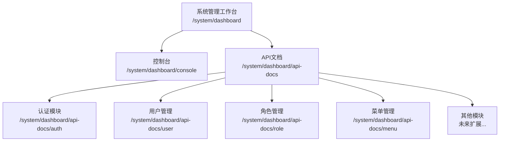
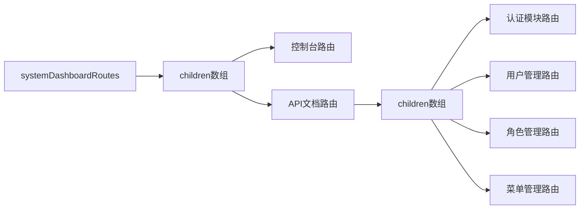
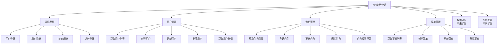
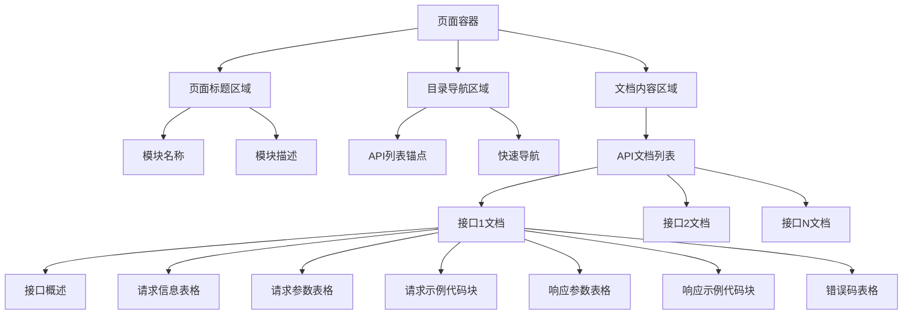
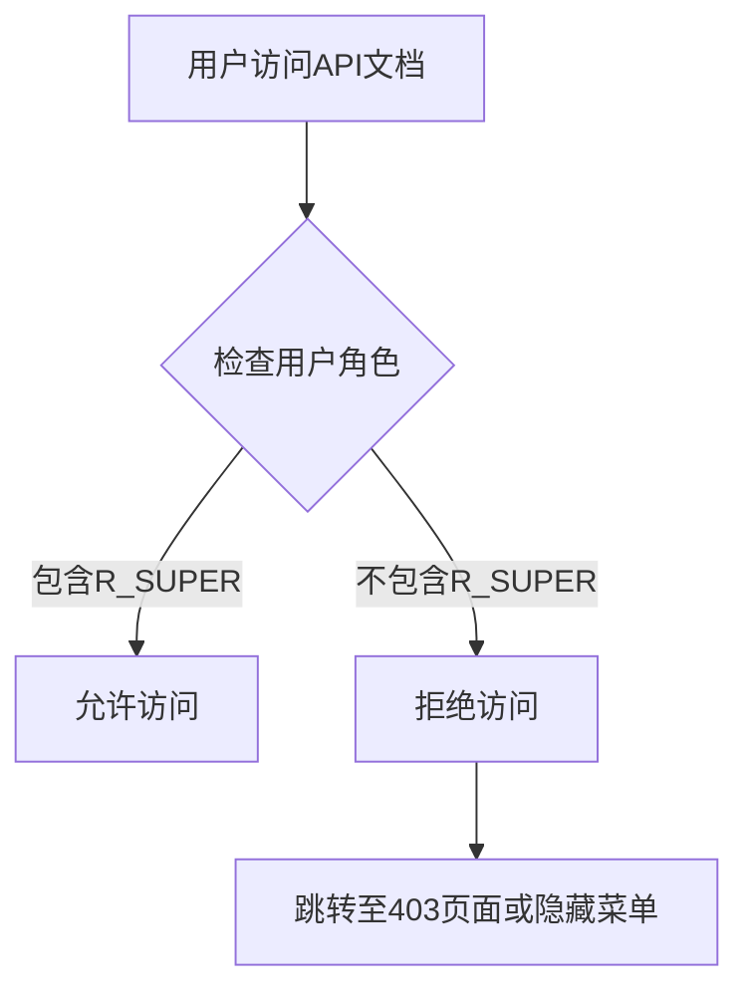
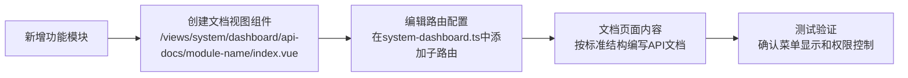

# API文档菜单功能设计

## 一、需求概述

在系统后台管理员工作台（`/system/dashboard/console`）的菜单中新增"API文档"菜单项，用于集中管理和展示项目中各功能模块的API接口文档。该菜单仅对系统后台管理员（R_SUPER角色）可见，普通用户工作台（`/user/dashboard/console`）不显示此菜单。

### 核心目标

- 为系统后台管理员提供统一的API文档入口
- 按功能模块分类组织API文档
- 提供标准化的API文档展示结构
- 支持未来功能模块的API文档扩展

## 二、菜单结构设计

### 2.1 菜单层级



### 2.2 菜单配置说明

| 菜单名称 | 路由路径 | 组件路径 | 权限角色 | 说明 |
| --- | --- | --- | --- | --- |
| API文档（父级） | `/system/dashboard/api-docs` | 布局组件 | R_SUPER | 文档目录入口 |
| 认证模块 | `/system/dashboard/api-docs/auth` | 视图组件 | R_SUPER | 登录、注册、Token等API |
| 用户管理 | `/system/dashboard/api-docs/user` | 视图组件 | R_SUPER | 用户CRUD相关API |
| 角色管理 | `/system/dashboard/api-docs/role` | 视图组件 | R_SUPER | 角色CRUD相关API |
| 菜单管理 | `/system/dashboard/api-docs/menu` | 视图组件 | R_SUPER | 菜单CRUD相关API |

## 三、路由配置设计

### 3.1 路由元数据定义

基于现有路由系统的 `RouteMeta` 接口，API文档菜单的路由元数据应包含：

| 元数据字段 | 值                                                        | 说明               |
| ---------- | --------------------------------------------------------- | ------------------ |
| title      | API文档 / 模块名称                                        | 菜单显示标题       |
| icon       | ri:file-list-3-line（父级）<br/>ri:file-text-line（子级） | 菜单图标           |
| roles      | ['R_SUPER']                                               | 仅系统管理员可访问 |
| keepAlive  | true                                                      | 保持页面缓存状态   |
| isHide     | false                                                     | 在菜单中显示       |
| isHideTab  | false                                                     | 在标签页中显示     |

### 3.2 路由层级关系



### 3.3 路由配置结构

路由配置将添加到 `/src/router/modules/system-dashboard.ts` 文件的 `children` 数组中，作为与"控制台"平级的菜单项。

路由配置应遵循以下原则：

- 父级路由使用空字符串作为组件，仅作为菜单容器
- 子级路由对应具体的视图组件
- 所有路由均设置 `roles: ['R_SUPER']` 确保权限控制
- 子级路由的 `name` 遵循驼峰命名规范，格式为 `SystemApiDoc{ModuleName}`

## 四、API文档内容结构

### 4.1 标准API文档应包含的内容

每个API文档页面应包含以下标准化内容：

| 内容模块     | 说明                         | 必填 |
| ------------ | ---------------------------- | ---- |
| 接口概述     | 接口功能的简要说明           | 是   |
| 请求地址     | API端点路径                  | 是   |
| 请求方法     | GET/POST/PUT/DELETE等        | 是   |
| 请求参数     | 参数名称、类型、必填性、说明 | 是   |
| 请求示例     | 实际请求的JSON示例           | 是   |
| 响应参数     | 返回字段名称、类型、说明     | 是   |
| 响应示例     | 成功/失败的响应JSON示例      | 是   |
| 错误码说明   | 可能的错误代码及含义         | 否   |
| 权限要求     | 需要的角色或权限标识         | 否   |
| 调用频率限制 | 接口的限流策略               | 否   |
| 更新记录     | 接口变更历史                 | 否   |

### 4.2 文档分类标准

API文档按功能模块分类，分类标准如下：



## 五、页面展示设计

### 5.1 页面布局结构

每个API文档页面采用统一的布局结构：



### 5.2 文档展示组件

文档内容使用以下UI组件进行组织：

| UI组件     | 用途                 | 来源             |
| ---------- | -------------------- | ---------------- |
| ElCard     | 包裹单个API文档      | Element Plus     |
| ElTable    | 展示参数列表和错误码 | Element Plus     |
| ElDivider  | 分隔不同内容区域     | Element Plus     |
| ElAnchor   | 页面内锚点导航       | Element Plus     |
| ElTag      | 标记请求方法、权限等 | Element Plus     |
| 代码高亮块 | 展示JSON示例         | 自定义或第三方库 |

### 5.3 交互功能

| 功能       | 说明                             |
| ---------- | -------------------------------- |
| 锚点导航   | 点击目录快速跳转到对应API文档    |
| 代码复制   | 点击按钮复制请求/响应示例代码    |
| 响应式布局 | 适配不同屏幕尺寸                 |
| 搜索过滤   | 支持按接口名称或路径搜索（可选） |

## 六、数据组织方式

### 6.1 文档数据结构

每个API文档页面的数据以结构化对象形式组织：

```
API文档对象
├── 接口名称 (字符串)
├── 接口描述 (字符串)
├── 请求路径 (字符串)
├── 请求方法 (字符串: GET | POST | PUT | DELETE)
├── 请求头 (对象数组)
│   ├── 名称
│   ├── 类型
│   ├── 必填
│   └── 说明
├── 请求参数 (对象数组)
│   ├── 名称
│   ├── 类型
│   ├── 必填
│   └── 说明
├── 请求示例 (JSON字符串)
├── 响应参数 (对象数组)
│   ├── 名称
│   ├── 类型
│   └── 说明
├── 响应示例 (JSON字符串)
├── 错误码列表 (对象数组)
│   ├── 错误码
│   ├── 错误信息
│   └── 说明
├── 权限要求 (字符串数组)
└── 更新时间 (日期字符串)
```

### 6.2 数据存储方式

API文档内容的数据存储采用以下方式：

| 存储方式         | 优势                     | 适用场景                   |
| ---------------- | ------------------------ | -------------------------- |
| 组件内硬编码     | 实现简单，无需额外接口   | 初期阶段，文档变更不频繁   |
| JSON配置文件     | 数据与视图分离，便于维护 | 文档较多，需要统一管理     |
| 后端接口动态获取 | 支持在线编辑，实时更新   | 文档需要频繁更新或协作编辑 |

**建议策略**：初期采用组件内硬编码或JSON配置文件方式，待文档管理需求明确后再考虑后端接口方案。

## 七、视图文件组织

### 7.1 文件目录结构

```
src/views/system/dashboard/
├── console/
│   └── index.vue (控制台页面)
└── api-docs/
    ├── index.vue (API文档首页，可选)
    ├── auth/
    │   └── index.vue (认证模块文档)
    ├── user/
    │   └── index.vue (用户管理文档)
    ├── role/
    │   └── index.vue (角色管理文档)
    └── menu/
        └── index.vue (菜单管理文档)
```

### 7.2 组件命名规范

| 组件类型           | 命名规范                 | 示例             |
| ------------------ | ------------------------ | ---------------- |
| 路由组件name       | SystemApiDoc{ModuleName} | SystemApiDocAuth |
| 文件名             | index.vue                | index.vue        |
| defineOptions name | SystemApiDoc{ModuleName} | SystemApiDocAuth |

## 八、权限控制

### 8.1 路由权限控制

通过路由元数据的 `roles` 字段实现权限控制：



### 8.2 菜单可见性控制

- 系统后台管理员工作台（`/system/dashboard`）：显示"API文档"菜单项
- 用户工作台（`/user/dashboard`）：不显示"API文档"菜单项

可见性控制通过路由配置的 `roles: ['R_SUPER']` 字段自动实现，无需额外代码。

## 九、扩展性设计

### 9.1 模块化扩展

当新增功能模块需要添加API文档时，按以下步骤扩展：



### 9.2 文档模板复用

为保持文档风格一致，可创建通用的文档展示组件：

| 组件名称      | 功能                  | 位置建议                         |
| ------------- | --------------------- | -------------------------------- |
| ApiDocCard    | 单个API文档的卡片容器 | src/components/business/api-doc/ |
| ApiParamTable | 参数列表表格          | src/components/business/api-doc/ |
| ApiCodeBlock  | 代码示例展示块        | src/components/business/api-doc/ |
| ApiErrorTable | 错误码列表表格        | src/components/business/api-doc/ |

这些组件可在所有API文档页面中复用，确保展示风格的一致性。

## 十、国际化支持（可选）

如果系统支持多语言，API文档的菜单标题和部分固定文案需要添加国际化配置：

| 中文文案 | 国际化Key建议                      | 位置                      |
| -------- | ---------------------------------- | ------------------------- |
| API文档  | menus.systemDashboard.apiDocs      | src/locales/langs/zh.json |
| 认证模块 | menus.systemDashboard.apiDocs.auth | src/locales/langs/zh.json |
| 用户管理 | menus.systemDashboard.apiDocs.user | src/locales/langs/zh.json |
| 角色管理 | menus.systemDashboard.apiDocs.role | src/locales/langs/zh.json |
| 菜单管理 | menus.systemDashboard.apiDocs.menu | src/locales/langs/zh.json |

**注意**：API文档的具体内容（接口地址、参数说明等）通常不需要国际化。

## 十一、实现优先级

### 11.1 核心功能（必须实现）

1. 在 `system-dashboard.ts` 中添加"API文档"路由配置
2. 创建认证模块API文档页面
3. 创建用户管理API文档页面
4. 创建角色管理API文档页面
5. 创建菜单管理API文档页面

### 11.2 增强功能（建议实现）

1. 抽象通用的API文档展示组件
2. 添加代码复制功能
3. 添加页面内锚点导航
4. 添加搜索过滤功能

### 11.3 扩展功能（未来考虑）

1. 支持在线编辑API文档
2. 支持Markdown格式文档
3. 支持API在线测试
4. 支持文档版本管理

## 十二、参考依据

### 12.1 现有路由模块参考

- `/src/router/modules/system-dashboard.ts` - 系统管理工作台路由配置
- `/src/router/modules/system.ts` - 系统管理模块路由配置
- `/src/router/modules/examples.ts` - 示例路由的嵌套菜单配置

### 12.2 现有视图组件参考

- `/src/views/system/dashboard/console/index.vue` - 控制台页面布局
- `/src/views/system/menu/index.vue` - 菜单管理页面的文档展示方式
- `/src/views/examples/permission/` - 权限控制示例

### 12.3 路由权限控制参考

- `/src/router/guards/beforeEach.ts` - 路由守卫权限验证逻辑
- `/src/directives/core/auth.ts` - 权限指令实现
- `/src/types/router/index.ts` - 路由类型定义

## 十三、路由配置详细设计

### 13.1 路由配置数据结构

在 `system-dashboard.ts` 文件的 `children` 数组中添加API文档路由配置：

```
API文档路由配置对象
├── path: 'api-docs'
├── name: 'SystemApiDocs'
├── component: '' (空字符串，仅作为菜单容器)
├── meta
│   ├── title: 'API文档'
│   ├── icon: 'ri:file-list-3-line'
│   ├── roles: ['R_SUPER']
│   └── keepAlive: true
└── children (子路由数组)
    ├── 认证模块路由
    │   ├── path: 'auth'
    │   ├── name: 'SystemApiDocAuth'
    │   ├── component: '/system/dashboard/api-docs/auth'
    │   └── meta
    │       ├── title: '认证模块'
    │       ├── icon: 'ri:shield-keyhole-line'
    │       ├── roles: ['R_SUPER']
    │       └── keepAlive: true
    ├── 用户管理路由
    │   ├── path: 'user'
    │   ├── name: 'SystemApiDocUser'
    │   ├── component: '/system/dashboard/api-docs/user'
    │   └── meta
    │       ├── title: '用户管理'
    │       ├── icon: 'ri:user-line'
    │       ├── roles: ['R_SUPER']
    │       └── keepAlive: true
    ├── 角色管理路由
    │   ├── path: 'role'
    │   ├── name: 'SystemApiDocRole'
    │   ├── component: '/system/dashboard/api-docs/role'
    │   └── meta
    │       ├── title: '角色管理'
    │       ├── icon: 'ri:user-settings-line'
    │       ├── roles: ['R_SUPER']
    │       └── keepAlive: true
    └── 菜单管理路由
        ├── path: 'menu'
        ├── name: 'SystemApiDocMenu'
        ├── component: '/system/dashboard/api-docs/menu'
        └── meta
            ├── title: '菜单管理'
            ├── icon: 'ri:menu-line'
            ├── roles: ['R_SUPER']
            └── keepAlive: true
```

### 13.2 完整路径映射表

| 路由名称 | 完整URL路径 | 组件文件路径 |
| --- | --- | --- |
| SystemApiDocs | /system/dashboard/api-docs | 无（容器路由） |
| SystemApiDocAuth | /system/dashboard/api-docs/auth | src/views/system/dashboard/api-docs/auth/index.vue |
| SystemApiDocUser | /system/dashboard/api-docs/user | src/views/system/dashboard/api-docs/user/index.vue |
| SystemApiDocRole | /system/dashboard/api-docs/role | src/views/system/dashboard/api-docs/role/index.vue |
| SystemApiDocMenu | /system/dashboard/api-docs/menu | src/views/system/dashboard/api-docs/menu/index.vue |

## 十四、API接口数据映射

### 14.1 认证模块API清单

基于 `src/api/auth.ts` 文件的实际接口：

| 接口名称     | 接口路径        | 请求方法 | 对应TypeScript类型                            |
| ------------ | --------------- | -------- | --------------------------------------------- |
| 用户登录     | /api/auth/login | POST     | Api.Auth.LoginParams → Api.Auth.LoginResponse |
| 获取用户信息 | /api/user/info  | GET      | 无参数 → Api.Auth.UserInfo                    |

### 14.2 用户管理API清单

基于 `src/api/system-manage.ts` 文件的实际接口：

| 接口名称 | 接口路径 | 请求方法 | 对应TypeScript类型 |
| --- | --- | --- | --- |
| 获取用户列表 | /api/user/list | GET | Api.SystemManage.UserSearchParams → Api.SystemManage.UserList |

### 14.3 角色管理API清单

基于 `src/api/system-manage.ts` 文件的实际接口：

| 接口名称 | 接口路径 | 请求方法 | 对应TypeScript类型 |
| --- | --- | --- | --- |
| 获取角色列表 | /api/role/list | GET | Api.SystemManage.RoleSearchParams → Api.SystemManage.RoleList |

### 14.4 菜单管理API清单

基于 `src/api/system-manage.ts` 文件的实际接口：

| 接口名称     | 接口路径             | 请求方法 | 对应TypeScript类型        |
| ------------ | -------------------- | -------- | ------------------------- |
| 获取菜单列表 | /api/v3/system/menus | GET      | 无参数 → AppRouteRecord[] |

### 14.5 类型定义参考路径

所有API相关的TypeScript类型定义位于：

- `/src/types/api/api.d.ts` - API接口类型定义
- `/src/types/router/index.ts` - 路由相关类型定义

## 十五、国际化配置详细设计

### 15.1 菜单标题国际化配置

需要在 `/src/locales/langs/zh.json` 文件的 `menus` 对象中添加以下配置：

```
menus 对象结构
└── systemDashboard (新增)
    ├── title: "系统管理工作台"
    └── apiDocs (新增)
        ├── title: "API文档"
        ├── auth: "认证模块"
        ├── user: "用户管理"
        ├── role: "角色管理"
        └── menu: "菜单管理"
```

### 15.2 国际化Key命名规范

遵循项目现有国际化命名规范：

- 父级菜单：`menus.{模块名}.{子模块名}.title`
- 子级菜单：`menus.{模块名}.{子模块名}.{功能名}`

示例：

- API文档父级：`menus.systemDashboard.apiDocs.title`
- 认证模块：`menus.systemDashboard.apiDocs.auth`

### 15.3 路由配置中的国际化引用

路由配置的 `meta.title` 字段应使用国际化Key：

```
meta: {
  title: 'menus.systemDashboard.apiDocs.title',  // 使用国际化Key
  icon: 'ri:file-list-3-line',
  roles: ['R_SUPER']
}
```

## 十六、视图组件设计规范

### 16.1 组件基础结构模板

参考 `/src/views/system/menu/index.vue` 的结构，每个API文档页面应遵循以下结构：

```
Vue组件结构
├── template 区域
│   ├── 页面容器 (class="api-doc-page art-full-height")
│   ├── 页面标题区域
│   │   ├── 模块名称 (h2)
│   │   └── 模块描述 (p)
│   └── 内容区域
│       └── ElCard (shadow="never")
│           ├── API文档列表
│           └── 每个API文档卡片
│               ├── 接口名称
│               ├── 接口信息表格
│               ├── 请求参数表格
│               ├── 请求示例代码块
│               ├── 响应参数表格
│               └── 响应示例代码块
├── script setup 区域
│   ├── defineOptions({ name: 'SystemApiDoc{ModuleName}' })
│   ├── 导入必要组件和工具
│   ├── API文档数据定义 (ref/reactive)
│   └── 工具函数定义
└── style scoped 区域
    └── 页面样式定义
```

### 16.2 组件命名规范要求

| 组件元素           | 命名规范                 | 示例              |
| ------------------ | ------------------------ | ----------------- |
| defineOptions name | SystemApiDoc{ModuleName} | SystemApiDocAuth  |
| 页面容器 class     | {module}-api-doc-page    | auth-api-doc-page |
| 数据对象变量名     | {module}ApiDocs          | authApiDocs       |
| 文件名             | index.vue                | index.vue         |

### 16.3 样式类命名规范

基于项目现有的样式规范（参考 `art-full-height`、`art-table-card` 等）：

| 样式类型 | 命名模式              | 示例              |
| -------- | --------------------- | ----------------- |
| 页面容器 | {module}-api-doc-page | auth-api-doc-page |
| 标题区域 | api-doc-header        | api-doc-header    |
| 内容区域 | api-doc-content       | api-doc-content   |
| API卡片  | api-doc-card          | api-doc-card      |
| 参数表格 | api-param-table       | api-param-table   |
| 代码块   | api-code-block        | api-code-block    |

## 十七、API文档数据结构设计

### 17.1 TypeScript接口定义

为确保类型安全，建议在 `/src/types/api/api.d.ts` 文件中扩展以下类型定义：

```
ApiDoc 命名空间（新增）
├── ApiDocItem 接口
│   ├── name: string (接口名称)
│   ├── description: string (接口描述)
│   ├── path: string (请求路径)
│   ├── method: 'GET' | 'POST' | 'PUT' | 'DELETE' (请求方法)
│   ├── headers?: ApiDocParam[] (请求头)
│   ├── params?: ApiDocParam[] (请求参数)
│   ├── requestExample: string (请求示例JSON字符串)
│   ├── responseFields?: ApiDocParam[] (响应参数)
│   ├── responseExample: string (响应示例JSON字符串)
│   ├── errorCodes?: ApiErrorCode[] (错误码列表)
│   ├── roles?: string[] (权限要求)
│   └── updatedAt?: string (更新时间)
├── ApiDocParam 接口
│   ├── name: string (参数名称)
│   ├── type: string (参数类型)
│   ├── required: boolean (是否必填)
│   └── description: string (参数说明)
└── ApiErrorCode 接口
    ├── code: string | number (错误码)
    ├── message: string (错误信息)
    └── description: string (错误说明)
```

### 17.2 认证模块示例数据结构

基于实际API接口 `fetchLogin` 的文档数据结构示例：

```
用户登录接口文档对象
├── name: "用户登录"
├── description: "用户通过用户名和密码登录系统，成功后返回访问令牌"
├── path: "/api/auth/login"
├── method: "POST"
├── params
│   ├── { name: "userName", type: "string", required: true, description: "用户账号" }
│   └── { name: "password", type: "string", required: true, description: "用户密码" }
├── requestExample: JSON字符串
│   └── { "userName": "admin", "password": "123456" }
├── responseFields
│   ├── { name: "token", type: "string", required: true, description: "访问令牌" }
│   └── { name: "refreshToken", type: "string", required: true, description: "刷新令牌" }
├── responseExample: JSON字符串
│   └── { "code": 200, "data": { "token": "eyJ...", "refreshToken": "eyJ..." } }
├── errorCodes
│   ├── { code: 401, message: "Unauthorized", description: "用户名或密码错误" }
│   └── { code: 403, message: "Forbidden", description: "账号已被禁用" }
└── roles: ["R_SUPER", "R_ADMIN", "R_USER"]
```

## 十八、实现细节规范

### 18.1 API参数表格列定义

参考 `/src/views/system/menu/index.vue` 中的表格列配置方式：

| 列名     | 字段        | 宽度   | 说明                    |
| -------- | ----------- | ------ | ----------------------- |
| 参数名称 | name        | 150    | 参数字段名              |
| 类型     | type        | 120    | 参数数据类型            |
| 必填     | required    | 80     | 是否必填，使用ElTag标记 |
| 说明     | description | 自适应 | 参数详细说明            |

### 18.2 请求方法标签颜色映射

使用 Element Plus 的 ElTag 组件，不同请求方法使用不同颜色：

| 请求方法 | ElTag type | 颜色效果 |
| -------- | ---------- | -------- |
| GET      | success    | 绿色     |
| POST     | primary    | 蓝色     |
| PUT      | warning    | 橙色     |
| DELETE   | danger     | 红色     |
| PATCH    | info       | 灰色     |

### 18.3 代码示例展示规范

代码示例使用 `<pre>` 和 `<code>` 标签，样式参考项目中现有的代码展示方式：

- 背景色：`bg-g-200`（浅灰色背景）
- 边框：`border-full-d rounded-md`（圆角边框）
- 内边距：`p-4`
- 字体：`font-mono text-xs leading-[1.5]`
- 溢出处理：`overflow-x-auto`（横向滚动）

### 18.4 响应式布局要求

页面布局需适配不同屏幕尺寸：

| 屏幕尺寸   | 布局调整                     |
| ---------- | ---------------------------- |
| >= 1200px  | 双列展示API文档卡片          |
| 768-1199px | 单列展示，适当减小卡片内边距 |
| < 768px    | 单列展示，表格横向滚动       |

## 十九、注意事项与最佳实践

### 19.1 关键注意事项

1. **权限隔离**：确保API文档菜单仅在 `/system/dashboard` 路由下可见，不影响 `/user/dashboard`
2. **路由命名**：严格遵循驼峰命名规范，避免与其他路由冲突
3. **组件复用**：优先使用 Element Plus 和项目现有组件，保持UI风格一致
4. **类型安全**：所有数据对象使用TypeScript类型约束
5. **国际化**：菜单标题必须使用国际化Key，不可硬编码中文

### 19.2 数据维护规范

1. **API文档更新**：API接口变更时，必须同步更新对应的文档数据
2. **代码示例真实性**：所有请求和响应示例使用真实有效的JSON格式
3. **敏感信息保护**：文档中不应包含真实的Token、密钥等敏感信息，使用占位符代替
4. **版本记录**：在 `updatedAt` 字段记录文档最后更新时间

### 19.3 开发最佳实践

1. **组件抽象**：相同功能的组件（如参数表格、代码块）应抽象为公共组件
2. **数据驱动**：文档内容通过数据对象渲染，而非硬编码HTML
3. **样式复用**：使用Tailwind CSS和项目现有样式类，减少自定义样式
4. **性能优化**：使用 `keepAlive: true` 缓存页面状态，避免重复渲染
5. **可维护性**：代码结构清晰，添加必要的注释说明

### 19.4 文件引用规范

组件导入使用项目配置的路径别名：

| 别名    | 实际路径   | 使用场景                                 |
| ------- | ---------- | ---------------------------------------- |
| @/      | src/       | 通用导入                                 |
| @views/ | src/views/ | 视图组件                                 |
| @utils/ | src/utils/ | 工具函数                                 |
| @api/   | src/api/   | API接口（建议使用，需确认项目是否配置）  |
| @types/ | src/types/ | 类型定义（建议使用，需确认项目是否配置） |

## 二十、实现检查清单

### 20.1 路由配置检查项

- [ ] 在 `/src/router/modules/system-dashboard.ts` 中添加API文档路由
- [ ] 父级路由 `name` 为 `SystemApiDocs`
- [ ] 父级路由 `component` 为空字符串
- [ ] 所有路由 `meta.roles` 设置为 `['R_SUPER']`
- [ ] 子路由 `name` 遵循 `SystemApiDoc{ModuleName}` 格式
- [ ] 子路由 `component` 路径正确

### 20.2 国际化配置检查项

- [ ] 在 `/src/locales/langs/zh.json` 中添加菜单标题
- [ ] 国际化Key遵循 `menus.systemDashboard.apiDocs.*` 格式
- [ ] 路由配置中 `meta.title` 使用国际化Key而非硬编码
- [ ] 英文语言文件同步添加对应翻译（如需要）

### 20.3 视图组件检查项

- [ ] 创建 `/src/views/system/dashboard/api-docs/auth/index.vue`
- [ ] 创建 `/src/views/system/dashboard/api-docs/user/index.vue`
- [ ] 创建 `/src/views/system/dashboard/api-docs/role/index.vue`
- [ ] 创建 `/src/views/system/dashboard/api-docs/menu/index.vue`
- [ ] 每个组件 `defineOptions name` 正确设置
- [ ] 组件使用 `art-full-height` 等项目通用样式类
- [ ] 数据对象使用TypeScript类型约束

### 20.4 功能实现检查项

- [ ] API文档内容完整（包含所有必填字段）
- [ ] 请求和响应示例使用真实JSON格式
- [ ] 参数表格正确展示参数信息
- [ ] 代码块支持横向滚动
- [ ] 页面适配不同屏幕尺寸
- [ ] 敏感信息使用占位符

### 20.5 测试验证检查项

- [ ] 系统管理员（R_SUPER）可以访问API文档菜单
- [ ] 普通管理员（R_ADMIN）和用户（R_USER）无法看到API文档菜单
- [ ] `/user/dashboard` 不显示API文档菜单
- [ ] 所有子菜单路由可正常访问
- [ ] 页面缓存功能正常（切换标签后状态保留）
- [ ] 菜单国际化显示正确
