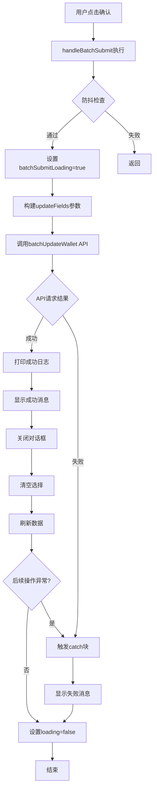
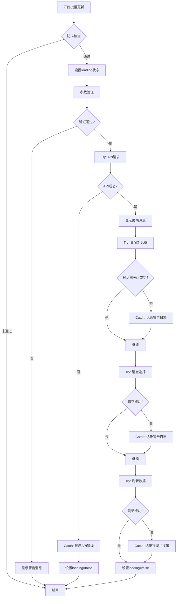
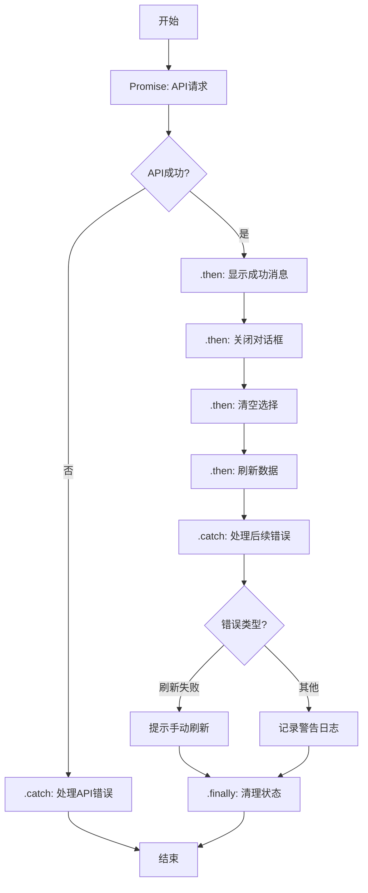

# 批量编辑功能错误处理优化设计

## 问题概述

### 当前状态

批量更新钱包功能在实际执行时存在错误处理逻辑缺陷：

- API请求成功返回（HTTP 200状态）
- 数据成功保存到数据库
- 成功消息正确显示
- 但catch块被意外触发，显示额外的"批量更新失败"错误消息

### 复现步骤

1. 选中2条数据
2. 点击批量编辑按钮
3. 选择【归属标签】字段
4. 选择替换模式
5. 值选择【团队】
6. 确认提交

### 预期行为与实际行为对比

| 维度       | 预期行为         | 实际行为         | 状态    |
| ---------- | ---------------- | ---------------- | ------- |
| 数据更新   | 成功更新到数据库 | 成功更新到数据库 | ✅ 正常 |
| API响应    | 返回200状态码    | 返回200状态码    | ✅ 正常 |
| 成功提示   | 显示成功消息     | 显示成功消息     | ✅ 正常 |
| 错误提示   | 不显示错误消息   | 额外显示错误消息 | ❌ 异常 |
| 对话框状态 | 关闭对话框       | 关闭对话框       | ✅ 正常 |
| 选择状态   | 清空选择         | 清空选择         | ✅ 正常 |
| 数据刷新   | 刷新列表数据     | 刷新列表数据     | ✅ 正常 |

## 根因分析

### 问题定位

#### 当前代码执行流程

#### 潜在异常触发点

基于代码分析，以下操作可能在成功后抛出异常：

| 序号 | 操作函数                           | 风险点                              | 影响范围 |
| ---- | ---------------------------------- | ----------------------------------- | -------- |
| 1    | `batchDialogVisible.value = false` | 对话框关闭触发的副作用或watch监听器 | 低       |
| 2    | `clearSelection()`                 | 清空选择时表格组件状态异常          | 中       |
| 3    | `refreshData()`                    | 刷新数据请求失败或数据处理异常      | 高       |

### 核心缺陷识别

#### 缺陷1：异常处理范围过大

当前try-catch块覆盖了整个操作流程，无法区分API请求失败和后续操作失败。

#### 缺陷2：错误信息丢失

catch块捕获的error对象为空`{}`，无法获取具体异常信息，导致调试困难。

#### 缺陷3：缺少细粒度错误处理

没有针对不同阶段的异常进行分类处理，导致所有异常统一显示"批量更新失败"。

## 解决方案设计

### 设计原则

1. **异常隔离原则**：将API请求与后续操作分离，避免后续操作异常影响API成功状态的识别
2. **错误透明原则**：保留完整的错误上下文信息，便于问题定位
3. **用户体验优先原则**：确保用户看到准确的操作结果反馈
4. **防御性编程原则**：对每个可能失败的操作添加独立的错误处理

### 优化方案

#### 方案一：分段错误处理（推荐）

将批量更新流程拆分为独立的阶段，每个阶段单独处理异常。

##### 执行流程设计

##### 数据结构设计

**批量更新执行上下文**

| 字段             | 类型    | 说明               | 默认值 |
| ---------------- | ------- | ------------------ | ------ |
| apiSuccess       | boolean | API请求是否成功    | false  |
| dialogClosed     | boolean | 对话框是否成功关闭 | false  |
| selectionCleared | boolean | 选择是否成功清空   | false  |
| dataRefreshed    | boolean | 数据是否成功刷新   | false  |
| updateCount      | number  | 成功更新的数量     | 0      |
| errorPhase       | string  | 错误发生阶段       | ''     |
| errorDetail      | any     | 错误详细信息       | null   |

##### 实现逻辑描述

**阶段一：API请求处理**

- 将API请求包裹在独立的try-catch块中
- 成功时记录成功状态和更新数量
- 失败时捕获具体错误信息并终止后续流程
- 无论成功失败都不影响后续阶段的错误捕获

**阶段二：对话框关闭处理**

- 使用独立的try-catch保护对话框关闭操作
- 失败时仅记录警告日志，不影响整体成功状态
- 确保对话框状态变更不会因副作用抛出异常

**阶段三：选择清空处理**

- 使用独立的try-catch保护清空选择操作
- 失败时记录警告，允许用户手动清空
- 避免表格组件状态异常传播

**阶段四：数据刷新处理**

- 使用独立的try-catch保护数据刷新操作
- 失败时提示用户手动刷新
- 记录详细错误信息以便排查

#### 方案二：Promise链式处理

使用Promise链式调用分离各阶段操作，利用Promise的错误传播机制。

##### 执行流程设计

### 增强措施

#### 措施1：错误日志增强

为每个阶段的异常添加详细的上下文信息：

| 记录内容 | 数据项                                                              |
| -------- | ------------------------------------------------------------------- |
| 错误阶段 | 'api_request' / 'dialog_close' / 'clear_selection' / 'refresh_data' |
| 错误时间 | ISO 8601格式时间戳                                                  |
| 请求参数 | walletAddresses数组、updateFields对象                               |
| 错误对象 | 完整的error对象（包括message、stack）                               |
| 用户操作 | 当前选中的字段、操作模式                                            |
| 环境信息 | 浏览器版本、用户ID                                                  |

#### 措施2：防抖优化

当前防抖机制仅检查loading状态，需要增强：

| 优化点   | 当前实现     | 改进方案                      |
| -------- | ------------ | ----------------------------- |
| 检查时机 | 函数入口     | 函数入口                      |
| 检查条件 | loading状态  | loading状态 + 时间间隔        |
| 提示方式 | console.warn | console.warn + 可选的用户提示 |
| 最小间隔 | 无           | 300ms                         |

#### 措施3：用户反馈优化

| 场景     | 当前反馈                | 优化反馈                                   |
| -------- | ----------------------- | ------------------------------------------ |
| API成功  | "成功批量更新 N 个钱包" | 保持不变                                   |
| API失败  | "批量更新失败"          | "批量更新失败：[具体错误原因]"             |
| 刷新失败 | 无提示                  | "数据更新成功，但刷新失败，请手动刷新页面" |
| 清空失败 | 无提示                  | 不提示（仅记录日志）                       |

## 实现指导

### 核心改造点

#### 改造点1：handleBatchSubmit函数结构重构

将单一try-catch改为多阶段结构：

**改造前结构**

- 外层：单一try-catch块
- 包含：参数验证、API调用、UI更新、数据刷新

**改造后结构**

- 阶段1：参数验证（同步，使用早期返回）
- 阶段2：API调用（独立try-catch）
- 阶段3：UI更新（独立try-catch，允许失败）
- 阶段4：数据刷新（独立try-catch，允许失败）
- 每个阶段记录执行状态

#### 改造点2：错误对象序列化

增强错误信息的可追踪性：

**错误信息结构**

| 字段          | 类型   | 说明                     |
| ------------- | ------ | ------------------------ |
| phase         | string | 错误阶段标识             |
| message       | string | 错误消息                 |
| originalError | Error  | 原始错误对象             |
| context       | object | 上下文信息（参数、状态） |
| timestamp     | string | 错误发生时间             |

#### 改造点3：状态管理增强

添加中间状态标记，避免状态混乱：

| 状态变量            | 类型    | 用途                   |
| ------------------- | ------- | ---------------------- |
| batchSubmitLoading  | boolean | 整体提交loading状态    |
| batchApiInProgress  | boolean | API请求进行中（新增）  |
| lastBatchSubmitTime | number  | 上次提交时间戳（新增） |

### 边界条件处理

#### 场景1：快速重复点击

- 检查loading状态
- 检查时间间隔（建议300ms）
- 静默拒绝重复请求

#### 场景2：对话框关闭失败

- 记录警告日志
- 不影响整体成功状态
- 允许用户手动关闭

#### 场景3：数据刷新失败

- 显示友好提示
- 提供手动刷新按钮
- 保留成功更新的通知

#### 场景4：网络中断

- API请求超时处理
- 显示明确的网络错误提示
- 建议用户重试

### 兼容性考虑

#### 后端兼容性

- API返回格式保持不变：`{ code: 200, message: string, data: { count: number } }`
- 不依赖后端修改，纯前端优化

#### 浏览器兼容性

- 所有改动基于ES6+特性，已有polyfill覆盖
- try-catch为基础语法，无兼容性问题

#### 组件兼容性

- 不修改ElDialog、ElTable等组件的使用方式
- 仅改进错误处理逻辑

## 测试验证

### 测试场景设计

#### 场景组1：正常流程测试

| 测试用例 | 操作步骤 | 预期结果 |
| --- | --- | --- |
| 单字段替换模式 | 选中2条数据 → 批量编辑 → 选择归属标签 → 替换为【团队】→ 确认 | 显示成功消息，不显示失败消息，数据更新正确 |
| 单字段追加模式 | 选中2条数据 → 批量编辑 → 选择归属标签 → 追加【团队】→ 确认 | 显示成功消息，原有标签保留，新标签追加 |
| 多字段混合编辑 | 选中3条数据 → 选择归属标签、主链列表、状态标签 → 确认 | 显示成功消息，所有字段更新正确 |

#### 场景组2：异常流程测试

| 测试用例     | 模拟条件                     | 预期结果                          |
| ------------ | ---------------------------- | --------------------------------- |
| API请求失败  | 断网或后端服务停止           | 仅显示API错误消息，不执行后续操作 |
| 数据刷新失败 | API成功但refreshData抛出异常 | 显示成功消息+刷新失败提示         |
| 快速重复点击 | 连续点击确认按钮             | 第二次点击被拒绝，仅执行一次更新  |

#### 场景组3：边界条件测试

| 测试用例   | 输入条件               | 预期结果                             |
| ---------- | ---------------------- | ------------------------------------ |
| 未选择字段 | 不勾选任何字段直接确认 | 显示警告：请至少选择一个要编辑的字段 |
| 空值更新   | 选择字段但不填写值     | 正常更新为空值或空数组               |
| 大批量更新 | 选中100+条数据         | 显示loading，成功后显示正确数量      |

### 验证标准

#### 成功标准

| 验证项     | 标准                                         |
| ---------- | -------------------------------------------- |
| 数据一致性 | 数据库数据与请求参数100%一致                 |
| 消息准确性 | 成功时仅显示成功消息，失败时显示明确错误原因 |
| 状态正确性 | 对话框、选择状态、loading状态符合预期        |
| 日志完整性 | 错误日志包含完整的上下文信息                 |
| 性能表现   | 防抖机制有效，重复点击被正确拦截             |

#### 回归验证

- 其他批量操作（批量删除）功能正常
- 单条编辑功能不受影响
- 随机取数功能不受影响
- 表格选择功能不受影响

## 风险评估

### 技术风险

| 风险项         | 风险等级 | 影响范围     | 缓解措施                          |
| -------------- | -------- | ------------ | --------------------------------- |
| 改造引入新bug  | 低       | 批量编辑功能 | 充分测试，分阶段发布              |
| 性能影响       | 极低     | 批量编辑功能 | 仅增加try-catch块，性能影响可忽略 |
| 状态管理复杂度 | 低       | 代码可维护性 | 添加详细注释，状态变量命名清晰    |

### 业务风险

| 风险项           | 风险等级 | 影响               | 缓解措施 |
| ---------------- | -------- | ------------------ | -------- |
| 用户操作习惯改变 | 无       | 无UI变化           | 无需缓解 |
| 数据一致性       | 无       | 不修改数据处理逻辑 | 无需缓解 |

## 推荐实施路径

### 实施阶段

### 各阶段说明

| 阶段  | 工作内容                          | 交付物           | 预估工作量 |
| ----- | --------------------------------- | ---------------- | ---------- |
| 阶段1 | 增强所有catch块的错误日志输出     | 可调试的错误信息 | 0.5小时    |
| 阶段2 | 重构handleBatchSubmit为多阶段结构 | 优化后的函数代码 | 1小时      |
| 阶段3 | 添加时间间隔防抖机制              | 防抖逻辑代码     | 0.5小时    |
| 阶段4 | 执行完整的测试用例                | 测试报告         | 1小时      |
| 阶段5 | 代码审查、部署发布                | 上线版本         | 0.5小时    |

**总计：约3.5小时**

### 优先级建议

**高优先级（必须完成）**

- 分段错误处理（解决核心问题）
- 错误日志增强（便于调试）

**中优先级（建议完成）**

- 防抖时间间隔优化
- 用户反馈消息优化

**低优先级（可选）**

- Promise链式处理改造（需要更大重构）
- 状态管理框架升级

## 后续改进建议

### 长期优化方向

1. **统一错误处理框架**
   - 抽取通用的错误处理逻辑为可复用函数
   - 建立全局错误处理策略
   - 统一错误码和错误消息规范

2. **操作可撤销机制**
   - 批量更新提供撤销功能
   - 记录操作历史
   - 支持一键恢复

3. **乐观更新策略**
   - 先更新UI，后调用API
   - 失败时回滚UI状态
   - 提升用户体验流畅度

4. **批量操作进度可视化**
   - 显示批量更新进度条
   - 实时反馈处理状态
   - 支持大批量数据处理没有针对不同阶段的异常进行分类处理，导致所有异常统一显示"批量更新失败"。

## 解决方案设计

### 设计原则

1. **异常隔离原则**：将API请求与后续操作分离，避免后续操作异常影响API成功状态的识别
2. **错误透明原则**：保留完整的错误上下文信息，便于问题定位
3. **用户体验优先原则**：确保用户看到准确的操作结果反馈
4. **防御性编程原则**：对每个可能失败的操作添加独立的错误处理

### 优化方案

#### 方案一：分段错误处理（推荐）

将批量更新流程拆分为独立的阶段，每个阶段单独处理异常。

##### 执行流程设计

##### 数据结构设计

**批量更新执行上下文**

| 字段             | 类型    | 说明               | 默认值 |
| ---------------- | ------- | ------------------ | ------ |
| apiSuccess       | boolean | API请求是否成功    | false  |
| dialogClosed     | boolean | 对话框是否成功关闭 | false  |
| selectionCleared | boolean | 选择是否成功清空   | false  |
| dataRefreshed    | boolean | 数据是否成功刷新   | false  |
| updateCount      | number  | 成功更新的数量     | 0      |
| errorPhase       | string  | 错误发生阶段       | ''     |
| errorDetail      | any     | 错误详细信息       | null   |

##### 实现逻辑描述

**阶段一：API请求处理**

- 将API请求包裹在独立的try-catch块中
- 成功时记录成功状态和更新数量
- 失败时捕获具体错误信息并终止后续流程
- 无论成功失败都不影响后续阶段的错误捕获

**阶段二：对话框关闭处理**

- 使用独立的try-catch保护对话框关闭操作
- 失败时仅记录警告日志，不影响整体成功状态
- 确保对话框状态变更不会因副作用抛出异常

**阶段三：选择清空处理**

- 使用独立的try-catch保护清空选择操作
- 失败时记录警告，允许用户手动清空
- 避免表格组件状态异常传播

**阶段四：数据刷新处理**

- 使用独立的try-catch保护数据刷新操作
- 失败时提示用户手动刷新
- 记录详细错误信息以便排查

#### 方案二：Promise链式处理

使用Promise链式调用分离各阶段操作，利用Promise的错误传播机制。

##### 执行流程设计

### 增强措施

#### 措施1：错误日志增强

为每个阶段的异常添加详细的上下文信息：

| 记录内容 | 数据项                                                              |
| -------- | ------------------------------------------------------------------- |
| 错误阶段 | 'api_request' / 'dialog_close' / 'clear_selection' / 'refresh_data' |
| 错误时间 | ISO 8601格式时间戳                                                  |
| 请求参数 | walletAddresses数组、updateFields对象                               |
| 错误对象 | 完整的error对象（包括message、stack）                               |
| 用户操作 | 当前选中的字段、操作模式                                            |
| 环境信息 | 浏览器版本、用户ID                                                  |

#### 措施2：防抖优化

当前防抖机制仅检查loading状态，需要增强：

| 优化点   | 当前实现     | 改进方案                      |
| -------- | ------------ | ----------------------------- |
| 检查时机 | 函数入口     | 函数入口                      |
| 检查条件 | loading状态  | loading状态 + 时间间隔        |
| 提示方式 | console.warn | console.warn + 可选的用户提示 |
| 最小间隔 | 无           | 300ms                         |

#### 措施3：用户反馈优化

| 场景     | 当前反馈                | 优化反馈                                   |
| -------- | ----------------------- | ------------------------------------------ |
| API成功  | "成功批量更新 N 个钱包" | 保持不变                                   |
| API失败  | "批量更新失败"          | "批量更新失败：[具体错误原因]"             |
| 刷新失败 | 无提示                  | "数据更新成功，但刷新失败，请手动刷新页面" |
| 清空失败 | 无提示                  | 不提示（仅记录日志）                       |

## 实现指导

### 核心改造点

#### 改造点1：handleBatchSubmit函数结构重构

将单一try-catch改为多阶段结构：

**改造前结构**

- 外层：单一try-catch块
- 包含：参数验证、API调用、UI更新、数据刷新

**改造后结构**

- 阶段1：参数验证（同步，使用早期返回）
- 阶段2：API调用（独立try-catch）
- 阶段3：UI更新（独立try-catch，允许失败）
- 阶段4：数据刷新（独立try-catch，允许失败）
- 每个阶段记录执行状态

#### 改造点2：错误对象序列化

增强错误信息的可追踪性：

**错误信息结构**

| 字段          | 类型   | 说明                     |
| ------------- | ------ | ------------------------ |
| phase         | string | 错误阶段标识             |
| message       | string | 错误消息                 |
| originalError | Error  | 原始错误对象             |
| context       | object | 上下文信息（参数、状态） |
| timestamp     | string | 错误发生时间             |

#### 改造点3：状态管理增强

添加中间状态标记，避免状态混乱：

| 状态变量            | 类型    | 用途                   |
| ------------------- | ------- | ---------------------- |
| batchSubmitLoading  | boolean | 整体提交loading状态    |
| batchApiInProgress  | boolean | API请求进行中（新增）  |
| lastBatchSubmitTime | number  | 上次提交时间戳（新增） |

### 边界条件处理

#### 场景1：快速重复点击

- 检查loading状态
- 检查时间间隔（建议300ms）
- 静默拒绝重复请求

#### 场景2：对话框关闭失败

- 记录警告日志
- 不影响整体成功状态
- 允许用户手动关闭

#### 场景3：数据刷新失败

- 显示友好提示
- 提供手动刷新按钮
- 保留成功更新的通知

#### 场景4：网络中断

- API请求超时处理
- 显示明确的网络错误提示
- 建议用户重试

### 兼容性考虑

#### 后端兼容性

- API返回格式保持不变：`{ code: 200, message: string, data: { count: number } }`
- 不依赖后端修改，纯前端优化

#### 浏览器兼容性

- 所有改动基于ES6+特性，已有polyfill覆盖
- try-catch为基础语法，无兼容性问题

#### 组件兼容性

- 不修改ElDialog、ElTable等组件的使用方式
- 仅改进错误处理逻辑

## 测试验证

### 测试场景设计

#### 场景组1：正常流程测试

| 测试用例 | 操作步骤 | 预期结果 |
| --- | --- | --- |
| 单字段替换模式 | 选中2条数据 → 批量编辑 → 选择归属标签 → 替换为【团队】→ 确认 | 显示成功消息，不显示失败消息，数据更新正确 |
| 单字段追加模式 | 选中2条数据 → 批量编辑 → 选择归属标签 → 追加【团队】→ 确认 | 显示成功消息，原有标签保留，新标签追加 |
| 多字段混合编辑 | 选中3条数据 → 选择归属标签、主链列表、状态标签 → 确认 | 显示成功消息，所有字段更新正确 |

#### 场景组2：异常流程测试

| 测试用例     | 模拟条件                     | 预期结果                          |
| ------------ | ---------------------------- | --------------------------------- |
| API请求失败  | 断网或后端服务停止           | 仅显示API错误消息，不执行后续操作 |
| 数据刷新失败 | API成功但refreshData抛出异常 | 显示成功消息+刷新失败提示         |
| 快速重复点击 | 连续点击确认按钮             | 第二次点击被拒绝，仅执行一次更新  |

#### 场景组3：边界条件测试

| 测试用例   | 输入条件               | 预期结果                             |
| ---------- | ---------------------- | ------------------------------------ |
| 未选择字段 | 不勾选任何字段直接确认 | 显示警告：请至少选择一个要编辑的字段 |
| 空值更新   | 选择字段但不填写值     | 正常更新为空值或空数组               |
| 大批量更新 | 选中100+条数据         | 显示loading，成功后显示正确数量      |

### 验证标准

#### 成功标准

| 验证项     | 标准                                         |
| ---------- | -------------------------------------------- |
| 数据一致性 | 数据库数据与请求参数100%一致                 |
| 消息准确性 | 成功时仅显示成功消息，失败时显示明确错误原因 |
| 状态正确性 | 对话框、选择状态、loading状态符合预期        |
| 日志完整性 | 错误日志包含完整的上下文信息                 |
| 性能表现   | 防抖机制有效，重复点击被正确拦截             |

#### 回归验证

- 其他批量操作（批量删除）功能正常
- 单条编辑功能不受影响
- 随机取数功能不受影响
- 表格选择功能不受影响

## 风险评估

### 技术风险

| 风险项         | 风险等级 | 影响范围     | 缓解措施                          |
| -------------- | -------- | ------------ | --------------------------------- |
| 改造引入新bug  | 低       | 批量编辑功能 | 充分测试，分阶段发布              |
| 性能影响       | 极低     | 批量编辑功能 | 仅增加try-catch块，性能影响可忽略 |
| 状态管理复杂度 | 低       | 代码可维护性 | 添加详细注释，状态变量命名清晰    |

### 业务风险

| 风险项           | 风险等级 | 影响               | 缓解措施 |
| ---------------- | -------- | ------------------ | -------- |
| 用户操作习惯改变 | 无       | 无UI变化           | 无需缓解 |
| 数据一致性       | 无       | 不修改数据处理逻辑 | 无需缓解 |

## 推荐实施路径

### 实施阶段

### 各阶段说明

| 阶段  | 工作内容                          | 交付物           | 预估工作量 |
| ----- | --------------------------------- | ---------------- | ---------- |
| 阶段1 | 增强所有catch块的错误日志输出     | 可调试的错误信息 | 0.5小时    |
| 阶段2 | 重构handleBatchSubmit为多阶段结构 | 优化后的函数代码 | 1小时      |
| 阶段3 | 添加时间间隔防抖机制              | 防抖逻辑代码     | 0.5小时    |
| 阶段4 | 执行完整的测试用例                | 测试报告         | 1小时      |
| 阶段5 | 代码审查、部署发布                | 上线版本         | 0.5小时    |

**总计：约3.5小时**

### 优先级建议

**高优先级（必须完成）**

- 分段错误处理（解决核心问题）
- 错误日志增强（便于调试）

**中优先级（建议完成）**

- 防抖时间间隔优化
- 用户反馈消息优化

**低优先级（可选）**

- Promise链式处理改造（需要更大重构）
- 状态管理框架升级

## 后续改进建议

### 长期优化方向

1. **统一错误处理框架**
   - 抽取通用的错误处理逻辑为可复用函数
   - 建立全局错误处理策略
   - 统一错误码和错误消息规范

2. **操作可撤销机制**
   - 批量更新提供撤销功能
   - 记录操作历史
   - 支持一键恢复

3. **乐观更新策略**
   - 先更新UI，后调用API
   - 失败时回滚UI状态
   - 提升用户体验流畅度

4. **批量操作进度可视化**
   - 显示批量更新进度条
   - 实时反馈处理状态
   - 支持大批量数据处理

#### 缺陷3：缺少细粒度错误处理
