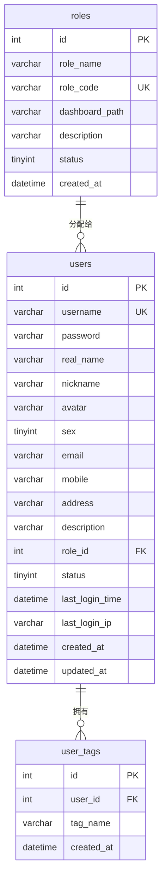
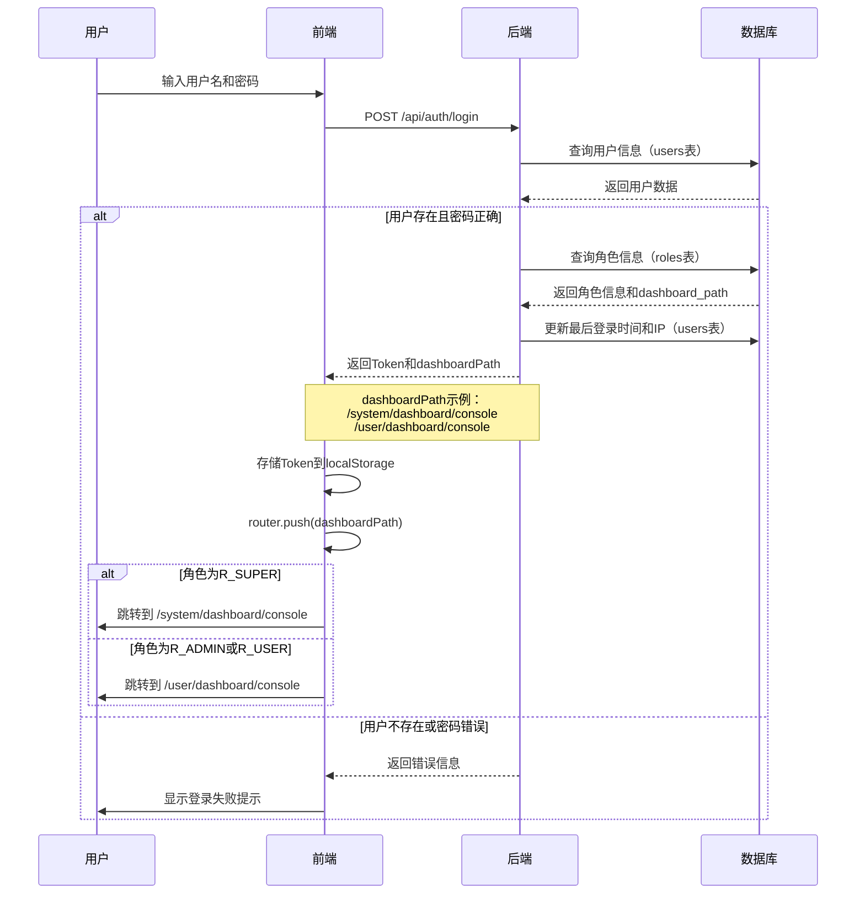
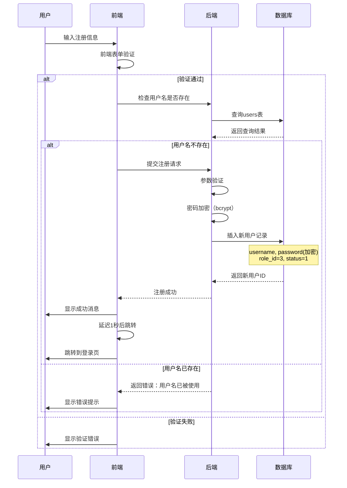
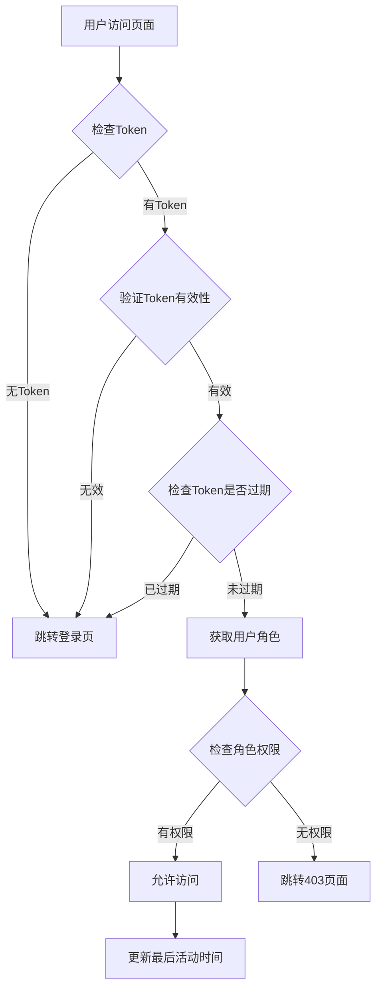
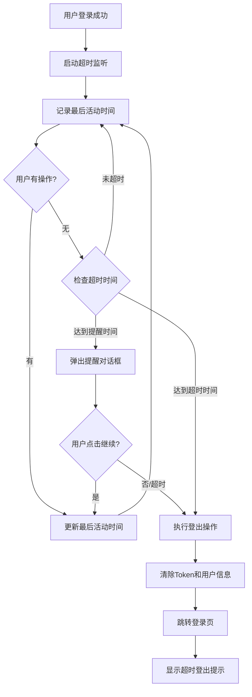
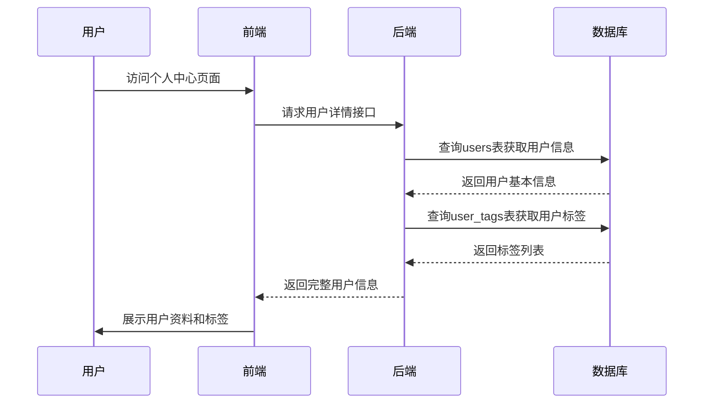
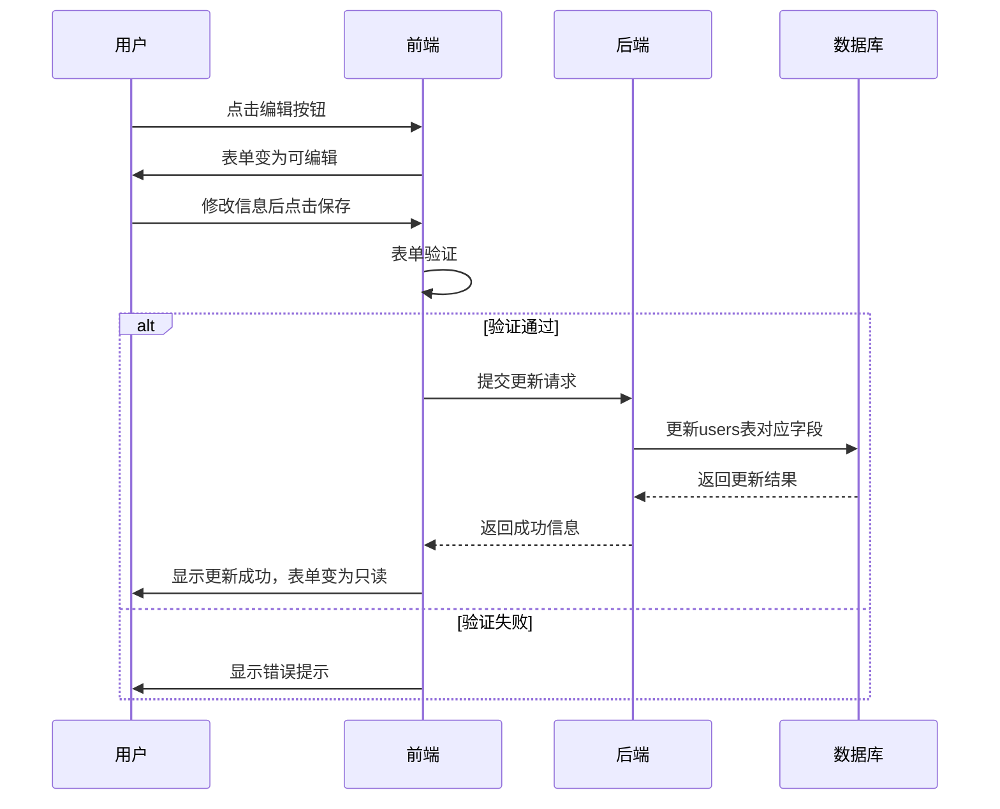
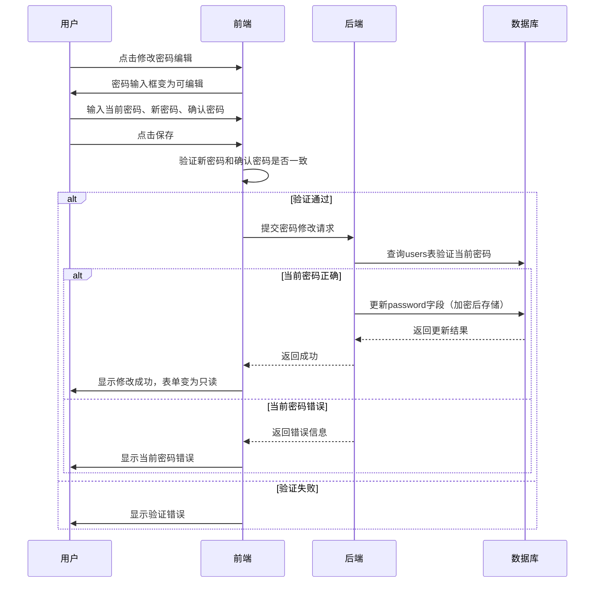
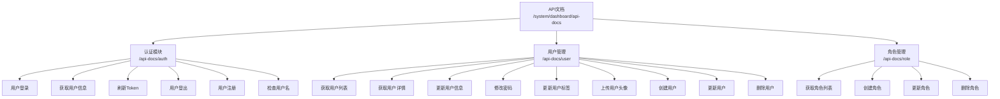

# 用户登录模块设计

## 设计目标

为虚拟币数据分析系统设计简洁实用的数据库结构，支持小规模用户（少于20人）的登录认证和权限管理功能。

## 设计原则

- 保持简单：避免过度设计，满足基本需求即可
- 快速开发：表结构清晰，易于实现
- 易于维护：字段少而精，便于后期调整

## 前端界面设计

### 1. 登录界面

**访问路径**：http://localhost:3007/#/auth/login

**功能说明**：

- 支持用户名密码登录
- 集成拖拽验证组件，提高安全性
- 支持记住密码功能
- 提供快捷账号切换（超级管理员、管理员、普通用户）

**表单字段**：

| 字段名           | 字段类型 | 是否必填 | 验证规则 | 说明     |
| ---------------- | -------- | -------- | -------- | -------- |
| username         | string   | 是       | 非空     | 用户名   |
| password         | string   | 是       | 非空     | 密码     |
| rememberPassword | boolean  | 否       | -        | 记住密码 |

**预置测试账号**：

| 角色类型   | 用户名 | 密码   | 角色标识 |
| ---------- | ------ | ------ | -------- |
| 超级管理员 | Super  | 123456 | R_SUPER  |
| 管理员     | Admin  | 123456 | R_ADMIN  |
| 普通用户   | User   | 123456 | R_USER   |

### 2. 用户个人中心界面

**访问路径**：http://localhost:3007/#/system/user-center

**功能说明**：

- 展示用户基本信息和个人资料
- 支持编辑个人信息
- 支持修改登录密码
- 展示用户个性化标签

**基本设置表单字段**：

| 界面字段 | 表单字段名 | 字段类型 | 是否必填 | 验证规则    | 说明         |
| -------- | ---------- | -------- | -------- | ----------- | ------------ |
| 姓名     | realName   | string   | 是       | 2-50字符    | 用户真实姓名 |
| 昵称     | nickname   | string   | 是       | 2-50字符    | 用户昵称     |
| 性别     | sex        | string   | 是       | 1或2        | 1-男，2-女   |
| 邮箱     | email      | string   | 是       | 邮箱格式    | 邮箱地址     |
| 手机     | mobile     | string   | 是       | 11位手机号  | 手机号码     |
| 地址     | address    | string   | 是       | 非空        | 详细地址     |
| 个人介绍 | des        | string   | 否       | 最大500字符 | 个人简介     |

**修改密码表单字段**：

| 界面字段   | 表单字段名      | 字段类型 | 是否必填 | 验证规则          | 说明         |
| ---------- | --------------- | -------- | -------- | ----------------- | ------------ |
| 当前密码   | oldPassword     | string   | 是       | 非空              | 当前登录密码 |
| 新密码     | newPassword     | string   | 是       | 非空              | 新设置的密码 |
| 确认新密码 | confirmPassword | string   | 是       | 与newPassword一致 | 确认密码     |

### 3. 注册界面

**访问路径**：http://localhost:3007/#/auth/register

**功能说明**：

- 支持新用户注册
- 用户名唯一性验证
- 密码强度验证
- 用户协议确认
- 注册成功后自动跳转登录页

**表单字段**：

| 字段名          | 字段类型 | 是否必填 | 验证规则       | 说明         |
| --------------- | -------- | -------- | -------------- | ------------ |
| username        | string   | 是       | 3-20字符，唯一 | 用户名       |
| password        | string   | 是       | 最少6位        | 密码         |
| confirmPassword | string   | 是       | 与password一致 | 确认密码     |
| agreement       | boolean  | 是       | 必须为true     | 同意用户协议 |

**验证规则**：

1. **用户名验证**：
   - 长度：3-20个字符
   - 唯一性：需要后端验证用户名是否已存在
   - 建议格式：字母、数字、下划线

2. **密码验证**：
   - 最小长度：6位
   - 建议包含：大小写字母、数字、特殊字符

3. **确认密码验证**：
   - 必须与密码字段完全一致

4. **用户协议**：
   - 必须勾选才能注册

## 后端 API 设计

### 1. 认证相关接口

#### 1.1 用户登录

**接口路径**：`POST /api/auth/login`

**请求参数**：

```
{
  "userName": "string",    // 用户名，必填
  "password": "string"     // 密码，必填
}
```

**返回数据**：

```
{
  "token": "string",           // 访问Token
  "refreshToken": "string",     // 刷新Token
  "dashboardPath": "string"     // 控制台跳转路径
}
```

**返回示例**：

```
// 系统后台管理员登录
{
  "token": "eyJhbGciOiJIUzI1NiIsInR5cCI6IkpXVCJ9...",
  "refreshToken": "eyJhbGciOiJIUzI1NiIsInR5cCI6IkpXVCJ9...",
  "dashboardPath": "/system/dashboard/console"
}

// 系统管理员/普通用户登录
{
  "token": "eyJhbGciOiJIUzI1NiIsInR5cCI6IkpXVCJ9...",
  "refreshToken": "eyJhbGciOiJIUzI1NiIsInR5cCI6IkpXVCJ9...",
  "dashboardPath": "/user/dashboard/console"
}
```

**业务逻辑**：

1. 根据userName查询users表，检查用户是否存在
2. 验证password是否匹配（使用bcrypt比对加密密码）
3. 检查用户status是否为启用状态（1）
4. 查询roles表获取用户角色信息和dashboard_path字段
5. 生成JWT Token和Refresh Token
6. 更新users表的last_login_time和last_login_ip
7. 返回Token信息和控制台跳转路径（dashboardPath）

**错误码**：

- 401：用户名或密码错误
- 403：用户已被禁用
- 500：服务器内部错误

#### 1.2 获取用户信息

**接口路径**：`GET /api/user/info`

**请求头**：

```
Authorization: Bearer {token}
```

**返回数据**：

```
{
  "userId": "number",        // 用户ID
  "userName": "string",      // 用户名
  "email": "string",         // 邮箱
  "avatar": "string",        // 头像URL
  "roles": ["string"],       // 角色数组
  "buttons": ["string"]      // 按钮权限数组
}
```

**业务逻辑**：

1. 解析Token获取userId
2. 查询users表获取用户基本信息
3. 通过role_id查询roles表获取角色信息
4. 返回用户信息（不包含password字段）

#### 1.3 刷新Token

**接口路径**：`POST /api/auth/refresh-token`

**请求头**：

```
Authorization: Bearer {refreshToken}
```

**请求参数**：

```
{
  "refreshToken": "string"   // 刷新Token
}
```

**返回数据**：

```
{
  "token": "string",           // 新的访问Token
  "refreshToken": "string"     // 新的刷新Token
}
```

**业务逻辑**：

1. 验证refreshToken的有效性
2. 检查refreshToken是否过期（有效期7天）
3. 解析refreshToken获取userId
4. 查询users表确认用户仍然存在且启用
5. 生成新的JWT Token（有效期30分钟）
6. 生成新的Refresh Token（有效期7天）
7. 返回新的Token信息

**错误码**：

- 401：Refresh Token无效或已过期
- 403：用户已被禁用
- 500：服务器内部错误

#### 1.4 用户登出

**接口路径**：`POST /api/auth/logout`

**请求头**：

```
Authorization: Bearer {token}
```

**返回数据**：

```
{
  "code": 200,
  "message": "登出成功"
}
```

**业务逻辑**：

1. 解析Token获取userId
2. （可选）将Token加入黑名单，防止复用
3. （可选）记录登出日志
4. 返回登出成功消息

**前端配合**：

- 清除本地存储的Token
- 清空用户状态
- 跳转到登录页

#### 1.5 用户注册

**接口路径**：`POST /api/auth/register`

**请求参数**：

```
{
  "username": "string",    // 用户名，必填，3-20字符
  "password": "string"     // 密码，必填，最少6位
}
```

**返回数据**：

```
{
  "code": 200,
  "message": "注册成功",
  "data": {
    "userId": "number"      // 新创建的用户ID
  }
}
```

**业务逻辑**：

1. **参数验证**：
   - 检查username长度（3-20字符）
   - 检查password长度（最少6位）
   - 验证username格式（建议：字母、数字、下划线）

2. **用户名唯一性检查**：
   - 查询users表检查username是否已存在
   - 如果存在，返回错误：“用户名已被使用”

3. **密码加密**：
   - 使用bcrypt对密码进行加密
   - 加密强度：10-12轮

4. **创建用户记录**：
   - 插入users表，设置以下字段：
     - username: 用户输入的用户名
     - password: 加密后的密码
     - role_id: 3（默认为普通用户）
     - status: 1（默认启用）
     - created_at: 当前时间
     - updated_at: 当前时间

5. **返回结果**：
   - 返回新创建的用户ID
   - 提示注册成功

**错误码**：

- 400：参数验证失败（用户名或密码不符合要求）
- 409：用户名已存在
- 500：服务器内部错误

**安全建议**：

1. **限制注册频率**：
   - 同一IP每小时最多注册3次
   - 防止恶意批量注册

2. **用户名黑名单**（可选）：
   - 禁止admin、root等敏感用户名
   - 防止保留关键词被注册

3. **邮箱验证**（可选、后期扩展）：
   - 注册时需要提供邮箱
   - 发送验证邮件
   - 激活后才能登录

#### 1.6 检查用户名是否存在

**接口路径**：`GET /api/auth/check-username`

**请求参数**：

```
?username=string    // 需要检查的用户名
```

**返回数据**：

```
{
  "code": 200,
  "data": {
    "exists": "boolean"    // true-已存在，false-可用
  }
}
```

**业务逻辑**：

1. 接收username参数
2. 查询users表检查该用户名是否存在
3. 返回检查结果

**使用场景**：

- 注册表单实时验证用户名是否可用
- 用户输入用户名后失焦时触发检查

### 2. 用户个人中心相关接口

#### 2.1 获取用户详细信息

**接口路径**：`GET /api/user/profile`

**请求头**：

```
Authorization: Bearer {token}
```

**返回数据**：

```
{
  "id": "number",
  "username": "string",
  "realName": "string",
  "nickname": "string",
  "avatar": "string",
  "sex": "number",
  "email": "string",
  "mobile": "string",
  "address": "string",
  "description": "string",
  "roleId": "number",
  "roleName": "string",
  "tags": ["string"],           // 用户标签数组
  "lastLoginTime": "string",
  "lastLoginIp": "string",
  "createdAt": "string",
  "updatedAt": "string"
}
```

**业务逻辑**：

1. 解析Token获取userId
2. 查询users表获取用户完整信息
3. 查询roles表获取角色名称
4. 查询user_tags表获取用户标签列表
5. 返回完整的用户信息（不包含password）

#### 2.2 更新用户信息

**接口路径**：`PUT /api/user/profile`

**请求头**：

```
Authorization: Bearer {token}
```

**请求参数**：

```
{
  "realName": "string",      // 姓名，必填，2-50字符
  "nickname": "string",      // 昵称，必填，2-50字符
  "sex": "number",           // 性别，必填，1或2
  "email": "string",         // 邮箱，必填，符合邮箱格式
  "mobile": "string",        // 手机，必填，11位手机号
  "address": "string",       // 地址，必填
  "description": "string"   // 个人介绍，可选，最大500字符
}
```

**返回数据**：

```
{
  "code": 200,
  "message": "更新成功"
}
```

**业务逻辑**：

1. 解析Token获取userId
2. 验证请求参数格式和长度
3. 更新users表对应字段
4. 自动更新updated_at字段
5. 返回更新结果

#### 2.3 修改密码

**接口路径**：`POST /api/user/change-password`

**请求头**：

```
Authorization: Bearer {token}
```

**请求参数**：

```
{
  "oldPassword": "string",   // 当前密码，必填
  "newPassword": "string"    // 新密码，必填
}
```

**返回数据**：

```
{
  "code": 200,
  "message": "密码修改成功"
}
```

**业务逻辑**：

1. 解析Token获取userId
2. 查询users表获取当前用户的加密密码
3. 使用bcrypt验证oldPassword是否正确
4. 如果验证成功，使用bcrypt加密newPassword
5. 更新users表的password字段
6. 返回修改结果

**错误码**：

- 400：当前密码错误
- 401：Token无效
- 500：服务器内部错误

#### 2.4 更新用户标签

**接口路径**：`POST /api/user/tags`

**请求头**：

```
Authorization: Bearer {token}
```

**请求参数**：

```
{
  "tags": ["string"]         // 标签数组
}
```

**返回数据**：

```
{
  "code": 200,
  "message": "标签更新成功"
}
```

**业务逻辑**：

1. 解析Token获取userId
2. 删除user_tags表中该用户的所有标签（WHERE user_id = userId）
3. 批量插入新的标签列表
4. 返回更新结果

#### 2.5 上传用户头像

**接口路径**：`POST /api/user/avatar`

**请求头**：

```
Authorization: Bearer {token}
Content-Type: multipart/form-data
```

**请求参数**：

```
file: 文件对象（图片文件）
```

**返回数据**：

```
{
  "code": 200,
  "message": "上传成功",
  "data": {
    "avatarUrl": "string"    // 头像URL地址
  }
}
```

**业务逻辑**：

1. 解析Token获取userId
2. 验证文件类型（只允许jpg、png、gif等图片格式）
3. 验证文件大小（建议不超过2MB）
4. 将文件上传到文件存储服务（本地或云存储）
5. 获取文件访问URL
6. 更新users表的avatar字段
7. 返回头像URL

### 3. 用户管理相关接口

#### 3.1 获取用户列表

**接口路径**:`GET /api/user/list`

**请求头**:

```
Authorization: Bearer {token}
```

**请求参数**:

```
{
  "current": "number",        // 当前页码，默认1
  "size": "number",           // 每页条数，默认20
  "userName": "string",       // 用户名，可选
  "userGender": "string",     // 性别，可选
  "userPhone": "string",      // 手机号，可选
  "userEmail": "string",      // 邮箱，可选
  "status": "string"          // 状态，可选
}
```

**返回数据**:

```
{
  "code": 200,
  "data": {
    "records": [
      {
        "id": "number",
        "avatar": "string",
        "status": "string",
        "userName": "string",
        "userGender": "string",
        "nickName": "string",
        "userPhone": "string",
        "userEmail": "string",
        "userRoles": ["string"],
        "createBy": "string",
        "createTime": "string",
        "updateBy": "string",
        "updateTime": "string"
      }
    ],
    "total": "number",
    "current": "number",
    "size": "number"
  }
}
```

**业务逻辑**:

1. 解析Token验证用户权限（需要R_SUPER角色）
2. 根据搜索条件构建查询条件
3. 查询users表获取用户列表
4. 关联roles表获取用户角色信息
5. 支持分页查询
6. 返回用户列表数据（不包含password字段）

**权限要求**: R_SUPER（系统后台管理员）

#### 3.2 创建用户

**接口路径**:`POST /api/user`

**请求头**:

```
Authorization: Bearer {token}
```

**请求参数**:

```
{
  "username": "string",       // 用户名，必填，2-20字符
  "phone": "string",          // 手机号，必填，11位手机号
  "gender": "string",         // 性别，必填，"男"或"女"
  "role": ["string"]          // 角色编码数组，必填
}
```

**返回数据**:

```
{
  "code": 200,
  "message": "创建成功",
  "data": {
    "userId": "number"         // 新创建的用户ID
  }
}
```

**业务逻辑**:

1. 解析Token验证用户权限（需要R_SUPER角色）
2. 验证用户名是否已存在
3. 验证手机号格式
4. 生成默认密码（如：123456）并使用bcrypt加密
5. 创建用户记录，设置以下字段：
   - username: 用户输入的用户名
   - password: 加密后的默认密码
   - mobile: 手机号
   - sex: 性别（"男"转为1，"女"转为2）
   - role_id: 根据角色编码查询角色ID
   - status: 1（默认启用）
   - created_at: 当前时间
6. 返回新创建的用户ID

**错误码**:

- 400：参数验证失败
- 403：权限不足
- 409：用户名已存在
- 500：服务器内部错误

**权限要求**: R_SUPER（系统后台管理员）

#### 3.3 更新用户

**接口路径**:`PUT /api/user/{id}`

**请求头**:

```
Authorization: Bearer {token}
```

**请求参数**:

```
{
  "username": "string",       // 用户名，必填，2-20字符
  "phone": "string",          // 手机号，必填，11位手机号
  "gender": "string",         // 性别，必填，"男"或"女"
  "role": ["string"]          // 角色编码数组，必填
}
```

**返回数据**:

```
{
  "code": 200,
  "message": "更新成功"
}
```

**业务逻辑**:

1. 解析Token验证用户权限（需要R_SUPER角色）
2. 验证用户是否存在
3. 如果修改了用户名，检查新用户名是否已被使用
4. 验证手机号格式
5. 更新users表对应字段：
   - username: 用户名
   - mobile: 手机号
   - sex: 性别
   - role_id: 角色ID
   - updated_at: 当前时间
6. 返回更新结果

**错误码**:

- 400：参数验证失败
- 403：权限不足
- 404：用户不存在
- 409：用户名已被使用
- 500：服务器内部错误

**权限要求**: R_SUPER（系统后台管理员）

#### 3.4 删除用户

**接口路径**:`DELETE /api/user/{id}`

**请求头**:

```
Authorization: Bearer {token}
```

**返回数据**:

```
{
  "code": 200,
  "message": "删除成功"
}
```

**业务逻辑**:

1. 解析Token验证用户权限（需要R_SUPER角色）
2. 验证用户是否存在
3. 检查是否为当前登录用户（不允许删除自己）
4. 删除user_tags表中该用户的所有标签
5. 删除users表中的用户记录（或将status设为已注销）
6. 返回删除结果

**错误码**:

- 400：不允许删除自己
- 403：权限不足
- 404：用户不存在
- 500：服务器内部错误

**权限要求**: R_SUPER（系统后台管理员）

### 4. 角色管理相关接口

#### 4.1 获取角色列表

**接口路径**:`GET /api/role/list`

**请求头**:

```
Authorization: Bearer {token}
```

**请求参数**:

```
{
  "current": "number",        // 当前页码，默认1
  "size": "number",           // 每页条数，默认20
  "roleName": "string",       // 角色名称，可选
  "roleCode": "string",       // 角色编码，可选
  "description": "string",    // 角色描述，可选
  "enabled": "boolean"        // 启用状态，可选
}
```

**返回数据**:

```
{
  "code": 200,
  "data": {
    "records": [
      {
        "roleId": "number",
        "roleName": "string",
        "roleCode": "string",
        "description": "string",
        "enabled": "boolean",
        "createTime": "string"
      }
    ],
    "total": "number",
    "current": "number",
    "size": "number"
  }
}
```

**业务逻辑**:

1. 解析Token验证用户权限（需要R_SUPER角色）
2. 根据搜索条件构建查询条件
3. 查询roles表获取角色列表
4. 支持分页查询
5. 按照id升序排列
6. 返回角色列表

**权限要求**: R_SUPER（系统后台管理员）

#### 4.2 创建角色

**接口路径**:`POST /api/role`

**请求头**:

```
Authorization: Bearer {token}
```

**请求参数**:

```
{
  "roleName": "string",       // 角色名称，必填，2-20字符
  "roleCode": "string",       // 角色编码，必填，2-50字符
  "description": "string",    // 角色描述，必填
  "enabled": "boolean"        // 启用状态，默认true
}
```

**返回数据**:

```
{
  "code": 200,
  "message": "创建成功",
  "data": {
    "roleId": "number"         // 新创建的角色ID
  }
}
```

**业务逻辑**:

1. 解析Token验证用户权限（需要R_SUPER角色）
2. 验证角色编码是否已存在
3. 创建角色记录，设置以下字段：
   - role_name: 角色名称
   - role_code: 角色编码
   - description: 角色描述
   - dashboard_path: 默认为/user/dashboard/console
   - status: 根据enabled参数设置（true为1，false为0）
   - created_at: 当前时间
4. 返回新创建的角色ID

**错误码**:

- 400：参数验证失败
- 403：权限不足
- 409：角色编码已存在
- 500：服务器内部错误

**权限要求**: R_SUPER（系统后台管理员）

#### 4.3 更新角色

**接口路径**:`PUT /api/role/{id}`

**请求头**:

```
Authorization: Bearer {token}
```

**请求参数**:

```
{
  "roleName": "string",       // 角色名称，必填，2-20字符
  "roleCode": "string",       // 角色编码，必填，2-50字符
  "description": "string",    // 角色描述，必填
  "enabled": "boolean"        // 启用状态
}
```

**返回数据**:

```
{
  "code": 200,
  "message": "更新成功"
}
```

**业务逻辑**:

1. 解析Token验证用户权限（需要R_SUPER角色）
2. 验证角色是否存在
3. 如果修改了角色编码，检查新编码是否已被使用
4. 不允许修改系统预置角色（R_SUPER、R_ADMIN、R_USER）
5. 更新roles表对应字段
6. 返回更新结果

**错误码**:

- 400：参数验证失败或不允许修改系统角色
- 403：权限不足
- 404：角色不存在
- 409：角色编码已被使用
- 500：服务器内部错误

**权限要求**: R_SUPER（系统后台管理员）

#### 4.4 删除角色

**接口路径**:`DELETE /api/role/{id}`

**请求头**:

```
Authorization: Bearer {token}
```

**返回数据**:

```
{
  "code": 200,
  "message": "删除成功"
}
```

**业务逻辑**:

1. 解析Token验证用户权限（需要R_SUPER角色）
2. 验证角色是否存在
3. 不允许删除系统预置角色（R_SUPER、R_ADMIN、R_USER）
4. 检查该角色下是否有用户，如有则不允许删除
5. 删除roles表中的角色记录
6. 返回删除结果

**错误码**:

- 400：不允许删除系统角色或该角色下有用户
- 403：权限不足
- 404：角色不存在
- 500：服务器内部错误

**权限要求**: R_SUPER（系统后台管理员）

## 前后端数据库字段对齐关系

### 1. 登录流程字段映射

| 前端字段 | 后端API字段  | 数据库字段 | 数据表 | 说明                  |
| -------- | ------------ | ---------- | ------ | --------------------- |
| username | userName     | username   | users  | 用户名                |
| password | password     | password   | users  | 密码（加密）          |
| -        | token        | -          | -      | JWT Token（后端生成） |
| -        | refreshToken | -          | -      | 刷新Token（后端生成） |

### 2. 用户信息字段映射

| 前端字段 | 后端API字段 | 数据库字段  | 数据表    | 说明         |
| -------- | ----------- | ----------- | --------- | ------------ |
| -        | userId      | id          | users     | 用户ID       |
| -        | userName    | username    | users     | 用户名       |
| realName | realName    | real_name   | users     | 真实姓名     |
| nickname | nickname    | nickname    | users     | 昵称         |
| -        | avatar      | avatar      | users     | 头像URL      |
| sex      | sex         | sex         | users     | 性别         |
| email    | email       | email       | users     | 邮箱         |
| mobile   | mobile      | mobile      | users     | 手机号       |
| address  | address     | address     | users     | 地址         |
| des      | description | description | users     | 个人介绍     |
| -        | roleId      | role_id     | users     | 角色ID       |
| -        | roleName    | role_name   | roles     | 角色名称     |
| -        | tags        | tag_name    | user_tags | 用户标签数组 |

### 3. 角色信息字段映射

| 前端字段 | 后端API字段   | 数据库字段     | 数据表 | 说明       |
| -------- | ------------- | -------------- | ------ | ---------- |
| -        | id            | id             | roles  | 角色ID     |
| -        | roleName      | role_name      | roles  | 角色名称   |
| -        | roleCode      | role_code      | roles  | 角色编码   |
| -        | dashboardPath | dashboard_path | roles  | 控制台路径 |
| -        | description   | description    | roles  | 角色描述   |
| -        | status        | status         | roles  | 角色状态   |

### 6. 用户管理字段映射

| 前端字段 | 后端 API 字段 | 数据库字段 | 数据表 | 说明             |
| -------- | ------------- | ---------- | ------ | ---------------- |
| -        | id            | id         | users  | 用户 ID          |
| -        | avatar        | avatar     | users  | 用户头像         |
| -        | status        | status     | users  | 用户状态         |
| username | userName      | username   | users  | 用户名           |
| gender   | userGender    | sex        | users  | 性别（男/女）    |
| -        | nickName      | nickname   | users  | 昵称             |
| phone    | userPhone     | mobile     | users  | 手机号           |
| -        | userEmail     | email      | users  | 邮箱             |
| role     | userRoles     | role_id    | users  | 角色数组（关联） |
| -        | createBy      | -          | -      | 创建人           |
| -        | createTime    | created_at | users  | 创建时间         |
| -        | updateBy      | -          | -      | 更新人           |
| -        | updateTime    | updated_at | users  | 更新时间         |

### 7. 角色管理字段映射

| 前端字段    | 后端 API 字段 | 数据库字段     | 数据表 | 说明       |
| ----------- | ------------- | -------------- | ------ | ---------- |
| -           | roleId        | id             | roles  | 角色 ID    |
| roleName    | roleName      | role_name      | roles  | 角色名称   |
| roleCode    | roleCode      | role_code      | roles  | 角色编码   |
| description | description   | description    | roles  | 角色描述   |
| enabled     | enabled       | status         | roles  | 启用状态   |
| -           | createTime    | created_at     | roles  | 创建时间   |
| -           | dashboardPath | dashboard_path | roles  | 控制台路径 |

### 5. 注册流程字段映射

| 前端字段        | 后端API字段 | 数据库字段 | 数据表 | 说明                  |
| --------------- | ----------- | ---------- | ------ | --------------------- |
| username        | username    | username   | users  | 用户名,唯一           |
| password        | password    | password   | users  | 密码(加密后存储)      |
| confirmPassword | -           | -          | -      | 仅前端验证,不传输后端 |
| agreement       | -           | -          | -      | 仅前端验证,不传输后端 |
| -               | -           | role_id    | users  | 默认3(普通用户)       |
| -               | -           | status     | users  | 默认1(启用)           |
| -               | userId      | id         | users  | 注册成功后返回        |

## 数据库基本信息

- **数据库类型**：MySQL 5.7
- **数据库名称**：virtualProject_dev
- **字符集**：utf8mb4
- **排序规则**：utf8mb4_general_ci

## 核心数据表设计

系统共包含3张核心数据表:

1. **users(用户表)**:存储用户基本信息、认证信息和个人资料
2. **roles(角色表)**:定义系统角色及权限配置
3. **user_tags(用户标签表)**:存储用户个性化标签

### 1. 用户表 (users)

存储系统所有用户的基本信息和认证数据。

| 字段名          | 数据类型 | 长度 | 是否必填 | 默认值            | 说明                   |
| --------------- | -------- | ---- | -------- | ----------------- | ---------------------- |
| id              | INT      | -    | 是       | 自增              | 用户ID，主键           |
| username        | VARCHAR  | 50   | 是       | -                 | 用户名，唯一，用于登录 |
| password        | VARCHAR  | 255  | 是       | -                 | 密码（加密存储）       |
| real_name       | VARCHAR  | 50   | 否       | NULL              | 真实姓名               |
| nickname        | VARCHAR  | 50   | 否       | NULL              | 昵称                   |
| avatar          | VARCHAR  | 255  | 否       | NULL              | 头像URL                |
| sex             | TINYINT  | -    | 否       | NULL              | 性别：1-男，2-女       |
| email           | VARCHAR  | 100  | 否       | NULL              | 邮箱                   |
| mobile          | VARCHAR  | 20   | 否       | NULL              | 手机号                 |
| address         | VARCHAR  | 200  | 否       | NULL              | 地址                   |
| description     | VARCHAR  | 500  | 否       | NULL              | 个人介绍               |
| role_id         | INT      | -    | 是       | 3                 | 角色ID，关联角色表     |
| status          | TINYINT  | -    | 是       | 1                 | 状态：1-启用，0-禁用   |
| last_login_time | DATETIME | -    | 否       | NULL              | 最后登录时间           |
| last_login_ip   | VARCHAR  | 50   | 否       | NULL              | 最后登录IP             |
| created_at      | DATETIME | -    | 是       | CURRENT_TIMESTAMP | 创建时间               |
| updated_at      | DATETIME | -    | 是       | CURRENT_TIMESTAMP | 更新时间（自动更新）   |

**索引设计**：

- 主键索引：id
- 唯一索引：username
- 普通索引：role_id
- 普通索引：mobile（可选，方便按手机号查询）

### 2. 角色表 (roles)

定义系统中的三种角色类型及其权限范围。

| 字段名         | 数据类型 | 长度 | 是否必填 | 默认值            | 说明                   |
| -------------- | -------- | ---- | -------- | ----------------- | ---------------------- |
| id             | INT      | -    | 是       | 自增              | 角色ID，主键           |
| role_name      | VARCHAR  | 50   | 是       | -                 | 角色名称               |
| role_code      | VARCHAR  | 50   | 是       | -                 | 角色编码，唯一         |
| dashboard_path | VARCHAR  | 200  | 是       | -                 | 登录后跳转的控制台路径 |
| description    | VARCHAR  | 200  | 否       | NULL              | 角色描述               |
| status         | TINYINT  | -    | 是       | 1                 | 状态：1-启用，0-禁用   |
| created_at     | DATETIME | -    | 是       | CURRENT_TIMESTAMP | 创建时间               |

**索引设计**：

- 主键索引：id
- 唯一索引：role_code

**预置数据**：

| id  | role_name      | role_code | dashboard_path            | description              |
| --- | -------------- | --------- | ------------------------- | ------------------------ |
| 1   | 系统后台管理员 | R_SUPER   | /system/dashboard/console | 超级管理员，拥有所有权限 |
| 2   | 系统管理员     | R_ADMIN   | /user/dashboard/console   | 系统管理员               |
| 3   | 系统用户       | R_USER    | /user/dashboard/console   | 普通用户                 |

### 3. 用户标签表 (user_tags)

存储用户的个性化标签信息。

| 字段名     | 数据类型 | 长度 | 是否必填 | 默认值            | 说明               |
| ---------- | -------- | ---- | -------- | ----------------- | ------------------ |
| id         | INT      | -    | 是       | 自增              | 标签ID，主键       |
| user_id    | INT      | -    | 是       | -                 | 用户ID，关联用户表 |
| tag_name   | VARCHAR  | 50   | 是       | -                 | 标签名称           |
| created_at | DATETIME | -    | 是       | CURRENT_TIMESTAMP | 创建时间           |

**索引设计**:

- 主键索引:id
- 普通索引:user_id
- 联合索引:(user_id, tag_name) 防止重复添加相同标签

## 数据表关系说明



**关系说明**:

1. **users 与 roles**:多对一关系
   - 一个用户对应一个角色
   - 一个角色可以分配给多个用户
   - 通过users.role_id外键关联

2. **users 与 user_tags**:一对多关系
   - 一个用户可以拥有多个标签
   - 通过user_tags.user_id外键关联

## 登录认证流程

### 登录流程



### 注册流程



## 权限控制逻辑

### 角色跳转规则

根据用户的角色类型，登录成功后跳转到不同的控制台界面：

| 角色编码 | 角色名称 | 跳转路径 | 完整URL |
| --- | --- | --- | --- |
| R_SUPER | 系统后台管理员 | /system/dashboard/console | http://localhost:3007/#/system/dashboard/console |
| R_ADMIN | 系统管理员 | /user/dashboard/console | http://localhost:3007/#/user/dashboard/console |
| R_USER | 系统用户 | /user/dashboard/console | http://localhost:3007/#/user/dashboard/console |

**跳转逻辑实现**：

1. **后端返回跳转路径**：
   - 登录接口 `POST /api/auth/login` 返回数据中包含 `dashboardPath` 字段
   - 该字段值从 `roles` 表的 `dashboard_path` 字段获取
   - 示例：R_SUPER 返回 `/system/dashboard/console`

2. **前端执行跳转**：
   - 登录成功后，接收后端返回的 `dashboardPath`
   - 存储 Token 到 localStorage
   - 使用路由跳转：`router.push(dashboardPath)`
   - 自动导航到对应角色的控制台页面

3. **跳转时机**：
   - 用户点击登录按钮
   - 后端验证成功返回 Token 和 dashboardPath
   - 前端立即执行跳转，无需用户手动操作

### 权限验证流程



### 路由守卫拦截机制

**前置守卫（beforeEach）**：

在用户访问任何路由之前执行以下验证：

1. **白名单判断**：
   - 登录页、注册页、忘记密码页等公开页面直接放行
   - 白名单路径：['/auth/login', '/auth/register', '/auth/forget-password']

2. **Token验证**：
   - 从本地存储（localStorage/sessionStorage）获取Token
   - 如果无Token，跳转到登录页，并保存redirect参数
   - 示例：`/auth/login?redirect=/system/user-center`

3. **Token有效性检查**：
   - 解析JWT Token，检查是否过期
   - 如果已过期，尝试使用Refresh Token刷新
   - 刷新失败，清除Token并跳转登录页

4. **用户信息获取**：
   - 如果用户信息未加载，调用 `/api/user/info` 接口
   - 获取用户角色和权限信息

5. **权限验证**：
   - 根据用户角色判断是否有权访问该路由
   - 无权限跳转到403页面或首页

**实现示例逻辑**：

```
白名单路径 = ['/auth/login', '/auth/register', '/auth/forget-password']

if (当前路径 in 白名单路径) {
  直接放行
} else {
  Token = 获取本地Token()

  if (!Token) {
    跳转('/auth/login?redirect=' + 当前路径)
    return
  }

  if (Token已过期) {
    尝试刷新Token()
    if (刷新失败) {
      清除Token()
      跳转('/auth/login?redirect=' + 当前路径)
      return
    }
  }

  if (!用户信息) {
    用户信息 = await 调用获取用户信息API()
  }

  if (用户无权限访问该路由) {
    跳转('/403')
    return
  }

  允许访问
}
```

### 无操作超时自动登出机制

**功能说明**：为提高系统安全性，当用户在系统中无任何操作超过设定时间后，自动登出并跳转到登录页。

**配置参数**：

| 参数名   | 推荐值                                        | 说明                     |
| -------- | --------------------------------------------- | ------------------------ |
| 超时时间 | 30分钟                                        | 用户无操作后多久自动登出 |
| 提醒时间 | 28分钟                                        | 提前多久弹出提醒         |
| 监听事件 | mousemove, keydown, click, scroll, touchstart | 视为用户活动的事件       |

**实现逻辑**：



**前端实现方案**：

1. **初始化超时监听**：
   - 用户登录成功后启动监听
   - 使用 `setInterval` 每隔一定时间（如1分钟）检查一次

2. **监听用户活动**：
   - 监听鼠标移动、键盘输入、点击、滚动等事件
   - 任何活动发生时，更新 `lastActivityTime`

3. **定时检查**：
   - 计算当前时间与 `lastActivityTime` 的差值
   - 如果超过提醒时间，弹出提醒对话框
   - 如果超过超时时间，执行登出

4. **提醒对话框**：
   - 显示倒计时（如：“2分钟后将自动登出”）
   - 提供“继续使用”按钮，点击后重置计时器

5. **自动登出执行**：
   - 清除本地存储的Token和用户信息
   - 清空 Pinia Store 中的用户状态
   - 跳转到登录页，显示提示消息

**后端配合机制**：

1. **Token过期时间**：
   - JWT Token 设置过期时间为 30分钟（与前端超时时间一致）
   - Refresh Token 过期时间为 7天

2. **Token刷新机制**：
   - 提供 `/api/auth/refresh-token` 接口
   - 前端在Token即将过期时自动刷新

3. **并发登录检测**（可选）：
   - 记录用户最后活动时间到数据库（users.last_login_time）
   - 检测同一账号在不同设备登录，可选择强制登出旧会话

**安全增强建议**：

1. **敏感操作二次验证**：
   - 修改密码、更改邮箱等敏感操作需要重新验证密码

2. **记录登录日志**（可选）：
   - 记录登录时间、IP、设备信息等
   - 定期清理过期日志

3. **多设备管理**（可选）：
   - 允许用户查看当前登录设备列表
   - 支持远程登出指定设备

## 初始化数据建议

### 默认管理员账号

系统初始化时建议创建一个超级管理员账号：

- **用户名**：admin
- **密码**：需加密后存储（建议使用bcrypt）
- **角色**：super_admin（id=1）
- **状态**：启用

## 用户个人中心业务流程

### 查询用户信息流程



### 更新用户信息流程



### 修改密码流程



## 数据安全建议

### 密码存储

- 使用bcrypt或类似的单向加密算法
- 不存储明文密码
- 密码字段长度设置为255以适应加密后的长度

### 敏感信息保护

- 用户密码必须加密存储
- API响应中不返回密码字段
- 登录失败次数可考虑添加限制（后期扩展）

## 后期扩展预留

虽然当前设计保持简洁，但预留了以下扩展能力：

1. **用户表**：预留了email、mobile字段，便于后续增加多因素认证
2. **角色表**：可通过新增记录扩展更多角色类型
3. **用户标签**：支持灵活添加用户个性化标签
4. **索引设计**：为常用查询字段建立索引，保证查询性能

## 建表SQL语句参考结构

由于设计文档不包含具体代码实现，建表SQL将由开发人员根据以上表结构定义编写，需要注意：

- 设置正确的字符集和排序规则
- 添加适当的索引以优化查询性能
- 为自增字段设置合理的起始值
- 为必填字段添加NOT NULL约束
- 为datetime字段设置默认值和自动更新
- 为外键字段添加合适的约束或说明

## API文档系统集成

### 集成概述

为了在系统后台管理员工作台中提供统一的API文档查阅入口,需要将本设计文档中的API接口按功能模块分类整合到 `http://localhost:3007/#/system/dashboard/api-docs/` 路径下。

根据 `add-api-doc-menu-item.md` 的设计规范,需要将本文档中定义的20个API接口按以下模块组织:

- **认证模块**:6个接口(登录、注册、Token管理等)
- **用户管理模块**:11个接口(个人信息、密码、标签、头像管理、用户CRUD)
- **角色管理模块**:3个接口(角色列表查询、角色CRUD)

### 实施目标

1. 将本文档中定义的所有API接口补充到API文档系统
2. 按照标准化的文档结构组织内容
3. 确保与现有API文档的风格保持一致
4. 如有冲突,以本文档内容为准

### 需要补充的API接口清单

#### 认证模块 (路径:/system/dashboard/api-docs/auth)

现有接口:

- ✅ POST /api/auth/login - 用户登录
- ✅ GET /api/user/info - 获取用户信息

需要新增:

- ➕ POST /api/auth/refresh-token - 刷新Token
- ➕ POST /api/auth/logout - 用户登出
- ➕ POST /api/auth/register - 用户注册
- ➕ GET /api/auth/check-username - 检查用户名是否存在

#### 用户管理模块 (路径:/system/dashboard/api-docs/user)

现有接口:

- ✅ GET /api/user/list - 获取用户列表

需要新增:

- ➕ GET /api/user/profile - 获取用户详情
- ➕ PUT /api/user/profile - 更新用户信息
- ➕ POST /api/user/change-password - 修改密码
- ➕ POST /api/user/tags - 更新用户标签
- ➕ POST /api/user/avatar - 上传用户头像
- ➕ POST /api/user - 创建用户
- ➕ PUT /api/user/{id} - 更新用户
- ➕ DELETE /api/user/{id} - 删除用户

#### 角色管理模块 (路径:/system/dashboard/api-docs/role)

现有接口:

- ✅ GET /api/role/list - 获取角色列表

需要新增:

- ➕ POST /api/role - 创建角色
- ➕ PUT /api/role/{id} - 更新角色
- ➕ DELETE /api/role/{id} - 删除角色

### API文档菜单结构

根据本设计文档中的API接口,应在API文档菜单中创建以下模块:



### 模块详细设计

#### 1. 认证模块API文档

**路由路径**:`/system/dashboard/api-docs/auth`

**组件名称**:`SystemApiDocAuth`

**文件路径**:`src/views/system/dashboard/api-docs/auth/index.vue`

**模块描述**:包含用户登录、注册、Token管理等认证相关的API接口文档。

**包含API接口**:

| 序号 | 接口名称           | 接口路径                     | 请求方法 | 文档位置      |
| ---- | ------------------ | ---------------------------- | -------- | ------------- |
| 1    | 用户登录           | POST /api/auth/login         | POST     | 本文档第1.1节 |
| 2    | 获取用户信息       | GET /api/user/info           | GET      | 本文档第1.2节 |
| 3    | 刷新Token          | POST /api/auth/refresh-token | POST     | 本文档第1.3节 |
| 4    | 用户登出           | POST /api/auth/logout        | POST     | 本文档第1.4节 |
| 5    | 用户注册           | POST /api/auth/register      | POST     | 本文档第1.5节 |
| 6    | 检查用户名是否存在 | GET /api/auth/check-username | GET      | 本文档第1.6节 |

**文档展示内容**:

每个API接口应包含:

- 接口名称和描述
- 请求地址和请求方法
- 请求头(如需要)
- 请求参数表格(参数名、类型、必填、说明)
- 请求示例JSON
- 响应参数表格
- 响应示例JSON(成功/失败)
- 错误码说明
- 业务逻辑说明

**关键点**:

- 登录接口返回的`dashboardPath`字段用于角色跳转
- Token有效期:AccessToken 30分钟,RefreshToken 7天
- 注册默认角色为R_USER(普通用户)

---

#### 2. 用户管理模块API文档

**路由路径**:`/system/dashboard/api-docs/user`

**组件名称**:`SystemApiDocUser`

**文件路径**:`src/views/system/dashboard/api-docs/user/index.vue`

**模块描述**:包含用户个人信息管理、密码修改、标签管理、头像上传、用户CRUD等相关的API接口文档。

**包含API接口**:

| 序号 | 接口名称     | 接口路径                       | 请求方法 | 文档位置      | 权限要求 |
| ---- | ------------ | ------------------------------ | -------- | ------------- | -------- |
| 1    | 获取用户列表 | GET /api/user/list             | GET      | 本文档第3.1节 | R_SUPER  |
| 2    | 获取用户详情 | GET /api/user/profile          | GET      | 本文档第2.1节 | 当前用户 |
| 3    | 更新用户信息 | PUT /api/user/profile          | PUT      | 本文档第2.2节 | 当前用户 |
| 4    | 修改密码     | POST /api/user/change-password | POST     | 本文档第2.3节 | 当前用户 |
| 5    | 更新用户标签 | POST /api/user/tags            | POST     | 本文档第2.4节 | 当前用户 |
| 6    | 上传用户头像 | POST /api/user/avatar          | POST     | 本文档第2.5节 | 当前用户 |
| 7    | 创建用户     | POST /api/user                 | POST     | 本文档第3.2节 | R_SUPER  |
| 8    | 更新用户     | PUT /api/user/{id}             | PUT      | 本文档第3.3节 | R_SUPER  |
| 9    | 删除用户     | DELETE /api/user/{id}          | DELETE   | 本文档第3.4节 | R_SUPER  |

**关键点**:

- 获取用户详情包含基本信息、角色信息和标签列表
- 修改密码需要验证旧密码
- 更新标签支持批量替换
- 头像上传使用multipart/form-data格式
- 用户列表、创建、更新、删除接口仅R_SUPER角色可访问

---

#### 3. 角色管理模块API文档

**路由路径**:`/system/dashboard/api-docs/role`

**组件名称**:`SystemApiDocRole`

**文件路径**:`src/views/system/dashboard/api-docs/role/index.vue`

**模块描述**:包含系统角色查询和管理相关的API接口文档。

**包含API接口**:

| 序号 | 接口名称     | 接口路径              | 请求方法 | 文档位置      | 权限要求 |
| ---- | ------------ | --------------------- | -------- | ------------- | -------- |
| 1    | 获取角色列表 | GET /api/role/list    | GET      | 本文档第4.1节 | R_SUPER  |
| 2    | 创建角色     | POST /api/role        | POST     | 本文档第4.2节 | R_SUPER  |
| 3    | 更新角色     | PUT /api/role/{id}    | PUT      | 本文档第4.3节 | R_SUPER  |
| 4    | 删除角色     | DELETE /api/role/{id} | DELETE   | 本文档第4.4节 | R_SUPER  |

**关键点**:

- 返回所有角色的完整信息,包括`dashboardPath`字段
- 系统预置三种角色:R_SUPER、R_ADMIN、R_USER
- 不允许修改或删除系统预置角色
- 删除角色前需检查该角色下是否有用户
- 仅R_SUPER角色可访问角色管理所有接口

### 技术实现指导

#### 数据结构定义

根据 `add-api-doc-menu-item.md` 的规范,建议在 `src/types/api/api.d.ts` 中定义以下类型:

```typescript
namespace ApiDoc {
  // API文档项接口
  interface ApiDocItem {
    name: string // 接口名称
    description: string // 接口描述
    path: string // 请求路径
    method: 'GET' | 'POST' | 'PUT' | 'DELETE' // 请求方法
    headers?: ApiDocParam[] // 请求头
    params?: ApiDocParam[] // 请求参数
    requestExample: string // 请求示例JSON
    responseFields?: ApiDocParam[] // 响应参数
    responseExample: string // 响应示例JSON
    errorCodes?: ApiErrorCode[] // 错误码列表
    businessLogic?: string[] // 业务逻辑步骤
  }

  // API参数接口
  interface ApiDocParam {
    name: string // 参数名称
    type: string // 参数类型
    required: boolean // 是否必填
    description: string // 参数说明
  }

  // API错误码接口
  interface ApiErrorCode {
    code: string | number // 错误码
    message: string // 错误信息
    description: string // 错误说明
  }
}
```

#### 组件开发规范

1. **组件命名**:
   - 路由name:`SystemApiDoc{ModuleName}`
   - defineOptions name:与路由name一致
   - 文件名:index.vue

2. **数据组织**:
   - 使用ref或reactive定义API文档数据
   - 变量命名:`{module}ApiDocs`,如 `authApiDocs`

3. **UI组件使用**:
   - 使用ElCard包裹每个API接口文档
   - 使用ElTable展示参数列表和错误码表
   - 使用ElTag标记请求方法:
     - GET: type="success"
     - POST: type="primary"
     - PUT: type="warning"
     - DELETE: type="danger"
   - 使用ElDivider分隔不同接口

4. **样式规范**:
   - 页面容器:使用 `art-full-height` 类
   - 代码块样式:
     ```html
     <pre class="bg-g-200 border-full-d rounded-md p-4 overflow-x-auto">
       <code class="font-mono text-xs leading-[1.5]">{{ jsonExample }}</code>
     </pre>
     ```

5. **国际化配置**:
   - 在 `/src/locales/langs/zh.json` 中添加:
     ```json
     {
       "menus": {
         "systemDashboard": {
           "apiDocs": {
             "title": "API文档",
             "auth": "认证模块",
             "user": "用户管理",
             "role": "角色管理"
           }
         }
       }
     }
     ```

#### 路由配置

在 `src/router/modules/system-dashboard.ts` 中添加:

```typescript
{
  path: 'api-docs',
  name: 'SystemApiDocs',
  component: '',  // 空字符串,仅作为菜单容器
  meta: {
    title: 'menus.systemDashboard.apiDocs.title',
    icon: 'ri:file-list-3-line',
    roles: ['R_SUPER'],
    keepAlive: true
  },
  children: [
    {
      path: 'auth',
      name: 'SystemApiDocAuth',
      component: '/system/dashboard/api-docs/auth',
      meta: {
        title: 'menus.systemDashboard.apiDocs.auth',
        icon: 'ri:shield-keyhole-line',
        roles: ['R_SUPER'],
        keepAlive: true
      }
    },
    {
      path: 'user',
      name: 'SystemApiDocUser',
      component: '/system/dashboard/api-docs/user',
      meta: {
        title: 'menus.systemDashboard.apiDocs.user',
        icon: 'ri:user-line',
        roles: ['R_SUPER'],
        keepAlive: true
      }
    },
    {
      path: 'role',
      name: 'SystemApiDocRole',
      component: '/system/dashboard/api-docs/role',
      meta: {
        title: 'menus.systemDashboard.apiDocs.role',
        icon: 'ri:user-settings-line',
        roles: ['R_SUPER'],
        keepAlive: true
      }
    }
  ]
}
```

#### 实施步骤

**阶段1:准备工作**

- 在 `src/types/api/api.d.ts` 中添加TypeScript类型定义
- 在 `src/locales/langs/zh.json` 和 `en.json` 中添加国际化配置
- 在 `src/router/modules/system-dashboard.ts` 中添加路由配置

**阶段2:创建组件目录**

- 创建 `src/views/system/dashboard/api-docs/` 目录
- 在该目录下创建三个子目录:auth/、user/、role/
- 每个子目录下创建 index.vue 文件

**阶段3:编写API文档组件**

- 按照模块顺序依次编写三个模块的组件
- 每个组件包含:
  - 模块标题和描述
  - API接口列表(按照本文档的结构)
  - 每个接口的完整文档内容

**阶段4:测试验证**

- 使用R_SUPER角色登录,验证菜单显示
- 访问每个模块,检查内容渲染
- 使用R_ADMIN或R_USER角色登录,确认菜单不可见
- 检查响应式布局在不同屏幕尺寸下的表现

**阶段5:优化增强**

- 添加代码复制功能
- 添加页面内锚点导航
- 优化移动端展示

### 注意事项

1. **内容优先级**:
   - 所有涉及本文档中已定义的API接口,以本文档内容为准
   - 如果 `add-api-doc-menu-item.md` 中已有的接口与本文档冲突,应更新为本文档的描述

2. **权限控制**:
   - 所有API文档页面仅对 R_SUPER 角色可见
   - 路由配置中必须设置 `meta.roles: ['R_SUPER']`

3. **样式统一**:
   - 使用 Element Plus 组件
   - 遵循项目现有样式规范
   - 请求方法使用 ElTag 并根据方法类型显示不同颜色:
     - GET: success (绿色)
     - POST: primary (蓝色)
     - PUT: warning (橙色)
     - DELETE: danger (红色)

4. **代码示例格式**:
   - 使用 `<pre><code>` 标签
   - JSON示例需要格式化(缩进2个空格)
   - 敏感信息使用占位符(如 Token 使用 "eyJ...")

5. **国际化配置**:
   - 菜单标题必须使用国际化Key
   - 需要在 `/src/locales/langs/zh.json` 和 `/src/locales/langs/en.json` 中添加对应翻译

### API接口清单

以下是本文档中定义的所有API接口,需要集成到API文档系统:

**认证模块** (6个接口):

- [ ] POST /api/auth/login - 用户登录
- [ ] GET /api/user/info - 获取用户信息
- [ ] POST /api/auth/refresh-token - 刷新Token
- [ ] POST /api/auth/logout - 用户登出
- [ ] POST /api/auth/register - 用户注册
- [ ] GET /api/auth/check-username - 检查用户名是否存在

**用户管理模块** (11个接口):

- [ ] GET /api/user/list - 获取用户列表
- [ ] GET /api/user/profile - 获取用户详情
- [ ] PUT /api/user/profile - 更新用户信息
- [ ] POST /api/user/change-password - 修改密码
- [ ] POST /api/user/tags - 更新用户标签
- [ ] POST /api/user/avatar - 上传用户头像
- [ ] POST /api/user - 创建用户
- [ ] PUT /api/user/{id} - 更新用户
- [ ] DELETE /api/user/{id} - 删除用户

**角色管理模块** (4个接口):

- [ ] GET /api/role/list - 获取角色列表
- [ ] POST /api/role - 创建角色
- [ ] PUT /api/role/{id} - 更新角色
- [ ] DELETE /api/role/{id} - 删除角色

**接口总计**: 21个

### 后续工作

1. 根据本文档的API接口设计,创建或更新对应的API文档页面组件
2. 确保每个接口文档包含完整的请求/响应示例和参数说明
3. 添加代码复制功能,方便开发者复制请求/响应示例
4. 添加页面内锚点导航,快速跳转到对应API接口
5. 测试验证权限控制,确保R_SUPER角色可访问,其他角色不可见
