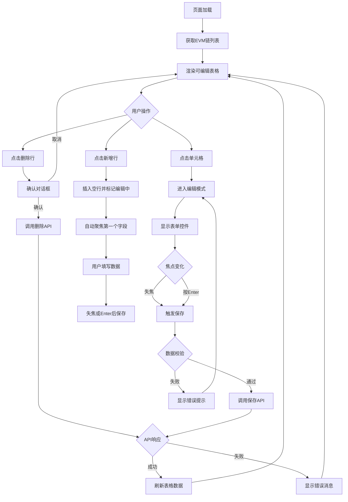
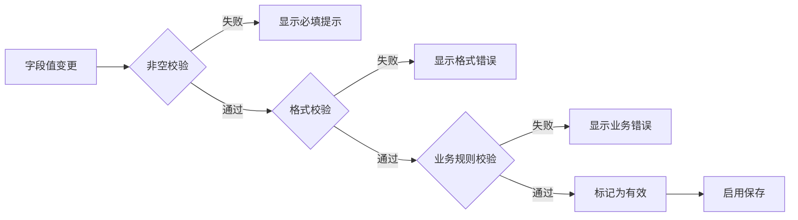
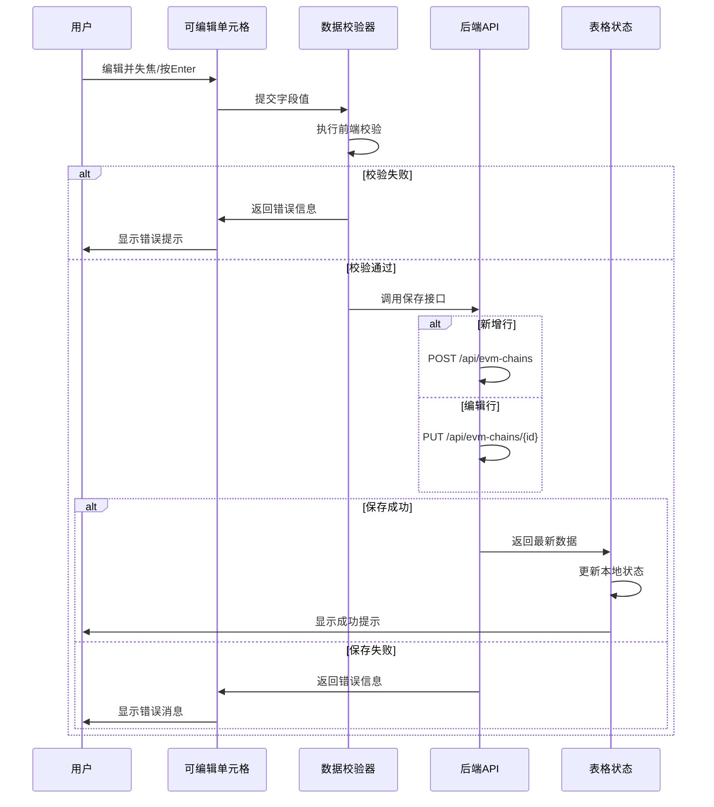
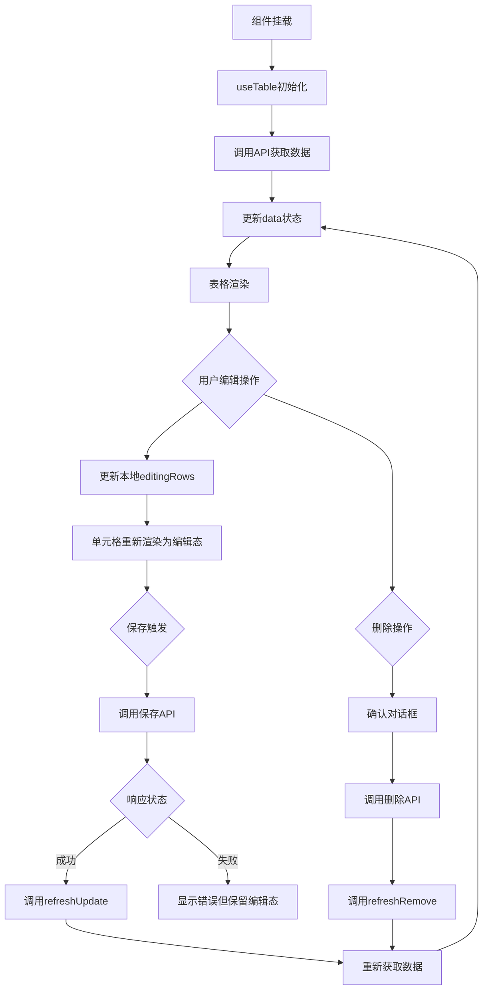

# EVM链可编辑表格功能设计

## 功能概述

为区块链管理模块提供类Excel的可编辑表格体验,允许用户直接在表格单元格中编辑EVM链配置信息,并支持行列的增删操作。该功能旨在提升数据录入和维护效率,保持与现有系统UI风格的一致性。

## 业务场景

- 快速批量添加和配置多条EVM链数据
- 在表格中直接修改链配置参数,无需打开对话框
- 灵活管理链列表,支持删除单行或批量删除
- 实时数据校验和保存反馈

## 核心需求

### 必需功能

1. 单元格内联编辑能力
2. 行级数据增删操作
3. 数据实时校验与保存
4. 编辑状态可视化反馈
5. 保持现有UI风格统一性

### 非必需功能

1. 列的动态增删(暂不支持,保持固定列结构)
2. 撤销/重做功能(后续迭代考虑)
3. 批量导入导出(利用现有ArtExcelImport/Export组件)

## 技术方案选型

### 方案对比

#### 方案一: 高级表格 + Element Plus Table-v2

| 维度       | 评估                             |
| ---------- | -------------------------------- |
| 技术栈     | 需引入Element Plus虚拟化表格组件 |
| 实现复杂度 | 中等,需适配Table-v2 API          |
| 性能       | 虚拟滚动,适合大数据量            |
| UI一致性   | 需要额外样式适配                 |
| 维护成本   | 引入新组件,学习成本较高          |

#### 方案二: 现有ArtTable + 自定义可编辑单元格(推荐)

| 维度       | 评估                           |
| ---------- | ------------------------------ |
| 技术栈     | 基于现有ArtTable组件扩展       |
| 实现复杂度 | 低,利用现有useTable和formatter |
| 性能       | 适合中小数据量(预期少于1000条) |
| UI一致性   | 完全兼容现有风格               |
| 维护成本   | 低,复用现有架构                |

### 推荐方案: 方案二

**选择理由:**

1. EVM链数据量通常不超过100条,无需虚拟滚动
2. 完全复用现有useTable Hook的数据管理能力
3. 通过ElInput、ElInputNumber等组件实现内联编辑
4. 保持与系统其他表格页面的体验一致性
5. 开发和维护成本最低

## 设计方案

### 数据模型

#### EVM链数据结构

| 字段名         | 类型    | 说明           | 校验规则         |
| -------------- | ------- | -------------- | ---------------- |
| id             | number  | 主键ID         | 自动生成         |
| name           | string  | 链名称         | 必填,最大50字符  |
| chainId        | number  | Chain ID       | 必填,正整数,唯一 |
| rpcUrl         | string  | RPC地址        | 必填,URL格式     |
| explorerUrl    | string  | 区块浏览器地址 | 可选,URL格式     |
| nativeCurrency | string  | 原生代币符号   | 必填,最大10字符  |
| status         | number  | 状态           | 1-启用/0-禁用    |
| isEditing      | boolean | 编辑状态标识   | 仅前端使用       |

### 交互流程



### 编辑模式切换策略

#### 单元格编辑状态管理

- 行级编辑标识: 每行数据添加 `isEditing` 标识
- 单元格级别: 通过prop映射确定当前编辑字段
- 编辑模式激活: 单击单元格即进入编辑
- 编辑模式退出: 失焦、按Enter键、按Esc键

#### 编辑控件映射表

| 字段           | 编辑组件      | 配置                             |
| -------------- | ------------- | -------------------------------- |
| name           | ElInput       | placeholder: "请输入链名称"      |
| chainId        | ElInputNumber | 仅数字,无控制按钮,最小值1        |
| rpcUrl         | ElInput       | placeholder: "https://..."       |
| explorerUrl    | ElInput       | placeholder: "https://..."       |
| nativeCurrency | ElInput       | placeholder: "如: ETH"           |
| status         | ElSwitch      | active-value=1, inactive-value=0 |

### 数据校验规则

#### 前端校验



#### 校验规则表

| 规则类型 | 字段 | 校验逻辑 | 错误提示 |
| --- | --- | --- | --- |
| 必填 | name, chainId, rpcUrl, nativeCurrency | 不能为空 | "该字段为必填项" |
| 格式 | rpcUrl, explorerUrl | URL正则匹配 | "请输入有效的URL地址" |
| 唯一性 | chainId | 前端查重 + 后端验证 | "Chain ID已存在" |
| 数值范围 | chainId | 大于0的整数 | "请输入有效的Chain ID" |
| 长度限制 | name | ≤50字符 | "链名称不能超过50个字符" |
| 长度限制 | nativeCurrency | ≤10字符 | "代币符号不能超过10个字符" |

### 保存策略

#### 保存时机

- 单元格失焦时自动保存
- 按下Enter键时保存当前单元格
- 点击行外区域时保存当前编辑行
- 新增行完成必填字段后触发保存

#### 保存逻辑



### UI组件设计

#### 表格列定义

| 列名       | 宽度  | 可编辑 | 渲染方式                             |
| ---------- | ----- | ------ | ------------------------------------ |
| 序号       | 60px  | 否     | 索引列                               |
| 链名称     | 120px | 是     | 编辑态: ElInput / 展示态: 文本       |
| Chain ID   | 100px | 是     | 编辑态: ElInputNumber / 展示态: 文本 |
| RPC地址    | 200px | 是     | 编辑态: ElInput / 展示态: 文本       |
| 浏览器地址 | 200px | 是     | 编辑态: ElInput / 展示态: 文本       |
| 原生代币   | 100px | 是     | 编辑态: ElInput / 展示态: 文本       |
| 状态       | 80px  | 是     | ElSwitch(始终可交互)                 |
| 操作       | 150px | 否     | 删除按钮 + 编辑状态指示器            |

#### 可编辑单元格渲染逻辑

通过ArtTable的formatter功能实现条件渲染:

- **展示态**: 显示纯文本或格式化值
- **编辑态**: 渲染对应的表单控件(ElInput/ElInputNumber等)
- **切换依据**: `row.isEditing && activeCell === prop`

#### 状态指示器

| 状态       | 视觉表现                  |
| ---------- | ------------------------- |
| 正常       | 默认样式                  |
| 编辑中     | 单元格高亮边框(蓝色)      |
| 验证错误   | 单元格红色边框 + 错误图标 |
| 保存中     | 行级Loading遮罩           |
| 新增未保存 | 整行浅黄色背景            |

### 操作按钮设计

#### 表格头部操作栏

| 按钮     | 图标     | 功能                         | 位置       |
| -------- | -------- | ---------------------------- | ---------- |
| 新增链   | Plus     | 在表格首行插入新行并进入编辑 | 左侧       |
| 批量导入 | Upload   | 利用ArtExcelImport导入       | 左侧       |
| 导出数据 | Download | 利用ArtExcelExport导出       | 左侧       |
| 刷新     | Refresh  | 重新获取数据                 | 右侧工具栏 |

#### 行级操作按钮

| 按钮 | 图标   | 功能               | 显示条件       |
| ---- | ------ | ------------------ | -------------- |
| 删除 | Delete | 删除当前行         | 始终显示       |
| 保存 | Check  | 手动保存当前行     | 编辑中且有变更 |
| 取消 | Close  | 取消编辑并恢复原值 | 编辑中         |

### 数据流设计

#### 状态管理

利用现有useTable Hook管理数据状态:

| 状态             | 说明               | 来源           |
| ---------------- | ------------------ | -------------- |
| data             | EVM链列表数据      | useTable返回   |
| loading          | 加载状态           | useTable返回   |
| pagination       | 分页信息           | useTable返回   |
| editingRows      | 正在编辑的行ID集合 | 本地响应式状态 |
| activeCell       | 当前激活单元格标识 | 本地响应式状态 |
| validationErrors | 校验错误映射       | 本地响应式状态 |

#### 数据更新流程



### API接口定义

#### 接口规范

| 接口     | 方法   | 路径                         | 说明              |
| -------- | ------ | ---------------------------- | ----------------- |
| 获取列表 | GET    | /api/evm-chains              | 支持分页和搜索    |
| 创建链   | POST   | /api/evm-chains              | 新增一条EVM链配置 |
| 更新链   | PUT    | /api/evm-chains/{id}         | 更新指定ID的配置  |
| 删除链   | DELETE | /api/evm-chains/{id}         | 删除指定链        |
| 批量删除 | POST   | /api/evm-chains/batch-delete | 删除多条记录      |

#### 请求与响应结构

**获取列表请求参数**

| 参数    | 类型   | 必填 | 说明            |
| ------- | ------ | ---- | --------------- |
| current | number | 否   | 当前页码,默认1  |
| size    | number | 否   | 每页条数,默认10 |
| name    | string | 否   | 链名称模糊搜索  |
| status  | number | 否   | 状态过滤        |

**获取列表响应结构**

| 字段         | 类型   | 说明     |
| ------------ | ------ | -------- |
| code         | number | 状态码   |
| message      | string | 提示信息 |
| data.records | array  | 数据列表 |
| data.total   | number | 总记录数 |
| data.current | number | 当前页   |
| data.size    | number | 每页条数 |

**创建/更新请求体**

| 字段           | 类型   | 必填 | 说明         |
| -------------- | ------ | ---- | ------------ |
| name           | string | 是   | 链名称       |
| chainId        | number | 是   | Chain ID     |
| rpcUrl         | string | 是   | RPC地址      |
| explorerUrl    | string | 否   | 浏览器地址   |
| nativeCurrency | string | 是   | 原生代币符号 |
| status         | number | 是   | 状态值       |

**标准响应格式**

| 字段    | 类型        | 说明           |
| ------- | ----------- | -------------- |
| code    | number      | 200表示成功    |
| message | string      | 操作结果提示   |
| data    | object/null | 返回的数据对象 |

### 路由与权限

#### 路由配置

- 路径: `/blockchain/evm-chain`
- 组件: `views/blockchain/evm-chain/index.vue`
- 菜单名称: EVM链管理
- 父级菜单: 区块链管理

#### 权限控制

| 操作     | 权限标识                    | 说明         |
| -------- | --------------------------- | ------------ |
| 查看列表 | blockchain:evm-chain:list   | 基础查看权限 |
| 新增链   | blockchain:evm-chain:add    | 创建新记录   |
| 编辑链   | blockchain:evm-chain:edit   | 修改已有记录 |
| 删除链   | blockchain:evm-chain:delete | 删除记录     |

### 错误处理

#### 错误类型与处理

| 错误场景     | 处理策略                                 |
| ------------ | ---------------------------------------- |
| 网络请求失败 | ElMessage显示错误信息,保留编辑态允许重试 |
| 数据校验失败 | 单元格红色边框 + 错误提示,聚焦到错误字段 |
| 后端业务错误 | 显示后端返回的message,如"Chain ID已存在" |
| 并发编辑冲突 | 提示数据已被更新,刷新最新数据            |

#### 用户提示规范

- 成功提示: 使用ElMessage.success,持续时间2秒
- 错误提示: 使用ElMessage.error,持续时间3秒
- 警告提示: 使用ElMessage.warning,持续时间2.5秒
- 确认对话框: 删除操作使用ElMessageBox.confirm

### 性能优化

#### 优化措施

| 场景         | 优化方案                                   |
| ------------ | ------------------------------------------ |
| 频繁编辑     | 防抖处理,300ms延迟后触发保存               |
| 大量数据     | 利用useTable的分页能力,每页显示10-20条     |
| 重复请求     | 启用useTable缓存机制,缓存时间5分钟         |
| 数据变更刷新 | 使用refreshUpdate保持当前页,避免回到第一页 |

### 国际化配置

#### 需要新增的国际化键

| 键名                               | 中文              | 英文                               |
| ---------------------------------- | ----------------- | ---------------------------------- |
| blockchain.evmChain.title          | EVM链管理         | EVM Chain Management               |
| blockchain.evmChain.addChain       | 添加链            | Add Chain                          |
| blockchain.evmChain.chainName      | 链名称            | Chain Name                         |
| blockchain.evmChain.chainId        | Chain ID          | Chain ID                           |
| blockchain.evmChain.rpcUrl         | RPC地址           | RPC URL                            |
| blockchain.evmChain.explorerUrl    | 浏览器地址        | Explorer URL                       |
| blockchain.evmChain.nativeCurrency | 原生代币          | Native Currency                    |
| blockchain.evmChain.status         | 状态              | Status                             |
| blockchain.evmChain.deleteConfirm  | 确定要删除该链吗? | Are you sure to delete this chain? |
| blockchain.evmChain.saveSuccess    | 保存成功          | Save successfully                  |
| blockchain.evmChain.deleteSuccess  | 删除成功          | Delete successfully                |

配置路径: `src/locales/langs/zh.json` 和 `src/locales/langs/en.json`

### 可访问性设计

#### 键盘操作支持

| 按键      | 功能                             |
| --------- | -------------------------------- |
| Tab       | 切换到下一个可编辑单元格         |
| Shift+Tab | 切换到上一个可编辑单元格         |
| Enter     | 保存当前单元格并移动到下一行同列 |
| Esc       | 取消编辑并恢复原值               |
| 上下箭头  | 在编辑模式外,切换选中行          |

#### ARIA属性

- 可编辑单元格添加 `role="gridcell"` 和 `aria-readonly="false"`
- 加载状态添加 `aria-busy="true"`
- 错误提示关联 `aria-describedby` 指向错误信息元素

## 实现要点

### 核心实现逻辑

1. **可编辑单元格组件化**

   通过条件渲染实现编辑态和展示态切换,伪代码示例:

   ```
   if (row.isEditing && activeCell === currentProp):
     渲染 ElInput/ElInputNumber 等编辑组件
   else:
     渲染格式化后的文本或Tag组件
   ```

2. **编辑状态管理**
   - 维护 `editingRows: Set<number>` 记录正在编辑的行ID
   - 维护 `activeCell: { rowId, prop }` 记录当前激活的单元格
   - 维护 `originalData: Map<number, Record>` 备份原始数据用于取消操作

3. **数据同步与刷新**
   - 新增成功: 调用 `refreshCreate()` 回到第一页
   - 编辑成功: 调用 `refreshUpdate()` 保持当前页
   - 删除成功: 调用 `refreshRemove()` 智能处理页码

4. **校验集成**
   - 使用ElForm的validateField方法进行单字段校验
   - 保存前执行全表单校验确保数据完整性
   - 校验失败时阻止保存并高亮错误字段

### 组件复用策略

| 功能       | 复用组件                         |
| ---------- | -------------------------------- |
| 表格容器   | ArtTable                         |
| 表格工具栏 | ArtTableHeader                   |
| 数据管理   | useTable Hook                    |
| 导入功能   | ArtExcelImport                   |
| 导出功能   | ArtExcelExport                   |
| 表单控件   | ElInput, ElInputNumber, ElSwitch |
| 操作按钮   | ArtButtonTable                   |

### 开发清单

- [ ] 创建可编辑单元格通用组件或工具函数
- [ ] 实现编辑状态管理逻辑
- [ ] 集成数据校验与错误提示
- [ ] 实现保存和删除API调用
- [ ] 添加键盘操作支持
- [ ] 补充国际化配置
- [ ] 编写单元测试覆盖核心逻辑
- [ ] 进行用户交互体验测试

## 风险与限制

### 潜在风险

| 风险                 | 影响         | 缓解措施                                |
| -------------------- | ------------ | --------------------------------------- |
| 并发编辑冲突         | 数据覆盖     | 实现乐观锁,保存前检查版本号             |
| 大量数据性能         | 渲染卡顿     | 强制分页限制,每页最多50条               |
| 网络波动导致保存失败 | 数据丢失     | 本地暂存编辑数据,支持重试               |
| 浏览器兼容性         | 部分功能异常 | 测试主流浏览器(Chrome, Firefox, Safari) |

### 功能限制

1. 不支持列的动态增删,列结构固定
2. 不支持多人协同编辑实时同步
3. 单次批量导入限制在100条以内
4. 不支持单元格级别的撤销/重做

## 测试建议

### 功能测试要点

| 测试项   | 测试内容                                        |
| -------- | ----------------------------------------------- |
| 编辑功能 | 单元格点击进入编辑,失焦/Enter保存,Esc取消       |
| 数据校验 | 必填项验证,格式验证,唯一性验证                  |
| 新增操作 | 插入新行,填写必填字段,保存后正确刷新            |
| 删除操作 | 单行删除,批量删除,确认对话框                    |
| 分页功能 | 翻页后编辑状态清除,删除最后一页最后一条自动回退 |
| 错误处理 | API失败提示,网络异常提示,校验错误提示           |

### 性能测试

- 测试100条数据的编辑响应时间
- 测试分页切换速度
- 测试批量操作性能

### 兼容性测试

- Chrome 最新版和前两个大版本
- Firefox 最新版
- Safari 最新版
- Edge 最新版

## 后续优化方向

1. 引入虚拟滚动支持超大数据量(1000+条)
2. 实现批量编辑模式一次性修改多行
3. 添加操作历史记录和撤销/重做功能
4. 支持自定义列显示和顺序拖拽
5. 集成WebSocket实现多人协同编辑
6. 增加数据版本管理和变更历史追溯
