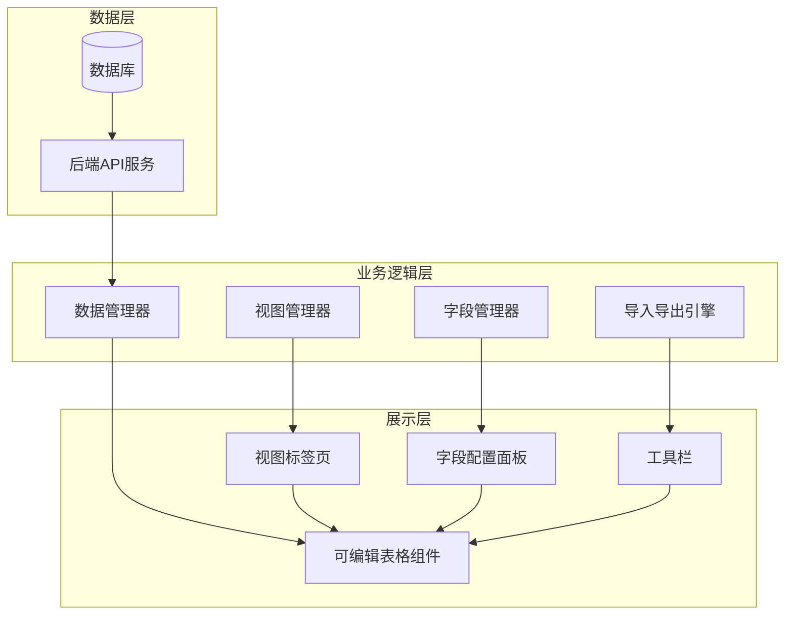
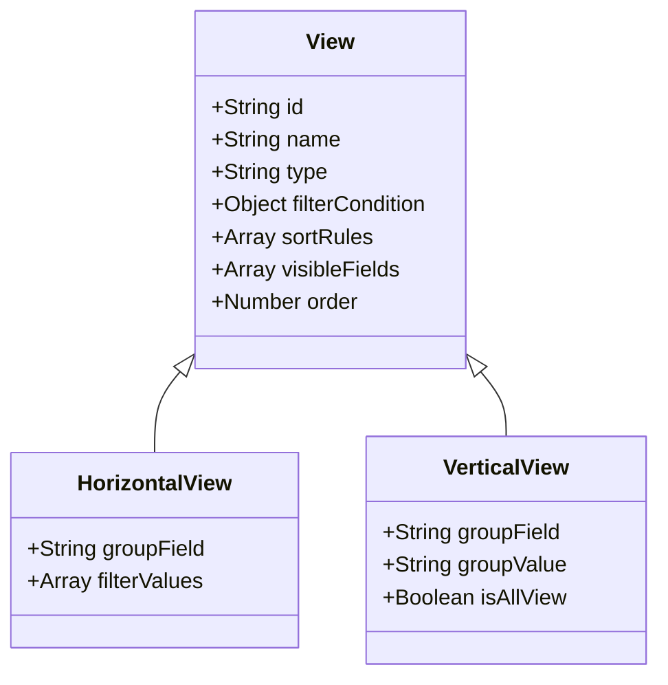
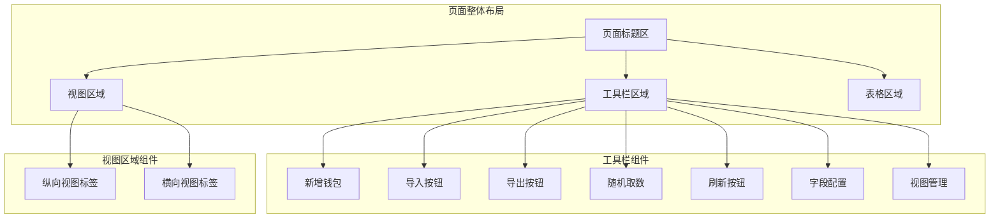
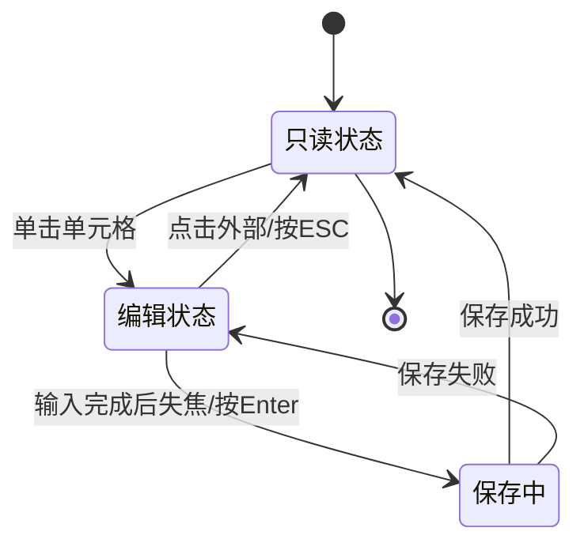
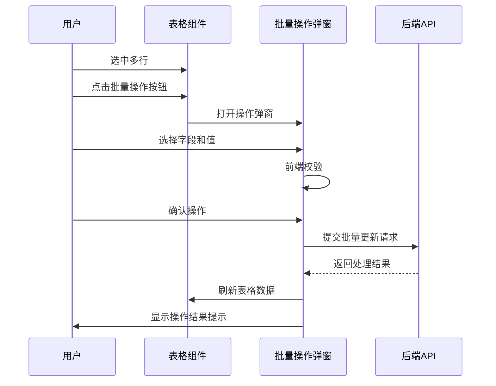
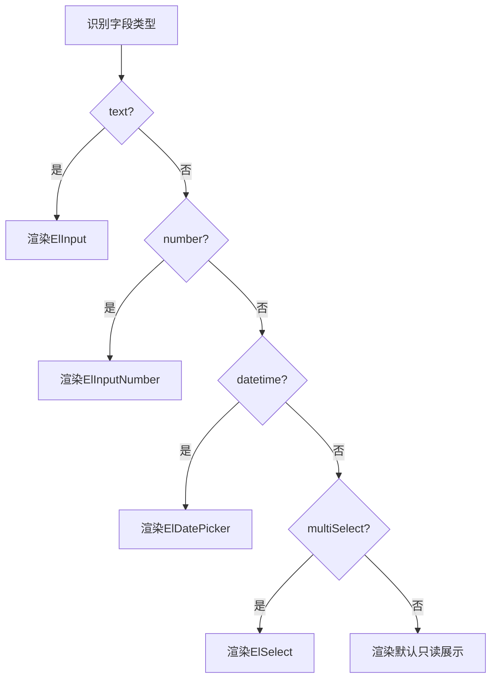
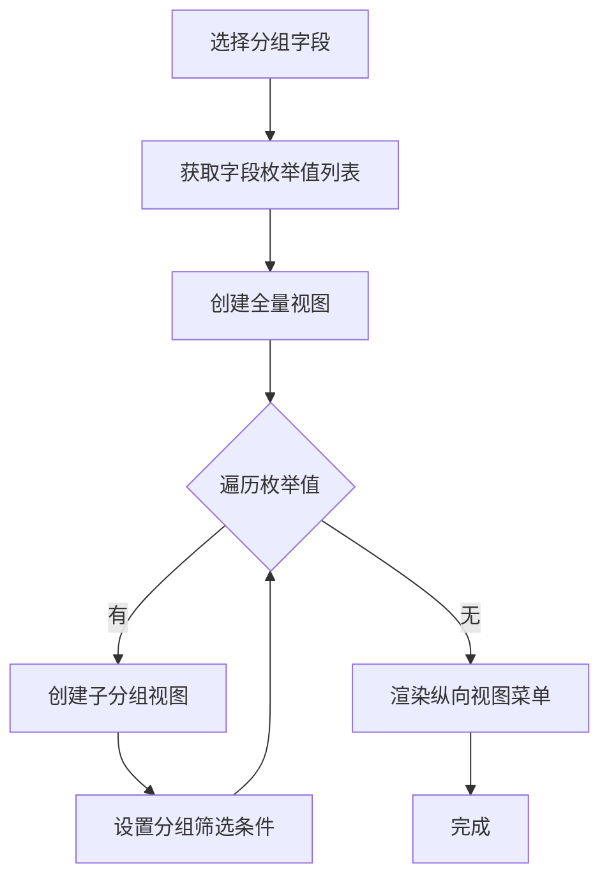
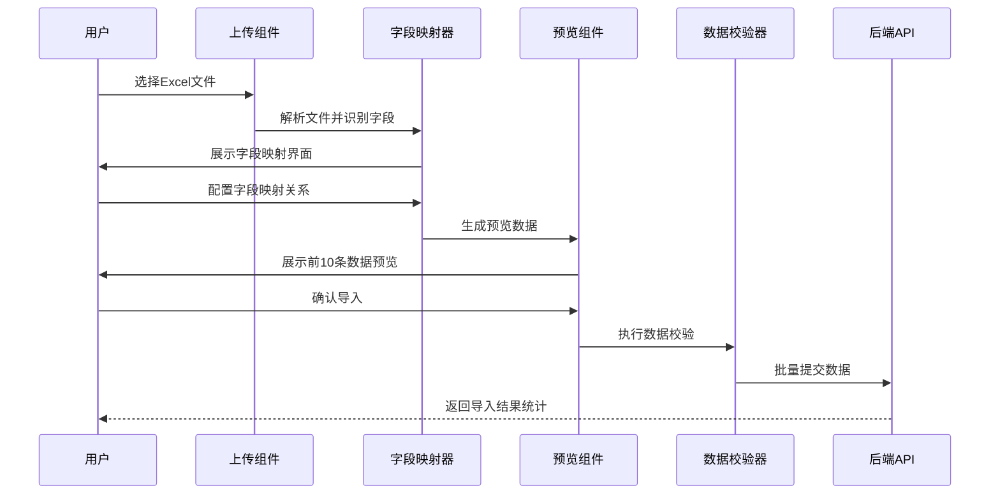
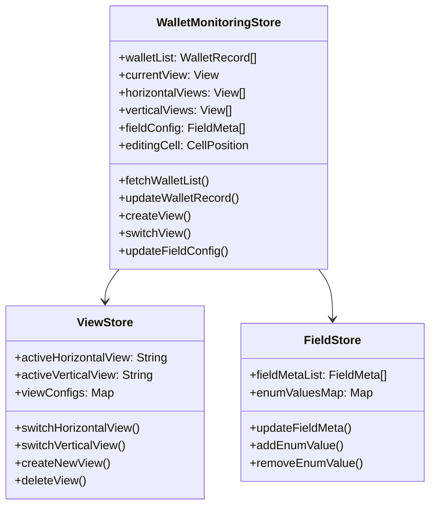

# EVM钱包监控表格功能设计文档

## 一、需求概述

### 1.1 业务目标

为EVM链钱包地址提供专业的监控和管理功能，支持用户通过类Excel可编辑表格对钱包地址进行录入、分析、分类和监控，并提供灵活的数据导入导出与API集成能力。

### 1.2 核心价值

- 提供直观的Excel式编辑体验，降低用户操作门槛
- 支持灵活的视图管理，满足不同维度的数据分析需求
- 通过API集成实现自动化数据更新，减少人工维护成本
- 提供完善的数据导入导出能力，便于数据迁移和备份

### 1.3 设计原则

- 保持与现有系统UI风格一致性
- 复用现有表格组件能力（ArtTable、useTable）
- 渐进式增强，优先实现核心功能
- 遵循响应式设计，适配不同屏幕尺寸

## 二、功能架构

### 2.1 整体架构图



### 2.2 核心模块职责

| 模块名称 | 主要职责 | 技术方案 |
| --- | --- | --- |
| 可编辑表格组件 | 实现单元格级别的编辑能力 | 基于ArtTable扩展，结合Element Plus表单组件 |
| 视图管理器 | 管理横向和纵向视图的创建、切换、数据过滤 | Pinia状态管理 + 本地缓存 |
| 字段管理器 | 管理字段元数据、枚举值、校验规则 | 动态表单配置 + useTable列配置 |
| 导入导出引擎 | 处理Excel导入导出、字段映射、数据预览 | 复用ArtExcelImport/Export组件 |
| 数据管理器 | 处理CRUD操作、缓存管理、API调用 | 基于useTable Hook扩展 |

## 三、数据模型设计

### 3.1 钱包监控记录数据结构

**重要说明**：MySQL 5.7不支持原生数组类型，多选字段需要使用JSON类型存储。MySQL 5.7从5.7.8版本开始支持原生JSON数据类型，可以高效存储和查询JSON数据。

| 字段名 | 数据库类型 | 应用层类型 | 必填 | 描述 | 默认值 |
| --- | --- | --- | --- | --- | --- |
| id | VARCHAR(36) | String | 是 | 逻辑主键（UUID） | 系统生成 |
| walletAddress | VARCHAR(42) | String | 是 | 钱包地址（42位十六进制） | - |
| ownership | JSON | Array | 否 | 归属标签（多选，存储为JSON数组） | '[]' |
| lastQueryTime | DATETIME | DateTime | 否 | 查询更新时间 | null |
| totalValue | DECIMAL(20,2) | Number | 否 | 钱包总价值（USD） | 0 |
| mainChains | JSON | Array | 否 | 主链列表（多选，存储为JSON数组） | '[]' |
| addressActivity | INT | Number | 否 | 地址活跃天数 | 0 |
| activityTags | JSON | Array | 否 | 活动标签（多选，存储为JSON数组） | '[]' |
| categoryTags | JSON | Array | 否 | 分类标签（多选，存储为JSON数组） | '[]' |
| status | JSON | Array | 否 | 状态标签（多选，存储为JSON数组） | '[]' |
| alertMark | JSON | Array | 否 | 警报标记（多选，存储为JSON数组） | '[]' |
| remark | TEXT | String | 否 | 备注信息 | '' |
| createdAt | DATETIME | DateTime | 是 | 创建时间 | CURRENT_TIMESTAMP |
| updatedAt | DATETIME | DateTime | 是 | 更新时间 | CURRENT_TIMESTAMP ON UPDATE CURRENT_TIMESTAMP |

**JSON字段使用说明**：

存储格式示例：

```sql
-- ownership字段存储示例
["个人", "团队"]

-- mainChains字段存储示例
["ETH", "ARB", "OP"]
```

MySQL 5.7 JSON查询示例：

```sql
-- 查询包含特定值的记录
SELECT * FROM wallet_monitoring
WHERE JSON_CONTAINS(mainChains, '"ETH"');

-- 查询JSON数组长度
SELECT walletAddress, JSON_LENGTH(mainChains) as chain_count
FROM wallet_monitoring;

-- 提取JSON数组元素
SELECT walletAddress, JSON_EXTRACT(ownership, '$[0]') as first_owner
FROM wallet_monitoring;
```

### 3.2 字段元数据结构

| 属性名       | 类型     | 描述                                         |
| ------------ | -------- | -------------------------------------------- |
| fieldKey     | String   | 字段唯一标识                                 |
| fieldName    | String   | 字段显示名称                                 |
| fieldType    | Enum     | 字段类型（text/number/datetime/multiSelect） |
| editable     | Boolean  | 是否可编辑                                   |
| visible      | Boolean  | 是否显示                                     |
| required     | Boolean  | 是否必填                                     |
| width        | Number   | 列宽度                                       |
| fixed        | String   | 固定列位置（left/right）                     |
| sortable     | Boolean  | 是否支持排序                                 |
| enumOptions  | Array    | 枚举值列表（适用于多选字段）                 |
| defaultValue | Any      | 默认值                                       |
| validator    | Function | 自定义校验函数                               |
| updateSource | Enum     | 更新来源（manual/import/api）                |

### 3.3 视图配置数据结构



| 字段名          | 类型    | 描述                            |
| --------------- | ------- | ------------------------------- |
| id              | String  | 视图唯一标识                    |
| name            | String  | 视图名称                        |
| type            | Enum    | 视图类型（horizontal/vertical） |
| filterCondition | Object  | 筛选条件对象                    |
| sortRules       | Array   | 排序规则数组                    |
| visibleFields   | Array   | 可见字段列表                    |
| groupField      | String  | 分组字段（纵向视图专用）        |
| groupValue      | String  | 分组值（纵向视图专用）          |
| isAllView       | Boolean | 是否为全量视图                  |
| order           | Number  | 视图排序序号                    |

## 四、UI/UX设计

### 4.1 页面布局结构



### 4.2 可编辑表格交互设计

#### 4.2.1 单元格编辑状态流转



#### 4.2.2 单元格编辑器类型映射

| 字段类型    | 编辑器组件    | 交互特性                           |
| ----------- | ------------- | ---------------------------------- |
| text        | ElInput       | 单行文本输入，支持Enter保存        |
| number      | ElInputNumber | 数字输入，带增减按钮，限制小数位数 |
| datetime    | ElDatePicker  | 日期时间选择器，支持快捷选择       |
| multiSelect | ElSelect      | 多选下拉框，支持搜索、新建选项     |

#### 4.2.3 批量操作交互流程



### 4.3 视图管理界面设计

#### 4.3.1 横向视图标签栏

展示形式：Tab标签页形式，位于表格上方

操作能力：

- 点击切换不同筛选条件的视图
- 支持拖拽调整视图顺序
- 支持右键菜单进行编辑、复制、删除操作
- 新增视图时弹出配置对话框

#### 4.3.2 纵向视图侧边栏

展示形式：左侧垂直菜单形式

结构设计：

- 顶部显示全量视图（包含所有数据）
- 按照分组字段枚举值生成子视图
- 每个子视图显示对应枚举值的数据计数
- 支持折叠/展开操作

交互逻辑：

- 点击切换到对应分组视图
- 每个分组视图内部支持独立的横向视图
- 修改分组字段时自动重新生成纵向视图

### 4.4 字段配置面板设计

#### 4.4.1 字段列表展示

| 字段名       | 类型 | 是否显示 | 操作            |
| ------------ | ---- | -------- | --------------- |
| 钱包地址     | 文本 | ✓        | 编辑/固定       |
| 归属         | 多选 | ✓        | 编辑/枚举值管理 |
| 查询更新时间 | 时间 | ✓        | 编辑            |
| ...          | ...  | ...      | ...             |

#### 4.4.2 枚举值管理界面

针对多选字段提供专门的枚举值管理：

- 枚举值列表展示（支持拖拽排序）
- 新增枚举值输入框
- 每个枚举值支持编辑和删除
- 删除时检查是否被数据引用，给出提示

## 五、核心功能详细设计

### 5.1 可编辑单元格实现方案

#### 5.1.1 编辑状态管理

状态结构：

- editingCell：当前正在编辑的单元格坐标（rowIndex, columnKey）
- cellEditValue：单元格编辑中的临时值
- validationErrors：单元格校验错误信息

状态切换逻辑：

1. 用户点击单元格触发编辑模式
2. 读取当前单元格值到临时状态
3. 渲染对应编辑器组件
4. 用户修改后失焦或按Enter触发保存
5. 前端校验通过后调用API保存
6. 保存成功后更新表格数据，退出编辑模式

#### 5.1.2 编辑器组件选择策略



#### 5.1.3 数据保存策略

保存时机：

- 单元格失焦时自动保存
- 按下Enter键时保存
- 按下ESC键时取消编辑

保存流程：

1. 前端表单校验（必填、格式校验）
2. 调用后端API更新单个字段
3. 根据返回结果更新本地数据
4. 触发表格刷新策略（refreshUpdate）
5. 显示保存成功或失败提示

错误处理：

- 校验失败时显示错误提示，保持编辑状态
- API调用失败时回滚数据，显示错误信息
- 网络超时时允许用户重试

### 5.2 视图管理功能设计

#### 5.2.1 横向视图管理

视图创建流程：

1. 用户点击"新建视图"按钮
2. 弹出视图配置对话框
3. 输入视图名称
4. 配置筛选条件（支持多个字段组合筛选）
5. 配置排序规则（可选）
6. 选择可见字段（可选，默认继承当前视图配置）
7. 保存视图配置到本地存储
8. 添加到视图标签栏并切换

视图切换逻辑：

1. 用户点击视图标签
2. 从视图配置中读取筛选条件
3. 更新表格的searchParams
4. 调用getData重新获取数据
5. 应用视图的排序和字段显示配置

视图编辑与删除：

- 编辑：修改视图配置后重新保存
- 删除：二次确认后从配置列表移除
- 复制：基于现有视图快速创建新视图

#### 5.2.2 纵向视图管理

纵向视图生成逻辑：



分组数据过滤规则：

- 对于多选类型字段，采用包含匹配策略
- 例如：记录的标签字段值为 ["A", "B"]，则该记录同时出现在 A 视图和 B 视图中
- 全量视图不做任何过滤，展示所有数据

纵向视图与横向视图的协同：

- 每个纵向分组视图内部支持独立的横向视图集合
- 切换纵向视图时，保留当前横向视图的筛选条件
- 横向视图的筛选条件与纵向视图的分组条件进行叠加

数据计数显示：

- 实时统计每个纵向视图的数据量
- 在视图菜单项旁边显示数据计数徽标
- 数据变化时自动更新计数

### 5.3 字段管理功能设计

#### 5.3.1 字段配置管理

字段属性配置：

- 字段名称修改：支持自定义显示名称
- 字段显示控制：通过复选框控制字段在表格中的显示/隐藏
- 字段顺序调整：通过拖拽调整字段列的显示顺序
- 字段宽度设置：支持手动设置列宽或自适应
- 字段固定设置：支持固定在表格左侧或右侧

字段删除限制：

- 逻辑主键字段不允许删除
- 钱包地址字段不允许删除
- 删除其他字段前需确认是否有数据填充
- 删除后数据库保留该字段的历史数据

#### 5.3.2 枚举值管理

枚举值增删改：

- 新增枚举值：输入新值后添加到枚举列表
- 编辑枚举值：双击枚举值进行修改
- 删除枚举值：检查是否被数据引用，给出警告提示

枚举值应用范围：

- 全局枚举值：所有记录共享同一枚举值列表
- 修改枚举值后立即生效，影响所有使用该枚举的字段

枚举值在导入时的处理：

- 导入数据中出现新枚举值时，自动添加到枚举列表
- 提供选项：自动添加或跳过未知枚举值

#### 5.3.3 批量字段操作

批量新增枚举值：

操作对象：

- 针对选中行批量新增
- 针对当前视图所有数据批量新增

操作流程：

1. 用户选择目标字段
2. 选择新增模式（追加/覆盖）
3. 选择或输入枚举值
4. 前端校验
5. 批量调用API更新
6. 显示操作结果统计

### 5.4 导入导出功能设计

#### 5.4.1 导入功能设计

导入流程设计：



字段映射配置：

| Excel列名 | 系统字段      | 导入策略 | 数据处理     |
| --------- | ------------- | -------- | ------------ |
| 地址      | walletAddress | 必填     | 格式校验     |
| 归属      | ownership     | 可选     | 追加/覆盖    |
| 更新时间  | lastQueryTime | 可选     | 日期格式转换 |
| ...       | ...           | ...      | ...          |

导入策略配置：

- 新增模式：只导入新记录（基于钱包地址去重）
- 更新模式：只更新已存在记录
- 混合模式：新记录新增，已存在记录更新
- 字段值处理：追加（数组合并）或覆盖（替换）

数据预览机制：

- 显示前10条导入数据
- 突出显示新增记录和更新记录
- 显示字段映射后的效果
- 显示数据校验错误提示

导入结果反馈：

- 成功导入数量
- 更新记录数量
- 失败记录数量及原因
- 提供失败记录导出功能

#### 5.4.2 导出功能设计

导出范围选择：

- 当前视图：导出当前视图筛选后的数据
- 全量导出：导出数据库中所有钱包记录
- 选中行导出：仅导出用户选中的行

导出字段配置：

- 默认导出所有可见字段
- 支持自定义选择导出字段
- 支持配置字段顺序
- 支持配置字段名称映射

导出格式处理：

- 多选字段：导出为逗号分隔的文本
- 时间字段：导出为统一的日期时间格式
- 数值字段：保留原始精度
- 枚举值：导出为显示文本

导出性能优化：

- 大数据量分批导出
- 显示导出进度条
- 支持后台导出后下载

### 5.5 随机取数功能设计

功能触发：

- 工具栏提供"随机取数"按钮
- 点击后弹出配置对话框

配置参数：

- 取数数量：用户输入需要随机抽取的记录数
- 取数范围：当前视图或全量数据
- 去重规则：基于钱包地址去重

执行逻辑：

1. 从指定范围内随机抽取N条记录
2. 生成一个新的横向视图
3. 视图名称默认为"随机取数\_时间戳"
4. 自动切换到新生成的视图
5. 该视图可以像普通视图一样编辑、删除

应用场景：

- 质量抽查：随机抽取部分数据进行检查
- 数据采样：为分析或测试生成样本数据

### 5.6 API集成功能设计

#### 5.6.1 API接口设计

接口列表：

| 接口路径                | 方法   | 功能描述         | 请求参数               |
| ----------------------- | ------ | ---------------- | ---------------------- |
| /api/wallet/create      | POST   | 新增钱包记录     | 钱包地址、其他字段     |
| /api/wallet/update      | PUT    | 更新钱包记录     | 钱包地址、更新字段     |
| /api/wallet/batchUpdate | POST   | 批量更新钱包记录 | 钱包地址数组、更新字段 |
| /api/wallet/query       | GET    | 查询钱包列表     | 分页、筛选条件         |
| /api/wallet/delete      | DELETE | 删除钱包记录     | 钱包地址               |

#### 5.6.2 外部API调用场景

自动更新流程：

1. 外部系统调用API接口
2. 根据钱包地址查询是否存在
3. 存在则更新指定字段，不存在则创建新记录
4. 返回操作结果

字段更新策略：

- 允许更新字段：lastQueryTime、totalValue、mainChains、addressActivity
- 禁止更新字段：walletAddress（主键）
- 可选更新字段：用户手动维护的字段根据配置决定是否允许API覆盖

API鉴权与限流：

- 使用API Key进行身份验证
- 实施请求频率限制
- 记录API调用日志

## 六、性能优化策略

### 6.1 大数据量处理方案

#### 6.1.1 虚拟滚动实现

技术选型：

- 考虑集成Element Plus Table V2（虚拟化表格）
- 或基于现有ArtTable封装虚拟滚动能力

实现策略：

- 仅渲染可视区域的行
- 动态计算滚动位置和渲染行范围
- 行高固定以简化计算

性能指标：

- 支持10000+行数据流畅滚动
- 初始渲染时间控制在1秒内
- 滚动帧率保持在60FPS

#### 6.1.2 懒加载实现

无限滚动策略：

- 初始加载50条记录
- 用户向下滚动到距离底部100px时触发加载
- 每次加载增量50条记录
- 服务端返回增量数据，减少传输量

懒加载优化：

- 滚动监听使用节流（throttle），避免频繁触发
- 加载时显示底部Loading提示
- 数据加载完毕后显示"已加载全部数据"提示
- 虚拟滚动模式下动态渲染可视区域数据
- 支持下拉刷新回到顶部并重新加载

加载状态管理：

- isLoading：正在加载中
- hasMore：是否还有更多数据
- currentOffset：当前加载偏移量
- totalLoaded：已加载记录总数

#### 6.1.3 数据缓存策略

缓存层级：

- 视图数据缓存：缓存每个视图的查询结果
- 分页数据缓存：缓存已访问的页面数据
- 字段配置缓存：缓存字段元数据和枚举值

缓存失效机制：

- 数据修改后清除相关缓存
- 定时过期：5分钟自动失效
- 手动刷新：用户点击刷新按钮清除缓存

### 6.2 编辑性能优化

防抖与节流：

- 输入防抖：300ms延迟后触发保存
- 滚动节流：限制滚动事件处理频率

批量操作优化：

- 批量更新时合并API请求
- 前端合并多个编辑操作后统一提交
- 显示操作进度条

### 6.3 渲染性能优化

组件懒加载：

- 非可视区域的编辑器组件按需渲染
- 下拉框选项列表虚拟滚动

计算属性缓存：

- 使用computed缓存视图过滤结果
- 避免重复计算字段枚举值

DOM优化：

- 减少DOM节点数量
- 使用CSS样式代替JS操作
- 合理使用v-show和v-if

## 七、数据安全与校验

### 7.1 数据校验规则

前端校验：

- 必填字段校验：钱包地址必填
- 数值范围校验：钱包总价值、地址活跃天数非负
- 日期格式校验：统一日期时间格式

后端校验：

- 重复提交校验：基于钱包地址去重
- 数据完整性校验：关联字段一致性检查
- 权限校验：API调用权限验证

### 7.2 数据一致性保证

并发控制：

- 乐观锁机制：基于版本号或时间戳
- 冲突处理：检测到冲突时提示用户刷新

事务处理：

- 批量操作支持事务回滚
- 导入失败时回滚已导入数据

数据备份：

- 定期自动备份
- 支持手动导出备份
- 删除操作支持软删除

### 7.3 操作日志记录

记录内容：

- 数据变更日志：记录字段修改前后值
- 操作用户：记录操作人信息
- 操作时间：精确到秒
- 操作类型：新增/修改/删除/导入/导出

日志用途：

- 数据审计
- 问题追溯
- 数据恢复

## 八、技术实现方案

### 8.1 开发工具与环境

**MCP工具使用规范**：

数据库操作工具：

- 工具名称：mysql-mcp
- 使用场景：
  - 执行数据库表结构DDL操作（CREATE TABLE、ALTER TABLE）
  - 执行数据库DML操作（INSERT、UPDATE、DELETE、SELECT）
  - 查询数据库表结构和数据
  - 基于新建的表，更新初始化数据库脚本（scripts/init-database.sql）
- 连接配置：读取项目根目录.env.development文件中的数据库配置

浏览器调试工具：

- 工具名称：chrome-devtools-mcp
- 使用场景：
  - 前端页面交互测试
  - UI组件渲染效果验证
  - 表格编辑功能测试
  - 导入导出功能测试
  - 视图切换交互验证
  - 浏览器兼容性测试

代码文档查询工具：

- 工具名称：context7
- 使用场景：
  - 查询Vue、TypeScript、Element Plus等技术栈的官方文档
  - 查询第三方库（xlsx、pinia等）的API文档
  - 学习最佳实践和代码示例

### 8.2 前端技术栈

核心框架：

- Vue 3 + TypeScript
- Element Plus UI组件库
- Pinia状态管理

关键依赖：

- useTable Hook（复用现有）
- ArtTable组件（扩展编辑能力）
- ArtExcelImport/Export（复用导入导出）
- xlsx库（Excel解析）

新增组件：

- EditableCell（可编辑单元格组件）
- ViewManager（视图管理组件）
- FieldConfigPanel（字段配置面板）
- BatchOperationDialog（批量操作对话框）

### 8.3 后端技术栈

核心框架：

- Node.js (>=20.19.0)
- Express框架
- TypeScript

数据库：

- MySQL 5.7
- 使用mysql-mcp工具进行数据库操作

关键依赖：

- mysql2：数据库连接和查询
- bcryptjs：密码加密（如需要用户认证）
- jsonwebtoken：JWT令牌生成（如需要API认证）

### 8.4 状态管理设计

Pinia Store结构：



### 8.5 API接口设计

请求参数结构：

查询接口（GET /api/wallet/query）：

```
{
  offset: 0,
  limit: 50,
  filterCondition: {
    ownership: ["个人"],
    mainChains: ["ETH"],
    status: ["进行中"]
  },
  sortRules: [
    { field: "totalValue", order: "desc" }
  ]
}
```

更新接口（PUT /api/wallet/update）：

```
{
  walletAddress: "0xB23c45E67fA90123bCdE4567aBcD8901eF234567",
  updateFields: {
    totalValue: 150,
    lastQueryTime: "2025-10-21T10:00:00Z",
    mainChains: ["ETH", "ARB", "OP"]
  }
}
```

批量更新接口（POST /api/wallet/batchUpdate）：

```
{
  walletAddresses: ["0xB23c...", "0xD45e..."],
  updateFields: {
    activityTags: {
      operation: "append",  // append 或 replace
      value: ["BASE"]
    }
  }
}
```

响应格式：

```
{
  code: 200,
  message: "success",
  data: {
    records: [...],
    total: 100,
    hasMore: true
  }
}
```

**JSON字段处理说明**：

后端处理：

- 接收前端数组数据
- 使用`JSON.stringify()`转换为JSON字符串
- 存储到MySQL的JSON类型字段
- 读取时使用`JSON.parse()`转换回数组

示例代码（Node.js/TypeScript）：

```typescript
// 保存时
const ownership = ['个人', '团队']
const sql = 'INSERT INTO wallet_monitoring (ownership) VALUES (?)'
await db.query(sql, [JSON.stringify(ownership)])

// 读取时
const result = await db.query('SELECT ownership FROM wallet_monitoring WHERE id = ?', [id])
const ownership = JSON.parse(result[0].ownership) // ['个人', '团队']
```

前端处理：

- 直接使用数组类型
- API调用时自动序列化为JSON
- 响应数据自动解析为JavaScript数组

### 8.6 组件复用策略

复用现有组件：

- ArtTable：表格基础能力
- ArtTableHeader：工具栏和列配置
- ArtSearchBar：视图筛选条件配置
- ArtExcelImport/Export：导入导出功能
- useTable Hook：数据管理和缓存

扩展方式：

- 通过插槽机制扩展单元格渲染
- 通过事件机制扩展交互逻辑
- 通过组合式函数扩展业务逻辑

新建组件：

- 仅针对特有功能开发新组件
- 保持与现有组件风格一致
- 遵循组件设计规范

## 九、开发迭代规划

### 9.1 开发工具链准备

数据库初始化（使用mysql-mcp）：

- 创建wallet_monitoring表
- 创建字段元数据表（field_metadata）
- 创建视图配置表（view_config）
- 创建枚举值表（enum_values）
- 初始化测试数据

文档查询准备（使用context7）：

- Vue 3 Composition API文档
- Element Plus Table组件文档
- MySQL 5.7 JSON函数文档
- xlsx库使用文档

### 9.2 功能优先级划分

P0（核心功能，第一期实现）：

- 基础表格展示（复用ArtTable）
- 单元格编辑功能（文本、数值、时间类型）
- 数据新增、修改、删除
- 基础导入导出功能
- 横向视图管理（新增、切换、删除）

P1（重要功能，第二期实现）：

- 多选字段编辑器
- 枚举值管理
- 批量操作功能
- 纵向视图管理
- 字段配置管理（显示/隐藏、拖拽排序）

P2（增强功能，第三期实现）：

- 虚拟滚动优化
- 随机取数功能
- 导入字段映射和预览
- API集成功能
- 操作日志记录

### 9.3 技术风险与应对

风险点识别：

| 风险项               | 影响程度 | 应对措施                       |
| -------------------- | -------- | ------------------------------ |
| 大数据量渲染性能     | 高       | 实施虚拟滚动、分页加载、懒加载 |
| 复杂视图筛选逻辑     | 中       | 优化算法、引入缓存机制         |
| 多选字段分组视图性能 | 中       | 优化匹配算法、预计算分组结果   |
| 编辑器组件与表格集成 | 中       | 制定清晰的组件接口规范         |
| 导入数据校验复杂度   | 低       | 分步校验、提供详细错误信息     |

### 9.4 测试策略

单元测试：

- 核心业务逻辑函数
- 数据校验规则
- 视图筛选算法

集成测试：

- 编辑保存流程
- 导入导出流程
- 视图切换流程
- 批量操作流程

性能测试：

- 1000+条数据渲染性能
- 10000+条数据虚拟滚动性能
- 批量操作性能
- 导入导出性能

浏览器测试（使用chrome-devtools-mcp）：

- Chrome最新版本测试
- Firefox兼容性测试
- Safari兼容性测试
- Edge兼容性测试
- 响应式布局测试（桌面端、平板、移动端）

数据库测试（使用mysql-mcp）：

- JSON字段存储和查询测试
- 复杂条件筛选性能测试
- 并发写入测试
- 数据完整性测试

## 十、用户体验优化

### 10.1 加载状态设计

骨架屏：

- 初次加载时显示表格骨架屏
- 保持与真实表格布局一致

加载提示：

- 数据请求时显示Loading遮罩
- 批量操作时显示进度条
- 导入导出时显示百分比进度

空状态设计：

- 无数据时显示引导图标和操作提示
- 筛选无结果时显示友好提示和重置按钮

### 10.2 错误处理与提示

错误分类：

- 表单校验错误：字段下方显示红色提示文本
- 网络请求错误：顶部弹出错误通知
- 系统错误：显示友好错误页面

操作反馈：

- 成功操作：绿色通知提示
- 失败操作：红色通知提示，附带错误原因
- 警告操作：黄色确认对话框

撤销机制：

- 删除操作支持撤销（5秒内）
- 批量修改支持回滚
- 导入失败支持查看详情

### 10.3 快捷操作设计

键盘快捷键：

- Enter：保存当前编辑
- ESC：取消当前编辑
- Ctrl+S：保存当前视图配置
- Ctrl+F：打开搜索框
- Ctrl+C/V：支持单元格复制粘贴

右键菜单：

- 表格行右键：编辑、删除、复制
- 表头右键：排序、筛选、固定列
- 视图标签右键：编辑、复制、删除

批量选择：

- 支持Shift多选
- 支持Ctrl单选
- 支持全选/反选
- 显示已选数量

### 10.4 响应式设计

屏幕适配：

- 桌面端（>=1200px）：完整功能展示
- 平板端（768-1199px）：隐藏部分辅助功能
- 移动端（<768px）：卡片式列表展示，简化编辑流程

布局调整：

- 工具栏按钮在小屏幕下折叠为下拉菜单
- 视图标签在小屏幕下切换为下拉选择器
- 表格列在小屏幕下自动隐藏次要列
