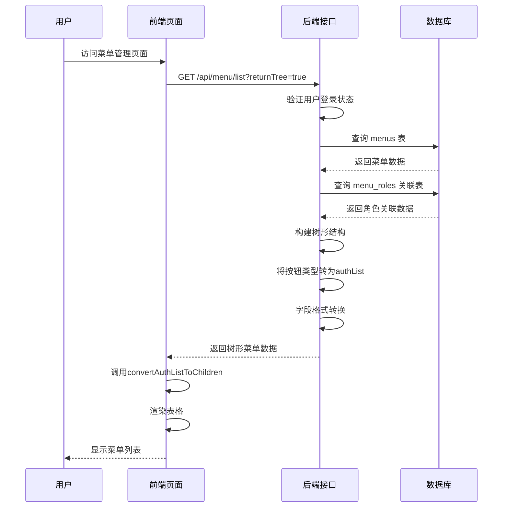
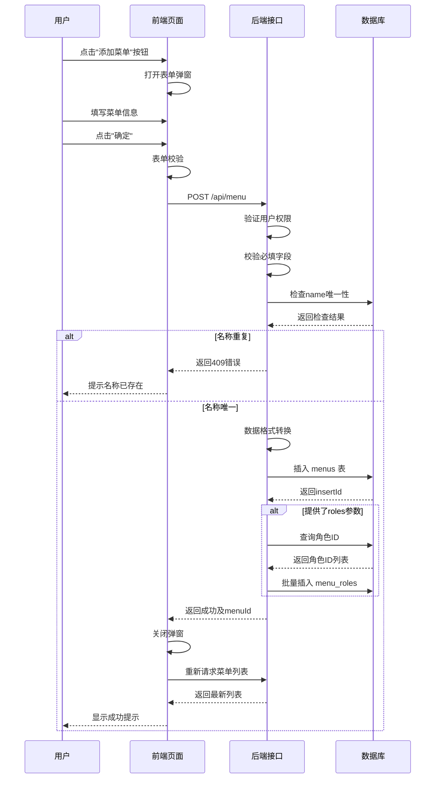
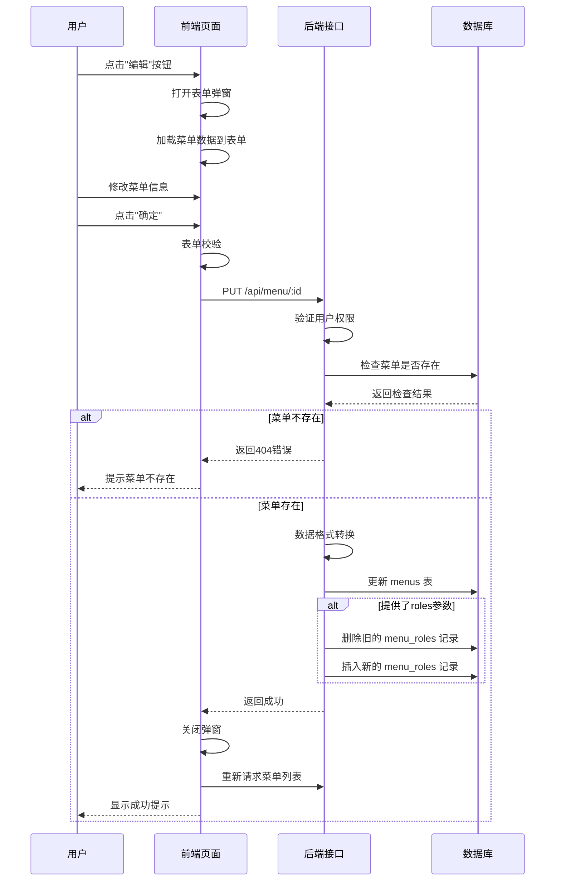
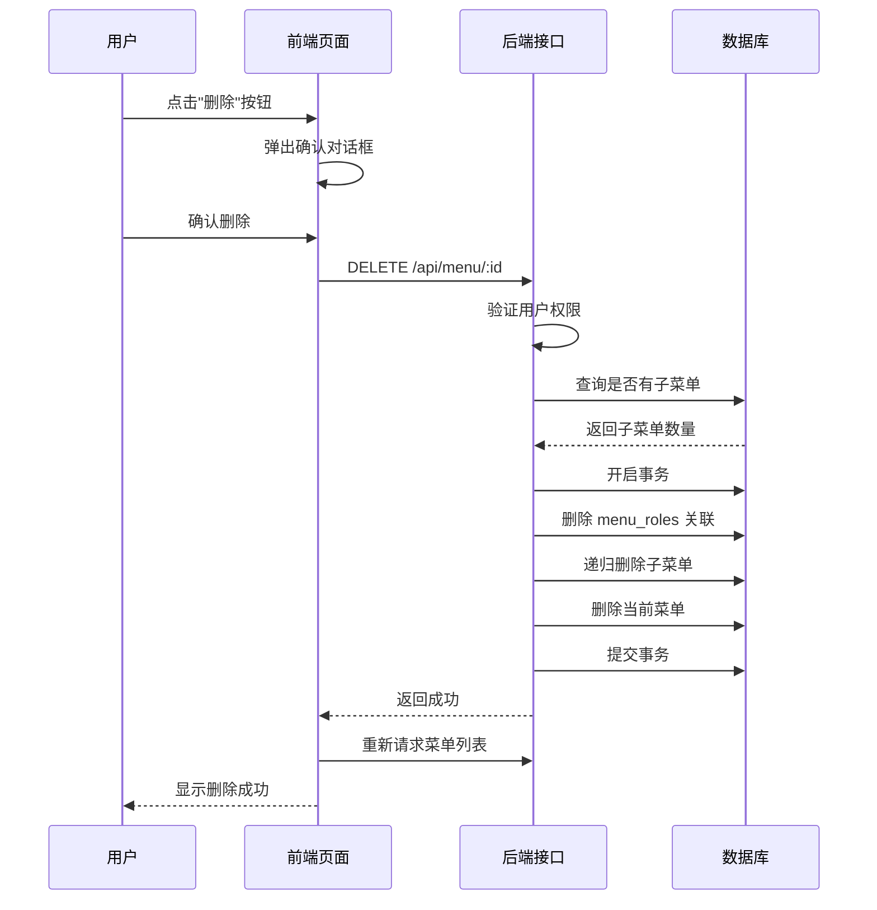
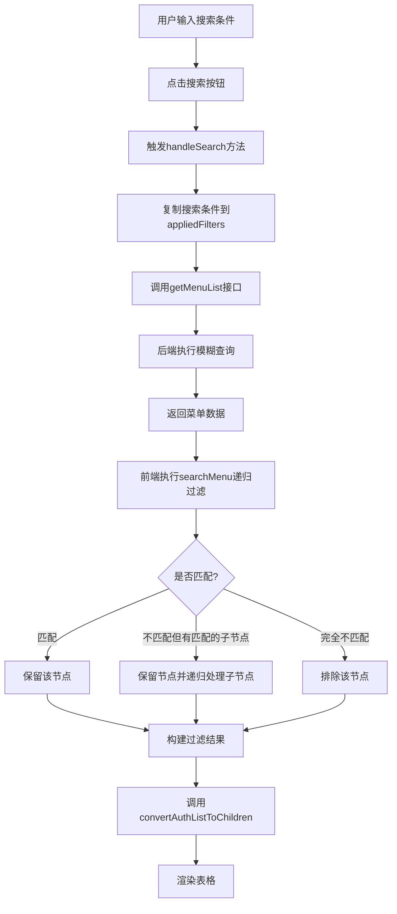

# 菜单管理功能设计文档

## 一、功能概述

### 1.1 设计目标

为 Art Design Pro 后台管理系统提供完整的菜单管理功能，实现菜单数据的增删改查操作，支持树形层级结构、权限按钮管理、菜单排序、状态控制等核心功能。通过前后端数据一致性设计，确保菜单配置能够与动态路由系统无缝集成。

### 1.2 核心价值

- **统一管理**：集中管理系统所有菜单和权限按钮配置
- **灵活配置**：支持多层级菜单、外链、内嵌页面等多种菜单类型
- **权限集成**：与角色权限系统深度集成，支持前端和后端两种权限模式
- **动态路由**：菜单数据可直接用于动态路由生成，无需重启应用即可生效

### 1.3 适用场景

- 系统菜单结构调整
- 新增或下线功能模块
- 菜单权限配置变更
- 多租户场景下的菜单个性化定制

## 二、前端功能分析

### 2.1 页面访问路径

```
http://localhost:3006/#/system/menu
```

### 2.2 已实现功能

基于前端代码分析，菜单管理页面已具备以下完整功能：

#### 2.2.1 数据展示功能

| 功能项        | 描述                                         | 技术实现                       |
| ------------- | -------------------------------------------- | ------------------------------ |
| 树形结构展示  | 支持多层级菜单嵌套显示                       | ElTable tree-props 配置        |
| 展开/收起控制 | 一键展开或收起所有菜单节点                   | toggleExpand 方法递归处理      |
| 菜单类型标识  | 目录、菜单、按钮、外链、内嵌页面的可视化区分 | ElTag 组件动态着色             |
| 权限按钮显示  | 将 meta.authList 转换为子节点展示            | convertAuthListToChildren 方法 |

#### 2.2.2 搜索过滤功能

| 搜索字段 | 字段类型 | 匹配方式               |
| -------- | -------- | ---------------------- |
| 菜单名称 | 文本输入 | 模糊匹配（忽略大小写） |
| 路由地址 | 文本输入 | 模糊匹配（忽略大小写） |

搜索特性：

- 支持树形结构递归搜索
- 父节点匹配时保留所有子节点
- 子节点匹配时保留完整路径链

#### 2.2.3 增删改操作

**菜单操作**：

- 新增菜单：顶部工具栏"添加菜单"按钮
- 编辑菜单：行内"编辑"按钮
- 删除菜单：行内"删除"按钮（带二次确认）

**权限按钮操作**：

- 新增权限：菜单行"新增权限"按钮
- 编辑权限：权限行"编辑"按钮
- 删除权限：权限行"删除"按钮（带二次确认）

#### 2.2.4 表单弹窗设计

弹窗支持两种模式切换：

**模式一：菜单表单**

| 字段名称 | 字段标识      | 数据类型 | 必填 | 说明                                  |
| -------- | ------------- | -------- | ---- | ------------------------------------- |
| 菜单名称 | name          | String   | 是   | 2-20个字符                            |
| 路由地址 | path          | String   | 是   | 一级菜单以/开头，二级及以下为相对路径 |
| 权限标识 | label         | String   | 是   | 路由name属性，如 User                 |
| 组件路径 | component     | String   | 否   | 组件文件路径，如 /system/user         |
| 图标     | icon          | String   | 否   | 图标名称，如 ri:user-line             |
| 角色权限 | roles         | Array    | 否   | 角色标识数组，前端权限模式使用        |
| 菜单排序 | sort          | Number   | 否   | 数字越小越靠前，默认1                 |
| 外部链接 | link          | String   | 否   | 完整URL地址                           |
| 文本徽章 | showTextBadge | String   | 否   | 显示在菜单项的文本标记                |
| 激活路径 | activePath    | String   | 否   | 详情页等隐藏菜单时高亮的父菜单路径    |
| 是否启用 | isEnable      | Boolean  | 否   | 默认true                              |
| 页面缓存 | keepAlive     | Boolean  | 否   | 是否缓存页面状态，默认true            |
| 隐藏菜单 | isHide        | Boolean  | 否   | 是否在菜单中隐藏，默认false           |
| 是否内嵌 | isIframe      | Boolean  | 否   | 是否内嵌外部页面，默认false           |
| 显示徽章 | showBadge     | Boolean  | 否   | 是否显示数字徽章，默认false           |
| 固定标签 | fixedTab      | Boolean  | 否   | 是否固定在标签页，默认false           |
| 标签隐藏 | isHideTab     | Boolean  | 否   | 是否在标签页隐藏，默认false           |
| 全屏页面 | isFullPage    | Boolean  | 否   | 是否全屏显示，默认false               |

**模式二：权限按钮表单**

| 字段名称 | 字段标识  | 数据类型 | 必填 | 说明                  |
| -------- | --------- | -------- | ---- | --------------------- |
| 权限名称 | authName  | String   | 是   | 如：新增、编辑、删除  |
| 权限标识 | authLabel | String   | 是   | 如：add、edit、delete |
| 权限排序 | authSort  | Number   | 否   | 数字越小越靠前，默认1 |

### 2.3 前端数据模型

基于 `AppRouteRecord` 类型定义：

```
菜单数据结构示意（仅用于理解，非实现代码）：
{
  id: 菜单唯一标识（数字）
  name: 路由名称（字符串，如 "User"）
  path: 路由路径（字符串，如 "/system/user"）
  component: 组件路径（字符串，如 "/system/user"）
  meta: {
    title: 菜单标题（字符串，支持国际化键名）
    icon: 图标名称（字符串）
    roles: 角色权限数组（字符串数组）
    sort: 排序号（数字）
    isHide: 是否隐藏（布尔值）
    isHideTab: 标签页隐藏（布尔值）
    keepAlive: 页面缓存（布尔值）
    link: 外部链接（字符串）
    isIframe: 是否内嵌（布尔值）
    showBadge: 显示徽章（布尔值）
    showTextBadge: 文本徽章（字符串）
    fixedTab: 固定标签（布尔值）
    activePath: 激活路径（字符串）
    isFullPage: 全屏页面（布尔值）
    authList: 权限按钮列表（对象数组）[
      { title: "新增", authMark: "add" },
      { title: "编辑", authMark: "edit" }
    ]
  }
  children: 子菜单数组（递归结构）
}
```

## 三、数据库设计

### 3.1 设计原则

- **扁平化存储**：菜单和权限按钮分别存储在独立表中
- **父子关系**：通过 parent_id 字段维护树形层级关系
- **字段统一**：数据库字段命名与前端保持一致性（使用下划线命名）
- **类型区分**：通过 menu_type 字段区分菜单和按钮
- **软删除支持**：预留 deleted_at 字段支持软删除（可选实现）

### 3.2 菜单表（menus）

#### 3.2.1 表结构设计

| 字段名 | 数据类型 | 约束 | 默认值 | 说明 |
| --- | --- | --- | --- | --- |
| id | INT | PRIMARY KEY, AUTO_INCREMENT | - | 菜单ID |
| parent_id | INT | NULL | NULL | 父菜单ID，NULL表示顶级菜单 |
| menu_type | VARCHAR(20) | NOT NULL | 'menu' | 菜单类型：menu-菜单，button-按钮 |
| name | VARCHAR(100) | NOT NULL | - | 路由名称（唯一标识），如 User |
| path | VARCHAR(255) | NULL | NULL | 路由路径，按钮类型为NULL |
| component | VARCHAR(255) | NULL | NULL | 组件路径 |
| title | VARCHAR(100) | NOT NULL | - | 菜单标题（支持国际化键名） |
| icon | VARCHAR(100) | NULL | NULL | 图标名称 |
| sort | INT | NOT NULL | 1 | 排序号，数字越小越靠前 |
| enabled | TINYINT | NOT NULL | 1 | 启用状态：1-启用，0-禁用 |
| is_hide | TINYINT | NOT NULL | 0 | 是否隐藏菜单：1-是，0-否 |
| is_hide_tab | TINYINT | NOT NULL | 0 | 是否隐藏标签页：1-是，0-否 |
| keep_alive | TINYINT | NOT NULL | 0 | 是否缓存页面：1-是，0-否 |
| link | VARCHAR(500) | NULL | NULL | 外部链接URL |
| is_iframe | TINYINT | NOT NULL | 0 | 是否内嵌页面：1-是，0-否 |
| show_badge | TINYINT | NOT NULL | 0 | 是否显示徽章：1-是，0-否 |
| show_text_badge | VARCHAR(50) | NULL | NULL | 文本徽章内容 |
| fixed_tab | TINYINT | NOT NULL | 0 | 是否固定标签：1-是，0-否 |
| active_path | VARCHAR(255) | NULL | NULL | 激活菜单路径 |
| is_full_page | TINYINT | NOT NULL | 0 | 是否全屏页面：1-是，0-否 |
| auth_mark | VARCHAR(100) | NULL | NULL | 权限标识（按钮类型使用） |
| created_at | DATETIME | NOT NULL | CURRENT_TIMESTAMP | 创建时间 |
| updated_at | DATETIME | NOT NULL | CURRENT_TIMESTAMP ON UPDATE | 更新时间 |
| create_by | INT | NULL | NULL | 创建人ID |
| update_by | INT | NULL | NULL | 更新人ID |

#### 3.2.2 索引设计

| 索引名称      | 索引类型 | 字段      | 说明               |
| ------------- | -------- | --------- | ------------------ |
| PRIMARY       | 主键索引 | id        | 主键               |
| idx_parent_id | 普通索引 | parent_id | 加速父子查询       |
| idx_menu_type | 普通索引 | menu_type | 加速类型筛选       |
| idx_sort      | 普通索引 | sort      | 加速排序查询       |
| uk_name       | 唯一索引 | name      | 确保路由名称唯一性 |

#### 3.2.3 外键约束

| 外键名称        | 从表字段  | 主表  | 主表字段 | 删除规则 |
| --------------- | --------- | ----- | -------- | -------- |
| fk_menu_parent  | parent_id | menus | id       | CASCADE  |
| fk_menu_creator | create_by | users | id       | SET NULL |
| fk_menu_updater | update_by | users | id       | SET NULL |

### 3.3 菜单角色关联表（menu_roles）

用于后端权限模式，记录菜单与角色的多对多关系。

#### 3.3.1 表结构设计

| 字段名     | 数据类型 | 约束                        | 默认值            | 说明     |
| ---------- | -------- | --------------------------- | ----------------- | -------- |
| id         | INT      | PRIMARY KEY, AUTO_INCREMENT | -                 | 关联ID   |
| menu_id    | INT      | NOT NULL                    | -                 | 菜单ID   |
| role_id    | INT      | NOT NULL                    | -                 | 角色ID   |
| created_at | DATETIME | NOT NULL                    | CURRENT_TIMESTAMP | 创建时间 |

#### 3.3.2 索引与约束

| 索引/约束名称     | 类型     | 字段               | 说明         |
| ----------------- | -------- | ------------------ | ------------ |
| PRIMARY           | 主键索引 | id                 | 主键         |
| uk_menu_role      | 唯一索引 | menu_id, role_id   | 防止重复关联 |
| idx_role_id       | 普通索引 | role_id            | 加速角色查询 |
| fk_menu_role_menu | 外键     | menu_id → menus.id | CASCADE删除  |
| fk_menu_role_role | 外键     | role_id → roles.id | CASCADE删除  |

### 3.4 数据示例

#### 示例1：系统管理一级菜单

| 字段      | 值               |
| --------- | ---------------- |
| id        | 1                |
| parent_id | NULL             |
| menu_type | menu             |
| name      | System           |
| path      | /system          |
| component | /index/index     |
| title     | menu.system      |
| icon      | ri:settings-line |
| sort      | 10               |
| enabled   | 1                |
| is_hide   | 0                |

#### 示例2：用户管理二级菜单

| 字段       | 值           |
| ---------- | ------------ |
| id         | 2            |
| parent_id  | 1            |
| menu_type  | menu         |
| name       | User         |
| path       | user         |
| component  | /system/user |
| title      | menu.user    |
| icon       | ri:user-line |
| sort       | 1            |
| enabled    | 1            |
| keep_alive | 1            |

#### 示例3：新增用户权限按钮

| 字段      | 值       |
| --------- | -------- |
| id        | 3        |
| parent_id | 2        |
| menu_type | button   |
| name      | User_add |
| path      | NULL     |
| component | NULL     |
| title     | 新增     |
| auth_mark | add      |
| sort      | 1        |
| enabled   | 1        |

### 3.5 字段映射关系

#### 前端 → 数据库映射表

| 前端字段           | 前端位置 | 数据库字段      | 转换规则                      |
| ------------------ | -------- | --------------- | ----------------------------- |
| id                 | 根属性   | id              | 直接映射                      |
| name               | 根属性   | name            | 直接映射                      |
| path               | 根属性   | path            | 直接映射                      |
| component          | 根属性   | component       | 直接映射                      |
| meta.title         | meta对象 | title           | 直接映射                      |
| meta.icon          | meta对象 | icon            | 直接映射                      |
| meta.sort          | meta对象 | sort            | 直接映射                      |
| meta.isHide        | meta对象 | is_hide         | 布尔转整型（true→1, false→0） |
| meta.isHideTab     | meta对象 | is_hide_tab     | 布尔转整型                    |
| meta.keepAlive     | meta对象 | keep_alive      | 布尔转整型                    |
| meta.link          | meta对象 | link            | 直接映射                      |
| meta.isIframe      | meta对象 | is_iframe       | 布尔转整型                    |
| meta.showBadge     | meta对象 | show_badge      | 布尔转整型                    |
| meta.showTextBadge | meta对象 | show_text_badge | 直接映射                      |
| meta.fixedTab      | meta对象 | fixed_tab       | 布尔转整型                    |
| meta.activePath    | meta对象 | active_path     | 直接映射                      |
| meta.isFullPage    | meta对象 | is_full_page    | 布尔转整型                    |
| meta.authMark      | meta对象 | auth_mark       | 直接映射（按钮类型）          |
| meta.roles         | meta对象 | menu_roles表    | 关联表存储，数组拆分          |
| children           | 根属性   | parent_id       | 树形结构转扁平化              |

## 四、后端接口设计

### 4.1 接口规范

#### 4.1.1 基础约定

- **请求协议**：HTTP/HTTPS
- **数据格式**：JSON
- **认证方式**：JWT Token（Header: Authorization: Bearer <token>）
- **字符编码**：UTF-8
- **时间格式**：yyyy-MM-dd HH:mm:ss

#### 4.1.2 统一响应格式

**成功响应**：

```
{
  code: 200,
  message: "操作成功",
  data: { 响应数据对象或数组 }
}
```

**失败响应**：

```
{
  code: 错误码（非200），
  message: "错误描述信息"
}
```

**分页响应**：

```
{
  code: 200,
  data: {
    records: [数据列表],
    total: 总记录数,
    current: 当前页码,
    size: 每页条数
  }
}
```

### 4.2 API接口列表

#### 4.2.1 获取菜单列表

**接口描述**：查询菜单列表，支持分页、搜索、树形结构返回

**请求信息**：

- 方法：GET
- 路径：/api/menu/list
- 权限：需要登录

**请求参数**：

| 参数名     | 类型    | 必填 | 说明                       |
| ---------- | ------- | ---- | -------------------------- |
| current    | Number  | 否   | 当前页码，默认1            |
| size       | Number  | 否   | 每页条数，默认20           |
| menuName   | String  | 否   | 菜单名称（模糊搜索）       |
| menuPath   | String  | 否   | 路由地址（模糊搜索）       |
| menuType   | String  | 否   | 菜单类型：menu/button      |
| enabled    | Number  | 否   | 启用状态：1-启用，0-禁用   |
| returnTree | Boolean | 否   | 是否返回树形结构，默认true |

**响应数据**：

```
分页模式（returnTree=false）:
{
  code: 200,
  data: {
    records: [
      {
        id: 菜单ID,
        parentId: 父菜单ID,
        menuType: 菜单类型,
        name: 路由名称,
        path: 路由路径,
        component: 组件路径,
        title: 菜单标题,
        icon: 图标,
        sort: 排序,
        enabled: 启用状态,
        isHide: 是否隐藏,
        isHideTab: 标签页隐藏,
        keepAlive: 页面缓存,
        link: 外部链接,
        isIframe: 是否内嵌,
        showBadge: 显示徽章,
        showTextBadge: 文本徽章,
        fixedTab: 固定标签,
        activePath: 激活路径,
        isFullPage: 全屏页面,
        authMark: 权限标识,
        roles: 角色数组,
        createTime: 创建时间,
        updateTime: 更新时间
      }
    ],
    total: 总数,
    current: 当前页,
    size: 每页条数
  }
}

树形模式（returnTree=true）:
{
  code: 200,
  data: [
    {
      id: 菜单ID,
      name: 路由名称,
      path: 路由路径,
      component: 组件路径,
      meta: {
        title: 菜单标题,
        icon: 图标,
        sort: 排序,
        isHide: 是否隐藏,
        isHideTab: 标签页隐藏,
        keepAlive: 页面缓存,
        link: 外部链接,
        isIframe: 是否内嵌,
        showBadge: 显示徽章,
        showTextBadge: 文本徽章,
        fixedTab: 固定标签,
        activePath: 激活路径,
        isFullPage: 全屏页面,
        authMark: 权限标识,
        authList: [权限按钮列表],
        roles: 角色数组
      },
      children: [子菜单数组（递归结构）]
    }
  ]
}
```

**业务逻辑**：

1. 验证用户登录状态
2. 根据搜索条件构建SQL查询
3. 执行数据库查询获取菜单数据
4. 查询关联的角色权限（从 menu_roles 表）
5. 根据 returnTree 参数决定返回格式：
   - false：返回扁平化分页列表
   - true：构建树形结构，将 menu_type='button' 的记录转换为父菜单的 authList 数组
6. 数据库字段转换为前端格式（下划线转驼峰，整型转布尔值）
7. 返回处理后的数据

#### 4.2.2 创建菜单

**接口描述**：新增菜单或权限按钮

**请求信息**：

- 方法：POST
- 路径：/api/menu
- 权限：需要管理员权限

**请求体**：

```
菜单模式：
{
  menuType: "menu",
  parentId: 父菜单ID（可为null）,
  name: 路由名称（必填）,
  path: 路由路径（必填）,
  component: 组件路径,
  title: 菜单标题（必填）,
  icon: 图标,
  sort: 排序号,
  enabled: 是否启用,
  isHide: 是否隐藏,
  isHideTab: 标签页隐藏,
  keepAlive: 页面缓存,
  link: 外部链接,
  isIframe: 是否内嵌,
  showBadge: 显示徽章,
  showTextBadge: 文本徽章,
  fixedTab: 固定标签,
  activePath: 激活路径,
  isFullPage: 全屏页面,
  roles: 角色编码数组（如 ["R_SUPER", "R_ADMIN"]）
}

按钮模式：
{
  menuType: "button",
  parentId: 父菜单ID（必填）,
  name: 权限名称（必填）,
  title: 显示标题（必填）,
  authMark: 权限标识（必填）,
  sort: 排序号
}
```

**响应数据**：

```
{
  code: 200,
  message: "创建成功",
  data: {
    menuId: 新创建的菜单ID
  }
}
```

**业务逻辑**：

1. 验证用户权限
2. 校验必填字段
3. 检查 name 字段唯一性（同一层级内不重复）
4. 前端数据格式转换为数据库格式：
   - 驼峰命名转下划线
   - 布尔值转整型
5. 插入 menus 表
6. 如果提供了 roles 数组：
   - 根据角色编码查询 roles 表获取角色ID
   - 批量插入 menu_roles 关联表
7. 记录创建人信息（create_by）
8. 返回新创建的菜单ID

#### 4.2.3 更新菜单

**接口描述**：修改菜单或权限按钮信息

**请求信息**：

- 方法：PUT
- 路径：/api/menu/:id
- 权限：需要管理员权限

**路径参数**：

| 参数名 | 类型   | 说明   |
| ------ | ------ | ------ |
| id     | Number | 菜单ID |

**请求体**：

与创建菜单接口相同，但所有字段均为可选（仅更新提交的字段）

**响应数据**：

```
{
  code: 200,
  message: "更新成功"
}
```

**业务逻辑**：

1. 验证用户权限
2. 验证菜单ID是否存在
3. 如果修改了 name 字段，检查唯一性
4. 前端数据格式转换
5. 更新 menus 表
6. 如果提供了 roles 数组：
   - 删除 menu_roles 表中该菜单的所有旧关联
   - 插入新的角色关联
7. 记录更新人信息（update_by）
8. 返回成功响应

#### 4.2.4 删除菜单

**接口描述**：删除菜单或权限按钮（级联删除子菜单）

**请求信息**：

- 方法：DELETE
- 路径：/api/menu/:id
- 权限：需要管理员权限

**路径参数**：

| 参数名 | 类型   | 说明   |
| ------ | ------ | ------ |
| id     | Number | 菜单ID |

**响应数据**：

```
{
  code: 200,
  message: "删除成功"
}
```

**业务逻辑**：

1. 验证用户权限
2. 验证菜单ID是否存在
3. 检查是否有子菜单（递归查询）
4. 如果有子菜单，提示用户是否级联删除
5. 开启数据库事务
6. 删除 menu_roles 表中的关联记录
7. 级联删除子菜单及其权限按钮
8. 删除当前菜单记录
9. 提交事务
10. 返回成功响应

#### 4.2.5 获取菜单详情

**接口描述**：根据ID获取单个菜单的完整信息

**请求信息**：

- 方法：GET
- 路径：/api/menu/:id
- 权限：需要登录

**路径参数**：

| 参数名 | 类型   | 说明   |
| ------ | ------ | ------ |
| id     | Number | 菜单ID |

**响应数据**：

```
{
  code: 200,
  data: {
    id: 菜单ID,
    parentId: 父菜单ID,
    menuType: 菜单类型,
    name: 路由名称,
    path: 路由路径,
    component: 组件路径,
    title: 菜单标题,
    icon: 图标,
    sort: 排序,
    enabled: 启用状态,
    isHide: 是否隐藏,
    isHideTab: 标签页隐藏,
    keepAlive: 页面缓存,
    link: 外部链接,
    isIframe: 是否内嵌,
    showBadge: 显示徽章,
    showTextBadge: 文本徽章,
    fixedTab: 固定标签,
    activePath: 激活路径,
    isFullPage: 全屏页面,
    authMark: 权限标识,
    roles: 角色编码数组,
    createTime: 创建时间,
    updateTime: 更新时间,
    createBy: 创建人ID,
    updateBy: 更新人ID
  }
}
```

**业务逻辑**：

1. 验证用户登录状态
2. 根据ID查询 menus 表
3. 查询 menu_roles 表获取关联的角色信息
4. 数据格式转换
5. 返回完整菜单信息

### 4.3 前端API集成

在 `src/api/system-manage.ts` 文件中新增以下接口定义：

**接口函数清单**：

| 函数名             | 对应后端接口         | 说明         |
| ------------------ | -------------------- | ------------ |
| fetchGetMenuList   | GET /api/menu/list   | 获取菜单列表 |
| fetchGetMenuDetail | GET /api/menu/:id    | 获取菜单详情 |
| fetchCreateMenu    | POST /api/menu       | 创建菜单     |
| fetchUpdateMenu    | PUT /api/menu/:id    | 更新菜单     |
| fetchDeleteMenu    | DELETE /api/menu/:id | 删除菜单     |

**参数类型定义**：

需在 `src/types/api/system-manage.d.ts` 中补充菜单相关类型定义：

```
类型定义需求（非代码，仅说明）：

namespace Api.SystemManage {
  // 菜单搜索参数
  interface MenuSearchParams {
    current?: number
    size?: number
    menuName?: string
    menuPath?: string
    menuType?: string
    enabled?: number
    returnTree?: boolean
  }

  // 创建菜单参数
  interface CreateMenuParams {
    menuType: 'menu' | 'button'
    parentId?: number
    name: string
    path?: string
    component?: string
    title: string
    icon?: string
    sort?: number
    enabled?: boolean
    isHide?: boolean
    isHideTab?: boolean
    keepAlive?: boolean
    link?: string
    isIframe?: boolean
    showBadge?: boolean
    showTextBadge?: string
    fixedTab?: boolean
    activePath?: string
    isFullPage?: boolean
    authMark?: string
    roles?: string[]
  }

  // 更新菜单参数（所有字段可选）
  type UpdateMenuParams = Partial<CreateMenuParams>

  // 菜单列表响应
  interface MenuList {
    records: AppRouteRecord[]
    total: number
    current: number
    size: number
  }
}
```

### 4.4 错误处理规范

| 错误码 | HTTP状态码 | 场景         | 错误信息示例               |
| ------ | ---------- | ------------ | -------------------------- |
| 400    | 400        | 参数校验失败 | "菜单名称不能为空"         |
| 401    | 401        | 未登录       | "未授权，请先登录"         |
| 403    | 403        | 权限不足     | "权限不足，无法访问该资源" |
| 404    | 404        | 资源不存在   | "菜单不存在"               |
| 409    | 409        | 数据冲突     | "路由名称已存在"           |
| 500    | 500        | 服务器错误   | "服务器内部错误"           |

## 五、核心业务流程

### 5.1 菜单列表查询流程



### 5.2 新增菜单流程



### 5.3 编辑菜单流程



### 5.4 删除菜单流程



### 5.5 搜索过滤流程



## 六、数据一致性保障

### 6.1 字段命名一致性

**规范说明**：

- **数据库层**：使用下划线命名（snake_case），如 `is_hide`、`keep_alive`
- **后端接口层**：返回给前端时转换为驼峰命名（camelCase），如 `isHide`、`keepAlive`
- **前端层**：使用驼峰命名，与后端接口保持一致

**转换方向**：

```
前端提交 → 后端接收 → 数据库存储
驼峰命名 → 驼峰命名 → 下划线命名

数据库查询 → 后端返回 → 前端接收
下划线命名 → 驼峰命名 → 驼峰命名
```

**工具函数需求**：

后端需实现以下转换函数：

- camelToSnake：驼峰转下划线（用于插入/更新数据库）
- snakeToCamel：下划线转驼峰（用于返回前端数据）

### 6.2 数据类型一致性

| 字段类型 | 数据库类型 | 后端返回类型  | 前端接收类型  | 转换规则            |
| -------- | ---------- | ------------- | ------------- | ------------------- |
| 布尔状态 | TINYINT    | Boolean       | Boolean       | 1→true, 0→false     |
| 角色权限 | 关联表     | Array<String> | Array<String> | 角色ID转角色编码    |
| 时间字段 | DATETIME   | String        | String        | yyyy-MM-dd HH:mm:ss |
| 排序号   | INT        | Number        | Number        | 直接映射            |
| 文本字段 | VARCHAR    | String        | String        | 直接映射            |

### 6.3 树形结构转换

**数据库存储（扁平化）**：

```
示意（非代码）：
menus 表记录：
[
  { id: 1, parent_id: null, name: "System", menu_type: "menu" },
  { id: 2, parent_id: 1, name: "User", menu_type: "menu" },
  { id: 3, parent_id: 2, name: "User_add", menu_type: "button" }
]
```

**后端返回（树形化）**：

```
示意（非代码）：
[
  {
    id: 1,
    name: "System",
    meta: { ... },
    children: [
      {
        id: 2,
        name: "User",
        meta: {
          authList: [
            { title: "新增", authMark: "add" }
          ]
        },
        children: []
      }
    ]
  }
]
```

**转换逻辑说明**：

1. 查询所有菜单记录
2. 按 `parent_id` 分组构建父子关系
3. 将 `menu_type='button'` 的记录提取为父菜单的 `authList` 数组
4. 递归构建多层嵌套结构
5. 按 `sort` 字段对同级菜单排序

### 6.4 角色权限关联

**前端提交**：

```
{ roles: ["R_SUPER", "R_ADMIN"] }
```

**后端处理流程**：

1. 接收角色编码数组
2. 查询 roles 表：`SELECT id FROM roles WHERE role_code IN ('R_SUPER', 'R_ADMIN')`
3. 获取角色ID数组：`[1, 2]`
4. 插入 menu_roles 表：`INSERT INTO menu_roles (menu_id, role_id) VALUES (10, 1), (10, 2)`

**后端返回**：

```
{ roles: ["R_SUPER", "R_ADMIN"] }
```

**查询逆向流程**：

1. 查询 menu_roles 表获取 role_id 列表
2. 关联 roles 表获取 role_code
3. 转换为角色编码数组返回前端

## 七、技术实现要点

### 7.1 后端实现关键点

#### 7.1.1 控制器设计

**文件位置**：`backend/src/controllers/menu.controller.ts`

**导出函数列表**：

- getMenuList：获取菜单列表
- getMenuDetail：获取菜单详情
- createMenu：创建菜单
- updateMenu：更新菜单
- deleteMenu：删除菜单

**参考现有控制器**：

- `user.controller.ts`：分页查询、参数处理、事务操作
- `role.controller.ts`：状态字段转换、错误处理

##### getMenuList 实现要点

**功能描述**：查询菜单列表，支持分页和树形结构返回

**参数处理**：

| 参数          | 来源  | 处理逻辑                              |
| ------------- | ----- | ------------------------------------- |
| current, size | query | 默认值处理，转换为 Number 类型        |
| menuName      | query | 用于 LIKE 模糊查询，需转义特殊字符    |
| menuPath      | query | 用于 LIKE 模糊查询                    |
| menuType      | query | 精确匹配，验证值为 'menu' 或 'button' |
| enabled       | query | 转换为数字类型 0/1                    |
| returnTree    | query | 转换为布尔值，默认 true               |

**数据库查询策略**：

1. **基础查询构建**
   - 使用动态 SQL 拼接，根据搜索条件添加 WHERE 子句
   - 参数化查询防止 SQL 注入
   - 示例条件：`WHERE 1=1 AND title LIKE ? AND enabled = ?`

2. **角色关联查询**

   ```
   查询逻辑说明：
   SELECT
     m.id, m.parent_id as parentId, m.menu_type as menuType,
     m.name, m.path, m.component, m.title, m.icon, m.sort,
     m.enabled, m.is_hide as isHide, m.is_hide_tab as isHideTab,
     m.keep_alive as keepAlive, m.link, m.is_iframe as isIframe,
     m.show_badge as showBadge, m.show_text_badge as showTextBadge,
     m.fixed_tab as fixedTab, m.active_path as activePath,
     m.is_full_page as isFullPage, m.auth_mark as authMark,
     m.created_at as createTime, m.updated_at as updateTime,
     GROUP_CONCAT(r.role_code) as roles
   FROM menus m
   LEFT JOIN menu_roles mr ON m.id = mr.menu_id
   LEFT JOIN roles r ON mr.role_id = r.id
   GROUP BY m.id
   ORDER BY m.parent_id ASC, m.sort ASC
   ```

3. **分页处理**（returnTree=false）
   - 先执行 COUNT 查询获取总数
   - 使用 LIMIT 和 OFFSET 实现分页
   - 返回 `{ records, total, current, size }`

4. **树形结构构建**（returnTree=true）
   - 查询所有符合条件的菜单（不分页）
   - 后端构建树形结构算法：
     - 创建 id 到节点的映射表
     - 遍历所有节点，根据 parent_id 建立父子关系
     - 将 menu_type='button' 的节点转为父节点的 meta.authList
     - 过滤出顶级节点（parent_id 为 null）

**字段转换处理**：

| 转换类型         | 字段示例                                   | 转换逻辑             |
| ---------------- | ------------------------------------------ | -------------------- |
| 下划线转驼峰     | parent_id → parentId                       | 使用工具函数批量转换 |
| 整型转布尔       | enabled: 1 → true                          | 遍历字段手动转换     |
| 角色字符串转数组 | "R_SUPER,R_ADMIN" → ["R_SUPER", "R_ADMIN"] | split(',') 处理      |

**树形结构构建算法**：

```
算法描述（非代码）：

函数 buildTree(flatList):
  1. 初始化空映射表 map = {}
  2. 初始化空结果数组 tree = []
  3. 遍历 flatList，将每个节点存入 map[node.id] = node
  4. 再次遍历 flatList：
     a. 如果 node.parentId 为 null：
        - 将 node 加入 tree
     b. 否则：
        - 找到父节点 parent = map[node.parentId]
        - 如果 node.menuType === 'button'：
          * 初始化 parent.meta.authList（如果不存在）
          * 添加 { title: node.title, authMark: node.authMark } 到 authList
        - 否则：
          * 初始化 parent.children（如果不存在）
          * 将 node 加入 parent.children
  5. 对所有层级按 sort 排序
  6. 返回 tree
```

**响应数据组装**：

分页模式返回示例：

```
{
  code: 200,
  data: {
    records: [转换后的菜单对象数组],
    total: 总记录数,
    current: 当前页,
    size: 每页条数
  }
}
```

树形模式返回示例：

```
{
  code: 200,
  data: [树形菜单数组，根节点在顶层]
}
```

##### createMenu 实现要点

**功能描述**：创建新菜单或权限按钮

**参数验证**：

| 验证项                 | 验证规则                      | 错误提示                        |
| ---------------------- | ----------------------------- | ------------------------------- |
| menuType               | 必填，值为 'menu' 或 'button' | "菜单类型必须为 menu 或 button" |
| name                   | 必填，2-100字符               | "菜单名称不能为空"              |
| title                  | 必填                          | "菜单标题不能为空"              |
| path（menu类型）       | 菜单类型时必填                | "路由路径不能为空"              |
| authMark（button类型） | 按钮类型时必填                | "权限标识不能为空"              |
| parentId（button类型） | 按钮类型时必填                | "权限按钮必须指定父菜单"        |

**唯一性校验**：

```
校验逻辑：
1. 查询 menus 表：SELECT id FROM menus WHERE name = ?
2. 如果结果数量 > 0，返回 409 错误："菜单名称已存在"
```

**数据转换与插入**：

1. **驼峰转下划线**

   ```
   转换示例：
   { isHide: false, keepAlive: true }
   → { is_hide: 0, keep_alive: 1 }
   ```

2. **布尔转整型**
   - true → 1
   - false → 0
   - undefined → 使用默认值

3. **插入 menus 表**

   ```
   INSERT 语句构建逻辑：
   INSERT INTO menus (
     parent_id, menu_type, name, path, component, title, icon, sort,
     enabled, is_hide, is_hide_tab, keep_alive, link, is_iframe,
     show_badge, show_text_badge, fixed_tab, active_path, is_full_page,
     auth_mark, create_by, created_at, updated_at
   ) VALUES (?, ?, ?, ?, ?, ?, ?, ?, ?, ?, ?, ?, ?, ?, ?, ?, ?, ?, ?, ?, ?, NOW(), NOW())
   ```

4. **角色关联处理**（如果提供了 roles 参数）
   ```
   处理流程：
   a. 验证 roles 是否为数组
   b. 查询角色ID：
      SELECT id FROM roles WHERE role_code IN (?, ?, ...)
   c. 批量插入 menu_roles 表：
      INSERT INTO menu_roles (menu_id, role_id, created_at)
      VALUES (新菜单ID, 角色ID1, NOW()), (新菜单ID, 角色ID2, NOW())
   ```

**事务处理**：

```
事务流程：
1. 开启事务 connection.beginTransaction()
2. 插入 menus 表
3. 获取 insertId
4. 如果有 roles，插入 menu_roles 表
5. 提交事务 connection.commit()
6. 如果任何步骤失败，回滚事务 connection.rollback()
7. 释放连接 connection.release()
```

**响应返回**：

```
{
  code: 200,
  message: "创建成功",
  data: { menuId: 新插入的菜单ID }
}
```

##### updateMenu 实现要点

**功能描述**：更新现有菜单或权限按钮信息

**参数处理**：

| 处理项      | 逻辑                                   |
| ----------- | -------------------------------------- |
| 路径参数 id | 从 req.params.id 获取，转换为 Number   |
| 请求体字段  | 仅处理提交的字段，未提交的字段保持不变 |

**存在性验证**：

```
验证逻辑：
1. 查询：SELECT id FROM menus WHERE id = ?
2. 如果不存在，返回 404 错误："菜单不存在"
```

**唯一性验证**（如果修改了 name）：

```
验证逻辑：
1. 查询：SELECT id FROM menus WHERE name = ? AND id != ?
2. 如果存在，返回 409 错误："菜单名称已存在"
```

**动态更新字段构建**：

```
构建逻辑：
1. 初始化 updateFields = [], updateParams = []
2. 遍历请求体字段：
   - 如果字段值不为 undefined：
     * 驼峰转下划线：isHide → is_hide
     * 布尔转整型：true → 1
     * 添加到 updateFields："is_hide=?"
     * 添加到 updateParams：1
3. 添加固定字段：update_by=?, updated_at=NOW()
4. 拼接 SQL：UPDATE menus SET ${updateFields.join(', ')} WHERE id=?
```

**角色关联更新**（如果提供了 roles 参数）：

```
更新流程：
1. 删除旧关联：DELETE FROM menu_roles WHERE menu_id = ?
2. 如果新 roles 不为空：
   a. 查询角色ID：SELECT id FROM roles WHERE role_code IN (...)
   b. 批量插入：INSERT INTO menu_roles (menu_id, role_id, created_at) VALUES ...
```

**事务处理**：

```
事务流程：
1. 开启事务
2. 验证菜单是否存在
3. 更新 menus 表
4. 如果提供了 roles，更新 menu_roles 表
5. 提交事务
6. 错误时回滚
```

**响应返回**：

```
{
  code: 200,
  message: "更新成功"
}
```

##### deleteMenu 实现要点

**功能描述**：删除菜单及其关联数据（级联删除子菜单）

**递归查询子菜单**：

```
查询逻辑：
函数 getChildMenuIds(menuId):
  1. 查询直接子菜单：SELECT id FROM menus WHERE parent_id = ?
  2. 初始化结果数组 ids = [menuId]
  3. 遍历每个子菜单：
     a. 递归调用 getChildMenuIds(子菜单ID)
     b. 合并返回的 ids
  4. 返回所有子孙菜单ID数组
```

**删除流程**：

```
删除事务流程：
1. 开启事务
2. 验证菜单是否存在
3. 调用 getChildMenuIds(菜单ID) 获取所有需删除的菜单ID
4. 删除角色关联：
   DELETE FROM menu_roles WHERE menu_id IN (所有ID列表)
5. 删除菜单记录：
   DELETE FROM menus WHERE id IN (所有ID列表)
6. 提交事务
7. 错误时回滚
```

**级联删除说明**：

由于数据库设置了外键 `fk_menu_parent` 的 `ON DELETE CASCADE`，也可以依赖数据库自动级联删除。但手动递归删除可以：

- 更好地记录操作日志
- 返回删除的菜单数量
- 在删除前进行额外业务校验

**响应返回**：

```
{
  code: 200,
  message: "删除成功"
}
```

##### getMenuDetail 实现要点

**功能描述**：获取单个菜单的完整信息

**查询逻辑**：

```
查询语句：
SELECT
  m.*,
  GROUP_CONCAT(r.role_code) as roles
FROM menus m
LEFT JOIN menu_roles mr ON m.id = mr.menu_id
LEFT JOIN roles r ON mr.role_id = r.id
WHERE m.id = ?
GROUP BY m.id
```

**字段转换**：

1. 下划线转驼峰
2. 整型转布尔值
3. roles 字符串转数组："R_SUPER,R_ADMIN" → ["R_SUPER", "R_ADMIN"]

**响应返回**：

```
{
  code: 200,
  data: {
    id, parentId, menuType, name, path, component,
    title, icon, sort, enabled, isHide, isHideTab,
    keepAlive, link, isIframe, showBadge, showTextBadge,
    fixedTab, activePath, isFullPage, authMark,
    roles: [角色编码数组],
    createTime, updateTime, createBy, updateBy
  }
}
```

#### 7.1.2 工具函数设计

**文件位置**：`backend/src/utils/menu.util.ts`

##### 命名转换工具

**camelToSnake 函数**：

```
功能：驼峰命名转下划线命名
输入：{ isHide: false, keepAlive: true }
输出：{ is_hide: false, keep_alive: true }

实现逻辑：
1. 遍历对象的所有键
2. 对每个键执行正则替换：
   - 匹配大写字母前插入下划线
   - 转换为小写
   - 示例：isHide → is_hide
3. 返回新对象
```

**snakeToCamel 函数**：

```
功能：下划线命名转驼峰命名
输入：{ is_hide: 0, keep_alive: 1 }
输出：{ isHide: 0, keepAlive: 1 }

实现逻辑：
1. 遍历对象的所有键
2. 对每个键执行正则替换：
   - 匹配 _[a-z] 模式
   - 替换为大写字母
   - 示例：is_hide → isHide
3. 返回新对象
```

##### 数据类型转换工具

**convertBooleanToInt 函数**：

```
功能：批量转换对象中的布尔值为整型
输入：{ enabled: true, isHide: false, name: "test" }
输出：{ enabled: 1, isHide: 0, name: "test" }

实现逻辑：
1. 定义需转换的字段列表：
   ['enabled', 'isHide', 'isHideTab', 'keepAlive', 'isIframe',
    'showBadge', 'fixedTab', 'isFullPage']
2. 遍历对象字段：
   - 如果字段在转换列表中且值为布尔类型：
     * true → 1
     * false → 0
3. 返回转换后的对象
```

**convertIntToBoolean 函数**：

```
功能：批量转换对象中的整型为布尔值
输入：{ enabled: 1, is_hide: 0, name: "test" }
输出：{ enabled: true, is_hide: false, name: "test" }

实现逻辑：
1. 定义需转换的字段列表（下划线格式）：
   ['enabled', 'is_hide', 'is_hide_tab', 'keep_alive', ...]
2. 遍历对象字段：
   - 如果字段在转换列表中且值为 0 或 1：
     * 1 → true
     * 0 → false
3. 返回转换后的对象
```

##### 树形结构构建工具

**buildMenuTree 函数**：

```
功能：将扁平菜单数组转换为树形结构
输入：[{ id: 1, parentId: null }, { id: 2, parentId: 1 }, ...]
输出：[{ id: 1, children: [{ id: 2, children: [] }] }]

详细实现逻辑：

函数 buildMenuTree(flatList):
  1. 创建映射表
     const map = {}
     for item in flatList:
       map[item.id] = { ...item, children: [] }

  2. 建立父子关系
     const tree = []
     for item in flatList:
       if item.parentId === null:
         tree.push(map[item.id])
       else:
         const parent = map[item.parentId]
         if parent:
           if item.menuType === 'button':
             // 按钮类型转为 authList
             if not parent.meta:
               parent.meta = {}
             if not parent.meta.authList:
               parent.meta.authList = []
             parent.meta.authList.push({
               title: item.title,
               authMark: item.authMark
             })
           else:
             // 菜单类型添加到 children
             parent.children.push(map[item.id])

  3. 递归排序
     函数 sortTree(nodes):
       nodes.sort((a, b) => a.sort - b.sort)
       for node in nodes:
         if node.children.length > 0:
           sortTree(node.children)
         if node.meta?.authList:
           node.meta.authList.sort((a, b) => a.sort - b.sort)

     sortTree(tree)

  4. 清理空 children
     函数 cleanEmptyChildren(nodes):
       for node in nodes:
         if node.children.length === 0:
           delete node.children
         else:
           cleanEmptyChildren(node.children)

     cleanEmptyChildren(tree)

  5. 返回 tree
```

**getChildMenuIds 函数**：

```
功能：递归获取所有子菜单ID（用于级联删除）
输入：menuId = 1, connection（数据库连接）
输出：[1, 2, 3, 4] （包含自身和所有子孙ID）

实现逻辑：

异步函数 getChildMenuIds(menuId, connection):
  1. 初始化结果数组
     const ids = [menuId]

  2. 查询直接子菜单
     const [children] = await connection.execute(
       'SELECT id FROM menus WHERE parent_id = ?',
       [menuId]
     )

  3. 递归处理每个子菜单
     for child in children:
       const childIds = await getChildMenuIds(child.id, connection)
       ids.push(...childIds)

  4. 返回 ids
```

#### 7.1.3 路由配置

**文件位置**：`backend/src/routes/menu.routes.ts`

**路由定义**：

```
路由配置说明（非代码）：

引入依赖：
- express Router
- menu.controller 中的所有函数
- authMiddleware（身份验证中间件）

路由定义：
1. GET  /api/menu/list
   - 中间件：authMiddleware
   - 处理器：getMenuList
   - 说明：获取菜单列表

2. GET  /api/menu/:id
   - 中间件：authMiddleware
   - 处理器：getMenuDetail
   - 说明：获取菜单详情

3. POST /api/menu
   - 中间件：authMiddleware
   - 处理器：createMenu
   - 说明：创建菜单
   - 权限要求：管理员（在 controller 中验证）

4. PUT  /api/menu/:id
   - 中间件：authMiddleware
   - 处理器：updateMenu
   - 说明：更新菜单
   - 权限要求：管理员（在 controller 中验证）

5. DELETE /api/menu/:id
   - 中间件：authMiddleware
   - 处理器：deleteMenu
   - 说明：删除菜单
   - 权限要求：管理员（在 controller 中验证）

导出：router
```

**路由注册**：

在 `backend/src/index.ts` 中注册菜单路由：

```
注册说明：
import menuRoutes from './routes/menu.routes.js'
app.use(menuRoutes)
```

#### 7.1.4 数据库查询优化

##### 索引优化策略

| 索引名称      | 字段      | 使用场景                 | 优化效果     |
| ------------- | --------- | ------------------------ | ------------ |
| PRIMARY       | id        | 主键查询、关联查询       | 基础索引     |
| idx_parent_id | parent_id | 查询子菜单、构建树形结构 | 加速层级查询 |
| idx_menu_type | menu_type | 按类型过滤菜单/按钮      | 加速类型筛选 |
| idx_sort      | sort      | 排序查询                 | 加速ORDER BY |
| uk_name       | name      | 唯一性校验               | 快速查重     |
| idx_enabled   | enabled   | 查询启用的菜单           | 加速状态过滤 |

##### 查询性能优化

**避免 N+1 查询问题**：

```
问题场景：
循环查询每个菜单的角色关联
for menu in menus:
  SELECT * FROM menu_roles WHERE menu_id = menu.id  // N次查询

优化方案：
一次性关联查询
SELECT m.*, GROUP_CONCAT(r.role_code) as roles
FROM menus m
LEFT JOIN menu_roles mr ON m.id = mr.menu_id
LEFT JOIN roles r ON mr.role_id = r.id
GROUP BY m.id  // 1次查询
```

**分页查询优化**：

```
优化前（效率低）：
SELECT * FROM (
  SELECT ... 复杂子查询 ...
) as t
LIMIT 10 OFFSET 100

优化后（使用索引）：
SELECT m.* FROM menus m
WHERE m.enabled = 1
ORDER BY m.sort ASC
LIMIT 10 OFFSET 100  // 直接在主表分页
```

**树形查询优化**：

```
策略：
1. 一次性查询所有菜单（避免递归查询数据库）
2. 在内存中构建树形结构（速度快）
3. 添加合理的菜单深度限制（≤5层）
4. 考虑添加缓存层（Redis）
```

##### 数据库连接池配置

**优化建议**：

```
连接池配置（在 database.ts 中）：
{
  connectionLimit: 10,        // 最大连接数
  waitForConnections: true,   // 等待可用连接
  queueLimit: 0,              // 无限制队列
  enableKeepAlive: true,      // 保持连接活跃
  keepAliveInitialDelay: 0    // 立即发送心跳
}
```

#### 7.1.5 错误处理设计

**错误类型定义**：

| 错误类型     | HTTP码 | 使用场景               | 处理方式                       |
| ------------ | ------ | ---------------------- | ------------------------------ |
| 参数验证错误 | 400    | 必填字段缺失、类型错误 | createError('错误信息', 400)   |
| 未授权错误   | 401    | Token无效或过期        | authMiddleware 自动处理        |
| 权限不足错误 | 403    | 非管理员操作管理接口   | createError('权限不足', 403)   |
| 资源不存在   | 404    | 菜单ID不存在           | createError('菜单不存在', 404) |
| 数据冲突     | 409    | 菜单名称重复           | createError('名称已存在', 409) |
| 服务器错误   | 500    | 数据库异常、未知错误   | next(error) 传递给错误中间件   |

**统一错误处理**：

```
错误捕获模式：

try {
  // 业务逻辑
} catch (error) {
  // 记录错误日志
  console.error('菜单操作失败:', error)

  // 区分错误类型
  if (error.code === 'ER_DUP_ENTRY') {
    return next(createError('菜单名称已存在', 409))
  }

  if (error.statusCode) {
    // 已知业务错误
    return next(error)
  }

  // 未知错误
  return next(createError('服务器内部错误', 500))
}
```

#### 7.1.6 权限验证实现

**管理员权限校验**：

```
校验逻辑（在控制器函数开头）：

// 获取当前用户信息
const userId = req.user?.userId
const userRole = req.user?.role  // 从 JWT 解析

// 验证是否为管理员
if (userRole !== 'R_SUPER' && userRole !== 'R_ADMIN') {
  throw createError('权限不足，仅管理员可操作', 403)
}
```

**可选：角色权限中间件**：

```
创建 checkRole 中间件（backend/src/middleware/role.middleware.ts）：

函数 checkRole(allowedRoles: string[]):
  返回中间件函数(req, res, next):
    const userRole = req.user?.role
    if allowedRoles.includes(userRole):
      next()
    else:
      next(createError('权限不足', 403))

使用示例：
router.post('/api/menu', authMiddleware, checkRole(['R_SUPER', 'R_ADMIN']), createMenu)
```

#### 7.1.7 日志记录设计

**操作日志记录**：

```
日志内容（在关键操作处记录）：

创建菜单：
console.log({
  action: 'CREATE_MENU',
  userId: req.user?.userId,
  menuData: { name, title, menuType },
  timestamp: new Date().toISOString()
})

更新菜单：
console.log({
  action: 'UPDATE_MENU',
  userId: req.user?.userId,
  menuId: id,
  changes: updateData,
  timestamp: new Date().toISOString()
})

删除菜单：
console.log({
  action: 'DELETE_MENU',
  userId: req.user?.userId,
  menuId: id,
  cascadeCount: deletedIds.length,
  timestamp: new Date().toISOString()
})
```

**可选：数据库审计表**：

```
表设计：menu_audit_logs
字段：
- id: 主键
- user_id: 操作人ID
- action: 操作类型（CREATE/UPDATE/DELETE）
- menu_id: 被操作的菜单ID
- old_data: 旧数据（JSON）
- new_data: 新数据（JSON）
- ip_address: 操作IP
- created_at: 操作时间
```

### 7.2 前端实现关键点

#### 7.2.1 API接口集成

**文件修改**：`src/api/system-manage.ts`

**新增内容**：

- 导入菜单相关类型定义
- 实现 5 个菜单管理接口函数
- 配置请求参数和响应类型

#### 7.2.2 页面逻辑调整

**文件修改**：`src/views/system/menu/index.vue`

**调整内容**：

- 移除第 109-116 行的模拟数据提示
- 实现 `getMenuList` 方法调用真实后端接口
- 实现 `handleSubmit` 方法调用创建/更新接口
- 实现 `handleDeleteMenu` 和 `handleDeleteAuth` 调用删除接口
- 添加错误处理和加载状态

#### 7.2.3 类型定义补充

**文件修改**：`src/types/api/system-manage.d.ts`

**新增类型**：

- MenuSearchParams：菜单搜索参数
- CreateMenuParams：创建菜单参数
- UpdateMenuParams：更新菜单参数
- MenuList：菜单列表响应

### 7.3 测试验证要点

#### 7.3.1 功能测试清单

| 测试项     | 测试场景             | 预期结果           |
| ---------- | -------------------- | ------------------ |
| 菜单列表   | 访问菜单管理页面     | 显示树形菜单列表   |
| 搜索功能   | 输入菜单名称搜索     | 过滤显示匹配结果   |
| 新增菜单   | 添加一级菜单         | 创建成功并刷新列表 |
| 新增子菜单 | 添加二级菜单         | 正确显示在父菜单下 |
| 新增按钮   | 添加权限按钮         | 显示在authList中   |
| 编辑菜单   | 修改菜单信息         | 更新成功           |
| 删除菜单   | 删除无子菜单的菜单项 | 删除成功           |
| 级联删除   | 删除有子菜单的菜单项 | 子菜单一并删除     |
| 角色权限   | 配置菜单角色         | 角色关联正确       |
| 排序功能   | 修改菜单排序号       | 按新排序显示       |

#### 7.3.2 数据一致性测试

| 测试项   | 验证点             | 验证方法               |
| -------- | ------------------ | ---------------------- |
| 字段命名 | 前后端字段名一致   | 对比接口返回和前端使用 |
| 数据类型 | 布尔值转换正确     | 检查开关状态保存和回显 |
| 树形结构 | parent_id 关系正确 | 验证层级显示           |
| 角色关联 | roles 数组正确     | 验证角色绑定和解绑     |

#### 7.3.3 边界情况测试

| 场景     | 测试用例     | 预期结果       |
| -------- | ------------ | -------------- |
| 空数据   | 无菜单数据时 | 显示空状态提示 |
| 重复名称 | 创建重名菜单 | 提示名称已存在 |
| 必填校验 | 不填必填字段 | 表单校验失败   |
| 权限验证 | 普通用户访问 | 403权限不足    |
| 网络异常 | 接口请求失败 | 显示错误提示   |

## 八、风险与注意事项

### 8.1 技术风险

| 风险项     | 风险描述                     | 应对措施                             |
| ---------- | ---------------------------- | ------------------------------------ |
| 数据库性能 | 菜单数量过多时查询性能下降   | 添加索引；限制树形深度≤5级；考虑缓存 |
| 级联删除   | 误删父菜单导致子菜单丢失     | 删除前二次确认；考虑软删除           |
| 权限冲突   | 前端权限模式与后端数据不一致 | 提供迁移工具；文档说明两种模式差异   |
| 字段映射   | 下划线与驼峰转换遗漏         | 编写单元测试覆盖所有字段             |

### 8.2 业务风险

| 风险项   | 风险描述                 | 应对措施                     |
| -------- | ------------------------ | ---------------------------- |
| 菜单丢失 | 误删导致系统菜单不可用   | 数据库定期备份；操作日志记录 |
| 权限混乱 | 角色关联错误导致越权访问 | 严格权限校验；审计日志       |
| 路由冲突 | 菜单路径与现有路由冲突   | 路径唯一性校验；路由测试     |

### 8.3 数据迁移注意事项

如果系统已存在前端静态菜单配置（src/router/modules/），迁移到数据库时需注意：

1. **数据导入**：编写迁移脚本将现有路由配置转换为数据库记录
2. **权限映射**：前端 roles 配置需正确映射到 menu_roles 表
3. **兼容性**：保留前端路由配置作为备份，避免数据库故障时系统不可用
4. **灰度切换**：支持配置开关在前端模式和后端模式间切换

### 8.4 安全注意事项

| 安全项   | 要求             | 实现方式               |
| -------- | ---------------- | ---------------------- |
| SQL注入  | 防止恶意SQL      | 使用参数化查询         |
| XSS攻击  | 防止脚本注入     | 前端输入过滤；后端转义 |
| 权限绕过 | 防止越权操作     | 接口层权限验证         |
| 敏感信息 | 避免泄露内部路径 | 错误信息脱敏           |

## 九、实施计划建议

### 9.1 开发阶段划分

| 阶段   | 工作内容                            | 预估工时 |
| ------ | ----------------------------------- | -------- |
| 阶段一 | 数据库表设计与创建                  | 0.5天    |
| 阶段二 | 后端接口开发（Controller + Routes） | 1.5天    |
| 阶段三 | 前端API集成与类型定义               | 0.5天    |
| 阶段四 | 前端页面逻辑调整                    | 1天      |
| 阶段五 | 联调测试与bug修复                   | 1天      |
| 阶段六 | 文档编写与交付                      | 0.5天    |

**总计**：约5天开发周期

### 9.2 验收标准

- [ ] 数据库表创建成功，索引和外键正确
- [ ] 后端5个接口全部实现并通过接口测试
- [ ] 前端页面可正常增删改查菜单
- [ ] 树形结构显示正确
- [ ] 权限按钮管理功能正常
- [ ] 搜索过滤功能正常
- [ ] 角色权限关联正确
- [ ] 字段命名和数据类型映射一致
- [ ] 错误处理完善
- [ ] 通过功能测试清单所有测试项

### 9.3 后续优化方向

- **缓存优化**：对菜单数据进行Redis缓存，减少数据库查询
- **国际化扩展**：支持菜单标题多语言配置
- **图标库集成**：提供可视化图标选择器
- **拖拽排序**：支持拖拽调整菜单顺序
- **版本管理**：菜单配置版本控制，支持回滚
- **导入导出**：支持菜单配置批量导入导出
- **权限可视化**：角色-菜单权限关系图可视化展示

---

**文档版本**：v1.0  
**最后更新**：2024年
