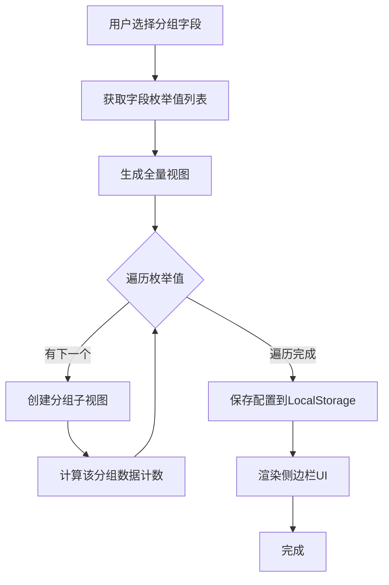
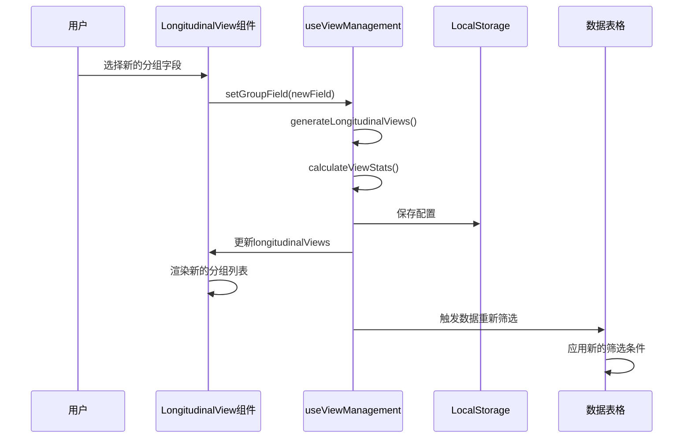

# EVM钱包监控页面 - 纵向视图功能实现设计

## 1. 功能概述

### 1.1 设计目标

为EVM钱包监控页面增加纵向视图功能，实现左侧垂直菜单形式的分组视图系统，与现有的横向视图标签系统协同工作，提供更灵活的数据筛选和浏览体验。

### 1.2 核心价值

| 价值维度     | 说明                                                 |
| ------------ | ---------------------------------------------------- |
| **数据组织** | 按业务维度（归属、状态等）自动分组，快速定位目标数据 |
| **浏览效率** | 分组计数一目了然，无需查询即可了解数据分布           |
| **多维筛选** | 纵向分组 + 横向视图的二级筛选，满足复杂查询需求      |
| **用户体验** | 折叠展开操作优化空间利用，适应不同使用场景           |

### 1.3 功能边界

**包含功能**：

- 左侧垂直菜单结构
- 按字段枚举值自动生成分组视图
- 实时数据计数显示
- 折叠/展开交互
- 与横向视图的联动筛选
- 分组字段动态切换

**不包含功能**：

- 多字段组合分组（仅支持单字段分组）
- 纵向视图的拖拽排序（按枚举值顺序自动排列）
- 自定义分组规则（仅支持字段枚举值分组）

## 2. 原始需求回顾

### 2.1 设计文档要求

来源：`evm-wallet-monitoring-table-design.md` 第280-295行

| 设计维度 | 具体要求 |
| --- | --- |
| **展示形式** | 左侧垂直菜单形式 |
| **结构设计** | - 顶部显示全量视图（包含所有数据）<br>- 按照分组字段枚举值生成子视图<br>- 每个子视图显示对应枚举值的数据计数<br>- 支持折叠/展开操作 |
| **交互逻辑** | - 点击切换到对应分组视图<br>- 每个分组视图内部支持独立的横向视图<br>- 修改分组字段时自动重新生成纵向视图 |

### 2.2 功能实现关键点

从设计文档中提取的核心实现要点：

1. **自动化生成**：根据选定分组字段的枚举值自动生成子视图
2. **全量视图优先**：顶部固定展示全量视图（不做任何筛选）
3. **数据统计**：每个子视图实时显示对应数据计数
4. **多级筛选**：纵向视图分组与横向视图筛选条件叠加
5. **响应式更新**：修改分组字段时自动重新生成纵向视图结构

## 3. 数据模型设计

### 3.1 纵向视图数据结构

#### 纵向视图配置类型

已定义于 `/src/types/view.d.ts`：

| 字段名     | 类型       | 必填 | 说明                               |
| ---------- | ---------- | ---- | ---------------------------------- |
| id         | string     | ✓    | 视图唯一标识                       |
| name       | string     | ✓    | 视图显示名称                       |
| type       | 'vertical' | ✓    | 视图类型固定为 vertical            |
| groupField | string     | ✓    | 分组字段名（如 ownership、status） |
| groupValue | string     | ✓    | 分组值（枚举值之一）               |
| isAllView  | boolean    | ✓    | 是否为全量视图                     |
| parentId   | string     | -    | 父视图ID（保留字段，暂不使用）     |
| order      | number     | ✓    | 显示顺序                           |
| createdAt  | string     | ✓    | 创建时间（ISO 8601格式）           |

#### 纵向视图状态存储结构

扩展现有的 `ViewStorage` 接口（已定义）：

| 字段名                    | 类型                   | 说明                         |
| ------------------------- | ---------------------- | ---------------------------- |
| version                   | string                 | 配置版本号（如 "1.0.0"）     |
| horizontal                | HorizontalViewConfig[] | 横向视图列表                 |
| **vertical**              | object                 | **纵向视图配置（新增）**     |
| vertical.groupField       | string                 | 当前选择的分组字段           |
| vertical.views            | VerticalViewConfig[]   | 纵向视图列表                 |
| activeView                | object                 | 当前激活的视图               |
| activeView.horizontalId   | string                 | 激活的横向视图ID             |
| activeView.**verticalId** | string                 | **激活的纵向视图ID（新增）** |

### 3.2 支持的分组字段

基于钱包监控业务模型，支持以下字段作为分组字段：

| 字段Key      | 字段名称 | 枚举值来源         | 数据类型 |
| ------------ | -------- | ------------------ | -------- |
| ownership    | 归属标签 | ownershipOptions   | 多选数组 |
| status       | 状态标签 | statusOptions      | 多选数组 |
| mainChains   | 主链列表 | chainOptions       | 多选数组 |
| activityTags | 活动标签 | activityTagOptions | 多选数组 |
| categoryTags | 分类标签 | categoryTagOptions | 多选数组 |
| alertMark    | 警报标记 | alertMarkOptions   | 多选数组 |

**说明**：

- 所有分组字段均为多选类型
- 采用包含匹配策略：一条记录的字段值为 `["A", "B"]`，则该记录同时出现在 A 分组和 B 分组中

### 3.3 视图统计数据模型

用于实时计算每个分组的数据量：

| 字段名         | 类型   | 说明               |
| -------------- | ------ | ------------------ |
| total          | number | 全量视图的总记录数 |
| groups         | array  | 分组统计数组       |
| groups[].value | string | 分组枚举值         |
| groups[].count | number | 该分组的记录数     |

**计算逻辑**：

- 全量视图：统计所有符合当前横向视图筛选条件的记录总数
- 分组视图：统计包含该枚举值的记录数（多选字段采用包含匹配）

## 4. 页面布局设计

### 4.1 布局结构调整

#### 当前布局（单列）

```
┌─────────────────────────────────────────┐
│ 面包屑 + 操作按钮                        │
├─────────────────────────────────────────┤
│ 横向视图标签                             │
├─────────────────────────────────────────┤
│ 数据表格（100%宽度）                     │
└─────────────────────────────────────────┘
```

#### 目标布局（双列）

```
┌────────┬──────────────────────────────────┐
│        │ 面包屑 + 操作按钮                 │
│ 纵向   ├──────────────────────────────────┤
│ 视图   │ 横向视图标签                      │
│ 侧边栏 ├──────────────────────────────────┤
│        │ 数据表格                          │
│ (固定) │ (自适应宽度)                      │
│        │                                  │
└────────┴──────────────────────────────────┘
```

### 4.2 布局实现规范

| 区域           | 宽度规范                | 说明                         |
| -------------- | ----------------------- | ---------------------------- |
| 纵向视图侧边栏 | 固定 240px              | 展开状态                     |
| 纵向视图侧边栏 | 固定 60px               | 折叠状态（仅显示图标和计数） |
| 主内容区       | calc(100% - 侧边栏宽度) | 自适应                       |
| 移动端适配     | 隐藏侧边栏或抽屉式      | ≤768px 时                    |

### 4.3 纵向视图侧边栏UI结构

```
┌──────────────────────┐
│ ┌──────────────────┐ │  ← 分组字段选择器
│ │ 分组字段: [归属▼]│ │
│ └──────────────────┘ │
│                      │
│ ▼ 全量视图      (9) │  ← 全量视图（展开状态）
│                      │
│ ▼ 按归属分组         │  ← 分组标题（展开状态）
│   · 个人        (3) │  ← 子视图项
│   · 团队        (4) │
│   · 外部        (2) │
│   · 合作方      (0) │
│                      │
└──────────────────────┘
```

**折叠状态**：

```
┌────┐
│🔽 │ ← 全量视图图标
│ 9  │ ← 计数徽标
├────┤
│▶  │ ← 分组折叠图标
└────┘
```

### 4.4 响应式设计

| 屏幕尺寸       | 侧边栏行为               | 交互方式     |
| -------------- | ------------------------ | ------------ |
| ≥1200px        | 固定展开（240px）        | 点击切换视图 |
| 768px - 1199px | 默认折叠（60px），可展开 | 悬停展开详情 |
| <768px         | 隐藏，通过抽屉式调出     | 按钮触发抽屉 |

## 5. 组件架构设计

### 5.1 组件结构

新增组件文件路径：

```
src/views/blockchain/wallet-monitoring/components/
├── ViewTabs.vue              # 已存在 - 横向视图标签
├── ViewDialog.vue            # 已存在 - 视图配置对话框
├── WalletSearch.vue          # 已存在 - 搜索组件
└── LongitudinalView.vue      # 新增 - 纵向视图侧边栏
    └── GroupItem.vue         # 新增 - 分组项子组件（可选）
```

### 5.2 LongitudinalView 组件设计

#### 组件职责

- 渲染左侧垂直菜单结构
- 管理分组字段选择
- 生成并显示分组视图列表
- 计算并显示数据统计
- 处理视图切换交互
- 响应折叠/展开操作

#### 组件Props

| 属性名       | 类型    | 必填 | 默认值 | 说明                         |
| ------------ | ------- | ---- | ------ | ---------------------------- |
| data         | Array   | ✓    | -      | 当前数据列表（用于计数统计） |
| groupField   | String  | ✓    | -      | 当前分组字段                 |
| groupOptions | Object  | ✓    | -      | 各字段的枚举值选项配置       |
| activeViewId | String  | -    | ''     | 当前激活的视图ID             |
| collapsed    | Boolean | -    | false  | 是否折叠状态                 |

**groupOptions 结构示例**：

```typescript
{
  ownership: ['个人', '团队', '外部', '合作方'],
  status: ['正常', '监控中', '已归档', '待处理'],
  mainChains: ['ETH', 'ARB', 'OP', 'BASE', ...],
  ...
}
```

#### 组件Events

| 事件名             | 参数               | 说明         |
| ------------------ | ------------------ | ------------ |
| group-field-change | groupField: string | 分组字段变更 |
| view-change        | viewId: string     | 视图切换     |
| update:collapsed   | collapsed: boolean | 折叠状态变更 |

#### 组件内部状态

| 状态名               | 类型        | 说明               |
| -------------------- | ----------- | ------------------ |
| expandedGroups       | Set<string> | 展开的分组集合     |
| viewStats            | ViewStats   | 视图统计数据       |
| availableGroupFields | Array       | 可用的分组字段列表 |

### 5.3 主页面集成调整

修改 `index.vue` 的模板结构：

```
<template>
  <div class="wallet-monitoring-container">
    <!-- 新增：纵向视图侧边栏 -->
    <LongitudinalView
      v-model:collapsed="sidebarCollapsed"
      :data="data"
      :group-field="longitudinalGroupField"
      :group-options="groupOptions"
      :active-view-id="activeLongitudinalViewId"
      @group-field-change="handleGroupFieldChange"
      @view-change="handleLongitudinalViewChange"
    />

    <!-- 主内容区 -->
    <div class="main-content-area">
      <!-- 搜索区域 -->
      <WalletSearch ... />

      <ElCard ...>
        <!-- 横向视图标签 -->
        <ViewTabs ... />

        <!-- 数据表格 -->
        <ArtTable ... />
      </ElCard>
    </div>
  </div>
</template>
```

## 6. 业务逻辑设计

### 6.1 纵向视图生成流程



### 6.2 数据筛选联动机制

#### 筛选条件组合策略

当用户同时使用纵向视图和横向视图时，筛选条件的组合规则：

| 场景               | 筛选逻辑                             |
| ------------------ | ------------------------------------ |
| 仅选择纵向全量视图 | 应用横向视图的筛选条件               |
| 选择纵向分组视图   | 纵向分组条件 AND 横向视图筛选条件    |
| 切换纵向视图       | 保持横向视图不变，仅更新纵向分组条件 |
| 切换横向视图       | 保持纵向视图不变，更新横向筛选条件   |

#### 筛选条件合并示例

**场景**：用户选择纵向视图"归属-个人"，横向视图"高价值钱包（总价值>10000）"

最终筛选条件：

```typescript
{
  // 来自纵向视图
  ownership: ['个人'],

  // 来自横向视图
  totalValueMin: 10000,
  status: ['正常', '监控中']
}
```

### 6.3 数据统计计算逻辑

#### 计算时机

- 页面初次加载时
- 分组字段切换时
- 横向视图切换时（影响全量视图计数）
- 数据增删改后（实时更新）

#### 计算方法

**全量视图计数**：

```typescript
function calculateAllViewCount(data, horizontalFilter) {
  return data.filter((record) => matchesFilter(record, horizontalFilter)).length
}
```

**分组视图计数**（多选字段包含匹配）：

```typescript
function calculateGroupCount(data, groupField, groupValue, horizontalFilter) {
  return data.filter((record) => {
    // 先应用横向视图筛选
    if (!matchesFilter(record, horizontalFilter)) return false

    // 再检查是否包含该分组值
    const fieldValue = record[groupField]
    return Array.isArray(fieldValue) && fieldValue.includes(groupValue)
  }).length
}
```

### 6.4 状态管理策略

#### Hook 扩展设计

扩展现有的 `useViewManagement` Hook，新增纵向视图管理能力：

**新增状态**：

| 状态名                   | 类型                      | 说明             |
| ------------------------ | ------------------------- | ---------------- |
| longitudinalGroupField   | Ref<string>               | 当前分组字段     |
| activeLongitudinalViewId | Ref<string>               | 激活的纵向视图ID |
| longitudinalViews        | Ref<VerticalViewConfig[]> | 纵向视图列表     |
| viewStats                | Ref<ViewStats>            | 视图统计数据     |

**新增方法**：

| 方法名                    | 参数           | 返回值     | 说明                         |
| ------------------------- | -------------- | ---------- | ---------------------------- |
| setGroupField             | field: string  | void       | 设置分组字段并重新生成视图   |
| generateLongitudinalViews | -              | void       | 根据当前分组字段生成纵向视图 |
| switchLongitudinalView    | viewId: string | void       | 切换纵向视图                 |
| calculateViewStats        | -              | ViewStats  | 计算视图统计数据             |
| getLongitudinalFilter     | -              | ViewFilter | 获取当前纵向视图的筛选条件   |

#### 持久化策略

**保存时机**：

- 分组字段切换时
- 纵向视图切换时
- 页面卸载前

**LocalStorage 键名**：`wallet_monitoring_views_config`（复用现有键）

**数据结构**：扩展现有 ViewStorage 结构的 vertical 字段

### 6.5 分组字段切换流程



## 7. 交互设计规范

### 7.1 视图切换交互

| 操作 | 触发方式 | 反馈效果 |
| --- | --- | --- |
| 切换纵向视图 | 点击分组项 | - 高亮当前选中项<br>- 表格数据立即更新<br>- 显示加载动画（<300ms） |
| 切换分组字段 | 下拉选择器 | - 侧边栏内容淡入淡出切换<br>- 重新计算所有分组计数 |
| 展开/折叠分组 | 点击分组标题 | - 平滑展开/收起动画<br>- 旋转展开图标（90°） |

### 7.2 折叠/展开行为

#### 侧边栏折叠

**触发方式**：点击侧边栏顶部的折叠按钮

**折叠效果**：

- 侧边栏宽度：240px → 60px
- 分组字段选择器：隐藏
- 视图名称文字：隐藏
- 数据计数：以徽标形式显示在图标右上角
- 主内容区宽度：自适应扩展

**展开触发**：

- 点击折叠按钮
- 鼠标悬停在折叠的侧边栏上（可选）

#### 分组折叠

**默认状态**：全量视图展开，分组视图折叠

**折叠记忆**：用户的展开/折叠状态保存到 LocalStorage

### 7.3 数据计数展示

#### 展开状态

```
全量视图                      (9)
按归属分组                     ▼
  个人                        (3)
  团队                        (4)
```

#### 折叠状态

```
[图标] 9    ← 全量视图徽标
[图标]      ← 分组折叠图标
```

### 7.4 无数据状态

当某个分组计数为 0 时：

| 显示策略     | 说明                                         |
| ------------ | -------------------------------------------- |
| **保留显示** | 显示分组项，计数为 (0)，点击后表格显示空状态 |
| 视觉弱化     | 使用灰色文字，降低视觉优先级                 |
| 禁用点击     | 计数为 0 的分组项禁用点击（可选方案）        |

## 8. 样式设计规范

### 8.1 颜色规范

| 元素               | 颜色变量                   | 说明                |
| ------------------ | -------------------------- | ------------------- |
| 侧边栏背景         | --el-bg-color              | 与系统背景色一致    |
| 分组项背景（默认） | transparent                | 透明                |
| 分组项背景（悬停） | --el-fill-color-light      | Element Plus 填充色 |
| 分组项背景（激活） | --el-color-primary-light-9 | 主题色浅色          |
| 分组项文字（默认） | --el-text-color-primary    | 主文字色            |
| 分组项文字（激活） | --el-color-primary         | 主题色              |
| 计数徽标           | --el-text-color-secondary  | 次要文字色          |
| 分割线             | --el-border-color-lighter  | 浅边框色            |

### 8.2 布局尺寸

| 元素               | 尺寸                   | 说明                      |
| ------------------ | ---------------------- | ------------------------- |
| 侧边栏宽度（展开） | 240px                  | 固定宽度                  |
| 侧边栏宽度（折叠） | 60px                   | 固定宽度                  |
| 分组项高度         | 40px                   | 统一高度                  |
| 分组项左内边距     | 16px                   | 一级缩进                  |
| 子项左内边距       | 32px                   | 二级缩进（相对一级+16px） |
| 图标大小           | 18px                   | 统一图标尺寸              |
| 计数徽标尺寸       | 最小宽度20px，高度18px | 自适应数字宽度            |

### 8.3 动画效果

| 动画类型        | 持续时间 | 缓动函数    |
| --------------- | -------- | ----------- |
| 侧边栏展开/折叠 | 300ms    | ease-in-out |
| 分组展开/收起   | 200ms    | ease        |
| 高亮切换        | 150ms    | ease        |
| 计数数字变化    | 无动画   | -           |

### 8.4 图标使用

| 图标用途   | 图标名称   | Element Plus图标 |
| ---------- | ---------- | ---------------- |
| 全量视图   | Database   | <Database />     |
| 分组展开   | ArrowDown  | <ArrowDown />    |
| 分组折叠   | ArrowRight | <ArrowRight />   |
| 侧边栏折叠 | Fold       | <Fold />         |
| 侧边栏展开 | Expand     | <Expand />       |

## 9. 技术实现方案

### 9.1 核心实现代码结构

#### useLongitudinalView Composable

新建文件：`src/hooks/core/useLongitudinalView.ts`

**职责**：

- 管理纵向视图状态
- 生成分组视图列表
- 计算数据统计
- 提供筛选条件合并方法

**主要函数签名**：

```typescript
interface UseLongitudinalViewOptions {
  data: Ref<any[]>
  groupOptions: Record<string, string[]>
  horizontalFilter: Ref<ViewFilter>
}

function useLongitudinalView(options: UseLongitudinalViewOptions) {
  // 返回值类型
  return {
    groupField: Ref<string>,
    activeViewId: Ref<string>,
    views: Ref<VerticalViewConfig[]>,
    stats: Ref<ViewStats>,
    collapsed: Ref<boolean>,
    setGroupField: (field: string) => void,
    switchView: (viewId: string) => void,
    getCombinedFilter: () => ViewFilter,
    toggleCollapse: () => void
  }
}
```

#### LongitudinalView 组件实现要点

**模板结构**：

```vue
<template>
  <aside :class="['longitudinal-view', { 'is-collapsed': collapsed }]">
    <!-- 顶部折叠按钮 -->
    <div class="collapse-toggle" @click="toggleCollapse">
      <el-icon><Fold v-if="!collapsed" /><Expand v-else /></el-icon>
    </div>

    <transition name="fade">
      <!-- 分组字段选择器（仅展开时显示） -->
      <div v-if="!collapsed" class="group-field-selector">
        <el-select v-model="currentGroupField" @change="handleGroupFieldChange">
          <el-option label="归属标签" value="ownership" />
          <el-option label="状态标签" value="status" />
          <!-- 其他分组字段 -->
        </el-select>
      </div>
    </transition>

    <el-scrollbar class="view-list">
      <!-- 全量视图 -->
      <div
        :class="['view-item', 'all-view', { 'is-active': activeViewId === 'all' }]"
        @click="handleViewClick('all')"
      >
        <el-icon><Database /></el-icon>
        <span v-if="!collapsed" class="view-name">全量视图</span>
        <el-badge :value="stats.total" :class="['count-badge', { collapsed: collapsed }]" />
      </div>

      <!-- 分组视图 -->
      <div class="group-section">
        <div class="group-header" @click="toggleGroup">
          <el-icon><ArrowDown v-if="groupExpanded" /><ArrowRight v-else /></el-icon>
          <span v-if="!collapsed">按{{ groupFieldLabel }}分组</span>
        </div>

        <el-collapse-transition>
          <div v-show="groupExpanded" class="group-items">
            <div
              v-for="view in groupViews"
              :key="view.id"
              :class="['view-item', { 'is-active': activeViewId === view.id }]"
              @click="handleViewClick(view.id)"
            >
              <span v-if="!collapsed" class="view-name">{{ view.name }}</span>
              <el-badge :value="getViewCount(view.groupValue)" />
            </div>
          </div>
        </el-collapse-transition>
      </div>
    </el-scrollbar>
  </aside>
</template>
```

**样式实现**：

```scss
.longitudinal-view {
  width: 240px;
  height: 100vh;
  background-color: var(--el-bg-color);
  border-right: 1px solid var(--el-border-color-lighter);
  transition: width 0.3s ease-in-out;

  &.is-collapsed {
    width: 60px;
  }

  .view-item {
    height: 40px;
    padding: 0 16px;
    display: flex;
    align-items: center;
    cursor: pointer;
    transition: background-color 0.15s ease;

    &:hover {
      background-color: var(--el-fill-color-light);
    }

    &.is-active {
      background-color: var(--el-color-primary-light-9);
      color: var(--el-color-primary);
    }

    .view-name {
      flex: 1;
      margin-left: 8px;
      overflow: hidden;
      text-overflow: ellipsis;
      white-space: nowrap;
    }
  }

  .group-items .view-item {
    padding-left: 32px; // 二级缩进
  }
}
```

### 9.2 性能优化策略

| 优化措施     | 说明                                                   |
| ------------ | ------------------------------------------------------ |
| **计算缓存** | 使用 computed 缓存统计计算结果，仅在依赖变化时重新计算 |
| **虚拟滚动** | 当分组项超过50个时，使用虚拟滚动优化渲染性能           |
| **防抖处理** | 分组字段切换时，使用 debounce 延迟200ms执行            |
| **按需加载** | 折叠状态下不渲染分组详情内容                           |
| **memo优化** | 子组件使用 memo 避免不必要的重渲染                     |

### 9.3 数据计算优化

#### 计数计算优化

使用 Map 数据结构缓存计数结果：

```typescript
const countCache = new Map<string, number>()

function calculateGroupCount(groupValue: string) {
  const cacheKey = `${groupField.value}:${groupValue}:${JSON.stringify(horizontalFilter.value)}`

  if (countCache.has(cacheKey)) {
    return countCache.get(cacheKey)!
  }

  const count = data.value.filter(/* ... */).length
  countCache.set(cacheKey, count)
  return count
}

// 数据变化时清除缓存
watch([data, groupField, horizontalFilter], () => {
  countCache.clear()
})
```

### 9.4 错误处理与边界情况

| 场景               | 处理策略                                                 |
| ------------------ | -------------------------------------------------------- |
| LocalStorage 已满  | - 显示警告提示<br>- 降级为内存存储<br>- 建议用户清理数据 |
| 分组字段枚举值为空 | - 仅显示全量视图<br>- 提示用户配置枚举值                 |
| 数据加载失败       | - 显示错误状态<br>- 保留上次成功的统计数据               |
| 无可用分组字段     | - 隐藏分组字段选择器<br>- 仅显示全量视图                 |

## 10. 开发实施计划

### 10.1 开发任务分解

| 任务ID | 任务名称                      | 优先级 | 预估工时 | 依赖任务 |
| ------ | ----------------------------- | ------ | -------- | -------- |
| T1     | 扩展 view.d.ts 类型定义       | 高     | 0.5天    | -        |
| T2     | 创建 useLongitudinalView Hook | 高     | 1.5天    | T1       |
| T3     | 开发 LongitudinalView 组件    | 高     | 2天      | T2       |
| T4     | 调整主页面布局结构            | 高     | 0.5天    | T3       |
| T5     | 实现数据统计计算逻辑          | 高     | 1天      | T2       |
| T6     | 集成筛选条件联动              | 中     | 1天      | T3, T5   |
| T7     | 实现折叠/展开交互             | 中     | 1天      | T3       |
| T8     | LocalStorage 持久化           | 中     | 0.5天    | T2       |
| T9     | 响应式布局适配                | 低     | 1天      | T3       |
| T10    | 样式细节优化                  | 低     | 1天      | T3, T7   |
| T11    | 单元测试                      | 中     | 1天      | T2, T3   |
| T12    | 集成测试与调试                | 高     | 1.5天    | 所有任务 |

**总计**：约 12.5 工作日

### 10.2 开发阶段划分

#### 第一阶段：基础功能（5天）

- [x] 类型定义扩展
- [x] Hook 基础逻辑
- [x] 组件基础UI
- [x] 基础数据统计
- [x] 简单视图切换

**验收标准**：

- 能够显示纵向视图侧边栏
- 能够切换分组字段
- 能够显示基础数据计数
- 能够点击切换视图并联动表格

#### 第二阶段：交互完善（4天）

- [x] 折叠/展开功能
- [x] 筛选条件联动
- [x] 状态持久化
- [x] 动画效果

**验收标准**：

- 折叠/展开流畅无卡顿
- 纵向横向视图筛选条件正确叠加
- 刷新页面后状态正确恢复
- 所有交互动画符合设计规范

#### 第三阶段：优化提升（3.5天）

- [x] 响应式适配
- [x] 性能优化
- [x] 样式精细化
- [x] 测试与修复

**验收标准**：

- 移动端显示正常
- 大数据量下（1000+记录）性能良好
- 通过所有测试用例
- 无明显bug

### 10.3 技术风险与对策

| 风险 | 影响 | 概率 | 对策 |
| --- | --- | --- | --- |
| LocalStorage 容量限制 | 功能降级 | 中 | - 限制视图数量上限<br>- 提供数据清理功能<br>- 监控存储使用情况 |
| 大数据量性能问题 | 用户体验差 | 中 | - 计数计算缓存<br>- 虚拟滚动<br>- 防抖节流 |
| 与横向视图冲突 | 功能异常 | 低 | - 明确筛选条件优先级<br>- 充分的集成测试 |
| 移动端布局适配 | 显示异常 | 低 | - 提前规划响应式方案<br>- 多设备测试 |

## 11. 测试验收标准

### 11.1 功能测试清单

#### 基础功能

- [ ] 纵向视图侧边栏正常显示
- [ ] 全量视图显示并可点击切换
- [ ] 分组字段选择器可正常切换
- [ ] 切换分组字段后，分组列表正确更新
- [ ] 各分组项可点击切换
- [ ] 数据计数显示正确

#### 交互功能

- [ ] 侧边栏折叠/展开功能正常
- [ ] 折叠状态下仍可切换视图
- [ ] 分组展开/折叠动画流畅
- [ ] 视图切换时高亮状态正确
- [ ] 悬停效果正常显示

#### 联动功能

- [ ] 切换纵向视图后表格数据正确筛选
- [ ] 切换横向视图后纵向计数正确更新
- [ ] 纵向 + 横向筛选条件正确叠加
- [ ] 数据增删改后计数实时更新

#### 持久化功能

- [ ] 刷新页面后分组字段选择保持
- [ ] 刷新页面后激活视图保持
- [ ] 刷新页面后折叠状态保持
- [ ] 刷新页面后分组展开状态保持

### 11.2 性能测试

| 测试项       | 目标指标      | 测试方法                    |
| ------------ | ------------- | --------------------------- |
| 初始加载时间 | <500ms        | Chrome DevTools Performance |
| 视图切换响应 | <300ms        | 用户感知测试                |
| 分组字段切换 | <500ms        | 包含计数重新计算            |
| 大数据量渲染 | 1000条记录<1s | 模拟数据测试                |
| 内存占用     | <10MB增量     | Chrome Memory Profiler      |

### 11.3 兼容性测试

| 测试维度 | 测试范围                                                  |
| -------- | --------------------------------------------------------- |
| 浏览器   | Chrome 最新版、Firefox 最新版、Edge 最新版、Safari 最新版 |
| 屏幕尺寸 | 1920x1080、1366x768、768x1024、375x667                    |
| 操作系统 | Windows 10/11、macOS、iOS、Android                        |

### 11.4 边界测试

- [ ] 无数据时的显示（计数为0）
- [ ] 所有分组计数都为0的情况
- [ ] 分组字段枚举值为空的情况
- [ ] LocalStorage 被禁用的情况
- [ ] LocalStorage 已满的情况
- [ ] 网络断开时的表现

## 12. 后续扩展规划

### 12.1 可选增强功能

| 功能           | 优先级 | 说明                                   |
| -------------- | ------ | -------------------------------------- |
| 多字段组合分组 | 低     | 支持按多个字段同时分组（如 归属+状态） |
| 自定义分组规则 | 低     | 允许用户自定义分组逻辑（如按价值区间） |
| 分组拖拽排序   | 低     | 支持用户手动调整分组显示顺序           |
| 分组收藏       | 低     | 标记常用分组，快速访问                 |
| 分组数据导出   | 中     | 导出当前分组视图的数据                 |
| 分组视图分享   | 低     | 生成链接分享给其他用户                 |

### 12.2 技术债务规划

| 项目               | 时间      | 说明                     |
| ------------------ | --------- | ------------------------ |
| 单元测试覆盖率提升 | 第2个迭代 | 目标覆盖率80%            |
| 性能监控接入       | 第3个迭代 | 接入前端性能监控平台     |
| 国际化支持         | 第3个迭代 | 多语言支持               |
| 无障碍优化         | 第4个迭代 | 键盘导航、屏幕阅读器支持 |

**完成度评估**:纵向视图功能未实现,完成度0%。

## 13. 设计补充说明

### 13.1 与现有系统集成

本设计充分考虑与现有系统的兼容性:

| 集成点                 | 说明                                    |
| ---------------------- | --------------------------------------- |
| useViewManagement Hook | 扩展现有Hook,保持API一致性              |
| ViewStorage 数据结构   | 扩展现有存储格式,向后兼容               |
| ViewTabs 组件          | 保持不变,仅增加联动逻辑                 |
| 样式系统               | 使用 Element Plus 和项目统一的 CSS 变量 |
| 路由状态               | 不影响现有路由和面包屑导航              |

### 13.2 用户迁移策略

对于已有用户,纵向视图功能上线后:

| 策略           | 说明                                |
| -------------- | ----------------------------------- |
| **渐进式引导** | 首次使用时显示功能引导提示          |
| **默认状态**   | 默认展开侧边栏,分组字段为"归属标签" |
| **数据兼容**   | 现有横向视图配置完全保留,无需迁移   |
| **关闭选项**   | 提供侧边栏折叠功能,适应不同用户习惯 |

### 13.3 未来扩展预留

设计中预留的扩展点:

| 扩展点              | 说明                 |
| ------------------- | -------------------- | ------------------------------------------ |
| parentId 字段       | 预留多级分组支持     |
| ViewFilter 扩展字段 | 支持未来新增筛选条件 |
| 组件插槽            | 预留自定义渲染插槽   |
| 事件系统            | 完整的事件通知机制   |
| 页面布局            | 单列布局（无侧边栏） | 双列布局（左侧边栏 + 右侧内容区）          |
| 组件结构            | 横向视图组件         | 横向 + 纵向双视图组件                      |
| 数据流              | 单一视图筛选         | 纵向分组 + 横向视图的二级筛选              |
| 状态管理            | 仅横向视图状态       | 需增加纵向视图状态（分组字段、展开状态等） |

### 5.2 功能层面差距

**缺失的核心功能模块**：

1. **纵向视图侧边栏组件**
   - 作用：承载垂直菜单结构
   - 缺失影响：无法展示分组视图

2. **分组字段配置功能**
   - 作用：允许用户选择按哪个字段分组（归属标签、状态、活动标签等）
   - 缺失影响：无法动态生成子视图

3. **分组数据统计逻辑**
   - 作用：计算每个分组枚举值对应的数据数量
   - 缺失影响：无法显示数据计数

4. **视图切换联动机制**
   - 作用：纵向视图选择与横向视图、表格数据的联动过滤
   - 缺失影响：无法实现二级筛选效果

5. **折叠/展开交互**
   - 作用：管理分组视图的展开收起状态
   - 缺失影响：无法优化空间利用

### 5.3 技术实现差距

**需要开发的技术要点**：

| 技术点         | 说明                                           | 复杂度 |
| -------------- | ---------------------------------------------- | ------ |
| 响应式布局调整 | 将主容器改为Flex布局，左侧固定宽度，右侧自适应 | 低     |
| 动态分组计算   | 根据选定字段对数据进行分组统计                 | 中     |
| 多级筛选逻辑   | 纵向分组 + 横向视图的组合筛选                  | 中     |
| 状态持久化     | 保存用户的分组字段选择、展开状态等             | 中     |
| 性能优化       | 大数据量下的分组计算和渲染优化                 | 中     |

## 6. 检查结论

### 6.1 核心发现

1. **功能完全缺失**：纵向视图功能在当前代码库中完全未实现，不存在任何相关代码或组件。

2. **横向视图已完成**：页面已实现完整的横向视图系统，具备视图管理的基础设施。

3. **无实现痕迹**：代码中未发现任何纵向视图的实现痕迹、注释或TODO标记。

4. **布局未预留**：当前页面布局为标准单列结构，未预留左侧边栏空间。

### 6.2 实现建议

**实现纵向视图功能需要进行以下工作**：

1. **新建组件** - 创建 `LongitudinalView.vue` 纵向视图侧边栏组件
2. **调整布局** - 修改主页面 `index.vue` 的布局结构，增加左侧边栏区域
3. **数据处理** - 实现分组字段选择、数据统计、筛选联动逻辑
4. **状态管理** - 扩展视图管理Hook，增加纵向视图相关状态
5. **交互实现** - 实现折叠/展开、点击切换等用户交互
6. **样式开发** - 设计并实现纵向菜单的视觉样式
7. **联动调试** - 确保纵向视图与横向视图、表格数据的正确联动

### 6.3 工作量估算

| 任务     | 预估工作量     | 优先级 |
| -------- | -------------- | ------ |
| 组件开发 | 2-3天          | 高     |
| 布局调整 | 0.5天          | 高     |
| 数据逻辑 | 1-2天          | 高     |
| 状态管理 | 1天            | 中     |
| 交互完善 | 1天            | 中     |
| 样式优化 | 1天            | 低     |
| 测试调试 | 1-2天          | 高     |
| **总计** | **7.5-11.5天** | -      |

## 7. 后续行动建议

### 7.1 立即行动项

1. 确认是否需要实现纵向视图功能
2. 如需实现，明确具体的产品需求细节：
   - 支持哪些字段作为分组字段
   - 是否支持多字段组合分组
   - 折叠/展开的默认状态
   - 数据量大时的性能要求

### 7.2 设计补充建议

建议在实施前补充以下设计细节：

- 纵向视图的宽度规范（固定宽度 or 可调节）
- 分组字段的选择方式（下拉选择 or 配置面板）
- 空分组的显示策略（隐藏 or 显示为0）
- 移动端的适配方案（抽屉式 or 折叠式）
- 与横向视图的优先级关系（纵向优先筛选 or 横向优先）
