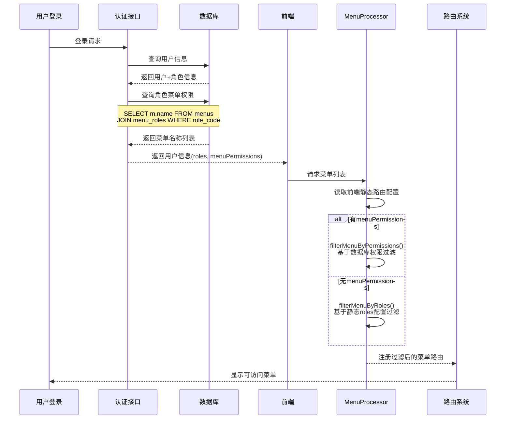
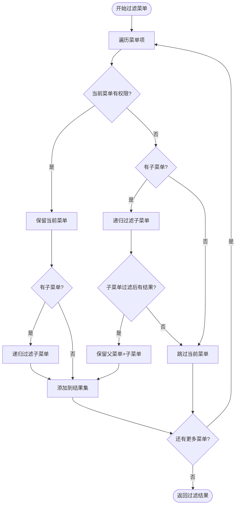
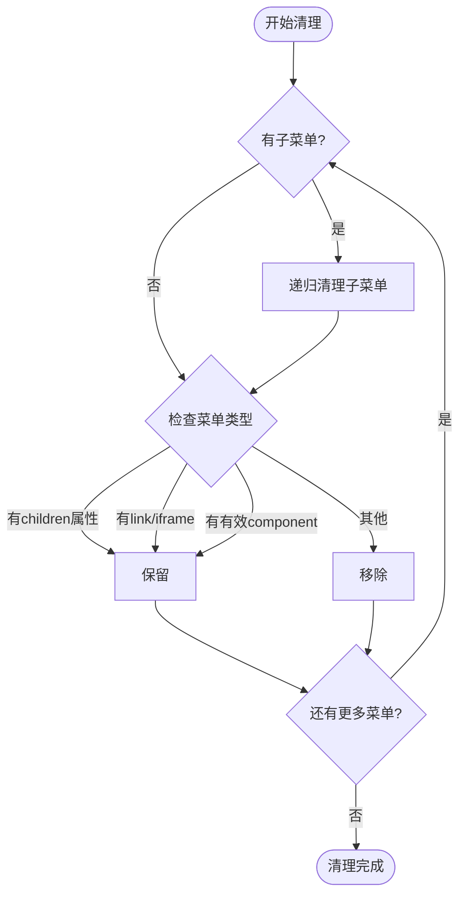
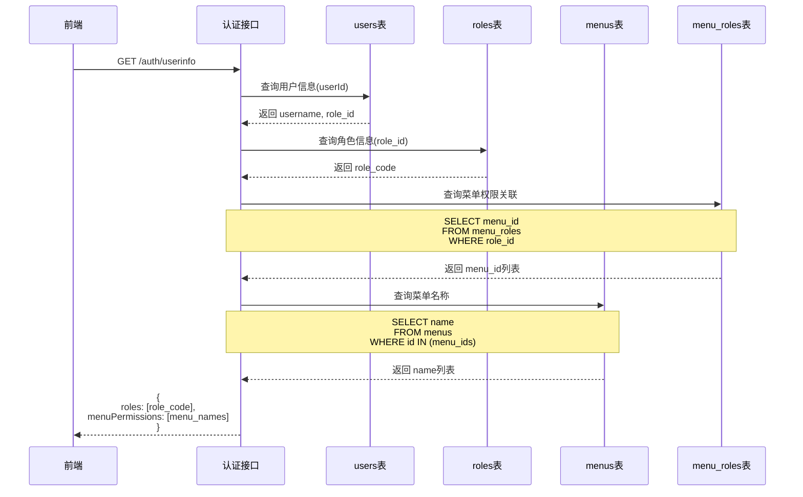
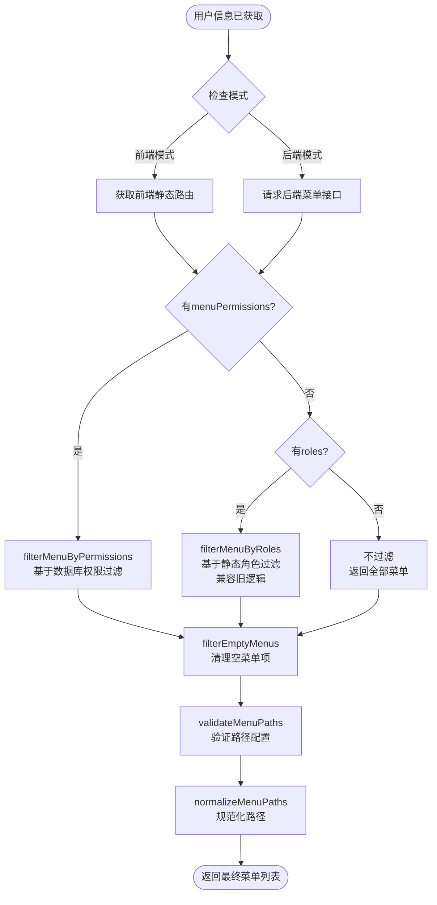

# 角色菜单权限控制问题修复设计

## 问题描述

在完成菜单管理功能后，发现角色分配菜单权限后，用户实际登录查看到的菜单权限与在角色管理中配置的权限不一致。

## 问题分析

### 当前权限控制流程



### 核心问题点识别

#### 1. 权限数据不一致

**数据库侧**（menu_roles表）

- 通过角色管理界面配置的菜单权限
- 存储在 menu_roles 表中，记录角色与菜单的多对多关系
- 是动态可配置的

**前端侧**（asyncRoutes静态配置）

- 路由模块中硬编码的 meta.roles 字段
- 例如：`roles: ['R_SUPER']` 写在路由配置文件中
- 是静态不可变的

#### 2. 过滤逻辑混乱

当前 MenuProcessor 中存在两套过滤机制：

**优先级1：filterMenuByPermissions**

- 依据：后端返回的 menuPermissions（从 menu_roles 查询）
- 条件：`menuPermissions.includes(item.name)`
- 问题：仅检查当前菜单项是否在权限列表中，**未验证父菜单链**

**优先级2：filterMenuByRoles**

- 依据：前端静态配置的 meta.roles
- 条件：`meta.roles.some(role => userRoles.includes(role))`
- 问题：与数据库配置脱节，配置修改无法生效

#### 3. 父子菜单权限验证缺失

当前实现的 filterMenuByPermissions 方法存在逻辑缺陷：

```typescript
// 当前实现（有问题）
private filterMenuByPermissions(menu: AppRouteRecord[], menuPermissions: string[]): AppRouteRecord[] {
  return menu.reduce((acc: AppRouteRecord[], item) => {
    // 仅检查当前项是否有权限
    const hasPermission = menuPermissions.includes(item.name as string)

    if (hasPermission) {
      const filteredItem = { ...item }
      if (filteredItem.children?.length) {
        // 递归处理子菜单
        filteredItem.children = this.filterMenuByPermissions(filteredItem.children, menuPermissions)
      }
      acc.push(filteredItem)
    }

    return acc
  }, [])
}
```

**问题场景示例**：

假设角色只有子菜单 "用户管理" 的权限，没有父菜单 "系统管理" 的权限：

```
数据库配置：
- menu_roles 表中仅关联了 "UserManage" (用户管理)
- 未关联 "System" (系统管理)

前端路由树：
System (系统管理)
  └── UserManage (用户管理)

过滤结果：
因为 System 不在 menuPermissions 中，hasPermission = false
System 被过滤掉
最终显示：空（子菜单也被一并移除）

预期结果：
应该保留父菜单 System，显示子菜单 UserManage
```

#### 4. 菜单树完整性破坏

当父菜单被过滤时，其下所有有权限的子菜单也会被移除，导致：

- 有权限的功能无法访问
- 菜单树结构不完整
- 用户体验混乱

### 问题影响

| 问题类型       | 影响范围   | 严重程度 |
| -------------- | ---------- | -------- |
| 权限配置不生效 | 所有角色   | 高       |
| 菜单显示不一致 | 所有用户   | 高       |
| 父菜单错误过滤 | 多层级菜单 | 高       |
| 静态配置依赖   | 维护成本   | 中       |

## 解决方案设计

### 设计原则

1. **单一权限源**：以数据库配置为唯一权限来源
2. **父菜单智能保留**：子菜单有权限时自动保留父菜单链
3. **兼容旧逻辑**：保留 roles 配置作为降级方案
4. **性能优化**：减少递归深度，优化过滤算法

### 核心改进策略

#### 1. 优化菜单权限过滤算法

**改进后的 filterMenuByPermissions 逻辑**：



**核心改进点**：

过滤逻辑调整为三种情况：

1. 当前菜单有权限 → 保留菜单（继续递归过滤子菜单）
2. 当前菜单无权限但有子菜单 → 递归过滤子菜单
   - 若过滤后子菜单有结果 → 保留父菜单（作为容器）
   - 若过滤后子菜单为空 → 过滤掉父菜单
3. 当前菜单无权限且无子菜单 → 过滤掉

#### 2. 父菜单智能保留机制

**策略说明**：

父菜单保留的判定条件：

- 父菜单本身在 menuPermissions 中，或
- 父菜单的任一子菜单（递归）有权限

**实现要点**：

采用先过滤子菜单，再判断父菜单的顺序父菜单作为容器时，继承子菜单的可见性确保菜单树的路径完整性

#### 3. 空菜单清理策略

在完成权限过滤后，需要进行二次清理：

**清理规则**：

| 菜单类型                 | 是否保留 | 判定依据                  |
| ------------------------ | -------- | ------------------------- |
| 有有效component的菜单    | 保留     | component非空且不为Layout |
| 有children属性的目录菜单 | 保留     | 作为菜单容器              |
| 外链或iframe菜单         | 保留     | link或isIframe为true      |
| 其他空菜单               | 移除     | 无内容、无子菜单          |

**清理流程**：



### 实现细节

#### filterMenuByPermissions 方法改进

**输入**：

- menu: AppRouteRecord[] - 原始菜单数组
- menuPermissions: string[] - 用户有权限的菜单name列表

**输出**：

- AppRouteRecord[] - 过滤后的菜单数组

**处理逻辑**：

对每个菜单项执行：

1. 检查 menuPermissions 是否包含当前菜单的 name
2. 如果当前菜单有权限：
   - 复制菜单项
   - 如有子菜单，递归过滤子菜单
   - 将菜单项加入结果集
3. 如果当前菜单无权限但有子菜单：
   - 递归过滤子菜单
   - 如果过滤后子菜单非空：
     - 复制菜单项（作为容器）
     - 将过滤后的子菜单赋值给父菜单
     - 将父菜单加入结果集
   - 否则跳过该菜单项
4. 如果当前菜单无权限且无子菜单：
   - 跳过该菜单项

返回过滤后的菜单数组

#### filterEmptyMenus 方法优化

**目的**：移除过滤后的空菜单项，保持菜单树简洁

**处理流程**：

第一步（递归处理）：

- 对每个菜单项，如有子菜单则递归清理子菜单
- 返回更新后的菜单项（带有清理后的子菜单）

第二步（过滤判定）：

- 如果定义了 children 属性 → 保留（目录菜单）
- 如果有 link 或 isIframe → 保留（外链/内嵌页面）
- 如果有有效 component（非空且不为 Layout）→ 保留（功能页面）
- 其他情况 → 移除（空菜单项）

返回清理后的菜单数组

### 数据流设计

#### 用户登录权限获取流程



#### 前端菜单过滤流程



### 边界情况处理

#### 情况1：角色无任何菜单权限

**数据状态**：

- menuPermissions 为空数组 []
- 或 menu_roles 表中无该角色记录

**处理策略**：

- filterMenuByPermissions 返回空数组
- 路由守卫捕获后跳转到无权限页面或首页
- 前端显示空菜单提示

#### 情况2：菜单层级过深（多层嵌套）

**数据状态**：

- 菜单树层级 > 3 层
- 仅最深层子菜单有权限

**处理策略**：

- 递归过滤自下而上保留所有父级菜单链
- 父菜单作为容器保留（即使本身无权限）
- 确保访问路径完整

#### 情况3：父菜单有权限但子菜单无权限

**数据状态**：

- menuPermissions 包含父菜单name
- menuPermissions 不包含子菜单name

**处理策略**：

- 保留父菜单
- 过滤所有无权限子菜单
- 如果父菜单本身是功能页，可直接访问
- 如果父菜单是目录（children非空），显示为空目录

#### 情况4：数据库菜单与前端路由不匹配

**数据状态**：

- menuPermissions 中的name在前端路由中不存在
- 或前端路由name未在数据库注册

**处理策略**：

- 前端过滤时忽略不存在的name
- 开发环境输出警告日志
- 不影响其他正常菜单显示

#### 情况5：启用/禁用菜单项

**数据状态**：

- menus 表中 enabled = 0（禁用）
- 但 menu_roles 仍有关联

**处理策略**：

- 后端查询时过滤 enabled = 0 的菜单
- 前端仅接收启用的菜单name
- 确保禁用菜单不可见

### 性能考虑

#### 算法复杂度

**filterMenuByPermissions**：

- 时间复杂度：O(n \* m)
  - n：菜单总数（递归遍历所有节点）
  - m：menuPermissions 数组长度（includes 查找）
- 空间复杂度：O(n)（递归调用栈 + 结果数组）

**优化措施**：

- 将 menuPermissions 转为 Set 结构
- includes 查找从 O(m) 降为 O(1)
- 最终时间复杂度：O(n)

**filterEmptyMenus**：

- 时间复杂度：O(n)（递归遍历 + map + filter）
- 空间复杂度：O(n)

**总体性能**：

- 假设菜单总数 100 项，menuPermissions 50 项
- 未优化：100 \* 50 = 5000 次比较
- 优化后：100 次查找（Set）
- 性能提升：50倍

#### 缓存策略

**menuPermissions 缓存**：

- 存储位置：用户 Store（Pinia）
- 失效时机：退出登录、刷新Token
- 避免重复查询数据库

**过滤结果缓存**：

- 存储位置：菜单 Store
- 失效时机：权限变更、重新登录
- 减少重复过滤计算

### 兼容性设计

#### 向后兼容旧逻辑

**静态 roles 配置保留**：

- meta.roles 配置继续生效
- 仅在 menuPermissions 不存在时使用
- 适用于未配置数据库权限的场景

**降级处理**：

1. 优先使用 menuPermissions（数据库配置）
2. 次选使用 roles（静态配置）
3. 最后返回全部菜单（无权限控制）

#### 渐进式迁移

**阶段1**：修复过滤逻辑，保持兼容

- 改进 filterMenuByPermissions 实现
- 不改变现有 API 接口
- 不影响现有数据结构

**阶段2**：完善数据库权限配置

- 补全 menu_roles 表数据
- 确保所有菜单在数据库中注册

**阶段3**：移除静态配置依赖

- 逐步移除前端路由中的 meta.roles
- 完全依赖数据库权限

### 测试验证方案

#### 单元测试用例

**测试1：基础权限过滤**

- 输入：3个菜单项，menuPermissions包含其中2个
- 预期：返回2个菜单项

**测试2：父子菜单权限**

- 输入：父菜单A（无权限），子菜单B（有权限）
- 预期：返回父菜单A（包含子菜单B）

**测试3：多层嵌套**

- 输入：3层菜单，仅最深层有权限
- 预期：返回完整的3层路径

**测试4：空权限列表**

- 输入：menuPermissions = []
- 预期：返回空数组[]

**测试5：全部权限**

- 输入：menuPermissions包含所有菜单
- 预期：返回所有菜单（完整树）

#### 集成测试场景

**场景1：角色权限配置流程**

1. 创建新角色
2. 分配部分菜单权限
3. 用户绑定该角色
4. 登录验证菜单显示

**场景2：权限变更生效**

1. 修改角色的菜单权限
2. 已登录用户刷新Token
3. 验证菜单更新

**场景3：多角色权限合并**

1. 用户拥有多个角色
2. 验证菜单权限取并集

#### 预期验证结果

| 测试项     | 验证点                   | 通过标准 |
| ---------- | ------------------------ | -------- |
| 权限一致性 | 数据库配置与显示一致     | 100%     |
| 父菜单保留 | 子菜单有权限时父菜单可见 | 100%     |
| 空菜单清理 | 无权限空菜单正确移除     | 100%     |
| 性能表现   | 100菜单项过滤 < 50ms     | >= 90%   |
| 兼容性     | 旧 roles 配置继续生效    | 100%     |

## 实施影响分析

### 受影响文件

| 文件路径                                   | 影响类型     | 修改内容                           |
| ------------------------------------------ | ------------ | ---------------------------------- |
| src/router/core/MenuProcessor.ts           | 核心逻辑修改 | filterMenuByPermissions 方法重写   |
| backend/src/controllers/auth.controller.ts | 不修改       | 已正确返回 menuPermissions         |
| backend/src/controllers/menu.controller.ts | 不修改       | 菜单查询逻辑无需调整               |
| src/store/modules/user.ts                  | 不修改       | 用户信息结构已支持 menuPermissions |

### 向后兼容性评估

**不兼容变更**：无

**兼容性保证**：

- 所有现有API保持不变
- 静态 roles 配置继续有效
- 现有菜单配置无需修改

**降级方案**：

- 如果 menuPermissions 查询失败，回退到 roles 过滤
- 如果数据库未配置权限，使用静态配置

### 数据迁移需求

**无需数据迁移**

理由：

- menu_roles 表结构已存在
- 后端接口已返回 menuPermissions
- 前端数据结构已支持

**可选优化**：

- 补全 menu_roles 表中缺失的权限配置
- 确保所有菜单在数据库中注册
- 验证现有权限配置的正确性

### 风险评估

| 风险项                   | 风险等级 | 应对措施               |
| ------------------------ | -------- | ---------------------- |
| 过滤逻辑错误导致越权访问 | 高       | 充分测试 + Code Review |
| 父菜单保留逻辑缺陷       | 中       | 单元测试覆盖多层级场景 |
| 性能问题（大量菜单）     | 中       | Set 优化 + 性能测试    |
| 与现有代码冲突           | 低       | 保持接口不变           |

## 后续优化建议

### 短期优化

1. **日志增强**：添加详细的权限过滤日志，便于调试
2. **错误提示**：当用户无任何菜单权限时，显示友好提示
3. **开发工具**：提供菜单权限调试面板

### 中期优化

1. **权限预加载**：登录时预加载全部权限数据，减少运行时计算
2. **菜单权限联动**：父菜单权限变更时，自动提示是否同步子菜单
3. **批量权限配置**：支持角色间权限复制、模板应用

### 长期优化

1. **动态权限**：支持运行时权限变更，无需重新登录
2. **细粒度权限**：扩展到按钮、字段级别的权限控制
3. **权限审计**：记录权限配置变更历史，支持回溯
