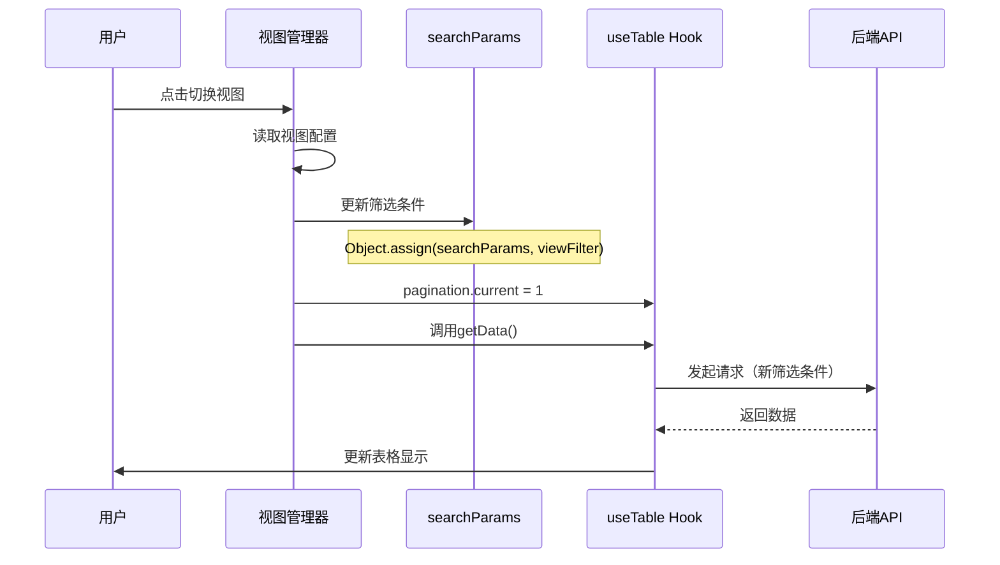
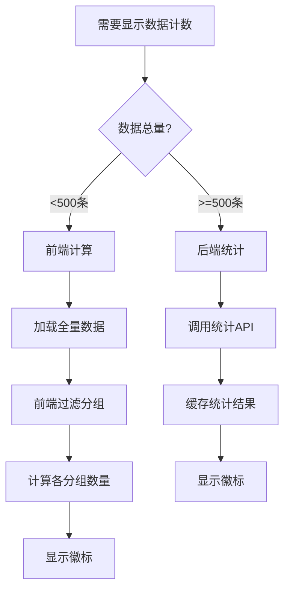
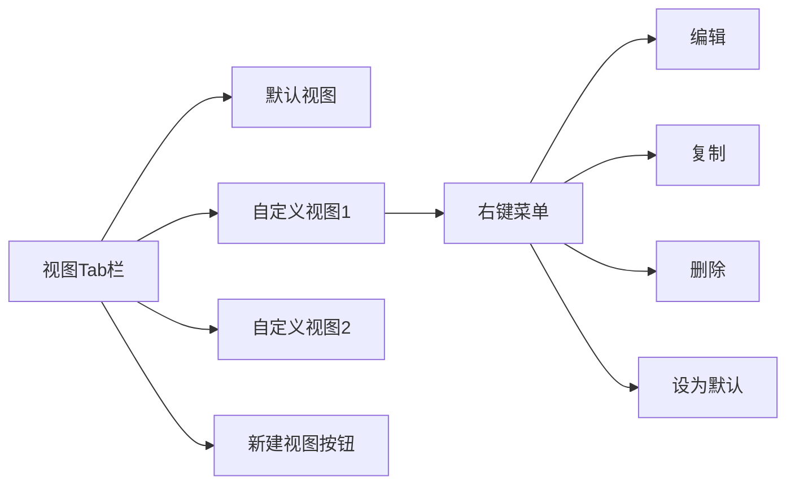
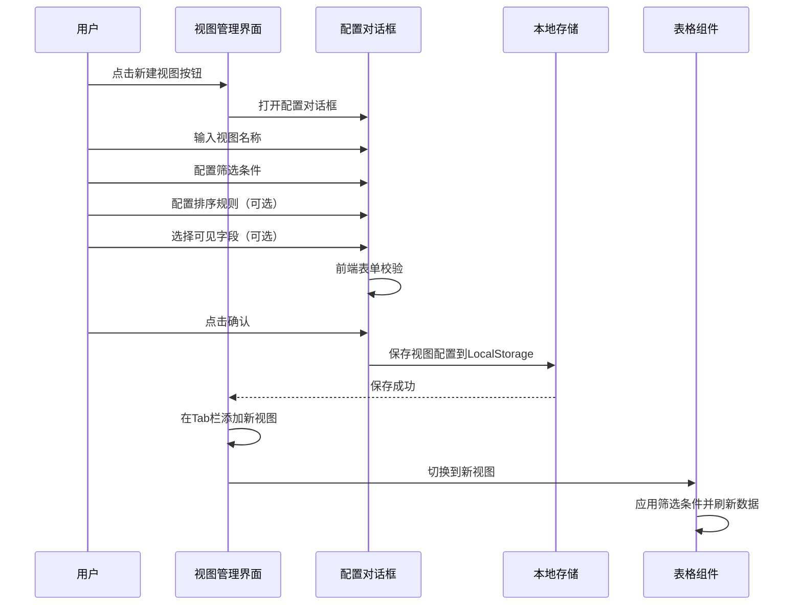
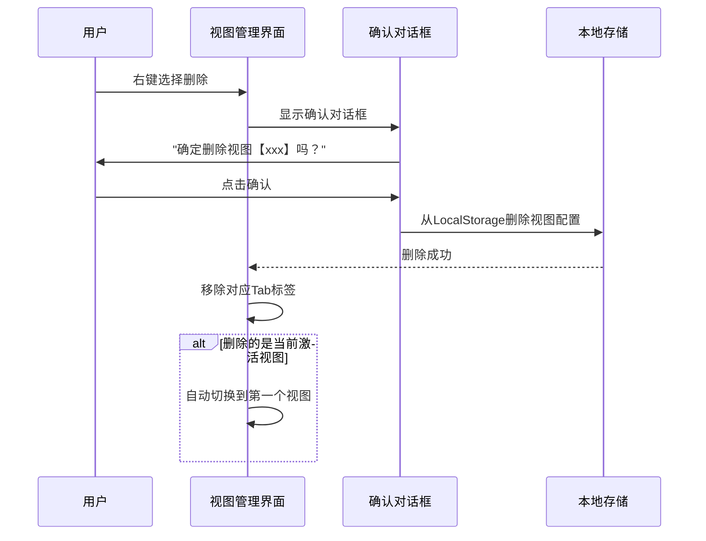
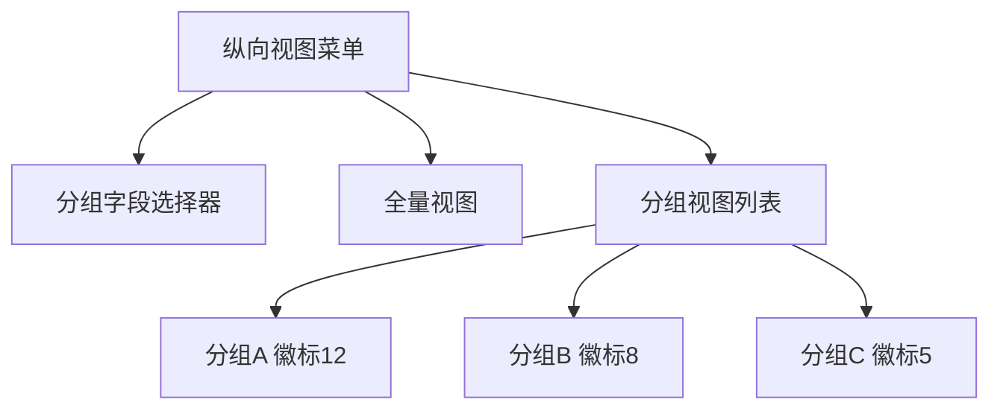
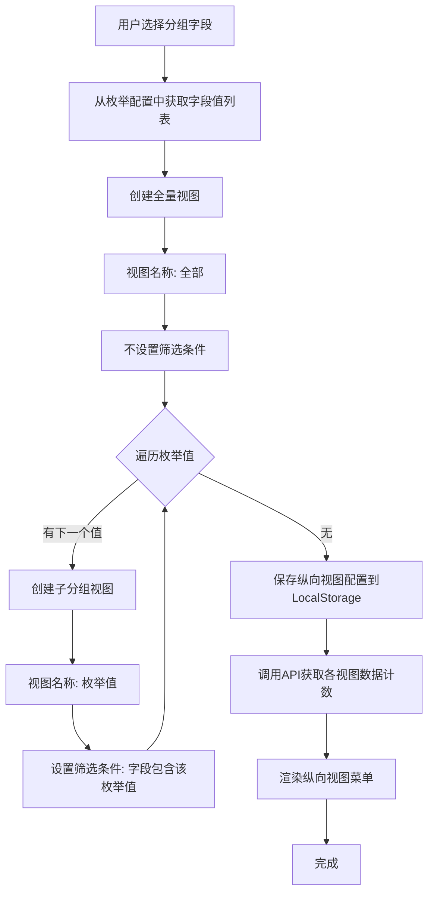

# 钱包监控视图管理功能实现设计

## 一、功能概述

### 1.1 业务目标

为钱包监控页面提供灵活的视图管理能力，支持用户按照不同的业务需求创建、保存和切换数据视图，实现数据的多维度查看和分析。

### 1.2 核心功能点

- 横向视图管理：基于筛选条件的Tab式视图切换
- 纵向视图管理：基于分组字段的侧边栏菜单式视图
- 视图持久化：视图配置本地存储与恢复
- 视图数据统计：实时显示各视图的数据计数

### 1.3 设计原则

- 保持与现有表格组件的兼容性
- 视图配置存储在浏览器本地，不依赖后端
- 横向与纵向视图可以独立使用，也可以组合使用
- 用户操作流程简单直观

## 二、视图数据模型

### 2.1 横向视图配置结构

| 字段名          | 类型    | 必填 | 描述                                     |
| --------------- | ------- | ---- | ---------------------------------------- |
| id              | String  | 是   | 视图唯一标识（UUID）                     |
| name            | String  | 是   | 视图名称                                 |
| type            | String  | 是   | 视图类型，固定值 'horizontal'            |
| filterCondition | Object  | 否   | 筛选条件对象（字段名-值映射）            |
| sortRules       | Array   | 否   | 排序规则数组，格式：[{field, order}]     |
| visibleFields   | Array   | 否   | 可见字段列表，未设置时显示所有字段       |
| isDefault       | Boolean | 否   | 是否为默认视图（首次进入页面时自动加载） |
| order           | Number  | 否   | 视图排序序号，用于控制Tab显示顺序        |
| createdAt       | String  | 是   | 创建时间（ISO 8601格式）                 |
| updatedAt       | String  | 是   | 最后修改时间（ISO 8601格式）             |

筛选条件示例：

```json
{
  "ownership": ["个人", "团队"],
  "status": ["监控中"],
  "totalValue": { "min": 1000, "max": 50000 }
}
```

### 2.2 纵向视图配置结构

| 字段名     | 类型    | 必填 | 描述                                      |
| ---------- | ------- | ---- | ----------------------------------------- |
| id         | String  | 是   | 视图唯一标识（UUID）                      |
| name       | String  | 是   | 视图名称                                  |
| type       | String  | 是   | 视图类型，固定值 'vertical'               |
| groupField | String  | 是   | 分组字段名（如 'ownership', 'status' 等） |
| groupValue | String  | 否   | 分组值，为空表示全量视图                  |
| isAllView  | Boolean | 是   | 是否为全量视图                            |
| parentId   | String  | 否   | 父视图ID，用于构建视图树                  |
| order      | Number  | 否   | 视图排序序号                              |
| createdAt  | String  | 是   | 创建时间（ISO 8601格式）                  |

### 2.3 视图存储结构

视图配置存储在浏览器 LocalStorage 中，键名规则：

- 横向视图：`wallet_monitoring_horizontal_views`
- 纵向视图：`wallet_monitoring_vertical_views`
- 当前激活视图：`wallet_monitoring_active_view`

存储数据格式：

```json
{
  "horizontal": [
    { 横向视图配置对象 }
  ],
  "vertical": {
    "groupField": "ownership",
    "views": [
      { 纵向视图配置对象 }
    ]
  },
  "activeView": {
    "horizontalId": "uuid-xxx",
    "verticalId": "uuid-yyy"
  }
}
```

## 三、技术实现关键点说明

### 3.1 与useTable Hook的集成方案

当前钱包监控页面已使用useTable Hook进行数据管理，视图功能需要在此基础上扩展。

**useTable现有能力分析：**

| 功能项       | useTable支持情况       | 视图管理利用方式                     |
| ------------ | ---------------------- | ------------------------------------ |
| searchParams | ✓ 响应式搜索参数对象   | 直接修改searchParams应用视图筛选条件 |
| getData      | ✓ 获取数据方法         | 切换视图时调用刷新数据               |
| refreshData  | ✓ 全量刷新（清空缓存） | 手动刷新视图使用                     |
| pagination   | ✓ 分页状态管理         | 视图切换时重置为第一页               |
| clearCache   | ✓ 缓存清理策略         | 视图数据变更后清理缓存               |
| columnChecks | ✓ 列显示控制           | 视图可见字段配置映射到此             |

**集成实现方案：**

视图切换触发流程：



**核心代码结构：**

视图管理状态定义：

```typescript
interface ViewState {
  // 当前激活的视图ID
  activeViewId: string
  // 视图列表
  views: ViewConfig[]
  // 视图加载状态
  loading: boolean
}
```

视图切换方法实现逻辑：

```typescript
const switchView = async (viewId: string) => {
  // 1. 查找视图配置
  const view = views.value.find((v) => v.id === viewId)
  if (!view) return

  // 2. 更新searchParams（利用useTable的响应式能力）
  Object.keys(searchParams).forEach((key) => {
    if (key !== 'offset' && key !== 'limit') {
      delete searchParams[key]
    }
  })
  Object.assign(searchParams, view.filterCondition)

  // 3. 重置分页到第一页
  pagination.current = 1

  // 4. 调用useTable的getData刷新数据
  await getData()

  // 5. 保存当前激活视图ID到LocalStorage
  localStorage.setItem('wallet_monitoring_active_view', viewId)
}
```

**字段映射处理：**

视图筛选条件字段名需要与API参数字段名一致：

| 视图筛选字段    | API参数字段                  | 数据类型      | 转换方式              |
| --------------- | ---------------------------- | ------------- | --------------------- |
| ownership       | ownership                    | Array→String  | 数组转逗号分隔字符串  |
| mainChains      | mainChains                   | Array→String  | 数组转逗号分隔字符串  |
| status          | status                       | Array→String  | 数组转逗号分隔字符串  |
| totalValueRange | totalValueMin, totalValueMax | Object→Number | 拆分为min/max两个参数 |

### 3.2 LocalStorage存储容量管理

**容量限制分析：**

- LocalStorage标准容量：5MB
- 单个视图配置估算大小：约0.5KB
- 理论最大视图数量：约10000个
- 实际限制：50个视图（预留空间给其他数据）

**存储优化策略：**

压缩存储：

- 移除JSON中的空白字符
- 使用短键名（如：id→i, name→n）
- 对于重复的枚举值，使用引用而非复制

配额检测机制：

```typescript
const checkStorageQuota = () => {
  try {
    const testKey = '_storage_test_'
    const testData = new Array(1024).join('a') // 1KB测试数据
    localStorage.setItem(testKey, testData)
    localStorage.removeItem(testKey)
    return true
  } catch (e) {
    // 存储空间不足
    return false
  }
}
```

清理策略：

- 按最后使用时间排序，删除最久未用的视图
- 提示用户手动选择删除
- 导出视图配置到文件，清空LocalStorage后重新导入

### 3.3 数据计数实现方案细化

**方案选择决策树：**



**前端计算方案（推荐用于初期）：**

优势：

- 无需额外API接口
- 响应速度快
- 实现简单

限制：

- 需要加载全量数据
- 数据量大时性能下降

实现逻辑：

```typescript
const calculateGroupCounts = (groupField: string) => {
  const counts = new Map<string, number>()

  // 遍历当前加载的所有数据
  data.value.forEach((record) => {
    const fieldValue = record[groupField]

    // 处理多选字段（数组类型）
    if (Array.isArray(fieldValue)) {
      fieldValue.forEach((value) => {
        counts.set(value, (counts.get(value) || 0) + 1)
      })
    } else {
      counts.set(fieldValue, (counts.get(value) || 0) + 1)
    }
  })

  return counts
}
```

**后端统计方案（未来扩展）：**

需要新增API接口：`GET /api/wallet/stats`

响应示例：

```json
{
  "total": 1500,
  "groups": {
    "个人": 800,
    "团队": 500,
    "外部": 200
  }
}
```

缓存策略：统计结果缓存5分钟，数据变更后失效

### 3.4 视图与现有功能的冲突处理

**潜在冲突点分析：**

| 功能     | 冲突场景                         | 解决方案                                         |
| -------- | -------------------------------- | ------------------------------------------------ |
| 随机取数 | 随机取数后如何展示？             | 自动创建临时视图展示抽样结果                     |
| 导入数据 | 导入后各视图计数如何更新？       | 导入成功后清空缓存并刷新当前视图                 |
| 批量编辑 | 编辑后数据可能不符合当前视图筛选 | 编辑成功后刷新当前视图，不符合条件的数据自动消失 |
| 搜索栏   | 视图筛选与搜索栏筛选如何叠加？   | 视图作为基础筛选，搜索栏追加筛选条件             |
| 列配置   | 视图可见字段与列配置冲突？       | 视图配置优先级高于列配置                         |

**随机取数集成方案：**

1. 用户点击随机取数，选择抽样参数
2. 调用随机抽样API获取数据
3. 自动创建临时视图：
   - 视图名称："随机抽样 - {时间戳}"
   - 筛选条件：基于钱包地址列表
   - 标记为临时视图（30天后自动删除）
4. 切换到新创建的视图

**搜索栏与视图筛选叠加逻辑：**

```typescript
const mergeFilters = (viewFilter, searchFilter) => {
  return {
    ...viewFilter,
    ...searchFilter,
    // 多选字段取交集
    ownership: intersect(viewFilter.ownership, searchFilter.ownership),
    // 数值范围取交集
    totalValueMin: Math.max(viewFilter.totalValueMin || 0, searchFilter.totalValueMin || 0)
  }
}
```

## 四、横向视图管理功能设计

### 4.1 UI布局结构



UI组件位置：表格上方、工具栏下方

展示形式：

- 使用 Element Plus 的 ElTabs 组件
- Tab标签可拖拽调整顺序
- 每个Tab显示视图名称
- 当前激活Tab高亮显示
- 右侧显示"+"按钮用于新建视图

### 3.2 视图创建流程



配置对话框表单项：

| 表单项   | 类型         | 必填 | 说明                                   |
| -------- | ------------ | ---- | -------------------------------------- |
| 视图名称 | 单行文本输入 | 是   | 长度限制：1-20字符                     |
| 筛选条件 | 动态表单     | 否   | 支持添加多个字段筛选条件               |
| 排序规则 | 下拉选择     | 否   | 选择字段和排序方向（升序/降序）        |
| 可见字段 | 复选框组     | 否   | 默认全选，用户可取消勾选隐藏字段       |
| 设为默认 | 复选框       | 否   | 是否设为默认视图（页面加载时自动激活） |

筛选条件配置逻辑：

- 文本类字段：支持关键词搜索（包含匹配）
- 数值类字段：支持范围筛选（最小值-最大值）
- 日期类字段：支持日期范围选择
- 多选类字段：支持多值筛选（包含任一值）

### 3.3 视图切换逻辑

用户操作：点击Tab标签

系统处理流程：

1. 记录当前激活视图ID到LocalStorage
2. 从视图配置中读取筛选条件和排序规则
3. 构建查询参数对象
4. 调用表格组件的refreshData方法
5. 应用视图的可见字段配置（控制列显示/隐藏）
6. 重置分页到第一页
7. 显示加载状态直到数据加载完成

查询参数构建规则：

- 筛选条件转换为API查询参数
- 排序规则转换为orderBy参数
- 如果启用了纵向视图，叠加纵向视图的分组筛选条件

### 3.4 视图编辑功能

触发方式：右键点击Tab标签，选择"编辑"菜单项

编辑流程：

1. 读取当前视图配置数据
2. 打开配置对话框并填充现有配置
3. 用户修改配置后点击确认
4. 验证配置数据有效性
5. 更新LocalStorage中的视图配置
6. 如果编辑的是当前激活视图，立即应用新配置并刷新数据
7. 更新Tab标签显示名称

限制规则：

- 视图名称不能与其他视图重名
- 至少保留一个视图（不能删除最后一个）
- 筛选条件字段必须存在于当前表格配置中

### 3.5 视图复制功能

触发方式：右键点击Tab标签，选择"复制"菜单项

复制逻辑：

1. 读取源视图配置
2. 生成新的视图ID
3. 视图名称自动追加"（副本）"后缀
4. 继承源视图的所有配置（筛选条件、排序、可见字段）
5. 保存新视图配置到LocalStorage
6. 在Tab栏添加新视图标签
7. 自动切换到复制的新视图

应用场景：

- 基于现有视图快速创建相似配置的新视图
- 实验性修改视图配置前先复制备份

### 3.6 视图删除功能

触发方式：右键点击Tab标签，选择"删除"菜单项

删除流程：



删除限制：

- 至少保留一个视图（最后一个视图不允许删除）
- 系统内置的默认视图可以删除，但会在下次页面加载时自动重建

### 3.7 视图拖拽排序

功能描述：支持拖拽Tab标签调整视图显示顺序

实现方案：

- 使用 Sortable.js 或 Vue Draggable 库
- 监听拖拽结束事件，更新视图配置的order字段
- 保存新的排序到LocalStorage
- 重新渲染Tab栏

## 四、纵向视图管理功能设计

### 4.1 UI布局结构



UI组件位置：页面左侧，宽度约200px

展示形式：

- 使用 Element Plus 的 ElMenu 组件
- 顶部显示分组字段下拉选择器
- 全量视图固定在顶部，显示所有数据计数
- 下方显示按分组值生成的子视图
- 每个子视图右侧显示数据计数徽标

分组字段选择器：

- 仅显示多选类型字段（ownership、mainChains、status等）
- 切换分组字段时重新生成纵向视图列表
- 当前选择的分组字段高亮显示

### 4.2 纵向视图生成逻辑



分组筛选规则：

对于多选字段，采用包含匹配策略：

- 例如：分组字段为 `ownership`，枚举值包括：`["个人", "团队", "外部"]`
- 某条记录的 `ownership` 值为 `["个人", "团队"]`
- 则该记录同时出现在"个人"分组视图和"团队"分组视图中
- 全量视图包含所有记录，不做任何过滤

### 4.3 纵向视图切换逻辑

用户操作：点击左侧菜单项

系统处理流程：

1. 记录当前激活的纵向视图ID到LocalStorage
2. 读取该视图的分组筛选条件
3. 如果有横向视图，合并横向视图的筛选条件和纵向视图的分组条件
4. 构建最终查询参数
5. 调用表格组件的refreshData方法
6. 高亮显示当前激活的菜单项
7. 重置分页到第一页

筛选条件合并规则：

- 横向视图筛选条件和纵向视图分组条件进行逻辑与（AND）合并
- 例如：横向视图筛选 `status: ["监控中"]`，纵向视图筛选 `ownership: ["个人"]`
- 最终查询条件：`{ status: ["监控中"], ownership: ["个人"] }`

### 4.4 纵向与横向视图协同

协同模式：

- 纵向视图作为一级筛选（大分类）
- 横向视图作为二级筛选（细分条件）
- 每个纵向分组视图内部支持独立的横向视图集合

存储结构：

```json
{
  "vertical": {
    "groupField": "ownership",
    "activeGroupValue": "个人"
  },
  "horizontal": {
    "个人": [
      { 横向视图1 },
      { 横向视图2 }
    ],
    "团队": [
      { 横向视图1 },
      { 横向视图3 }
    ]
  }
}
```

切换行为：

- 切换纵向视图时，加载该分组下的横向视图列表
- 如果目标分组没有横向视图，显示默认全部视图
- 切换横向视图时，保持纵向视图不变

### 4.5 数据计数显示

计数更新时机：

- 纵向视图初始化时
- 数据新增、修改、删除后
- 切换分组字段后
- 用户手动刷新时

计数实现方式：

方案一（推荐）：前端计算

- 优点：响应速度快，无需额外API请求
- 实现：基于当前加载的数据进行计数
- 适用场景：数据量较小（<1000条）

方案二：后端统计

- 优点：数据准确，适合大数据量场景
- 实现：调用专门的统计API，返回各分组的计数
- 适用场景：数据量大（>1000条）

计数显示格式：

- 在菜单项右侧显示徽标（Badge）
- 数字超过999时显示为"999+"
- 计数为0时显示灰色徽标

## 五、视图持久化策略

### 5.1 存储机制

存储技术：浏览器 LocalStorage

存储键名设计：

| 键名                                   | 存储内容             | 数据类型 |
| -------------------------------------- | -------------------- | -------- |
| wallet_monitoring_views_config         | 完整视图配置         | JSON     |
| wallet_monitoring_active_horizontal    | 当前激活的横向视图ID | String   |
| wallet_monitoring_active_vertical      | 当前激活的纵向视图ID | String   |
| wallet_monitoring_vertical_group_field | 当前纵向分组字段     | String   |

### 5.2 数据序列化与反序列化

保存数据时：

1. 将视图配置对象转换为JSON字符串
2. 使用 `localStorage.setItem()` 保存
3. 捕获存储异常（如超出配额限制）

读取数据时：

1. 使用 `localStorage.getItem()` 读取
2. 解析JSON字符串为对象
3. 验证数据结构完整性
4. 如果数据损坏，使用默认配置替代

数据验证规则：

- 检查必填字段是否存在
- 检查字段类型是否正确
- 检查枚举值是否在有效范围内

### 5.3 默认视图配置

系统内置默认横向视图：

``json { "id": "default-view", "name": "全部钱包", "type": "horizontal", "filterCondition": {}, "sortRules": [], "visibleFields": [], "isDefault": true, "order": 0, "createdAt": "2024-01-01T00:00:00Z", "updatedAt": "2024-01-01T00:00:00Z" }

````

首次加载行为：

1. 检查LocalStorage是否存在视图配置
2. 如果不存在，创建默认视图并保存
3. 自动激活默认视图并加载数据

### 5.4 数据迁移与兼容性

版本管理：

在视图配置中增加版本字段：

```json
{
  "version": "1.0.0",
  "views": [...]
}
````

升级策略：

- 当检测到配置版本低于当前系统版本时，执行数据迁移逻辑
- 迁移完成后更新版本号并保存
- 保留原始配置备份，键名追加 `_backup_v{旧版本号}`

降级兼容：

- 如果用户在旧版本浏览器中访问，能识别当前配置版本
- 不支持的新特性字段自动忽略，不影响基本功能使用

## 六、API接口设计

### 6.1 视图数据统计接口

接口路径：`GET /api/wallet/stats`

请求参数：

| 参数名     | 类型   | 必填 | 描述                         |
| ---------- | ------ | ---- | ---------------------------- |
| groupField | String | 是   | 分组字段名                   |
| filters    | Object | 否   | 额外筛选条件（用于横向视图） |

响应数据结构：

``json { "total": 150, "groups": [ { "value": "个人", "count": 50 }, { "value": "团队", "count": 80 }, { "value": "外部", "count": 20 } ] }

```

### 6.2 视图筛选查询接口

复用现有钱包列表查询接口：`GET /api/wallet/list`

扩展查询参数：

| 参数名         | 类型   | 必填 | 描述                                      |
| -------------- | ------ | ---- | ----------------------------------------- |
| ownership      | String | 否   | 归属标签筛选，多值用逗号分隔              |
| mainChains     | String | 否   | 主链筛选，多值用逗号分隔                  |
| status         | String | 否   | 状态筛选，多值用逗号分隔                  |
| totalValueMin  | Number | 否   | 钱包总价值最小值                          |
| totalValueMax  | Number | 否   | 钱包总价值最大值                          |
| orderBy        | String | 否   | 排序字段，格式：`字段名:asc/desc`         |

## 七、性能优化策略

### 7.1 视图切换优化

缓存策略：

- 缓存每个视图的查询结果，避免重复请求
- 缓存有效期5分钟，超时后自动失效
- 数据变更后清除相关缓存

懒加载：

- 纵向视图的数据计数采用懒加载，切换到某个分组时再计算
- 横向视图的筛选条件动态生成，减少初始加载时间

### 7.2 大数据量场景优化

分页查询：

- 视图切换时重置分页到第一页
- 每页默认显示20条记录，可配置
- 支持跳页和改变每页条数

虚拟滚动：

- 当单个视图数据量超过500条时，启用虚拟滚动
- 仅渲染可视区域的行，提升渲染性能

### 7.3 存储空间优化

压缩策略：

- 视图配置数据在保存前进行压缩（移除空白字符）
- 定期清理超过30天未使用的视图配置

配额管理：

- 监控LocalStorage使用量
- 当接近配额限制时，提示用户删除不常用视图
- 最多保留50个横向视图

## 八、用户交互设计

### 8.1 视图操作引导

首次使用引导：

- 用户首次进入页面时，显示操作提示浮层
- 高亮视图管理相关按钮
- 提供快捷创建视图的示例场景

操作反馈：

- 视图切换时显示加载提示
- 视图保存成功后显示Toast提示
- 视图删除时显示确认对话框，防止误操作

### 8.2 错误处理

常见错误场景及处理：

| 错误场景                 | 处理方式                                       |
| ------------------------ | ---------------------------------------------- |
| LocalStorage不可用       | 提示用户启用浏览器存储，视图配置仅在会话中有效 |
| 视图配置数据损坏         | 自动恢复为默认配置，并提示用户                 |
| 视图数据加载失败         | 显示错误提示，提供重试按钮                     |
| 视图名称重复             | 表单验证提示，禁止保存                         |
| 分组字段不存在           | 自动切换到默认分组字段                         |

### 8.3 响应式设计

移动端适配：

- 小屏幕下纵向视图菜单自动收起为抽屉式
- 横向视图Tab改为下拉选择器
- 视图配置对话框全屏显示

触摸操作支持：

- 支持左右滑动切换横向视图
- 长按Tab标签显示操作菜单
- 纵向视图菜单支持手势展开/收起

## 九、测试验收标准

### 9.1 功能测试点

横向视图管理：

- 创建新视图并保存成功
- 编辑现有视图并应用配置
- 复制视图生成新视图
- 删除视图并自动切换
- 拖拽调整视图顺序

纵向视图管理：

- 切换分组字段生成新视图列表
- 点击纵向视图切换数据
- 数据计数准确显示
- 全量视图显示所有数据

视图协同：

- 横向视图与纵向视图筛选条件正确叠加
- 切换纵向视图后保留横向视图状态
- 数据变更后各视图计数实时更新

### 9.2 性能测试标准

| 测试场景             | 性能指标               |
| -------------------- | ---------------------- |
| 视图切换响应时间     | ≤300ms                 |
| 视图配置保存时间     | ≤100ms                 |
| 纵向视图生成时间     | ≤200ms（10个分组以内） |
| 数据计数查询时间     | ≤500ms                 |
| LocalStorage读写时间 | ≤50ms                  |

### 9.3 兼容性测试

浏览器兼容性：

- Chrome 90+
- Firefox 88+
- Safari 14+
- Edge 90+

设备适配：

- 桌面端（1920x1080及以上分辨率）
- 平板端（768x1024）
- 移动端（375x667）

## 十、开发工具与环境

### 10.1 MCP工具使用规范

数据库操作工具：

- 工具名称：mysql-mcp
- 使用场景：
  - 执行数据库表结构DDL操作（CREATE TABLE、ALTER TABLE）
  - 执行数据库DML操作（INSERT、UPDATE、DELETE、SELECT）
  - 查询数据库表结构和数据
  - 基于新建的表，更新初始化数据库脚本（scripts/init-database.sql）。注意不是用初始化脚本重新建表。
- 连接配置：读取项目根目录.env.development文件中的数据库配置

浏览器调试工具：

- 工具名称：chrome-devtools-mcp
- 使用场景：
  - 前端页面交互测试
  - UI组件渲染效果验证
  - 表格编辑功能测试
  - 导入导出功能测试
  - 视图切换交互验证
  - 浏览器兼容性测试

代码文档查询工具：

- 工具名称：context7
- 使用场景：
  - 查询Vue、TypeScript、Element Plus等技术栈的官方文档
  - 查询第三方库（xlsx、pinia等）的API文档
  - 学习最佳实践和代码示例

### 10.2 开发环境配置

技术栈要求：

- Vue 3 + TypeScript
- Element Plus UI组件库
- Pinia状态管理
- Vite构建工具
- Node.js >= 20.19.0

推荐开发工具：

- VS Code + Volar插件
- Chrome DevTools
- Vue DevTools浏览器扩展

## 十一、实现优先级

### 第一阶段（核心功能）

- 横向视图的创建、编辑、删除
- 视图配置的本地存储与恢复
- 视图切换与数据筛选
- 默认视图的初始化

### 第二阶段（高级功能）

- 纵向视图的分组展示
- 数据计数统计
- 横向与纵向视图协同
- 视图拖拽排序

### 第三阶段（优化增强）

- 视图配置导入导出
- 视图使用频率统计
- 智能推荐视图
- 视图分享功能

## 十二、风险点与缓解策略

### 12.1 技术风险

| 风险项 | 影响程度 | 缓解策略 | 备选方案 |
| --- | --- | --- | --- |
| LocalStorage容量限制 | 中 | 限制视图数量为50个，提供导出/导入功能 | 迁移到IndexedDB |
| useTable集成复杂度 | 低 | 通过searchParams直接修改，不需深度修改useTable | - |
| 视图配置数据损坏 | 低 | 增加数据校验和错误恢复机制 | 恢复为默认视图 |
| 多选字段筛选逻辑 | 低 | 数组转逗号分隔字符串，后端使用LIKE查询 | - |
| 纵向视图性能 | 中 | 首期只实现横向视图，纵向视图作为第二阶段 | - |

### 12.2 产品风险

| 风险项 | 影响程度 | 缓解策略 |
| --- | --- | --- |
| 用户学习成本 | 中 | 提供首次使用引导，内置常用视图模板 |
| 视图过多导致管理混乱 | 低 | 支持视图分组、标签、搜索功能 |
| 视图配置复杂性 | 中 | 提供简单模式和高级模式切换 |

### 12.3 数据一致性风险

| 场景 | 问题 | 解决方案 |
| --- | --- | --- |
| 多浏览器窗口同时修改视图 | 视图配置冲突 | 监听LocalStorage变化事件，自动同步 |
| 视图删除后切换失败 | 页面报错 | 删除视图时检查是否为当前视图，自动切换到默认视图 |
| 数据变更后计数不准 | 显示错误 | 每次数据变更后清空统计缓存 |

## 十三、后续扩展方向

### 13.1 短期优化（3个月内）

- 视图内添加过滤器（不需重新配置视图）
- 视图收藏功能（常用视图置顶）
- 视图历史记录（快速回到之前的视图）

### 13.2 中期规划（6个月内）

- 视图分享给其他用户
- 团队视图模板库
- 视图使用分析报告

### 13.3 长期演进（1年内）

- AI智能推荐视图配置
- 视图配置自动优化建议
- 跨页面视图配置复用
```
