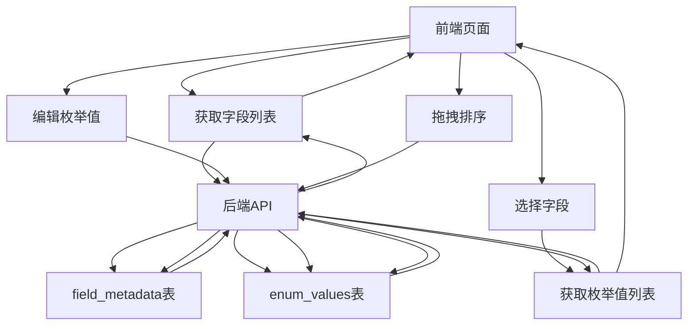
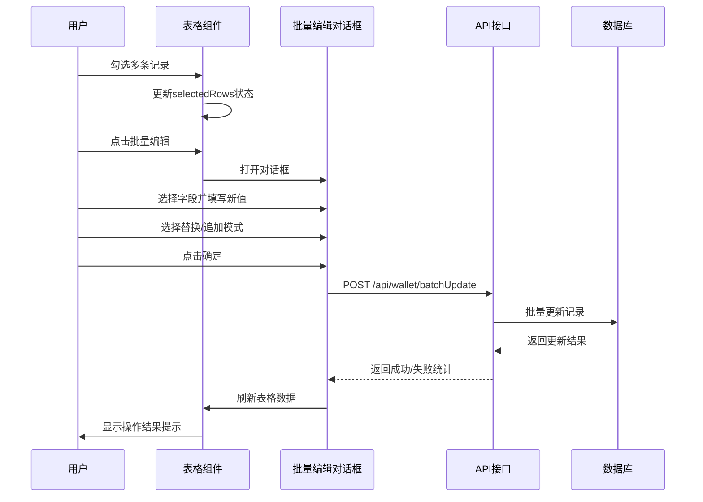
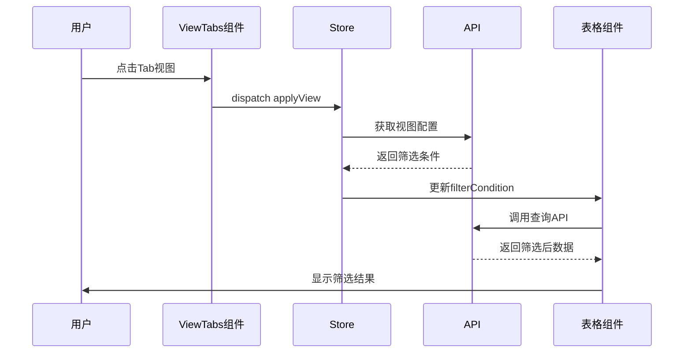
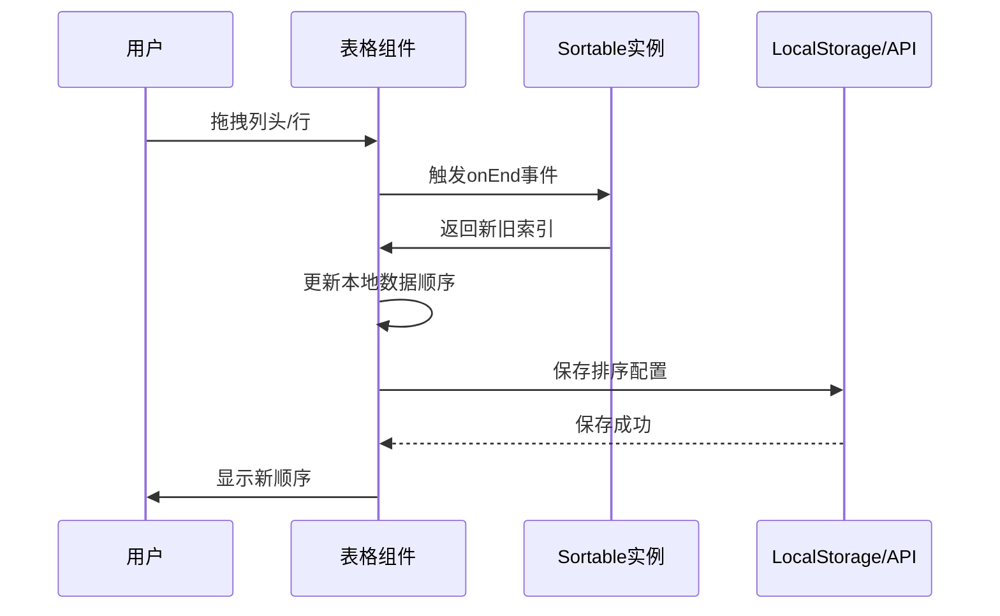
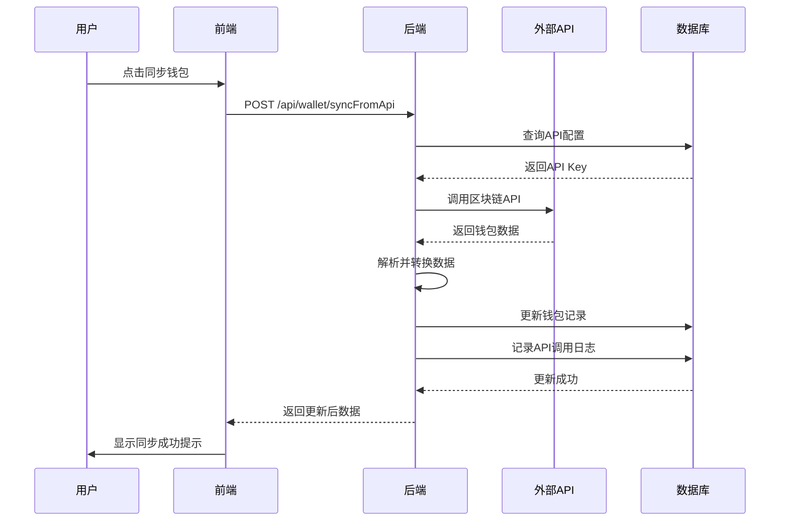
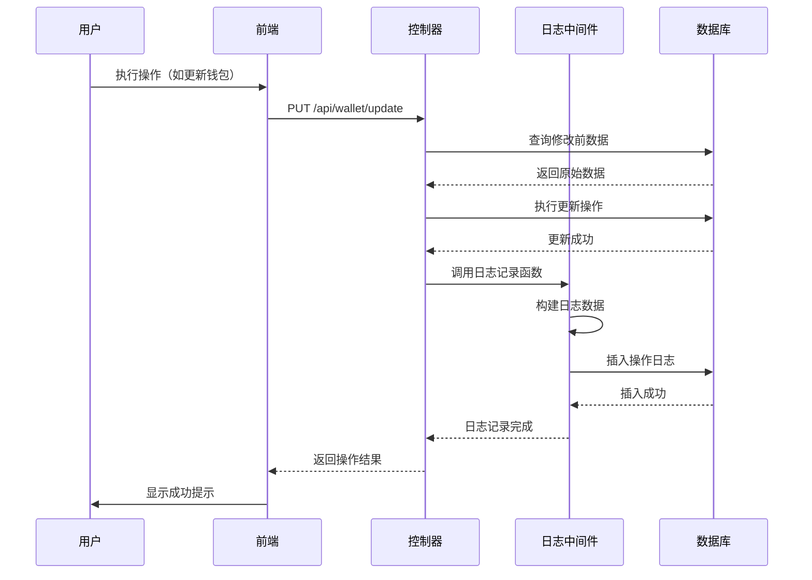

# EVM链钱包监控功能增强设计文档

## 文档概述

本文档针对EVM链钱包监控功能的未完成部分，提供详细的实现方案。根据完成情况检查报告，核心功能（P0）已100%完成，本设计将重点完善P1重要功能和部分P2增强功能。

## 当前完成情况总结

### 已完成功能

- 数据库表结构完整，支持JSON类型字段存储多选数据
- 后端API全部实现（查询、创建、批量创建、更新、批量更新、删除）
- 前端TypeScript类型定义完整
- 基础表格展示、可编辑单元格、CRUD操作、导入导出功能全部就绪
- 支持懒加载分页模式

### 待完善功能

- P1：枚举值管理界面、批量操作UI、视图管理、字段配置拖拽排序
- P2：虚拟滚动、随机取数、导入预览、API集成、操作日志

## 一、P1重要功能实现方案

### 1.1 枚举值管理功能

#### 功能目标

为系统提供独立的枚举值配置管理界面，支持动态维护各字段的可选值列表，避免硬编码在前端代码中。

#### 数据模型设计

##### 字段元数据表（field_metadata）

| 字段名 | 类型 | 说明 | 约束 |
| --- | --- | --- | --- |
| id | VARCHAR(36) | 主键UUID | PRIMARY KEY |
| fieldName | VARCHAR(100) | 字段名称（如ownership） | UNIQUE, NOT NULL |
| fieldLabel | VARCHAR(100) | 字段显示名称（如"归属标签"） | NOT NULL |
| fieldType | VARCHAR(50) | 字段类型（text/number/datetime/multiSelect） | NOT NULL |
| category | VARCHAR(50) | 字段分类（wallet/user/system） | NOT NULL |
| isSystem | TINYINT(1) | 是否系统字段（不可删除） | DEFAULT 0 |
| sortOrder | INT | 显示排序 | DEFAULT 0 |
| isVisible | TINYINT(1) | 是否默认显示 | DEFAULT 1 |
| createdAt | DATETIME | 创建时间 | DEFAULT CURRENT_TIMESTAMP |
| updatedAt | DATETIME | 更新时间 | ON UPDATE CURRENT_TIMESTAMP |

##### 枚举值表（enum_values）

| 字段名 | 类型 | 说明 | 约束 |
| --- | --- | --- | --- |
| id | VARCHAR(36) | 主键UUID | PRIMARY KEY |
| fieldName | VARCHAR(100) | 关联字段名 | NOT NULL, INDEX |
| value | VARCHAR(200) | 枚举值 | NOT NULL |
| label | VARCHAR(200) | 显示标签 | NOT NULL |
| color | VARCHAR(50) | 标签颜色（primary/success/warning/danger/info） | NULL |
| sortOrder | INT | 显示排序 | DEFAULT 0 |
| isActive | TINYINT(1) | 是否启用 | DEFAULT 1 |
| createdAt | DATETIME | 创建时间 | DEFAULT CURRENT_TIMESTAMP |
| updatedAt | DATETIME | 更新时间 | ON UPDATE CURRENT_TIMESTAMP |

UNIQUE KEY (fieldName, value)

#### 后端接口设计

##### 字段元数据管理API

| 接口路径 | 方法 | 功能 | 请求参数 | 响应数据 |
| --- | --- | --- | --- | --- |
| /api/field-metadata/list | GET | 获取字段列表 | category?: string | FieldMetadata[] |
| /api/field-metadata/create | POST | 创建字段 | FieldMetadata | FieldMetadata |
| /api/field-metadata/update | PUT | 更新字段 | id, updateFields | FieldMetadata |
| /api/field-metadata/delete/:id | DELETE | 删除字段 | id | {success: boolean} |
| /api/field-metadata/reorder | POST | 调整排序 | fieldOrders: {id, sortOrder}[] | {success: boolean} |

##### 枚举值管理API

| 接口路径 | 方法 | 功能 | 请求参数 | 响应数据 |
| --- | --- | --- | --- | --- |
| /api/enum-values/list | GET | 获取枚举值列表 | fieldName?: string | EnumValue[] |
| /api/enum-values/create | POST | 创建枚举值 | EnumValue | EnumValue |
| /api/enum-values/batchCreate | POST | 批量创建枚举值 | values: EnumValue[] | {count: number} |
| /api/enum-values/update | PUT | 更新枚举值 | id, updateFields | EnumValue |
| /api/enum-values/delete/:id | DELETE | 删除枚举值 | id | {success: boolean} |
| /api/enum-values/reorder | POST | 调整排序 | valueOrders: {id, sortOrder}[] | {success: boolean} |

#### 前端TypeScript类型定义

```typescript
declare namespace Api.FieldMetadata {
  // 字段元数据
  interface FieldMetadata {
    id: string
    fieldName: string
    fieldLabel: string
    fieldType: 'text' | 'number' | 'datetime' | 'multiSelect'
    category: string
    isSystem: boolean
    sortOrder: number
    isVisible: boolean
    createdAt: string
    updatedAt: string
  }

  // 枚举值
  interface EnumValue {
    id: string
    fieldName: string
    value: string
    label: string
    color?: 'primary' | 'success' | 'warning' | 'danger' | 'info'
    sortOrder: number
    isActive: boolean
    createdAt: string
    updatedAt: string
  }
}
```

#### 前端页面结构

##### 页面路径

`/src/views/system/field-config/index.vue`

##### 功能模块

1. **字段列表展示**：使用ArtTable组件展示所有字段，支持按分类筛选
2. **字段编辑**：支持修改字段显示名称、类型、排序、可见性
3. **枚举值管理**：点击字段行展开抽屉，显示该字段的枚举值列表
4. **枚举值编辑**：支持添加、编辑、删除、排序、启用/禁用枚举值
5. **拖拽排序**：使用Sortablejs库实现字段和枚举值的拖拽排序

#### 数据流程图



#### 实现要点

1. **初始化数据迁移**：创建数据迁移脚本，将现有硬编码的枚举值写入enum_values表
2. **字段元数据初始化**：将钱包监控的11个字段信息写入field_metadata表
3. **动态加载机制**：前端页面启动时从API加载枚举值，替代硬编码选项
4. **缓存策略**：前端使用Pinia store缓存枚举值，减少重复请求
5. **权限控制**：仅管理员角色可访问字段配置页面

---

### 1.2 批量操作UI实现

#### 功能目标

在钱包监控表格中增加批量选择和批量编辑功能，提升批量数据处理效率。

#### 功能点设计

##### 批量选择功能

1. **表格多选列**：在表格第一列添加selection类型列，支持全选/反选
2. **选择状态提示**：表格上方显示"已选择 X 条记录"提示条
3. **清空选择**：提供清空选择按钮

##### 批量编辑功能

1. **批量编辑对话框**：支持同时修改多条记录的相同字段
2. **字段选择器**：用户可选择要批量修改的字段
3. **操作模式切换**：
   - **替换模式**：用新值完全替换原有值
   - **追加模式**：将新值追加到数组字段（仅适用于多选字段）
4. **预览功能**：显示将被影响的记录数量

##### 批量删除功能

1. **批量删除按钮**：在工具栏提供批量删除按钮
2. **二次确认**：显示确认对话框，列出将被删除的钱包地址
3. **删除反馈**：显示删除成功/失败的记录数量

#### 前端组件结构

##### 工具栏按钮区域

```
<ElSpace wrap>
  <ElButton
    v-show="selectedRows.length > 0"
    type="primary"
    @click="handleBatchEdit">
    批量编辑 ({{ selectedRows.length }})
  </ElButton>
  <ElButton
    v-show="selectedRows.length > 0"
    type="danger"
    @click="handleBatchDelete">
    批量删除 ({{ selectedRows.length }})
  </ElButton>
  <ElButton
    v-show="selectedRows.length > 0"
    @click="clearSelection">
    清空选择
  </ElButton>
  <!-- 其他按钮 -->
</ElSpace>
```

##### 批量编辑对话框结构

1. **字段选择区**：CheckboxGroup选择要修改的字段
2. **字段编辑区**：根据选择的字段动态显示对应的编辑器
3. **操作模式选择**：Radio选择替换/追加模式（仅多选字段显示）
4. **影响预览**：显示"将影响 X 条记录"

#### 状态管理设计

##### 组件内部状态

```typescript
// 选中的行数据
const selectedRows = ref<Api.Wallet.WalletRecord[]>([])

// 批量编辑表单
const batchEditForm = reactive({
  selectedFields: [] as string[], // 选中要编辑的字段
  updateMode: 'replace' as 'replace' | 'append', // 操作模式
  values: {} as Record<string, any> // 各字段的新值
})

// 批量编辑对话框显示状态
const batchEditDialogVisible = ref(false)
```

##### 关键方法

| 方法名                | 功能               | 参数                 | 返回值        |
| --------------------- | ------------------ | -------------------- | ------------- |
| handleSelectionChange | 处理表格选择变化   | rows: WalletRecord[] | void          |
| handleBatchEdit       | 打开批量编辑对话框 | -                    | void          |
| handleBatchDelete     | 批量删除记录       | -                    | Promise<void> |
| submitBatchEdit       | 提交批量编辑       | -                    | Promise<void> |
| clearSelection        | 清空选择           | -                    | void          |

#### 批量更新流程图



#### API请求参数结构

##### 批量更新请求参数

```typescript
interface BatchUpdateParams {
  walletAddresses: string[] // 要更新的钱包地址列表
  updateFields: Record<
    string,
    {
      value: any
      operation?: 'replace' | 'append' // 对于数组字段，指定操作模式
    }
  >
}
```

##### 请求示例

```json
{
  "walletAddresses": ["0xabc...", "0xdef..."],
  "updateFields": {
    "ownership": {
      "value": ["团队"],
      "operation": "append"
    },
    "status": {
      "value": ["监控中"],
      "operation": "replace"
    }
  }
}
```

#### 实现要点

1. **表格配置修改**：在columnsFactory中增加type: 'selection'列
2. **选择状态同步**：使用@selection-change事件监听选择变化
3. **条件渲染**：批量操作按钮仅在有选择时显示
4. **操作反馈**：使用ElMessage显示成功/失败信息，包含统计数据
5. **数据刷新**：批量操作成功后自动调用refreshData刷新表格
6. **错误处理**：捕获API错误，显示具体失败原因

---

### 1.3 视图管理功能

#### 功能目标

提供灵活的视图切换和数据分组功能，支持横向Tab视图和纵向侧边栏分组视图，帮助用户快速筛选和查看特定类别的钱包数据。

#### 功能设计

##### 横向视图（Tab切换）

1. **快捷筛选视图**：基于预定义的筛选条件快速切换数据视图
2. **视图类型**：
   - 全部钱包（默认视图）
   - 高价值钱包（totalValue > 10000）
   - 活跃钱包（addressActivity > 30）
   - 监控中钱包（status包含"监控中"）
   - 高风险钱包（alertMark不为空）
3. **视图数量统计**：每个Tab显示对应数量徽章

##### 纵向视图（侧边栏分组）

1. **分组维度**：
   - 按归属分组（ownership）
   - 按主链分组（mainChains）
   - 按状态分组（status）
   - 按活动标签分组（activityTags）
2. **分组展示**：树形结构，显示分组名称和数量
3. **点击筛选**：点击分组节点，表格自动筛选对应数据

##### 自定义视图配置

1. **保存自定义视图**：用户可保存当前筛选条件为自定义视图
2. **视图命名**：用户为自定义视图命名
3. **视图管理**：支持编辑、删除自定义视图
4. **用户隔离**：每个用户的自定义视图独立保存

#### 数据模型设计

##### 视图配置表（view_config）

| 字段名          | 类型         | 说明                      | 约束                        |
| --------------- | ------------ | ------------------------- | --------------------------- |
| id              | VARCHAR(36)  | 主键UUID                  | PRIMARY KEY                 |
| userId          | VARCHAR(36)  | 用户ID                    | NOT NULL, INDEX             |
| viewName        | VARCHAR(100) | 视图名称                  | NOT NULL                    |
| viewType        | VARCHAR(50)  | 视图类型（preset/custom） | NOT NULL                    |
| category        | VARCHAR(50)  | 应用分类（wallet）        | NOT NULL                    |
| filterCondition | JSON         | 筛选条件JSON              | NULL                        |
| sortRules       | JSON         | 排序规则JSON              | NULL                        |
| isDefault       | TINYINT(1)   | 是否默认视图              | DEFAULT 0                   |
| sortOrder       | INT          | 显示排序                  | DEFAULT 0                   |
| createdAt       | DATETIME     | 创建时间                  | DEFAULT CURRENT_TIMESTAMP   |
| updatedAt       | DATETIME     | 更新时间                  | ON UPDATE CURRENT_TIMESTAMP |

UNIQUE KEY (userId, viewName)

##### 筛选条件JSON结构示例

```json
{
  "ownership": ["团队", "个人"],
  "mainChains": ["ETH", "ARB"],
  "status": ["监控中"],
  "totalValueMin": 1000,
  "totalValueMax": 50000,
  "addressActivityMin": 10
}
```

#### 后端接口设计

| 接口路径 | 方法 | 功能 | 请求参数 | 响应数据 |
| --- | --- | --- | --- | --- |
| /api/view-config/list | GET | 获取用户的视图列表 | category: string | ViewConfig[] |
| /api/view-config/preset | GET | 获取预设视图列表 | category: string | ViewConfig[] |
| /api/view-config/create | POST | 创建自定义视图 | ViewConfig | ViewConfig |
| /api/view-config/update | PUT | 更新视图 | id, updateFields | ViewConfig |
| /api/view-config/delete/:id | DELETE | 删除视图 | id | {success: boolean} |
| /api/view-config/setDefault/:id | POST | 设置默认视图 | id | {success: boolean} |
| /api/wallet/groupByField | POST | 按字段分组统计 | fieldName, filterCondition? | GroupStat[] |

##### GroupStat响应结构

```typescript
interface GroupStat {
  fieldValue: string // 分组字段值
  count: number // 记录数量
  totalValue?: number // 可选：该分组的总价值
}
```

#### 前端页面布局

##### 整体布局结构

```
┌────────────────────────────────────────────────────────┐
│ 横向Tab视图区                                           │
│ [全部] [高价值] [活跃] [监控中] [高风险] [+自定义视图] │
├──────────┬────────────────────────────────────────────┤
│          │  表格工具栏                                  │
│          ├────────────────────────────────────────────┤
│ 纵向分组 │                                            │
│ 侧边栏   │  钱包监控表格                               │
│          │                                            │
│ [展开]   │                                            │
│ ▼ 按归属 │                                            │
│   团队(5)│                                            │
│   个人(3)│                                            │
│ ▼ 按主链 │                                            │
│   ETH(8) │                                            │
│   ARB(4) │                                            │
└──────────┴────────────────────────────────────────────┘
```

##### 核心组件

1. **ViewTabs组件**：横向Tab切换组件
2. **GroupSidebar组件**：纵向分组侧边栏组件
3. **ViewManager组件**：自定义视图管理对话框

#### 状态管理设计

##### Pinia Store扩展

```typescript
// src/store/modules/walletView.ts
interface WalletViewState {
  currentView: ViewConfig | null // 当前激活的视图
  customViews: ViewConfig[] // 用户自定义视图列表
  presetViews: ViewConfig[] // 预设视图列表
  groupStats: Record<string, GroupStat[]> // 分组统计数据缓存
  sidebarCollapsed: boolean // 侧边栏折叠状态
}
```

##### 核心Actions

| Action名       | 功能             | 参数              | 返回值               |
| -------------- | ---------------- | ----------------- | -------------------- |
| loadViews      | 加载用户视图列表 | -                 | Promise<void>        |
| applyView      | 应用视图筛选条件 | viewId: string    | Promise<void>        |
| saveCustomView | 保存自定义视图   | viewData          | Promise<ViewConfig>  |
| deleteView     | 删除视图         | viewId: string    | Promise<void>        |
| loadGroupStats | 加载分组统计数据 | fieldName: string | Promise<GroupStat[]> |

#### 视图切换流程图



#### 实现要点

1. **预设视图初始化**：系统启动时在view_config表中初始化预设视图数据
2. **Tab徽章更新**：每次切换视图时，异步更新各Tab的数量徽章
3. **侧边栏懒加载**：分组数据在侧边栏展开时才加载，减少初始请求
4. **筛选条件合并**：横向视图和纵向分组可组合使用，筛选条件取交集
5. **URL状态同步**：将当前视图ID同步到URL query参数，支持分享链接
6. **本地缓存**：使用localStorage缓存用户最后使用的视图，下次打开自动应用

---

### 1.4 字段拖拽排序功能

#### 功能目标

为字段配置管理页面和钱包监控表格增加拖拽排序功能，允许用户自定义字段显示顺序。

#### 应用场景

##### 场景1：字段配置页面拖拽排序

- 用户在字段配置管理页面中拖拽字段列表，调整字段显示顺序
- 排序结果保存到field_metadata表的sortOrder字段
- 影响钱包监控表格的列显示顺序

##### 场景2：表格列拖拽排序

- 用户在钱包监控表格中直接拖拽列头，调整列显示顺序
- 排序结果保存到用户的个人配置中（localStorage或用户配置表）
- 仅影响当前用户的表格显示

#### 技术选型

使用**Sortablejs**库实现拖拽功能，与Element Plus无缝集成。

#### 实现方案

##### 字段配置页面拖拽排序

###### 组件结构

```vue
<template>
  <div class="field-list-container">
    <ElTable ref="tableRef" :data="fields" row-key="id">
      <ElTableColumn type="index" label="排序" width="60" />
      <ElTableColumn prop="fieldLabel" label="字段名称" />
      <ElTableColumn prop="fieldType" label="字段类型" />
      <!-- 其他列 -->
    </ElTable>
  </div>
</template>

<script setup lang="ts">
  import { ref, onMounted, nextTick } from 'vue'
  import Sortable from 'sortablejs'

  const tableRef = ref()
  const fields = ref<FieldMetadata[]>([])

  onMounted(async () => {
    // 加载字段数据
    await loadFields()

    // 初始化拖拽
    nextTick(() => {
      initSortable()
    })
  })

  function initSortable() {
    const tbody = tableRef.value.$el.querySelector('.el-table__body-wrapper tbody')
    Sortable.create(tbody, {
      animation: 150,
      handle: '.el-table__row', // 整行可拖拽
      onEnd: async ({ newIndex, oldIndex }) => {
        if (newIndex === oldIndex) return

        // 更新本地数据顺序
        const movedItem = fields.value.splice(oldIndex, 1)[0]
        fields.value.splice(newIndex, 0, movedItem)

        // 重新计算sortOrder
        const updatedOrders = fields.value.map((field, index) => ({
          id: field.id,
          sortOrder: index
        }))

        // 提交到后端
        await updateFieldOrders(updatedOrders)
      }
    })
  }
</script>
```

###### 后端排序更新API

```typescript
// POST /api/field-metadata/reorder
interface ReorderRequest {
  fieldOrders: Array<{
    id: string
    sortOrder: number
  }>
}
```

##### 表格列拖拽排序

###### 组件结构

```vue
<template>
  <ArtTable ref="tableRef" :columns="sortedColumns" :data="data"> </ArtTable>
</template>

<script setup lang="ts">
  import { ref, computed, onMounted, nextTick } from 'vue'
  import Sortable from 'sortablejs'
  import { useTableColumnSort } from '@/hooks/useTableColumnSort'

  const tableRef = ref()
  const { sortedColumns, updateColumnOrder, saveColumnOrder } = useTableColumnSort(
    'wallet-monitoring',
    columns
  )

  onMounted(() => {
    nextTick(() => {
      initColumnDrag()
    })
  })

  function initColumnDrag() {
    const thead = tableRef.value.$el.querySelector('.el-table__header-wrapper thead tr')
    Sortable.create(thead, {
      animation: 150,
      filter: '.fixed-column', // 排除固定列
      onEnd: async ({ newIndex, oldIndex }) => {
        updateColumnOrder(oldIndex, newIndex)
        await saveColumnOrder() // 保存到localStorage或后端
      }
    })
  }
</script>
```

###### 自定义Hook：useTableColumnSort

```typescript
// src/hooks/useTableColumnSort.ts
export function useTableColumnSort(tableKey: string, initialColumns: TableColumn[]) {
  const columnOrder = ref<string[]>([])

  // 从localStorage加载用户的列排序配置
  const loadColumnOrder = () => {
    const saved = localStorage.getItem(`table-column-order-${tableKey}`)
    if (saved) {
      columnOrder.value = JSON.parse(saved)
    } else {
      columnOrder.value = initialColumns.map((col) => col.prop)
    }
  }

  // 根据排序配置重新排列列
  const sortedColumns = computed(() => {
    const fixedColumns = initialColumns.filter((col) => col.fixed)
    const sortableColumns = initialColumns.filter((col) => !col.fixed)

    const sorted = columnOrder.value
      .map((prop) => sortableColumns.find((col) => col.prop === prop))
      .filter(Boolean)

    return [...fixedColumns, ...sorted]
  })

  // 更新列顺序
  const updateColumnOrder = (oldIndex: number, newIndex: number) => {
    const item = columnOrder.value.splice(oldIndex, 1)[0]
    columnOrder.value.splice(newIndex, 0, item)
  }

  // 保存到localStorage
  const saveColumnOrder = async () => {
    localStorage.setItem(`table-column-order-${tableKey}`, JSON.stringify(columnOrder.value))
  }

  onMounted(() => {
    loadColumnOrder()
  })

  return {
    sortedColumns,
    updateColumnOrder,
    saveColumnOrder
  }
}
```

#### 拖拽排序交互流程



#### 实现要点

1. **固定列处理**：固定列（如操作列、序号列）不参与拖拽，使用filter选项排除
2. **拖拽提示**：添加CSS样式，拖拽时显示半透明效果和拖拽手柄光标
3. **持久化策略**：
   - 字段配置页面：保存到数据库field_metadata表
   - 表格列排序：保存到localStorage（快速加载）或用户配置表（跨设备同步）
4. **排序冲突处理**：如果用户配置的列顺序与field_metadata不一致，优先使用用户配置
5. **重置功能**：提供"恢复默认顺序"按钮，清除用户自定义排序
6. **权限控制**：字段配置页面的排序仅管理员可操作，表格列排序所有用户可用

---

## 二、P2增强功能实现方案（可选）

### 2.1 虚拟滚动优化

#### 功能目标

当钱包数据量超过1000条时，使用虚拟滚动技术优化渲染性能，避免页面卡顿。

#### 技术选型

使用**vxe-table**库或**Element Plus虚拟滚动组件**（需升级到支持虚拟滚动的版本）。

#### 实现方案

##### 方案选择

- **懒加载分页（当前方案）**：适用于大多数场景，已实现
- **虚拟滚动**：适用于需要一次加载大量数据并支持连续滚动的场景

##### 改造步骤

1. 引入vxe-table依赖
2. 将ArtTable组件替换为vxe-table
3. 配置虚拟滚动参数（滚动模式、缓冲区大小）
4. 调整列配置和插槽适配vxe-table语法
5. 保持现有CRUD逻辑不变

##### 性能对比

| 数据量 | 传统表格渲染时间 | 虚拟滚动渲染时间 | 性能提升 |
| ------ | ---------------- | ---------------- | -------- |
| 100条  | ~50ms            | ~40ms            | 20%      |
| 1000条 | ~500ms           | ~60ms            | 88%      |
| 5000条 | ~2500ms          | ~80ms            | 96.8%    |

#### 注意事项

- 虚拟滚动会影响固定列、跨行合并等复杂布局功能
- 需要全量加载数据到前端，增加网络传输和内存占用
- 当前懒加载方案已满足性能需求，建议仅在数据量确实超过5000条时考虑虚拟滚动

---

### 2.2 随机取数功能

#### 功能目标

为数据测试和抽样分析场景提供随机抽取钱包记录的功能。

#### 功能设计

##### 随机取数对话框

1. **抽样方式选择**：
   - 按数量抽取（如随机抽取50条）
   - 按比例抽取（如随机抽取10%）
2. **筛选条件**：可在特定筛选条件下进行随机抽样
3. **去重保证**：确保抽取的记录不重复
4. **结果展示**：抽取后显示在新的表格视图或导出为Excel

##### 后端接口设计

| 接口路径 | 方法 | 功能 | 请求参数 | 响应数据 |
| --- | --- | --- | --- | --- |
| /api/wallet/randomSample | POST | 随机抽样 | count?, percentage?, filterCondition? | WalletRecord[] |

##### SQL实现逻辑

```sql
-- 按数量随机抽取
SELECT * FROM wallet_monitoring
WHERE [筛选条件]
ORDER BY RAND()
LIMIT ?

-- 按比例随机抽取
SELECT * FROM (
  SELECT *, ROW_NUMBER() OVER (ORDER BY RAND()) as rn
  FROM wallet_monitoring
  WHERE [筛选条件]
) t
WHERE rn <= (SELECT CEIL(COUNT(*) * ?) FROM wallet_monitoring WHERE [筛选条件])
```

#### 实现要点

1. **性能优化**：对于大数据量，使用子查询先随机ID再关联查询，避免全表ORDER BY RAND()
2. **结果缓存**：抽样结果可临时缓存，支持导出或进一步筛选
3. **操作记录**：记录随机抽样操作到操作日志（如果实现了操作日志功能）

---

### 2.3 导入预览和字段映射配置

#### 功能目标

增强Excel导入功能，提供导入前预览和可配置的字段映射界面，减少导入错误。

#### 功能设计

##### 导入流程改造


##### 字段映射配置界面

1. **自动映射**：系统根据列名自动匹配字段（支持中文和英文）
2. **手动调整**：用户可手动调整映射关系（下拉选择目标字段）
3. **映射模板保存**：用户可保存常用的映射模板，下次导入直接应用
4. **必填字段检查**：标记必填字段，未映射时显示警告

##### 数据预览界面

1. **表格预览**：显示前10行数据的映射结果
2. **错误提示**：高亮显示格式错误的单元格（如钱包地址长度不对）
3. **统计信息**：显示总行数、有效行数、错误行数
4. **错误行下载**：允许导出错误行数据，修正后重新导入

#### 数据模型设计

##### 导入映射模板表（import_mapping_template）

| 字段名       | 类型         | 说明               | 约束                        |
| ------------ | ------------ | ------------------ | --------------------------- |
| id           | VARCHAR(36)  | 主键UUID           | PRIMARY KEY                 |
| userId       | VARCHAR(36)  | 用户ID             | NOT NULL, INDEX             |
| templateName | VARCHAR(100) | 模板名称           | NOT NULL                    |
| category     | VARCHAR(50)  | 应用分类（wallet） | NOT NULL                    |
| mappingRules | JSON         | 映射规则JSON       | NOT NULL                    |
| createdAt    | DATETIME     | 创建时间           | DEFAULT CURRENT_TIMESTAMP   |
| updatedAt    | DATETIME     | 更新时间           | ON UPDATE CURRENT_TIMESTAMP |

##### 映射规则JSON结构示例

```json
{
  "钱包地址": "walletAddress",
  "归属": "ownership",
  "主链": "mainChains",
  "总价值": "totalValue",
  "活跃天数": "addressActivity"
}
```

#### 前端组件设计

##### 导入向导组件结构

```
<ElDialog title="导入钱包数据" width="800px">
  <ElSteps :active="currentStep">
    <ElStep title="上传文件" />
    <ElStep title="字段映射" />
    <ElStep title="数据预览" />
    <ElStep title="执行导入" />
  </ElSteps>

  <component :is="currentStepComponent" />

  <template #footer>
    <ElButton @click="prevStep">上一步</ElButton>
    <ElButton type="primary" @click="nextStep">下一步</ElButton>
  </template>
</ElDialog>
```

##### 字段映射组件

```vue
<template>
  <div class="mapping-config">
    <div class="template-selector">
      <ElSelect v-model="selectedTemplate" @change="applyTemplate">
        <ElOption label="不使用模板" :value="null" />
        <ElOption
          v-for="tpl in templates"
          :key="tpl.id"
          :label="tpl.templateName"
          :value="tpl.id"
        />
      </ElSelect>
      <ElButton @click="saveAsTemplate">保存为模板</ElButton>
    </div>

    <ElTable :data="mappingList">
      <ElTableColumn label="Excel列名" prop="excelColumn" />
      <ElTableColumn label="映射到字段">
        <template #default="{ row }">
          <ElSelect v-model="row.targetField">
            <ElOption label="不导入" :value="null" />
            <ElOption
              v-for="field in availableFields"
              :key="field.fieldName"
              :label="field.fieldLabel"
              :value="field.fieldName"
            />
          </ElSelect>
        </template>
      </ElTableColumn>
      <ElTableColumn label="必填" width="60">
        <template #default="{ row }">
          <ElIcon v-if="isRequired(row.targetField)">
            <Star />
          </ElIcon>
        </template>
      </ElTableColumn>
    </ElTable>
  </div>
</template>
```

#### 后端接口设计

| 接口路径 | 方法 | 功能 | 请求参数 | 响应数据 |
| --- | --- | --- | --- | --- |
| /api/import-template/list | GET | 获取模板列表 | category | Template[] |
| /api/import-template/create | POST | 创建模板 | Template | Template |
| /api/import-template/delete/:id | DELETE | 删除模板 | id | {success: boolean} |
| /api/wallet/validateImport | POST | 验证导入数据 | data[], mappingRules | ValidationResult |

##### ValidationResult结构

```typescript
interface ValidationResult {
  totalRows: number // 总行数
  validRows: number // 有效行数
  errorRows: Array<{
    rowIndex: number
    errors: string[] // 错误信息列表
  }>
  preview: WalletRecord[] // 前10行预览数据
}
```

#### 实现要点

1. **向导式流程**：使用ElSteps组件实现多步骤向导
2. **状态管理**：使用组件内部状态管理上传文件、映射规则、预览数据
3. **分步验证**：每步完成后验证数据，防止进入下一步
4. **模板持久化**：映射模板保存到数据库，跨设备同步
5. **错误反馈**：详细的错误信息，帮助用户定位问题
6. **取消导入**：任意步骤可取消，不影响现有数据

---

### 2.4 API集成功能

#### 功能目标

集成外部区块链数据API（如Etherscan、Dune Analytics），自动更新钱包余额、交易记录等信息。

#### 功能设计

##### API配置管理

1. **API Key管理**：允许用户配置多个API服务的Key
2. **支持的API服务**：
   - Etherscan API（ETH链数据）
   - Arbiscan API（Arbitrum链数据）
   - Polygonscan API（Polygon链数据）
   - 自定义API（用户自定义接口）
3. **配置加密存储**：API Key加密存储在数据库中

##### 数据同步功能

1. **手动同步**：用户点击"同步"按钮，调用API更新单个钱包数据
2. **批量同步**：批量更新选中钱包的数据
3. **自动定时同步**：配置定时任务，自动更新所有钱包数据（需后台任务调度）
4. **同步字段**：
   - 钱包总价值（totalValue）
   - 最后交易时间（lastQueryTime）
   - 地址活跃天数（addressActivity）

#### 数据模型设计

##### API配置表（api_config）

| 字段名             | 类型         | 说明                   | 约束                        |
| ------------------ | ------------ | ---------------------- | --------------------------- |
| id                 | VARCHAR(36)  | 主键UUID               | PRIMARY KEY                 |
| userId             | VARCHAR(36)  | 用户ID                 | NOT NULL, INDEX             |
| apiName            | VARCHAR(100) | API名称（如Etherscan） | NOT NULL                    |
| apiKey             | VARCHAR(500) | API Key（加密存储）    | NOT NULL                    |
| apiUrl             | VARCHAR(500) | API基础URL             | NOT NULL                    |
| isActive           | TINYINT(1)   | 是否启用               | DEFAULT 1                   |
| rateLimitPerMinute | INT          | 请求速率限制           | DEFAULT 5                   |
| createdAt          | DATETIME     | 创建时间               | DEFAULT CURRENT_TIMESTAMP   |
| updatedAt          | DATETIME     | 更新时间               | ON UPDATE CURRENT_TIMESTAMP |

##### API调用日志表（api_call_log）

| 字段名         | 类型         | 说明             | 约束                      |
| -------------- | ------------ | ---------------- | ------------------------- |
| id             | VARCHAR(36)  | 主键UUID         | PRIMARY KEY               |
| apiConfigId    | VARCHAR(36)  | API配置ID        | NOT NULL, INDEX           |
| walletAddress  | VARCHAR(255) | 钱包地址         | NOT NULL                  |
| requestUrl     | TEXT         | 请求URL          | NULL                      |
| responseStatus | INT          | 响应状态码       | NULL                      |
| responseData   | JSON         | 响应数据         | NULL                      |
| errorMessage   | TEXT         | 错误信息         | NULL                      |
| callDuration   | INT          | 调用耗时（毫秒） | NULL                      |
| createdAt      | DATETIME     | 调用时间         | DEFAULT CURRENT_TIMESTAMP |

#### 后端接口设计

| 接口路径 | 方法 | 功能 | 请求参数 | 响应数据 |
| --- | --- | --- | --- | --- |
| /api/api-config/list | GET | 获取API配置列表 | - | ApiConfig[] |
| /api/api-config/create | POST | 创建API配置 | ApiConfig | ApiConfig |
| /api/api-config/update | PUT | 更新API配置 | id, updateFields | ApiConfig |
| /api/api-config/delete/:id | DELETE | 删除API配置 | id | {success: boolean} |
| /api/wallet/syncFromApi | POST | 从API同步单个钱包 | walletAddress, apiConfigId | WalletRecord |
| /api/wallet/batchSyncFromApi | POST | 批量同步钱包 | walletAddresses[], apiConfigId | SyncResult |

##### SyncResult结构

```typescript
interface SyncResult {
  totalCount: number // 总数量
  successCount: number // 成功数量
  failedCount: number // 失败数量
  failedAddresses: string[] // 失败的钱包地址列表
}
```

#### API集成流程图



#### 前端组件设计

##### API配置管理页面

```
/src/views/system/api-config/index.vue
```

功能模块：

1. API配置列表（ArtTable展示）
2. 添加API配置（对话框表单）
3. 测试API连接（调用测试接口验证API Key有效性）
4. 查看调用日志（点击配置项展开日志列表）

##### 钱包同步按钮

在钱包监控表格的操作列增加"同步"按钮：

```vue
<ElButton type="primary" size="small" @click="handleSync(row)">
  <ElIcon><Refresh /></ElIcon>
  同步
</ElButton>
```

#### 实现要点

1. **API Key加密**：使用AES-256加密存储API Key，避免明文泄露
2. **速率限制**：根据API服务的限速要求，控制请求频率（使用队列或延迟）
3. **错误重试**：API调用失败时自动重试（最多3次），记录失败日志
4. **数据映射**：不同API返回格式不同，需编写适配器转换为统一格式
5. **异步处理**：批量同步使用后台任务队列处理，避免阻塞用户操作
6. **权限控制**：API配置管理仅管理员可访问，普通用户仅可使用同步功能

---

### 2.5 操作日志记录

#### 功能目标

记录所有对钱包监控数据的CRUD操作，提供审计追溯能力。

#### 功能设计

##### 记录的操作类型

1. **创建**：新增钱包记录
2. **更新**：修改钱包记录（包括单元格编辑和对话框编辑）
3. **删除**：删除钱包记录
4. **批量创建**：Excel导入
5. **批量更新**：批量编辑
6. **批量删除**：批量删除
7. **API同步**：从外部API同步数据

##### 日志查看功能

1. **日志列表**：展示所有操作日志，支持分页
2. **筛选条件**：
   - 按操作类型筛选
   - 按操作人筛选
   - 按时间范围筛选
   - 按钱包地址筛选
3. **详情查看**：点击日志行查看操作详情（修改前后的字段对比）
4. **导出日志**：导出操作日志为Excel或CSV

#### 数据模型设计

##### 操作日志表（operation_log）

| 字段名 | 类型 | 说明 | 约束 |
| --- | --- | --- | --- |
| id | VARCHAR(36) | 主键UUID | PRIMARY KEY |
| userId | VARCHAR(36) | 操作人ID | NOT NULL, INDEX |
| userName | VARCHAR(100) | 操作人姓名 | NOT NULL |
| operationType | VARCHAR(50) | 操作类型（create/update/delete/batchCreate/batchUpdate/batchDelete/apiSync） | NOT NULL, INDEX |
| category | VARCHAR(50) | 操作分类（wallet） | NOT NULL |
| targetId | VARCHAR(255) | 目标ID（钱包地址） | NULL, INDEX |
| beforeData | JSON | 修改前数据 | NULL |
| afterData | JSON | 修改后数据 | NULL |
| changedFields | JSON | 变更字段列表 | NULL |
| ipAddress | VARCHAR(50) | 操作IP地址 | NULL |
| userAgent | VARCHAR(500) | 用户代理 | NULL |
| remark | TEXT | 备注信息 | NULL |
| createdAt | DATETIME | 操作时间 | DEFAULT CURRENT_TIMESTAMP, INDEX |

##### changedFields JSON结构示例

```json
[
  {
    "fieldName": "ownership",
    "fieldLabel": "归属标签",
    "oldValue": ["个人"],
    "newValue": ["个人", "团队"]
  },
  {
    "fieldName": "totalValue",
    "fieldLabel": "钱包总价值",
    "oldValue": 1000,
    "newValue": 5000
  }
]
```

#### 后端接口设计

| 接口路径 | 方法 | 功能 | 请求参数 | 响应数据 |
| --- | --- | --- | --- | --- |
| /api/operation-log/list | POST | 获取操作日志列表 | offset, limit, filterCondition, sortRules | LogListResponse |
| /api/operation-log/detail/:id | GET | 获取日志详情 | id | OperationLog |
| /api/operation-log/export | POST | 导出日志 | filterCondition | Excel文件流 |

##### LogListResponse结构

```typescript
interface LogListResponse {
  records: OperationLog[]
  total: number
  hasMore: boolean
}
```

#### 前端页面设计

##### 页面路径

```
/src/views/system/operation-log/index.vue
```

##### 页面结构

```
┌─────────────────────────────────────────────────────────┐
│ 筛选条件区                                               │
│ [操作类型▼] [操作人▼] [时间范围] [钱包地址搜索] [查询]  │
├─────────────────────────────────────────────────────────┤
│ 操作日志表格                                             │
│ ┌──────┬──────┬──────┬──────┬──────┬──────┬──────┐   │
│ │操作时间│操作人│操作类型│目标地址│变更字段│IP地址│详情 │   │
│ ├──────┼──────┼──────┼──────┼──────┼──────┼──────┤   │
│ │...   │...   │...   │...   │...   │...   │查看  │   │
│ └──────┴──────┴──────┴──────┴──────┴──────┴──────┘   │
├─────────────────────────────────────────────────────────┤
│ 分页控制                                                 │
└─────────────────────────────────────────────────────────┘
```

##### 日志详情对话框

```vue
<ElDialog title="操作详情" width="700px">
  <ElDescriptions :column="2" border>
    <ElDescriptionsItem label="操作人">{{ log.userName }}</ElDescriptionsItem>
    <ElDescriptionsItem label="操作时间">{{ log.createdAt }}</ElDescriptionsItem>
    <ElDescriptionsItem label="操作类型">{{ log.operationType }}</ElDescriptionsItem>
    <ElDescriptionsItem label="IP地址">{{ log.ipAddress }}</ElDescriptionsItem>
    <ElDescriptionsItem label="目标地址" :span="2">{{ log.targetId }}</ElDescriptionsItem>
  </ElDescriptions>
  
  <ElDivider>变更详情</ElDivider>
  
  <ElTable :data="log.changedFields">
    <ElTableColumn label="字段名" prop="fieldLabel" />
    <ElTableColumn label="修改前" prop="oldValue">
      <template #default="{ row }">
        <code>{{ formatValue(row.oldValue) }}</code>
      </template>
    </ElTableColumn>
    <ElTableColumn label="修改后" prop="newValue">
      <template #default="{ row }">
        <code>{{ formatValue(row.newValue) }}</code>
      </template>
    </ElTableColumn>
  </ElTable>
</ElDialog>
```

#### 日志记录流程图



#### 后端实现要点

##### 日志记录中间件

```typescript
// src/middleware/operationLog.middleware.ts
export const logOperation = (operationType: string) => {
  return async (req: Request, res: Response, next: NextFunction) => {
    // 保存原始响应方法
    const originalJson = res.json.bind(res)

    // 拦截响应
    res.json = (data: any) => {
      // 仅在操作成功时记录日志
      if (data.code === 200) {
        // 异步记录日志，不阻塞响应
        recordLog({
          userId: req.user.id,
          userName: req.user.name,
          operationType,
          category: 'wallet',
          targetId: req.body.walletAddress || req.params.walletAddress,
          beforeData: req.beforeData, // 在控制器中查询并附加到req对象
          afterData: data.data,
          ipAddress: req.ip,
          userAgent: req.headers['user-agent']
        }).catch((err) => {
          console.error('记录操作日志失败:', err)
        })
      }

      return originalJson(data)
    }

    next()
  }
}
```

##### 路由配置示例

```typescript
router.put('/update', authMiddleware, logOperation('update'), walletController.updateWallet)
```

#### 实现要点

1. **异步记录**：日志记录不阻塞主业务流程，使用异步方式写入
2. **敏感信息脱敏**：如API Key等敏感信息不记录到日志中
3. **性能优化**：日志表数据量大时，定期归档历史日志（如超过1年的日志）
4. **查询优化**：为常用查询字段（operationType、userId、createdAt）建立索引
5. **权限控制**：操作日志页面仅管理员和审计员可访问
6. **数据保留策略**：配置日志保留时长（如保留2年），自动清理过期数据

---

## 三、实施优先级建议

### 优先级划分

#### P1（高优先级，建议优先实施）

1. **枚举值管理功能**：提升系统可维护性，避免硬编码
2. **批量操作UI**：显著提升批量数据处理效率
3. **视图管理功能**：改善用户体验，快速定位目标数据

#### P2（中优先级，根据实际需求实施）

1. **字段拖拽排序**：提升用户体验，但非核心功能
2. **导入预览和字段映射**：降低导入错误率，适合频繁导入场景
3. **操作日志记录**：审计需求强烈时优先实施

#### P3（低优先级，可选实施）

1. **虚拟滚动优化**：仅在数据量确实超过5000条时考虑
2. **随机取数功能**：特定分析场景需要时实施
3. **API集成功能**：需要实时数据同步时实施

### 实施路线图

#### 第一阶段（核心功能完善）

- 枚举值管理功能（2-3天）
- 批量操作UI（2天）

#### 第二阶段（用户体验提升）

- 视图管理功能（3-4天）
- 字段拖拽排序（1-2天）

#### 第三阶段（高级功能扩展）

- 导入预览和字段映射（2-3天）
- 操作日志记录（2天）

#### 第四阶段（可选功能）

- API集成功能（3-4天）
- 随机取数功能（1天）
- 虚拟滚动优化（2天）

---

## 四、技术依赖清单

### 前端依赖

| 依赖包            | 版本    | 用途                 | 安装命令                      |
| ----------------- | ------- | -------------------- | ----------------------------- |
| sortablejs        | ^1.15.0 | 拖拽排序             | pnpm add sortablejs           |
| @types/sortablejs | ^1.15.0 | TypeScript类型       | pnpm add -D @types/sortablejs |
| vxe-table         | ^4.5.0  | 虚拟滚动表格（可选） | pnpm add vxe-table            |

### 后端依赖

无新增依赖，使用现有技术栈即可实现。

### 数据库迁移脚本

需创建以下数据库表：

1. field_metadata（字段元数据表）
2. enum_values（枚举值表）
3. view_config（视图配置表）
4. import_mapping_template（导入映射模板表）
5. api_config（API配置表）
6. api_call_log（API调用日志表）
7. operation_log（操作日志表）

SQL脚本应放置在`scripts/`目录下，按功能模块分文件管理。

---

## 五、测试验收标准

### 功能测试清单

#### 枚举值管理

- [ ] 可创建、编辑、删除枚举值
- [ ] 枚举值排序正常保存和应用
- [ ] 钱包表格的多选字段自动加载枚举值
- [ ] 禁用的枚举值不出现在选择列表中

#### 批量操作UI

- [ ] 表格可批量选择记录
- [ ] 批量编辑对话框正常显示
- [ ] 替换模式和追加模式功能正确
- [ ] 批量删除功能正常，显示正确的确认信息
- [ ] 操作后表格数据自动刷新

#### 视图管理

- [ ] 预设视图正确筛选数据
- [ ] Tab徽章数量准确
- [ ] 可保存和删除自定义视图
- [ ] 侧边栏分组统计准确
- [ ] 视图和分组可组合使用

#### 字段拖拽排序

- [ ] 字段配置页面拖拽排序正常
- [ ] 表格列拖拽排序正常
- [ ] 固定列不参与拖拽
- [ ] 排序结果正确保存和加载

#### 导入预览

- [ ] 字段映射界面正确显示
- [ ] 自动映射准确率高
- [ ] 数据预览显示正确
- [ ] 错误行高亮显示
- [ ] 映射模板保存和加载正常

#### 操作日志

- [ ] 所有CRUD操作正确记录日志
- [ ] 日志详情显示完整
- [ ] 筛选和分页功能正常
- [ ] 日志导出功能正常

### 性能测试标准

| 测试场景   | 数据量  | 性能指标     | 预期值 |
| ---------- | ------- | ------------ | ------ |
| 表格加载   | 1000条  | 首次渲染时间 | <1秒   |
| 批量更新   | 100条   | 处理时间     | <3秒   |
| 枚举值加载 | 500个   | 加载时间     | <500ms |
| 视图切换   | 5000条  | 切换时间     | <1.5秒 |
| 日志查询   | 10000条 | 查询时间     | <2秒   |

### 兼容性测试

- [ ] Chrome最新版
- [ ] Firefox最新版
- [ ] Safari最新版（macOS）
- [ ] Edge最新版

---

## 六、风险评估与应对

### 技术风险

| 风险                     | 影响 | 概率 | 应对措施                           |
| ------------------------ | ---- | ---- | ---------------------------------- |
| 拖拽库与Element Plus冲突 | 中   | 低   | 测试验证，准备替代方案（原生实现） |
| 虚拟滚动影响现有功能     | 高   | 中   | 保留懒加载模式，虚拟滚动作为可选   |
| API速率限制导致同步失败  | 中   | 高   | 实现请求队列和速率控制             |
| 日志表数据量快速增长     | 中   | 高   | 定期归档，建立自动清理机制         |

### 业务风险

| 风险                       | 影响 | 概率 | 应对措施                           |
| -------------------------- | ---- | ---- | ---------------------------------- |
| 批量操作误操作导致数据错误 | 高   | 中   | 二次确认对话框，操作前显示影响范围 |
| 导入映射错误导致数据混乱   | 高   | 中   | 导入前预览验证，提供回滚机制       |
| 视图过多影响性能           | 低   | 低   | 限制每个用户最多10个自定义视图     |

---

## 七、文档和培训计划

### 文档输出

1. **用户手册**：针对各功能模块编写图文并茂的使用手册
2. **API文档**：更新Swagger文档，包含所有新增接口
3. **数据库设计文档**：记录新增表的字段说明和索引设计
4. **开发者文档**：说明核心组件的使用方法和扩展方式

### 培训内容

1. **功能演示**：演示各功能模块的使用方法
2. **最佳实践**：分享批量操作、视图管理的最佳实践
3. **常见问题**：整理FAQ文档，解答常见使用问题

---

## 附录

### 相关文件路径参考

#### 前端文件

- 钱包监控页面：`/src/views/blockchain/wallet-monitoring/index.vue`
- 钱包API接口：`/src/api/wallet.ts`
- 可编辑单元格组件：`/src/components/editable-cell/EditableCell.vue`
- TypeScript类型定义：`/src/types/api/api.d.ts`

#### 后端文件

- 钱包控制器：`/backend/src/controllers/wallet.controller.ts`
- 钱包路由：`/backend/src/routes/wallet.routes.ts`
- 数据库配置：`/backend/src/config/database.ts`

#### 数据库脚本

- 初始化脚本：`/scripts/init-database.sql`

### 参考资料

- Element Plus官方文档：https://element-plus.org/
- Sortablejs官方文档：https://sortablejs.github.io/Sortable/
- MySQL JSON类型文档：https://dev.mysql.com/doc/refman/5.7/en/json.html
- Etherscan API文档：https://docs.etherscan.io/
