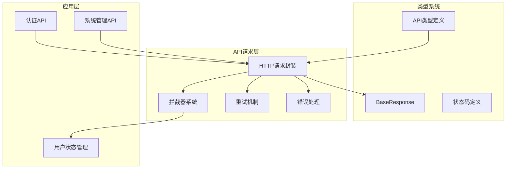
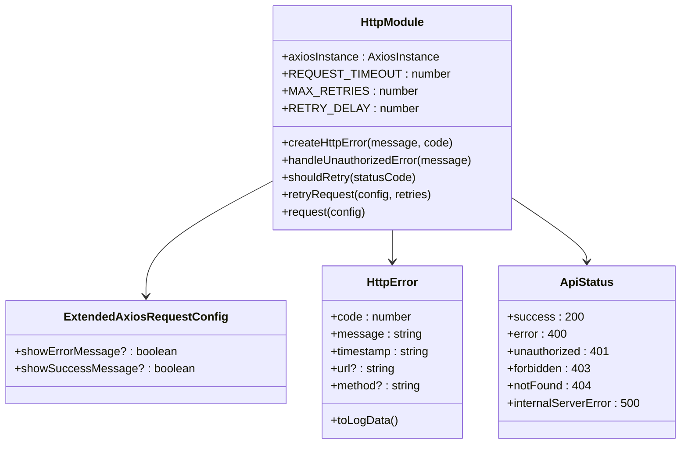
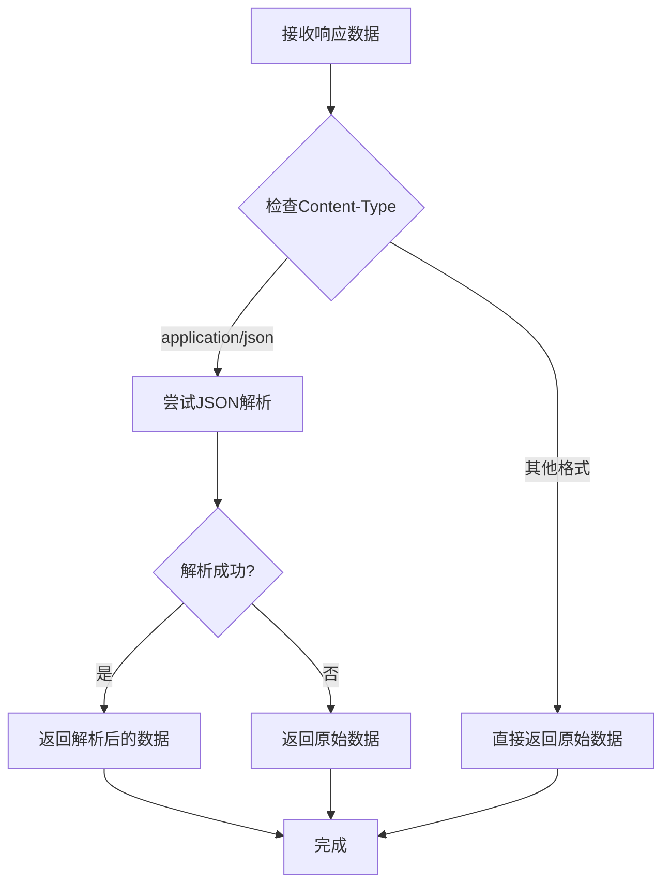
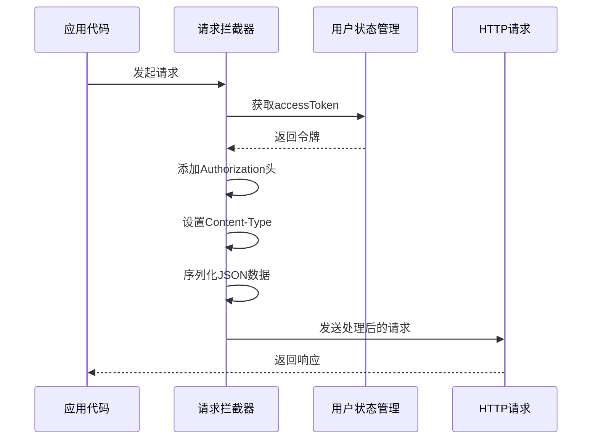
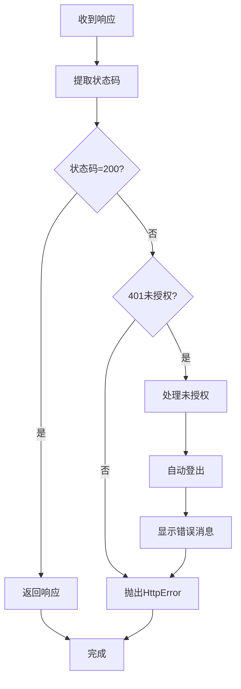
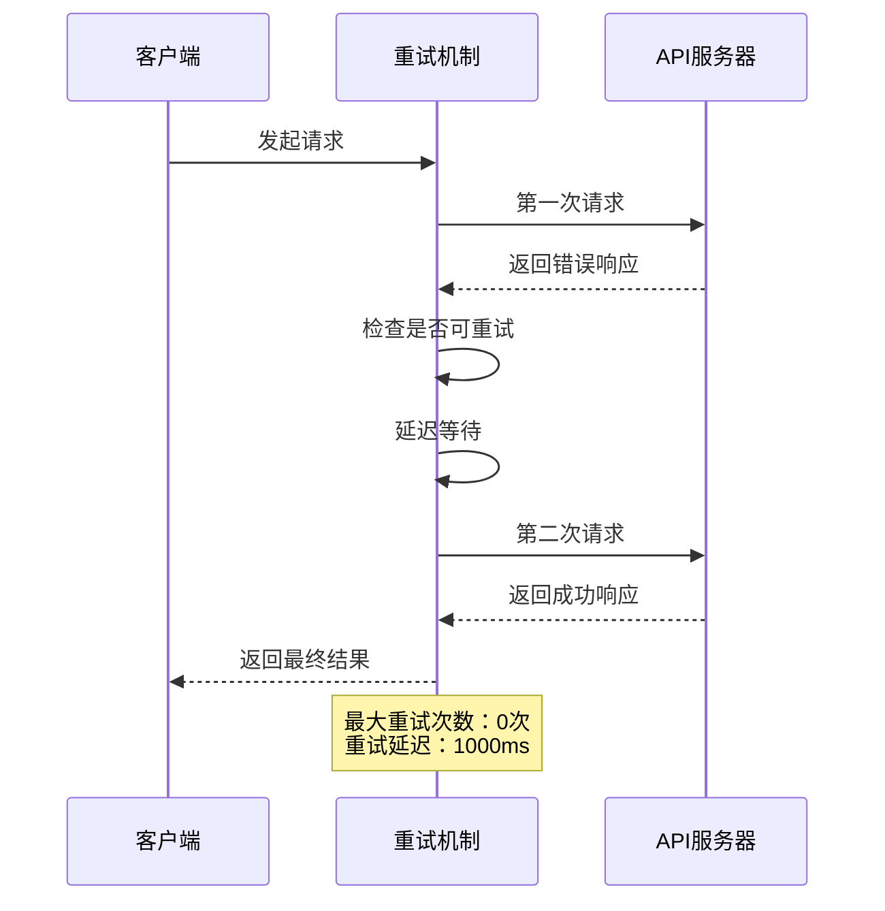
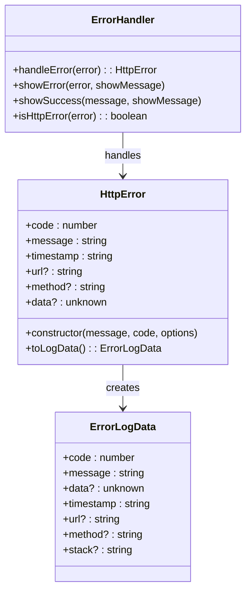
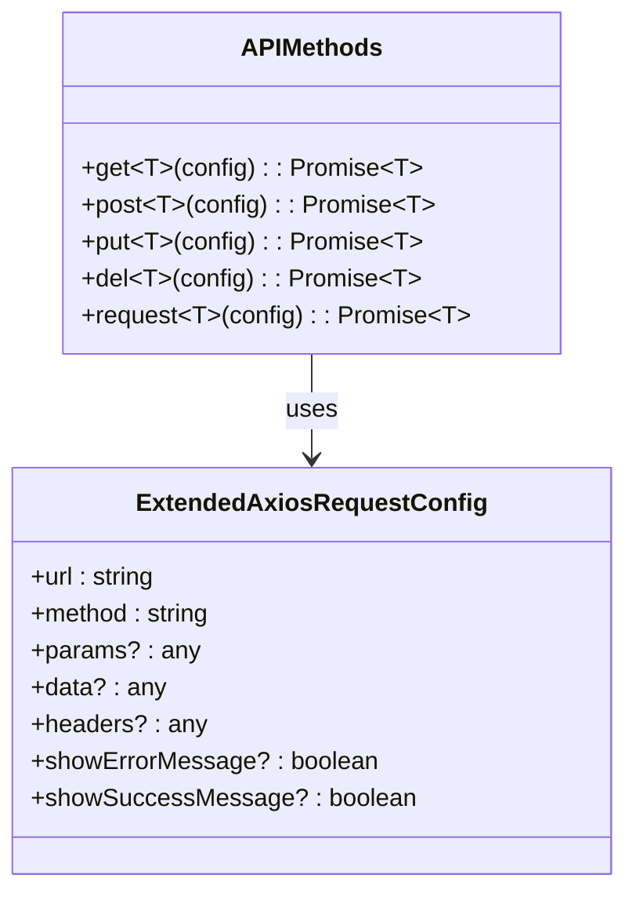
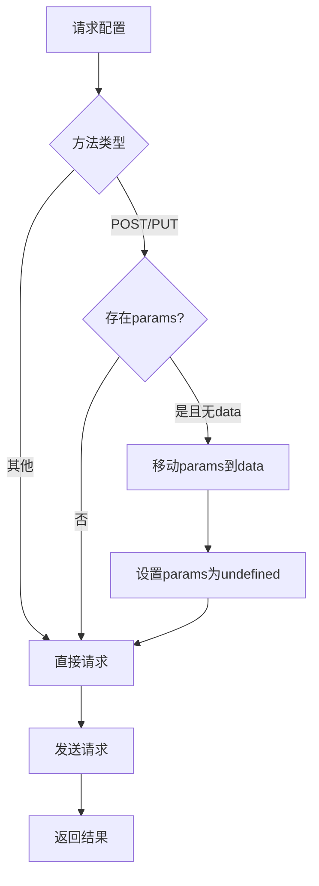

# API请求封装

<cite>
**本文档中引用的文件**
- [src/utils/http/index.ts](file://src/utils/http/index.ts)
- [src/utils/http/error.ts](file://src/utils/http/error.ts)
- [src/utils/http/status.ts](file://src/utils/http/status.ts)
- [src/types/common/response.ts](file://src/types/common/response.ts)
- [src/types/api/api.d.ts](file://src/types/api/api.d.ts)
- [src/api/auth.ts](file://src/api/auth.ts)
- [src/api/system-manage.ts](file://src/api/system-manage.ts)
- [src/store/modules/user.ts](file://src/store/modules/user.ts)
- [package.json](file://package.json)
- [vite.config.ts](file://vite.config.ts)
</cite>

## 目录
1. [简介](#简介)
2. [项目架构概览](#项目架构概览)
3. [核心组件分析](#核心组件分析)
4. [请求实例配置](#请求实例配置)
5. [拦截器机制](#拦截器机制)
6. [请求重试机制](#请求重试机制)
7. [错误处理系统](#错误处理系统)
8. [请求方法封装](#请求方法封装)
9. [类型定义系统](#类型定义系统)
10. [使用示例](#使用示例)
11. [性能优化建议](#性能优化建议)
12. [常见问题解决方案](#常见问题解决方案)

## 简介

本文档详细介绍了基于Axios的API请求封装机制，该封装提供了统一的HTTP请求处理方案，包括请求/响应拦截器、自动重试、错误处理、类型安全等功能。整个系统采用模块化设计，支持多种请求方法，并提供了完善的错误处理和用户体验优化。

## 项目架构概览



**图表来源**
- [src/utils/http/index.ts](file://src/utils/http/index.ts#L1-L215)
- [src/types/common/response.ts](file://src/types/common/response.ts#L1-L31)

## 核心组件分析

### HTTP请求封装模块

HTTP请求封装模块是整个API系统的核心，基于Axios构建了统一的请求处理机制。



**图表来源**
- [src/utils/http/index.ts](file://src/utils/http/index.ts#L35-L40)
- [src/utils/http/error.ts](file://src/utils/http/error.ts#L57-L92)
- [src/utils/http/status.ts](file://src/utils/http/status.ts#L4-L18)

**章节来源**
- [src/utils/http/index.ts](file://src/utils/http/index.ts#L1-L215)

## 请求实例配置

### 基础配置项

HTTP请求实例采用了精心设计的配置参数，确保了系统的稳定性和可靠性：

| 配置项 | 默认值 | 作用 | 环境变量 |
|--------|--------|------|----------|
| timeout | 15000ms | 请求超时时间，防止长时间无响应 | - |
| baseURL | VITE_API_URL | API基础URL，支持动态配置 | VITE_API_URL |
| withCredentials | VITE_WITH_CREDENTIALS | 是否发送跨域Cookie | VITE_WITH_CREDENTIALS |
| validateStatus | status >= 200 && status < 300 | 自定义状态码验证规则 | - |

### 高级配置特性

#### 响应数据转换

系统实现了智能的响应数据转换机制，能够自动处理JSON格式的数据：



**图表来源**
- [src/utils/http/index.ts](file://src/utils/http/index.ts#L49-L61)

**章节来源**
- [src/utils/http/index.ts](file://src/utils/http/index.ts#L43-L62)

## 拦截器机制

### 请求拦截器

请求拦截器负责在请求发送前进行必要的预处理，主要包括：

#### Authorization头自动添加



**图表来源**
- [src/utils/http/index.ts](file://src/utils/http/index.ts#L65-L76)
- [src/store/modules/user.ts](file://src/store/modules/user.ts#L66-L67)

#### Content-Type自动处理

拦截器会自动检测请求数据类型，并设置相应的Content-Type头：
- 对于FormData对象，保持原样
- 对于普通对象，自动设置为`application/json`
- 自动将数据序列化为JSON字符串

### 响应拦截器

响应拦截器负责统一处理所有API响应，提供一致的错误处理体验：



**图表来源**
- [src/utils/http/index.ts](file://src/utils/http/index.ts#L84-L95)

**章节来源**
- [src/utils/http/index.ts](file://src/utils/http/index.ts#L64-L95)

## 请求重试机制

### 重试策略

系统实现了智能的请求重试机制，能够自动处理临时性故障：

#### 可重试的状态码列表

| 状态码 | 含义 | 重试条件 |
|--------|------|----------|
| 408 | 请求超时 | 网络不稳定时重试 |
| 500 | 服务器内部错误 | 临时服务器故障 |
| 502 | 网关错误 | 网络代理问题 |
| 503 | 服务不可用 | 服务器负载过高 |
| 504 | 网关超时 | 网络连接超时 |

#### 重试流程



**图表来源**
- [src/utils/http/index.ts](file://src/utils/http/index.ts#L133-L157)

**章节来源**
- [src/utils/http/index.ts](file://src/utils/http/index.ts#L133-L157)

## 错误处理系统

### HttpError类设计

系统提供了专门的HttpError类来统一处理各种HTTP错误：



**图表来源**
- [src/utils/http/error.ts](file://src/utils/http/error.ts#L57-L92)
- [src/utils/http/error.ts](file://src/utils/http/error.ts#L38-L55)

### 错误消息国际化

系统支持多语言错误消息处理，通过`$t()`函数实现国际化：

| 状态码 | 国际化键 | 中文提示 |
|--------|----------|----------|
| 401 | httpMsg.unauthorized | 未授权，请重新登录 |
| 403 | httpMsg.forbidden | 禁止访问 |
| 404 | httpMsg.notFound | 请求的资源不存在 |
| 408 | httpMsg.requestTimeout | 请求超时 |
| 500 | httpMsg.internalServerError | 服务器内部错误 |

**章节来源**
- [src/utils/http/error.ts](file://src/utils/http/error.ts#L1-L183)

## 请求方法封装

### API方法集合

系统提供了完整的RESTful API方法封装：



**图表来源**
- [src/utils/http/index.ts](file://src/utils/http/index.ts#L195-L212)

### 参数自动转换

系统实现了智能的参数转换逻辑，简化了API调用：



**图表来源**
- [src/utils/http/index.ts](file://src/utils/http/index.ts#L166-L175)

**章节来源**
- [src/utils/http/index.ts](file://src/utils/http/index.ts#L195-L212)

## 类型定义系统

### 响应结构类型

系统提供了完整的类型定义支持，确保API调用的类型安全：

#### BaseResponse接口

```typescript
interface BaseResponse<T = unknown> {
  code: number;      // 状态码
  msg: string;       // 消息
  data: T;           // 数据
}
```

#### API类型命名空间

系统采用命名空间的方式组织API类型定义，提供了清晰的分类：

| 命名空间 | 包含内容 | 使用场景 |
|----------|----------|----------|
| Api.Common | 分页参数、通用搜索 | 所有API通用类型 |
| Api.Auth | 登录、用户信息 | 认证相关接口 |
| Api.SystemManage | 用户、角色、菜单 | 系统管理接口 |

**章节来源**
- [src/types/common/response.ts](file://src/types/common/response.ts#L1-L31)
- [src/types/api/api.d.ts](file://src/types/api/api.d.ts#L1-L136)

## 使用示例

### 基础API调用

以下展示了如何使用封装的HTTP请求系统：

#### 认证API示例

```typescript
// 登录请求
export function fetchLogin(params: Api.Auth.LoginParams) {
  return request.post<Api.Auth.LoginResponse>({
    url: '/api/auth/login',
    params,
    showSuccessMessage: true,  // 显示成功消息
    showErrorMessage: false    // 不显示错误消息
  })
}

// 获取用户信息
export function fetchGetUserInfo() {
  return request.get<Api.Auth.UserInfo>({
    url: '/api/user/info'
    // 自定义请求头
    // headers: { 'X-Custom-Header': 'your-value' }
  })
}
```

#### 系统管理API示例

```typescript
// 获取用户列表
export function fetchGetUserList(params: Api.SystemManage.UserSearchParams) {
  return request.get<Api.SystemManage.UserList>({
    url: '/api/user/list',
    params
  })
}

// 获取角色列表
export function fetchGetRoleList(params: Api.SystemManage.RoleSearchParams) {
  return request.get<Api.SystemManage.RoleList>({
    url: '/api/role/list',
    params
  })
}
```

### 自定义配置选项

系统提供了丰富的自定义配置选项：

| 配置项 | 类型 | 默认值 | 说明 |
|--------|------|--------|------|
| showSuccessMessage | boolean | undefined | 是否显示成功消息 |
| showErrorMessage | boolean | undefined | 是否显示错误消息 |
| url | string | 必填 | 请求URL |
| method | string | GET | HTTP方法 |
| params | any | undefined | 查询参数 |
| data | any | undefined | 请求体数据 |
| headers | any | undefined | 自定义请求头 |

**章节来源**
- [src/api/auth.ts](file://src/api/auth.ts#L1-L29)
- [src/api/system-manage.ts](file://src/api/system-manage.ts#L1-L26)

## 性能优化建议

### 请求优化策略

1. **合理设置超时时间**
   - 根据API特性调整`REQUEST_TIMEOUT`值
   - 对于实时性要求高的API，可以适当缩短超时时间

2. **启用请求重试机制**
   - 根据业务需求调整`MAX_RETRIES`和`RETRY_DELAY`
   - 对于关键业务，可以增加重试次数

3. **优化拦截器性能**
   - 减少拦截器中的同步操作
   - 避免在拦截器中执行耗时的异步操作

### 内存管理

1. **及时清理定时器**
   - 系统实现了401错误的防抖机制，确保定时器被正确清理

2. **避免内存泄漏**
   - 正确处理Promise链
   - 及时释放不需要的引用

## 常见问题解决方案

### 401未授权处理

#### 问题现象
- 用户访问受保护资源时出现401错误
- 页面频繁跳转到登录页

#### 解决方案
1. **检查Token有效性**
   - 确保用户登录状态正常
   - 检查Token是否过期

2. **优化防抖机制**
   - 调整`UNAUTHORIZED_DEBOUNCE_TIME`参数
   - 避免频繁触发登出操作

### 请求超时问题

#### 问题现象
- API请求经常超时
- 网络状况良好但请求失败

#### 解决方案
1. **调整超时时间**
   - 根据网络环境调整`REQUEST_TIMEOUT`
   - 对于大数据传输，适当增加超时时间

2. **检查网络配置**
   - 确认代理设置正确
   - 检查防火墙和网络限制

### 类型安全问题

#### 问题现象
- TypeScript类型检查报错
- 运行时类型不匹配

#### 解决方案
1. **完善类型定义**
   - 确保API响应类型完整
   - 使用泛型约束返回数据类型

2. **验证接口一致性**
   - 确保前端类型与后端接口一致
   - 使用自动化测试验证类型匹配

**章节来源**
- [src/utils/http/index.ts](file://src/utils/http/index.ts#L102-L131)
- [src/utils/http/index.ts](file://src/utils/http/index.ts#L160-L163)