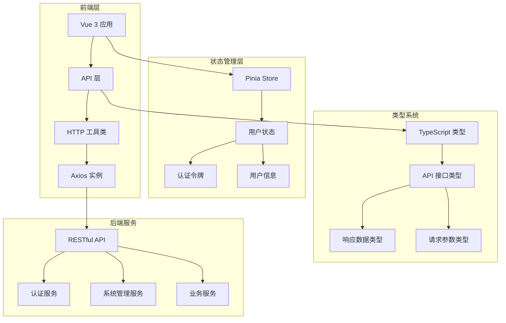
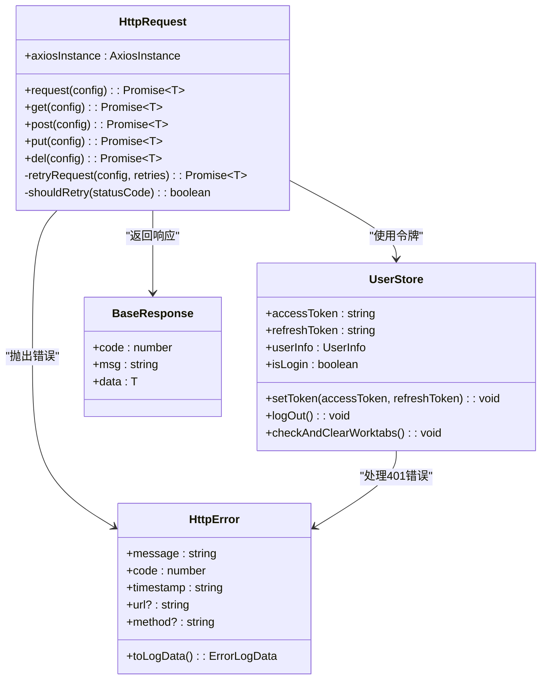
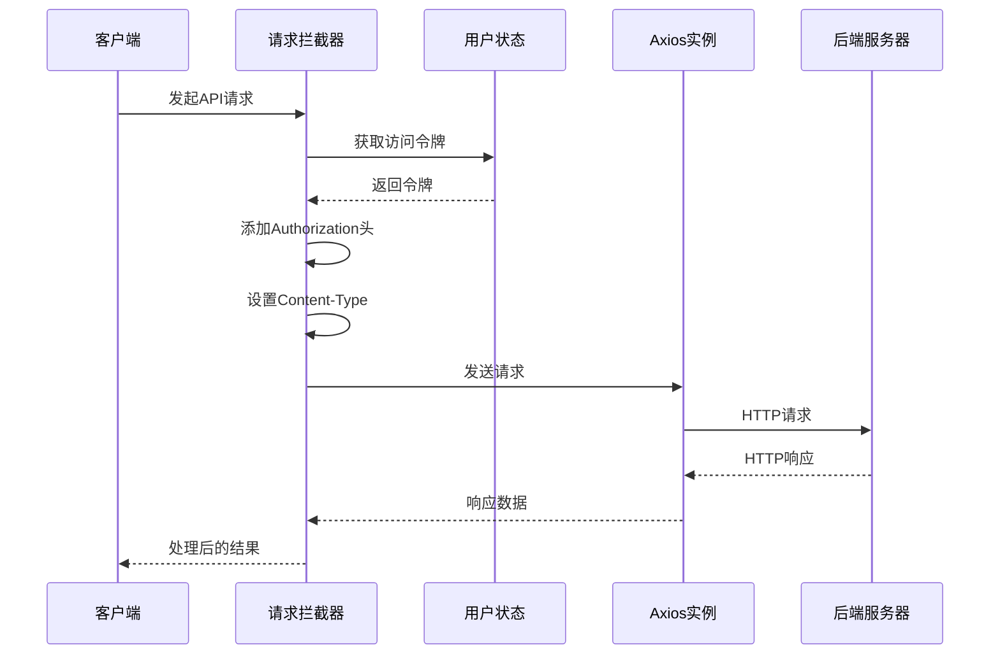
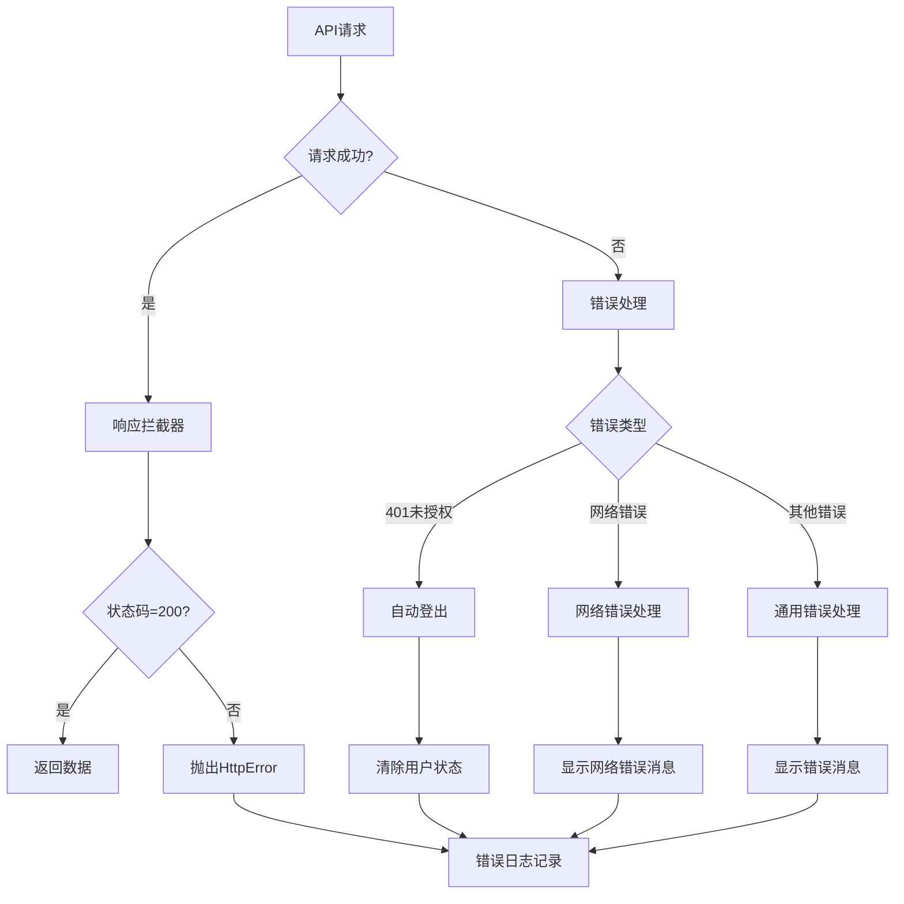
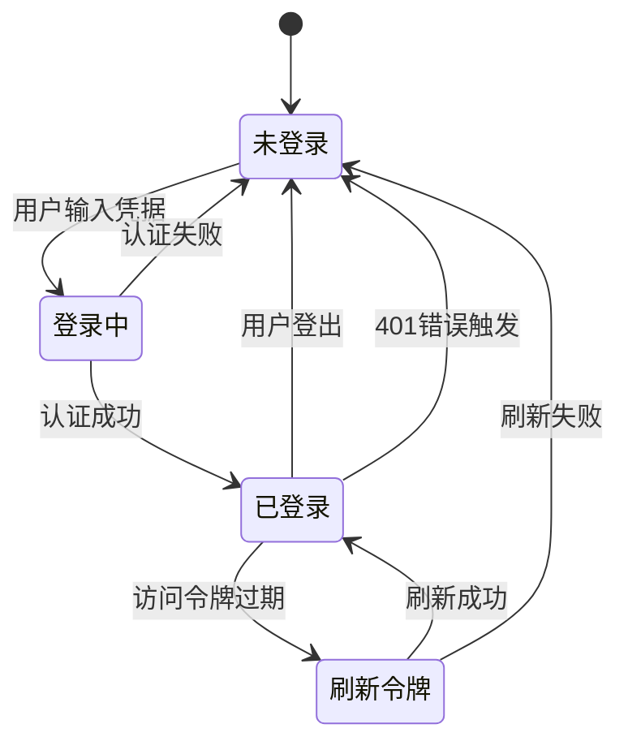
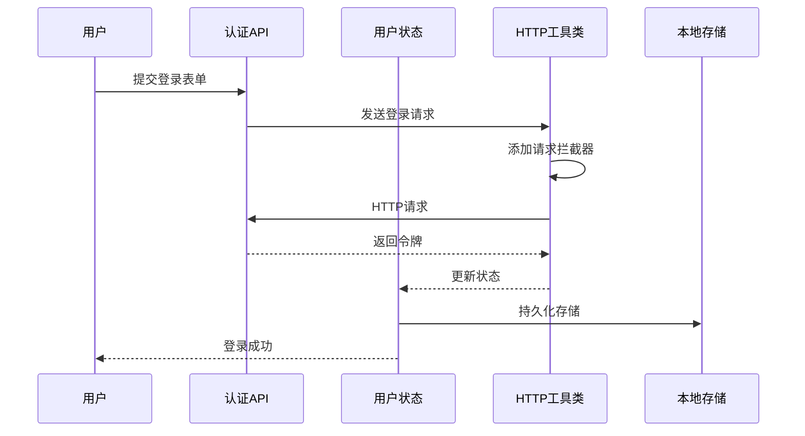
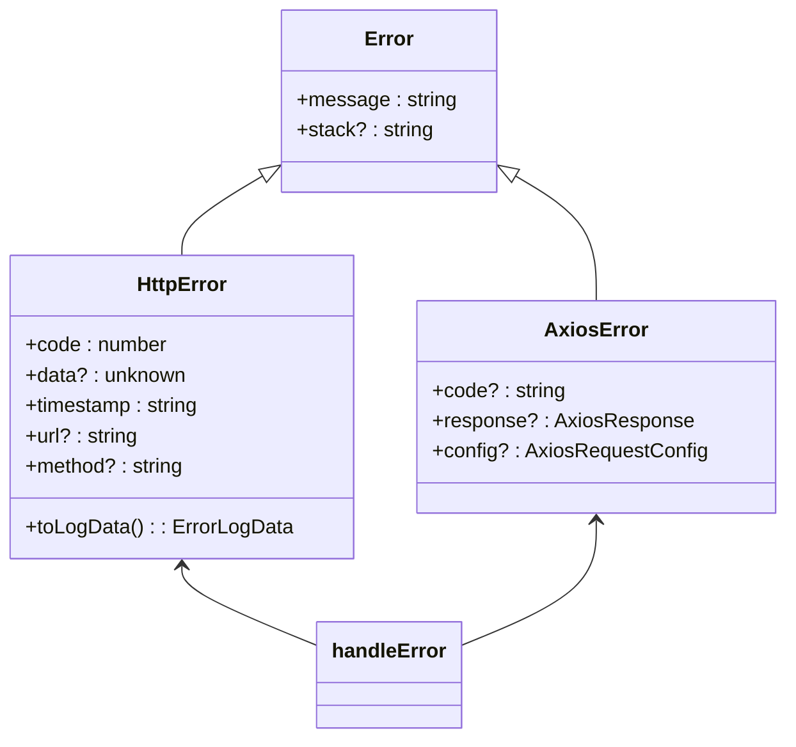
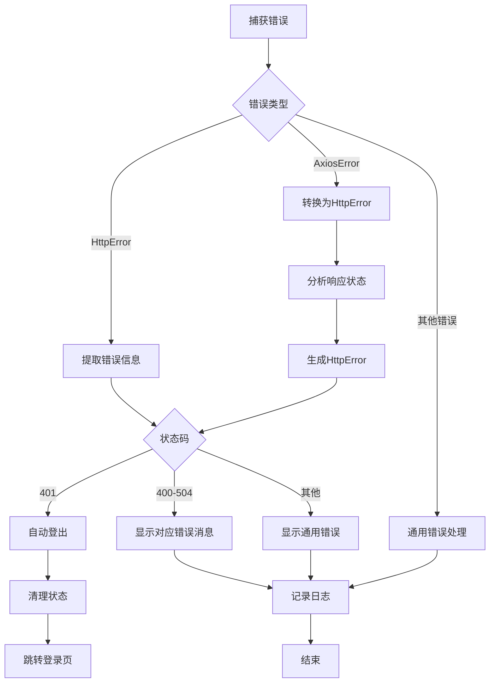

# API集成

<cite>
**本文档引用的文件**
- [src/api/auth.ts](file://src/api/auth.ts)
- [src/api/system-manage.ts](file://src/api/system-manage.ts)
- [src/utils/http/index.ts](file://src/utils/http/index.ts)
- [src/utils/http/error.ts](file://src/utils/http/error.ts)
- [src/utils/http/status.ts](file://src/utils/http/status.ts)
- [src/store/modules/user.ts](file://src/store/modules/user.ts)
- [src/types/api/api.d.ts](file://src/types/api/api.d.ts)
- [src/types/common/response.ts](file://src/types/common/response.ts)
- [src/config/index.ts](file://src/config/index.ts)
- [src/main.ts](file://src/main.ts)
</cite>

## 目录
1. [简介](#简介)
2. [项目架构概览](#项目架构概览)
3. [HTTP工具类详解](#http工具类详解)
4. [API端点定义](#api端点定义)
5. [认证机制](#认证机制)
6. [错误处理体系](#错误处理体系)
7. [最佳实践指南](#最佳实践指南)
8. [性能优化与监控](#性能优化与监控)
9. [安全考虑](#安全考虑)
10. [故障排除指南](#故障排除指南)

## 简介

本文档详细介绍了Art Design Pro项目的API集成架构，包括前后端交互的设计理念、HTTP请求封装机制、认证体系、错误处理策略以及最佳实践。该系统采用现代化的TypeScript开发，基于Vue 3和Pinia状态管理，提供了完整的API集成解决方案。

## 项目架构概览

### 整体架构设计



**图表来源**
- [src/main.ts](file://src/main.ts#L1-L25)
- [src/utils/http/index.ts](file://src/utils/http/index.ts#L1-L50)

### 核心组件关系



**图表来源**
- [src/utils/http/index.ts](file://src/utils/http/index.ts#L165-L215)
- [src/store/modules/user.ts](file://src/store/modules/user.ts#L50-L236)
- [src/utils/http/error.ts](file://src/utils/http/error.ts#L56-L93)

**章节来源**
- [src/main.ts](file://src/main.ts#L1-L25)
- [src/utils/http/index.ts](file://src/utils/http/index.ts#L1-L50)

## HTTP工具类详解

### 核心功能特性

HTTP工具类基于Axios进行了深度封装，提供了以下核心功能：

#### 1. 请求拦截器机制



**图表来源**
- [src/utils/http/index.ts](file://src/utils/http/index.ts#L65-L76)

#### 2. 响应拦截器机制

响应拦截器负责统一处理API响应，包括状态码验证、错误处理和消息提示：

- **成功响应**：验证状态码，提取数据部分
- **401未授权**：触发自动登出流程
- **其他错误**：统一错误处理和消息提示

#### 3. 错误处理机制

系统实现了多层次的错误处理策略：



**图表来源**
- [src/utils/http/index.ts](file://src/utils/http/index.ts#L84-L95)
- [src/utils/http/error.ts](file://src/utils/http/error.ts#L121-L149)

#### 4. 重试机制

系统支持智能重试机制，针对特定的HTTP状态码进行自动重试：

- **重试条件**：请求超时、服务器内部错误、网关错误等
- **重试次数**：可配置，默认为0次
- **重试间隔**：可配置，默认1秒

**章节来源**
- [src/utils/http/index.ts](file://src/utils/http/index.ts#L1-L215)
- [src/utils/http/error.ts](file://src/utils/http/error.ts#L1-L183)

## API端点定义

### 认证相关接口

#### 登录接口

登录接口负责用户身份验证，返回访问令牌和刷新令牌：

| 参数 | 类型 | 必填 | 描述 |
|------|------|------|------|
| userName | string | 是 | 用户名 |
| password | string | 是 | 密码 |

| 响应字段 | 类型 | 描述 |
|----------|------|------|
| token | string | 访问令牌 |
| refreshToken | string | 刷新令牌 |

#### 获取用户信息接口

获取当前登录用户的详细信息：

| 参数 | 类型 | 必填 | 描述 |
|------|------|------|------|
| Authorization | string | 是 | Bearer token |

| 响应字段 | 类型 | 描述 |
|----------|------|------|
| userId | number | 用户ID |
| userName | string | 用户名 |
| email | string | 邮箱地址 |
| roles | string[] | 用户角色列表 |
| buttons | string[] | 按钮权限列表 |
| avatar | string | 头像URL（可选） |

### 系统管理接口

#### 用户管理接口

| 接口名称 | URL | 方法 | 功能描述 |
|----------|-----|------|----------|
| 获取用户列表 | `/api/user/list` | GET | 分页查询用户信息 |
| 获取角色列表 | `/api/role/list` | GET | 分页查询角色信息 |
| 获取菜单列表 | `/api/v3/system/menus` | GET | 获取系统菜单结构 |

#### 用户搜索参数

| 参数名 | 类型 | 描述 |
|--------|------|------|
| id | number | 用户ID |
| userName | string | 用户名 |
| userGender | string | 性别 |
| userPhone | string | 手机号 |
| userEmail | string | 邮箱 |
| status | string | 启用状态 |
| current | number | 当前页码 |
| size | number | 每页条数 |

#### 角色搜索参数

| 参数名 | 类型 | 描述 |
|--------|------|------|
| roleId | number | 角色ID |
| roleName | string | 角色名称 |
| roleCode | string | 角色编码 |
| description | string | 角色描述 |
| enabled | boolean | 是否启用 |
| current | number | 当前页码 |
| size | number | 每页条数 |

**章节来源**
- [src/api/auth.ts](file://src/api/auth.ts#L1-L30)
- [src/api/system-manage.ts](file://src/api/system-manage.ts#L1-L26)
- [src/types/api/api.d.ts](file://src/types/api/api.d.ts#L63-L135)

## 认证机制

### 令牌管理架构



### 认证流程详解

#### 1. 登录流程



**图表来源**
- [src/api/auth.ts](file://src/api/auth.ts#L8-L14)
- [src/store/modules/user.ts](file://src/store/modules/user.ts#L126-L136)

#### 2. 令牌刷新机制

系统实现了智能的令牌刷新机制，确保用户体验的连续性：

- **自动检测**：通过401错误自动触发刷新
- **防抖机制**：防止频繁刷新导致的性能问题
- **持久化存储**：刷新令牌的安全存储

#### 3. 自动登出机制

当遇到401未授权错误时，系统会自动执行以下流程：

1. **防抖检查**：避免重复触发登出
2. **延迟执行**：给用户操作缓冲时间
3. **状态清理**：清除所有用户相关状态
4. **路由跳转**：重定向到登录页面

**章节来源**
- [src/store/modules/user.ts](file://src/store/modules/user.ts#L138-L176)
- [src/utils/http/index.ts](file://src/utils/http/index.ts#L102-L131)

## 错误处理体系

### 错误分类与处理

系统实现了完整的错误处理体系，涵盖各种可能的错误场景：

#### 1. HTTP状态码映射

| 状态码 | 错误类型 | 处理策略 |
|--------|----------|----------|
| 200 | 成功 | 正常返回 |
| 400 | 请求错误 | 显示错误消息 |
| 401 | 未授权 | 自动登出 |
| 403 | 禁止访问 | 显示权限错误 |
| 404 | 资源不存在 | 显示未找到 |
| 408 | 请求超时 | 显示超时错误 |
| 500 | 服务器错误 | 显示服务器错误 |
| 502 | 网关错误 | 显示网关错误 |
| 503 | 服务不可用 | 显示服务不可用 |
| 504 | 网关超时 | 显示网关超时 |

#### 2. 错误类型层次结构



**图表来源**
- [src/utils/http/error.ts](file://src/utils/http/error.ts#L56-L93)

#### 3. 错误处理流程



**图表来源**
- [src/utils/http/error.ts](file://src/utils/http/error.ts#L121-L149)

### 国际化错误消息

系统支持多语言错误消息，通过国际化机制提供用户友好的错误提示：

- **错误消息映射**：将HTTP状态码映射到对应的国际化键值
- **动态语言切换**：支持运行时的语言切换
- **上下文信息**：包含请求URL、方法等调试信息

**章节来源**
- [src/utils/http/error.ts](file://src/utils/http/error.ts#L1-L183)
- [src/utils/http/status.ts](file://src/utils/http/status.ts#L1-L19)

## 最佳实践指南

### 1. 请求配置最佳实践

#### 1.1 显示消息控制

```typescript
// 显示成功消息（默认）
fetchLogin({ userName, password })

// 不显示成功消息
fetchLogin({ 
  userName, 
  password,
  showSuccessMessage: false 
})

// 不显示错误消息
fetchLogin({ 
  userName, 
  password,
  showErrorMessage: false 
})
```

#### 1.2 自定义请求头

```typescript
// 自定义请求头示例
fetchGetUserInfo({
  // 自定义请求头
  headers: {
    'X-Custom-Header': 'your-custom-value'
  }
})
```

### 2. 错误处理最佳实践

#### 2.1 类型守卫使用

```typescript
import { isHttpError } from '@/utils/http/error'

try {
  const userInfo = await fetchGetUserInfo()
} catch (error) {
  if (isHttpError(error)) {
    // 处理HTTP错误
    console.log('错误状态码:', error.code)
    console.log('错误消息:', error.message)
  } else {
    // 处理其他类型错误
    console.error('未知错误:', error)
  }
}
```

#### 2.2 错误恢复策略

```typescript
async function fetchDataWithRetry<T>(
  apiCall: () => Promise<T>,
  maxRetries: number = 3
): Promise<T> {
  let lastError: Error
  
  for (let i = 0; i < maxRetries; i++) {
    try {
      return await apiCall()
    } catch (error) {
      lastError = error
      
      if (i < maxRetries - 1) {
        // 等待后重试
        await new Promise(resolve => setTimeout(resolve, 1000))
      }
    }
  }
  
  throw lastError
}
```

### 3. 性能优化最佳实践

#### 3.1 请求取消机制

```typescript
import axios from 'axios'

// 创建取消令牌
const cancelTokenSource = axios.CancelToken.source()

// 发起带有取消功能的请求
try {
  const response = await axios.get('/api/data', {
    cancelToken: cancelTokenSource.token
  })
} catch (error) {
  if (axios.isCancel(error)) {
    console.log('请求已取消')
  } else {
    console.error('请求失败:', error)
  }
}

// 取消请求
cancelTokenSource.cancel('操作被用户取消')
```

#### 3.2 缓存策略

```typescript
// 简单的内存缓存实现
const cache = new Map<string, { data: any; timestamp: number }>()

async function getCachedData<T>(url: string, ttl: number = 60000): Promise<T> {
  const cached = cache.get(url)
  
  if (cached && (Date.now() - cached.timestamp) < ttl) {
    return cached.data
  }
  
  const data = await axios.get<T>(url)
  cache.set(url, { data, timestamp: Date.now() })
  
  return data
}
```

### 4. 开发调试最佳实践

#### 4.1 请求日志记录

```typescript
// 在HTTP工具类中添加请求日志
axiosInstance.interceptors.request.use((config) => {
  console.log(`[HTTP Request] ${config.method?.toUpperCase()} ${config.url}`, {
    params: config.params,
    data: config.data,
    headers: config.headers
  })
  return config
})

axiosInstance.interceptors.response.use(
  (response) => {
    console.log(`[HTTP Response] ${response.status} ${response.config.url}`, {
      data: response.data
    })
    return response
  },
  (error) => {
    console.error(`[HTTP Error] ${error.response?.status} ${error.config?.url}`, {
      error: error.message,
      response: error.response?.data
    })
    return Promise.reject(error)
  }
)
```

#### 4.2 环境配置

```typescript
// .env.development
VITE_API_URL=http://localhost:3000/api
VITE_WITH_CREDENTIALS=true

// .env.production
VITE_API_URL=https://api.example.com
VITE_WITH_CREDENTIALS=false
```

**章节来源**
- [src/utils/http/index.ts](file://src/utils/http/index.ts#L165-L215)
- [src/utils/http/error.ts](file://src/utils/http/error.ts#L175-L183)

## 性能优化与监控

### 1. 请求性能监控

#### 1.1 请求时间统计

```typescript
// 在HTTP工具类中添加性能监控
axiosInstance.interceptors.request.use((config) => {
  config.metadata = { startTime: Date.now() }
  return config
})

axiosInstance.interceptors.response.use(
  (response) => {
    const endTime = Date.now()
    const startTime = response.config.metadata?.startTime
    const duration = endTime - startTime!
    
    if (duration > 3000) {
      console.warn(`慢请求警告: ${response.config.url} 耗时 ${duration}ms`)
    }
    
    return response
  }
)
```

#### 1.2 并发请求限制

```typescript
// 请求队列管理
class RequestQueue {
  private queue: Array<() => Promise<any>> = []
  private processing = false
  
  async add<T>(requestFn: () => Promise<T>): Promise<T> {
    return new Promise((resolve, reject) => {
      this.queue.push(async () => {
        try {
          const result = await requestFn()
          resolve(result)
        } catch (error) {
          reject(error)
        }
      })
      
      this.processQueue()
    })
  }
  
  private async processQueue() {
    if (this.processing || this.queue.length === 0) return
    
    this.processing = true
    const request = this.queue.shift()!
    
    try {
      await request()
    } finally {
      this.processing = false
      this.processQueue()
    }
  }
}
```

### 2. 内存管理

#### 2.1 垃圾回收优化

```typescript
// 避免内存泄漏的请求处理
class APIService {
  private abortControllers = new Map<string, AbortController>()
  
  async makeRequest<T>(url: string, options: RequestInit = {}): Promise<T> {
    // 清理旧的控制器
    this.abortControllers.forEach((controller, key) => {
      if (key !== url) {
        controller.abort()
        this.abortControllers.delete(key)
      }
    })
    
    // 创建新的控制器
    const controller = new AbortController()
    this.abortControllers.set(url, controller)
    
    try {
      const response = await fetch(url, {
        ...options,
        signal: controller.signal
      })
      return await response.json()
    } finally {
      // 清理控制器
      this.abortControllers.delete(url)
    }
  }
}
```

### 3. 网络状态监控

```typescript
// 网络状态监听
class NetworkMonitor {
  private online = navigator.onLine
  
  constructor() {
    window.addEventListener('online', this.handleOnline.bind(this))
    window.addEventListener('offline', this.handleOffline.bind(this))
  }
  
  private handleOnline() {
    this.online = true
    console.log('网络已连接')
    // 触发离线请求重试
  }
  
  private handleOffline() {
    this.online = false
    console.log('网络已断开')
    // 暂停网络请求
  }
  
  isOnline(): boolean {
    return this.online
  }
}
```

## 安全考虑

### 1. 传输安全

#### 1.1 HTTPS强制使用

```typescript
// 在生产环境强制使用HTTPS
if (process.env.NODE_ENV === 'production' && window.location.protocol !== 'https:') {
  window.location.replace(`https:${window.location.href.substring(window.location.protocol.length)}`)
}
```

#### 1.2 CSRF保护

```typescript
// CSRF令牌管理
class CSRFManager {
  private csrfToken: string | null = null
  
  async getCSRFToken(): Promise<string> {
    if (!this.csrfToken) {
      const response = await axios.get('/api/csrf-token')
      this.csrfToken = response.data.token
    }
    return this.csrfToken
  }
  
  async makeRequest<T>(url: string, options: RequestInit = {}): Promise<T> {
    const token = await this.getCSRFToken()
    
    return axios.post(url, options.body, {
      ...options,
      headers: {
        ...options.headers,
        'X-CSRF-Token': token
      }
    })
  }
}
```

### 2. 数据安全

#### 2.1 敏感数据加密

```typescript
// 敏感数据加密存储
class SecureStorage {
  private cryptoKey: CryptoKey | null = null
  
  async init(): Promise<void> {
    const encoder = new TextEncoder()
    const keyMaterial = await crypto.subtle.generateKey(
      { name: 'AES-GCM', length: 256 },
      true,
      ['encrypt', 'decrypt']
    )
    
    this.cryptoKey = await crypto.subtle.exportKey('jwk', keyMaterial)
  }
  
  async encrypt(text: string): Promise<string> {
    if (!this.cryptoKey) throw new Error('Crypto key not initialized')
    
    const iv = crypto.getRandomValues(new Uint8Array(12))
    const encoder = new TextEncoder()
    const data = encoder.encode(text)
    
    const encrypted = await crypto.subtle.encrypt(
      { name: 'AES-GCM', iv },
      this.cryptoKey,
      data
    )
    
    return btoa(String.fromCharCode(...new Uint8Array(encrypted)))
  }
  
  async decrypt(encryptedText: string): Promise<string> {
    if (!this.cryptoKey) throw new Error('Crypto key not initialized')
    
    const iv = crypto.getRandomValues(new Uint8Array(12))
    const binaryDerData = Uint8Array.from(atob(encryptedText), c => c.charCodeAt(0))
    
    const decrypted = await crypto.subtle.decrypt(
      { name: 'AES-GCM', iv },
      this.cryptoKey,
      binaryDerData
    )
    
    return new TextDecoder().decode(decrypted)
  }
}
```

#### 2.3 输入验证

```typescript
// 请求参数验证
function validateLoginParams(params: any): asserts params is Api.Auth.LoginParams {
  if (typeof params.userName !== 'string' || !params.userName.trim()) {
    throw new Error('用户名不能为空')
  }
  
  if (typeof params.password !== 'string' || params.password.length < 6) {
    throw new Error('密码长度不能少于6位')
  }
}

// 在API调用前验证
async function secureLogin(params: any) {
  validateLoginParams(params)
  
  return fetchLogin(params)
}
```

### 3. 认证安全

#### 3.1 令牌安全存储

```typescript
// 安全的令牌存储
class SecureTokenStorage {
  private static TOKEN_KEY = 'secure_auth_token'
  
  static saveToken(token: string): void {
    // 使用HttpOnly Cookie存储敏感令牌
    document.cookie = `${this.TOKEN_KEY}=${token}; HttpOnly; Secure; SameSite=Strict`
    
    // 内存中存储非敏感信息
    localStorage.setItem('auth_info', JSON.stringify({ timestamp: Date.now() }))
  }
  
  static getToken(): string | null {
    // 从Cookie中读取令牌
    const cookie = document.cookie
      .split('; ')
      .find(row => row.startsWith(this.TOKEN_KEY))
    
    return cookie ? cookie.split('=')[1] : null
  }
  
  static removeToken(): void {
    document.cookie = `${this.TOKEN_KEY}=; Max-Age=-99999999;`
    localStorage.removeItem('auth_info')
  }
}
```

#### 3.2 会话管理

```typescript
// 会话超时管理
class SessionManager {
  private sessionTimeout = 30 * 60 * 1000 // 30分钟
  
  startSession(): void {
    this.resetSession()
    window.addEventListener('mousemove', this.resetSession.bind(this))
    window.addEventListener('keydown', this.resetSession.bind(this))
  }
  
  private resetSession(): void {
    localStorage.setItem('session_start', Date.now().toString())
  }
  
  isSessionValid(): boolean {
    const sessionStart = localStorage.getItem('session_start')
    if (!sessionStart) return false
    
    const elapsed = Date.now() - parseInt(sessionStart)
    return elapsed < this.sessionTimeout
  }
  
  endSession(): void {
    localStorage.removeItem('session_start')
    window.removeEventListener('mousemove', this.resetSession)
    window.removeEventListener('keydown', this.resetSession)
  }
}
```

## 故障排除指南

### 1. 常见问题诊断

#### 1.1 认证相关问题

**问题**：401未授权错误频繁出现

**诊断步骤**：
1. 检查访问令牌是否过期
2. 验证刷新令牌的有效性
3. 确认服务器时间同步
4. 检查网络连接稳定性

**解决方案**：
```typescript
// 添加令牌刷新检查
async function checkTokenValidity(): Promise<boolean> {
  const userStore = useUserStore()
  
  if (!userStore.accessToken) {
    console.warn('缺少访问令牌')
    return false
  }
  
  try {
    // 验证令牌有效性
    await fetchGetUserInfo()
    return true
  } catch (error) {
    if (error.code === ApiStatus.unauthorized) {
      // 尝试刷新令牌
      await refreshAccessToken()
      return true
    }
    return false
  }
}
```

#### 1.2 网络连接问题

**问题**：请求超时或网络错误

**诊断步骤**：
1. 检查网络连接状态
2. 验证API服务可用性
3. 检查防火墙设置
4. 确认DNS解析正常

**解决方案**：
```typescript
// 网络健康检查
class NetworkHealthChecker {
  static async check(): Promise<{ status: 'ok' | 'warning' | 'error'; message: string }> {
    try {
      const response = await fetch('/api/ping', { timeout: 5000 })
      
      if (response.ok) {
        return { status: 'ok', message: '网络连接正常' }
      } else {
        return { status: 'warning', message: 'API服务响应异常' }
      }
    } catch (error) {
      return { status: 'error', message: '网络连接失败' }
    }
  }
}
```

### 2. 调试工具

#### 2.1 请求追踪

```typescript
// 请求追踪装饰器
function traceRequest(target: any, propertyName: string, descriptor: PropertyDescriptor) {
  const originalMethod = descriptor.value
  
  descriptor.value = async function (...args: any[]) {
    console.group(`[API TRACE] ${propertyName}`)
    console.log('参数:', args)
    
    const startTime = performance.now()
    
    try {
      const result = await originalMethod.apply(this, args)
      const endTime = performance.now()
      
      console.log('响应:', result)
      console.log(`耗时: ${(endTime - startTime).toFixed(2)}ms`)
      console.groupEnd()
      
      return result
    } catch (error) {
      const endTime = performance.now()
      
      console.error('错误:', error)
      console.log(`耗时: ${(endTime - startTime).toFixed(2)}ms`)
      console.groupEnd()
      
      throw error
    }
  }
}

// 使用示例
class ApiService {
  @traceRequest
  async getUserInfo() {
    return fetchGetUserInfo()
  }
}
```

#### 2.2 错误日志分析

```typescript
// 错误日志聚合
class ErrorLogger {
  private errors: HttpError[] = []
  
  log(error: HttpError): void {
    this.errors.push(error)
    
    // 限制日志数量
    if (this.errors.length > 100) {
      this.errors = this.errors.slice(-50)
    }
    
    // 上报错误
    this.reportError(error)
  }
  
  getRecentErrors(count: number = 10): HttpError[] {
    return this.errors.slice(-count)
  }
  
  private reportError(error: HttpError): void {
    // 发送到错误监控服务
    fetch('/api/error-report', {
      method: 'POST',
      body: JSON.stringify(error.toLogData()),
      headers: { 'Content-Type': 'application/json' }
    }).catch(console.error)
  }
}
```

### 3. 性能问题排查

#### 3.1 请求性能分析

```typescript
// 请求性能分析工具
class PerformanceAnalyzer {
  private metrics = new Map<string, number[]>()

  recordMetric(name: string, duration: number): void {
    if (!this.metrics.has(name)) {
      this.metrics.set(name, [])
    }
    
    const metrics = this.metrics.get(name)!
    metrics.push(duration)
    
    // 保持最近100个数据点
    if (metrics.length > 100) {
      metrics.shift()
    }
  }

  getAverageDuration(name: string): number {
    const metrics = this.metrics.get(name)
    if (!metrics || metrics.length === 0) return 0
    
    const sum = metrics.reduce((a, b) => a + b, 0)
    return sum / metrics.length
  }

  getSlowestRequests(limit: number = 5): Array<{ name: string; avgDuration: number }> {
    return Array.from(this.metrics.entries())
      .map(([name, durations]) => ({
        name,
        avgDuration: durations.reduce((a, b) => a + b, 0) / durations.length
      }))
      .sort((a, b) => b.avgDuration - a.avgDuration)
      .slice(0, limit)
  }
}
```

**章节来源**
- [src/utils/http/index.ts](file://src/utils/http/index.ts#L133-L158)
- [src/utils/http/error.ts](file://src/utils/http/error.ts#L121-L149)

## 结论

Art Design Pro的API集成系统提供了一个完整、安全、高性能的前后端通信解决方案。通过HTTP工具类的深度封装、完善的错误处理机制、智能的认证管理和丰富的最佳实践指导，开发者可以构建稳定可靠的Web应用程序。

系统的模块化设计使得各个组件职责清晰，易于维护和扩展。无论是简单的数据获取还是复杂的业务流程，都能通过这套API集成框架高效实现。同时，内置的安全机制和性能优化策略确保了应用在生产环境中的稳定运行。

建议开发者在实际使用过程中，根据具体业务需求对本文档中的最佳实践进行适当调整，并结合具体的监控和调试工具，持续优化API集成的质量和性能。