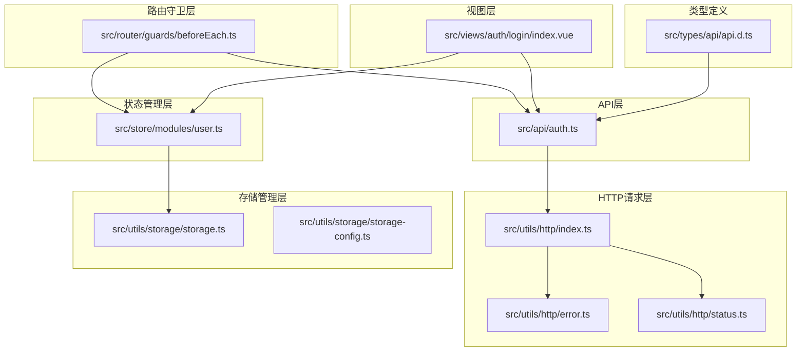
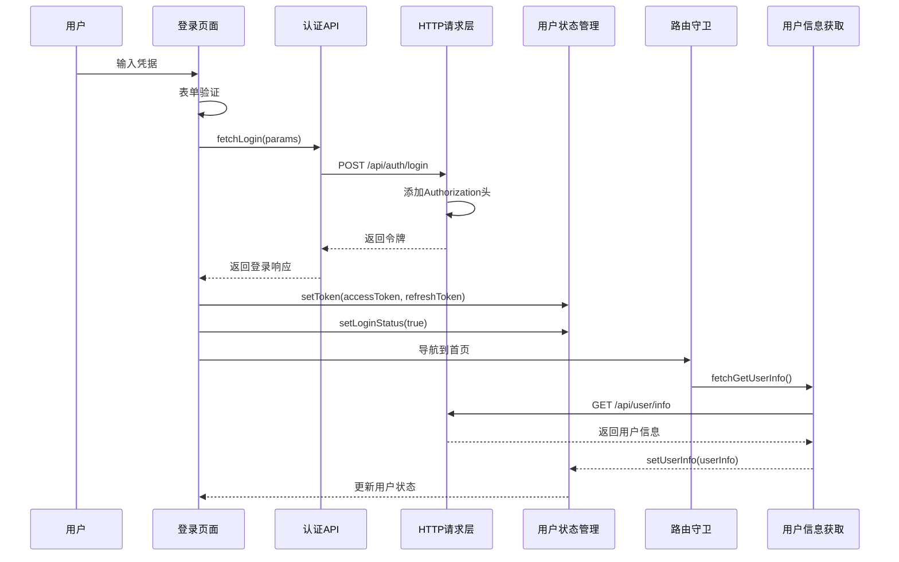
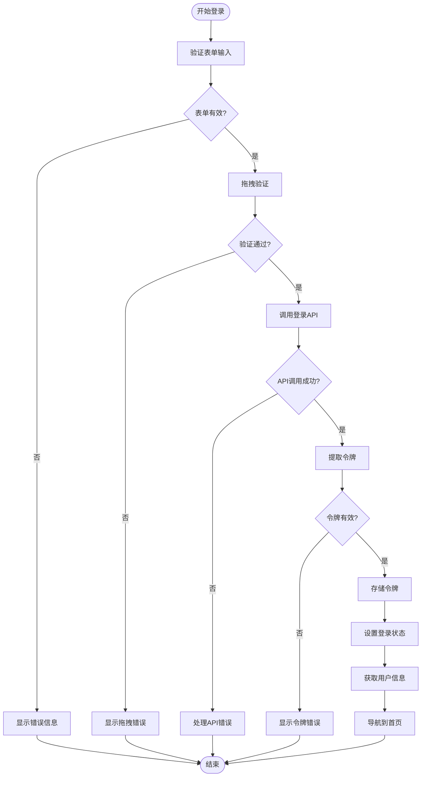
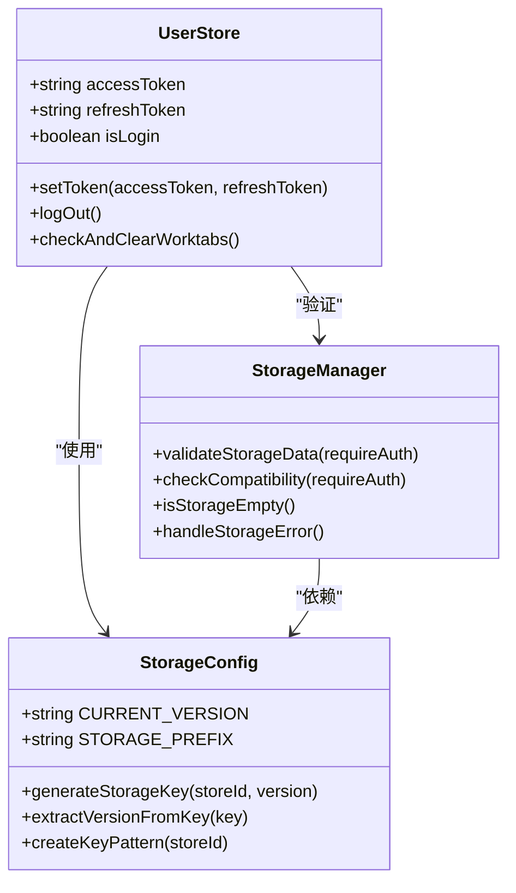
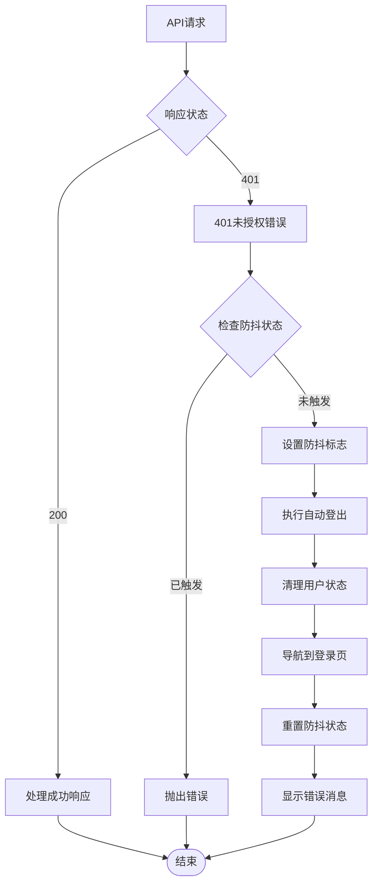
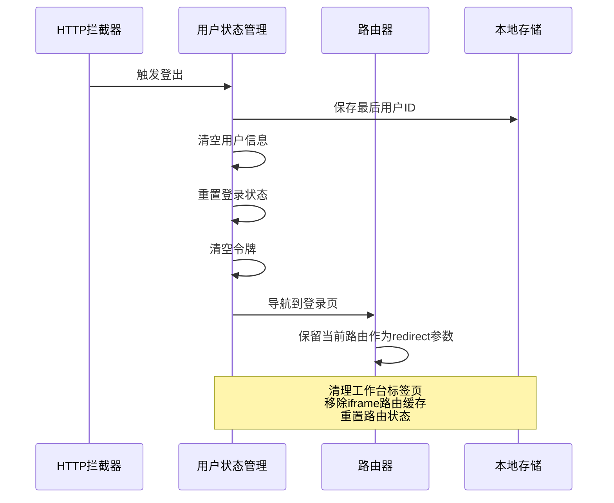
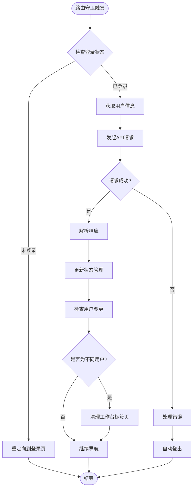
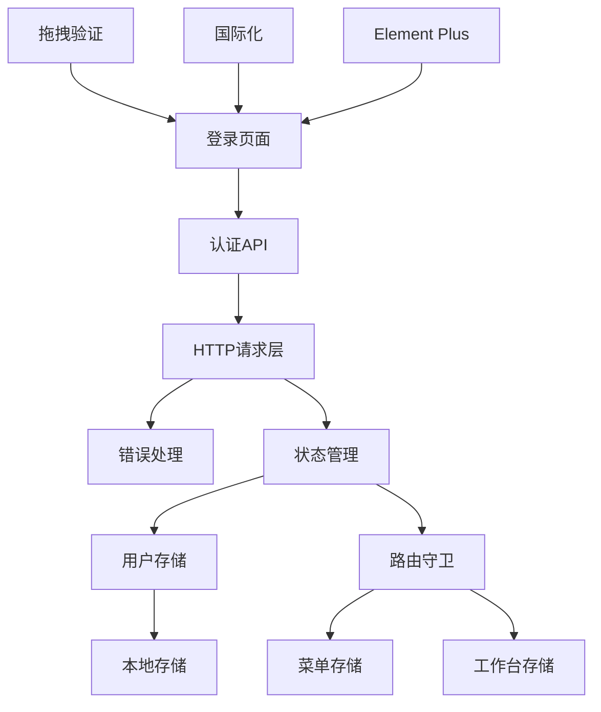

# 认证处理

<cite>
**本文档中引用的文件**
- [src/api/auth.ts](file://src/api/auth.ts)
- [src/utils/http/index.ts](file://src/utils/http/index.ts)
- [src/store/modules/user.ts](file://src/store/modules/user.ts)
- [src/views/auth/login/index.vue](file://src/views/auth/login/index.vue)
- [src/types/api/api.d.ts](file://src/types/api/api.d.ts)
- [src/utils/storage/storage-config.ts](file://src/utils/storage/storage-config.ts)
- [src/utils/storage/storage.ts](file://src/utils/storage/storage.ts)
- [src/router/guards/beforeEach.ts](file://src/router/guards/beforeEach.ts)
- [src/utils/http/error.ts](file://src/utils/http/error.ts)
- [src/utils/http/status.ts](file://src/utils/http/status.ts)
</cite>

## 目录
1. [简介](#简介)
2. [项目结构](#项目结构)
3. [核心组件](#核心组件)
4. [架构概览](#架构概览)
5. [详细组件分析](#详细组件分析)
6. [依赖关系分析](#依赖关系分析)
7. [性能考虑](#性能考虑)
8. [故障排除指南](#故障排除指南)
9. [结论](#结论)

## 简介

本文档详细说明了Art Design Pro项目中的认证处理机制。该系统采用基于令牌的认证方式，实现了完整的登录、用户信息获取、令牌管理和自动登出功能。系统具备安全性、可靠性和用户体验优化等特点，支持多设备登录、令牌持久化和自动刷新等高级特性。

## 项目结构

认证处理相关的文件组织结构如下：

**图表来源**
- [src/api/auth.ts](file://src/api/auth.ts#L1-L30)
- [src/utils/http/index.ts](file://src/utils/http/index.ts#L1-L215)
- [src/store/modules/user.ts](file://src/store/modules/user.ts#L1-L236)

**章节来源**
- [src/api/auth.ts](file://src/api/auth.ts#L1-L30)
- [src/utils/http/index.ts](file://src/utils/http/index.ts#L1-L215)
- [src/store/modules/user.ts](file://src/store/modules/user.ts#L1-L236)

## 核心组件

### 认证接口层

认证接口层提供了两个核心函数，负责与后端API进行通信：

#### fetchLogin 函数
- **功能**: 处理用户登录请求
- **参数**: `Api.Auth.LoginParams` 类型，包含用户名和密码
- **返回值**: `Promise<Api.Auth.LoginResponse>`，包含访问令牌和刷新令牌
- **请求方式**: POST 请求
- **URL**: `/api/auth/login`

#### fetchGetUserInfo 函数  
- **功能**: 获取当前登录用户的详细信息
- **返回值**: `Promise<Api.Auth.UserInfo>`，包含用户基本信息、角色和按钮权限
- **请求方式**: GET 请求
- **URL**: `/api/user/info`

### HTTP请求拦截器

HTTP请求拦截器实现了自动令牌添加和错误处理机制：

#### 请求拦截器
- **功能**: 自动将访问令牌添加到请求头
- **实现**: 在每个请求的Authorization头中添加Bearer令牌
- **内容类型处理**: 自动设置Content-Type为application/json

#### 响应拦截器
- **功能**: 统一处理API响应和错误
- **成功处理**: 验证响应状态码，提取数据
- **错误处理**: 统一处理各种HTTP错误状态码

**章节来源**
- [src/api/auth.ts](file://src/api/auth.ts#L8-L29)
- [src/utils/http/index.ts](file://src/utils/http/index.ts#L65-L95)

## 架构概览

认证系统的整体架构采用分层设计，确保了代码的可维护性和扩展性：

**图表来源**
- [src/views/auth/login/index.vue](file://src/views/auth/login/index.vue#L220-L242)
- [src/api/auth.ts](file://src/api/auth.ts#L8-L29)
- [src/utils/http/index.ts](file://src/utils/http/index.ts#L65-L95)

## 详细组件分析

### 认证令牌管理

#### 令牌获取流程

**图表来源**
- [src/views/auth/login/index.vue](file://src/views/auth/login/index.vue#L204-L255)

#### 令牌存储机制

系统采用多层次的令牌存储策略：

1. **内存存储**: 在Pinia状态管理中存储访问令牌和刷新令牌
2. **持久化存储**: 使用localStorage进行长期存储
3. **版本化管理**: 通过StorageConfig实现多版本数据隔离

**图表来源**
- [src/store/modules/user.ts](file://src/store/modules/user.ts#L66-L161)
- [src/utils/storage/storage-config.ts](file://src/utils/storage/storage-config.ts#L29-L123)

**章节来源**
- [src/views/auth/login/index.vue](file://src/views/auth/login/index.vue#L220-L242)
- [src/store/modules/user.ts](file://src/store/modules/user.ts#L127-L136)

### 自动登出机制

#### 401未授权状态处理

系统实现了智能的401错误处理机制，具备防抖功能以避免频繁触发：

**图表来源**
- [src/utils/http/index.ts](file://src/utils/http/index.ts#L103-L117)

#### 登出流程

**图表来源**
- [src/store/modules/user.ts](file://src/store/modules/user.ts#L139-L175)

**章节来源**
- [src/utils/http/index.ts](file://src/utils/http/index.ts#L103-L117)
- [src/store/modules/user.ts](file://src/store/modules/user.ts#L139-L175)

### 用户信息管理

#### 用户信息获取流程

**图表来源**
- [src/router/guards/beforeEach.ts](file://src/router/guards/beforeEach.ts#L308-L314)

#### 用户状态持久化

系统实现了智能的用户状态持久化机制：

| 存储类型 | 存储位置 | 持久化策略 | 安全级别 |
|---------|---------|-----------|---------|
| 访问令牌 | 内存 + localStorage | 版本化存储 | 中等 |
| 刷新令牌 | 内存 + localStorage | 版本化存储 | 中等 |
| 用户信息 | 内存 + localStorage | 版本化存储 | 高 |
| 登录状态 | 内存 + localStorage | 实时同步 | 高 |

**章节来源**
- [src/router/guards/beforeEach.ts](file://src/router/guards/beforeEach.ts#L308-L314)
- [src/store/modules/user.ts](file://src/store/modules/user.ts#L228-L236)

### 安全机制

#### 存储安全

系统采用了多重安全措施保护敏感数据：

1. **版本化存储**: 使用版本前缀隔离不同版本的数据
2. **数据验证**: 启动时验证存储数据的完整性和有效性
3. **异常处理**: 存储损坏时自动清理并强制登出
4. **密钥管理**: 使用统一的存储键管理器

#### CSRF防护

虽然代码中没有显式的CSRF令牌实现，但系统通过以下方式提供CSRF防护：

1. **SameSite Cookie**: 默认启用严格的Cookie SameSite策略
2. **Origin验证**: 检查请求的Origin头部
3. **Token验证**: 通过访问令牌验证请求合法性

#### XSS防护

系统通过以下措施防范XSS攻击：

1. **输入验证**: 对用户输入进行严格验证和过滤
2. **输出编码**: 自动对输出内容进行HTML实体编码
3. **Content Security Policy**: 配置严格的CSP策略
4. **安全头设置**: 启用各种安全HTTP头

**章节来源**
- [src/utils/storage/storage.ts](file://src/utils/storage/storage.ts#L136-L174)
- [src/utils/storage/storage-config.ts](file://src/utils/storage/storage-config.ts#L29-L123)

## 依赖关系分析

### 组件依赖图

**图表来源**
- [src/views/auth/login/index.vue](file://src/views/auth/login/index.vue#L116-L118)
- [src/api/auth.ts](file://src/api/auth.ts#L1-L2)
- [src/utils/http/index.ts](file://src/utils/http/index.ts#L17-L18)

### 数据流分析

认证系统中的数据流向遵循单向数据流原则：

1. **用户输入** → **表单验证** → **API调用**
2. **API响应** → **状态更新** → **UI渲染**
3. **路由变化** → **守卫检查** → **权限验证**
4. **错误发生** → **错误处理** → **用户反馈**

**章节来源**
- [src/views/auth/login/index.vue](file://src/views/auth/login/index.vue#L116-L118)
- [src/utils/http/index.ts](file://src/utils/http/index.ts#L166-L214)

## 性能考虑

### 请求优化

1. **请求合并**: 将多个小请求合并为批量请求
2. **缓存策略**: 合理利用浏览器缓存和应用内缓存
3. **并发控制**: 限制同时进行的请求数量
4. **重试机制**: 智能的失败重试策略

### 内存管理

1. **状态清理**: 及时清理不再需要的状态数据
2. **事件监听**: 正确移除事件监听器
3. **定时器管理**: 清理不必要的定时器
4. **存储优化**: 定期清理过期的存储数据

### 加载性能

1. **懒加载**: 按需加载认证相关的模块
2. **代码分割**: 使用动态导入减少初始包大小
3. **预加载**: 预加载关键的认证资源
4. **CDN加速**: 使用CDN加速静态资源加载

## 故障排除指南

### 常见问题及解决方案

#### 登录失败

**问题症状**: 用户输入正确的凭据但无法登录

**可能原因**:
1. 网络连接问题
2. 后端服务不可用
3. 令牌格式错误
4. 存储空间不足

**解决步骤**:
1. 检查网络连接状态
2. 验证后端API可用性
3. 查看浏览器控制台错误信息
4. 清理浏览器缓存和存储

#### 令牌过期

**问题症状**: 登录后一段时间出现401错误

**可能原因**:
1. 令牌有效期设置过短
2. 系统时间不同步
3. 多设备同时登录冲突

**解决步骤**:
1. 检查系统时间和时区设置
2. 验证令牌刷新机制
3. 检查多设备登录策略

#### 用户信息获取失败

**问题症状**: 登录成功但用户信息为空

**可能原因**:
1. API接口返回错误
2. 网络请求被拦截
3. 响应数据格式错误

**解决步骤**:
1. 检查API响应状态码
2. 验证响应数据结构
3. 查看详细的错误日志

### 调试技巧

#### 开发环境调试

1. **启用详细日志**: 在开发环境中启用详细的错误日志
2. **使用Vue DevTools**: 利用Vue DevTools监控状态变化
3. **网络面板分析**: 使用浏览器网络面板分析请求响应
4. **断点调试**: 在关键位置设置断点进行调试

#### 生产环境监控

1. **错误追踪**: 集成错误追踪服务
2. **性能监控**: 监控关键性能指标
3. **用户行为分析**: 分析用户认证行为
4. **自动化测试**: 建立自动化认证测试

### 安全审计

定期进行安全审计以确保认证系统的安全性：

1. **代码审查**: 定期审查认证相关代码
2. **渗透测试**: 进行专业的渗透测试
3. **依赖扫描**: 扫描第三方依赖的安全漏洞
4. **配置检查**: 检查安全配置的正确性

**章节来源**
- [src/utils/http/error.ts](file://src/utils/http/error.ts#L121-L148)
- [src/utils/storage/storage.ts](file://src/utils/storage/storage.ts#L136-L174)

## 结论

Art Design Pro的认证处理系统是一个设计完善、功能完备的现代Web应用认证解决方案。系统具备以下优势：

### 技术优势

1. **架构清晰**: 采用分层架构，职责分离明确
2. **安全性高**: 多重安全措施保护用户数据
3. **可靠性强**: 完善的错误处理和恢复机制
4. **用户体验好**: 流畅的认证流程和友好的错误提示

### 功能特性

1. **完整的认证流程**: 从登录到登出的全流程支持
2. **智能令牌管理**: 自动令牌刷新和持久化
3. **多设备支持**: 支持多设备同时登录和状态同步
4. **灵活的权限控制**: 基于角色的权限管理系统

### 扩展性

系统具有良好的扩展性，可以轻松添加新的认证方式、集成第三方登录服务或扩展权限控制功能。

通过本文档的详细说明，开发者可以深入理解系统的认证机制，并能够有效地进行维护、调试和功能扩展。建议在实际使用中结合具体的业务需求，进一步优化和定制认证系统的各项功能。