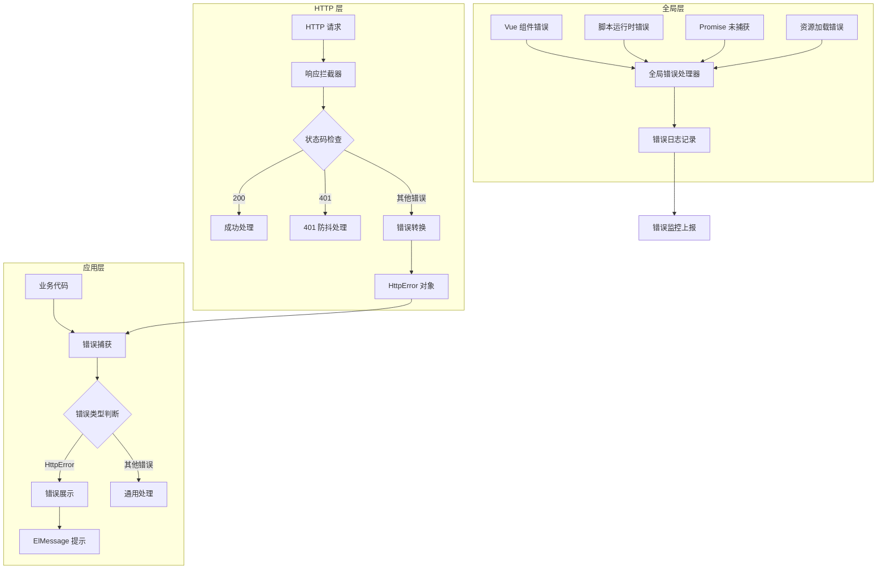
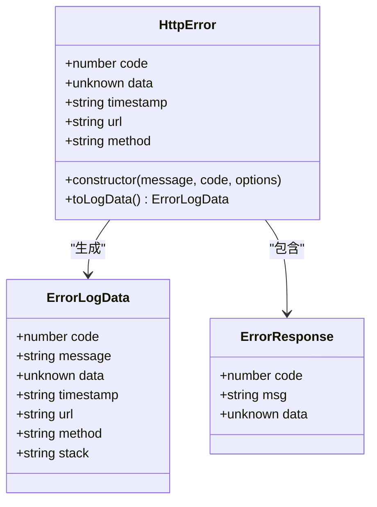
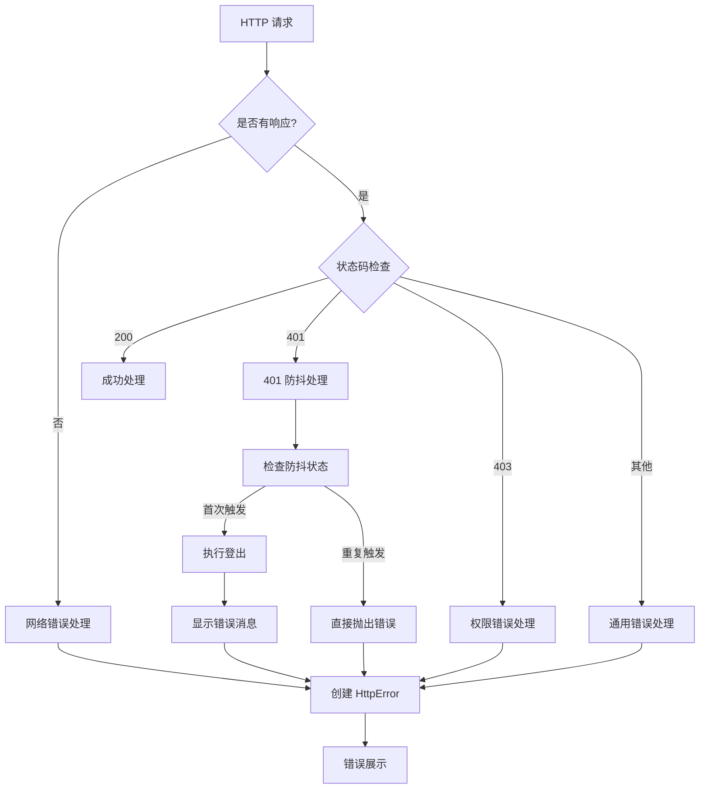
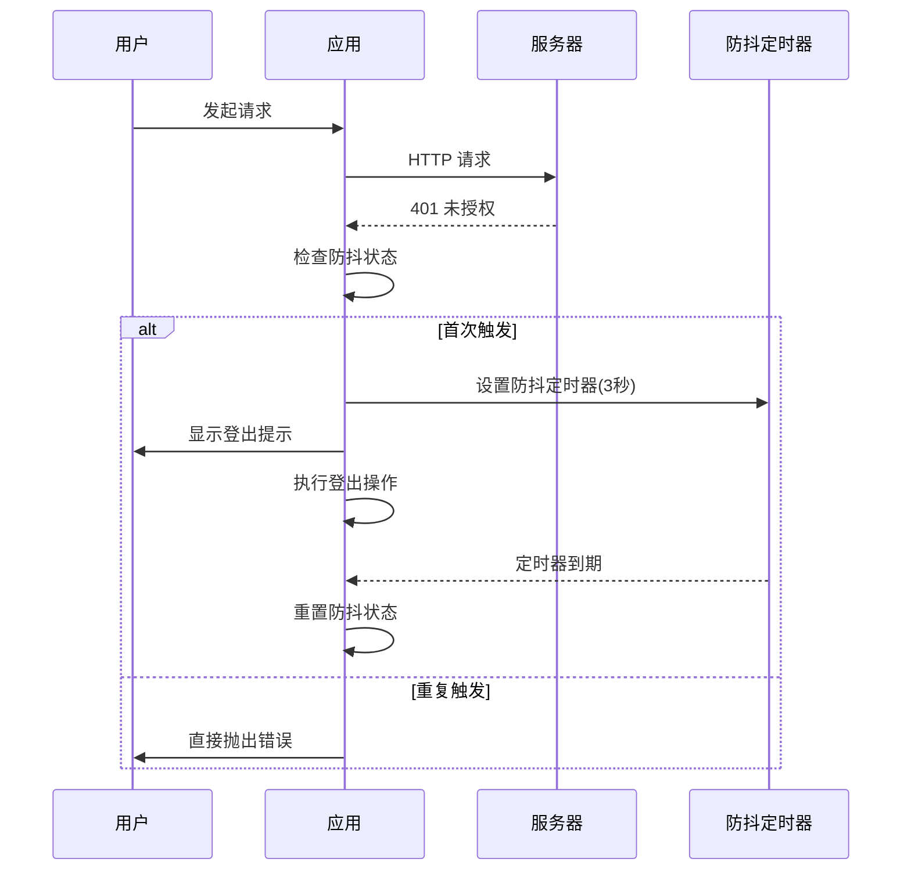
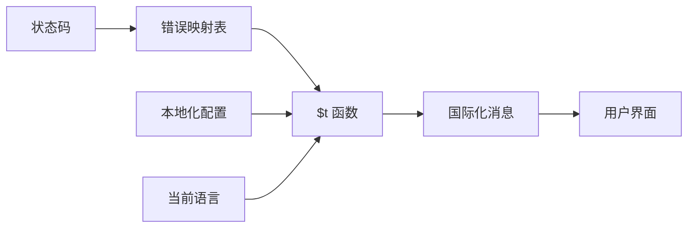
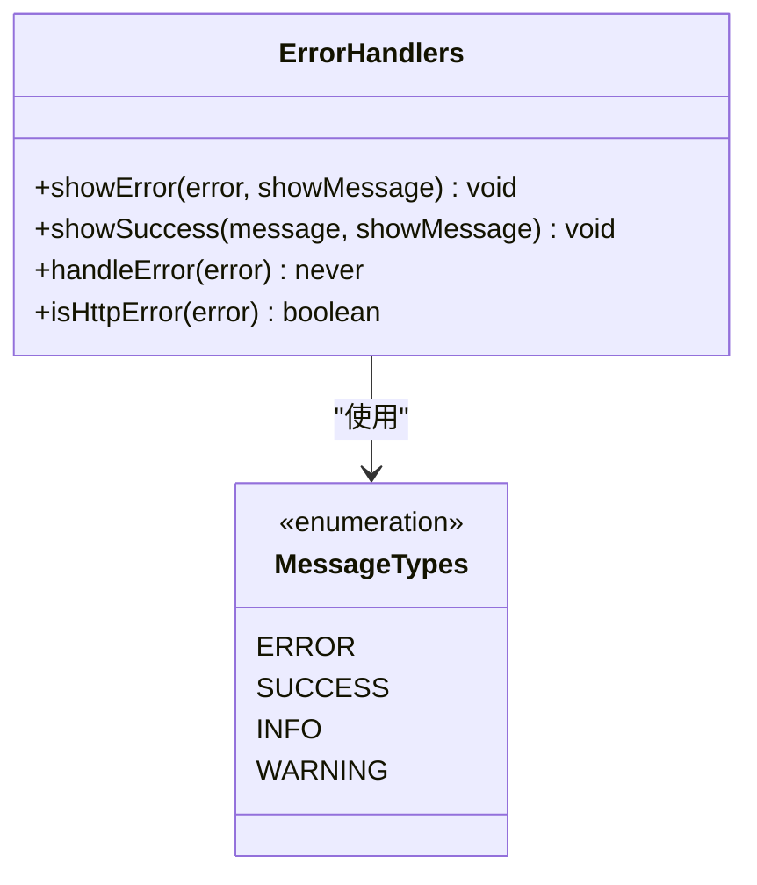
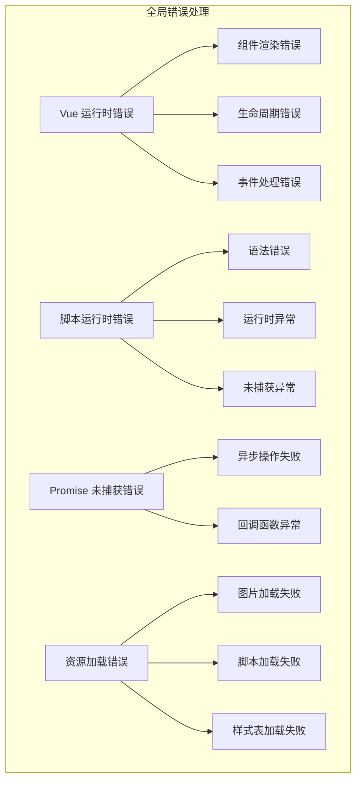
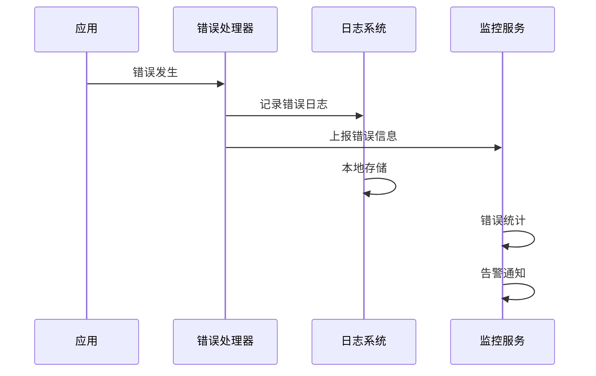

# 错误处理

<cite>
**本文档引用的文件**
- [src/utils/http/error.ts](file://src/utils/http/error.ts)
- [src/utils/http/status.ts](file://src/utils/http/status.ts)
- [src/utils/http/index.ts](file://src/utils/http/index.ts)
- [src/utils/sys/error-handle.ts](file://src/utils/sys/error-handle.ts)
- [src/locales/langs/en.json](file://src/locales/langs/en.json)
- [src/locales/langs/zh.json](file://src/locales/langs/zh.json)
- [src/hooks/core/useAuth.ts](file://src/hooks/core/useAuth.ts)
- [src/main.ts](file://src/main.ts)
- [src/utils/ui/emojo.ts](file://src/utils/ui/emojo.ts)
</cite>

## 目录
1. [概述](#概述)
2. [错误处理架构](#错误处理架构)
3. [HttpError 类设计](#httperror-类设计)
4. [HTTP 状态码处理](#http-状态码处理)
5. [防抖处理机制](#防抖处理机制)
6. [国际化支持](#国际化支持)
7. [错误消息展示](#错误消息展示)
8. [全局错误处理](#全局错误处理)
9. [自定义错误处理](#自定义错误处理)
10. [最佳实践](#最佳实践)
11. [常见错误场景](#常见错误场景)
12. [总结](#总结)

## 概述

Art Design Pro 提供了一套完整的错误处理体系，涵盖 HTTP 请求错误、全局运行时错误、权限验证错误等多个层面。该体系采用分层设计，提供了统一的错误处理接口、防抖机制、国际化支持和完善的错误监控功能。

### 核心特性

- **统一错误处理**：通过 HttpError 类提供标准化的错误对象
- **智能防抖**：针对 401 未授权错误的防抖处理机制
- **国际化支持**：多语言错误消息提示
- **类型安全**：完整的 TypeScript 类型定义
- **全局监控**：Vue 运行时、脚本错误、Promise 异常的全面监控
- **错误分类**：清晰的错误类型划分和处理策略

## 错误处理架构



**架构图来源**
- [src/utils/http/index.ts](file://src/utils/http/index.ts#L83-L131)
- [src/utils/sys/error-handle.ts](file://src/utils/sys/error-handle.ts#L35-L102)

## HttpError 类设计

HttpError 是整个错误处理体系的核心类，继承自原生 Error 类，提供了丰富的错误信息和日志记录功能。

### 类结构设计



**类图来源**
- [src/utils/http/error.ts](file://src/utils/http/error.ts#L56-L93)

### 核心属性说明

| 属性名 | 类型 | 描述 | 必需 |
|--------|------|------|------|
| code | number | HTTP 状态码或自定义错误码 | 是 |
| data | unknown | 错误附加数据 | 否 |
| timestamp | string | 错误发生时间戳（ISO 格式） | 是 |
| url | string | 发生错误的请求 URL | 否 |
| method | string | 请求方法（GET、POST 等） | 否 |

### 构造函数参数

HttpError 的构造函数接受三个参数：

1. **message** (`string`): 用户友好的错误消息
2. **code** (`number`): 错误状态码
3. **options** (`object`): 可选配置项，包含 data、url、method 等

**节来源**
- [src/utils/http/error.ts](file://src/utils/http/error.ts#L56-L93)

## HTTP 状态码处理

系统定义了完整的 HTTP 状态码枚举，并针对不同状态码提供了相应的处理策略。

### 状态码定义

| 状态码 | 名称 | 描述 | 处理策略 |
|--------|------|------|----------|
| 200 | success | 请求成功 | 正常处理 |
| 400 | error | 请求错误 | 显示错误消息 |
| 401 | unauthorized | 未授权 | 登出并防抖处理 |
| 403 | forbidden | 禁止访问 | 显示权限错误 |
| 404 | notFound | 资源不存在 | 显示未找到提示 |
| 405 | methodNotAllowed | 方法不允许 | 显示方法错误 |
| 408 | requestTimeout | 请求超时 | 显示超时提示 |
| 500 | internalServerError | 服务器内部错误 | 显示服务器错误 |
| 502 | badGateway | 网关错误 | 显示网关错误 |
| 503 | serviceUnavailable | 服务不可用 | 显示服务不可用 |
| 504 | gatewayTimeout | 网关超时 | 显示网关超时 |

### 错误处理流程



**流程图来源**
- [src/utils/http/error.ts](file://src/utils/http/error.ts#L121-L149)

**节来源**
- [src/utils/http/status.ts](file://src/utils/http/status.ts#L1-L19)
- [src/utils/http/error.ts](file://src/utils/http/error.ts#L121-L149)

## 防抖处理机制

针对 401 未授权错误，系统实现了智能的防抖机制，防止用户频繁收到重复的登出提示。

### 防抖原理



**序列图来源**
- [src/utils/http/index.ts](file://src/utils/http/index.ts#L102-L124)

### 防抖配置参数

| 参数名 | 值 | 描述 |
|--------|-----|------|
| UNAUTHORIZED_DEBOUNCE_TIME | 3000ms | 401 防抖时间间隔 |
| LOGOUT_DELAY | 500ms | 登出延迟时间 |
| isUnauthorizedErrorShown | boolean | 防抖状态标志 |
| unauthorizedTimer | Timeout | 防抖定时器引用 |

### 防抖状态管理

系统使用两个关键变量来管理防抖状态：

1. **isUnauthorizedErrorShown**: 标记是否已经显示过 401 错误
2. **unauthorizedTimer**: 存储防抖定时器的引用

当首次触发 401 错误时，系统会：
- 设置防抖状态为 true
- 执行用户登出操作
- 设置 3 秒的防抖定时器
- 显示错误提示消息
- 抛出 HttpError 对象

**节来源**
- [src/utils/http/index.ts](file://src/utils/http/index.ts#L25-L34)
- [src/utils/http/index.ts](file://src/utils/http/index.ts#L102-L124)

## 国际化支持

系统提供了完整的多语言错误消息支持，目前支持中文和英文两种语言。

### 国际化消息映射

| 状态码 | 英文消息 | 中文消息 |
|--------|----------|----------|
| unauthorized | Unauthorized access, please login again | 未授权访问，请重新登录 |
| forbidden | Access to this resource is forbidden | 禁止访问该资源 |
| notFound | The requested resource does not exist | 请求的资源不存在 |
| methodNotAllowed | Request method not allowed | 请求方法不允许 |
| requestTimeout | Request timeout, please try again later | 请求超时，请稍后重试 |
| internalServerError | Internal server error, please try again later | 服务器内部错误，请稍后重试 |
| networkError | Network connection error, please check your connection | 网络连接异常，请检查网络连接 |

### 消息获取机制



**流程图来源**
- [src/utils/http/error.ts](file://src/utils/http/error.ts#L100-L114)

### 本地化配置

系统通过 `$t` 函数实现国际化消息获取，该函数会根据当前语言环境返回对应的错误消息。

**节来源**
- [src/locales/langs/en.json](file://src/locales/langs/en.json#L2-L16)
- [src/locales/langs/zh.json](file://src/locales/langs/zh.json#L2-L16)
- [src/utils/http/error.ts](file://src/utils/http/error.ts#L100-L114)

## 错误消息展示

系统提供了统一的错误消息展示机制，支持成功和错误消息的不同处理方式。

### 消息展示函数



**类图来源**
- [src/utils/http/error.ts](file://src/utils/http/error.ts#L151-L182)

### 展示策略

| 函数名 | 用途 | 显示条件 | 示例 |
|--------|------|----------|------|
| showError | 显示错误消息 | 通常需要用户知晓的错误 | 网络错误、权限错误 |
| showSuccess | 显示成功消息 | 操作成功的反馈 | 数据保存成功 |
| handleError | 处理错误并抛出 | HTTP 请求错误转换 | Axios 错误处理 |

### 消息组件集成

系统使用 Element Plus 的 ElMessage 组件进行消息展示，支持不同的消息类型和持续时间。

**节来源**
- [src/utils/http/error.ts](file://src/utils/http/error.ts#L151-L182)

## 全局错误处理

除了 HTTP 请求错误处理外，系统还提供了全面的全局错误处理机制，涵盖 Vue 运行时、JavaScript 脚本、Promise 和资源加载错误。

### 全局错误类型



**架构图来源**
- [src/utils/sys/error-handle.ts](file://src/utils/sys/error-handle.ts#L23-L28)

### 错误处理器配置

| 处理器 | 监听事件 | 处理目标 | 功能 |
|--------|----------|----------|------|
| vueErrorHandler | Vue 组件错误 | 组件渲染、生命周期 | 记录 Vue 错误日志 |
| scriptErrorHandler | window.onerror | JavaScript 运行时错误 | 捕获脚本异常 |
| registerPromiseErrorHandler | unhandledrejection | Promise 未捕获异常 | 处理异步错误 |
| registerResourceErrorHandler | window.error | 资源加载错误 | 监控静态资源 |

### 错误监控集成



**序列图来源**
- [src/utils/sys/error-handle.ts](file://src/utils/sys/error-handle.ts#L37-L102)

**节来源**
- [src/utils/sys/error-handle.ts](file://src/utils/sys/error-handle.ts#L1-L102)
- [src/main.ts](file://src/main.ts#L10)

## 自定义错误处理

系统提供了多种方式来自定义错误处理行为，满足不同场景的需求。

### 扩展 HttpError

开发者可以通过继承 HttpError 类来创建自定义错误类型：

```typescript
// 自定义业务错误类
class BusinessError extends HttpError {
  public readonly businessCode: string
  
  constructor(message: string, businessCode: string, code: number = ApiStatus.error) {
    super(message, code)
    this.businessCode = businessCode
  }
}

// 使用示例
throw new BusinessError('业务逻辑错误', 'BUSINESS_001')
```

### 覆盖默认处理

可以通过重写错误处理函数来改变默认行为：

```typescript
// 自定义错误处理函数
function customErrorHandler(error: AxiosError<ErrorResponse>): never {
  // 添加自定义逻辑
  if (error.response?.status === ApiStatus.unauthorized) {
    // 自定义 401 处理逻辑
    return handleCustomUnauthorized(error)
  }
  
  // 调用默认处理
  return handleError(error)
}
```

### 错误过滤器

系统提供了类型守卫函数来识别特定类型的错误：

```typescript
// 使用类型守卫
function processError(error: unknown) {
  if (isHttpError(error)) {
    // 处理 HttpError
    console.log('HTTP Error:', error.code, error.message)
  } else {
    // 处理其他类型错误
    console.log('Other Error:', error)
  }
}
```

**节来源**
- [src/utils/http/error.ts](file://src/utils/http/error.ts#L180-L182)

## 最佳实践

### 错误处理最佳实践

1. **统一错误处理入口**
   - 在 HTTP 拦截器中统一处理所有请求错误
   - 使用 HttpError 类包装所有错误信息
   - 提供一致的错误展示方式

2. **适当的错误级别**
   - 区分用户可见错误和内部错误
   - 对于敏感错误信息，向用户显示通用提示
   - 记录完整错误信息用于调试

3. **防抖机制的应用**
   - 针对频繁发生的错误（如 401）使用防抖
   - 设置合理的防抖时间间隔
   - 避免用户被重复的错误提示打扰

4. **国际化考虑**
   - 所有用户可见的错误消息都应支持国际化
   - 使用语义化的错误消息键值
   - 提供清晰的错误描述和解决建议

5. **错误监控和上报**
   - 实现错误日志的本地存储
   - 集成错误监控服务
   - 设置合理的错误上报频率

### 代码示例最佳实践

```typescript
// 推荐的错误处理方式
async function fetchData() {
  try {
    const response = await api.get('/data')
    return response.data
  } catch (error) {
    if (isHttpError(error)) {
      // 显示用户友好的错误消息
      showError(error, true)
      
      // 记录错误日志
      console.error('API Error:', error.toLogData())
      
      // 根据错误类型采取不同行动
      if (error.code === ApiStatus.unauthorized) {
        // 处理未授权情况
        return redirectToLogin()
      }
    }
    
    // 重新抛出错误以便上层处理
    throw error
  }
}
```

## 常见错误场景

### 网络中断

**表现特征**：
- 浏览器显示网络连接错误
- 请求超时或无法建立连接
- 网络状态指示器闪烁

**处理策略**：
- 显示友好的网络错误提示
- 提供重试机制
- 记录网络状态变化

**解决方案**：
```typescript
// 网络错误处理示例
const networkErrorHandler = (error: AxiosError) => {
  if (!error.response) {
    const networkError = new HttpError(
      $t('httpMsg.networkError'), 
      ApiStatus.error, 
      {
        url: error.config?.url,
        method: error.config?.method?.toUpperCase()
      }
    )
    showError(networkError, true)
    return Promise.reject(networkError)
  }
}
```

### 请求超时

**表现特征**：
- 请求在规定时间内未完成
- 用户界面显示加载状态长时间未消失
- 控制台出现超时警告

**处理策略**：
- 显示超时提示并提供重试选项
- 可以考虑增加超时时间或优化请求
- 记录超时发生的频率

### 服务器错误

**表现特征**：
- HTTP 500 内部服务器错误
- 服务暂时不可用
- 网关错误

**处理策略**：
- 显示通用的服务器错误提示
- 建议用户稍后重试
- 记录错误以便运维团队处理

### 权限错误

**表现特征**：
- HTTP 403 禁止访问
- 用户试图访问无权限的资源
- 权限验证失败

**处理策略**：
- 显示权限不足的提示
- 引导用户联系管理员
- 记录权限验证失败的情况

### 数据格式错误

**表现特征**：
- API 返回的数据格式不符合预期
- JSON 解析错误
- 数据字段缺失

**处理策略**：
- 提供友好的数据格式错误提示
- 记录具体的错误信息
- 考虑数据的向前兼容性

## 总结

Art Design Pro 的错误处理体系是一个完整、健壮且易于扩展的解决方案。它通过以下核心特性为开发者提供了强大的错误处理能力：

### 核心优势

1. **统一的错误模型**：HttpError 类提供了标准化的错误对象，包含了完整的错误信息和日志记录功能。

2. **智能的防抖机制**：针对 401 未授权错误的防抖处理，有效避免了用户被重复提示的困扰。

3. **完善的国际化支持**：多语言错误消息支持，提升了应用的国际化体验。

4. **全面的错误监控**：从 HTTP 请求到全局运行时错误的全方位监控覆盖。

5. **灵活的扩展机制**：支持自定义错误类型和处理逻辑，适应各种业务需求。

### 使用建议

- 在项目开发中始终使用 HttpError 类来包装错误信息
- 合理设置防抖时间间隔，平衡用户体验和系统响应性
- 建立完善的错误监控和告警机制
- 定期审查和优化错误处理逻辑
- 保持错误消息的简洁性和用户友好性

这套错误处理体系不仅提高了应用的稳定性和用户体验，也为后续的维护和扩展奠定了坚实的基础。通过遵循最佳实践和合理使用提供的工具函数，开发者可以构建出更加健壮和可靠的 Web 应用程序。