# UI组件库

<cite>
**本文档引用的文件**
- [component.ts](file://src/config/modules/component.ts)
- [art-back-to-top/index.vue](file://src/components/core/base/art-back-to-top/index.vue)
- [art-logo/index.vue](file://src/components/core/base/art-logo/index.vue)
- [art-svg-icon/index.vue](file://src/components/core/base/art-svg-icon/index.vue)
- [art-form/index.vue](file://src/components/core/forms/art-form/index.vue)
- [art-line-chart/index.vue](file://src/components/core/charts/art-line-chart/index.vue)
- [art-table/index.vue](file://src/components/core/tables/art-table/index.vue)
- [art-header-bar/index.vue](file://src/components/core/layouts/art-header-bar/index.vue)
- [art-stats-card/index.vue](file://src/components/core/cards/art-stats-card/index.vue)
</cite>

## 目录
1. [简介](#简介)
2. [项目结构](#项目结构)
3. [核心组件](#核心组件)
4. [架构概述](#架构概述)
5. [详细组件分析](#详细组件分析)
6. [依赖分析](#依赖分析)
7. [性能考虑](#性能考虑)
8. [故障排除指南](#故障排除指南)
9. [结论](#结论)

## 简介
Art Design Pro UI组件库是一个全面的前端组件集合，旨在为开发者提供一套完整、可复用的UI解决方案。该组件库按照基础组件、布局组件、表单组件、数据展示组件和反馈组件等类别进行组织，每个组件都经过精心设计，以确保一致的用户体验和高质量的代码实现。

## 项目结构
Art Design Pro UI组件库的项目结构清晰，遵循模块化设计原则。主要组件位于`src/components/core`目录下，按功能分类组织。配置文件位于`src/config`目录，包含全局组件配置和其他系统设置。

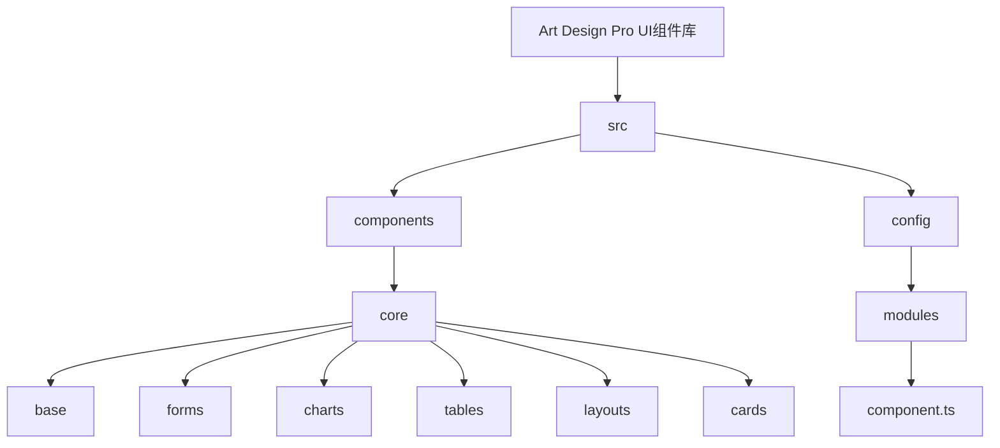

**图示来源**
- [component.ts](file://src/config/modules/component.ts)

**章节来源**
- [component.ts](file://src/config/modules/component.ts)

## 核心组件
Art Design Pro UI组件库的核心组件包括基础组件、表单组件、图表组件、表格组件、布局组件和卡片组件。这些组件构成了系统的基础，为开发者提供了丰富的UI元素选择。

**章节来源**
- [art-back-to-top/index.vue](file://src/components/core/base/art-back-to-top/index.vue)
- [art-logo/index.vue](file://src/components/core/base/art-logo/index.vue)
- [art-svg-icon/index.vue](file://src/components/core/base/art-svg-icon/index.vue)

## 架构概述
Art Design Pro UI组件库采用模块化架构设计，各组件之间保持低耦合高内聚。通过Vue 3的Composition API实现逻辑复用，使用Pinia进行状态管理，确保组件的状态可预测和可调试。

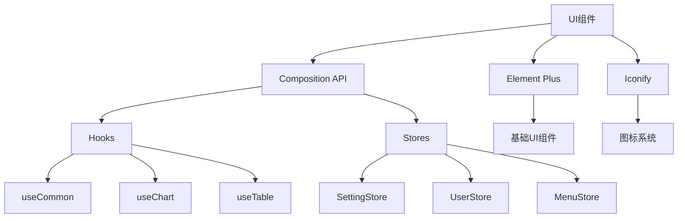

**图示来源**
- [art-header-bar/index.vue](file://src/components/core/layouts/art-header-bar/index.vue)
- [useCommon.ts](file://src/hooks/core/useCommon.ts)
- [useChart.ts](file://src/hooks/core/useChart.ts)
- [useTable.ts](file://src/hooks/core/useTable.ts)

## 详细组件分析
### 基础组件分析
Art Design Pro UI组件库的基础组件包括返回顶部、Logo和SVG图标等常用UI元素。

#### 返回顶部组件
返回顶部组件提供了一个优雅的返回页面顶部的功能，当用户滚动页面超过一定阈值时自动显示。

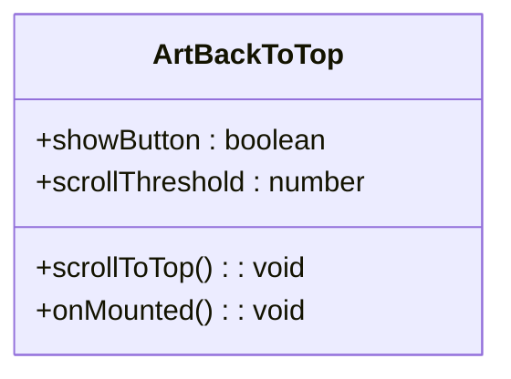

**图示来源**
- [art-back-to-top/index.vue](file://src/components/core/base/art-back-to-top/index.vue)

#### Logo组件
Logo组件用于显示系统Logo，支持自定义大小。

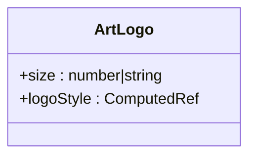

**图示来源**
- [art-logo/index.vue](file://src/components/core/base/art-logo/index.vue)

#### SVG图标组件
SVG图标组件封装了Iconify图标系统，提供了一种简单的方式来使用SVG图标。

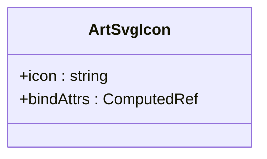

**图示来源**
- [art-svg-icon/index.vue](file://src/components/core/base/art-svg-icon/index.vue)

**章节来源**
- [art-back-to-top/index.vue](file://src/components/core/base/art-back-to-top/index.vue)
- [art-logo/index.vue](file://src/components/core/base/art-logo/index.vue)
- [art-svg-icon/index.vue](file://src/components/core/base/art-svg-icon/index.vue)

### 表单组件分析
Art Design Pro UI组件库的表单组件提供了强大的表单处理能力，支持多种表单元素和验证功能。

#### 表单组件
表单组件基于Element Plus的ElForm构建，提供了更高级的布局和配置选项。

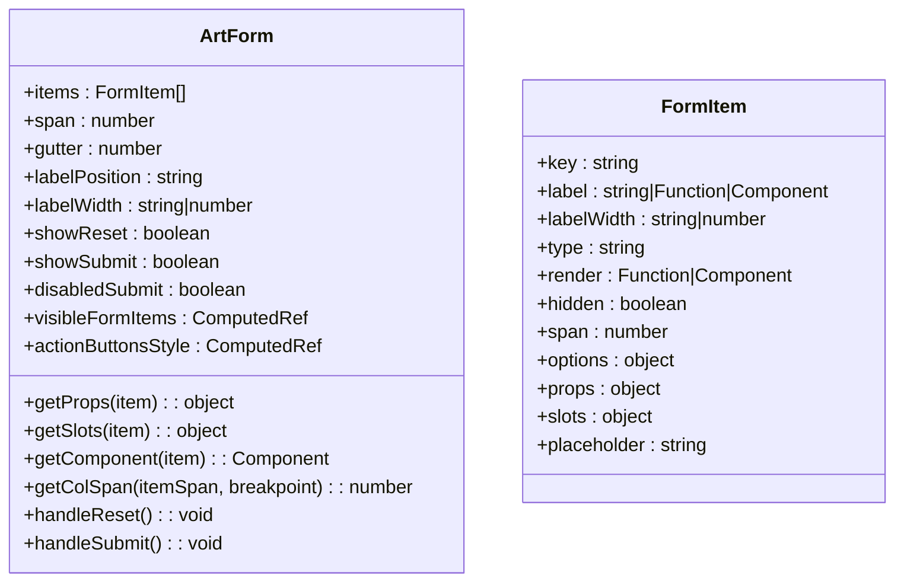

**图示来源**
- [art-form/index.vue](file://src/components/core/forms/art-form/index.vue)

**章节来源**
- [art-form/index.vue](file://src/components/core/forms/art-form/index.vue)

### 图表组件分析
Art Design Pro UI组件库的图表组件基于ECharts构建，提供了丰富的数据可视化能力。

#### 折线图组件
折线图组件支持单数据和多数据展示，具有动画效果和响应式设计。

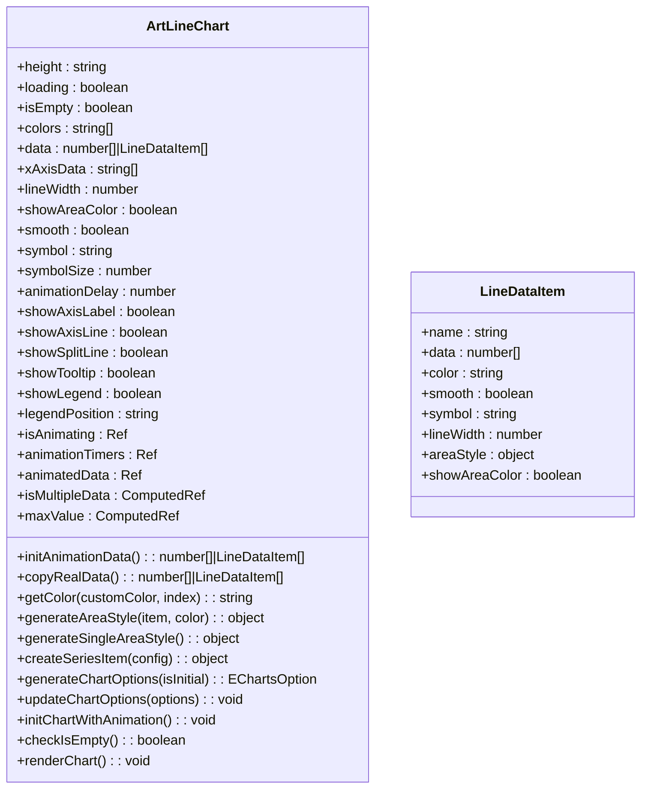

**图示来源**
- [art-line-chart/index.vue](file://src/components/core/charts/art-line-chart/index.vue)

**章节来源**
- [art-line-chart/index.vue](file://src/components/core/charts/art-line-chart/index.vue)

### 表格组件分析
Art Design Pro UI组件库的表格组件提供了强大的数据展示和分页功能。

#### 表格组件
表格组件基于Element Plus的ElTable构建，增加了分页、高度自适应和全局序号等功能。

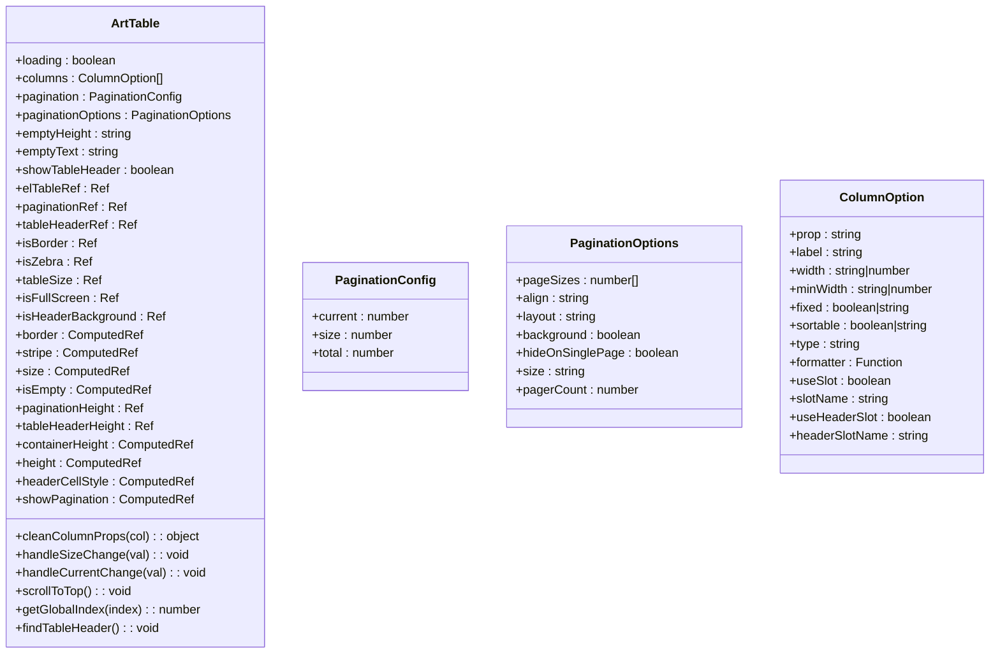

**图示来源**
- [art-table/index.vue](file://src/components/core/tables/art-table/index.vue)

**章节来源**
- [art-table/index.vue](file://src/components/core/tables/art-table/index.vue)

### 布局组件分析
Art Design Pro UI组件库的布局组件提供了完整的页面布局解决方案。

#### 顶部栏组件
顶部栏组件包含了系统Logo、菜单按钮、搜索框、全屏按钮、语言切换、通知、聊天、设置和用户菜单等元素。

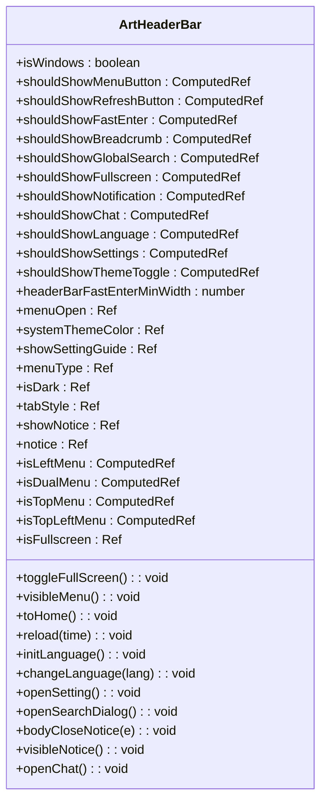

**图示来源**
- [art-header-bar/index.vue](file://src/components/core/layouts/art-header-bar/index.vue)

**章节来源**
- [art-header-bar/index.vue](file://src/components/core/layouts/art-header-bar/index.vue)

### 卡片组件分析
Art Design Pro UI组件库的卡片组件提供了美观的数据展示方式。

#### 统计卡片组件
统计卡片组件用于展示关键指标数据，支持图标、标题、数值和描述。

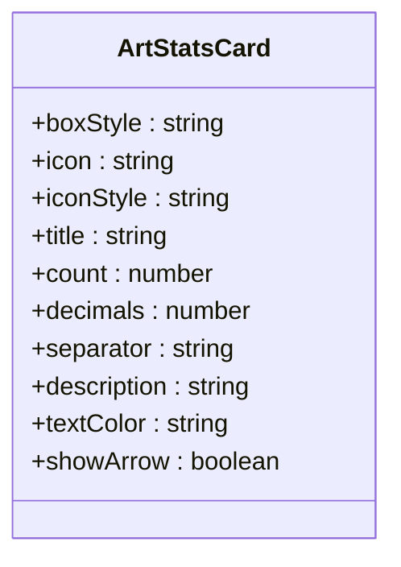

**图示来源**
- [art-stats-card/index.vue](file://src/components/core/cards/art-stats-card/index.vue)

**章节来源**
- [art-stats-card/index.vue](file://src/components/core/cards/art-stats-card/index.vue)

## 依赖分析
Art Design Pro UI组件库依赖于多个第三方库和框架，这些依赖关系确保了组件的功能完整性和性能优化。

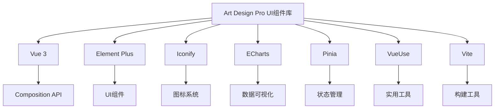

**图示来源**
- [component.ts](file://src/config/modules/component.ts)
- [art-header-bar/index.vue](file://src/components/core/layouts/art-header-bar/index.vue)

**章节来源**
- [component.ts](file://src/config/modules/component.ts)

## 性能考虑
Art Design Pro UI组件库在设计时充分考虑了性能优化，通过多种技术手段确保组件的高效运行。

1. **异步组件加载**：全局组件通过`defineAsyncComponent`实现按需加载，减少初始加载时间。
2. **响应式优化**：使用`computedEager`等优化技术减少不必要的计算。
3. **动画优化**：通过定时器管理和动画延迟实现流畅的动画效果。
4. **内存管理**：在组件销毁时清理定时器，避免内存泄漏。
5. **防抖处理**：使用`watchDebounced`优化数据监听，避免频繁更新。

**章节来源**
- [art-line-chart/index.vue](file://src/components/core/charts/art-line-chart/index.vue)
- [art-table/index.vue](file://src/components/core/tables/art-table/index.vue)

## 故障排除指南
在使用Art Design Pro UI组件库时，可能会遇到一些常见问题。以下是一些故障排除建议：

1. **组件不显示**：检查组件是否已正确注册，确保导入路径正确。
2. **样式问题**：确认CSS变量已正确设置，检查主题配置。
3. **数据绑定失败**：确保使用`v-model`正确绑定数据，检查数据类型。
4. **动画卡顿**：检查浏览器性能，确保没有过多的重绘和回流。
5. **响应式失效**：确认断点设置正确，检查媒体查询。

**章节来源**
- [art-form/index.vue](file://src/components/core/forms/art-form/index.vue)
- [art-table/index.vue](file://src/components/core/tables/art-table/index.vue)

## 结论
Art Design Pro UI组件库提供了一套完整、可复用的UI解决方案，通过模块化设计和先进的前端技术，为开发者提供了高效、美观的组件选择。组件库的架构清晰，性能优化到位，文档齐全，是构建现代化Web应用的理想选择。