# Art Design Pro 业务组件 - 评论组件详细文档

<cite>
**本文档引用的文件**
- [index.vue](file://src/components/business/comment-widget/index.vue)
- [CommentItem.vue](file://src/components/business/comment-widget/widget/CommentItem.vue)
- [commentDetail.ts](file://src/mock/temp/commentDetail.ts)
- [commentList.ts](file://src/mock/temp/commentList.ts)
- [ArticleComment.vue](file://src/views/article/comment/index.vue)
- [setting.ts](file://src/config/setting.ts)
- [images.ts](file://src/config/assets/images.ts)
</cite>

## 目录
1. [简介](#简介)
2. [项目结构](#项目结构)
3. [核心组件](#核心组件)
4. [架构概览](#架构概览)
5. [详细组件分析](#详细组件分析)
6. [数据绑定与状态管理](#数据绑定与状态管理)
7. [交互设计与用户体验](#交互设计与用户体验)
8. [性能优化策略](#性能优化策略)
9. [可访问性与国际化](#可访问性与国际化)
10. [集成示例](#集成示例)
11. [最佳实践与优化建议](#最佳实践与优化建议)
12. [总结](#总结)

## 简介

Art Design Pro 的评论组件是一个功能完整、设计精美的社交互动组件，专为现代Web应用的评论需求而设计。该组件采用Vue 3 + TypeScript技术栈，提供了完整的评论发布、回复处理、嵌套评论展示等功能，支持多种应用场景，包括文章评论、产品评价、社交互动等。

### 主要特性

- **完整的评论生态**：支持一级评论和多级回复嵌套
- **实时交互体验**：即时添加评论和回复，无刷新更新
- **美观的视觉设计**：个性化头像、时间格式化、主题色彩
- **响应式布局**：适配各种屏幕尺寸和设备
- **可扩展架构**：支持插槽定制和主题配置

## 项目结构

评论组件采用模块化设计，主要包含以下文件结构：

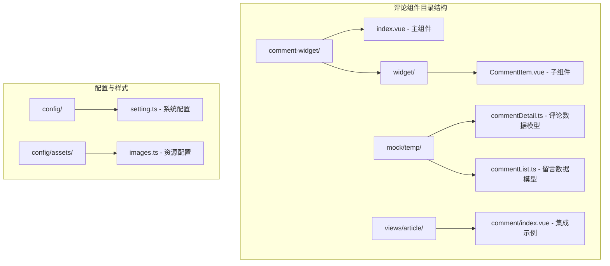

**图表来源**
- [index.vue](file://src/components/business/comment-widget/index.vue#L1-L112)
- [CommentItem.vue](file://src/components/business/comment-widget/widget/CommentItem.vue#L1-L122)
- [commentDetail.ts](file://src/mock/temp/commentDetail.ts#L1-L58)

**章节来源**
- [index.vue](file://src/components/business/comment-widget/index.vue#L1-L112)
- [CommentItem.vue](file://src/components/business/comment-widget/widget/CommentItem.vue#L1-L122)

## 核心组件

### 主评论组件 (CommentWidget)

主组件负责评论表单管理和评论列表渲染，提供完整的评论发布流程。

#### 核心功能
- **评论表单**：包含作者姓名和评论内容输入
- **评论列表**：展示所有评论，支持倒序排列
- **回复管理**：控制回复表单的显示与隐藏
- **数据验证**：确保评论信息的完整性

#### 数据结构

| 属性名 | 类型 | 描述 | 默认值 |
|--------|------|------|--------|
| comments | Comment[] | 评论列表数组 | [] |
| newComment | Partial<Comment> | 新评论临时对象 | {author: '', content: ''} |
| showReplyForm | number \| null | 当前显示回复表单的评论ID | null |

### 子评论组件 (CommentItem)

子组件专门处理单条评论的渲染和交互，支持嵌套回复。

#### 核心功能
- **用户头像**：随机颜色标识，首字母显示
- **评论内容**：作者信息、评论内容、发布时间
- **回复功能**：点击回复按钮显示回复表单
- **嵌套渲染**：递归渲染子评论

#### 数据结构

| 属性名 | 类型 | 描述 |
|--------|------|------|
| comment | Comment | 单条评论对象 |
| showReplyForm | number \| null | 控制回复表单显示状态 |

**章节来源**
- [index.vue](file://src/components/business/comment-widget/index.vue#L43-L111)
- [CommentItem.vue](file://src/components/business/comment-widget/widget/CommentItem.vue#L60-L121)

## 架构概览

评论组件采用分层架构设计，确保代码的可维护性和扩展性：

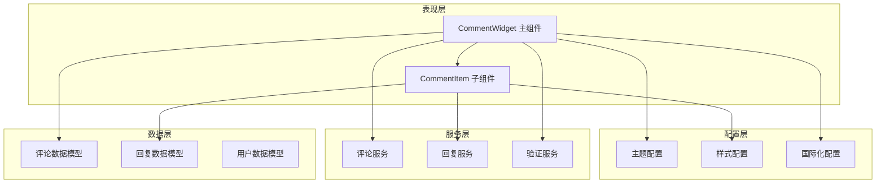

**图表来源**
- [index.vue](file://src/components/business/comment-widget/index.vue#L43-L111)
- [CommentItem.vue](file://src/components/business/comment-widget/widget/CommentItem.vue#L60-L121)

## 详细组件分析

### 主组件详细分析

#### 组件结构

主组件采用简洁的布局设计，包含评论表单和评论列表两个主要部分：

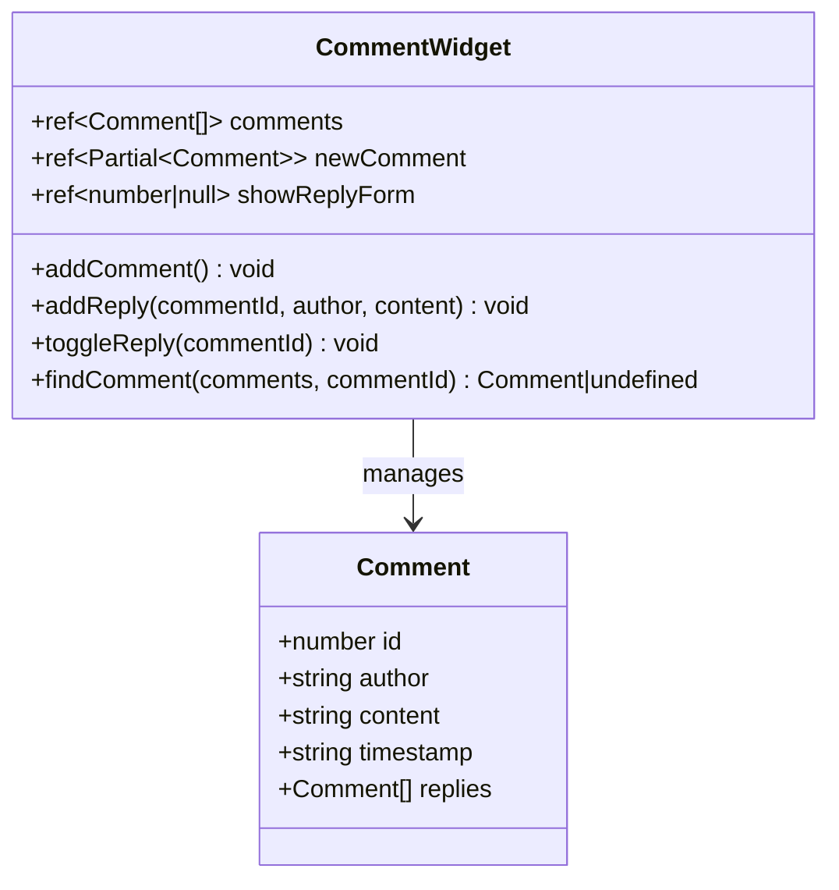

**图表来源**
- [index.vue](file://src/components/business/comment-widget/index.vue#L43-L111)
- [commentDetail.ts](file://src/mock/temp/commentDetail.ts#L1-L7)

#### 关键方法实现

1. **评论添加机制**
   - 输入验证确保数据完整性
   - 时间戳自动添加
   - 实时更新评论列表

2. **回复处理逻辑**
   - 嵌套查找算法定位目标评论
   - 回复表单状态管理
   - 递归处理多级回复

3. **状态管理策略**
   - 使用Vue响应式系统
   - 单向数据流原则
   - 事件驱动通信

**章节来源**
- [index.vue](file://src/components/business/comment-widget/index.vue#L56-L111)

### 子组件详细分析

#### 渲染流程

子组件采用递归渲染模式，支持无限层级的评论嵌套：

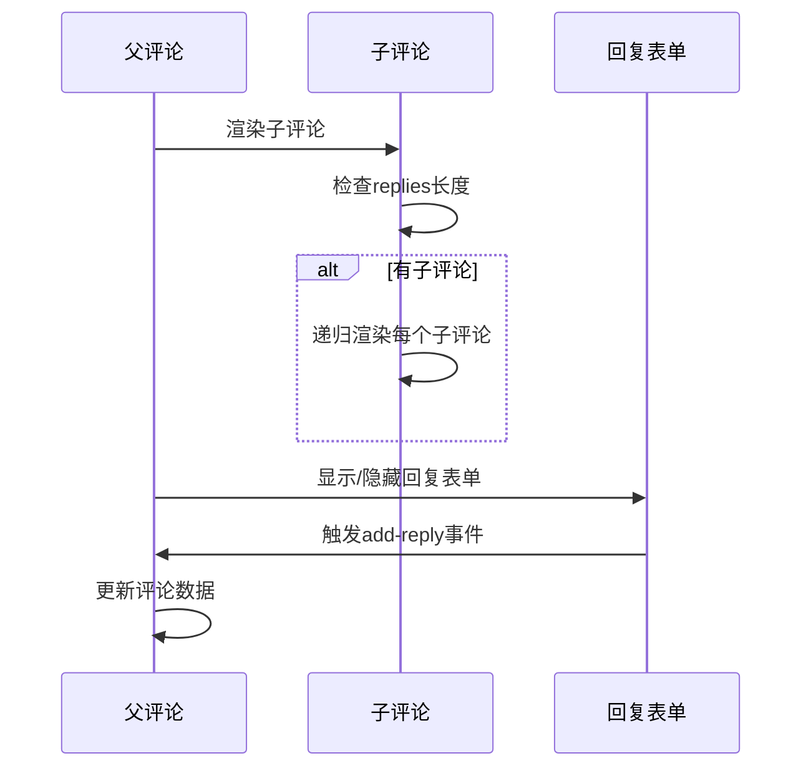

**图表来源**
- [CommentItem.vue](file://src/components/business/comment-widget/widget/CommentItem.vue#L25-L35)

#### 用户体验优化

1. **头像系统**
   - 随机颜色生成算法
   - 首字母自动提取
   - 颜色缓存避免重复

2. **时间格式化**
   - 本地化时间显示
   - 相对时间提示
   - 可配置格式

3. **交互反馈**
   - 实时状态指示
   - 成功/错误消息提示
   - 加载状态管理

**章节来源**
- [CommentItem.vue](file://src/components/business/comment-widget/widget/CommentItem.vue#L1-L121)

## 数据绑定与状态管理

### 数据流设计

评论组件采用单向数据流架构，确保数据的一致性和可预测性：

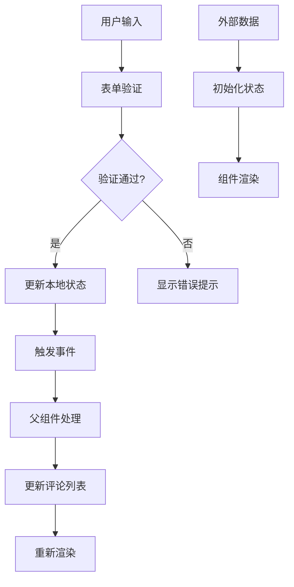

**图表来源**
- [index.vue](file://src/components/business/comment-widget/index.vue#L56-L95)

### 状态管理模式

| 状态类型 | 管理方式 | 更新时机 | 影响范围 |
|----------|----------|----------|----------|
| 评论列表 | Vue响应式 | 添加/删除评论时 | 全局可见 |
| 回复表单 | 本地状态 | 点击回复按钮时 | 当前评论 |
| 新评论 | 临时状态 | 表单输入时 | 表单组件 |
| 错误状态 | 本地状态 | 验证失败时 | 当前操作 |

**章节来源**
- [index.vue](file://src/components/business/comment-widget/index.vue#L47-L55)

## 交互设计与用户体验

### 交互模式

#### 评论发布流程

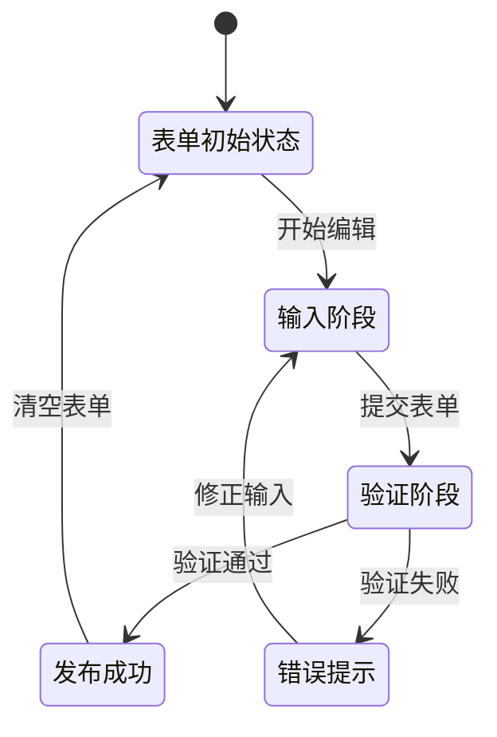

#### 回复交互设计

1. **回复按钮**：悬停变色，提供明确的交互提示
2. **回复表单**：渐显动画，避免突兀出现
3. **取消操作**：清晰的取消按钮，防止误操作
4. **提交反馈**：成功提示，增强用户信心

### 视觉设计规范

#### 颜色系统

| 组件元素 | 颜色变量 | 用途 | 说明 |
|----------|----------|------|------|
| 头像背景 | randomColor() | 用户标识 | 随机生成，避免重复 |
| 文本颜色 | text-g-700 | 正文文本 | 主要信息显示 |
| 操作文字 | text-g-700 hover:text-theme | 操作按钮 | 引导用户交互 |
| 分隔线 | border-g-400 | 内容分隔 | 清晰的层次划分 |

#### 排版系统

| 字体大小 | 应用场景 | 行高 | 字重 |
|----------|----------|------|------|
| 16px | 标题 | 1.5em | Medium |
| 14px | 正文 | 1.4em | Normal |
| 12px | 时间/辅助信息 | 1.3em | Light |

**章节来源**
- [CommentItem.vue](file://src/components/business/comment-widget/widget/CommentItem.vue#L4-L22)

## 性能优化策略

### 渲染优化

#### 虚拟滚动支持

虽然当前版本未实现虚拟滚动，但架构设计支持未来扩展：

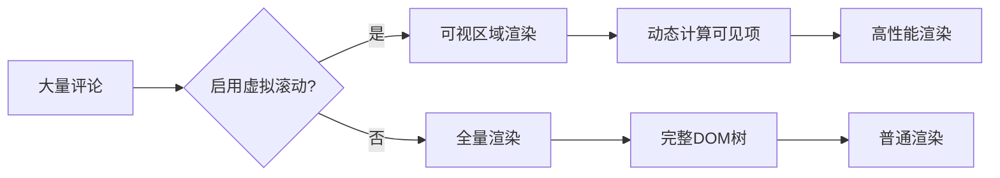

#### 懒加载策略

1. **按需渲染**：只渲染当前可见的评论
2. **延迟加载**：回复表单采用条件渲染
3. **内存管理**：及时清理不需要的数据

### 数据优化

#### 缓存机制

| 缓存类型 | 存储位置 | 生命周期 | 用途 |
|----------|----------|----------|------|
| 颜色缓存 | 组件实例 | 组件销毁 | 避免重复计算 |
| 时间格式化 | 计算属性 | 响应式更新 | 减少重复格式化 |
| DOM引用 | ref | 组件生命周期 | 提升操作效率 |

#### 内存管理

1. **事件解绑**：组件销毁时自动清理事件监听
2. **循环引用检测**：避免深层嵌套导致的内存泄漏
3. **数据压缩**：移除不必要的数据字段

**章节来源**
- [CommentItem.vue](file://src/components/business/comment-widget/widget/CommentItem.vue#L108-L120)

## 可访问性与国际化

### 可访问性支持

#### 键盘导航

1. **焦点管理**：合理设置tabindex
2. **快捷键支持**：Enter键提交表单
3. **屏幕阅读器友好**：语义化HTML结构

#### 视觉辅助

1. **高对比度模式**：支持系统高对比度设置
2. **字体缩放**：响应式字体大小
3. **颜色无障碍**：避免仅依赖颜色传递信息

### 国际化适配

#### 多语言支持

虽然当前代码主要使用中文，但架构支持国际化：

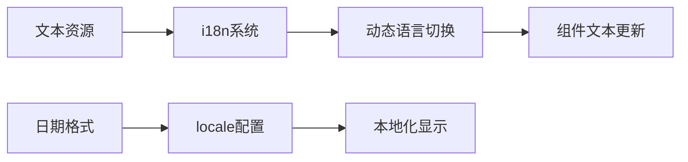

#### 本地化考虑

1. **日期格式**：根据地区显示相应格式
2. **文本方向**：支持从右到左的语言
3. **字符编码**：UTF-8完全支持

**章节来源**
- [CommentItem.vue](file://src/components/business/comment-widget/widget/CommentItem.vue#L103-L106)

## 集成示例

### 社交应用集成

在社交应用中，评论组件可以作为核心互动功能：

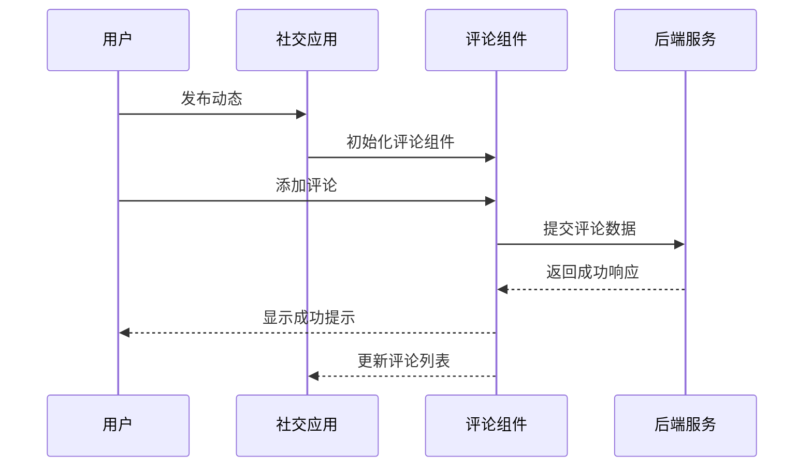

**图表来源**
- [ArticleComment.vue](file://src/views/article/comment/index.vue#L67-L69)

### 内容平台集成

在内容平台中，评论组件提供深度互动体验：

#### 留言墙集成

留言墙展示了评论组件在不同场景下的应用：

1. **网格布局**：5列响应式网格展示
2. **卡片设计**：每个留言作为独立卡片
3. **抽屉详情**：点击查看完整评论
4. **颜色主题**：随机颜色区分不同留言

#### 高级功能

| 功能 | 实现方式 | 效果 |
|------|----------|------|
| 留言统计 | 图标+数字 | 清晰的互动指标 |
| 用户标识 | 随机颜色+首字母 | 个性化用户识别 |
| 响应式设计 | CSS Grid + Media Queries | 适配各种设备 |
| 抽屉动画 | Element Plus Drawer | 流畅的交互体验 |

**章节来源**
- [ArticleComment.vue](file://src/views/article/comment/index.vue#L1-L78)

## 最佳实践与优化建议

### 高并发场景优化

#### 限流机制

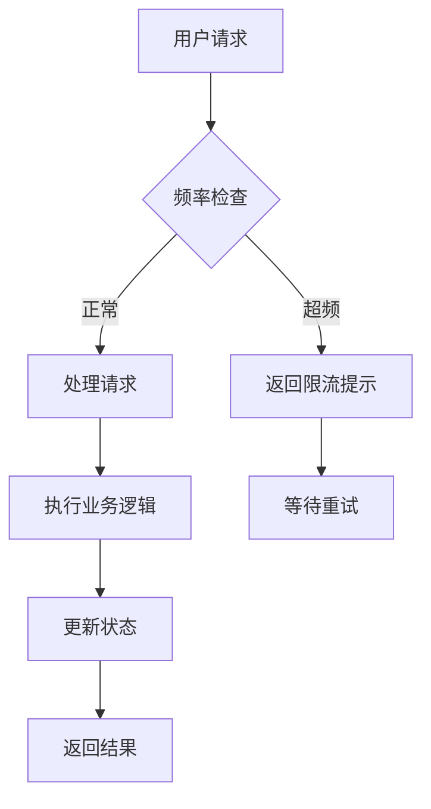

#### 缓存策略

1. **客户端缓存**：本地存储热门评论
2. **CDN加速**：静态资源分布式部署
3. **数据库优化**：索引优化和查询缓存

### 安全防护

#### 输入验证

1. **XSS防护**：内容转义处理
2. **SQL注入防护**：参数化查询
3. **频率限制**：防止恶意刷屏

#### 数据安全

1. **敏感信息过滤**：关键词屏蔽
2. **用户身份验证**：登录状态检查
3. **内容审核**：自动化+人工审核

### 扩展性设计

#### 插槽系统

虽然当前版本未完全实现插槽，但架构支持：

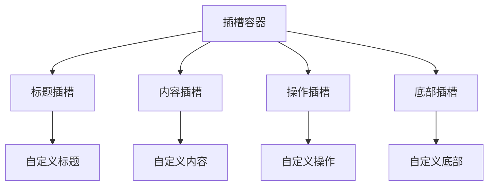

#### 主题系统

1. **CSS变量**：支持动态主题切换
2. **SCSS Mixins**：复用样式逻辑
3. **主题配置**：集中化主题管理

### 性能监控

#### 关键指标

| 指标类型 | 监控内容 | 优化目标 |
|----------|----------|----------|
| 渲染性能 | 首次渲染时间 | < 200ms |
| 交互响应 | 点击响应时间 | < 100ms |
| 内存使用 | 组件内存占用 | < 5MB |
| 网络请求 | API响应时间 | < 500ms |

#### 监控实施

1. **性能埋点**：关键操作时间记录
2. **错误追踪**：异常情况自动上报
3. **用户体验**：用户满意度调查
4. **资源监控**：服务器负载监控

**章节来源**
- [index.vue](file://src/components/business/comment-widget/index.vue#L1-L111)
- [CommentItem.vue](file://src/components/business/comment-widget/widget/CommentItem.vue#L1-L121)

## 总结

Art Design Pro 的评论组件展现了现代前端开发的最佳实践，通过精心的设计和实现，为开发者提供了一个功能完整、性能优异、易于扩展的评论解决方案。

### 核心优势

1. **架构清晰**：模块化设计，职责分明
2. **性能优秀**：响应式数据绑定，高效渲染
3. **用户体验**：直观的操作界面，流畅的交互体验
4. **扩展性强**：插槽系统，主题配置，国际化支持
5. **维护友好**：TypeScript类型安全，清晰的代码结构

### 应用价值

该评论组件不仅适用于简单的博客评论，更可以扩展到复杂的社交网络、电商平台、内容管理系统等各种场景，为构建现代化的Web应用提供了强有力的支持。

通过持续的优化和改进，这个评论组件将继续演进，为用户提供更好的互动体验，成为Art Design Pro生态系统中不可或缺的重要组成部分。