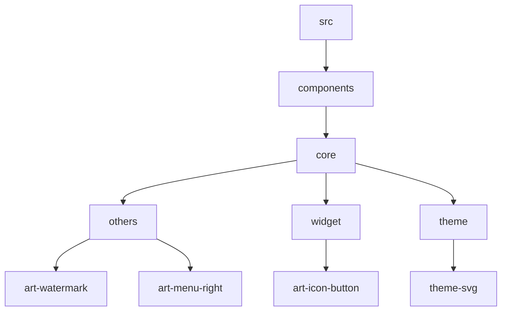
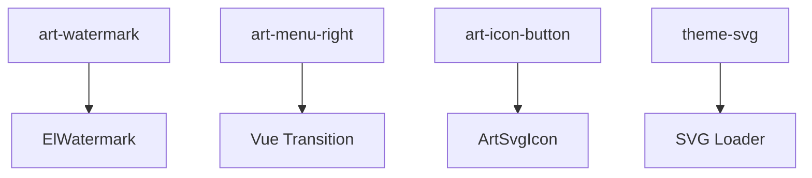
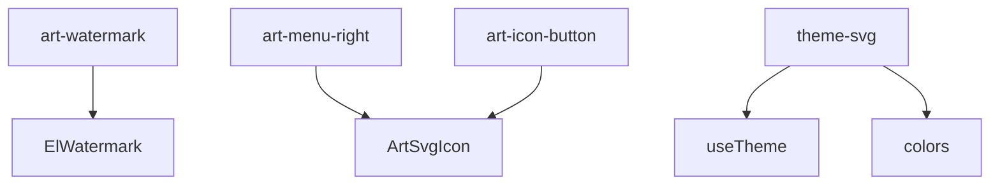

# 其他组件

<cite>
**本文档引用的文件**  
- [art-watermark/index.vue](file://src/components/core/others/art-watermark/index.vue)
- [art-menu-right/index.vue](file://src/components/core/others/art-menu-right/index.vue)
- [art-icon-button/index.vue](file://src/components/core/widget/art-icon-button/index.vue)
- [theme-svg/index.vue](file://src/components/core/theme/theme-svg/index.vue)
- [useTheme.ts](file://src/hooks/core/useTheme.ts)
- [colors.ts](file://src/utils/ui/colors.ts)
- [ColorSettings.vue](file://src/components/core/layouts/art-settings-panel/widget/ColorSettings.vue)
- [watermark/index.vue](file://src/views/widgets/watermark/index.vue)
- [context-menu/index.vue](file://src/views/widgets/context-menu/index.vue)
</cite>

## 目录
1. [简介](#简介)
2. [项目结构](#项目结构)
3. [核心组件](#核心组件)
4. [架构概述](#架构概述)
5. [详细组件分析](#详细组件分析)
6. [依赖分析](#依赖分析)
7. [性能考虑](#性能考虑)
8. [故障排除指南](#故障排除指南)
9. [结论](#结论)

## 简介
Art Design Pro 是一个现代化的前端设计系统，提供了一系列实用工具组件来增强用户体验和界面美观性。本文档重点介绍四个关键组件：`art-watermark`（水印组件）、`art-menu-right`（右键菜单）、`art-icon-button`（图标按钮）和 `theme-svg`（主题SVG）。这些组件在版权保护、用户交互和界面美化方面发挥着重要作用。通过详细说明每个组件的属性配置、事件回调和使用示例，本文档旨在为开发者提供全面的指导，帮助他们充分利用这些组件的功能。

## 项目结构
Art Design Pro 项目采用模块化设计，将不同功能的组件组织在各自的目录中。核心组件位于 `src/components/core` 目录下，其中 `others` 子目录包含 `art-watermark` 和 `art-menu-right` 组件，`widget` 子目录包含 `art-icon-button` 组件，而 `theme` 子目录则包含 `theme-svg` 组件。这种清晰的目录结构有助于快速定位和理解各个组件的位置和职责。



**Diagram sources**
- [art-watermark/index.vue](file://src/components/core/others/art-watermark/index.vue)
- [art-menu-right/index.vue](file://src/components/core/others/art-menu-right/index.vue)
- [art-icon-button/index.vue](file://src/components/core/widget/art-icon-button/index.vue)
- [theme-svg/index.vue](file://src/components/core/theme/theme-svg/index.vue)

**Section sources**
- [art-watermark/index.vue](file://src/components/core/others/art-watermark/index.vue)
- [art-menu-right/index.vue](file://src/components/core/others/art-menu-right/index.vue)
- [art-icon-button/index.vue](file://src/components/core/widget/art-icon-button/index.vue)
- [theme-svg/index.vue](file://src/components/core/theme/theme-svg/index.vue)

## 核心组件
Art Design Pro 提供了多个实用工具组件，包括 `art-watermark`、`art-menu-right`、`art-icon-button` 和 `theme-svg`。这些组件在版权保护、用户交互和界面美化方面发挥着重要作用。`art-watermark` 组件通过生成水印来保护内容版权，`art-menu-right` 组件提供上下文菜单以增强用户交互，`art-icon-button` 组件通过图标按钮提升界面美观性，而 `theme-svg` 组件则确保SVG图像与当前主题保持一致。

**Section sources**
- [art-watermark/index.vue](file://src/components/core/others/art-watermark/index.vue)
- [art-menu-right/index.vue](file://src/components/core/others/art-menu-right/index.vue)
- [art-icon-button/index.vue](file://src/components/core/widget/art-icon-button/index.vue)
- [theme-svg/index.vue](file://src/components/core/theme/theme-svg/index.vue)

## 架构概述
Art Design Pro 的架构设计注重模块化和可扩展性。每个组件都独立封装，具有明确的职责和接口。`art-watermark` 组件利用 Element Plus 的 `ElWatermark` 实现水印生成，`art-menu-right` 组件通过 Vue 的过渡动画和事件处理机制实现上下文菜单，`art-icon-button` 组件结合 `ArtSvgIcon` 组件实现图标集成，而 `theme-svg` 组件则通过动态加载和颜色替换技术实现主题适配。



**Diagram sources**
- [art-watermark/index.vue](file://src/components/core/others/art-watermark/index.vue)
- [art-menu-right/index.vue](file://src/components/core/others/art-menu-right/index.vue)
- [art-icon-button/index.vue](file://src/components/core/widget/art-icon-button/index.vue)
- [theme-svg/index.vue](file://src/components/core/theme/theme-svg/index.vue)

## 详细组件分析
本节将对 `art-watermark`、`art-menu-right`、`art-icon-button` 和 `theme-svg` 四个组件进行深入分析，详细介绍它们的实现原理、配置选项和使用方法。

### art-watermark 水印组件分析
`art-watermark` 组件用于在页面上生成水印，以保护内容版权。该组件基于 Element Plus 的 `ElWatermark` 实现，支持自定义水印内容、字体大小、颜色、旋转角度、间距和偏移等属性。

#### 属性配置
`art-watermark` 组件提供了丰富的属性配置选项，允许开发者根据需求定制水印样式。

| 属性 | 类型 | 默认值 | 描述 |
| --- | --- | --- | --- |
| content | string | AppConfig.systemInfo.name | 水印内容 |
| visible | boolean | false | 水印是否可见 |
| fontSize | number | 16 | 水印字体大小 |
| fontColor | string | 'rgba(128, 128, 128, 0.2)' | 水印字体颜色 |
| rotate | number | -22 | 水印旋转角度 |
| gapX | number | 100 | 水印间距X |
| gapY | number | 100 | 水印间距Y |
| offsetX | number | 50 | 水印偏移X |
| offsetY | number | 50 | 水印偏移Y |
| zIndex | number | 3100 | 水印层级 |

#### 事件回调
`art-watermark` 组件没有直接暴露事件回调，但可以通过 `settingStore` 的状态变化来监听水印的显示和隐藏。

#### 使用示例
```vue
<template>
  <ArtWatermark content="Art Design Pro" :fontSize="20" :fontColor="'rgba(255, 0, 0, 0.3)'" :rotate="-22" :gapX="100" :gapY="100" />
</template>
```

**Section sources**
- [art-watermark/index.vue](file://src/components/core/others/art-watermark/index.vue)
- [watermark/index.vue](file://src/views/widgets/watermark/index.vue)

### art-menu-right 右键菜单分析
`art-menu-right` 组件提供了一个功能丰富的右键菜单，支持多级子菜单、图标显示、禁用状态和分割线等功能。该组件通过 Vue 的过渡动画和事件处理机制实现平滑的菜单显示和隐藏效果。

#### 属性配置
`art-menu-right` 组件提供了灵活的属性配置选项，允许开发者自定义菜单的外观和行为。

| 属性 | 类型 | 默认值 | 描述 |
| --- | --- | --- | --- |
| menuItems | MenuItemType[] | - | 菜单项数组 |
| menuWidth | number | 120 | 菜单宽度 |
| submenuWidth | number | 150 | 子菜单宽度 |
| itemHeight | number | 32 | 菜单项高度 |
| boundaryDistance | number | 10 | 边界距离 |
| menuPadding | number | 5 | 菜单内边距 |
| itemPaddingX | number | 6 | 菜单项水平内边距 |
| borderRadius | number | 6 | 菜单圆角 |
| animationDuration | number | 100 | 动画持续时间 |

#### 事件回调
`art-menu-right` 组件提供了以下事件回调：
- `select`: 当用户选择一个菜单项时触发。
- `show`: 当菜单显示时触发。
- `hide`: 当菜单隐藏时触发。

#### 使用示例
```vue
<template>
  <ElButton @contextmenu.prevent="showMenu"> 右键触发菜单 </ElButton>
  <ArtMenuRight ref="menuRef" :menu-items="menuItems" :menu-width="180" :submenu-width="140" :border-radius="10" @select="handleSelect" @show="onMenuShow" @hide="onMenuHide" />
</template>
```

**Section sources**
- [art-menu-right/index.vue](file://src/components/core/others/art-menu-right/index.vue)
- [context-menu/index.vue](file://src/views/widgets/context-menu/index.vue)

### art-icon-button 图标按钮分析
`art-icon-button` 组件是一个简单的图标按钮，用于在界面上显示图标。该组件通过 `ArtSvgIcon` 组件实现图标集成，并支持圆形按钮样式。

#### 属性配置
`art-icon-button` 组件提供了以下属性配置选项：
- `icon`: 图标名称。
- `circle`: 是否为圆形按钮。

#### 事件回调
`art-icon-button` 组件没有直接暴露事件回调，但可以通过 `@click` 事件监听器来处理点击事件。

#### 使用示例
```vue
<template>
  <ArtIconButton icon="ri:github-fill" circle />
</template>
```

**Section sources**
- [art-icon-button/index.vue](file://src/components/core/widget/art-icon-button/index.vue)

### theme-svg 主题SVG分析
`theme-svg` 组件用于使 SVG 图像跟随当前主题变化。该组件通过动态加载 SVG 文件并替换其中的颜色值来实现主题适配。

#### 属性配置
`theme-svg` 组件提供了以下属性配置选项：
- `size`: SVG 图像的大小。
- `themeColor`: 主题颜色。
- `src`: SVG 文件的 URL。

#### 事件回调
`theme-svg` 组件没有直接暴露事件回调，但可以通过 `watchEffect` 监听 `src` 属性的变化来触发 SVG 内容的重新加载。

#### 使用示例
```vue
<template>
  <ThemeSvg src="https://iconpark.oceanengine.com/illustrations/13" :size="500" :theme-color="'var(--el-color-primary)'" />
</template>
```

**Section sources**
- [theme-svg/index.vue](file://src/components/core/theme/theme-svg/index.vue)

## 依赖分析
`art-watermark`、`art-menu-right`、`art-icon-button` 和 `theme-svg` 四个组件之间没有直接的依赖关系，但它们都依赖于 Art Design Pro 项目中的其他核心组件和工具函数。例如，`art-watermark` 依赖于 `ElWatermark` 组件，`art-menu-right` 依赖于 `ArtSvgIcon` 组件，`art-icon-button` 也依赖于 `ArtSvgIcon` 组件，而 `theme-svg` 依赖于 `useTheme` 和 `colors` 工具函数。



**Diagram sources**
- [art-watermark/index.vue](file://src/components/core/others/art-watermark/index.vue)
- [art-menu-right/index.vue](file://src/components/core/others/art-menu-right/index.vue)
- [art-icon-button/index.vue](file://src/components/core/widget/art-icon-button/index.vue)
- [theme-svg/index.vue](file://src/components/core/theme/theme-svg/index.vue)
- [useTheme.ts](file://src/hooks/core/useTheme.ts)
- [colors.ts](file://src/utils/ui/colors.ts)

**Section sources**
- [art-watermark/index.vue](file://src/components/core/others/art-watermark/index.vue)
- [art-menu-right/index.vue](file://src/components/core/others/art-menu-right/index.vue)
- [art-icon-button/index.vue](file://src/components/core/widget/art-icon-button/index.vue)
- [theme-svg/index.vue](file://src/components/core/theme/theme-svg/index.vue)
- [useTheme.ts](file://src/hooks/core/useTheme.ts)
- [colors.ts](file://src/utils/ui/colors.ts)

## 性能考虑
在使用 `art-watermark`、`art-menu-right`、`art-icon-button` 和 `theme-svg` 组件时，需要注意以下性能考虑：
- `art-watermark` 组件会在页面上生成大量的水印元素，可能会影响页面渲染性能。建议在必要时才启用水印功能。
- `art-menu-right` 组件通过事件监听器来处理文档点击和键盘事件，可能会增加事件处理的开销。建议在不需要时及时移除事件监听器。
- `art-icon-button` 组件相对轻量，对性能影响较小。
- `theme-svg` 组件需要通过网络请求加载 SVG 文件，可能会增加页面加载时间。建议对常用的 SVG 文件进行缓存。

## 故障排除指南
在使用这些组件时，可能会遇到一些常见问题。以下是一些解决方案：
- 如果 `art-watermark` 不显示，请检查 `settingStore` 中的 `watermarkVisible` 状态是否正确设置。
- 如果 `art-menu-right` 菜单无法正确显示，请检查 `menuItems` 数组是否正确配置，并确保 `show` 方法被正确调用。
- 如果 `art-icon-button` 图标不显示，请检查 `icon` 属性是否正确设置，并确保 `ArtSvgIcon` 组件已正确引入。
- 如果 `theme-svg` 图像不显示，请检查 `src` 属性是否正确设置，并确保网络请求能够成功加载 SVG 文件。

**Section sources**
- [art-watermark/index.vue](file://src/components/core/others/art-watermark/index.vue)
- [art-menu-right/index.vue](file://src/components/core/others/art-menu-right/index.vue)
- [art-icon-button/index.vue](file://src/components/core/widget/art-icon-button/index.vue)
- [theme-svg/index.vue](file://src/components/core/theme/theme-svg/index.vue)

## 结论
`art-watermark`、`art-menu-right`、`art-icon-button` 和 `theme-svg` 四个组件在 Art Design Pro 项目中扮演着重要角色，分别在版权保护、用户交互、界面美化和主题适配方面提供了强大的功能。通过合理配置和使用这些组件，开发者可以显著提升应用的用户体验和视觉效果。同时，需要注意这些组件的性能影响和潜在问题，以确保应用的稳定性和高效性。