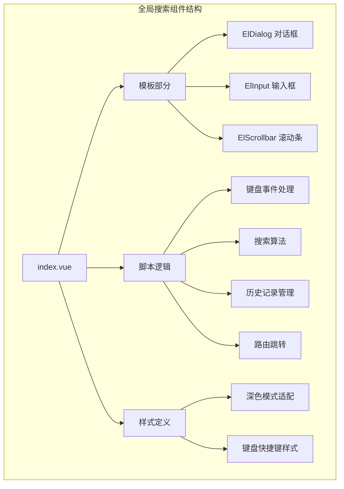
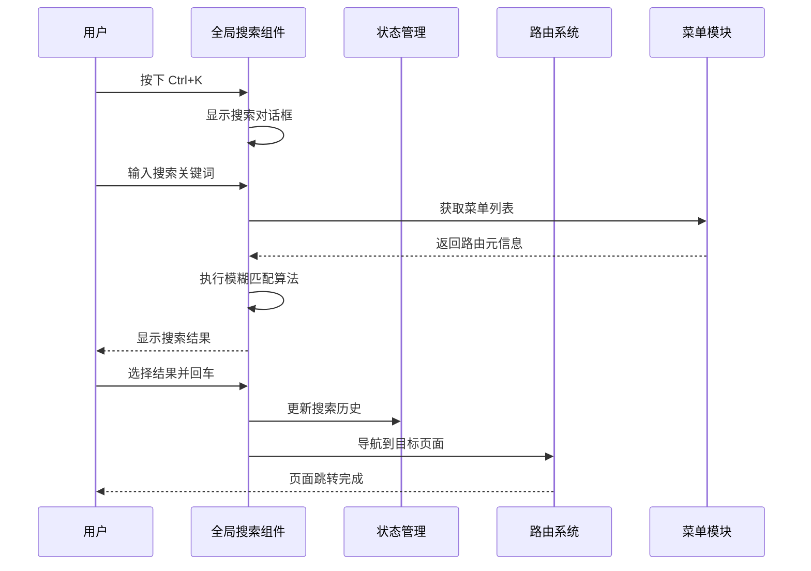
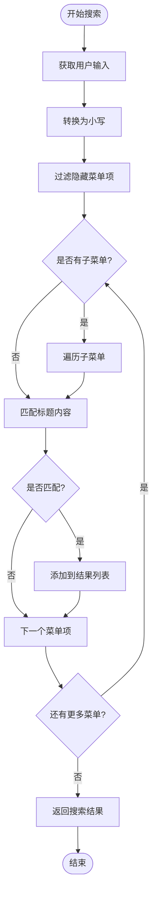
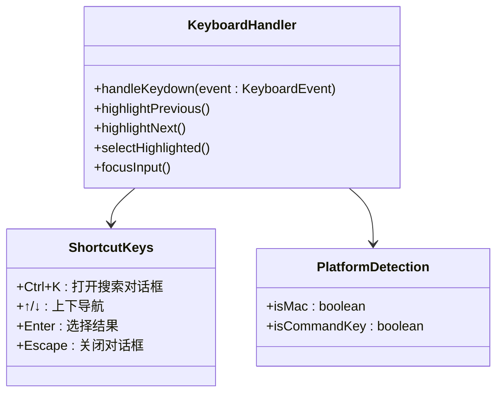
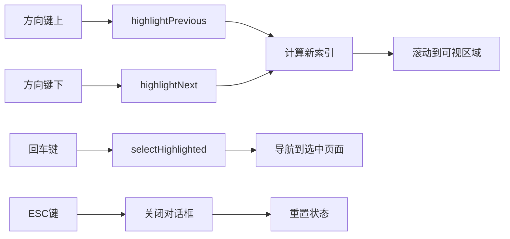
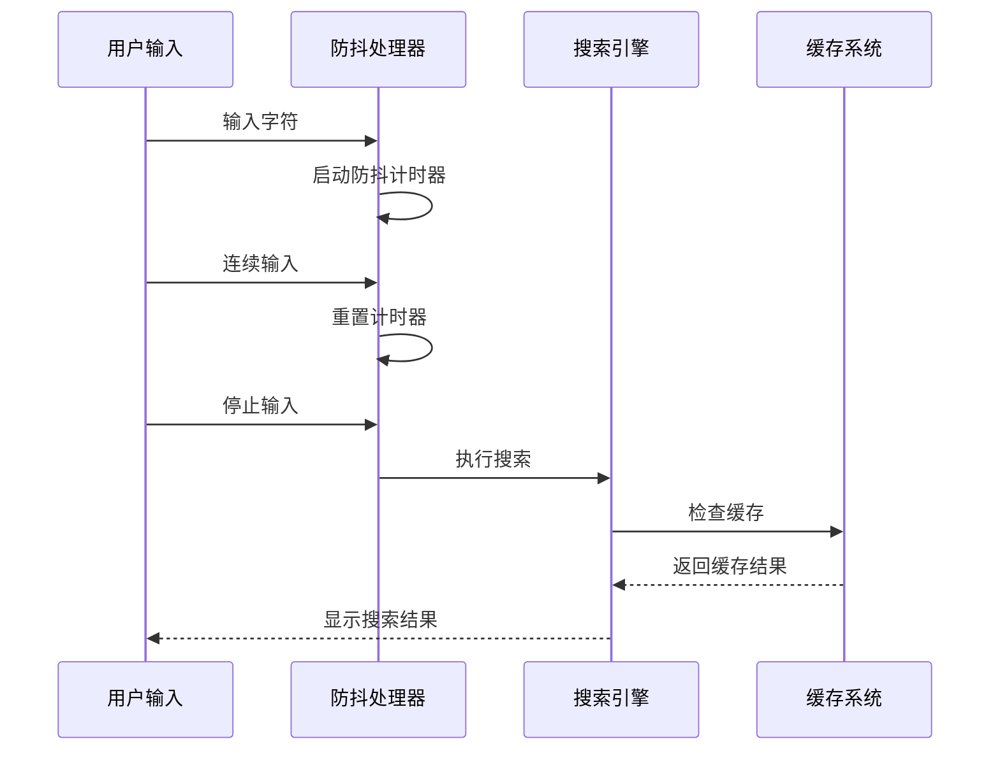
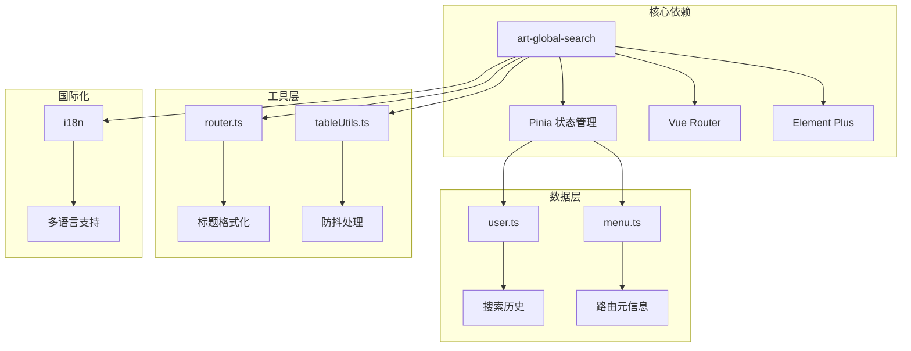

# 全局搜索组件 (art-global-search)

<cite>
**本文档引用的文件**
- [index.vue](file://src/components/core/layouts/art-global-search/index.vue)
- [router/index.ts](file://src/types/router/index.ts)
- [router.ts](file://src/utils/router.ts)
- [menu.ts](file://src/store/modules/menu.ts)
- [user.ts](file://src/store/modules/user.ts)
- [tableCache.ts](file://src/utils/table/tableCache.ts)
- [tableUtils.ts](file://src/utils/table/tableUtils.ts)
- [useTable.ts](file://src/hooks/core/useTable.ts)
- [route.ts](file://src/utils/navigation/route.ts)
- [zh.json](file://src/locales/langs/zh.json)
- [dashboard.ts](file://src/router/modules/dashboard.ts)
</cite>

## 目录
1. [简介](#简介)
2. [项目结构](#项目结构)
3. [核心组件](#核心组件)
4. [架构概览](#架构概览)
5. [详细组件分析](#详细组件分析)
6. [依赖关系分析](#依赖关系分析)
7. [性能考虑](#性能考虑)
8. [故障排除指南](#故障排除指南)
9. [结论](#结论)

## 简介

art-global-search 是一个功能强大的全局搜索组件，专为复杂的后台管理系统设计。该组件提供了实时模糊匹配、快捷导航、搜索历史管理和键盘快捷键支持等功能，显著提升了用户的导航效率和体验。

### 主要特性

- **智能模糊匹配算法**：基于标题内容的实时搜索
- **快捷键支持**：支持 Ctrl+K 快捷键打开搜索对话框
- **搜索历史管理**：自动记录和管理用户搜索历史
- **实时搜索建议**：动态显示匹配结果
- **键盘导航**：支持方向键和回车键进行快速选择
- **多语言支持**：完整的国际化支持
- **性能优化**：防抖处理和搜索缓存策略

## 项目结构

全局搜索组件位于 `src/components/core/layouts/art-global-search/` 目录下，采用标准的 Vue 3 组合式 API 架构：



**图表来源**
- [index.vue](file://src/components/core/layouts/art-global-search/index.vue#L1-L94)

**章节来源**
- [index.vue](file://src/components/core/layouts/art-global-search/index.vue#L1-L427)

## 核心组件

### 组件架构

全局搜索组件采用模块化设计，主要包含以下核心模块：

1. **UI 层**：基于 Element Plus 的对话框和输入组件
2. **逻辑层**：搜索算法、历史记录管理和键盘事件处理
3. **数据层**：路由元信息提取和用户状态管理
4. **样式层**：响应式设计和主题适配

### 关键数据结构

组件使用以下核心数据结构：

| 数据结构 | 类型 | 描述 | 用途 |
|---------|------|------|------|
| `searchVal` | `ref<string>` | 搜索输入值 | 实时监控用户输入 |
| `searchResult` | `ref<AppRouteRecord[]>` | 搜索结果列表 | 存储匹配的路由记录 |
| `historyResult` | `ref<AppRouteRecord[]>` | 历史记录列表 | 存储用户搜索历史 |
| `highlightedIndex` | `ref<number>` | 高亮索引 | 控制当前选中的结果 |
| `showSearchDialog` | `ref<boolean>` | 对话框显示状态 | 控制搜索对话框可见性 |

**章节来源**
- [index.vue](file://src/components/core/layouts/art-global-search/index.vue#L111-L122)

## 架构概览

全局搜索组件的整体架构遵循 MVVM 设计模式，通过 Pinia 状态管理和 Vue 3 响应式系统实现数据流管理：



**图表来源**
- [index.vue](file://src/components/core/layouts/art-global-search/index.vue#L135-L161)
- [menu.ts](file://src/store/modules/menu.ts#L45-L57)
- [user.ts](file://src/store/modules/user.ts#L63-L65)

## 详细组件分析

### 模糊匹配算法

组件实现了高效的模糊匹配算法，支持对路由元信息的标题进行实时搜索：



**图表来源**
- [index.vue](file://src/components/core/layouts/art-global-search/index.vue#L178-L199)

#### 匹配逻辑详解

1. **输入规范化**：将用户输入和菜单标题都转换为小写进行比较
2. **隐藏项过滤**：跳过设置了 `isHide: true` 的菜单项
3. **递归遍历**：支持多级菜单的深度搜索
4. **精确匹配**：使用 `includes()` 方法进行字符串包含匹配

**章节来源**
- [index.vue](file://src/components/core/layouts/art-global-search/index.vue#L178-L199)

### 快捷键绑定系统

组件支持多种键盘快捷键操作，提供流畅的用户体验：



**图表来源**
- [index.vue](file://src/components/core/layouts/art-global-search/index.vue#L135-L161)

#### 平台兼容性处理

组件自动检测操作系统平台，正确处理不同平台的快捷键：

- **macOS**: 使用 `metaKey` 和 Cmd 键
- **Windows/Linux**: 使用 `ctrlKey` 和 Ctrl 键

**章节来源**
- [index.vue](file://src/components/core/layouts/art-global-search/index.vue#L136-L142)

### 搜索历史管理

组件实现了智能的历史记录管理系统：

```mermaid
stateDiagram-v2
[*] --> 初始化
初始化 --> 检查历史记录
检查历史记录 --> 查找重复项
查找重复项 --> 存在重复{"存在重复?"}
存在重复 --> |是| 移除重复项
存在重复 --> |否| 检查容量
移除重复项 --> 检查容量
检查容量 --> 超出限制{"超出最大容量?"}
超出限制 --> |是| 移除最旧项
超出限制 --> |否| 添加新项
移除最旧项 --> 添加新项
添加新项 --> 更新存储
更新存储 --> [*]
```

**图表来源**
- [index.vue](file://src/components/core/layouts/art-global-search/index.vue#L308-L335)
- [user.ts](file://src/store/modules/user.ts#L63-L65)

#### 历史记录特性

1. **容量限制**：最多保存 10 条历史记录
2. **去重机制**：相同页面不会重复出现在历史中
3. **自动清理**：超出容量时自动移除最旧的记录
4. **持久化存储**：使用 Pinia 状态管理持久化历史记录

**章节来源**
- [index.vue](file://src/components/core/layouts/art-global-search/index.vue#L308-L335)

### 键盘导航系统

组件提供了完整的键盘导航功能，支持流畅的键盘操作：



**图表来源**
- [index.vue](file://src/components/core/layouts/art-global-search/index.vue#L202-L231)

#### 滚动同步机制

组件实现了智能的滚动同步功能，确保高亮项始终在可视区域内：

1. **向上滚动**：当高亮项在可视区域上方时自动滚动
2. **向下滚动**：当高亮项在可视区域下方时自动滚动
3. **平滑过渡**：使用 Element Plus 的滚动 API 实现平滑滚动

**章节来源**
- [index.vue](file://src/components/core/layouts/art-global-search/index.vue#L233-L281)

### 实时搜索建议机制

组件采用防抖技术优化搜索性能：



**图表来源**
- [tableUtils.ts](file://src/utils/table/tableUtils.ts#L202-L239)
- [useTable.ts](file://src/hooks/core/useTable.ts#L440-L440)

**章节来源**
- [tableUtils.ts](file://src/utils/table/tableUtils.ts#L202-L239)

## 依赖关系分析

全局搜索组件与系统的其他模块有着紧密的依赖关系：



**图表来源**
- [index.vue](file://src/components/core/layouts/art-global-search/index.vue#L97-L104)
- [user.ts](file://src/store/modules/user.ts#L46-L52)
- [menu.ts](file://src/store/modules/menu.ts#L41-L49)

### 关键依赖说明

1. **Pinia 状态管理**：用于管理搜索历史和用户状态
2. **Vue Router**：处理页面导航和路由跳转
3. **Element Plus**：提供 UI 组件和滚动功能
4. **国际化系统**：支持多语言搜索提示和标签

**章节来源**
- [index.vue](file://src/components/core/layouts/art-global-search/index.vue#L97-L104)

## 性能考虑

### 防抖处理

组件使用智能防抖技术优化搜索性能：

- **防抖延迟**：默认 300ms 延迟，平衡响应速度和性能
- **取消机制**：支持取消正在进行的搜索请求
- **立即执行**：支持立即执行的强制搜索

### 搜索缓存策略

虽然当前版本没有实现完整的缓存系统，但组件设计支持缓存集成：

- **缓存键生成**：基于搜索参数生成唯一缓存键
- **缓存失效**：支持多种失效策略（CLEAR_ALL, CLEAR_CURRENT, CLEAR_PAGINATION）
- **LRU 算法**：支持最近最少使用的淘汰策略

### 内存管理

1. **组件卸载清理**：自动清理事件监听器和定时器
2. **状态重置**：组件销毁时重置所有状态
3. **垃圾回收**：及时释放不需要的数据引用

**章节来源**
- [tableUtils.ts](file://src/utils/table/tableUtils.ts#L202-L239)
- [tableCache.ts](file://src/utils/table/tableCache.ts#L37-L266)

## 故障排除指南

### 常见问题及解决方案

#### 1. 搜索结果不全

**问题描述**：搜索某些关键词时无法找到预期的结果

**可能原因**：
- 菜单项设置了 `isHide: true`
- 标题中包含特殊字符或编码问题
- 搜索算法匹配规则过于严格

**解决方案**：
- 检查路由配置中的 `isHide` 属性
- 确保标题字符串正确编码
- 调整匹配算法的严格程度

#### 2. 响应延迟严重

**问题描述**：搜索输入后响应缓慢

**可能原因**：
- 菜单层级过深导致递归遍历耗时
- 搜索算法效率低下
- 浏览器性能问题

**解决方案**：
- 优化菜单结构，减少嵌套层级
- 实现搜索结果缓存
- 使用虚拟滚动处理大量结果

#### 3. 快捷键冲突

**问题描述**：Ctrl+K 快捷键与其他功能冲突

**解决方案**：
- 检查全局事件监听器优先级
- 在特定上下文中禁用快捷键
- 提供快捷键自定义选项

#### 4. 搜索历史丢失

**问题描述**：刷新页面后搜索历史消失

**解决方案**：
- 检查 Pinia 状态持久化配置
- 确认 localStorage 访问权限
- 验证状态序列化和反序列化过程

**章节来源**
- [index.vue](file://src/components/core/layouts/art-global-search/index.vue#L178-L199)
- [user.ts](file://src/store/modules/user.ts#L63-L65)

## 结论

art-global-search 组件是一个功能完整、性能优化的全局搜索解决方案。它通过智能的模糊匹配算法、完善的键盘导航系统和高效的搜索历史管理，为用户提供了一个快速、便捷的页面导航工具。

### 主要优势

1. **用户体验优秀**：流畅的键盘操作和直观的界面设计
2. **性能表现良好**：防抖处理和智能缓存策略
3. **扩展性强**：模块化设计便于功能扩展
4. **维护性好**：清晰的代码结构和完善的注释

### 改进建议

1. **搜索结果排序**：可以根据相关性对搜索结果进行排序
2. **高级搜索功能**：支持关键词过滤和分类搜索
3. **搜索统计**：记录热门搜索词以优化用户体验
4. **离线搜索**：支持本地搜索缓存

该组件为现代 Web 应用程序提供了一个优秀的全局搜索解决方案，特别适合大型后台管理系统和复杂的企业级应用。