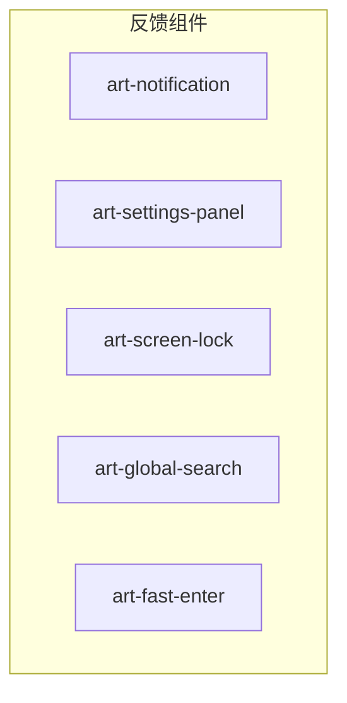
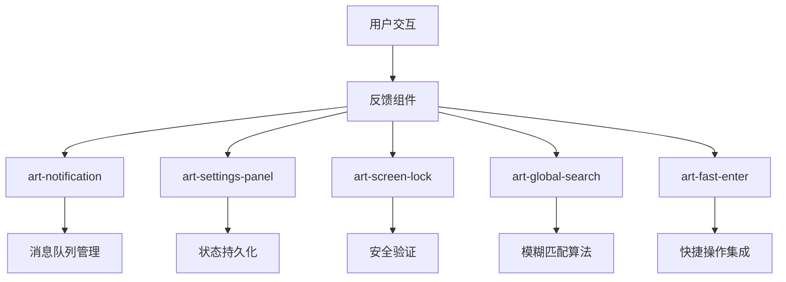
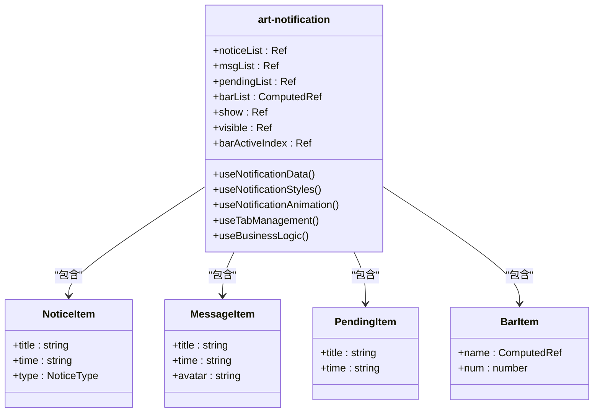
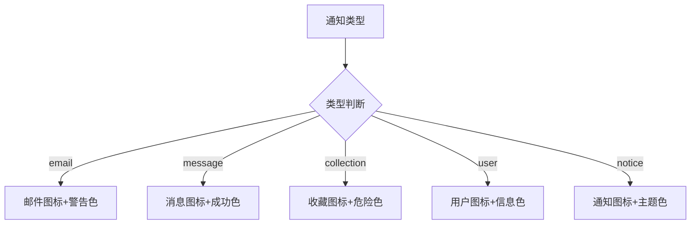
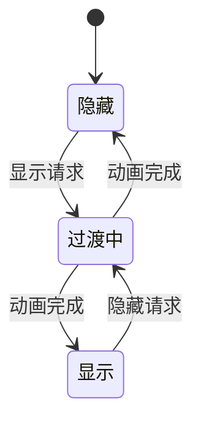
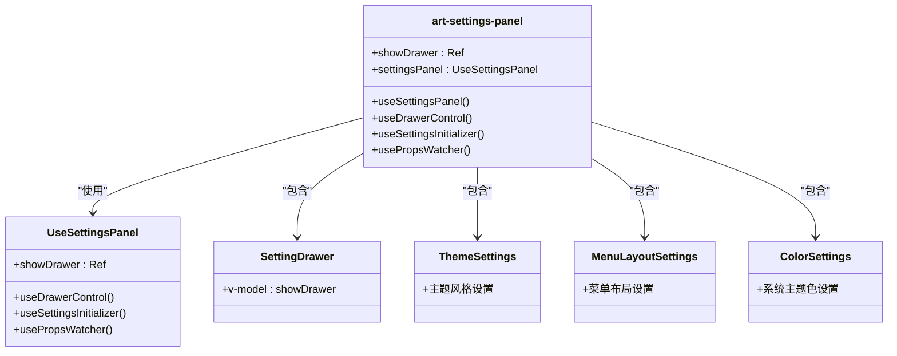
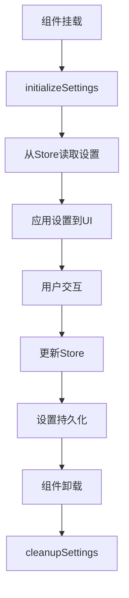
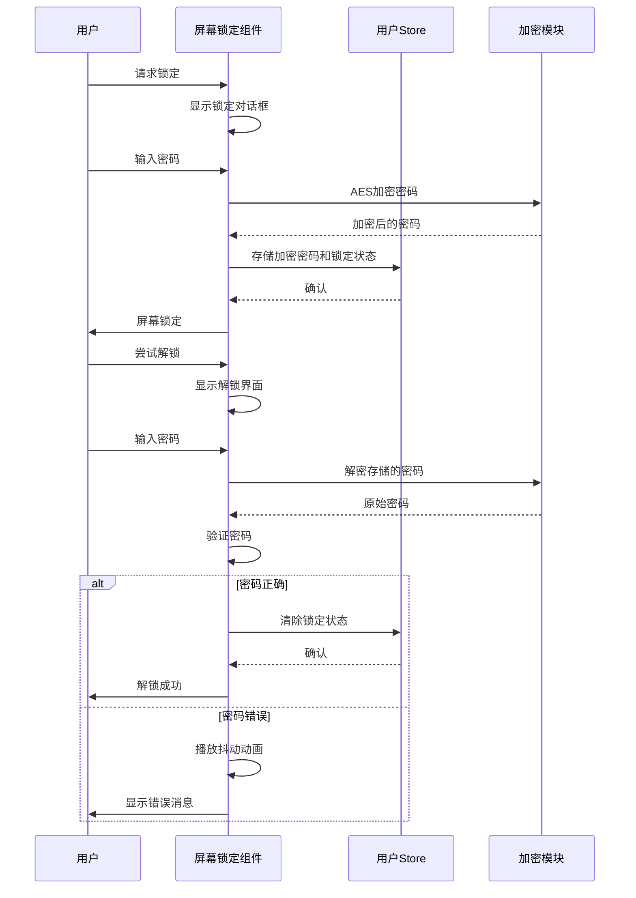
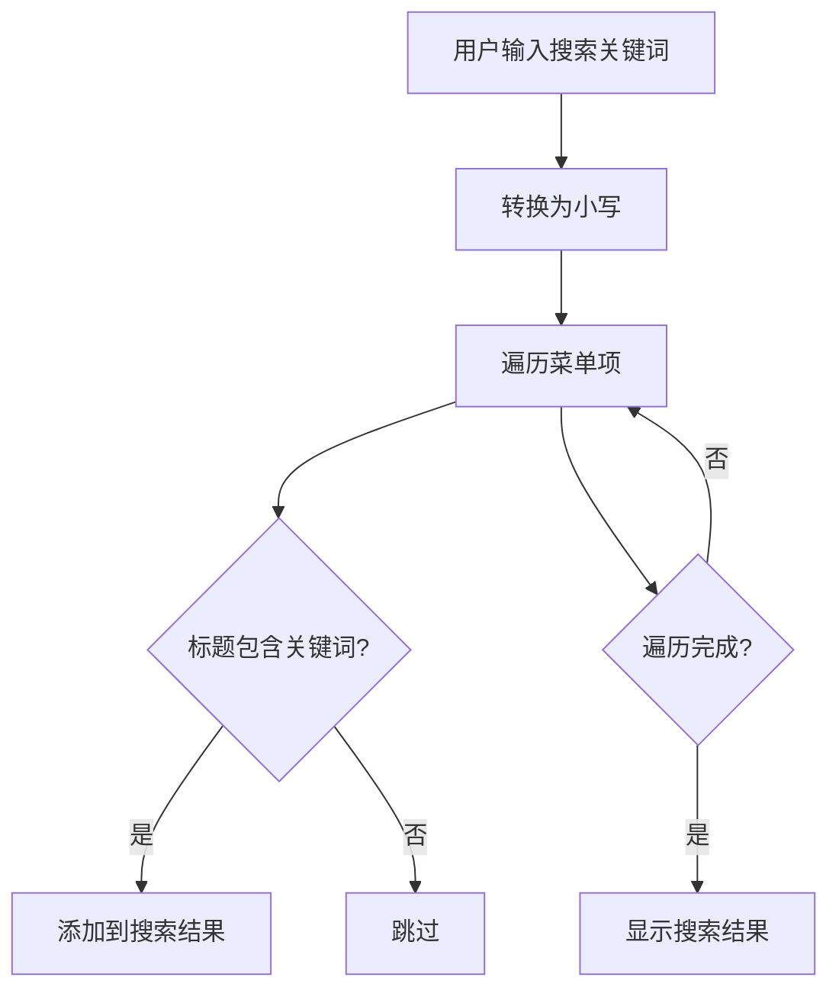
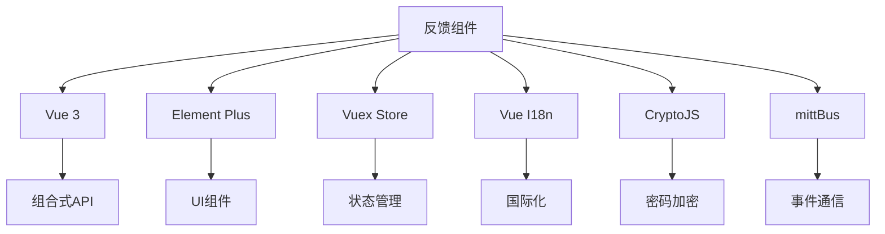

# 反馈组件

<cite>
**本文档引用的文件**  
- [art-notification/index.vue](file://src/components/core/layouts/art-notification/index.vue)
- [art-settings-panel/index.vue](file://src/components/core/layouts/art-settings-panel/index.vue)
- [art-settings-panel/composables/useSettingsPanel.ts](file://src/components/core/layouts/art-settings-panel/composables/useSettingsPanel.ts)
- [art-screen-lock/index.vue](file://src/components/core/layouts/art-screen-lock/index.vue)
- [art-global-search/index.vue](file://src/components/core/layouts/art-global-search/index.vue)
- [art-fast-enter/index.vue](file://src/components/core/layouts/art-fast-enter/index.vue)
- [config/modules/fastEnter.ts](file://src/config/modules/fastEnter.ts)
</cite>

## 目录
1. [简介](#简介)
2. [项目结构](#项目结构)
3. [核心组件](#核心组件)
4. [架构概述](#架构概述)
5. [详细组件分析](#详细组件分析)
6. [依赖分析](#依赖分析)
7. [性能考虑](#性能考虑)
8. [故障排除指南](#故障排除指南)
9. [结论](#结论)

## 简介
Art Design Pro反馈组件为用户提供了一套完整的交互反馈系统，包括通知、设置面板、屏幕锁定、全局搜索和快速入口等核心功能。这些组件通过直观的用户界面和流畅的交互体验，显著提升了应用的可用性和用户体验。本文档将全面介绍这些反馈组件的设计原理、实现细节和使用方法。

## 项目结构
Art Design Pro的反馈组件主要位于`src/components/core/layouts/`目录下，每个组件都有独立的文件夹结构，包含主组件文件和相关的子组件或组合式函数。这种模块化的组织方式使得组件易于维护和扩展。



**Diagram sources**
- [art-notification/index.vue](file://src/components/core/layouts/art-notification/index.vue)
- [art-settings-panel/index.vue](file://src/components/core/layouts/art-settings-panel/index.vue)
- [art-screen-lock/index.vue](file://src/components/core/layouts/art-screen-lock/index.vue)
- [art-global-search/index.vue](file://src/components/core/layouts/art-global-search/index.vue)
- [art-fast-enter/index.vue](file://src/components/core/layouts/art-fast-enter/index.vue)

**Section sources**
- [art-notification/index.vue](file://src/components/core/layouts/art-notification/index.vue)
- [art-settings-panel/index.vue](file://src/components/core/layouts/art-settings-panel/index.vue)

## 核心组件
Art Design Pro的反馈组件系统由五个核心组件构成：通知组件(art-notification)、设置面板(art-settings-panel)、屏幕锁定(art-screen-lock)、全局搜索(art-global-search)和快速入口(art-fast-enter)。这些组件共同为用户提供了一个完整、一致的交互反馈体验。

**Section sources**
- [art-notification/index.vue](file://src/components/core/layouts/art-notification/index.vue)
- [art-settings-panel/index.vue](file://src/components/core/layouts/art-settings-panel/index.vue)
- [art-screen-lock/index.vue](file://src/components/core/layouts/art-screen-lock/index.vue)
- [art-global-search/index.vue](file://src/components/core/layouts/art-global-search/index.vue)
- [art-fast-enter/index.vue](file://src/components/core/layouts/art-fast-enter/index.vue)

## 架构概述
Art Design Pro反馈组件采用组合式API和模块化设计，每个组件都由多个可复用的部分组成。组件之间通过事件总线(mittBus)进行通信，确保了松耦合和高内聚的设计原则。



**Diagram sources**
- [art-notification/index.vue](file://src/components/core/layouts/art-notification/index.vue)
- [art-settings-panel/index.vue](file://src/components/core/layouts/art-settings-panel/index.vue)
- [art-screen-lock/index.vue](file://src/components/core/layouts/art-screen-lock/index.vue)
- [art-global-search/index.vue](file://src/components/core/layouts/art-global-search/index.vue)
- [art-fast-enter/index.vue](file://src/components/core/layouts/art-fast-enter/index.vue)

## 详细组件分析

### art-notification 分析
art-notification组件提供了一个功能丰富的通知中心，支持多种类型的通知管理。

#### 消息队列管理
art-notification组件实现了基于Vue响应式系统的消息队列管理。通知数据存储在ref响应式变量中，当数据发生变化时，UI会自动更新。组件支持三种类型的通知：通知、消息和待办事项，每种类型都有独立的数据列表。



**Diagram sources**
- [art-notification/index.vue](file://src/components/core/layouts/art-notification/index.vue#L119-L158)

#### 类型区分与样式管理
组件通过NoticeType枚举类型区分不同的通知类型，并为每种类型定义了相应的图标和样式。样式管理通过noticeStyleMap对象实现，该对象将通知类型映射到对应的图标和CSS类。



**Diagram sources**
- [art-notification/index.vue](file://src/components/core/layouts/art-notification/index.vue#L272-L293)

#### 动画效果实现
art-notification组件使用CSS transform和opacity属性实现平滑的显示/隐藏动画。动画通过show和visible两个响应式变量控制，show变量控制transform和opacity，visible变量控制元素的显示状态。



**Diagram sources**
- [art-notification/index.vue](file://src/components/core/layouts/art-notification/index.vue#L310-L328)

**Section sources**
- [art-notification/index.vue](file://src/components/core/layouts/art-notification/index.vue#L1-L457)

### art-settings-panel 分析
art-settings-panel组件提供了一个功能强大的设置面板，支持主题、布局、颜色等多种配置选项。

#### 配置项组织
设置面板采用模块化设计，将不同的设置项组织成独立的子组件，如ThemeSettings、MenuLayoutSettings、ColorSettings等。这种设计使得代码结构清晰，易于维护和扩展。



**Diagram sources**
- [art-settings-panel/index.vue](file://src/components/core/layouts/art-settings-panel/index.vue#L28-L39)
- [art-settings-panel/composables/useSettingsPanel.ts](file://src/components/core/layouts/art-settings-panel/composables/useSettingsPanel.ts)

#### 状态持久化
设置面板的状态通过Vuex store进行持久化管理。组件使用useSettingsPanel组合式函数来管理设置状态，并在组件挂载时初始化设置，在组件卸载时清理设置。



**Diagram sources**
- [art-settings-panel/index.vue](file://src/components/core/layouts/art-settings-panel/index.vue#L61-L67)

#### 实时预览功能
设置面板支持实时预览功能，用户在调整设置时可以立即看到效果。这通过监听设置变化并动态更新CSS变量实现。

**Section sources**
- [art-settings-panel/index.vue](file://src/components/core/layouts/art-settings-panel/index.vue#L1-L73)
- [art-settings-panel/composables/useSettingsPanel.ts](file://src/components/core/layouts/art-settings-panel/composables/useSettingsPanel.ts)

### art-screen-lock 分析
art-screen-lock组件提供了一个安全的屏幕锁定机制，保护用户数据不被未授权访问。

#### 安全验证机制
屏幕锁定组件实现了多层次的安全验证机制，包括密码加密存储、开发者工具检测和键盘快捷键禁用。



**Diagram sources**
- [art-screen-lock/index.vue](file://src/components/core/layouts/art-screen-lock/index.vue#L323-L333)

**Section sources**
- [art-screen-lock/index.vue](file://src/components/core/layouts/art-screen-lock/index.vue#L1-L518)

### art-global-search 分析
art-global-search组件提供了一个高效的全局搜索功能，支持模糊匹配和快捷导航。

#### 模糊匹配算法
全局搜索组件实现了基于字符串包含的模糊匹配算法。算法通过将搜索关键词转换为小写，然后检查菜单项标题是否包含该关键词来实现模糊匹配。



**Diagram sources**
- [art-global-search/index.vue](file://src/components/core/layouts/art-global-search/index.vue#L178-L198)

#### 快捷导航功能
组件支持键盘快捷键导航，用户可以使用方向键在搜索结果间移动，按Enter键选择，按Esc键关闭搜索框。

**Section sources**
- [art-global-search/index.vue](file://src/components/core/layouts/art-global-search/index.vue#L1-L427)

### art-fast-enter 分析
art-fast-enter组件提供了一个便捷的快速入口系统，允许用户快速访问常用功能。

#### 快捷操作集成
快速入口组件从配置文件中读取启用的应用和快速链接，动态生成入口列表。用户点击入口时，组件会根据配置进行内部路由跳转或外部链接打开。

```mermaid
flowchart TD
A[用户悬停] --> B[显示快速入口面板]
B --> C[读取配置]
C --> D[生成应用列表]
D --> E[用户点击应用]
E --> F{是内部路由?}
F --> |是| G[router.push()]
F --> |否| H[window.open()]
G --> I[隐藏面板]
H --> I
```

**Diagram sources**
- [art-fast-enter/index.vue](file://src/components/core/layouts/art-fast-enter/index.vue#L74-L113)

**Section sources**
- [art-fast-enter/index.vue](file://src/components/core/layouts/art-fast-enter/index.vue#L1-L114)
- [config/modules/fastEnter.ts](file://src/config/modules/fastEnter.ts)

## 依赖分析
Art Design Pro反馈组件系统依赖于多个核心模块和第三方库，这些依赖关系确保了组件的功能完整性和性能优化。



**Diagram sources**
- [art-notification/index.vue](file://src/components/core/layouts/art-notification/index.vue#L106-L107)
- [art-settings-panel/index.vue](file://src/components/core/layouts/art-settings-panel/index.vue#L28)
- [art-screen-lock/index.vue](file://src/components/core/layouts/art-screen-lock/index.vue#L111-L114)
- [art-global-search/index.vue](file://src/components/core/layouts/art-global-search/index.vue#L97-L101)
- [art-fast-enter/index.vue](file://src/components/core/layouts/art-fast-enter/index.vue#L65)

**Section sources**
- [art-notification/index.vue](file://src/components/core/layouts/art-notification/index.vue)
- [art-settings-panel/index.vue](file://src/components/core/layouts/art-settings-panel/index.vue)
- [art-screen-lock/index.vue](file://src/components/core/layouts/art-screen-lock/index.vue)
- [art-global-search/index.vue](file://src/components/core/layouts/art-global-search/index.vue)
- [art-fast-enter/index.vue](file://src/components/core/layouts/art-fast-enter/index.vue)

## 性能考虑
Art Design Pro反馈组件在设计时充分考虑了性能优化，采用了多种策略来确保流畅的用户体验。

- **响应式系统优化**：利用Vue 3的Proxy响应式系统，确保只有相关组件在数据变化时重新渲染。
- **懒加载**：设置面板的各个设置项组件在需要时才加载，减少初始加载时间。
- **事件委托**：使用事件总线(mittBus)进行跨组件通信，避免了深层嵌套的事件传递。
- **内存管理**：在组件卸载时清理事件监听器和定时器，防止内存泄漏。
- **动画优化**：使用CSS transform和opacity进行动画，利用GPU加速提升性能。

## 故障排除指南
在使用Art Design Pro反馈组件时，可能会遇到一些常见问题。以下是一些调试技巧和解决方案：

- **通知组件不显示**：检查`value`属性是否正确绑定，确保触发显示的条件满足。
- **设置面板无法保存**：确认Vuex store的持久化配置正确，检查浏览器本地存储是否被禁用。
- **屏幕锁定无法解锁**：验证密码加密密钥(VITE_LOCK_ENCRYPT_KEY)是否正确配置。
- **全局搜索无结果**：检查菜单项的meta.title是否正确设置，确保搜索关键词与标题匹配。
- **快速入口不显示**：确认fastEnter配置文件中的应用和链接是否设置为启用状态。

**Section sources**
- [art-notification/index.vue](file://src/components/core/layouts/art-notification/index.vue)
- [art-settings-panel/index.vue](file://src/components/core/layouts/art-settings-panel/index.vue)
- [art-screen-lock/index.vue](file://src/components/core/layouts/art-screen-lock/index.vue)
- [art-global-search/index.vue](file://src/components/core/layouts/art-global-search/index.vue)
- [art-fast-enter/index.vue](file://src/components/core/layouts/art-fast-enter/index.vue)

## 结论
Art Design Pro的反馈组件系统通过精心设计的架构和实现，为用户提供了一套完整、高效、安全的交互反馈解决方案。这些组件不仅功能强大，而且具有良好的可扩展性和可维护性，能够满足各种复杂应用场景的需求。通过合理使用这些组件，开发者可以显著提升应用的用户体验和专业度。