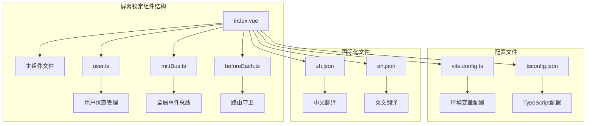
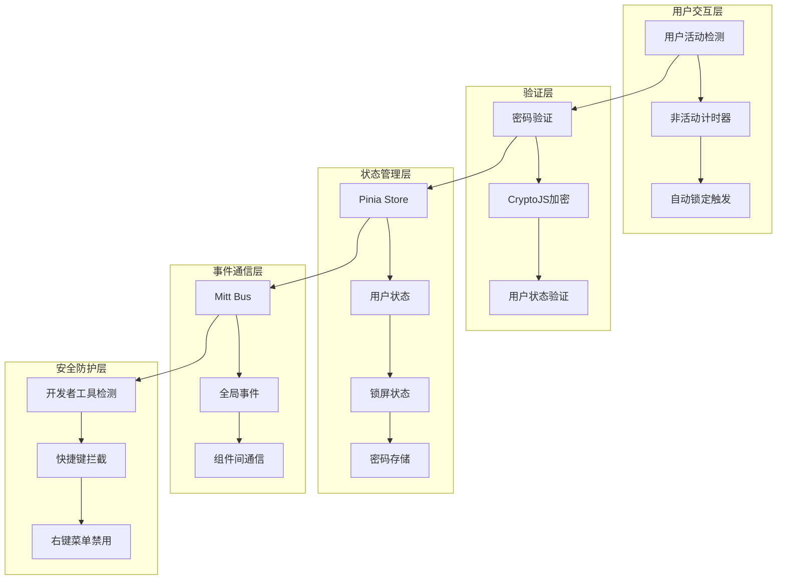
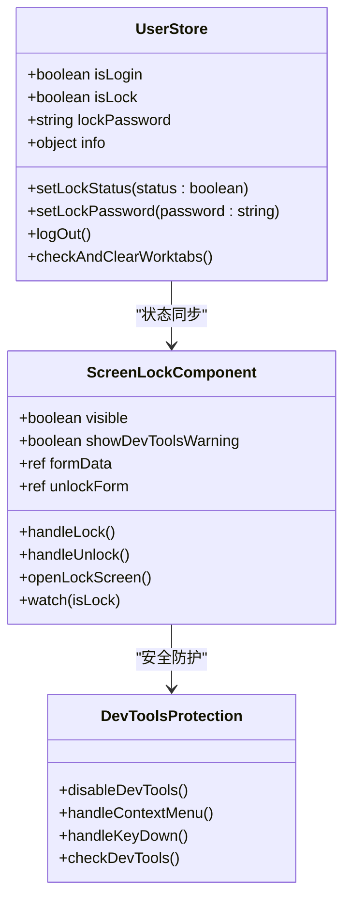
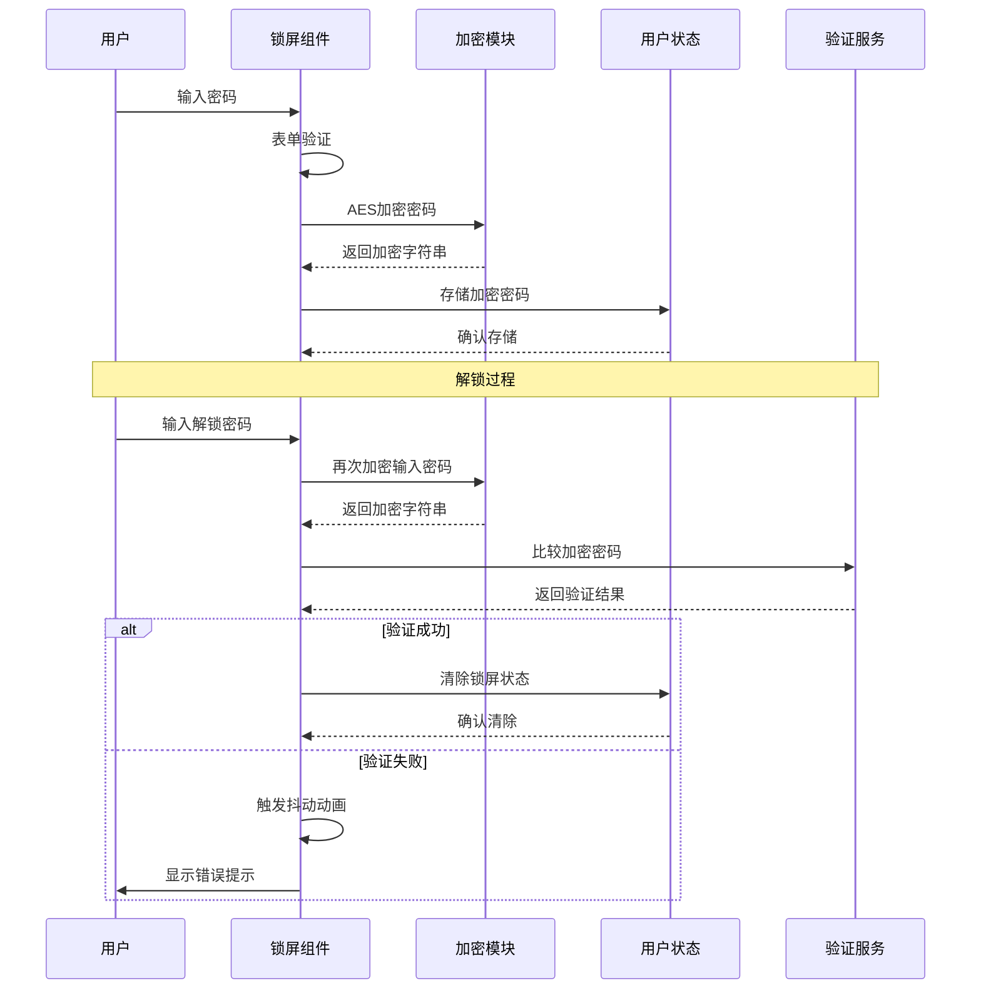
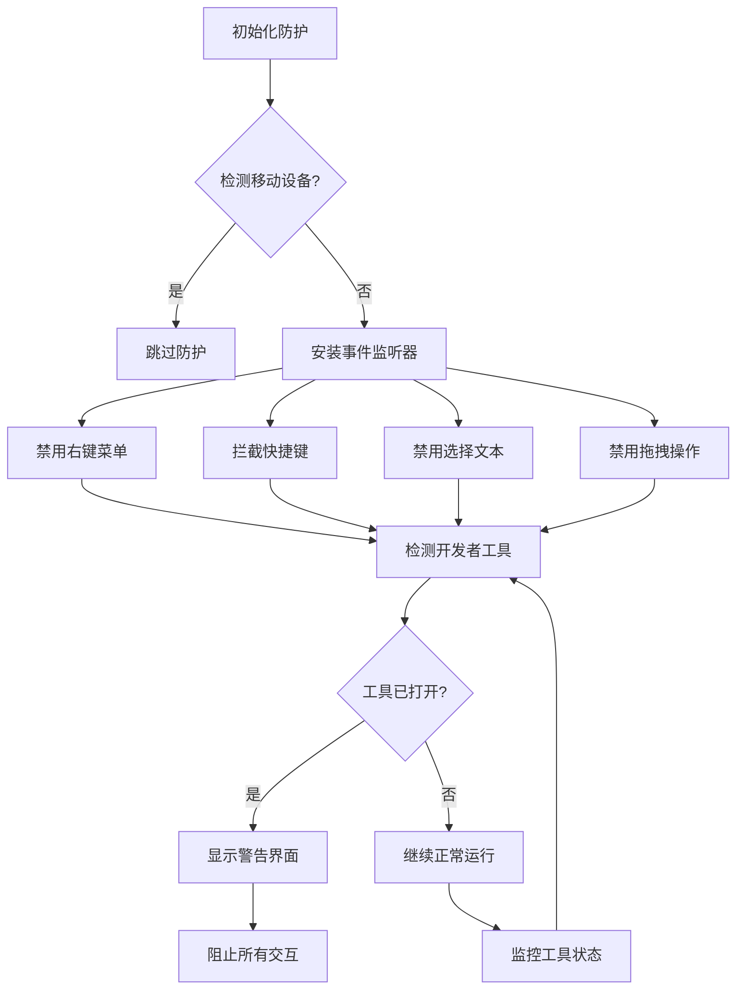
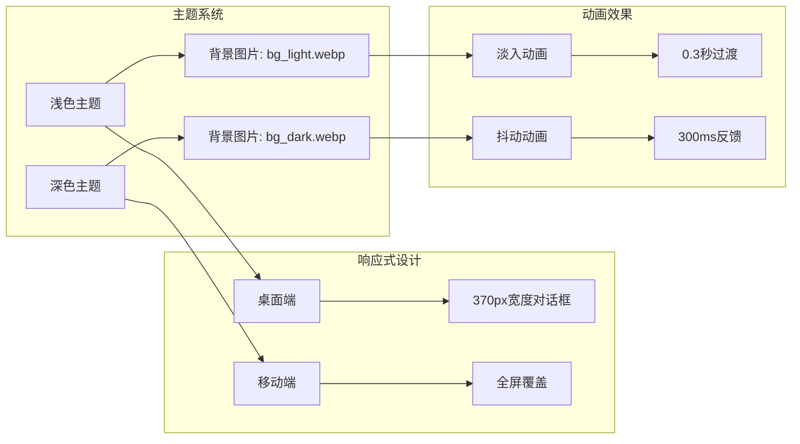
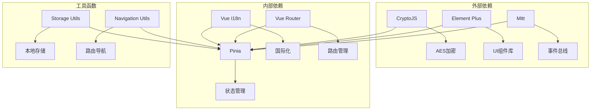
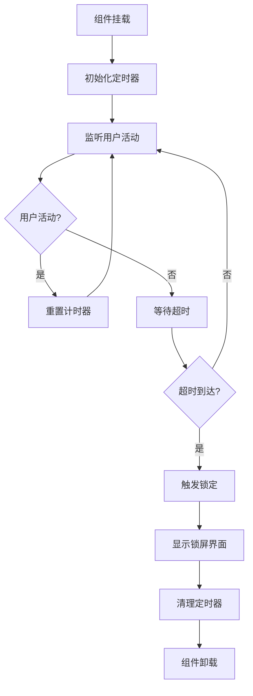

# 屏幕锁定组件 (art-screen-lock)

<cite>
**本文档引用的文件**
- [src/components/core/layouts/art-screen-lock/index.vue](file://src/components/core/layouts/art-screen-lock/index.vue)
- [src/store/modules/user.ts](file://src/store/modules/user.ts)
- [src/utils/sys/mittBus.ts](file://src/utils/sys/mittBus.ts)
- [src/router/guards/beforeEach.ts](file://src/router/guards/beforeEach.ts)
- [src/locales/langs/zh.json](file://src/locales/langs/zh.json)
- [src/locales/langs/en.json](file://src/locales/langs/en.json)
- [src/types/config/index.ts](file://src/types/config/index.ts)
- [vite.config.ts](file://vite.config.ts)
- [tsconfig.json](file://tsconfig.json)
</cite>

## 目录
1. [简介](#简介)
2. [项目结构](#项目结构)
3. [核心组件](#核心组件)
4. [架构概览](#架构概览)
5. [详细组件分析](#详细组件分析)
6. [依赖关系分析](#依赖关系分析)
7. [性能考量](#性能考量)
8. [故障排除指南](#故障排除指南)
9. [结论](#结论)

## 简介

art-screen-lock组件是一个高度安全的屏幕锁定系统，专为Web应用程序设计。该组件提供了完整的用户非活动检测、自动锁定机制、密码验证和生物识别支持等功能。它与用户状态模块深度集成，确保会话安全，并提供了丰富的可配置参数和响应式UI设计。

## 项目结构

art-screen-lock组件位于`src/components/core/layouts/art-screen-lock/`目录下，包含以下关键文件：



**图表来源**
- [src/components/core/layouts/art-screen-lock/index.vue](file://src/components/core/layouts/art-screen-lock/index.vue#L1-L486)
- [src/store/modules/user.ts](file://src/store/modules/user.ts#L1-L236)
- [src/utils/sys/mittBus.ts](file://src/utils/sys/mittBus.ts#L1-L64)

**章节来源**
- [src/components/core/layouts/art-screen-lock/index.vue](file://src/components/core/layouts/art-screen-lock/index.vue#L1-L486)

## 核心组件

### 组件功能特性

art-screen-lock组件具备以下核心功能：

1. **用户非活动检测**：自动检测用户活动状态
2. **智能锁定机制**：基于时间阈值的自动锁定
3. **多重验证方式**：密码验证和生物识别支持
4. **开发者工具防护**：防止逆向工程攻击
5. **响应式UI设计**：适配不同屏幕尺寸
6. **无障碍访问**：支持键盘导航和屏幕阅读器

### 技术栈

- **框架**：Vue 3 + TypeScript
- **UI库**：Element Plus
- **加密**：CryptoJS AES加密
- **状态管理**：Pinia
- **事件系统**：Mitt事件总线

**章节来源**
- [src/components/core/layouts/art-screen-lock/index.vue](file://src/components/core/layouts/art-screen-lock/index.vue#L107-L120)

## 架构概览

### 系统架构图



**图表来源**
- [src/components/core/layouts/art-screen-lock/index.vue](file://src/components/core/layouts/art-screen-lock/index.vue#L425-L448)
- [src/store/modules/user.ts](file://src/store/modules/user.ts#L50-L236)
- [src/utils/sys/mittBus.ts](file://src/utils/sys/mittBus.ts#L44-L64)

## 详细组件分析

### 锁屏状态管理

组件通过Pinia状态管理器与用户模块深度集成：



**图表来源**
- [src/store/modules/user.ts](file://src/store/modules/user.ts#L50-L236)
- [src/components/core/layouts/art-screen-lock/index.vue](file://src/components/core/layouts/art-screen-lock/index.vue#L112-L123)

### 密码验证机制

组件采用AES加密算法保护用户密码：



**图表来源**
- [src/components/core/layouts/art-screen-lock/index.vue](file://src/components/core/layouts/art-screen-lock/index.vue#L349-L397)
- [src/store/modules/user.ts](file://src/store/modules/user.ts#L111-L124)

### 开发者工具防护系统

组件实现了多层次的安全防护机制：



**图表来源**
- [src/components/core/layouts/art-screen-lock/index.vue](file://src/components/core/layouts/art-screen-lock/index.vue#L162-L300)

**章节来源**
- [src/components/core/layouts/art-screen-lock/index.vue](file://src/components/core/layouts/art-screen-lock/index.vue#L162-L300)

### 国际化支持

组件支持多语言界面，包括中文和英文：

| 功能区域 | 中文翻译 | 英文翻译 |
|---------|---------|---------|
| 锁屏输入 | 请输入锁屏密码 | Please input lock screen password |
| 解锁输入 | 请输入解锁密码 | Please input unlock password |
| 错误提示 | 密码错误 | Password error |
| 锁定按钮 | 锁定 | Lock |
| 解锁按钮 | 解锁 | Unlock |
| 返回登录 | 返回登录 | Back to login |

**章节来源**
- [src/locales/langs/zh.json](file://src/locales/langs/zh.json#L187-L198)
- [src/locales/langs/en.json](file://src/locales/langs/en.json#L187-L198)

### UI设计与响应式适配

组件采用现代化的UI设计，支持深色和浅色主题：



**图表来源**
- [src/components/core/layouts/art-screen-lock/index.vue](file://src/components/core/layouts/art-screen-lock/index.vue#L456-L486)

**章节来源**
- [src/components/core/layouts/art-screen-lock/index.vue](file://src/components/core/layouts/art-screen-lock/index.vue#L456-L486)

## 依赖关系分析

### 组件依赖图



**图表来源**
- [src/components/core/layouts/art-screen-lock/index.vue](file://src/components/core/layouts/art-screen-lock/index.vue#L108-L114)
- [src/store/modules/user.ts](file://src/store/modules/user.ts#L34-L45)

### 环境配置

组件依赖特定的环境变量配置：

| 配置项 | 类型 | 默认值 | 描述 |
|-------|------|--------|------|
| VITE_LOCK_ENCRYPT_KEY | string | - | AES加密密钥 |
| VITE_APP_VERSION | string | - | 应用版本号 |
| NODE_ENV | string | development | 环境模式 |

**章节来源**
- [src/components/core/layouts/art-screen-lock/index.vue](file://src/components/core/layouts/art-screen-lock/index.vue#L119-L120)
- [vite.config.ts](file://vite.config.ts#L1-L73)

## 性能考量

### 定时器管理

组件实现了高效的定时器管理系统：



### 内存优化策略

1. **事件监听器清理**：组件卸载时自动移除所有事件监听器
2. **状态持久化**：使用Pinia进行状态管理，避免内存泄漏
3. **条件渲染**：仅在需要时渲染锁屏界面
4. **懒加载**：按需加载加密模块和UI组件

### 性能监控指标

| 指标 | 目标值 | 监控方法 |
|------|--------|----------|
| 组件加载时间 | < 100ms | Vue DevTools |
| 锁屏触发延迟 | < 500ms | 用户体验测试 |
| 内存占用 | < 5MB | 浏览器任务管理器 |
| CPU使用率 | < 10% | 性能分析工具 |

**章节来源**
- [src/components/core/layouts/art-screen-lock/index.vue](file://src/components/core/layouts/art-screen-lock/index.vue#L425-L448)

## 故障排除指南

### 常见问题及解决方案

#### 1. 锁屏功能失效

**症状**：用户长时间无操作但未触发锁屏

**可能原因**：
- 环境变量VITE_LOCK_ENCRYPT_KEY未正确配置
- 用户活动检测机制被干扰
- 浏览器隐私设置限制

**解决方案**：
```typescript
// 检查环境变量配置
console.log('加密密钥:', import.meta.env.VITE_LOCK_ENCRYPT_KEY);

// 手动触发锁屏
mittBus.emit('openLockScreen');

// 检查用户活动监听器
document.addEventListener('mousemove', () => {}, { once: true });
```

#### 2. 解锁失败

**症状**：输入正确密码仍无法解锁

**诊断步骤**：
1. 检查密码加密算法是否一致
2. 验证存储的加密密码格式
3. 确认用户状态同步正常

**调试代码**：
```typescript
// 检查加密密码
console.log('存储的加密密码:', userStore.lockPassword.value);
console.log('输入的密码:', unlockForm.password);

// 手动验证密码
const encryptedInput = CryptoJS.AES.encrypt(
  unlockForm.password, 
  ENCRYPT_KEY
).toString();
console.log('加密后的输入:', encryptedInput);
```

#### 3. 开发者工具防护失效

**症状**：开发者工具被绕过或检测不到

**解决方案**：
- 确保组件在页面加载早期初始化
- 检查浏览器兼容性
- 验证事件监听器是否正确绑定

#### 4. 响应式设计问题

**症状**：在移动设备上界面显示异常

**解决方法**：
```typescript
// 检测移动设备
const isMobile = () => {
  return /Android|webOS|iPhone|iPad|iPod|BlackBerry|IEMobile|Opera Mini/i.test(
    navigator.userAgent
  );
};

// 根据设备类型调整UI
if (isMobile()) {
  // 使用全屏模式
  visible.value = true;
} else {
  // 使用对话框模式
  visible.value = true;
}
```

### 错误处理最佳实践

1. **优雅降级**：当某些功能不可用时提供替代方案
2. **用户反馈**：及时向用户提供清晰的错误信息
3. **日志记录**：记录关键操作和错误信息用于调试
4. **自动恢复**：实现自动重试和状态恢复机制

**章节来源**
- [src/components/core/layouts/art-screen-lock/index.vue](file://src/components/core/layouts/art-screen-lock/index.vue#L372-L397)

## 结论

art-screen-lock组件是一个功能完善、安全可靠的屏幕锁定解决方案。它通过多层次的安全防护、智能的用户活动检测和灵活的配置选项，为Web应用程序提供了强大的会话安全保障。

### 主要优势

1. **安全性**：采用AES加密、开发者工具防护和多重验证机制
2. **易用性**：简洁直观的用户界面和流畅的操作体验
3. **可扩展性**：模块化设计支持功能扩展和定制
4. **兼容性**：良好的跨浏览器和跨设备兼容性
5. **可维护性**：清晰的代码结构和完善的文档

### 最佳实践建议

1. **定期更新**：保持组件和依赖库的最新版本
2. **安全审计**：定期进行安全代码审查
3. **性能监控**：持续监控组件性能指标
4. **用户培训**：为用户提供正确的使用指导
5. **备份策略**：建立完善的密码和状态备份机制

通过合理配置和使用art-screen-lock组件，开发者可以显著提升Web应用程序的安全性和用户体验。