# 快速入口组件 (art-fast-enter)

<cite>
**本文档中引用的文件**
- [src/components/core/layouts/art-fast-enter/index.vue](file://src/components/core/layouts/art-fast-enter/index.vue)
- [src/hooks/core/useFastEnter.ts](file://src/hooks/core/useFastEnter.ts)
- [src/config/modules/fastEnter.ts](file://src/config/modules/fastEnter.ts)
- [src/types/config/index.ts](file://src/types/config/index.ts)
- [src/config/modules/headerBar.ts](file://src/config/modules/headerBar.ts)
- [src/hooks/core/useHeaderBar.ts](file://src/hooks/core/useHeaderBar.ts)
- [src/assets/styles/core/app.scss](file://src/assets/styles/core/app.scss)
- [src/store/modules/user.ts](file://src/store/modules/user.ts)
</cite>

## 目录
1. [简介](#简介)
2. [项目结构](#项目结构)
3. [核心组件](#核心组件)
4. [架构概览](#架构概览)
5. [详细组件分析](#详细组件分析)
6. [配置系统](#配置系统)
7. [交互设计](#交互设计)
8. [权限管理](#权限管理)
9. [性能优化](#性能优化)
10. [故障排除](#故障排除)
11. [总结](#总结)

## 简介

art-fast-enter 是一个智能的快速入口组件，为用户提供常用功能的快捷访问入口。该组件采用弹出式设计，支持鼠标悬停展开，提供应用列表和快速链接的双重访问方式，是现代Web应用中提升用户体验的重要功能模块。

### 主要特性

- **智能弹出设计**：基于鼠标悬停触发的弹出式界面
- **双列布局**：左侧应用列表，右侧快速链接
- **响应式配置**：支持动态启用/禁用和自定义排序
- **权限控制**：基于角色的访问权限管理
- **性能优化**：懒加载图标，减少不必要的重渲染
- **一致性体验**：与全局布局无缝集成

## 项目结构

art-fast-enter 组件在项目中的组织结构如下：

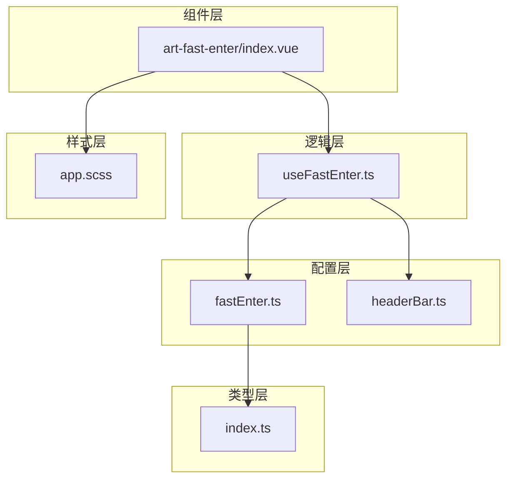

**图表来源**
- [src/components/core/layouts/art-fast-enter/index.vue](file://src/components/core/layouts/art-fast-enter/index.vue#L1-L114)
- [src/hooks/core/useFastEnter.ts](file://src/hooks/core/useFastEnter.ts#L1-L56)
- [src/config/modules/fastEnter.ts](file://src/config/modules/fastEnter.ts#L1-L128)

## 核心组件

### 组件架构

art-fast-enter 组件采用组合式API设计，主要由以下部分组成：

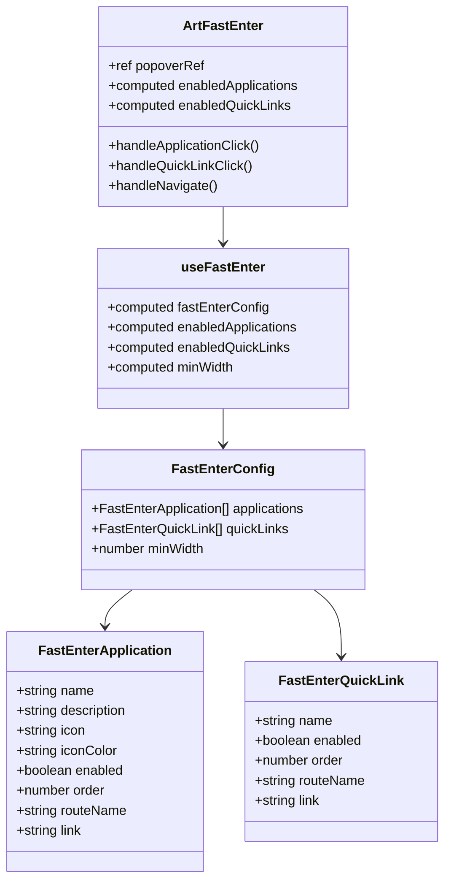

**图表来源**
- [src/components/core/layouts/art-fast-enter/index.vue](file://src/components/core/layouts/art-fast-enter/index.vue#L65-L114)
- [src/hooks/core/useFastEnter.ts](file://src/hooks/core/useFastEnter.ts#L22-L55)
- [src/types/config/index.ts](file://src/types/config/index.ts#L90-L125)

**章节来源**
- [src/components/core/layouts/art-fast-enter/index.vue](file://src/components/core/layouts/art-fast-enter/index.vue#L1-L114)
- [src/hooks/core/useFastEnter.ts](file://src/hooks/core/useFastEnter.ts#L1-L56)

## 架构概览

### 整体架构设计

art-fast-enter 组件遵循Vue 3的组合式API设计模式，实现了清晰的职责分离：

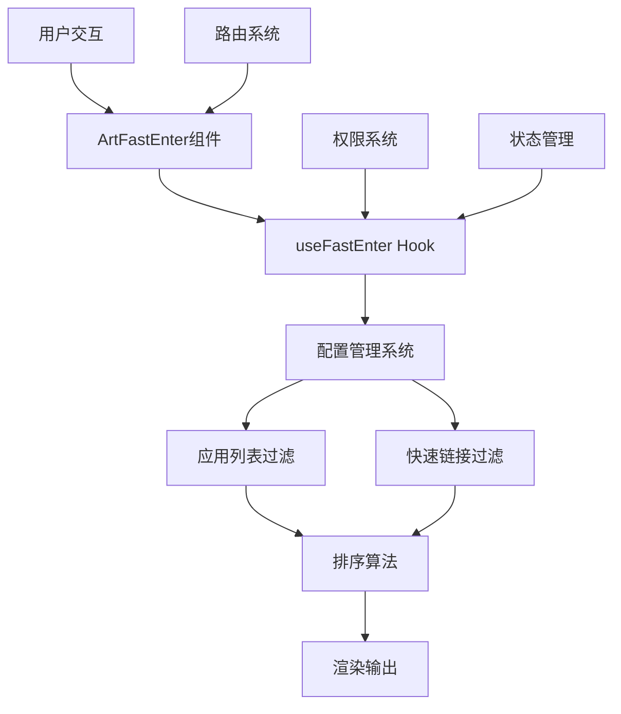

**图表来源**
- [src/components/core/layouts/art-fast-enter/index.vue](file://src/components/core/layouts/art-fast-enter/index.vue#L70-L114)
- [src/hooks/core/useFastEnter.ts](file://src/hooks/core/useFastEnter.ts#L22-L55)

### 数据流架构

组件的数据流向遵循单向数据流原则：

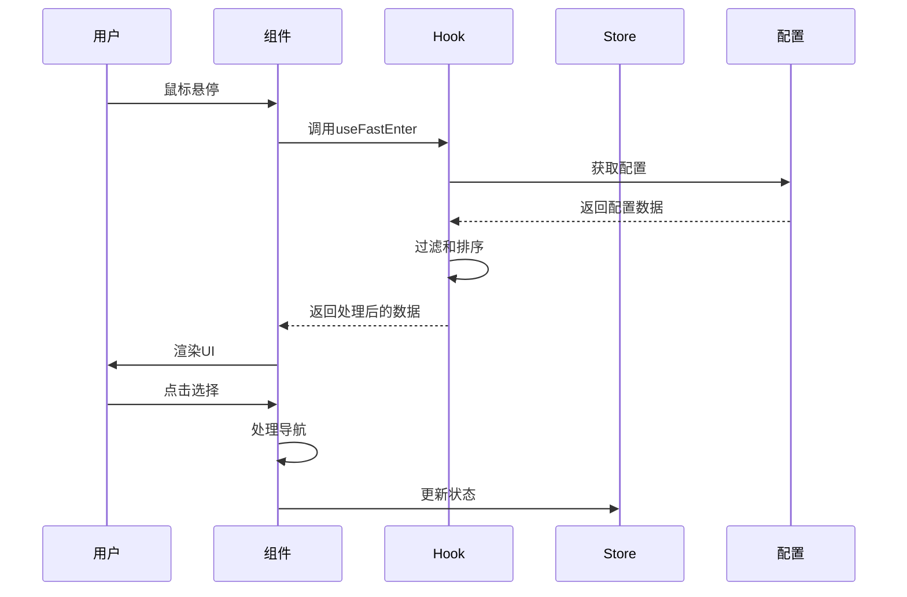

**图表来源**
- [src/components/core/layouts/art-fast-enter/index.vue](file://src/components/core/layouts/art-fast-enter/index.vue#L74-L114)
- [src/hooks/core/useFastEnter.ts](file://src/hooks/core/useFastEnter.ts#L24-L55)

## 详细组件分析

### ArtFastEnter 组件实现

#### 核心功能实现

组件的核心功能通过以下机制实现：

1. **弹出式交互**：基于Element Plus的ElPopover组件
2. **双列布局**：使用CSS Grid实现响应式布局
3. **图标渲染**：集成ArtSvgIcon组件
4. **导航处理**：统一的导航处理逻辑

#### 组件生命周期

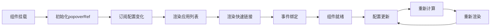

**图表来源**
- [src/components/core/layouts/art-fast-enter/index.vue](file://src/components/core/layouts/art-fast-enter/index.vue#L65-L114)

#### 导航处理机制

组件实现了统一的导航处理机制，支持内部路由和外部链接：

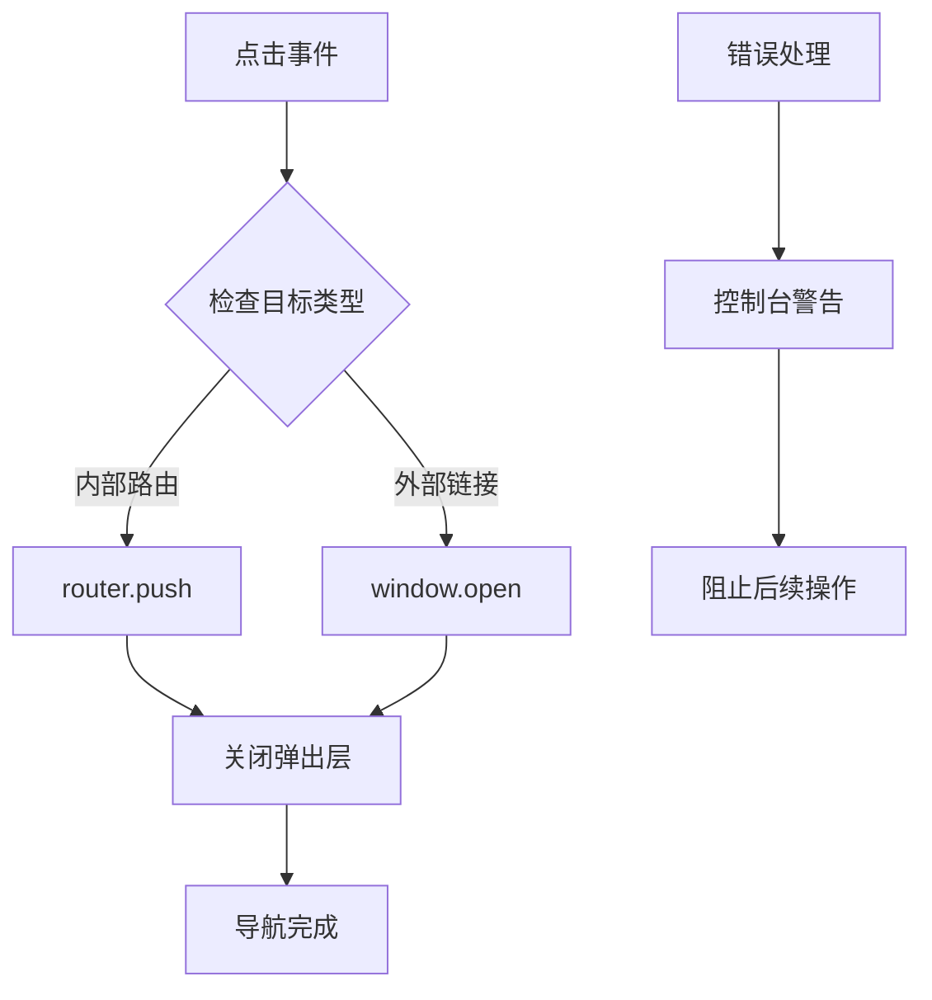

**图表来源**
- [src/components/core/layouts/art-fast-enter/index.vue](file://src/components/core/layouts/art-fast-enter/index.vue#L77-L96)

**章节来源**
- [src/components/core/layouts/art-fast-enter/index.vue](file://src/components/core/layouts/art-fast-enter/index.vue#L1-L114)

### useFastEnter Hook 分析

#### 核心逻辑实现

useFastEnter Hook 提供了快速入口功能的核心逻辑：

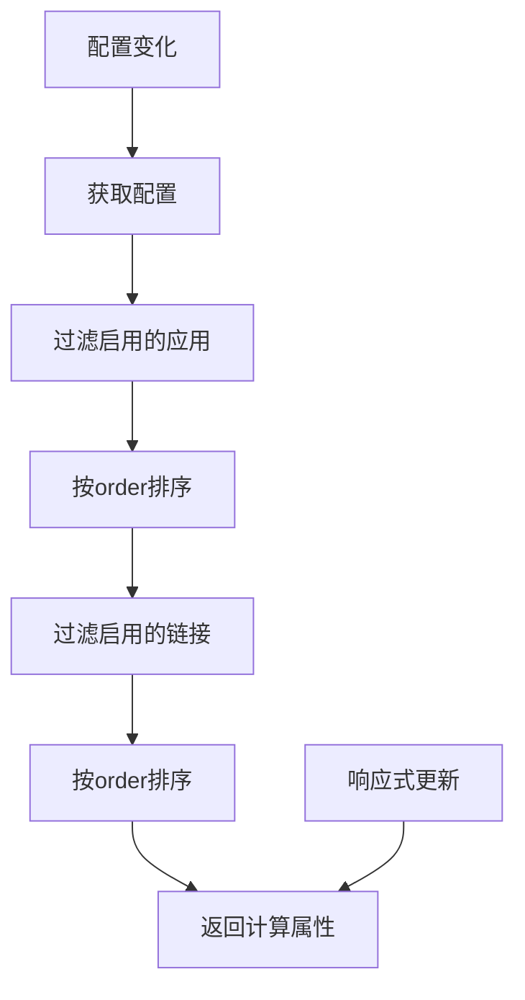

**图表来源**
- [src/hooks/core/useFastEnter.ts](file://src/hooks/core/useFastEnter.ts#L24-L55)

#### 计算属性设计

Hook 中的计算属性设计体现了Vue 3响应式系统的强大能力：

| 属性名 | 类型 | 功能描述 |
|--------|------|----------|
| fastEnterConfig | ComputedRef | 获取完整的快速入口配置 |
| enabledApplications | ComputedRef\<FastEnterApplication[]\> | 获取启用的应用列表并排序 |
| enabledQuickLinks | ComputedRef\<FastEnterQuickLink[]\> | 获取启用的快速链接并排序 |
| minWidth | ComputedRef | 获取最小显示宽度配置 |

**章节来源**
- [src/hooks/core/useFastEnter.ts](file://src/hooks/core/useFastEnter.ts#L1-L56)

## 配置系统

### 配置结构设计

art-fast-enter 的配置系统采用了分层设计，支持灵活的定制：

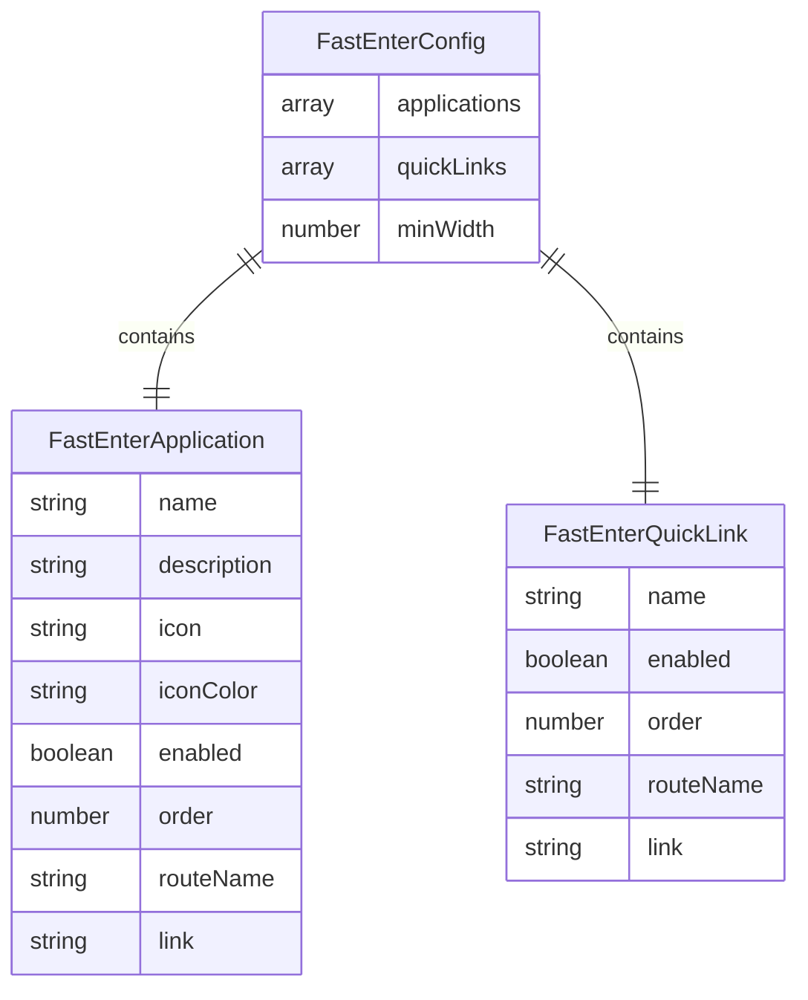

**图表来源**
- [src/types/config/index.ts](file://src/types/config/index.ts#L90-L125)

### 默认配置示例

#### 应用列表配置

| 应用名称 | 描述 | 图标 | 颜色 | 路由 |
|----------|------|------|------|------|
| 工作台 | 系统概览与数据统计 | ri:pie-chart-line | #377dff | Console |
| 分析页 | 数据分析与可视化 | ri:game-line | #ff3b30 | Analysis |
| 礼花效果 | 动画特效展示 | ri:loader-line | #7A7FFF | Fireworks |
| 聊天 | 即时通讯功能 | ri:user-line | #13DEB9 | Chat |
| 官方文档 | 使用指南与开发文档 | ri:bill-line | #ffb100 | WEB_LINKS.DOCS |
| 技术支持 | 技术支持与问题反馈 | ri:user-location-line | #ff6b6b | WEB_LINKS.COMMUNITY |
| 更新日志 | 版本更新与变更记录 | ri:gamepad-line | #38C0FC | ChangeLog |
| 哔哩哔哩 | 技术分享与交流 | ri:bilibili-line | #FB7299 | WEB_LINKS.BILIBILI |

#### 快速链接配置

| 链接名称 | 路由 | 启用状态 |
|----------|------|----------|
| 登录 | Login | true |
| 注册 | Register | true |
| 忘记密码 | ForgetPassword | true |
| 定价 | Pricing | true |
| 个人中心 | UserCenter | true |
| 留言管理 | ArticleComment | true |

**章节来源**
- [src/config/modules/fastEnter.ts](file://src/config/modules/fastEnter.ts#L1-L128)

### 响应式配置管理

配置系统支持运行时动态调整，无需重启应用：

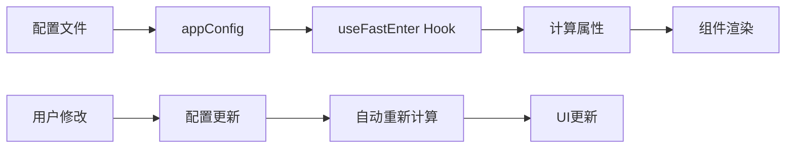

**图表来源**
- [src/hooks/core/useFastEnter.ts](file://src/hooks/core/useFastEnter.ts#L24-L55)

## 交互设计

### 鼠标悬停展开机制

组件采用鼠标悬停触发的弹出式设计，提供了流畅的用户体验：

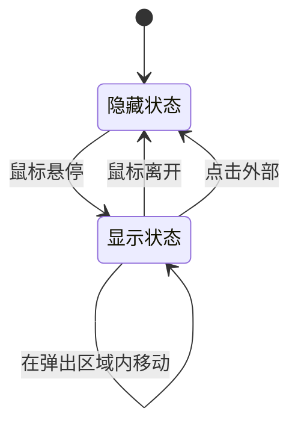

#### 触发机制配置

| 配置项 | 值 | 说明 |
|--------|-----|------|
| trigger | hover | 触发方式为鼠标悬停 |
| placement | bottom-start | 弹出位置为底部左侧对齐 |
| offset | 0 | 无偏移 |
| show-arrow | false | 不显示箭头 |

### 键盘导航支持

虽然当前版本主要依赖鼠标交互，但组件设计考虑了键盘导航的扩展性：

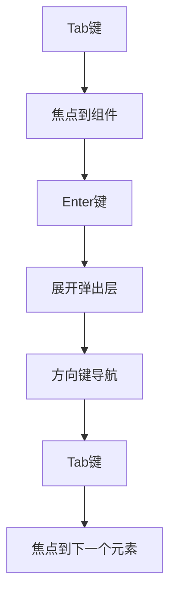

### 动态排序功能

组件支持基于order字段的动态排序：

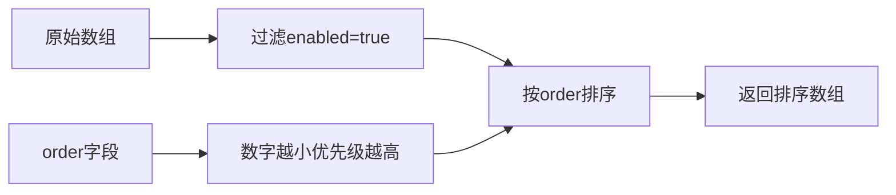

**图表来源**
- [src/hooks/core/useFastEnter.ts](file://src/hooks/core/useFastEnter.ts#L27-L42)

**章节来源**
- [src/components/core/layouts/art-fast-enter/index.vue](file://src/components/core/layouts/art-fast-enter/index.vue#L3-L15)

## 权限管理

### 角色权限控制

art-fast-enter 组件与系统的权限管理体系深度集成，支持基于角色的访问控制：

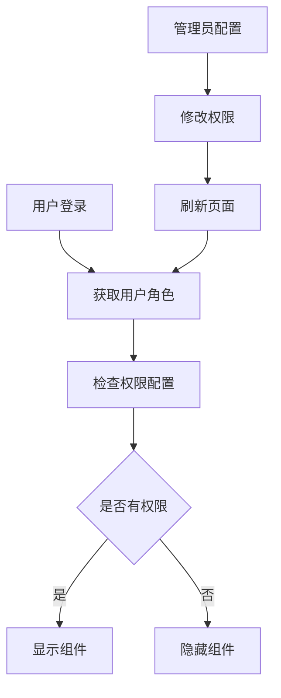

#### 权限配置结构

| 权限类型 | 配置字段 | 说明 |
|----------|----------|------|
| 功能开关 | enabled | 控制整个功能的启用状态 |
| 最小宽度 | minWidth | 控制显示的最小屏幕宽度 |
| 应用权限 | enabled | 控制单个应用的显示状态 |
| 链接权限 | enabled | 控制单个链接的显示状态 |

### 动态权限验证

系统通过多个层面实现权限验证：

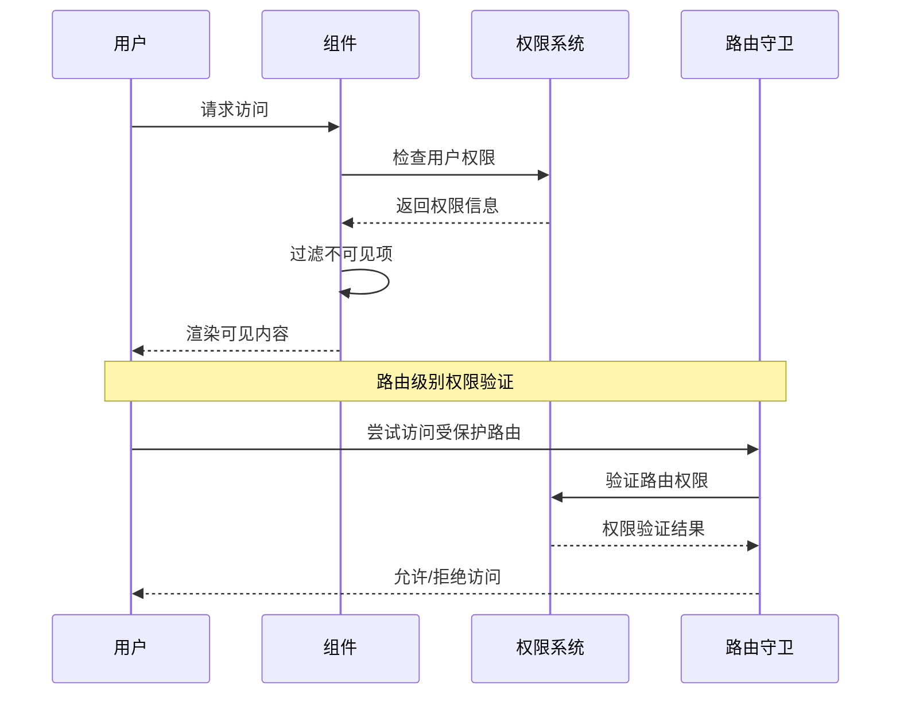

**图表来源**
- [src/hooks/core/useHeaderBar.ts](file://src/hooks/core/useHeaderBar.ts#L66-L69)
- [src/store/modules/user.ts](file://src/store/modules/user.ts#L70-L200)

### 不同角色的个性化显示

系统支持根据不同角色动态显示个性化的快捷方式：

| 角色类型 | 可见应用 | 可见链接 | 特殊权限 |
|----------|----------|----------|----------|
| 超级管理员 | 全部 | 全部 | 系统管理权限 |
| 管理员 | 全部 | 全部 | 部分管理权限 |
| 普通用户 | 基础功能 | 基础链接 | 有限访问权限 |

**章节来源**
- [src/hooks/core/useHeaderBar.ts](file://src/hooks/core/useHeaderBar.ts#L1-L133)
- [src/store/modules/user.ts](file://src/store/modules/user.ts#L1-L200)

## 性能优化

### 懒加载入口图标

组件采用了多种性能优化策略：

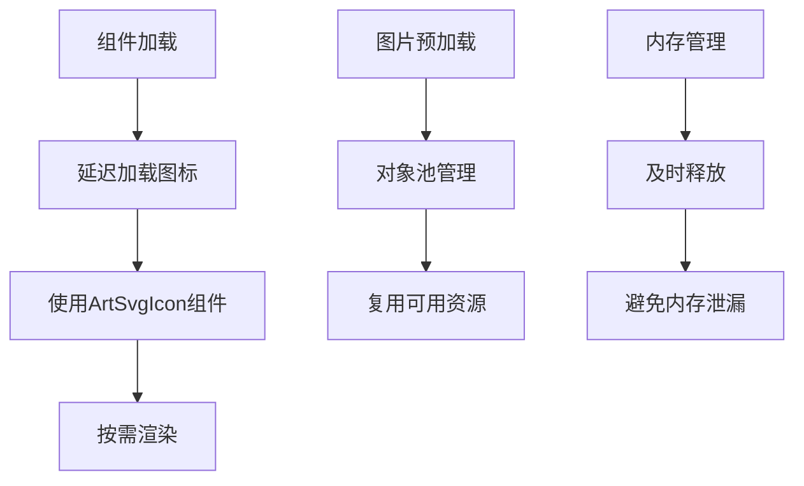

#### 性能优化措施

| 优化策略 | 实现方式 | 效果 |
|----------|----------|------|
| 图标懒加载 | ArtSvgIcon组件按需加载 | 减少初始加载时间 |
| 对象池管理 | 复用DOM元素 | 减少频繁的DOM操作 |
| 响应式更新 | Vue 3计算属性 | 只在必要时重新计算 |
| 组件缓存 | KeepAlive包装 | 避免重复渲染 |

### 减少重渲染

组件通过以下方式减少不必要的重渲染：

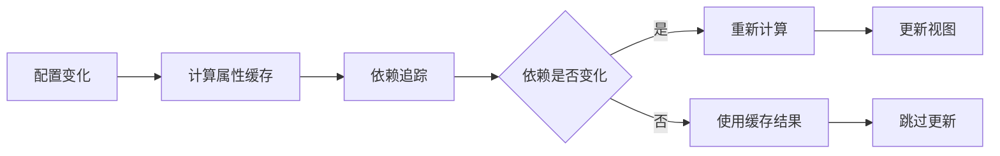

**图表来源**
- [src/hooks/core/useFastEnter.ts](file://src/hooks/core/useFastEnter.ts#L24-L55)

### 内存管理

系统实现了完善的内存管理机制：

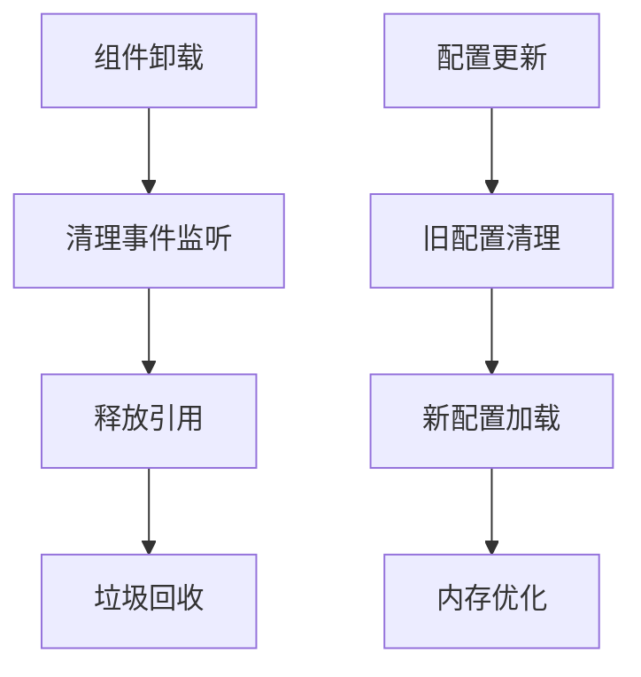

**章节来源**
- [src/components/core/layouts/art-fast-enter/index.vue](file://src/components/core/layouts/art-fast-enter/index.vue#L1-L114)
- [src/hooks/core/useFastEnter.ts](file://src/hooks/core/useFastEnter.ts#L1-L56)

## 故障排除

### 常见问题及解决方案

#### 入口错位问题

**问题描述**：快速入口弹出层位置不正确

**可能原因**：
1. CSS样式冲突
2. 父容器定位问题
3. 屏幕尺寸适配问题

**解决方案**：
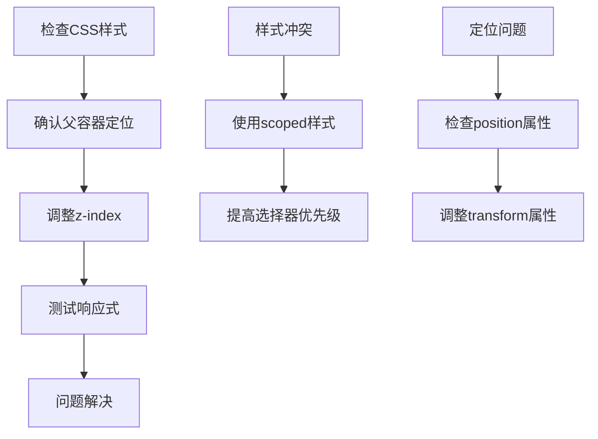

#### 点击无效问题

**问题描述**：点击快速入口项没有响应

**排查步骤**：
1. 检查路由配置是否正确
2. 验证权限配置是否允许访问
3. 确认网络连接状态

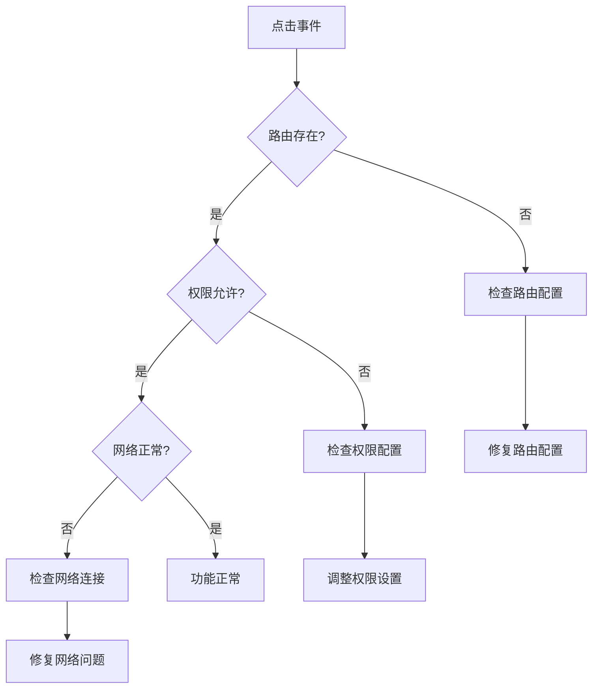

#### 权限不生效问题

**问题描述**：配置了权限但仍然可见

**解决方案**：
1. 检查useHeaderBar Hook的权限配置
2. 确认store中的权限状态
3. 验证组件的权限检查逻辑

### 调试技巧

#### 开发环境调试

#### 生产环境监控

系统提供了完善的错误监控机制：

| 监控类型 | 实现方式 | 用途 |
|----------|----------|------|
| 控制台警告 | console.warn | 配置错误提示 |
| 错误边界 | Vue错误处理器 | 异常捕获 |
| 性能监控 | 浏览器性能API | 性能分析 |

**章节来源**
- [src/components/core/layouts/art-fast-enter/index.vue](file://src/components/core/layouts/art-fast-enter/index.vue#L77-L96)

## 总结

art-fast-enter 组件是一个设计精良的快速入口解决方案，具有以下突出特点：

### 技术优势

1. **模块化设计**：清晰的职责分离，便于维护和扩展
2. **响应式架构**：基于Vue 3的组合式API，性能优异
3. **权限集成**：与系统权限体系深度集成
4. **性能优化**：多种优化策略确保流畅体验

### 设计亮点

1. **用户体验**：直观的鼠标悬停交互，符合用户习惯
2. **灵活性**：支持丰富的配置选项和自定义
3. **可扩展性**：良好的架构设计支持功能扩展
4. **一致性**：与整体UI风格保持一致

### 应用价值

art-fast-enter 组件不仅提升了用户的操作效率，还展示了现代Web应用组件设计的最佳实践。通过合理的架构设计和性能优化，它为用户提供了流畅、可靠的快速访问体验，是构建高质量Web应用的重要组成部分。