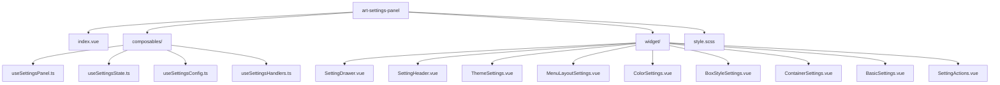
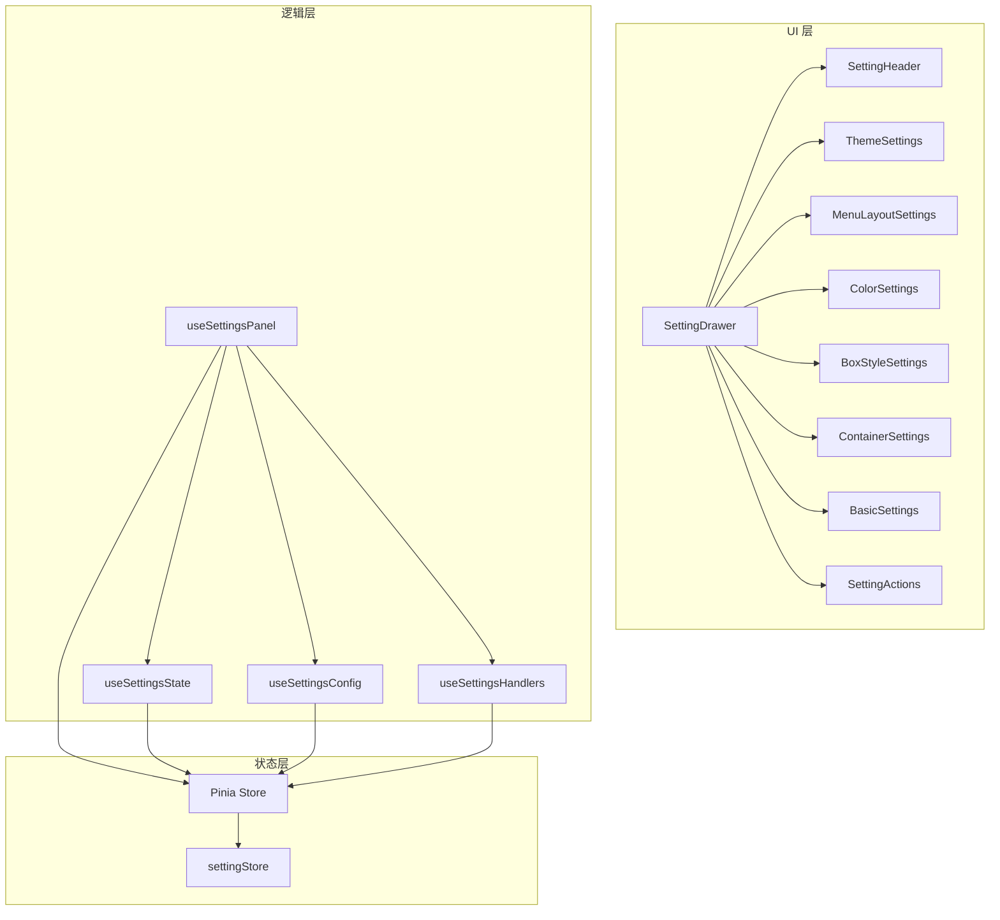
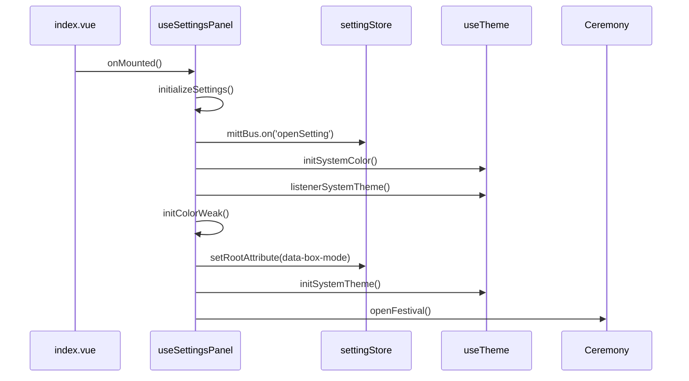
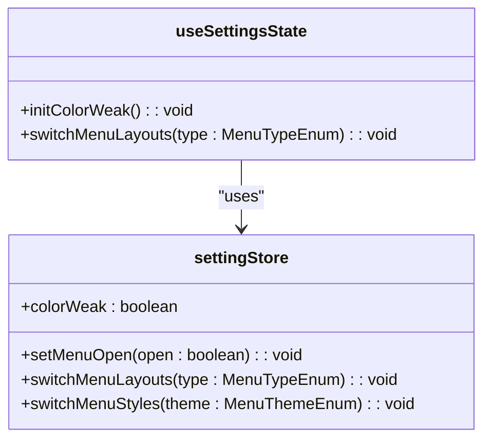
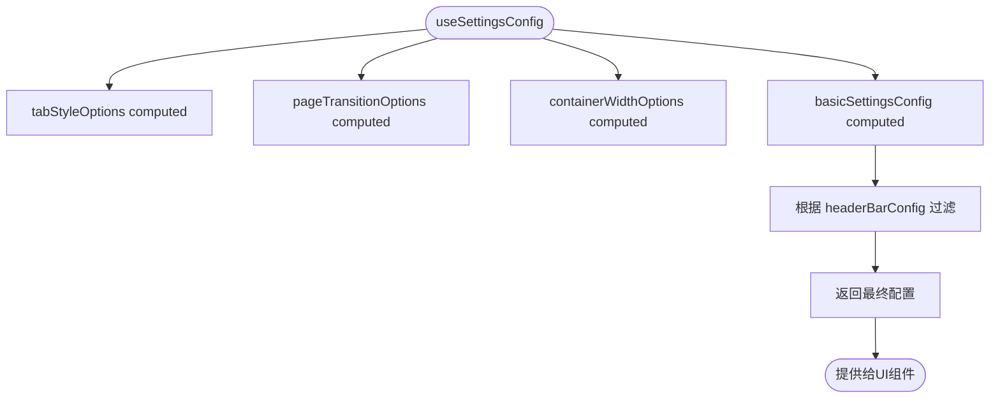
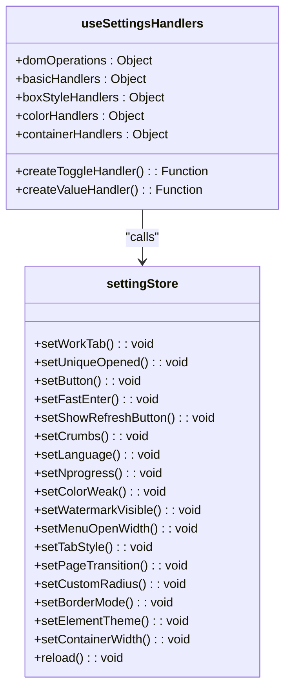
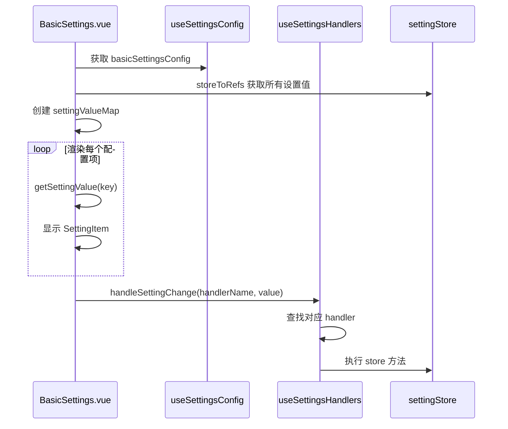
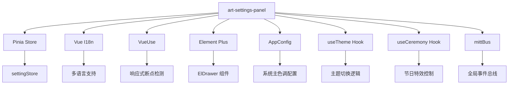

# 设置面板组件 (art-settings-panel)

<cite>
**本文档引用的文件**  
- [index.vue](file://src/components/core/layouts/art-settings-panel/index.vue)
- [useSettingsState.ts](file://src/components/core/layouts/art-settings-panel/composables/useSettingsState.ts)
- [useSettingsConfig.ts](file://src/components/core/layouts/art-settings-panel/composables/useSettingsConfig.ts)
- [useSettingsHandlers.ts](file://src/components/core/layouts/art-settings-panel/composables/useSettingsHandlers.ts)
- [useSettingsPanel.ts](file://src/components/core/layouts/art-settings-panel/composables/useSettingsPanel.ts)
- [SettingDrawer.vue](file://src/components/core/layouts/art-settings-panel/widget/SettingDrawer.vue)
- [SettingHeader.vue](file://src/components/core/layouts/art-settings-panel/widget/SettingHeader.vue)
- [ThemeSettings.vue](file://src/components/core/layouts/art-settings-panel/widget/ThemeSettings.vue)
- [BasicSettings.vue](file://src/components/core/layouts/art-settings-panel/widget/BasicSettings.vue)
- [style.scss](file://src/components/core/layouts/art-settings-panel/style.scss)
- [setting.ts](file://src/store/modules/setting.ts)
- [useTheme.ts](file://src/hooks/core/useTheme.ts)
</cite>

## 目录
1. [简介](#简介)
2. [项目结构](#项目结构)
3. [核心组件](#核心组件)
4. [架构概述](#架构概述)
5. [详细组件分析](#详细组件分析)
6. [依赖分析](#依赖分析)
7. [性能考虑](#性能考虑)
8. [故障排除指南](#故障排除指南)
9. [结论](#结论)

## 简介
`art-settings-panel` 是一个功能丰富的设置面板组件，用于动态调整系统外观与行为。该组件通过模块化设计实现了配置界面的灵活性，并利用组合式函数管理全局UI配置状态。它支持实时预览、状态持久化以及主题即时切换等功能，为用户提供直观且高效的个性化体验。

**Section sources**
- [index.vue](file://src/components/core/layouts/art-settings-panel/index.vue#L1-L73)

## 项目结构
`art-settings-panel` 组件位于 `src/components/core/layouts/art-settings-panel` 目录下，采用模块化组织方式，包含主组件文件、可组合函数（composables）、子组件（widget）和样式文件。

**Diagram sources**
- [index.vue](file://src/components/core/layouts/art-settings-panel/index.vue#L1-L73)

**Section sources**
- [index.vue](file://src/components/core/layouts/art-settings-panel/index.vue#L1-L73)

## 核心组件
`art-settings-panel` 的核心由多个子组件构成，每个子组件负责特定的配置项展示与交互逻辑。主组件通过 `<script setup>` 引入并注册这些子组件，形成完整的设置面板。

**Section sources**
- [index.vue](file://src/components/core/layouts/art-settings-panel/index.vue#L1-L73)

## 架构概述
该组件采用分层架构设计，将状态管理、配置逻辑、UI渲染分离，确保代码的可维护性和扩展性。

**Diagram sources**
- [index.vue](file://src/components/core/layouts/art-settings-panel/index.vue#L1-L73)
- [useSettingsPanel.ts](file://src/components/core/layouts/art-settings-panel/composables/useSettingsPanel.ts#L1-L193)

## 详细组件分析

### 主组件分析
`index.vue` 是设置面板的入口文件，定义了整体布局和组件依赖关系。它通过 `useSettingsPanel` 组合式函数初始化状态，并在挂载时调用 `initializeSettings` 方法完成配置初始化。

**Diagram sources**
- [index.vue](file://src/components/core/layouts/art-settings-panel/index.vue#L1-L73)
- [useSettingsPanel.ts](file://src/components/core/layouts/art-settings-panel/composables/useSettingsPanel.ts#L1-L193)

**Section sources**
- [index.vue](file://src/components/core/layouts/art-settings-panel/index.vue#L1-L73)
- [useSettingsPanel.ts](file://src/components/core/layouts/art-settings-panel/composables/useSettingsPanel.ts#L1-L193)

### 状态管理分析
`useSettingsState` 负责管理与UI相关的状态变更逻辑，如色弱模式初始化和菜单布局切换。它直接操作 `settingStore` 来更新全局状态。

**Diagram sources**
- [useSettingsState.ts](file://src/components/core/layouts/art-settings-panel/composables/useSettingsState.ts#L1-L38)
- [setting.ts](file://src/store/modules/setting.ts#L1-L200)

**Section sources**
- [useSettingsState.ts](file://src/components/core/layouts/art-settings-panel/composables/useSettingsState.ts#L1-L38)

### 配置管理分析
`useSettingsConfig` 提供了所有配置项的选项数据，包括标签页风格、页面切换动画、容器宽度等。它使用 `computed` 属性动态生成国际化选项，并根据 `headerBarConfig` 过滤可用设置项。

**Diagram sources**
- [useSettingsConfig.ts](file://src/components/core/layouts/art-settings-panel/composables/useSettingsConfig.ts#L1-L249)

**Section sources**
- [useSettingsConfig.ts](file://src/components/core/layouts/art-settings-panel/composables/useSettingsConfig.ts#L1-L249)

### 处理器分析
`useSettingsHandlers` 定义了通用的事件处理逻辑，包括DOM操作、值变更处理器和各类配置项的处理方法。它通过 `createToggleHandler` 和 `createValueHandler` 工厂函数生成统一的处理逻辑。

**Diagram sources**
- [useSettingsHandlers.ts](file://src/components/core/layouts/art-settings-panel/composables/useSettingsHandlers.ts#L1-L168)
- [setting.ts](file://src/store/modules/setting.ts#L1-L200)

**Section sources**
- [useSettingsHandlers.ts](file://src/components/core/layouts/art-settings-panel/composables/useSettingsHandlers.ts#L1-L168)

### 基础设置分析
`BasicSettings.vue` 组件负责渲染基础配置项，通过 `v-for` 循环遍历 `basicSettingsConfig` 中的配置项，并使用 `SettingItem` 组件进行展示。它通过 `getSettingValue` 获取当前设置值，并通过 `handleSettingChange` 统一处理变更事件。

**Diagram sources**
- [BasicSettings.vue](file://src/components/core/layouts/art-settings-panel/widget/BasicSettings.vue#L1-L78)
- [useSettingsConfig.ts](file://src/components/core/layouts/art-settings-panel/composables/useSettingsConfig.ts#L1-L249)
- [useSettingsHandlers.ts](file://src/components/core/layouts/art-settings-panel/composables/useSettingsHandlers.ts#L1-L168)

**Section sources**
- [BasicSettings.vue](file://src/components/core/layouts/art-settings-panel/widget/BasicSettings.vue#L1-L78)

## 依赖分析
`art-settings-panel` 组件依赖于多个外部模块和内部状态管理机制。

**Diagram sources**
- [useSettingsPanel.ts](file://src/components/core/layouts/art-settings-panel/composables/useSettingsPanel.ts#L1-L193)
- [useSettingsConfig.ts](file://src/components/core/layouts/art-settings-panel/composables/useSettingsConfig.ts#L1-L249)

**Section sources**
- [useSettingsPanel.ts](file://src/components/core/layouts/art-settings-panel/composables/useSettingsPanel.ts#L1-L193)
- [useSettingsConfig.ts](file://src/components/core/layouts/art-settings-panel/composables/useSettingsConfig.ts#L1-L249)

## 性能考虑
组件在性能方面做了多项优化：
- 使用 `useBreakpoints` 替代传统的 `watch` 检测屏幕尺寸变化
- 在 `onMounted` 时才初始化设置，避免不必要的计算
- 使用 `computed` 缓存配置选项，减少重复计算
- 通过 `immediate: true` 的 `watch` 实现响应式布局切换

**Section sources**
- [useSettingsPanel.ts](file://src/components/core/layouts/art-settings-panel/composables/useSettingsPanel.ts#L1-L193)

## 故障排除指南
### 配置重置问题
如果配置未正确重置，请检查 `cleanupSettings` 是否在组件卸载时被调用。

### 默认值管理
确保 `AppConfig` 中的默认值与 `settingStore` 初始状态一致，避免出现不一致的显示效果。

### 跨浏览器兼容性
- 确保 `backdrop-filter` 在目标浏览器中受支持
- 使用 `scrollbar-width: none` 兼容火狐浏览器滚动条隐藏
- 测试移动端布局切换是否正常工作

**Section sources**
- [useSettingsPanel.ts](file://src/components/core/layouts/art-settings-panel/composables/useSettingsPanel.ts#L1-L193)
- [style.scss](file://src/components/core/layouts/art-settings-panel/style.scss#L1-L93)

## 结论
`art-settings-panel` 组件通过模块化设计和组合式函数实现了高度可扩展的配置管理系统。它不仅提供了丰富的UI定制选项，还通过Pinia store实现了状态的持久化和同步。开发者可以通过扩展 `useSettingsConfig` 和添加新的处理函数来轻松集成新功能，同时保持与现有系统的兼容性。