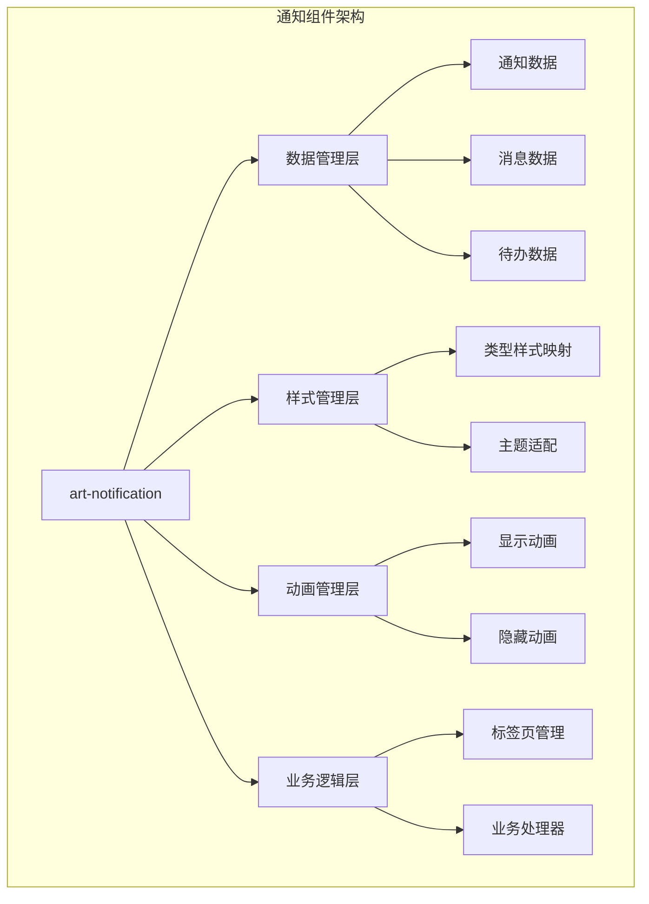
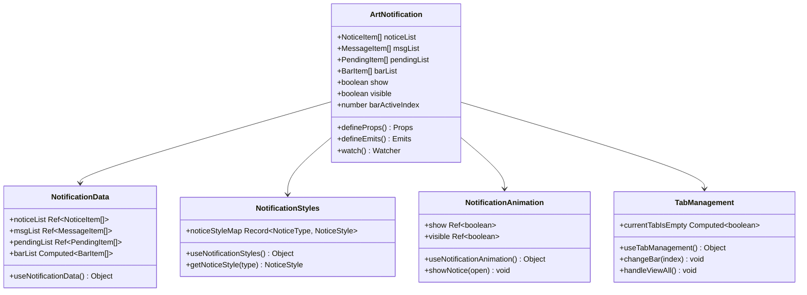
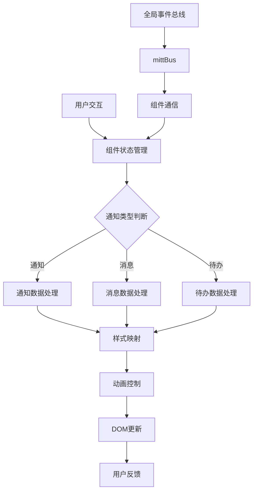
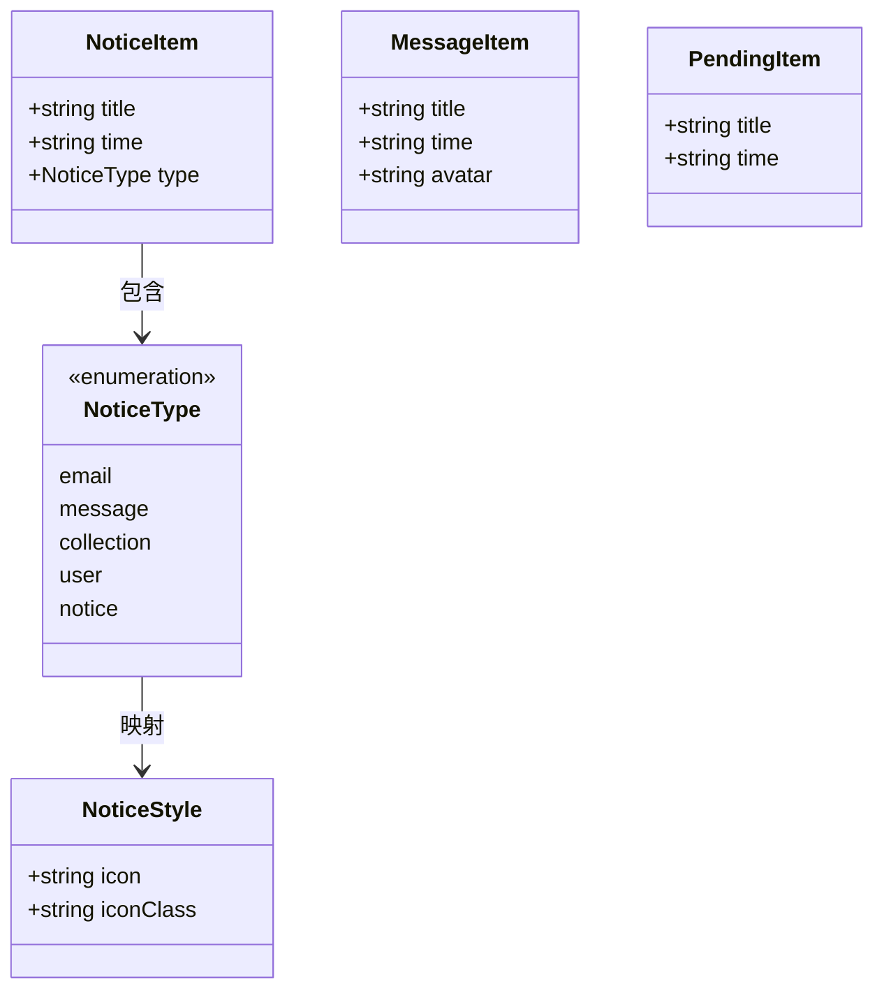
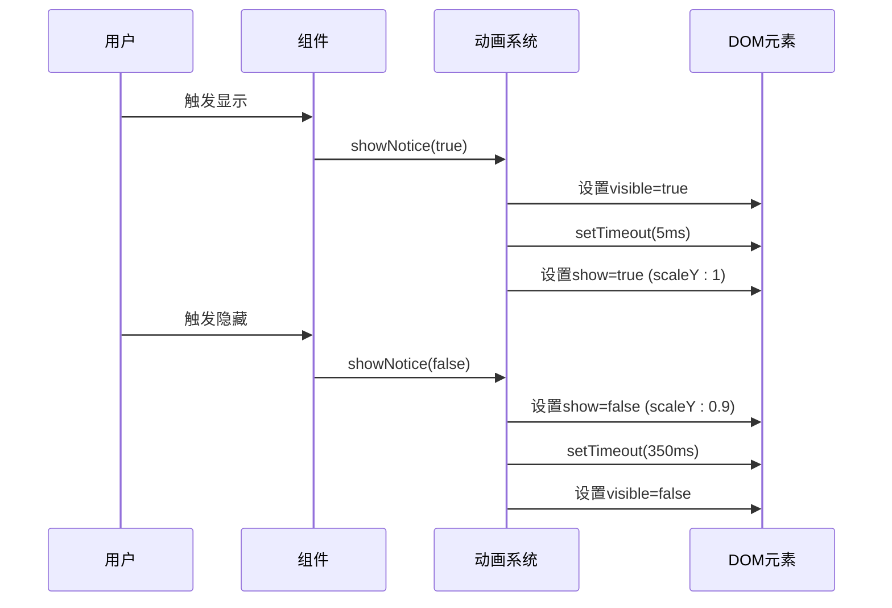
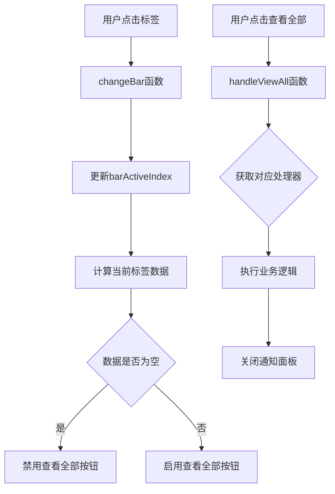
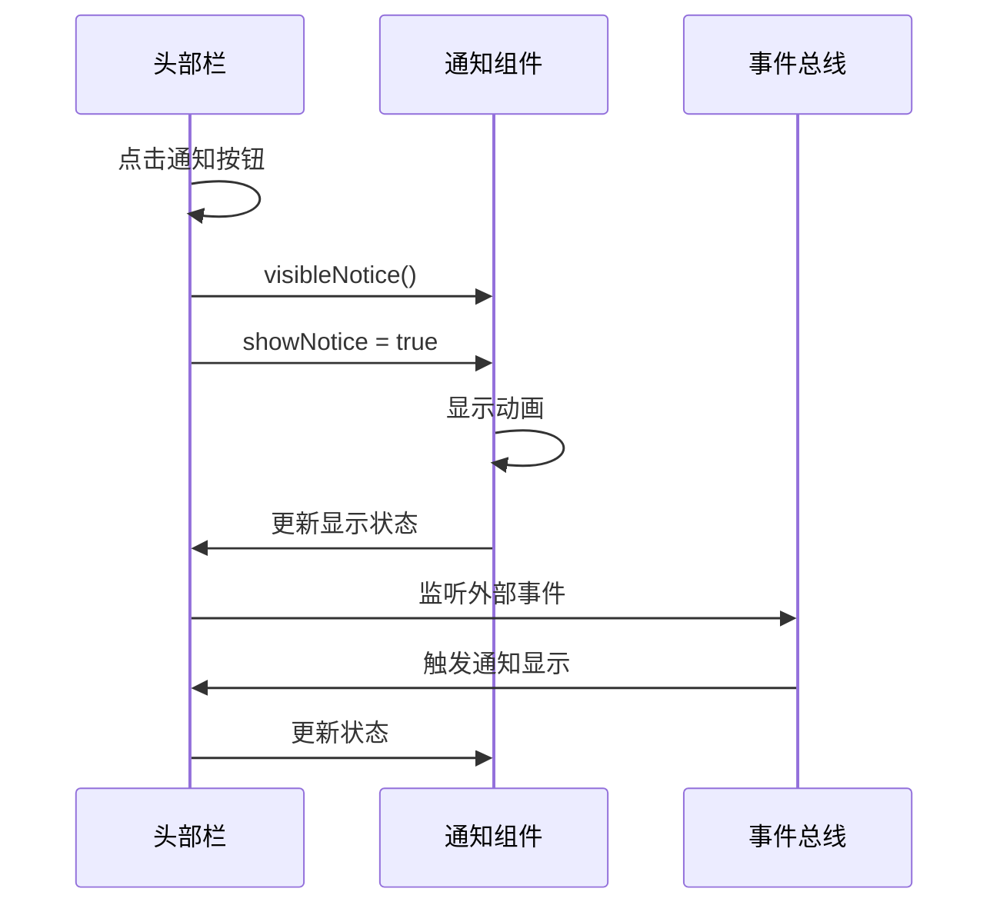
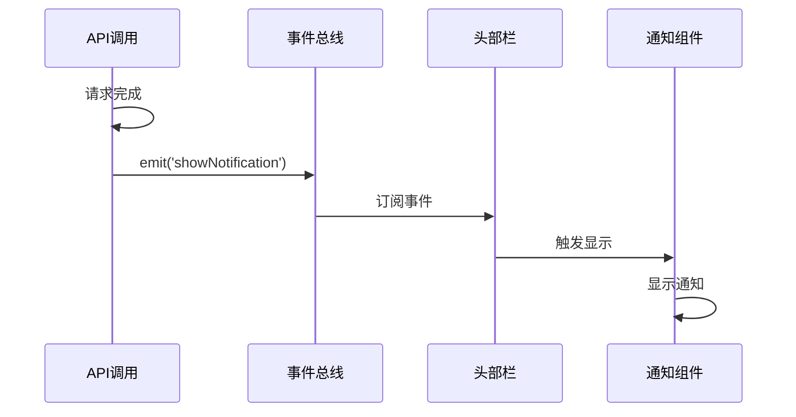
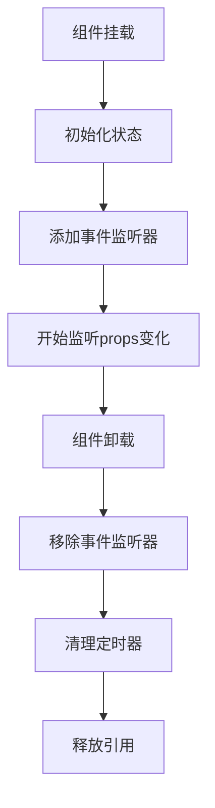

# 通知组件 (art-notification)

<cite>
**本文档中引用的文件**
- [src/components/core/layouts/art-notification/index.vue](file://src/components/core/layouts/art-notification/index.vue)
- [src/components/core/layouts/art-header-bar/index.vue](file://src/components/core/layouts/art-header-bar/index.vue)
- [src/utils/sys/mittBus.ts](file://src/utils/sys/mittBus.ts)
- [src/locales/langs/zh.json](file://src/locales/langs/zh.json)
</cite>

## 目录
1. [简介](#简介)
2. [项目结构](#项目结构)
3. [核心组件](#核心组件)
4. [架构概览](#架构概览)
5. [详细组件分析](#详细组件分析)
6. [API接口](#api接口)
7. [集成示例](#集成示例)
8. [样式定制](#样式定制)
9. [性能优化](#性能优化)
10. [故障排除](#故障排除)
11. [总结](#总结)

## 简介

art-notification是一个功能完善的Vue 3通知组件，专为现代Web应用设计。该组件提供了丰富的通知类型管理、灵活的动画过渡效果和响应式的布局设计。它采用模块化架构，支持多种通知类型（成功、警告、错误、信息），并通过全局事件总线实现跨组件通信。

### 主要特性

- **多类型通知支持**：支持通知、消息、邮件、收藏和个人提醒等多种类型
- **动画过渡效果**：平滑的缩放和透明度动画，提升用户体验
- **响应式设计**：适配不同屏幕尺寸，移动端友好
- **国际化支持**：内置多语言支持，便于国际化应用
- **事件总线通信**：基于mitt的全局事件系统，实现组件间解耦
- **类型安全**：完整的TypeScript类型定义，确保开发安全性

## 项目结构



**图表来源**
- [src/components/core/layouts/art-notification/index.vue](file://src/components/core/layouts/art-notification/index.vue#L105-L418)

**章节来源**
- [src/components/core/layouts/art-notification/index.vue](file://src/components/core/layouts/art-notification/index.vue#L1-L456)

## 核心组件

### 组件结构

art-notification组件采用组合式API设计，将功能拆分为多个独立的逻辑模块：



**图表来源**
- [src/components/core/layouts/art-notification/index.vue](file://src/components/core/layouts/art-notification/index.vue#L162-L418)

**章节来源**
- [src/components/core/layouts/art-notification/index.vue](file://src/components/core/layouts/art-notification/index.vue#L105-L418)

## 架构概览

### 数据流架构



**图表来源**
- [src/components/core/layouts/art-notification/index.vue](file://src/components/core/layouts/art-notification/index.vue#L174-L307)
- [src/utils/sys/mittBus.ts](file://src/utils/sys/mittBus.ts#L44-L62)

## 详细组件分析

### 数据管理层

#### 通知数据结构

组件支持三种主要的数据类型：

| 数据类型 | 接口定义 | 用途 | 示例 |
|---------|----------|------|------|
| NoticeItem | `{title: string, time: string, type: NoticeType}` | 通知类消息 | 新增功能、系统公告 |
| MessageItem | `{title: string, time: string, avatar: string}` | 用户消息 | 私信、评论回复 |
| PendingItem | `{title: string, time: string}` | 待办事项 | 工作任务、审批事项 |

#### 类型系统



**图表来源**
- [src/components/core/layouts/art-notification/index.vue](file://src/components/core/layouts/art-notification/index.vue#L119-L142)

**章节来源**
- [src/components/core/layouts/art-notification/index.vue](file://src/components/core/layouts/art-notification/index.vue#L174-L267)

### 样式管理层

#### 类型样式映射

组件为每种通知类型预设了对应的图标和颜色方案：

| 通知类型 | 图标 | 背景颜色 | 文字颜色 | 用途 |
|---------|------|----------|----------|------|
| notice | ri:notification-3-line | bg-theme/12 | text-theme | 系统通知 |
| message | ri:volume-down-line | bg-success/12 | text-success | 消息提醒 |
| email | ri:mail-line | bg-warning/12 | text-warning | 邮件通知 |
| collection | ri:heart-3-line | bg-danger/12 | text-danger | 收藏提醒 |
| user | ri:volume-down-line | bg-info/12 | text-info | 用户相关 |

**章节来源**
- [src/components/core/layouts/art-notification/index.vue](file://src/components/core/layouts/art-notification/index.vue#L270-L307)

### 动画管理层

#### 过渡动画系统



**图表来源**
- [src/components/core/layouts/art-notification/index.vue](file://src/components/core/layouts/art-notification/index.vue#L309-L328)

**章节来源**
- [src/components/core/layouts/art-notification/index.vue](file://src/components/core/layouts/art-notification/index.vue#L309-L328)

### 标签页管理系统

#### 标签页导航逻辑



**图表来源**
- [src/components/core/layouts/art-notification/index.vue](file://src/components/core/layouts/art-notification/index.vue#L330-L372)

**章节来源**
- [src/components/core/layouts/art-notification/index.vue](file://src/components/core/layouts/art-notification/index.vue#L330-L372)

## API接口

### Props接口

| 属性名 | 类型 | 默认值 | 描述 |
|--------|------|--------|------|
| value | boolean | false | 控制通知面板的显示状态 |

### 事件接口

| 事件名 | 参数 | 描述 |
|--------|------|------|
| update:value | boolean | 当通知面板显示状态改变时触发 |

### 插槽使用

组件目前不提供插槽接口，但可以通过以下方式扩展：
- 自定义通知内容：通过修改数据结构实现
- 自定义样式：通过CSS变量和类名覆盖
- 自定义动画：通过修改动画配置

**章节来源**
- [src/components/core/layouts/art-notification/index.vue](file://src/components/core/layouts/art-notification/index.vue#L162-L168)

## 集成示例

### 基础集成

在头部栏组件中的集成方式：



**图表来源**
- [src/components/core/layouts/art-header-bar/index.vue](file://src/components/core/layouts/art-header-bar/index.vue#L116-L166)

### 全局事件通信

通过mitt事件总线实现跨组件通信：



**图表来源**
- [src/utils/sys/mittBus.ts](file://src/utils/sys/mittBus.ts#L44-L62)

**章节来源**
- [src/components/core/layouts/art-header-bar/index.vue](file://src/components/core/layouts/art-header-bar/index.vue#L280-L344)

## 样式定制

### 主题系统集成

组件完全支持主题系统的动态切换：

| 样式变量 | 用途 | 默认值 |
|---------|------|--------|
| --theme-color | 主题色 | var(--primary-color) |
| --default-box-color | 默认背景色 | #ffffff |
| --text-color | 文本颜色 | #333333 |

### 响应式设计

```mermaid
graph LR
A[桌面端] --> B[固定位置: top-14.5 right-5]
C[移动端] --> D[全屏覆盖: top-65 right-0 w-full h-[80vh]]
B --> E[90rem 宽度]
D --> F[100% 宽度]
```

**图表来源**
- [src/components/core/layouts/art-notification/index.vue](file://src/components/core/layouts/art-notification/index.vue#L423-L437)

**章节来源**
- [src/components/core/layouts/art-notification/index.vue](file://src/components/core/layouts/art-notification/index.vue#L420-L456)

## 性能优化

### 内存管理

#### 自动销毁机制



#### 防止内存泄漏

1. **事件监听器管理**：在组件卸载时自动移除事件监听器
2. **定时器清理**：确保动画相关的setTimeout被正确清理
3. **引用清理**：避免循环引用导致的内存泄漏

### 渲染优化

#### 条件渲染策略

- 使用`v-show`而非`v-if`保持DOM结构稳定
- 通过`computed`属性缓存复杂计算结果
- 合理使用`key`属性优化列表渲染

**章节来源**
- [src/components/core/layouts/art-notification/index.vue](file://src/components/core/layouts/art-notification/index.vue#L411-L417)

## 故障排除

### 常见问题及解决方案

#### 通知堆叠问题

**问题描述**：多个通知同时出现，造成视觉混乱

**解决方案**：
1. 实现通知队列管理
2. 添加通知间隔时间限制
3. 提供批量处理选项

#### 重复提示问题

**问题描述**：相同内容的通知重复显示

**解决方案**：
1. 实现通知去重机制
2. 添加唯一标识符
3. 设置通知有效期

#### 响应式布局适配

**问题描述**：在移动设备上显示异常

**解决方案**：
1. 使用媒体查询适配不同屏幕
2. 实现弹性布局
3. 优化触摸交互体验

### 调试技巧

#### 开发者工具使用

1. **Vue DevTools**：监控组件状态变化
2. **浏览器开发者工具**：检查样式和动画
3. **网络面板**：调试异步数据加载

**章节来源**
- [src/components/core/layouts/art-notification/index.vue](file://src/components/core/layouts/art-notification/index.vue#L310-L328)

## 总结

art-notification组件是一个功能完整、设计精良的通知系统，具有以下优势：

### 技术特点

- **模块化设计**：清晰的功能分离，便于维护和扩展
- **类型安全**：完整的TypeScript支持，减少运行时错误
- **性能优化**：合理的渲染策略和内存管理
- **用户体验**：流畅的动画效果和响应式设计

### 应用价值

- **提升开发效率**：提供开箱即用的通知功能
- **改善用户体验**：直观的界面和友好的交互
- **降低维护成本**：标准化的设计模式和最佳实践
- **增强系统稳定性**：完善的错误处理和性能优化

### 扩展建议

1. **通知队列**：实现先进先出的通知管理
2. **持久化存储**：保存用户通知偏好设置
3. **推送集成**：支持WebSocket实时通知
4. **无障碍支持**：完善键盘导航和屏幕阅读器支持

通过合理使用art-notification组件，开发者可以快速构建高质量的用户通知系统，为用户提供优秀的交互体验。