# SVG图标组件

<cite>
**本文档中引用的文件**
- [index.vue](file://src/components/core/base/art-svg-icon/index.vue)
- [iconify-loader.ts](file://src/utils/ui/iconify-loader.ts)
- [sales-growth.vue](file://src/views/dashboard/ecommerce/modules/sales-growth.vue)
- [icon/index.vue](file://src/views/widgets/icon/index.vue)
- [art-icon-button/index.vue](file://src/components/core/widget/art-icon-button/index.vue)
- [main.ts](file://src/main.ts)
- [package.json](file://package.json)
</cite>

## 目录
1. [简介](#简介)
2. [项目结构](#项目结构)
3. [核心组件](#核心组件)
4. [架构概览](#架构概览)
5. [详细组件分析](#详细组件分析)
6. [依赖关系分析](#依赖关系分析)
7. [性能考虑](#性能考虑)
8. [故障排除指南](#故障排除指南)
9. [结论](#结论)

## 简介

Art Design Pro中的`art-svg-icon`组件是一个基于Iconify的轻量级SVG图标渲染组件，专为现代Web应用设计。该组件提供了简洁高效的图标解决方案，支持多种图标库的按需加载，具有出色的性能表现和可访问性支持。

### 主要特性

- **轻量级设计**：基于Iconify Vue组件，体积小，加载快
- **多图标库支持**：支持Remix Icon、Solar、Tabler Icons等多种图标库
- **按需加载**：通过iconify-loader实现图标资源的按需加载
- **原生属性继承**：完美继承Vue组件的原生属性绑定能力
- **响应式设计**：支持动态样式和类名绑定
- **可访问性友好**：内置无障碍访问支持

## 项目结构

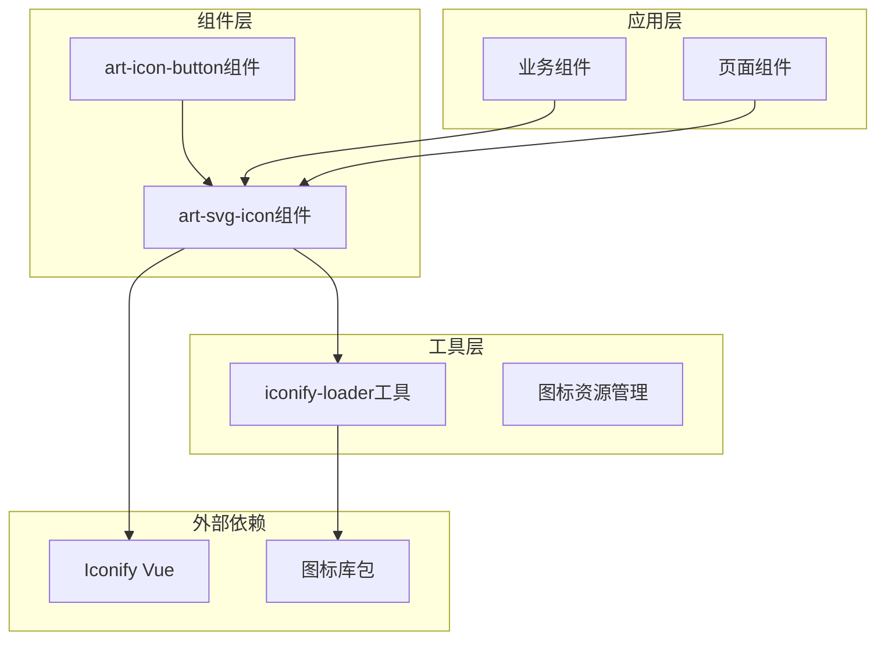

**图表来源**
- [index.vue](file://src/components/core/base/art-svg-icon/index.vue#L1-L24)
- [iconify-loader.ts](file://src/utils/ui/iconify-loader.ts#L1-L32)

**章节来源**
- [index.vue](file://src/components/core/base/art-svg-icon/index.vue#L1-L24)
- [iconify-loader.ts](file://src/utils/ui/iconify-loader.ts#L1-L32)

## 核心组件

### ArtSvgIcon组件

`art-svg-icon`组件是整个图标系统的核心，它封装了Iconify Vue组件的功能，提供了简化的API接口。

#### 组件结构

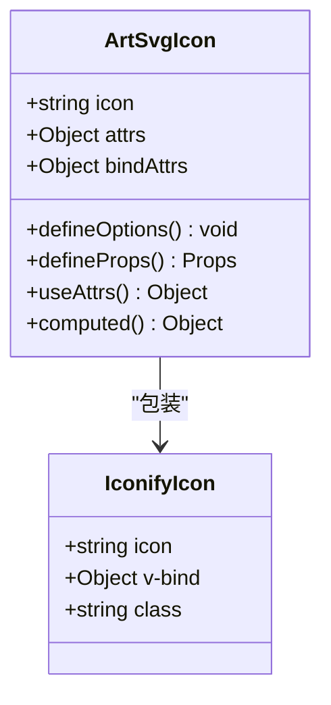

**图表来源**
- [index.vue](file://src/components/core/base/art-svg-icon/index.vue#L6-L24)

#### 属性定义

| 属性名 | 类型 | 必填 | 默认值 | 描述 |
|--------|------|------|--------|------|
| icon | string | 否 | undefined | Iconify图标名称，格式为`库名:图标名` |

**章节来源**
- [index.vue](file://src/components/core/base/art-svg-icon/index.vue#L11-L14)

## 架构概览

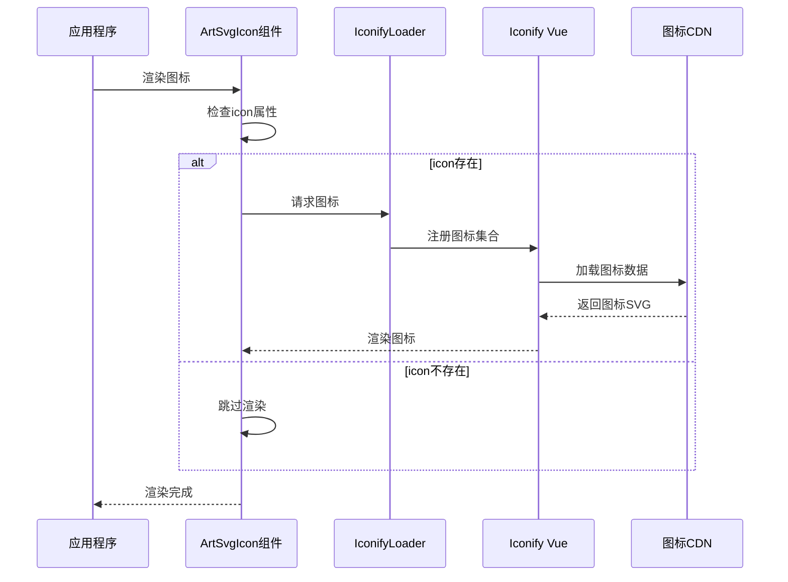

**图表来源**
- [index.vue](file://src/components/core/base/art-svg-icon/index.vue#L3)
- [iconify-loader.ts](file://src/utils/ui/iconify-loader.ts#L1-L32)

## 详细组件分析

### 组件实现原理

#### 基础模板结构

组件采用简洁的模板结构，只在有图标时才渲染：

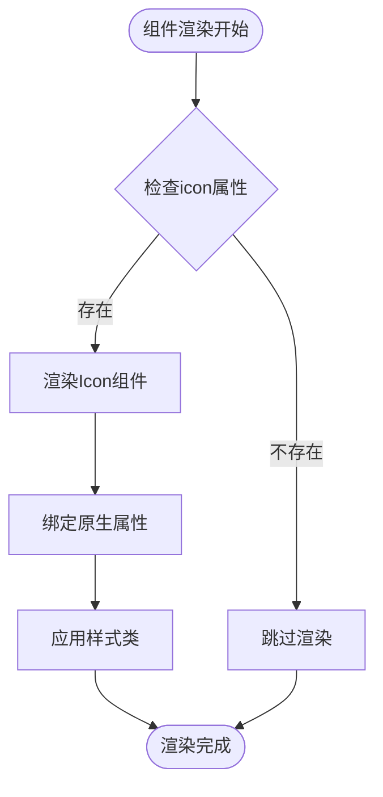

**图表来源**
- [index.vue](file://src/components/core/base/art-svg-icon/index.vue#L3)

#### 属性继承机制

组件通过`useAttrs()`和`computed`属性实现了智能的原生属性继承：

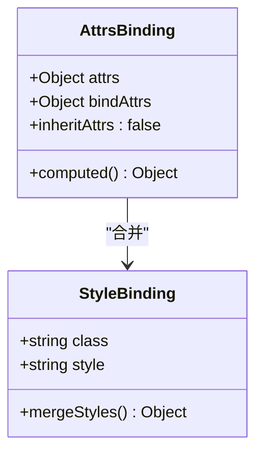

**图表来源**
- [index.vue](file://src/components/core/base/art-svg-icon/index.vue#L18-L23)

#### 类型定义和接口

组件使用TypeScript定义了清晰的接口：

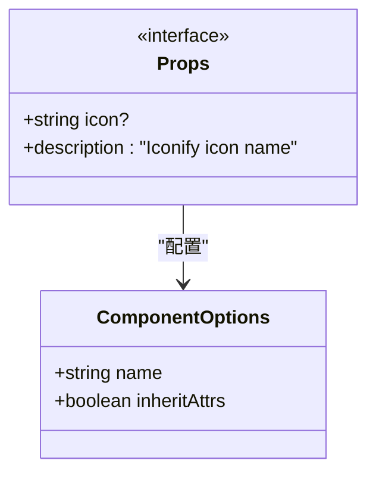

**图表来源**
- [index.vue](file://src/components/core/base/art-svg-icon/index.vue#L11-L16)

**章节来源**
- [index.vue](file://src/components/core/base/art-svg-icon/index.vue#L1-L24)

### 图标加载机制

#### Iconify集成

组件直接使用`@iconify/vue`包提供的`Icon`组件：

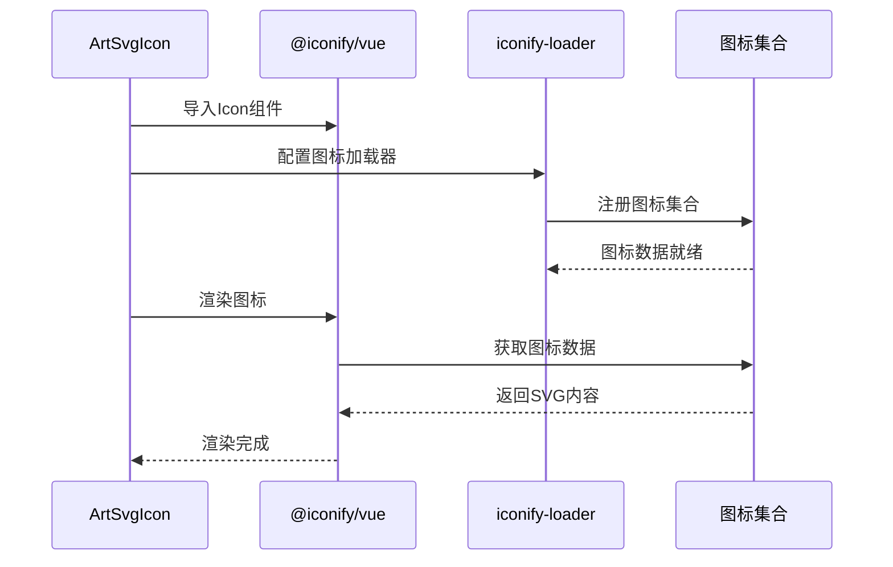

**图表来源**
- [index.vue](file://src/components/core/base/art-svg-icon/index.vue#L7)
- [iconify-loader.ts](file://src/utils/ui/iconify-loader.ts#L29-L31)

#### 离线图标加载器

项目提供了离线图标加载器，支持内网环境下的图标使用：

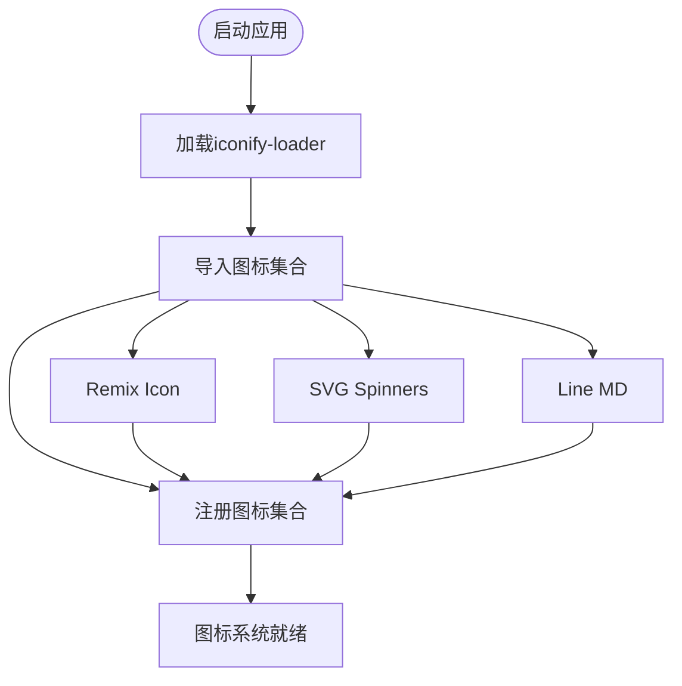

**图表来源**
- [iconify-loader.ts](file://src/utils/ui/iconify-loader.ts#L20-L31)

**章节来源**
- [iconify-loader.ts](file://src/utils/ui/iconify-loader.ts#L1-L32)

### 实际使用示例

#### 基础使用

组件支持多种图标库的图标：

| 图标库 | 示例图标 | 使用方法 |
|--------|----------|----------|
| Remix Icon | ri:home-line | `<ArtSvgIcon icon="ri:home-line" />` |
| SVG Spinners | svg-spinners:3-dots-fade | `<ArtSvgIcon icon="svg-spinners:3-dots-fade" />` |
| Line MD | line-md:phone-call-twotone-loop | `<ArtSvgIcon icon="line-md:phone-call-twotone-loop" />` |

#### 动态图标使用

组件支持动态绑定图标：

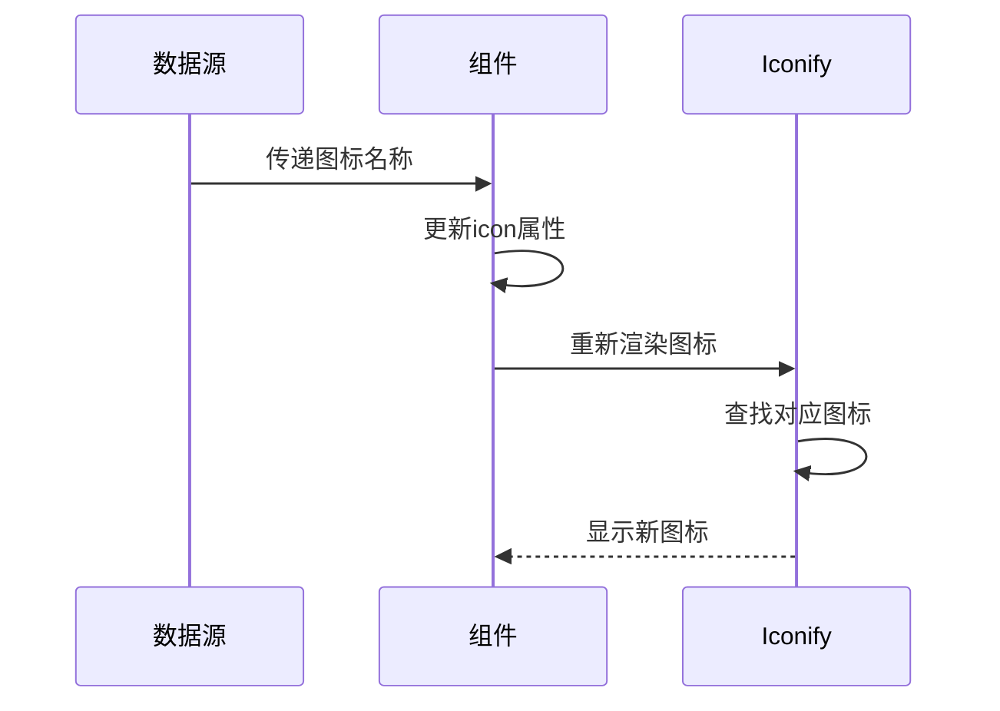

**图表来源**
- [sales-growth.vue](file://src/views/dashboard/ecommerce/modules/sales-growth.vue#L7)
- [art-icon-button/index.vue](file://src/components/core/widget/art-icon-button/index.vue#L7)

**章节来源**
- [sales-growth.vue](file://src/views/dashboard/ecommerce/modules/sales-growth.vue#L1-L23)
- [icon/index.vue](file://src/views/widgets/icon/index.vue#L24-L52)

## 依赖关系分析

### 外部依赖

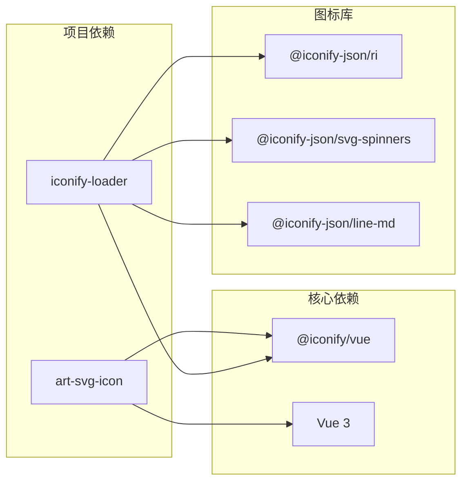

**图表来源**
- [package.json](file://package.json#L54-L78)
- [index.vue](file://src/components/core/base/art-svg-icon/index.vue#L7)

### 内部依赖

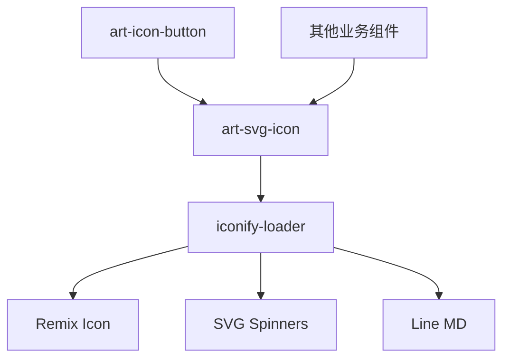

**图表来源**
- [art-icon-button/index.vue](file://src/components/core/widget/art-icon-button/index.vue#L107)

**章节来源**
- [package.json](file://package.json#L54-L78)
- [iconify-loader.ts](file://src/utils/ui/iconify-loader.ts#L1-L32)

## 性能考虑

### 按需加载优化

组件通过以下机制实现性能优化：

1. **条件渲染**：只有在`icon`属性存在时才渲染图标
2. **懒加载**：图标数据按需从CDN加载
3. **缓存机制**：已加载的图标数据会被缓存
4. **体积控制**：只加载实际使用的图标

### 内存管理

- 组件使用`computed`属性避免不必要的重新计算
- 通过`inheritAttrs: false`减少内存占用
- 合理的属性绑定策略

## 故障排除指南

### 常见问题及解决方案

#### 图标不显示

**问题描述**：组件渲染但看不到图标

**可能原因**：
1. 图标名称错误
2. 图标库未正确加载
3. 网络连接问题

**解决方案**：
1. 检查图标名称格式是否正确（`库名:图标名`）
2. 确认对应的图标库已安装并注册
3. 检查网络连接状态

#### 样式冲突

**问题描述**：图标样式与其他样式冲突

**解决方案**：
1. 使用更具体的选择器
2. 检查CSS优先级
3. 使用`!important`强制覆盖

#### 性能问题

**问题描述**：大量图标导致页面性能下降

**解决方案**：
1. 使用虚拟滚动
2. 减少同时渲染的图标数量
3. 优化图标尺寸

### 调试建议

1. **检查控制台错误**：查看是否有网络请求失败
2. **验证图标名称**：在Iconify官网验证图标名称
3. **监控网络请求**：确认图标数据是否成功加载
4. **测试不同设备**：确保跨设备兼容性

**章节来源**
- [icon/index.vue](file://src/views/widgets/icon/index.vue#L1-L23)

## 结论

Art Design Pro的`art-svg-icon`组件是一个设计精良的SVG图标解决方案，它成功地将Iconify的强大功能与Vue 3的响应式特性相结合。通过简洁的API设计、智能的属性继承机制和灵活的配置选项，该组件为开发者提供了高效、易用的图标渲染能力。

### 主要优势

1. **轻量级设计**：最小化开销，最大化性能
2. **多库支持**：丰富的图标资源选择
3. **按需加载**：优化资源使用效率
4. **易于集成**：简单的API设计
5. **可扩展性**：良好的架构支持功能扩展

### 最佳实践建议

1. **合理使用图标库**：根据项目需求选择合适的图标库
2. **优化加载策略**：充分利用按需加载特性
3. **保持命名规范**：遵循统一的图标命名约定
4. **关注性能指标**：定期监控组件性能表现
5. **维护文档更新**：及时更新使用文档和示例

该组件为Art Design Pro项目提供了坚实的图标基础设施，支撑了整个应用的视觉一致性需求，是现代Vue应用中图标解决方案的优秀范例。