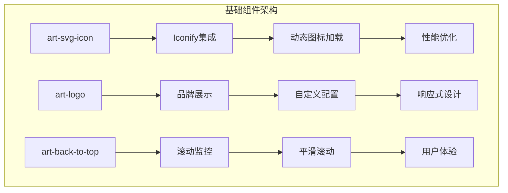
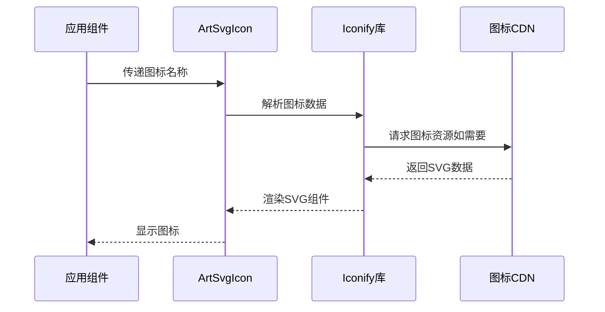
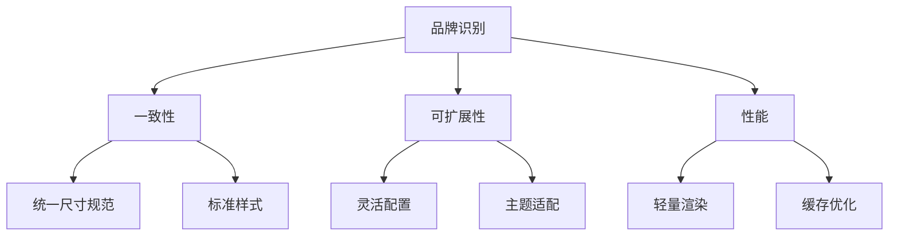
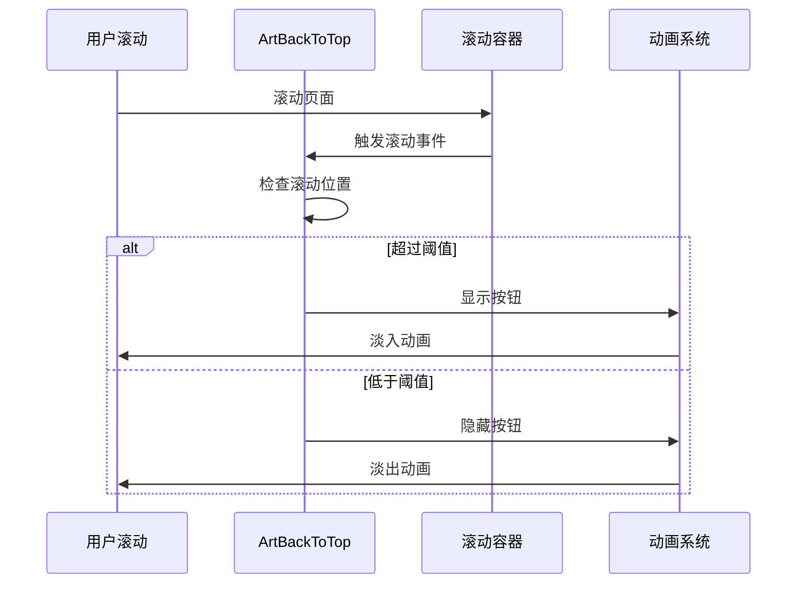
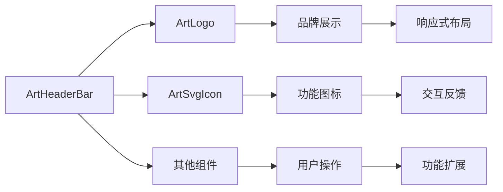
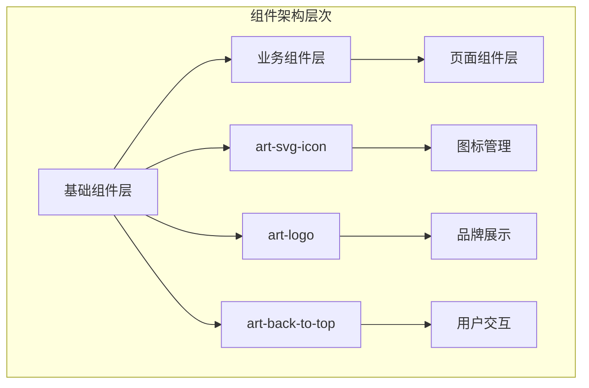

# 基础组件

<cite>
**本文档中引用的文件**
- [art-svg-icon/index.vue](file://src/components/core/base/art-svg-icon/index.vue)
- [art-logo/index.vue](file://src/components/core/base/art-logo/index.vue)
- [art-back-to-top/index.vue](file://src/components/core/base/art-back-to-top/index.vue)
- [iconify-loader.ts](file://src/utils/ui/iconify-loader.ts)
- [useCommon.ts](file://src/hooks/core/useCommon.ts)
- [theme-animation.scss](file://src/assets/styles/core/theme-animation.scss)
- [component.ts](file://src/config/modules/component.ts)
- [header-bar/index.vue](file://src/components/core/layouts/art-header-bar/index.vue)
- [icon/index.vue](file://src/views/widgets/icon/index.vue)
</cite>

## 目录
1. [简介](#简介)
2. [项目结构](#项目结构)
3. [art-svg-icon组件](#art-svg-icon组件)
4. [art-logo组件](#art-logo组件)
5. [art-back-to-top组件](#art-back-to-top组件)
6. [组件集成与使用](#组件集成与使用)
7. [设计原则与架构](#设计原则与架构)
8. [性能优化](#性能优化)
9. [可访问性支持](#可访问性支持)
10. [故障排除指南](#故障排除指南)
11. [总结](#总结)

## 简介

Art Design Pro是一套基于Vue 3和TypeScript构建的企业级前端UI框架，提供了丰富的基础组件来支撑复杂的业务场景。本文档重点介绍三个核心基础组件：art-svg-icon（SVG图标组件）、art-logo（系统Logo组件）和art-back-to-top（返回顶部组件）。这些组件遵循轻量化、可复用性和高性能的设计原则，为开发者提供简洁而强大的功能支持。

## 项目结构

这三个基础组件位于项目的`src/components/core/base/`目录下，体现了清晰的模块化架构：



**图表来源**
- [art-svg-icon/index.vue](file://src/components/core/base/art-svg-icon/index.vue#L1-L25)
- [art-logo/index.vue](file://src/components/core/base/art-logo/index.vue#L1-L22)
- [art-back-to-top/index.vue](file://src/components/core/base/art-back-to-top/index.vue#L1-L41)

## art-svg-icon组件

### 组件概述

art-svg-icon是基于Iconify图标的轻量级SVG图标组件，提供了统一的图标管理和动态加载能力。该组件设计简洁，仅需一个属性即可完成图标渲染。

### 核心特性

- **Iconify集成**：无缝对接Iconify图标系统，支持数千种图标库
- **动态加载**：按需加载图标，减少初始包体积
- **属性透传**：支持所有原生SVG属性的传递
- **轻量化设计**：最小化的组件结构，高性能渲染

### 属性定义

| 属性名 | 类型 | 默认值 | 描述 |
|--------|------|--------|------|
| icon | string | - | Iconify图标名称，格式：`库名:图标名` |

### 使用示例

#### 基础使用
```vue
<ArtSvgIcon icon="ri:home-line" />
```

#### 自定义大小和颜色
```vue
<ArtSvgIcon icon="ri:user-line" class="text-2xl text-theme" />
<ArtSvgIcon icon="ri:heart-fill" class="text-red-500" />
```

#### 组合使用
```vue
<div class="flex items-center gap-4">
  <ArtSvgIcon icon="ri:star-fill" class="text-4xl text-yellow-500" />
  <ArtSvgIcon icon="ri:check-line" class="text-green-500" />
  <ArtSvgIcon icon="ri:close-line" class="text-red-500" />
</div>
```

### 图标系统集成

组件通过`@iconify/vue`库实现与Iconify图标的深度集成：



**图表来源**
- [art-svg-icon/index.vue](file://src/components/core/base/art-svg-icon/index.vue#L7-L8)
- [iconify-loader.ts](file://src/utils/ui/iconify-loader.ts#L1-L32)

### 最佳实践

1. **图标命名规范**：使用`库名:图标名`格式，如`ri:home-line`
2. **性能考虑**：合理使用图标，避免过度渲染
3. **主题适配**：通过CSS类实现图标颜色的主题化

**章节来源**
- [art-svg-icon/index.vue](file://src/components/core/base/art-svg-icon/index.vue#L1-L25)
- [icon/index.vue](file://src/views/widgets/icon/index.vue#L25-L36)

## art-logo组件

### 组件概述

art-logo是一个专门用于展示系统Logo的品牌组件，提供了灵活的尺寸控制和品牌展示能力。该组件设计简洁，专注于品牌视觉的一致性。

### 核心特性

- **灵活尺寸控制**：支持数字和字符串类型的尺寸设置
- **响应式设计**：自动适配不同屏幕尺寸
- **品牌一致性**：统一的Logo展示标准
- **轻量级实现**：最小化的DOM结构和样式

### 属性定义

| 属性名 | 类型 | 默认值 | 描述 |
|--------|------|--------|------|
| size | number \| string | 36 | Logo显示尺寸，支持px、rem等单位 |

### 使用示例

#### 基础使用
```vue
<ArtLogo />
```

#### 自定义尺寸
```vue
<ArtLogo :size="48" />
<ArtLogo size="2rem" />
```

#### 响应式布局
```vue
<template>
  <div class="flex items-center gap-4">
    <ArtLogo class="hidden sm:block" />
    <p class="text-xl font-bold">系统名称</p>
  </div>
</template>
```

### 设计原则

art-logo组件遵循以下设计原则：



**图表来源**
- [art-logo/index.vue](file://src/components/core/base/art-logo/index.vue#L11-L20)

### 最佳实践

1. **尺寸标准化**：在不同场景下保持一致的Logo尺寸
2. **语义化使用**：在导航栏、登录页等关键位置使用
3. **性能优化**：利用浏览器缓存机制提高加载速度

**章节来源**
- [art-logo/index.vue](file://src/components/core/base/art-logo/index.vue#L1-L22)
- [header-bar/index.vue](file://src/components/core/layouts/art-header-bar/index.vue#L18-L26)

## art-back-to-top组件

### 组件概述

art-back-to-top是一个智能的返回顶部组件，具备滚动监听、条件显示和优雅动画效果。该组件提供了良好的用户体验，帮助用户快速回到页面顶部。

### 核心特性

- **智能显示**：基于滚动位置自动显示/隐藏
- **平滑滚动**：提供流畅的滚动动画效果
- **自定义阈值**：可配置触发显示的滚动距离
- **动画效果**：内置淡入淡出动画

### 属性定义

该组件不接受外部属性，但具有以下内部配置：

| 配置项 | 类型 | 默认值 | 描述 |
|--------|------|--------|------|
| scrollThreshold | number | 300 | 触发显示的滚动阈值（像素） |
| animationDuration | number | 300 | 显示/隐藏动画持续时间 |

### 使用示例

#### 基础使用
```vue
<template>
  <div>
    <!-- 页面内容 -->
    <ArtBackToTop />
  </div>
</template>
```

#### 自定义样式
```vue
<template>
  <ArtBackToTop class="custom-back-to-top" />
</template>

<style>
.custom-back-to-top {
  right: 20px;
  bottom: 20px;
  border-radius: 50%;
  box-shadow: 0 2px 10px rgba(0,0,0,0.1);
}
</style>
```

### 滚动监听机制

组件实现了高效的滚动监听机制：



**图表来源**
- [art-back-to-top/index.vue](file://src/components/core/base/art-back-to-top/index.vue#L31-L38)
- [useCommon.ts](file://src/hooks/core/useCommon.ts#L44-L49)

### 动画效果实现

组件使用Vue的Transition组件实现平滑的显示/隐藏效果：

```scss
// 显示动画
.enter-active-class {
  transition: opacity 0.3s ease-out, transform 0.3s ease-out;
}

// 隐藏动画  
.leave-active-class {
  transition: opacity 0.2s ease-in, transform 0.2s ease-in;
}
```

### 最佳实践

1. **性能优化**：使用`document.getElementById('app-main')`作为滚动容器
2. **用户体验**：合理的阈值设置（通常300px）
3. **无障碍设计**：配合键盘导航使用

**章节来源**
- [art-back-to-top/index.vue](file://src/components/core/base/art-back-to-top/index.vue#L1-L41)
- [useCommon.ts](file://src/hooks/core/useCommon.ts#L44-L49)

## 组件集成与使用

### 在导航栏中的集成

art-logo和art-svg-icon在导航栏中得到了广泛应用：



**图表来源**
- [header-bar/index.vue](file://src/components/core/layouts/art-header-bar/index.vue#L18-L26)

### 在图标页面中的展示

项目提供了专门的图标展示页面，展示了各种图标的使用方法：

```vue
<template>
  <div class="flex items-center gap-6">
    <ArtSvgIcon icon="ri:github-fill" class="text-2xl" />
    <ArtSvgIcon icon="ri:copilot-line" class="text-2xl text-theme" />
    <ArtSvgIcon icon="ri:edge-line" class="text-2xl text-secondary" />
  </div>
</template>
```

### 全局配置管理

组件通过全局配置系统进行管理：

```typescript
// 组件配置接口
interface GlobalComponentConfig {
  name: string;
  key: string;
  component: any;
  enabled?: boolean;
  description?: string;
}
```

**章节来源**
- [header-bar/index.vue](file://src/components/core/layouts/art-header-bar/index.vue#L1-L486)
- [component.ts](file://src/config/modules/component.ts#L75-L106)

## 设计原则与架构

### 轻量化设计

三个基础组件都遵循轻量化设计原则：

```mermaid
mindmap
root((轻量化设计))
组件体积
最小化代码
按需加载
缓存优化
性能表现
快速渲染
低内存占用
高响应速度
开发体验
简单易用
类型安全
文档完善
```

### 可复用性架构

组件设计注重可复用性：

1. **单一职责**：每个组件专注一个功能领域
2. **接口统一**：相似功能组件使用一致的API设计
3. **配置灵活**：支持多种配置选项满足不同需求
4. **主题适配**：内置主题支持和CSS变量适配

### 架构模式



**图表来源**
- [art-svg-icon/index.vue](file://src/components/core/base/art-svg-icon/index.vue#L1-L25)
- [art-logo/index.vue](file://src/components/core/base/art-logo/index.vue#L1-L22)
- [art-back-to-top/index.vue](file://src/components/core/base/art-back-to-top/index.vue#L1-L41)

## 性能优化

### 图标加载优化

art-svg-icon组件通过以下方式优化性能：

1. **按需加载**：只在需要时加载图标资源
2. **缓存机制**：利用浏览器缓存减少重复请求
3. **懒加载**：延迟加载非关键图标

### 滚动性能优化

art-back-to-top组件采用以下优化策略：

1. **节流处理**：限制滚动事件的触发频率
2. **精确定位**：使用精确的滚动容器定位
3. **动画优化**：使用CSS硬件加速

### 内存管理

组件实现了完善的生命周期管理：

```typescript
// 组件卸载时的清理工作
onUnmounted(() => {
  // 清理事件监听器
  // 释放资源
})
```

**章节来源**
- [art-back-to-top/index.vue](file://src/components/core/base/art-back-to-top/index.vue#L31-L38)

## 可访问性支持

### 键盘导航支持

虽然基础组件主要通过鼠标交互，但也考虑了键盘导航：

1. **焦点管理**：按钮组件支持键盘聚焦
2. **快捷键支持**：在适当场景提供快捷键操作
3. **语义化标签**：使用适当的HTML语义

### 屏幕阅读器友好

组件设计考虑了屏幕阅读器的支持：

1. **ARIA属性**：在必要时添加ARIA属性
2. **语义化结构**：保持良好的HTML结构
3. **替代文本**：为图标提供适当的替代文本

### 响应式行为

所有组件都具备良好的响应式行为：

```scss
// 响应式断点
@media screen and (width <= 768px) {
  .art-logo {
    width: 32px;
  }
}
```

**章节来源**
- [theme-animation.scss](file://src/assets/styles/core/theme-animation.scss#L1-L64)

## 故障排除指南

### 常见问题及解决方案

#### 图标不显示

**问题描述**：art-svg-icon组件无法显示图标

**可能原因**：
1. 图标名称拼写错误
2. Iconify图标库未正确安装
3. 网络连接问题

**解决方案**：
```typescript
// 检查图标名称格式
const isValidIcon = (icon: string) => {
  return icon.includes(':');
};

// 使用正确的图标名称
<ArtSvgIcon icon="ri:home-line" /> // 正确
<ArtSvgIcon icon="home-line" />   // 错误
```

#### Logo尺寸异常

**问题描述**：art-logo组件显示尺寸不符合预期

**解决方案**：
```vue
<!-- 使用正确的尺寸单位 -->
<ArtLogo :size="36" />        // 数字类型
<ArtLogo size="2rem" />       // 字符串类型
<ArtLogo :size="24" />        // 像素单位
```

#### 返回顶部功能失效

**问题描述**：art-back-to-top组件不显示或滚动无效

**解决方案**：
1. 确保页面存在`#app-main`容器
2. 检查滚动容器的CSS属性
3. 验证滚动事件监听器是否正常工作

```typescript
// 检查滚动容器
const scrollContainer = document.getElementById('app-main');
if (!scrollContainer) {
  console.warn('缺少app-main容器，返回顶部功能可能失效');
}
```

### 调试建议

1. **使用Vue DevTools**：检查组件属性和状态
2. **网络面板**：确认图标资源加载情况
3. **控制台日志**：查看组件运行时的错误信息
4. **性能分析**：使用浏览器性能工具分析组件性能

**章节来源**
- [art-svg-icon/index.vue](file://src/components/core/base/art-svg-icon/index.vue#L1-L25)
- [art-back-to-top/index.vue](file://src/components/core/base/art-back-to-top/index.vue#L31-L38)

## 总结

Art Design Pro的art-svg-icon、art-logo和art-back-to-top三个基础组件展现了现代前端开发的最佳实践：

### 核心优势

1. **轻量化设计**：最小化的组件结构，高效的渲染性能
2. **高度可复用**：统一的API设计，灵活的配置选项
3. **优秀的用户体验**：智能的交互逻辑，流畅的动画效果
4. **完善的性能优化**：按需加载、缓存机制、内存管理
5. **良好的可访问性**：支持键盘导航和屏幕阅读器

### 技术亮点

- **Iconify集成**：实现了强大的图标管理系统
- **智能滚动**：基于阈值的显示控制和动画效果
- **响应式设计**：适配不同设备和屏幕尺寸
- **主题适配**：支持深色模式和自定义主题

### 发展方向

随着Web技术的发展，这些基础组件将继续演进：

1. **更好的性能**：进一步优化渲染性能和加载速度
2. **增强的可访问性**：提供更完善的无障碍支持
3. **更丰富的功能**：根据用户需求增加新的特性
4. **更广泛的兼容性**：支持更多的浏览器和设备

这些基础组件不仅为Art Design Pro项目提供了坚实的技术基础，也为整个前端生态系统贡献了宝贵的经验和最佳实践。