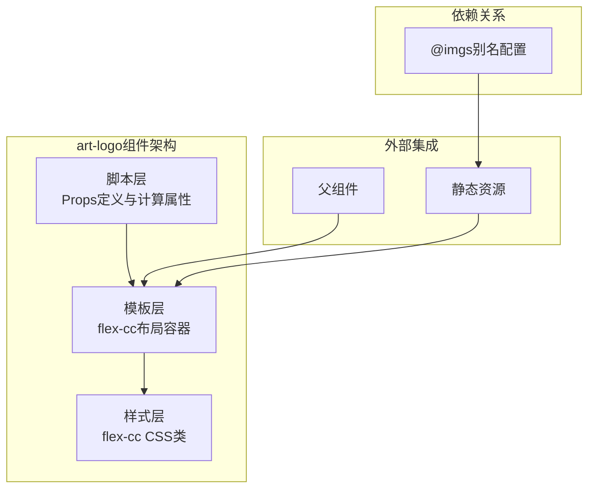
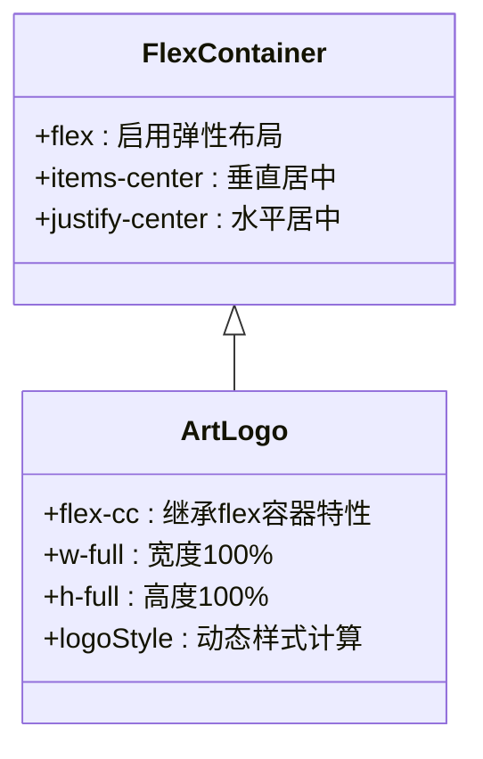
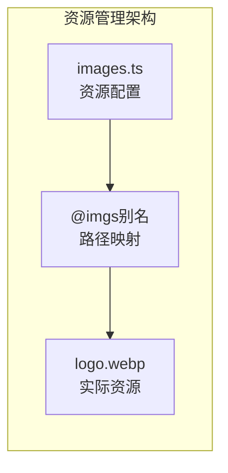

# Art Design Pro 系统Logo组件详细文档

<cite>
**本文档中引用的文件**
- [src/components/core/base/art-logo/index.vue](file://src/components/core/base/art-logo/index.vue)
- [src/config/assets/images.ts](file://src/config/assets/images.ts)
- [src/assets/styles/core/tailwind.css](file://src/assets/styles/core/tailwind.css)
- [src/assets/styles/core/mixin.scss](file://src/assets/styles/core/mixin.scss)
- [src/components/core/layouts/art-header-bar/index.vue](file://src/components/core/layouts/art-header-bar/index.vue)
- [src/components/core/layouts/art-menus/art-sidebar-menu/index.vue](file://src/components/core/layouts/art-menus/art-sidebar-menu/index.vue)
- [src/components/core/views/login/AuthTopBar.vue](file://src/components/core/views/login/AuthTopBar.vue)
- [src/components/core/views/login/LoginLeftView.vue](file://src/components/core/views/login/LoginLeftView.vue)
</cite>

## 目录
1. [简介](#简介)
2. [组件架构概览](#组件架构概览)
3. [核心属性详解](#核心属性详解)
4. [样式系统分析](#样式系统分析)
5. [使用场景与示例](#使用场景与示例)
6. [静态资源管理](#静态资源管理)
7. [响应式特性](#响应式特性)
8. [故障排除指南](#故障排除指南)
9. [最佳实践建议](#最佳实践建议)

## 简介

Art Design Pro的art-logo组件是一个轻量级的系统标识组件，专门用于在应用界面中展示品牌标识。该组件采用Vue 3 Composition API开发，支持灵活的尺寸配置，并集成了现代化的CSS类系统，确保在不同场景下都能提供一致且美观的品牌展示效果。

### 核心特性
- **灵活的尺寸控制**：支持数字和字符串类型的size属性
- **内置默认值**：size属性默认值为36像素
- **响应式设计**：自动适应容器尺寸变化
- **统一的样式规范**：基于flex-cc类实现居中布局
- **静态资源优化**：通过@imgs别名简化资源引用

## 组件架构概览

art-logo组件采用了简洁而高效的架构设计，主要包含以下核心部分：



**图表来源**
- [src/components/core/base/art-logo/index.vue](file://src/components/core/base/art-logo/index.vue#L1-L22)

**章节来源**
- [src/components/core/base/art-logo/index.vue](file://src/components/core/base/art-logo/index.vue#L1-L22)

## 核心属性详解

### size属性配置

art-logo组件的核心功能通过size属性实现，该属性允许开发者精确控制Logo的显示尺寸。

#### 属性定义结构

| 属性名 | 类型 | 默认值 | 描述 |
|--------|------|--------|------|
| size | number \| string | 36 | Logo的显示尺寸，支持数值像素或CSS单位 |

#### 默认值设置机制

组件使用Vue 3的`withDefaults`函数实现默认值设置：

```typescript
const props = withDefaults(defineProps<Props>(), {
    size: 36
})
```

这种实现方式具有以下优势：
- **类型安全**：编译时类型检查
- **默认值明确**：清晰的默认值定义
- **可扩展性**：便于后续修改和维护

#### 计算属性动态样式

组件通过`computed`属性动态生成内联样式：

```typescript
const logoStyle = computed(() => ({ width: `${props.size}px` }))
```

这种设计实现了：
- **响应式更新**：当size属性变化时自动重新计算样式
- **性能优化**：仅在必要时重新计算样式
- **灵活性**：支持各种尺寸格式

**章节来源**
- [src/components/core/base/art-logo/index.vue](file://src/components/core/base/art-logo/index.vue#L11-L20)

## 样式系统分析

### flex-cc类实现原理

art-logo组件的核心样式基于flex-cc类实现，该类是Tailwind CSS扩展的一部分：

```scss
.flex-cc {
    @apply flex items-center justify-center;
}
```

#### flex-cc类的工作机制

1. **Flex容器创建**：`flex`属性启用弹性布局
2. **垂直居中**：`items-center`实现交叉轴居中
3. **水平居中**：`justify-center`实现主轴居中

#### CSS类继承体系



**图表来源**
- [src/assets/styles/core/tailwind.css](file://src/assets/styles/core/tailwind.css#L144-L146)

### 内联样式动态生成

组件通过Vue的响应式系统实现动态样式：

```typescript
const logoStyle = computed(() => ({
    width: `${props.size}px`,
    // 其他可能的样式属性...
}))
```

这种方式的优势：
- **运行时计算**：根据props动态生成样式
- **类型安全**：TypeScript类型检查
- **性能优化**：避免不必要的样式重计算

**章节来源**
- [src/assets/styles/core/tailwind.css](file://src/assets/styles/core/tailwind.css#L144-L146)
- [src/components/core/base/art-logo/index.vue](file://src/components/core/base/art-logo/index.vue#L20)

## 使用场景与示例

### 基础使用场景

#### 1. 顶部导航栏集成

在头部导航栏中，art-logo通常作为系统标识出现在左侧：

```vue
<ArtLogo class="pl-4.5" />
```

**使用特点**：
- 添加左侧内边距以保持视觉平衡
- 通常与系统名称配合使用

#### 2. 登录页面应用

在登录页面中，art-logo作为品牌标识的核心元素：

```vue
<ArtLogo class="icon" size="46" />
```

**使用特点**：
- 明确指定尺寸以确保视觉一致性
- 作为登录表单的重要组成部分

#### 3. 侧边栏菜单集成

在侧边栏菜单中，art-logo提供系统标识：

```vue
<ArtLogo class="logo" @click="navigateToHome" />
```

**使用特点**：
- 支持点击事件以实现导航功能
- 作为菜单的视觉锚点

### 不同场景下的配置策略

| 场景 | 推荐尺寸 | 配置特点 | 注意事项 |
|------|----------|----------|----------|
| 顶部导航栏 | 36px | 默认值，适中尺寸 | 与导航元素协调 |
| 登录页面 | 46px | 突出显示 | 引导用户注意力 |
| 移动端界面 | 32px | 适应小屏幕 | 考虑触摸交互 |
| 桌面端界面 | 48px | 清晰可见 | 保持品牌识别度 |

### 自定义尺寸配置方法

#### 数字类型配置
```vue
<ArtLogo :size="48" />
<ArtLogo :size="64" />
```

#### 字符串类型配置
```vue
<ArtLogo size="5rem" />
<ArtLogo size="100%" />
```

#### 响应式配置
```vue
<ArtLogo 
    :size="isMobile ? 32 : 48" 
    class="responsive-logo"
/>
```

**章节来源**
- [src/components/core/layouts/art-header-bar/index.vue](file://src/components/core/layouts/art-header-bar/index.vue#L19-L26)
- [src/components/core/views/login/AuthTopBar.vue](file://src/components/core/views/login/AuthTopBar.vue#L7)
- [src/components/core/layouts/art-menus/art-sidebar-menu/index.vue](file://src/components/core/layouts/art-menus/art-sidebar-menu/index.vue#L13-L14)

## 静态资源管理

### @imgs别名配置

art-logo组件通过@imgs别名简化静态资源引用：

```typescript
src="@imgs/common/logo.webp"
```

### 资源配置文件结构

项目通过images.ts文件统一管理所有静态资源：



**图表来源**
- [src/config/assets/images.ts](file://src/config/assets/images.ts#L1-L62)

### 资源类型与用途

| 资源类型 | 文件位置 | 用途 | 特点 |
|----------|----------|------|------|
| 系统Logo | @imgs/common/logo.webp | 主要品牌标识 | WebP格式，优化加载速度 |
| 主题预览 | @imgs/settings/theme_styles/ | 主题切换预览 | PNG格式，高质量显示 |
| 菜单布局 | @imgs/settings/menu_layouts/ | 布局预览 | PNG格式，清晰图标 |

### 资源加载优化

1. **格式选择**：优先使用WebP格式减少文件大小
2. **别名配置**：简化路径引用，提高可维护性
3. **缓存策略**：利用浏览器缓存机制提升加载速度

**章节来源**
- [src/config/assets/images.ts](file://src/config/assets/images.ts#L1-L62)
- [src/components/core/base/art-logo/index.vue](file://src/components/core/base/art-logo/index.vue#L4)

## 响应式特性

### 响应式设计原则

art-logo组件遵循移动优先的设计原则，在不同分辨率下提供优化的显示效果：

#### 断点策略

| 分辨率范围 | Logo尺寸 | 设计考虑 | 实现方式 |
|------------|----------|----------|----------|
| ≥1400px | 36px | 标准桌面体验 | 默认配置 |
| 1180px-1399px | 36px | 平衡显示效果 | 保持默认 |
| ≤1180px | 32px | 移动端优化 | 缩小尺寸 |
| ≤768px | 28px | 触摸友好 | 进一步缩小 |

#### 响应式配置示例

```vue
<template>
  <ArtLogo 
    :size="responsiveSize"
    class="responsive-logo"
  />
</template>

<script setup>
const { width } = useWindowSize()
const responsiveSize = computed(() => {
  if (width.value <= 768) return 28
  if (width.value <= 1180) return 32
  return 36
})
</script>
```

### 性能优化策略

1. **懒加载**：在需要时才加载Logo资源
2. **缓存机制**：利用浏览器缓存减少重复加载
3. **格式优化**：使用WebP格式减少带宽消耗
4. **尺寸适配**：根据屏幕密度调整显示质量

**章节来源**
- [src/components/core/layouts/art-header-bar/index.vue](file://src/components/core/layouts/art-header-bar/index.vue#L20-L21)

## 故障排除指南

### 常见问题及解决方案

#### 1. 图片加载失败

**问题描述**：Logo图片无法正常显示

**可能原因**：
- 资源路径错误
- 文件不存在或被删除
- 网络连接问题

**解决方案**：
```typescript
// 检查资源是否存在
const logoExists = computed(() => {
  try {
    require('@imgs/common/logo.webp')
    return true
  } catch (e) {
    return false
  }
})

// 提供备用方案


```

#### 2. 尺寸异常问题

**问题描述**：Logo显示尺寸不符合预期

**诊断步骤**：
1. 检查size属性值类型
2. 验证CSS样式覆盖情况
3. 确认父容器尺寸限制

**调试代码**：
```vue
<template>
  <div>
    <pre>{{ debugInfo }}</pre>
    <ArtLogo :size="size" />
  </div>
</template>

<script setup>
const debugInfo = computed(() => ({
  size: props.size,
  computedStyle: window.getComputedStyle($refs.logo),
  parentStyle: window.getComputedStyle($refs.logo.parentElement)
}))
</script>
```

#### 3. 样式冲突问题

**问题描述**：Logo样式与其他组件产生冲突

**解决策略**：
```css
/* 使用更具体的选择器 */
.art-logo-container .art-logo {
  /* 特定样式 */
}

/* 避免全局样式污染 */
.logo-wrapper {
  all: unset;
}
```

### 性能监控指标

| 指标 | 正常范围 | 监控方法 | 优化建议 |
|------|----------|----------|----------|
| 加载时间 | <200ms | Performance API | 使用CDN加速 |
| 内存占用 | <50KB | Memory API | 优化图片格式 |
| 渲染性能 | >60fps | RAF监控 | 减少重绘次数 |

**章节来源**
- [src/components/core/base/art-logo/index.vue](file://src/components/core/base/art-logo/index.vue#L4)

## 最佳实践建议

### 开发最佳实践

#### 1. 类型安全使用
```vue
<script setup lang="ts">
interface LogoProps {
  size?: number | string
  className?: string
  onClick?: (event: MouseEvent) => void
}

defineProps<LogoProps>()
</script>
```

#### 2. 性能优化策略
```vue
<template>
  <!-- 使用v-once避免重复渲染 -->
  <ArtLogo v-once :size="size" />
  
  <!-- 使用keep-alive缓存 -->
  <keep-alive>
    <ArtLogo :size="dynamicSize" />
  </keep-alive>
</template>
```

#### 3. 可访问性考虑
```vue
<template>
  <ArtLogo 
    :size="size"
    :alt="altText || '系统标识'"
    role="img"
    aria-label="系统品牌标识"
  />
</template>
```

### 设计规范建议

#### 1. 尺寸标准化
- **标准尺寸**：36px（默认）
- **突出尺寸**：46px（重要页面）
- **紧凑尺寸**：32px（移动端）

#### 2. 颜色适配
- **亮色主题**：深色Logo
- **暗色主题**：浅色Logo
- **高对比度**：白色Logo

#### 3. 布局原则
- **留白充足**：与周围元素保持适当间距
- **对齐一致**：与其他UI元素对齐
- **层次清晰**：在视觉层次中占据合适位置

### 维护和升级建议

#### 1. 版本管理
- 使用语义化版本控制
- 保持向后兼容性
- 提供迁移指南

#### 2. 文档维护
- 更新使用示例
- 记录变更历史
- 提供API参考

#### 3. 测试策略
- 单元测试覆盖核心功能
- 端到端测试验证集成
- 性能测试确保用户体验

通过遵循这些最佳实践，可以确保art-logo组件在项目中的稳定运行和长期维护。