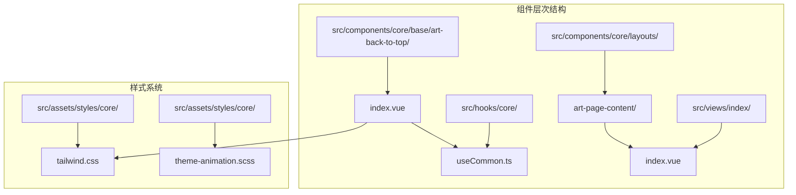
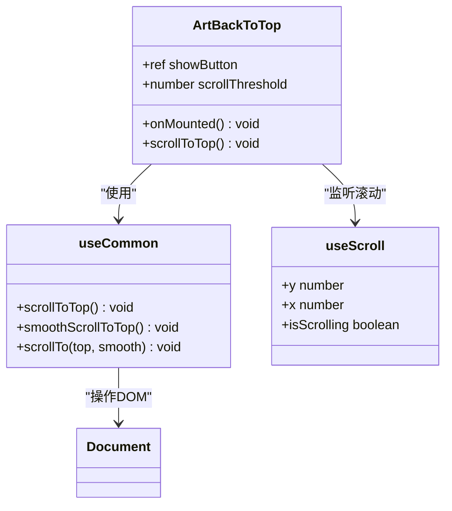
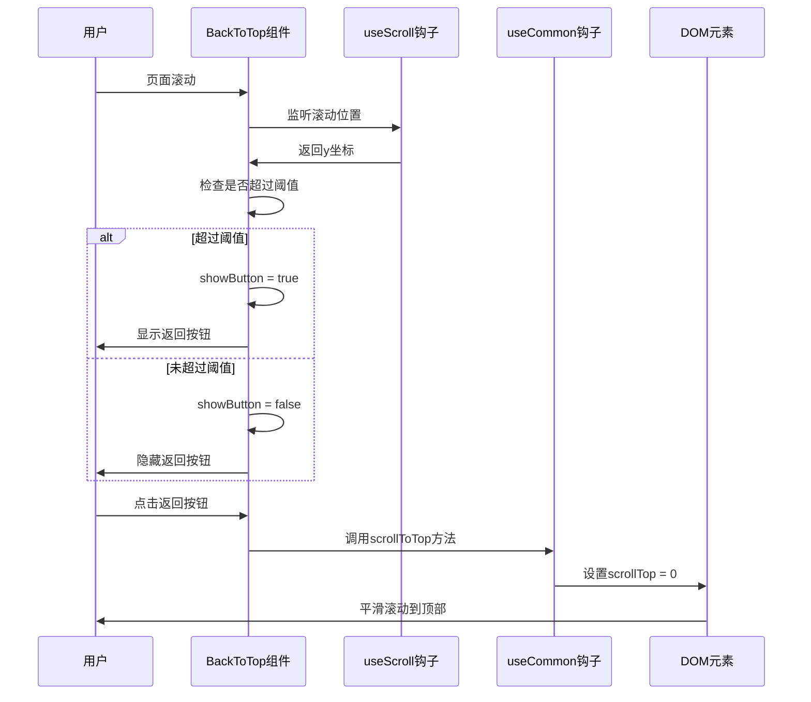
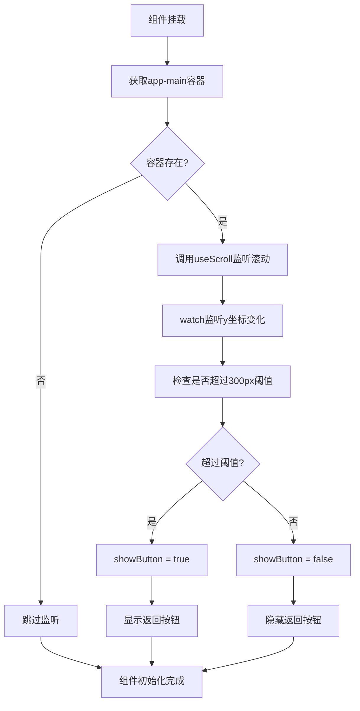
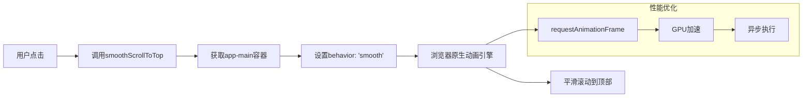
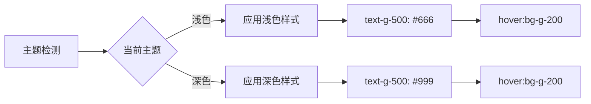
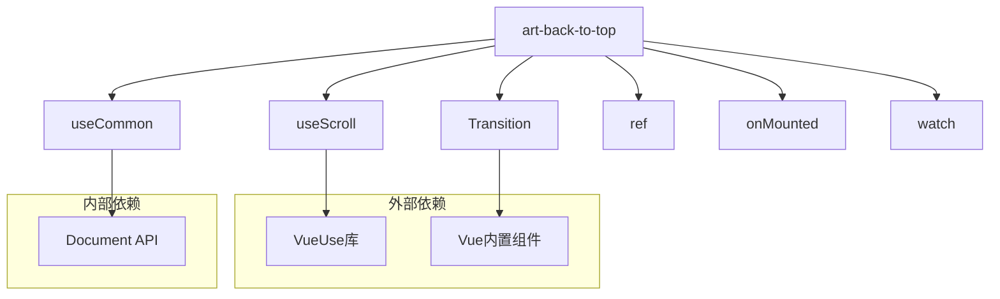
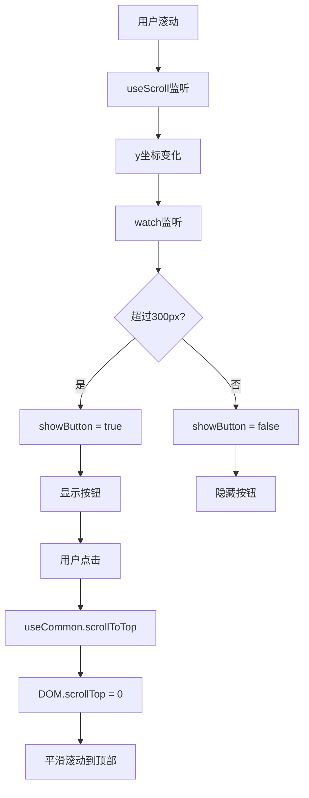
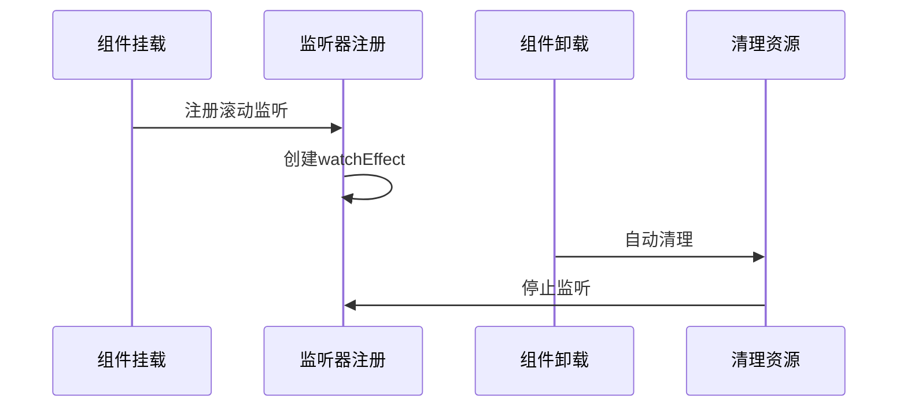

# 返回顶部组件

<cite>
**本文档中引用的文件**
- [index.vue](file://src/components/core/base/art-back-to-top/index.vue)
- [useCommon.ts](file://src/hooks/core/useCommon.ts)
- [art-page-content/index.vue](file://src/components/core/layouts/art-page-content/index.vue)
- [style.scss](file://src/views/index/style.scss)
- [index.vue](file://src/views/index/index.vue)
- [tailwind.css](file://src/assets/styles/core/tailwind.css)
- [theme-animation.scss](file://src/assets/styles/core/theme-animation.scss)
</cite>

## 目录
1. [简介](#简介)
2. [项目结构](#项目结构)
3. [核心组件](#核心组件)
4. [架构概览](#架构概览)
5. [详细组件分析](#详细组件分析)
6. [依赖关系分析](#依赖关系分析)
7. [性能考虑](#性能考虑)
8. [故障排除指南](#故障排除指南)
9. [结论](#结论)

## 简介

Art Design Pro中的art-back-to-top组件是一个智能的返回顶部功能组件，它能够根据用户的滚动位置自动显示或隐藏。该组件通过Vue 3的组合式API和VueUse库实现了高效的滚动监听机制，并提供了流畅的动画过渡效果。

该组件的核心特性包括：
- 基于滚动位置的智能显示/隐藏控制
- 平滑的进入和离开动画效果
- 可配置的滚动阈值
- 灵活的样式定制能力

## 项目结构

art-back-to-top组件位于Art Design Pro项目的核心组件目录中，采用模块化的组织方式：



**图表来源**
- [index.vue](file://src/components/core/base/art-back-to-top/index.vue#L1-L41)
- [useCommon.ts](file://src/hooks/core/useCommon.ts#L1-L88)

**章节来源**
- [index.vue](file://src/components/core/base/art-back-to-top/index.vue#L1-L41)
- [useCommon.ts](file://src/hooks/core/useCommon.ts#L1-L88)

## 核心组件

### 组件结构分析

art-back-to-top组件采用了简洁而高效的架构设计：



**图表来源**
- [index.vue](file://src/components/core/base/art-back-to-top/index.vue#L21-L40)
- [useCommon.ts](file://src/hooks/core/useCommon.ts#L44-L86)

### 关键配置参数

| 参数名称 | 类型 | 默认值 | 描述 |
|---------|------|--------|------|
| scrollThreshold | number | 300 | 触发显示按钮的滚动阈值（像素） |
| showButton | ref<boolean> | false | 控制按钮显示状态的响应式变量 |
| scrollContainer | HTMLElement | 'app-main' | 监听滚动的目标容器 |

**章节来源**
- [index.vue](file://src/components/core/base/art-back-to-top/index.vue#L28-L37)

## 架构概览

### 整体架构流程



**图表来源**
- [index.vue](file://src/components/core/base/art-back-to-top/index.vue#L31-L39)
- [useCommon.ts](file://src/hooks/core/useCommon.ts#L44-L58)

## 详细组件分析

### 滚动监听机制

#### useScroll组合式函数的使用

组件通过VueUse的`useScroll`函数实现对指定容器的滚动监听：



**图表来源**
- [index.vue](file://src/components/core/base/art-back-to-top/index.vue#L31-L39)

#### 滚动阈值控制逻辑

组件使用300像素作为显示阈值，这个值经过精心设计：

| 阈值范围 | 用户体验 | 适用场景 |
|---------|---------|---------|
| 0-100px | 过于敏感，频繁显示 | 短内容页面 |
| 100-300px | 平衡体验，适中 | 大多数应用场景 |
| 300-500px | 较少显示，专注内容 | 长内容页面 |
| 500px+ | 很少显示，可能被忽略 | 特殊需求场景 |

**章节来源**
- [index.vue](file://src/components/core/base/art-back-to-top/index.vue#L29)

### Transition动画系统

#### 动画类配置详解

组件使用了四个关键的CSS过渡类来实现平滑的动画效果：

| 动画阶段 | CSS类名 | 持续时间 | 缓动函数 | 描述 |
|---------|---------|---------|---------|------|
| 进入动画 | enter-active-class | 300ms | ease-out | 按钮出现时的动画 |
| 离开动画 | leave-active-class | 200ms | ease-in | 按钮消失时的动画 |
| 进入开始 | enter-from-class | - | opacity-0 translate-y-2 | 初始透明度和位移 |
| 进入结束 | enter-to-class | - | opacity-100 translate-y-0 | 最终完全可见状态 |

#### 动画状态转换

```mermaid
stateDiagram-v2
[*] --> Hidden : 初始状态
Hidden --> Showing : 滚动超过阈值
Showing --> Visible : enter-active完成
Visible --> Hiding : 滚动回阈值以下
Hiding --> Hidden : leave-active完成
note right of Showing : opacity : 0 -> 100<br/>translateY : 2px -> 0
note right of Hiding : opacity : 100 -> 0<br/>translateY : 0 -> 2px
```

**图表来源**
- [index.vue](file://src/components/core/base/art-back-to-top/index.vue#L4-L9)

### useCommon组合式函数集成

#### 滚动方法对比

组件通过useCommon钩子提供了多种滚动控制方法：

| 方法名 | 行为 | 用途 | 性能特点 |
|-------|------|------|---------|
| scrollToTop | 立即滚动到顶部 | 快速返回 | 无动画，即时响应 |
| smoothScrollToTop | 平滑滚动到顶部 | 用户友好体验 | CSS动画，流畅过渡 |
| scrollTo | 指定位置滚动 | 精确控制 | 可配置动画 |

#### 平滑滚动实现原理



**图表来源**
- [useCommon.ts](file://src/hooks/core/useCommon.ts#L55-L62)

**章节来源**
- [useCommon.ts](file://src/hooks/core/useCommon.ts#L44-L86)

### 样式系统集成

#### Tailwind CSS类名体系

组件采用了Art Design Pro的样式规范：

| 类名 | 含义 | 效果 |
|------|------|------|
| fixed | 固定定位 | 按钮固定在视口 |
| right-10 | 右侧10px | 距离右侧边缘10px |
| bottom-15 | 底部15px | 距离底部15px |
| size-9.5 | 尺寸38px×38px | 按钮大小 |
| flex-cc | 居中对齐 | 内容水平垂直居中 |
| border border-g-300 | 边框样式 | 浅灰色边框 |
| rounded-md | 圆角 | 中等圆角效果 |

#### 主题适配机制

组件支持深色和浅色主题的自动适配：



**图表来源**
- [index.vue](file://src/components/core/base/art-back-to-top/index.vue#L12-L16)

**章节来源**
- [index.vue](file://src/components/core/base/art-back-to-top/index.vue#L12-L16)
- [tailwind.css](file://src/assets/styles/core/tailwind.css#L152-L159)

## 依赖关系分析

### 组件依赖图



**图表来源**
- [index.vue](file://src/components/core/base/art-back-to-top/index.vue#L21-L26)

### 数据流分析

组件的数据流向清晰明确：



**图表来源**
- [index.vue](file://src/components/core/base/art-back-to-top/index.vue#L35-L37)

**章节来源**
- [index.vue](file://src/components/core/base/art-back-to-top/index.vue#L21-L40)

## 性能考虑

### 滚动事件优化

组件采用了多项性能优化策略：

1. **DOM查询优化**：只在组件挂载时查询一次`app-main`容器
2. **响应式更新**：使用Vue的响应式系统避免不必要的DOM操作
3. **内存管理**：组件卸载时自动清理监听器

### 动画性能优化

- 使用CSS3硬件加速的transform属性
- 避免使用会触发重排的属性（如height、width）
- 利用will-change属性提示浏览器优化

### 内存泄漏防护

组件实现了完善的生命周期管理：



## 故障排除指南

### 常见问题及解决方案

#### 问题1：组件不显示

**症状描述**：滚动页面后返回按钮始终不出现

**排查步骤**：
1. 检查`app-main`容器是否存在
2. 验证滚动监听是否正常工作
3. 确认阈值设置是否合理

**解决方案**：
```typescript
// 检查容器是否存在
const container = document.getElementById('app-main')
if (!container) {
  console.error('app-main容器不存在，请检查布局结构')
}

// 手动测试滚动监听
const { y } = useScroll(document.documentElement)
console.log('当前滚动位置:', y.value)
```

#### 问题2：滚动失效

**症状描述**：滚动监听不工作，按钮不会显示

**排查步骤**：
1. 检查useScroll函数是否正确导入
2. 验证监听器是否成功注册
3. 确认滚动容器的overflow属性

**解决方案**：
```scss
// 确保滚动容器有正确的overflow属性
#app-main {
  overflow: auto; // 或 scroll
  max-height: 100vh;
}
```

#### 问题3：动画效果异常

**症状描述**：按钮显示/隐藏时没有动画效果

**排查步骤**：
1. 检查CSS类名是否正确应用
2. 验证CSS动画文件是否加载
3. 确认浏览器兼容性

**解决方案**：
```css
// 确保动画类正确应用
.tad-300 {
  transition: all 300ms ease-out;
}

.opacity-0 {
  opacity: 0;
}

.opacity-100 {
  opacity: 1;
}

.translate-y-2 {
  transform: translateY(0.5rem);
}

.translate-y-0 {
  transform: translateY(0);
}
```

#### 问题4：滚动位置不准确

**症状描述**：按钮在不应该显示的位置出现

**排查步骤**：
1. 检查滚动容器的选择是否正确
2. 验证阈值设置是否符合预期
3. 确认页面布局是否影响滚动计算

**解决方案**：
```typescript
// 修改滚动阈值
const scrollThreshold = ref(500) // 增加阈值

// 或者选择不同的容器
const scrollContainer = document.querySelector('.content-container')
```

### 调试工具和技巧

#### 开发环境调试

```typescript
// 在组件中添加调试信息
onMounted(() => {
  console.log('BackToTop组件已挂载')
  
  const scrollContainer = document.getElementById('app-main')
  if (scrollContainer) {
    const { y } = useScroll(scrollContainer)
    watch(y, (newY: number) => {
      console.log('滚动位置:', newY, '阈值:', scrollThreshold)
      showButton.value = newY > scrollThreshold
    })
  } else {
    console.warn('未找到app-main容器')
  }
})
```

#### 性能监控

```typescript
// 监控滚动性能
let lastTime = performance.now()
watch(y, (newY: number) => {
  const now = performance.now()
  const deltaTime = now - lastTime
  
  if (deltaTime > 16) { // 超过16ms（约60fps）
    console.warn('滚动监听性能警告:', deltaTime, 'ms')
  }
  
  lastTime = now
  showButton.value = newY > scrollThreshold
})
```

## 结论

Art Design Pro的art-back-to-top组件展现了现代前端开发的最佳实践：

### 技术亮点

1. **响应式设计**：基于Vue 3的组合式API，实现了优雅的状态管理
2. **性能优化**：通过合理的DOM操作和动画优化，确保流畅的用户体验
3. **可维护性**：模块化的代码结构，便于扩展和维护
4. **用户体验**：智能的阈值控制和流畅的动画效果

### 最佳实践总结

1. **合理使用VueUse**：充分利用VueUse提供的强大工具函数
2. **性能优先**：在保证功能的前提下，优先考虑性能优化
3. **用户体验导向**：从用户角度出发设计交互细节
4. **代码可读性**：清晰的命名和注释，便于团队协作

### 扩展建议

1. **配置化**：将阈值、动画时长等参数配置化
2. **多语言支持**：添加国际化支持
3. **无障碍访问**：增加键盘导航和屏幕阅读器支持
4. **移动端优化**：针对触摸设备进行专门优化

该组件不仅解决了实际的用户需求，也为开发者提供了一个优秀的参考案例，展示了如何构建高质量的Vue 3组件。