# Art Design Pro 图片裁剪组件技术文档

<cite>
**本文档引用的文件**
- [index.vue](file://src/components/core/media/art-cutter-img/index.vue)
- [image-crop/index.vue](file://src/views/widgets/image-crop/index.vue)
- [package.json](file://package.json)
- [app.scss](file://src/assets/styles/core/app.scss)
- [el-ui.scss](file://src/assets/styles/core/el-ui.scss)
- [dark.scss](file://src/assets/styles/core/dark.scss)
</cite>

## 目录
1. [简介](#简介)
2. [项目结构](#项目结构)
3. [核心组件](#核心组件)
4. [架构概览](#架构概览)
5. [详细组件分析](#详细组件分析)
6. [配置属性详解](#配置属性详解)
7. [事件回调机制](#事件回调机制)
8. [样式定制方案](#样式定制方案)
9. [最佳实践建议](#最佳实践建议)
10. [故障排除指南](#故障排除指南)
11. [总结](#总结)

## 简介

Art Design Pro 的 art-cutter-img 图片裁剪组件是一个基于 vue-img-cutter 库构建的强大图像处理工具。该组件提供了完整的图片裁剪功能，包括裁剪区域控制、比例锁定、尺寸调整、图片缩放与移动等交互功能。组件支持多种配置选项，具备完善的事件回调机制，并提供了灵活的样式定制方案。

### 主要特性

- **基于 vue-img-cutter 库**：利用成熟的第三方库实现专业级图片裁剪功能
- **丰富的配置选项**：支持容器尺寸、裁剪尺寸、文件格式、质量等多维度配置
- **完善的事件系统**：提供裁剪完成、预览、加载状态等完整事件回调
- **响应式设计**：支持动态图片URL更新和预加载机制
- **样式定制能力**：通过 deep 选择器支持深度样式覆盖
- **主题适配**：内置暗色主题支持和自适应样式

## 项目结构

art-cutter-img 组件位于项目的媒体组件目录下，采用标准的 Vue 3 Composition API 架构：

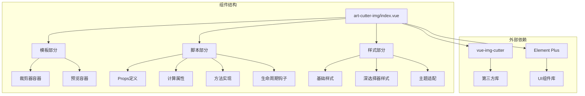

**图表来源**
- [index.vue](file://src/components/core/media/art-cutter-img/index.vue#L1-L351)

**章节来源**
- [index.vue](file://src/components/core/media/art-cutter-img/index.vue#L1-L50)

## 核心组件

### 组件架构设计

art-cutter-img 组件采用了模块化的架构设计，将功能划分为清晰的层次：

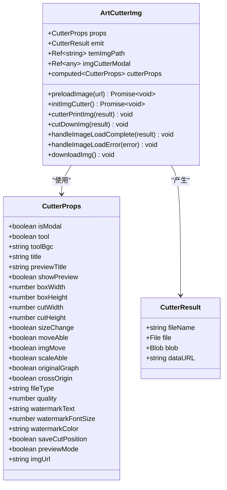

**图表来源**
- [index.vue](file://src/components/core/media/art-cutter-img/index.vue#L52-L120)

### 核心数据流

组件的数据流设计遵循单向数据流原则，确保状态管理的可预测性：

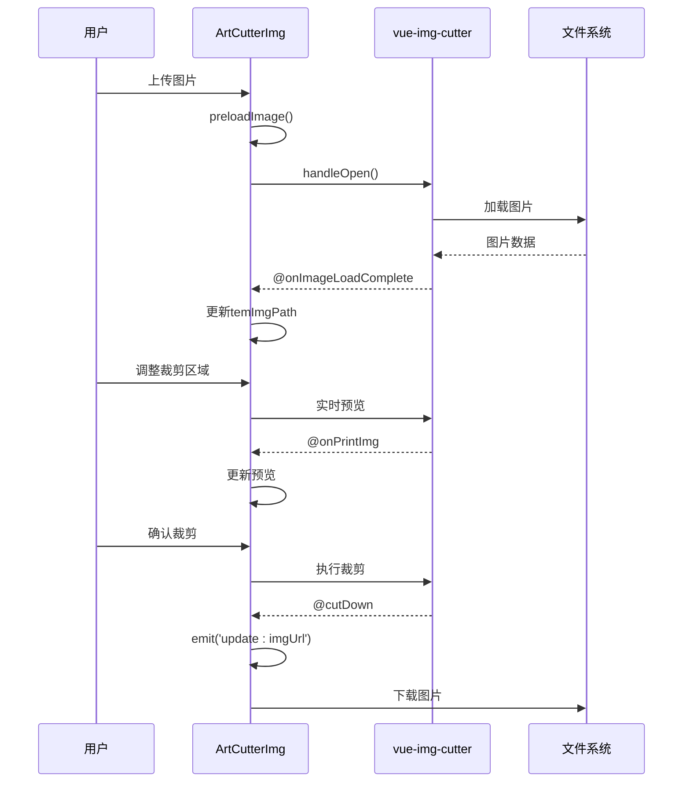

**图表来源**
- [index.vue](file://src/components/core/media/art-cutter-img/index.vue#L172-L251)

**章节来源**
- [index.vue](file://src/components/core/media/art-cutter-img/index.vue#L47-L120)

## 架构概览

### 技术栈分析

art-cutter-img 组件基于现代前端技术栈构建，展现了良好的技术架构：

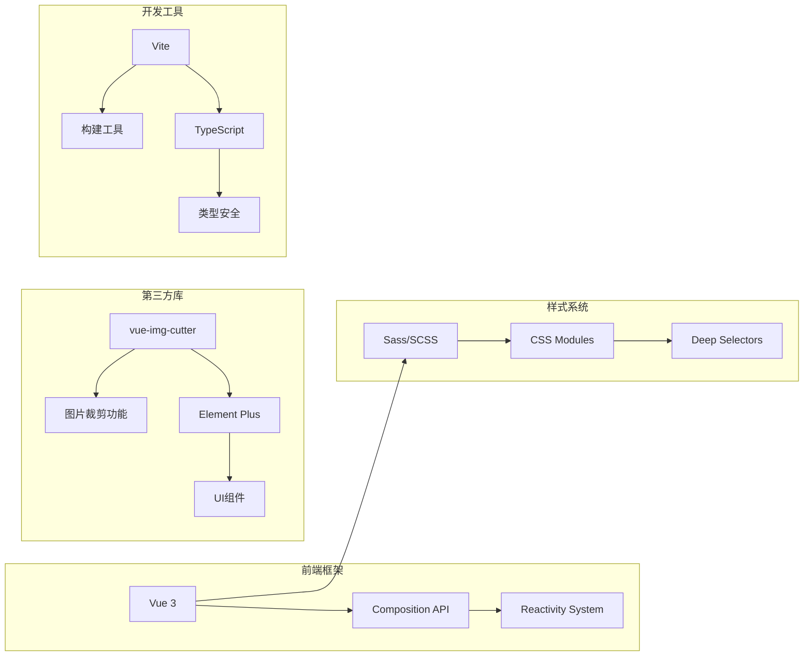

### 组件通信机制

组件采用 Vue 3 的组合式 API 设计，实现了清晰的组件间通信：

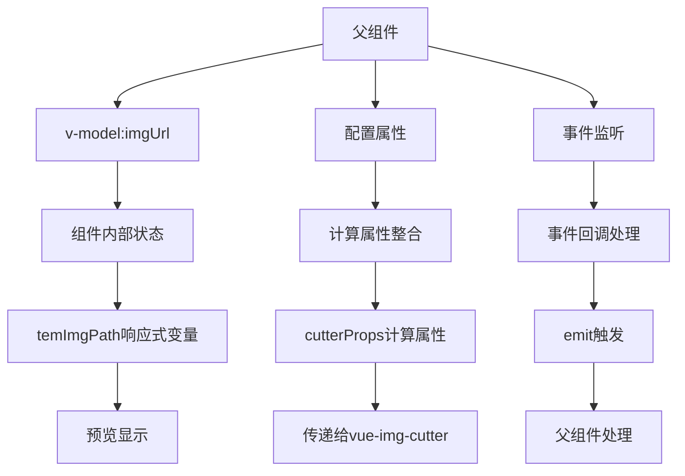

**图表来源**
- [index.vue](file://src/components/core/media/art-cutter-img/index.vue#L159-L171)

**章节来源**
- [index.vue](file://src/components/core/media/art-cutter-img/index.vue#L1-L46)

## 详细组件分析

### 核心功能模块

#### 1. 图片预加载机制

组件实现了智能的图片预加载功能，确保用户体验的流畅性：

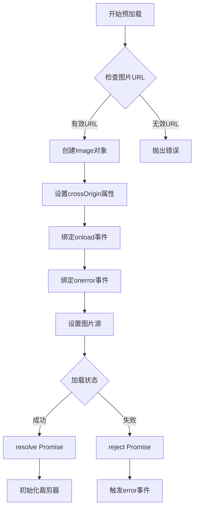

**图表来源**
- [index.vue](file://src/components/core/media/art-cutter-img/index.vue#L172-L181)

#### 2. 响应式状态管理

组件使用 Vue 3 的响应式系统管理状态，确保数据的一致性和可追踪性：

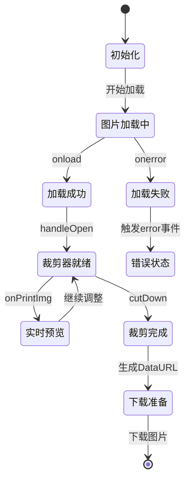

**图表来源**
- [index.vue](file://src/components/core/media/art-cutter-img/index.vue#L183-L251)

#### 3. 水印配置整合

组件通过计算属性巧妙地将水印配置整合到第三方库的属性中：

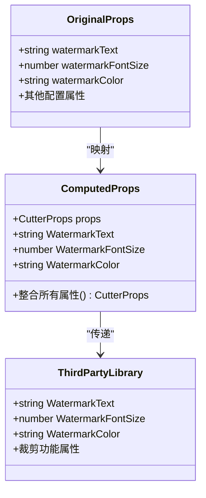

**图表来源**
- [index.vue](file://src/components/core/media/art-cutter-img/index.vue#L164-L169)

**章节来源**
- [index.vue](file://src/components/core/media/art-cutter-img/index.vue#L161-L251)

## 配置属性详解

### 属性分类体系

art-cutter-img 组件提供了全面的配置选项，按功能分为以下几大类：

| **属性类别** | **属性名称** | **类型** | **默认值** | **说明** |
|--------------|--------------|----------|------------|----------|
| **基础配置** | isModal | boolean | false | 是否以模态框形式显示 |
| | tool | boolean | true | 是否显示工具栏 |
| | toolBgc | string | '#fff' | 工具栏背景色 |
| | title | string | '' | 主标题文本 |
| | previewTitle | string | '' | 预览标题文本 |
| | showPreview | boolean | true | 是否显示预览区域 |
| **尺寸相关** | boxWidth | number | 700 | 容器宽度 |
| | boxHeight | number | 458 | 容器高度 |
| | cutWidth | number | 470 | 裁剪区域宽度 |
| | cutHeight | number | 270 | 裁剪区域高度 |
| | sizeChange | boolean | true | 是否允许调整大小 |
| **移动和缩放** | moveAble | boolean | true | 是否允许移动裁剪框 |
| | imgMove | boolean | true | 是否允许图片移动 |
| | scaleAble | boolean | true | 是否允许缩放 |
| **图片相关** | originalGraph | boolean | true | 是否显示原始图片 |
| | crossOrigin | boolean | true | 是否允许跨域访问 |
| | fileType | string | 'png' | 输出文件类型 |
| | quality | number | 0.9 | 图片质量（0-1） |
| **水印配置** | watermarkText | string | '' | 水印文本内容 |
| | watermarkFontSize | number | 20 | 水印字体大小 |
| | watermarkColor | string | '#ffffff' | 水印颜色 |
| **其他功能** | saveCutPosition | boolean | true | 是否保存裁剪位置 |
| | previewMode | boolean | true | 是否启用预览模式 |
| | imgUrl | string | undefined | 初始图片URL |

### 默认值设计原理

组件的默认值设计遵循以下原则：

1. **用户体验优先**：提供合理的默认尺寸和功能开关
2. **兼容性考虑**：确保在不同设备上的良好表现
3. **性能平衡**：在质量和性能之间找到最佳平衡点
4. **易用性导向**：减少用户配置负担

**章节来源**
- [index.vue](file://src/components/core/media/art-cutter-img/index.vue#L122-L157)

## 事件回调机制

### 事件系统架构

art-cutter-img 组件实现了完整的事件回调机制，为父组件提供丰富的状态反馈：

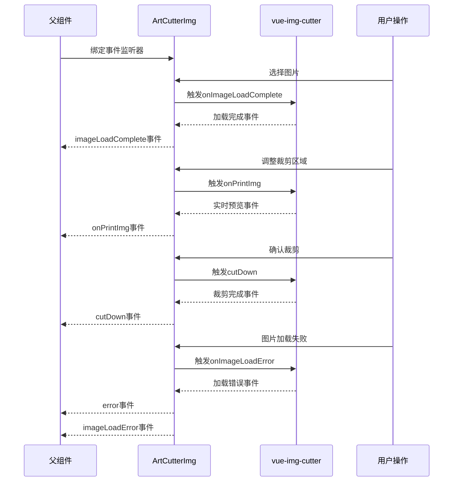

**图表来源**
- [index.vue](file://src/components/core/media/art-cutter-img/index.vue#L8-L16)

### 事件处理函数详解

#### 1. @cutDown（裁剪完成）

当用户完成图片裁剪后触发此事件，返回裁剪后的图片数据：

- **触发时机**：用户点击确认按钮完成裁剪
- **返回数据**：包含文件名、File对象、Blob对象和DataURL的CutterResult对象
- **用途**：用于更新父组件的图片URL状态

#### 2. @onPrintImg（实时预览）

在用户调整裁剪区域时实时触发，提供预览效果：

- **触发时机**：裁剪区域发生变化时
- **返回数据**：包含DataURL的预览结果对象
- **用途**：更新预览区域的显示内容

#### 3. @onImageLoadComplete（加载成功）

图片成功加载到裁剪器中时触发：

- **触发时机**：图片资源完全加载完成
- **返回数据**：加载结果对象，包含URL、宽度、高度等信息
- **用途**：通知父组件图片加载状态

#### 4. @onImageLoadError（加载失败）

图片加载失败时触发：

- **触发时机**：图片加载过程中发生错误
- **返回数据**：错误对象
- **用途**：通知父组件处理加载错误

#### 5. @onClearAll（清除所有）

当用户清除所有裁剪操作时触发：

- **触发时机**：用户点击清除按钮
- **返回数据**：无返回值
- **用途**：重置组件状态

### 事件发射逻辑

组件通过 emit 方法实现事件发射，确保父子组件间的通信：

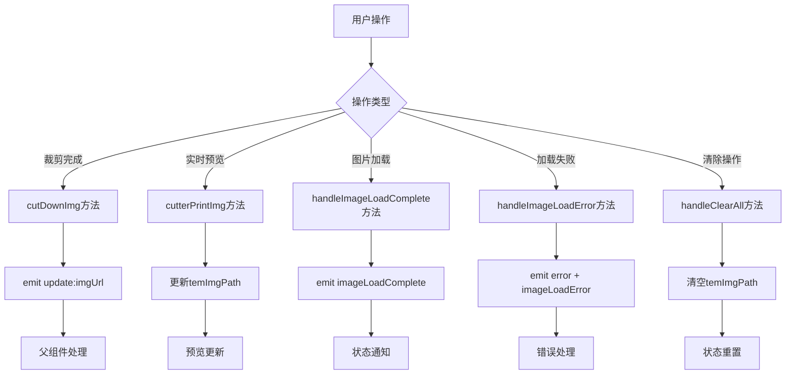

**图表来源**
- [index.vue](file://src/components/core/media/art-cutter-img/index.vue#L218-L242)

**章节来源**
- [index.vue](file://src/components/core/media/art-cutter-img/index.vue#L8-L16)

## 样式定制方案

### 深层样式覆盖策略

art-cutter-img 组件提供了强大的样式定制能力，通过 deep 选择器实现对第三方组件样式的精确控制：

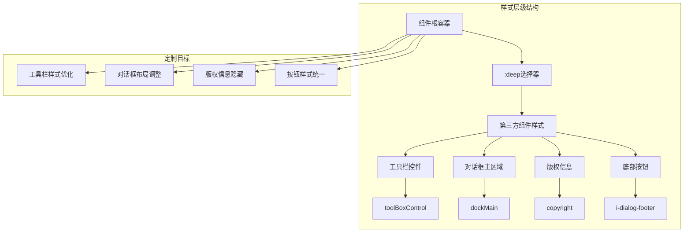

**图表来源**
- [index.vue](file://src/components/core/media/art-cutter-img/index.vue#L285-L328)

### 主题适配机制

#### 暗色主题支持

组件内置了完整的暗色主题适配，确保在不同主题下都能提供良好的视觉体验：

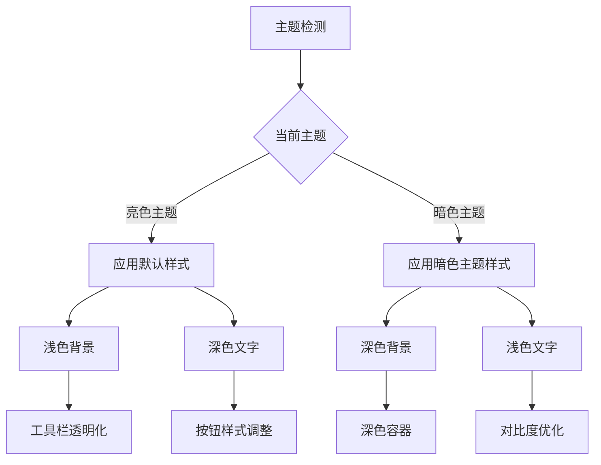

**图表来源**
- [index.vue](file://src/components/core/media/art-cutter-img/index.vue#L332-L349)

#### 自定义CSS变量

组件充分利用了CSS变量系统，提供了灵活的主题定制能力：

| **CSS变量** | **用途** | **默认值** | **说明** |
|-------------|----------|------------|----------|
| `--art-active-color` | 预览区域背景色 | 未定义 | 使用系统主题变量 |
| `--el-color-primary` | 主色调 | Element Plus主题色 | 继承Element Plus主题 |
| `--el-color-primary-light-9` | 按钮背景色 | 动态计算 | 浅色主题下的按钮色 |
| `--el-color-primary-light-4` | 按钮边框色 | 动态计算 | 浅色主题下的边框色 |

### 样式定制最佳实践

#### 1. 深层选择器使用规范

```scss
// 正确的深层选择器使用方式
.cutter-container {
  :deep(.toolBoxControl) {
    z-index: 100;
  }
  
  :deep(.dockMain) {
    right: 0;
    bottom: -40px;
    left: 0;
    z-index: 10;
    padding: 0;
    background-color: transparent !important;
    opacity: 1;
  }
  
  :deep(.copyright) {
    display: none !important;
  }
}
```

#### 2. 响应式设计考虑

组件的样式设计充分考虑了响应式需求，确保在不同屏幕尺寸下的良好表现：

- **弹性布局**：使用flex布局实现组件的自适应排列
- **相对单位**：大量使用百分比和相对单位确保尺寸的灵活性
- **媒体查询**：在必要时使用媒体查询进行特殊处理

#### 3. 性能优化策略

- **样式分离**：将第三方组件样式与自定义样式分离，避免不必要的样式冲突
- **选择器优化**：使用具体的选择器避免样式污染
- **条件样式**：根据主题状态动态应用不同的样式规则

**章节来源**
- [index.vue](file://src/components/core/media/art-cutter-img/index.vue#L254-L351)

## 最佳实践建议

### 跨域图片处理

#### CORS配置要求

由于组件支持跨域图片加载，需要确保服务器正确配置CORS：

```javascript
// 推荐的CORS配置示例
const corsHeaders = {
  'Access-Control-Allow-Origin': '*',  // 允许所有域名访问
  'Access-Control-Allow-Methods': 'GET, OPTIONS',
  'Access-Control-Allow-Headers': 'Content-Type'
}
```

#### 安全性考虑

- **验证图片来源**：在加载前验证图片URL的安全性
- **限制域名范围**：生产环境中限制允许的域名范围
- **使用HTTPS**：优先使用HTTPS协议确保传输安全

### 内存泄漏防范

#### 图片资源管理

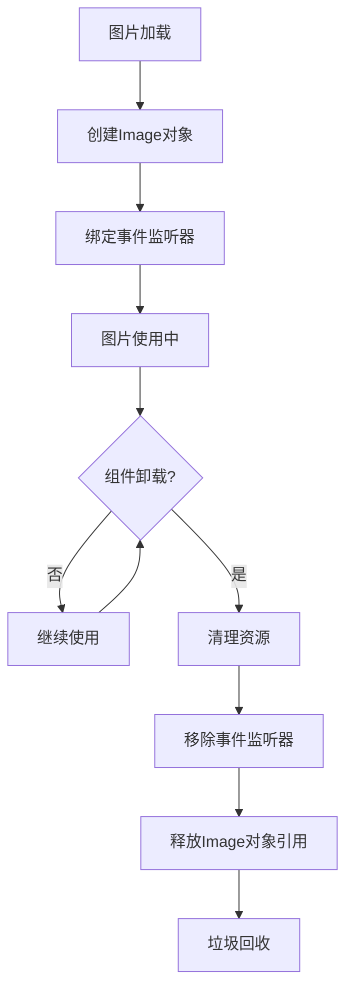

#### 实践建议

1. **及时清理**：在组件卸载时及时清理图片资源
2. **避免循环引用**：确保图片对象没有循环引用
3. **监控内存使用**：在开发环境中监控内存使用情况

### Blob与DataURL转换

#### 性能优化策略

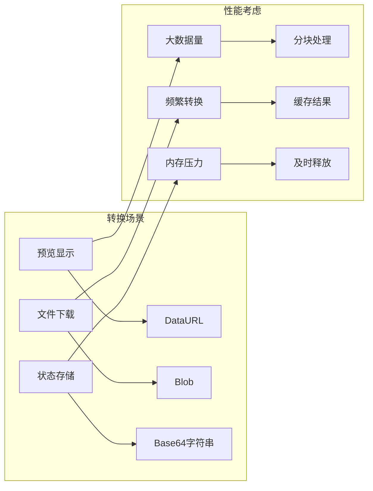

#### 实现建议

1. **合理使用DataURL**：对于小图片使用DataURL，对于大图片考虑使用Blob
2. **及时释放资源**：不再需要的图片数据应及时释放
3. **批量处理**：对于多个图片的操作，考虑批量处理以提高效率

### 错误处理策略

#### 分层错误处理

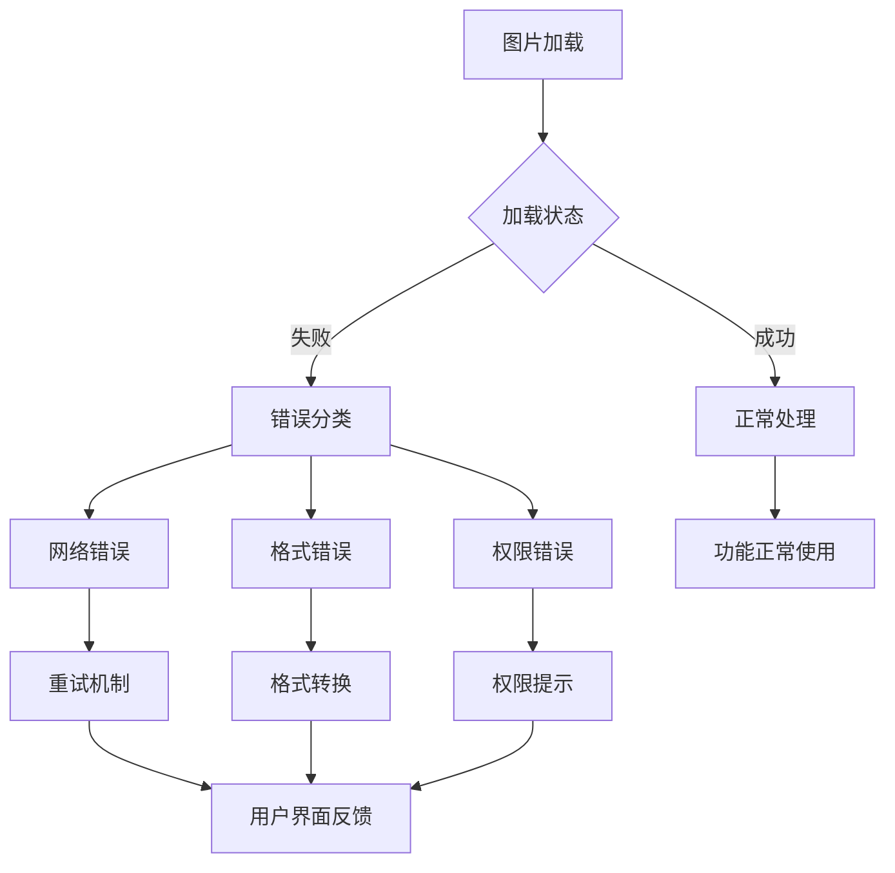

#### 错误恢复机制

1. **自动重试**：对于临时性错误提供自动重试机制
2. **降级处理**：在主要功能不可用时提供降级方案
3. **用户引导**：提供清晰的错误信息和解决建议

**章节来源**
- [index.vue](file://src/components/core/media/art-cutter-img/index.vue#L172-L251)

## 故障排除指南

### 常见问题诊断

#### 1. 图片无法加载

**症状表现**：
- 图片显示为空白或加载失败
- 控制台出现跨域错误
- 加载超时

**排查步骤**：
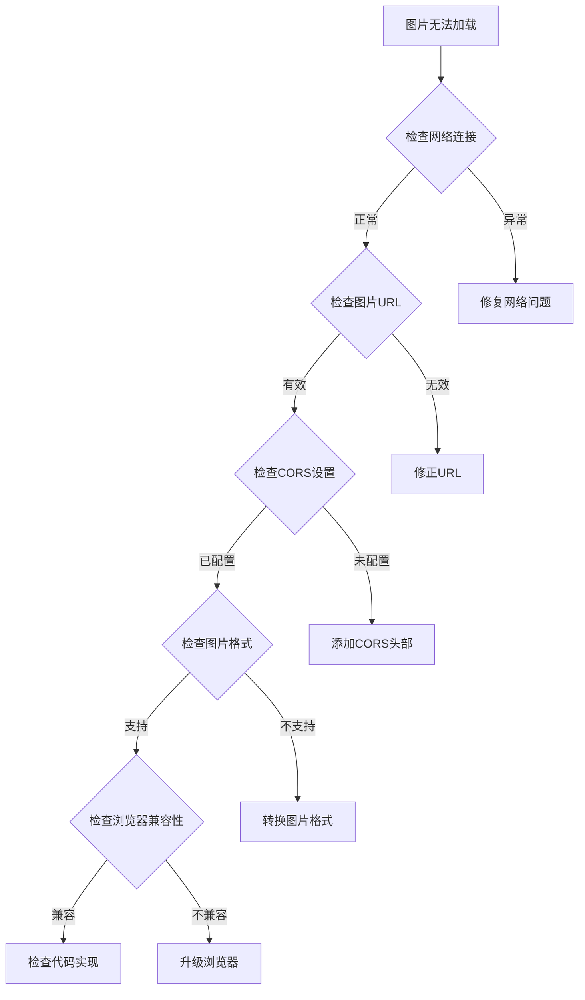

**解决方案**：
1. 确保图片URL有效且可访问
2. 配置正确的CORS头部
3. 检查图片格式是否被支持
4. 验证浏览器兼容性

#### 2. 裁剪功能异常

**症状表现**：
- 裁剪框无法拖动
- 缩放功能失效
- 裁剪结果不准确

**排查方法**：
1. 检查组件配置是否正确
2. 验证第三方库版本兼容性
3. 确认事件监听器是否正常工作

#### 3. 样式显示问题

**症状表现**：
- 第三方组件样式被覆盖
- 暗色主题适配不良
- 响应式布局异常

**解决方案**：
1. 检查deep选择器的使用
2. 验证CSS变量的定义
3. 确认媒体查询的设置

### 性能优化建议

#### 1. 图片处理优化

- **压缩预处理**：在上传前对图片进行适当压缩
- **懒加载**：对于大量图片采用懒加载策略
- **缓存机制**：实现图片缓存减少重复加载

#### 2. 内存管理

- **及时清理**：组件卸载时清理所有资源
- **对象池**：对于频繁创建的对象使用对象池
- **监控告警**：建立内存使用监控机制

#### 3. 网络优化

- **CDN加速**：使用CDN加速图片加载
- **预加载策略**：实现智能预加载机制
- **错误重试**：建立可靠的错误重试机制

**章节来源**
- [index.vue](file://src/components/core/media/art-cutter-img/index.vue#L233-L242)

## 总结

art-cutter-img 图片裁剪组件是 Art Design Pro 项目中的一个重要组成部分，它成功地将第三方库的功能与项目的设计理念相结合，提供了强大而灵活的图片处理能力。

### 核心优势

1. **技术架构先进**：采用 Vue 3 Composition API 和现代前端技术栈
2. **功能完整丰富**：涵盖了图片裁剪的所有核心功能
3. **配置灵活多样**：提供了全面的配置选项满足不同需求
4. **事件系统完善**：建立了完整的事件回调机制
5. **样式定制能力强**：支持深度样式覆盖和主题适配

### 应用价值

该组件不仅解决了实际的业务需求，更为项目团队提供了可复用的高质量组件模板。其设计理念和实现方式可以作为其他复杂组件开发的参考范例。

### 发展方向

随着前端技术的不断发展，该组件可以在以下方面进一步优化：

1. **性能优化**：持续优化图片处理的性能表现
2. **功能扩展**：增加更多高级裁剪功能
3. **兼容性提升**：增强对新浏览器特性的支持
4. **用户体验改进**：提供更加直观和友好的用户界面

通过持续的迭代和完善，art-cutter-img 组件将继续为 Art Design Pro 项目提供稳定可靠的服务，成为项目中不可或缺的重要组成部分。