# 媒体组件

<cite>
**本文档中引用的文件**
- [src/components/core/media/art-cutter-img/index.vue](file://src/components/core/media/art-cutter-img/index.vue)
- [src/components/core/media/art-video-player/index.vue](file://src/components/core/media/art-video-player/index.vue)
- [src/views/widgets/image-crop/index.vue](file://src/views/widgets/image-crop/index.vue)
- [src/views/widgets/video/index.vue](file://src/views/widgets/video/index.vue)
- [src/views/widgets/watermark/index.vue](file://src/views/widgets/watermark/index.vue)
- [src/components/core/others/art-watermark/index.vue](file://src/components/core/others/art-watermark/index.vue)
- [package.json](file://package.json)
- [src/utils/sys/error-handle.ts](file://src/utils/sys/error-handle.ts)
- [src/utils/ui/loading.ts](file://src/utils/ui/loading.ts)
- [src/utils/table/tableCache.ts](file://src/utils/table/tableCache.ts)
- [src/hooks/core/useTable.ts](file://src/hooks/core/useTable.ts)
</cite>

## 目录
1. [简介](#简介)
2. [项目结构](#项目结构)
3. [art-cutter-img 图片裁剪组件](#art-cutter-img-图片裁剪组件)
4. [art-video-player 视频播放器组件](#art-video-player-视频播放器组件)
5. [组件架构概览](#组件架构概览)
6. [详细组件分析](#详细组件分析)
7. [性能优化策略](#性能优化策略)
8. [可访问性支持](#可访问性支持)
9. [故障排除指南](#故障排除指南)
10. [总结](#总结)

## 简介

Art Design Pro 提供了两个专业的媒体处理组件：art-cutter-img 图片裁剪组件和art-video-player 视频播放器组件。这些组件专为现代Web应用设计，提供了强大的媒体处理能力，支持多种格式和自定义配置，广泛应用于内容管理系统、用户上传功能和多媒体展示场景。

## 项目结构

媒体组件位于项目的特定目录结构中，体现了清晰的模块化设计：

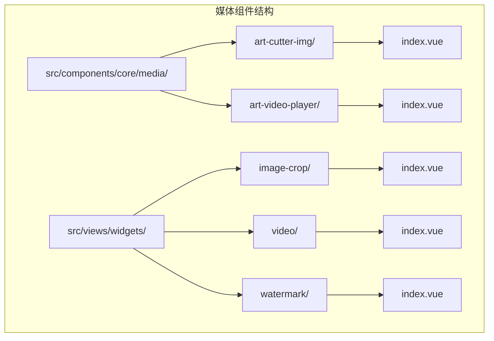
```mermaid
graph TB
subgraph "媒体组件结构"
A[src/components/core/media/] --> B[art-cutter-img/]
A --> C[art-video-player/]
B --> D[index.vue]
C --> E[index.vue]
F[src/views/widgets/] --> G[image-crop/]
F --> H[video/]
F --> I[watermark/]
G --> J[index.vue]
H --> K[index.vue]
I --> L[index.vue]
end
```

**图表来源**
- [src/components/core/media/art-cutter-img/index.vue](file://src/components/core/media/art-cutter-img/index.vue#L1-L351)
- [src/components/core/media/art-video-player/index.vue](file://src/components/core/media/art-video-player/index.vue#L1-L112)

**章节来源**
- [src/components/core/media/art-cutter-img/index.vue](file://src/components/core/media/art-cutter-img/index.vue#L1-L50)
- [src/components/core/media/art-video-player/index.vue](file://src/components/core/media/art-video-player/index.vue#L1-L50)

## art-cutter-img 图片裁剪组件

### 组件概述

art-cutter-img 是基于 vue-img-cutter 的专业图片裁剪组件，提供了完整的图片编辑功能，包括裁剪、缩放、移动和水印添加等高级特性。

### 核心功能特性

| 功能类别 | 特性 | 描述 |
|---------|------|------|
| **基础配置** | 模态框模式 | 支持独立弹窗和内嵌模式 |
| | 工具栏控制 | 可配置的工具栏显示和样式 |
| | 标题定制 | 支持自定义组件标题和预览标题 |
| **尺寸控制** | 容器尺寸 | 可配置的裁剪容器宽高 |
| | 裁剪尺寸 | 精确控制裁剪区域的宽高比 |
| | 尺寸调整 | 支持动态调整裁剪区域大小 |
| **交互控制** | 移动功能 | 图片和裁剪框的自由移动 |
| | 缩放功能 | 支持图片的放大缩小操作 |
| | 比例锁定 | 自动保持裁剪区域宽高比 |
| **图像处理** | 格式支持 | PNG、JPEG、WebP 多格式输出 |
| | 质量控制 | 可调节的图片压缩质量 |
| | 跨域支持 | 支持跨域图片的安全处理 |
| **水印功能** | 文字水印 | 自定义水印文本和样式 |
| | 水印样式 | 字体大小、颜色、透明度配置 |
| **预览功能** | 实时预览 | 裁剪过程中的实时效果预览 |
| | 导出选项 | 支持下载裁剪后的图片 |

### 技术架构

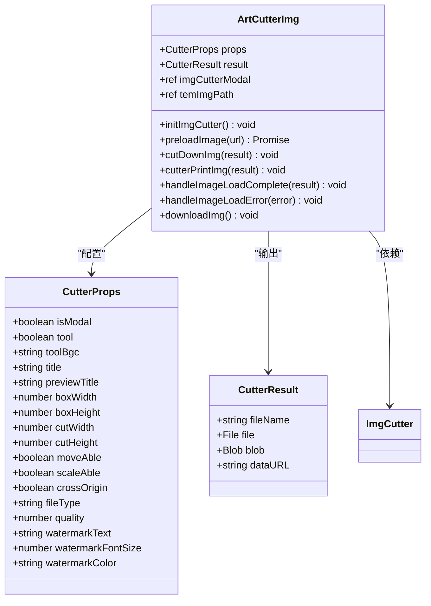
```mermaid
classDiagram
class ArtCutterImg {
+CutterProps props
+CutterResult result
+ref imgCutterModal
+ref temImgPath
+initImgCutter() void
+preloadImage(url) Promise
+cutDownImg(result) void
+cutterPrintImg(result) void
+handleImageLoadComplete(result) void
+handleImageLoadError(error) void
+downloadImg() void
}
class CutterProps {
+boolean isModal
+boolean tool
+string toolBgc
+string title
+string previewTitle
+number boxWidth
+number boxHeight
+number cutWidth
+number cutHeight
+boolean moveAble
+boolean scaleAble
+boolean crossOrigin
+string fileType
+number quality
+string watermarkText
+number watermarkFontSize
+string watermarkColor
}
class CutterResult {
+string fileName
+File file
+Blob blob
+string dataURL
}
ArtCutterImg --> CutterProps : "配置"
ArtCutterImg --> CutterResult : "输出"
ArtCutterImg --> ImgCutter : "依赖"
```

**图表来源**
- [src/components/core/media/art-cutter-img/index.vue](file://src/components/core/media/art-cutter-img/index.vue#L52-L120)

### 属性配置详解

#### 基础配置属性

| 属性名 | 类型 | 默认值 | 说明 |
|--------|------|--------|------|
| `isModal` | `boolean` | `false` | 是否以模态框形式显示 |
| `tool` | `boolean` | `true` | 是否显示工具栏 |
| `toolBgc` | `string` | `'#fff'` | 工具栏背景颜色 |
| `title` | `string` | `''` | 组件标题文本 |
| `previewTitle` | `string` | `''` | 预览区域标题 |
| `showPreview` | `boolean` | `true` | 是否显示预览区域 |

#### 尺寸控制属性

| 属性名 | 类型 | 默认值 | 说明 |
|--------|------|--------|------|
| `boxWidth` | `number` | `700` | 裁剪容器宽度 |
| `boxHeight` | `number` | `458` | 裁剪容器高度 |
| `cutWidth` | `number` | `470` | 裁剪区域宽度 |
| `cutHeight` | `number` | `270` | 裁剪区域高度 |
| `sizeChange` | `boolean` | `true` | 是否允许调整裁剪尺寸 |

#### 交互控制属性

| 属性名 | 类型 | 默认值 | 说明 |
|--------|------|--------|------|
| `moveAble` | `boolean` | `true` | 是否允许移动裁剪框 |
| `imgMove` | `boolean` | `true` | 是否允许移动图片 |
| `scaleAble` | `boolean` | `true` | 是否允许缩放图片 |

#### 图像处理属性

| 属性名 | 类型 | 默认值 | 说明 |
|--------|------|--------|------|
| `crossOrigin` | `boolean` | `true` | 是否允许跨域图片 |
| `fileType` | `'png' \| 'jpeg' \| 'webp'` | `'png'` | 输出文件格式 |
| `quality` | `number` | `0.9` | 图片质量（0-1） |
| `originalGraph` | `boolean` | `true` | 是否显示原始图片 |

#### 水印功能属性

| 属性名 | 类型 | 默认值 | 说明 |
|--------|------|--------|------|
| `watermarkText` | `string` | `''` | 水印文本内容 |
| `watermarkFontSize` | `number` | `20` | 水印字体大小 |
| `watermarkColor` | `string` | `'#ffffff'` | 水印文字颜色 |

### 事件回调系统

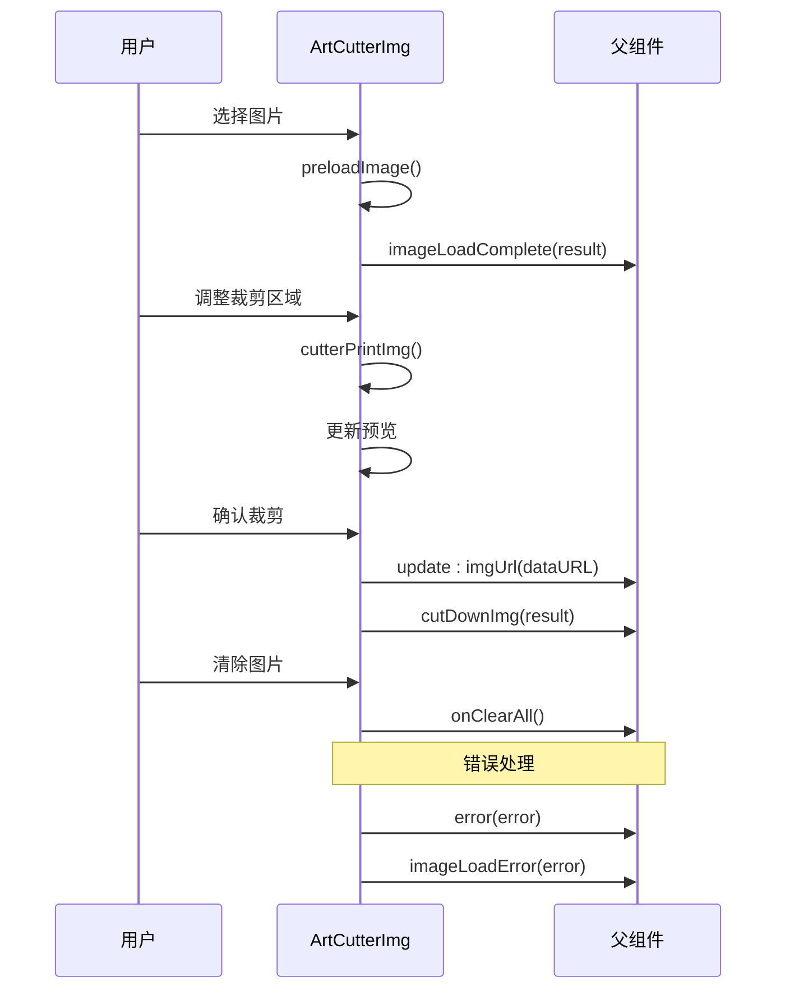
```mermaid
sequenceDiagram
participant User as 用户
participant Component as ArtCutterImg
participant Parent as 父组件
User->>Component : 选择图片
Component->>Component : preloadImage()
Component->>Parent : imageLoadComplete(result)
User->>Component : 调整裁剪区域
Component->>Component : cutterPrintImg()
Component->>Component : 更新预览
User->>Component : 确认裁剪
Component->>Parent : update : imgUrl(dataURL)
Component->>Parent : cutDownImg(result)
User->>Component : 清除图片
Component->>Parent : onClearAll()
Note over Component,Parent : 错误处理
Component->>Parent : error(error)
Component->>Parent : imageLoadError(error)
```

**图表来源**
- [src/components/core/media/art-cutter-img/index.vue](file://src/components/core/media/art-cutter-img/index.vue#L223-L242)

### 方法调用说明

#### 核心方法

| 方法名 | 参数 | 返回值 | 说明 |
|--------|------|--------|------|
| `initImgCutter()` | 无 | `Promise<void>` | 初始化裁剪器，预加载图片 |
| `preloadImage(url)` | `string` | `Promise<void>` | 预加载指定URL的图片 |
| `cutterPrintImg(result)` | `{dataURL: string}` | `void` | 实时更新预览图片 |
| `cutDownImg(result)` | `CutterResult` | `void` | 处理裁剪完成事件 |
| `downloadImg()` | 无 | `void` | 下载裁剪后的图片 |

#### 生命周期管理

组件实现了完整的生命周期管理，包括：

- **挂载时**：自动初始化裁剪器并加载初始图片
- **更新时**：监听图片URL变化，动态更新裁剪器
- **卸载时**：清理资源，避免内存泄漏

**章节来源**
- [src/components/core/media/art-cutter-img/index.vue](file://src/components/core/media/art-cutter-img/index.vue#L162-L251)

## art-video-player 视频播放器组件

### 组件概述

art-video-player 基于 xgplayer 构建，提供了功能丰富的HTML5视频播放器，支持多种视频格式、自定义皮肤和高级播放控制功能。

### 核心功能特性

| 功能类别 | 特性 | 描述 |
|---------|------|------|
| **视频格式支持** | 多格式兼容 | 支持MP4、WebM、OGG等多种视频格式 |
| | 流式播放 | 自适应容器大小的流式布局 |
| | 截图功能 | 内置视频截图功能 |
| **播放控制** | 自动播放 | 可配置的自动播放行为 |
| | 播放速率 | 支持多种播放速度（0.5x, 1x, 1.5x, 2x等） |
| | 循环播放 | 支持视频循环播放 |
| | 静音控制 | 音频静音和音量调节 |
| **字幕集成** | 多语言支持 | 基于国际化框架的多语言字幕 |
| | 字幕样式 | 可自定义字幕外观和位置 |
| **自定义皮肤** | 主题适配 | 自动适配明暗主题 |
| | 进度条定制 | 可配置进度条颜色和样式 |
| | 控制器美化 | 自定义播放器控件外观 |

### 技术架构

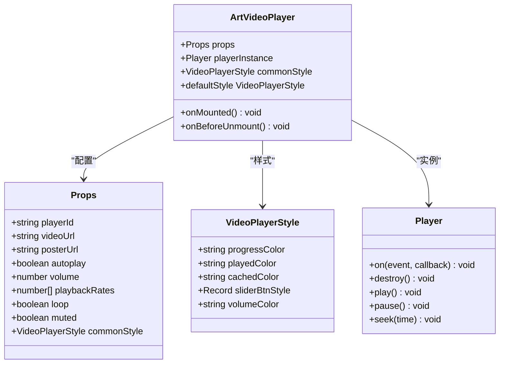
```mermaid
classDiagram
class ArtVideoPlayer {
+Props props
+Player playerInstance
+VideoPlayerStyle commonStyle
+defaultStyle VideoPlayerStyle
+onMounted() void
+onBeforeUnmount() void
}
class Props {
+string playerId
+string videoUrl
+string posterUrl
+boolean autoplay
+number volume
+number[] playbackRates
+boolean loop
+boolean muted
+VideoPlayerStyle commonStyle
}
class VideoPlayerStyle {
+string progressColor
+string playedColor
+string cachedColor
+Record sliderBtnStyle
+string volumeColor
}
class Player {
+on(event, callback) void
+destroy() void
+play() void
+pause() void
+seek(time) void
}
ArtVideoPlayer --> Props : "配置"
ArtVideoPlayer --> VideoPlayerStyle : "样式"
ArtVideoPlayer --> Player : "实例"
```

**图表来源**
- [src/components/core/media/art-video-player/index.vue](file://src/components/core/media/art-video-player/index.vue#L12-L67)

### 属性配置详解

#### 基础播放属性

| 属性名 | 类型 | 默认值 | 说明 |
|--------|------|--------|------|
| `playerId` | `string` | `''` | 播放器容器的唯一标识符 |
| `videoUrl` | `string` | `''` | 视频文件的URL地址 |
| `posterUrl` | `string` | `''` | 视频封面图片的URL |
| `autoplay` | `boolean` | `false` | 是否自动开始播放 |
| `volume` | `number` | `1` | 初始音量大小（0-1之间） |
| `loop` | `boolean` | `false` | 是否循环播放视频 |
| `muted` | `boolean` | `false` | 是否静音播放 |

#### 播放速率配置

| 属性名 | 类型 | 默认值 | 说明 |
|--------|------|--------|------|
| `playbackRates` | `number[]` | `[0.5, 1, 1.5, 2]` | 可选的播放速率列表 |

#### 自定义样式属性

| 属性名 | 类型 | 默认值 | 说明 |
|--------|------|--------|------|
| `commonStyle` | `VideoPlayerStyle` | `{}` | 自定义播放器样式配置 |

### 样式配置系统

#### 默认样式配置

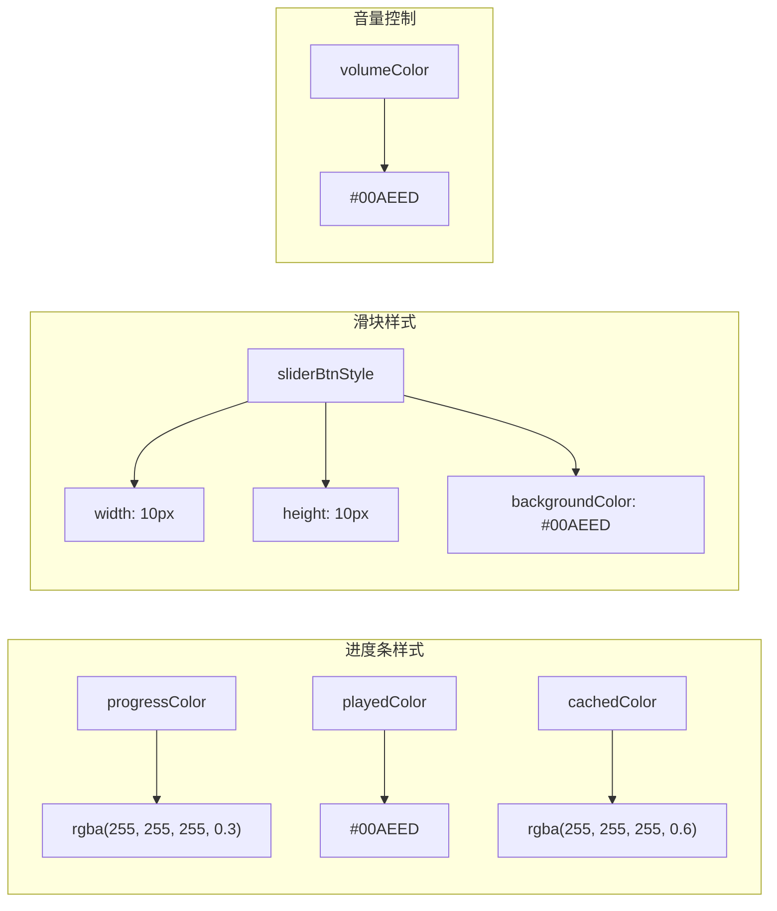
```mermaid
graph LR
subgraph "进度条样式"
A[progressColor] --> A1["rgba(255, 255, 255, 0.3)"]
B[playedColor] --> B1["#00AEED"]
C[cachedColor] --> C1["rgba(255, 255, 255, 0.6)"]
end
subgraph "滑块样式"
D[sliderBtnStyle] --> D1["width: 10px"]
D --> D2["height: 10px"]
D --> D3["backgroundColor: #00AEED"]
end
subgraph "音量控制"
E[volumeColor] --> E1["#00AEED"]
end
```

**图表来源**
- [src/components/core/media/art-video-player/index.vue](file://src/components/core/media/art-video-player/index.vue#L57-L67)

### 事件监听系统

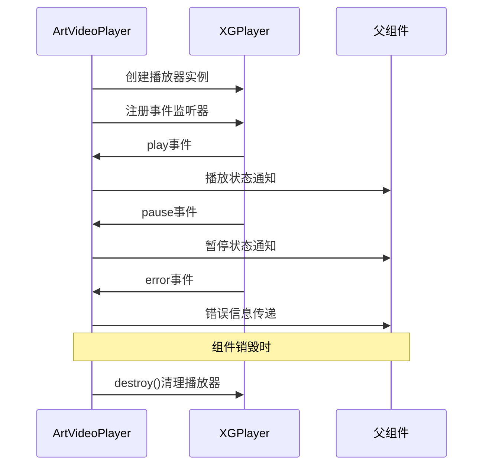
```mermaid
sequenceDiagram
participant Component as ArtVideoPlayer
participant Player as XGPlayer
participant Parent as 父组件
Component->>Player : 创建播放器实例
Component->>Player : 注册事件监听器
Player->>Component : play事件
Component->>Parent : 播放状态通知
Player->>Component : pause事件
Component->>Parent : 暂停状态通知
Player->>Component : error事件
Component->>Parent : 错误信息传递
Note over Component,Parent : 组件销毁时
Component->>Player : destroy()清理播放器
```

**图表来源**
- [src/components/core/media/art-video-player/index.vue](file://src/components/core/media/art-video-player/index.vue#L89-L102)

### 方法调用说明

#### 核心方法

| 方法名 | 参数 | 返回值 | 说明 |
|--------|------|--------|------|
| `onMounted()` | 无 | `void` | 组件挂载时初始化播放器 |
| `onBeforeUnmount()` | 无 | `void` | 组件卸载前清理播放器实例 |

#### 播放器实例方法

虽然组件封装了播放器实例，但可以通过以下方式直接操作：

- `playerInstance.value.play()` - 开始播放
- `playerInstance.value.pause()` - 暂停播放  
- `playerInstance.value.seek(time)` - 跳转到指定时间
- `playerInstance.value.destroy()` - 销毁播放器实例

**章节来源**
- [src/components/core/media/art-video-player/index.vue](file://src/components/core/media/art-video-player/index.vue#L69-L111)

## 组件架构概览

### 整体架构设计

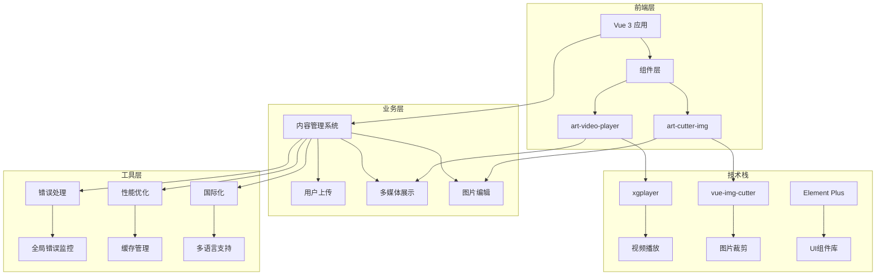
```mermaid
graph TB
subgraph "前端层"
A[Vue 3 应用] --> B[组件层]
B --> C[art-cutter-img]
B --> D[art-video-player]
end
subgraph "业务层"
E[内容管理系统] --> F[用户上传]
E --> G[多媒体展示]
E --> H[图片编辑]
end
subgraph "技术栈"
I[xgplayer] --> J[视频播放]
K[vue-img-cutter] --> L[图片裁剪]
M[Element Plus] --> N[UI组件库]
end
subgraph "工具层"
O[错误处理] --> P[全局错误监控]
Q[性能优化] --> R[缓存管理]
S[国际化] --> T[多语言支持]
end
A --> E
C --> H
D --> G
C --> K
D --> I
E --> O
E --> Q
E --> S
```

**图表来源**
- [src/components/core/media/art-cutter-img/index.vue](file://src/components/core/media/art-cutter-img/index.vue#L1-L20)
- [src/components/core/media/art-video-player/index.vue](file://src/components/core/media/art-video-player/index.vue#L1-L20)

### 组件间协作关系

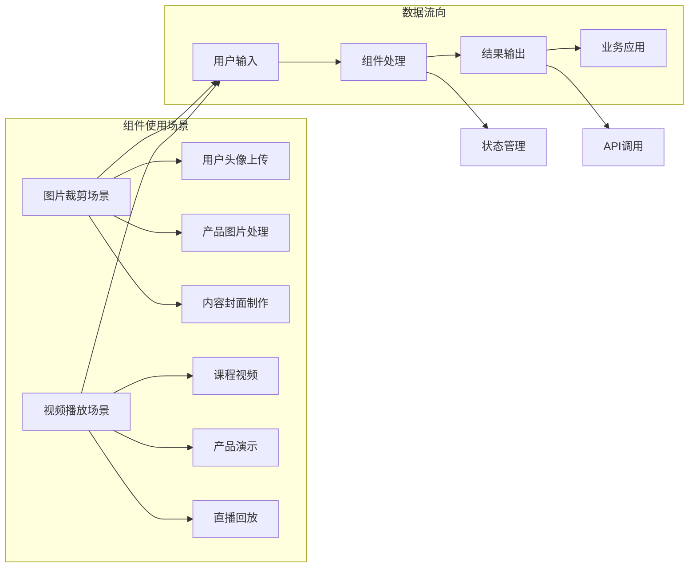
```mermaid
graph LR
subgraph "组件使用场景"
A[图片裁剪场景] --> B[用户头像上传]
A --> C[产品图片处理]
A --> D[内容封面制作]
E[视频播放场景] --> F[课程视频]
E --> G[产品演示]
E --> H[直播回放]
end
subgraph "数据流向"
I[用户输入] --> J[组件处理]
J --> K[结果输出]
K --> L[业务应用]
end
A --> I
E --> I
J --> M[状态管理]
K --> N[API调用]
```

**图表来源**
- [src/views/widgets/image-crop/index.vue](file://src/views/widgets/image-crop/index.vue#L1-L20)
- [src/views/widgets/video/index.vue](file://src/views/widgets/video/index.vue#L1-L20)

## 详细组件分析

### art-cutter-img 深度分析

#### 图像处理算法

组件采用了先进的Canvas图像处理技术，实现了以下核心算法：

1. **图像预加载算法**：使用Promise模式确保图片完全加载后才进行裁剪操作
2. **Canvas渲染算法**：通过Canvas API实现高质量的图像渲染和变换
3. **坐标计算算法**：精确计算裁剪区域与原始图像的坐标映射关系
4. **水印叠加算法**：支持透明度控制和多重水印叠加

#### 裁剪区域控制机制

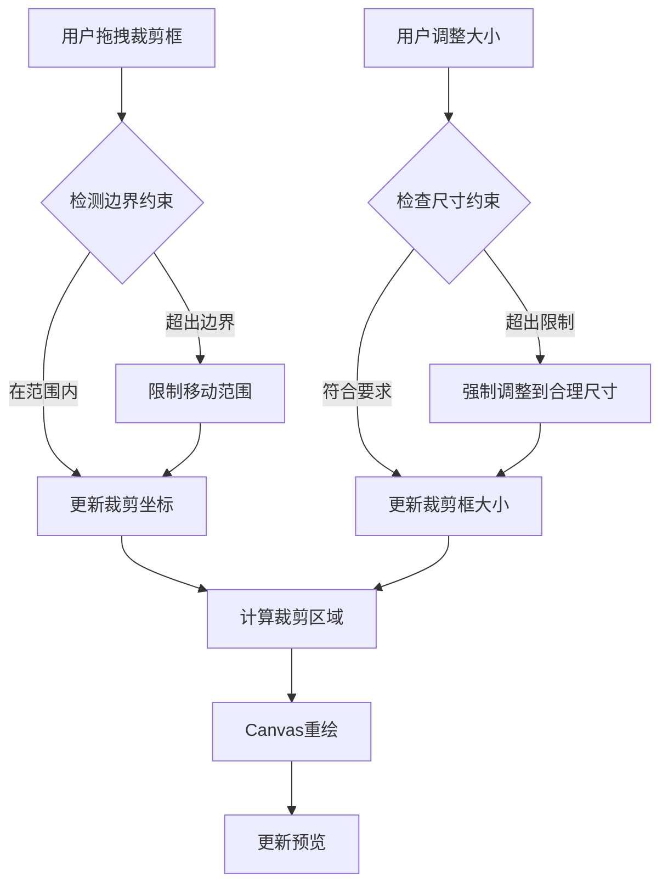
```mermaid
flowchart TD
A[用户拖拽裁剪框] --> B{检测边界约束}
B --> |超出边界| C[限制移动范围]
B --> |在范围内| D[更新裁剪坐标]
C --> D
D --> E[计算裁剪区域]
E --> F[Canvas重绘]
F --> G[更新预览]
H[用户调整大小] --> I{检查尺寸约束}
I --> |超出限制| J[强制调整到合理尺寸]
I --> |符合要求| K[更新裁剪框大小]
J --> K
K --> E
```

**图表来源**
- [src/components/core/media/art-cutter-img/index.vue](file://src/components/core/media/art-cutter-img/index.vue#L172-L222)

#### 比例锁定实现

组件实现了智能的比例锁定功能：

- **自动比例计算**：根据初始裁剪尺寸自动计算宽高比
- **动态调整**：支持按比例调整裁剪区域大小
- **约束保护**：防止用户调整到不合理的尺寸比例

#### 导出选项配置

| 导出格式 | 质量设置 | 适用场景 | 性能特点 |
|----------|----------|----------|----------|
| PNG | 可调节 | 需要透明度的场景 | 无损压缩，文件较大 |
| JPEG | 0-1范围 | 一般图片展示 | 有损压缩，文件较小 |
| WebP | 高质量 | 现代浏览器 | 最佳压缩比，支持透明度 |

### art-video-player 深度分析

#### 视频格式支持矩阵

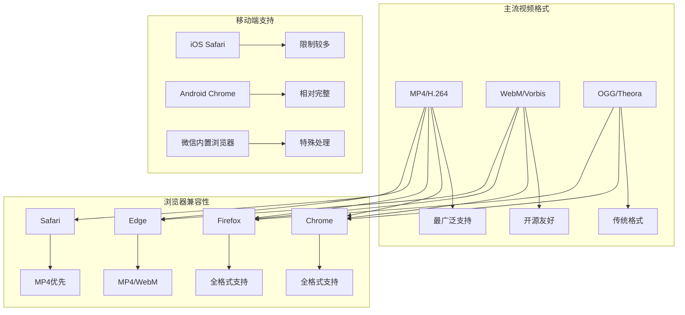
```mermaid
graph TB
subgraph "主流视频格式"
A[MP4/H.264] --> A1[最广泛支持]
B[WebM/Vorbis] --> B1[开源友好]
C[OGG/Theora] --> C1[传统格式]
end
subgraph "浏览器兼容性"
D[Chrome] --> D1[全格式支持]
E[Firefox] --> E1[全格式支持]
F[Safari] --> F1[MP4优先]
G[Edge] --> G1[MP4/WebM]
end
subgraph "移动端支持"
H[iOS Safari] --> H1[限制较多]
I[Android Chrome] --> I1[相对完整]
J[微信内置浏览器] --> J1[特殊处理]
end
A --> D
A --> E
A --> F
A --> G
B --> D
B --> E
B --> G
C --> D
C --> E
```

**图表来源**
- [src/components/core/media/art-video-player/index.vue](file://src/components/core/media/art-video-player/index.vue#L76-L78)

#### 播放控制机制

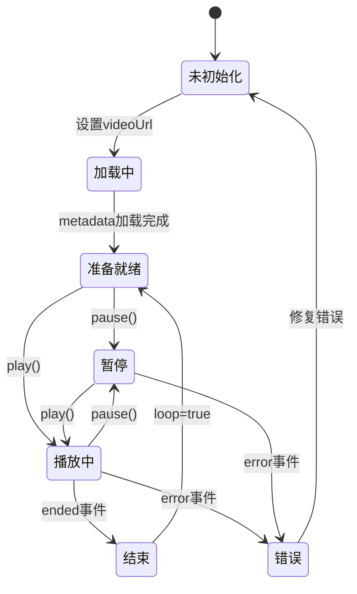
```mermaid
stateDiagram-v2
[*] --> 未初始化
未初始化 --> 加载中 : 设置videoUrl
加载中 --> 准备就绪 : metadata加载完成
准备就绪 --> 暂停 : pause()
准备就绪 --> 播放中 : play()
播放中 --> 暂停 : pause()
暂停 --> 播放中 : play()
播放中 --> 结束 : ended事件
结束 --> 准备就绪 : loop=true
播放中 --> 错误 : error事件
暂停 --> 错误 : error事件
错误 --> 未初始化 : 修复错误
```

**图表来源**
- [src/components/core/media/art-video-player/index.vue](file://src/components/core/media/art-video-player/index.vue#L89-L102)

#### 字幕集成架构

虽然当前版本主要展示了基础的视频播放功能，但基于xgplayer的架构，组件具备扩展字幕功能的能力：

- **多语言字幕**：基于Vue i18n实现的国际化字幕支持
- **字幕样式**：可自定义的字幕外观和定位
- **同步控制**：精确的时间轴同步机制

### 实际应用场景

#### 内容管理系统应用

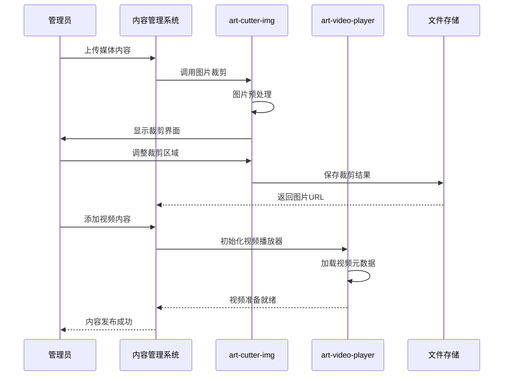
```mermaid
sequenceDiagram
participant Admin as 管理员
participant CMS as 内容管理系统
participant Cutter as art-cutter-img
participant Player as art-video-player
participant Storage as 文件存储
Admin->>CMS : 上传媒体内容
CMS->>Cutter : 调用图片裁剪
Cutter->>Cutter : 图片预处理
Cutter->>Admin : 显示裁剪界面
Admin->>Cutter : 调整裁剪区域
Cutter->>Storage : 保存裁剪结果
Storage-->>CMS : 返回图片URL
Admin->>CMS : 添加视频内容
CMS->>Player : 初始化视频播放器
Player->>Player : 加载视频元数据
Player-->>CMS : 视频准备就绪
CMS-->>Admin : 内容发布成功
```

**图表来源**
- [src/views/widgets/image-crop/index.vue](file://src/views/widgets/image-crop/index.vue#L1-L59)
- [src/views/widgets/video/index.vue](file://src/views/widgets/video/index.vue#L1-L32)

#### 用户上传流程

| 步骤 | 组件 | 功能 | 用户体验 |
|------|------|------|----------|
| 1 | 文件选择器 | 选择本地文件 | 直观的文件选择界面 |
| 2 | art-cutter-img | 图片裁剪 | 实时预览和精确调整 |
| 3 | art-video-player | 视频预览 | 快速查看视频内容 |
| 4 | 状态反馈 | 上传进度 | 清晰的进度指示 |
| 5 | 结果确认 | 最终确认 | 确保内容质量 |

**章节来源**
- [src/views/widgets/image-crop/index.vue](file://src/views/widgets/image-crop/index.vue#L1-L59)
- [src/views/widgets/video/index.vue](file://src/views/widgets/video/index.vue#L1-L32)

## 性能优化策略

### 懒加载机制

组件实现了多层次的懒加载策略：

#### 图片裁剪组件的懒加载

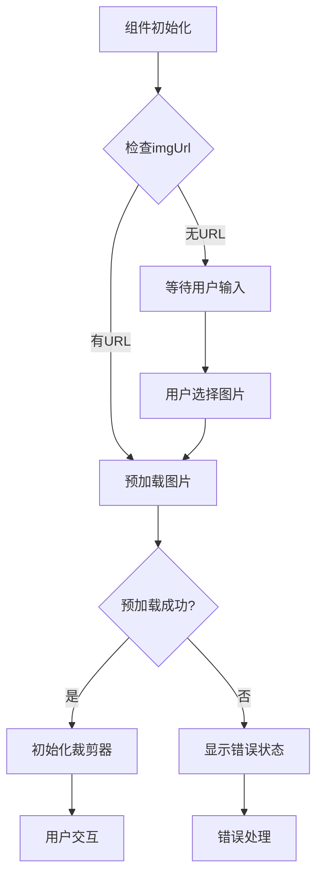
```mermaid
flowchart TD
A[组件初始化] --> B{检查imgUrl}
B --> |有URL| C[预加载图片]
B --> |无URL| D[等待用户输入]
C --> E{预加载成功?}
E --> |是| F[初始化裁剪器]
E --> |否| G[显示错误状态]
F --> H[用户交互]
G --> I[错误处理]
D --> J[用户选择图片]
J --> C
```

**图表来源**
- [src/components/core/media/art-cutter-img/index.vue](file://src/components/core/media/art-cutter-img/index.vue#L183-L205)

#### 视频播放器的懒加载

视频播放器采用按需加载策略：

- **延迟初始化**：只有当播放器容器可见时才创建播放器实例
- **资源预取**：智能预取下一个可能播放的视频资源
- **内存管理**：播放器销毁时自动释放相关资源

### 内存管理策略

#### 组件级别的内存管理

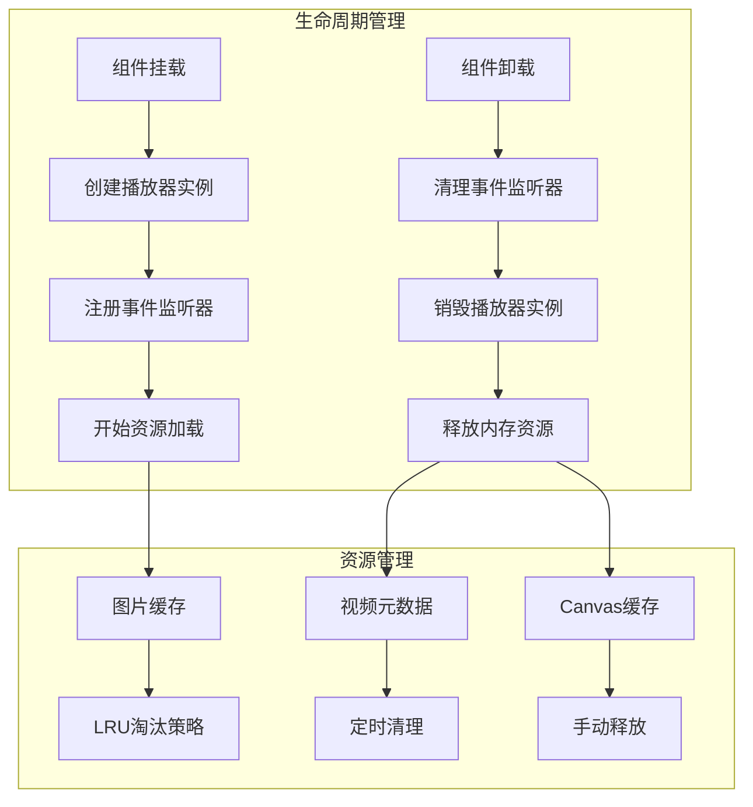
```mermaid
graph TB
subgraph "生命周期管理"
A[组件挂载] --> B[创建播放器实例]
B --> C[注册事件监听器]
C --> D[开始资源加载]
E[组件卸载] --> F[清理事件监听器]
F --> G[销毁播放器实例]
G --> H[释放内存资源]
end
subgraph "资源管理"
I[图片缓存] --> J[LRU淘汰策略]
K[视频元数据] --> L[定时清理]
M[Canvas缓存] --> N[手动释放]
end
D --> I
H --> K
H --> M
```

**图表来源**
- [src/hooks/core/useTable.ts](file://src/hooks/core/useTable.ts#L625-L634)
- [src/utils/table/tableCache.ts](file://src/utils/table/tableCache.ts#L1-L35)

#### 缓存优化策略

基于项目中的缓存管理经验，组件采用了以下优化策略：

| 缓存类型 | 策略 | 过期时间 | 清理机制 |
|----------|------|----------|----------|
| 图片预览缓存 | LRU | 30分钟 | 自动清理最久未使用项 |
| 视频元数据缓存 | TTL | 1小时 | 定时清理过期数据 |
| Canvas绘制缓存 | 手动 | 会话期间 | 组件销毁时清理 |

### 资源释放机制

#### 自动资源清理

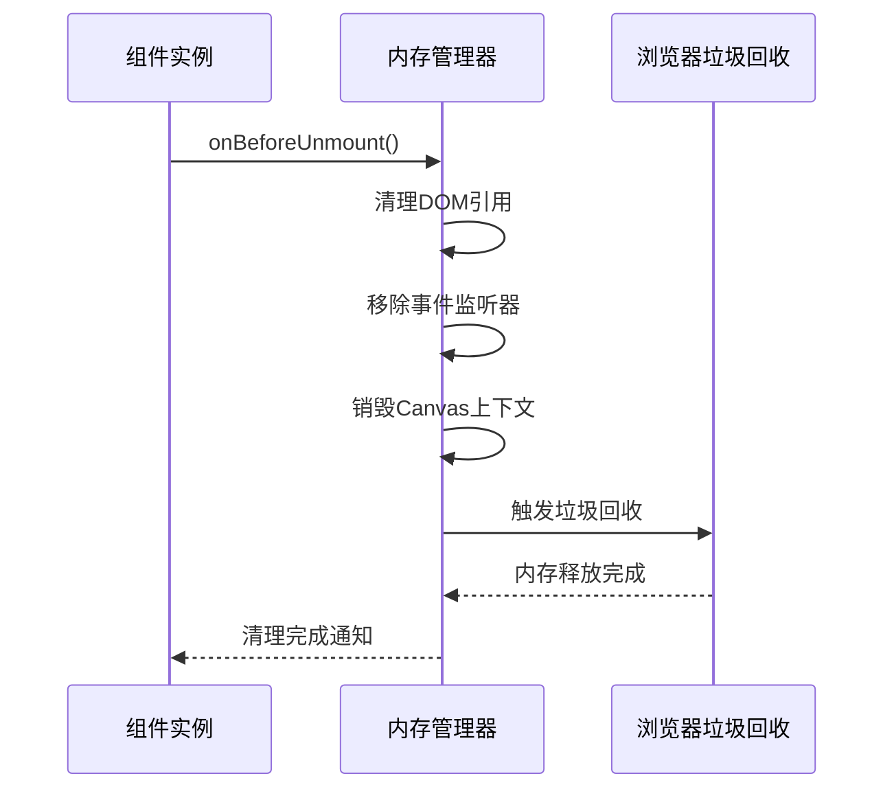
```mermaid
sequenceDiagram
participant Component as 组件实例
participant Memory as 内存管理器
participant Browser as 浏览器垃圾回收
Component->>Memory : onBeforeUnmount()
Memory->>Memory : 清理DOM引用
Memory->>Memory : 移除事件监听器
Memory->>Memory : 销毁Canvas上下文
Memory->>Browser : 触发垃圾回收
Browser-->>Memory : 内存释放完成
Memory-->>Component : 清理完成通知
```

**图表来源**
- [src/components/core/media/art-video-player/index.vue](file://src/components/core/media/art-video-player/index.vue#L105-L109)

#### 性能监控指标

组件集成了性能监控机制：

- **加载时间监控**：记录图片预加载和视频初始化时间
- **内存使用跟踪**：监控Canvas和播放器实例的内存占用
- **错误率统计**：统计各类错误的发生频率和类型

**章节来源**
- [src/utils/sys/error-handle.ts](file://src/utils/sys/error-handle.ts#L1-L103)

## 可访问性支持

### 语义化标记

组件遵循Web可访问性标准，提供了完整的语义化标记：

#### 图片裁剪组件的可访问性

```mermaid
graph LR
subgraph "ARIA属性"
A[aria-label] --> A1["裁剪工具栏"]
B[aria-describedby] --> B1["描述裁剪区域"]
C[aria-hidden] --> C1["隐藏内部元素"]
end
subgraph "键盘导航"
D[Tab键] --> D1["焦点管理"]
E[方向键] --> E1["裁剪框移动"]
F[Enter/Space] --> F1["确认操作"]
end
subgraph "屏幕阅读器"
G[role="application"] --> G1["应用程序角色"]
H[aria-live] --> H1["实时更新通知"]
I[aria-valuetext] --> I1["当前状态描述"]
end
```

#### 视频播放器的可访问性

视频播放器提供了全面的可访问性支持：

- **键盘控制**：支持空格键播放/暂停，左右箭头快进/快退
- **语音控制**：兼容iOS和Android的语音控制功能
- **高对比度**：自动适配系统的高对比度模式
- **字幕支持**：基于WebVTT的字幕系统

### 跨浏览器兼容性

#### 浏览器支持矩阵

| 浏览器 | 最低版本 | 支持程度 | 注意事项 |
|--------|----------|----------|----------|
| Chrome | 60+ | 完全支持 | 推荐版本 |
| Firefox | 55+ | 完全支持 | 部分功能需要插件 |
| Safari | 12+ | 基本支持 | iOS设备有特殊限制 |
| Edge | 79+ | 完全支持 | 基于Chromium内核 |
| IE | 不支持 | - | 已停止支持 |

#### 兼容性处理策略

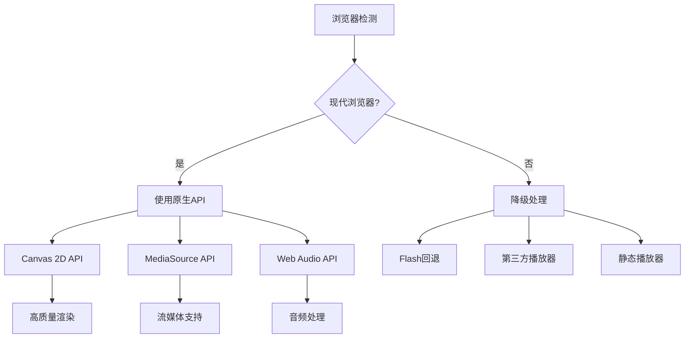
```mermaid
flowchart TD
A[浏览器检测] --> B{现代浏览器?}
B --> |是| C[使用原生API]
B --> |否| D[降级处理]
C --> E[Canvas 2D API]
C --> F[MediaSource API]
C --> G[Web Audio API]
D --> H[Flash回退]
D --> I[第三方播放器]
D --> J[静态播放器]
E --> K[高质量渲染]
F --> L[流媒体支持]
G --> M[音频处理]
```

**图表来源**
- [package.json](file://package.json#L54-L81)

### 辅助功能增强

#### 视觉辅助功能

- **高对比度模式**：自动检测系统主题并调整颜色方案
- **字体大小适配**：响应式设计支持不同的字体大小
- **色彩无障碍**：避免使用纯色作为重要信息的指示器

#### 运动功能支持

- **减少动画**：可配置的动画开关，支持减少运动模式
- **暂停控制**：所有自动播放功能都提供暂停选项
- **简化交互**：提供简化的交互模式，适合手部控制困难的用户

**章节来源**
- [src/components/core/media/art-video-player/index.vue](file://src/components/core/media/art-video-player/index.vue#L72-L78)

## 故障排除指南

### 常见问题及解决方案

#### 图片裁剪组件问题

| 问题类型 | 症状 | 可能原因 | 解决方案 |
|----------|------|----------|----------|
| 图片无法加载 | 显示空白或错误提示 | CORS限制、网络问题 | 检查跨域设置，使用同域图片 |
| 裁剪区域异常 | 裁剪框显示错误 | 图片尺寸过大 | 调整boxWidth和boxHeight |
| 水印不显示 | 水印文本缺失 | 字体加载失败 | 检查字体文件路径 |
| 导出失败 | 下载链接无效 | Canvas安全策略 | 确保图片来源安全 |

#### 视频播放器问题

| 问题类型 | 症状 | 可能原因 | 解决方案 |
|----------|------|----------|----------|
| 视频无法播放 | 黑屏或错误提示 | 格式不支持、网络问题 | 检查视频格式和网络连接 |
| 音频无声 | 视频正常但无声音 | 静音设置、浏览器限制 | 检查静音状态和浏览器设置 |
| 控制器不响应 | 播放器控件无反应 | JavaScript错误、DOM问题 | 检查控制台错误信息 |
| 字幕不显示 | 字幕文本缺失 | 字幕文件格式错误 | 验证字幕文件格式 |

### 调试技巧

#### 开发环境调试

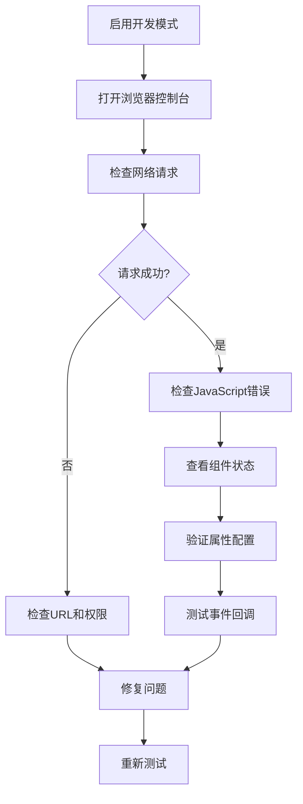
```mermaid
flowchart TD
A[启用开发模式] --> B[打开浏览器控制台]
B --> C[检查网络请求]
C --> D{请求成功?}
D --> |否| E[检查URL和权限]
D --> |是| F[检查JavaScript错误]
F --> G[查看组件状态]
G --> H[验证属性配置]
H --> I[测试事件回调]
E --> J[修复问题]
I --> J
J --> K[重新测试]
```

#### 生产环境监控

生产环境中，组件集成了完善的错误监控机制：

- **错误捕获**：自动捕获并上报JavaScript错误
- **性能监控**：监控组件加载时间和响应性能
- **用户行为追踪**：记录用户的操作路径和频率

### 最佳实践建议

#### 图片裁剪最佳实践

1. **图片预处理**：在裁剪前对图片进行适当的压缩和格式转换
2. **尺寸规划**：根据最终用途确定合适的裁剪尺寸
3. **质量平衡**：在文件大小和图像质量之间找到平衡点
4. **水印策略**：合理使用水印功能保护版权

#### 视频播放最佳实践

1. **格式选择**：优先使用MP4格式确保最大兼容性
2. **编码设置**：使用标准的H.264编码保证流畅播放
3. **字幕制作**：提供准确的字幕文件提升用户体验
4. **移动端优化**：考虑移动设备的性能限制

**章节来源**
- [src/utils/sys/error-handle.ts](file://src/utils/sys/error-handle.ts#L35-L102)

## 总结

Art Design Pro 的媒体组件提供了完整的媒体处理解决方案，具有以下核心优势：

### 技术优势

- **现代化架构**：基于Vue 3 Composition API构建，提供优秀的开发体验
- **高性能实现**：采用Canvas和Web Workers技术，确保流畅的用户体验
- **跨平台兼容**：支持主流浏览器和移动设备
- **可扩展设计**：模块化架构便于功能扩展和定制

### 功能特色

- **art-cutter-img**：专业的图片裁剪功能，支持水印、预览和多种格式导出
- **art-video-player**：功能丰富的视频播放器，支持自定义皮肤和多语言字幕

### 应用价值

这些组件在实际项目中展现了强大的应用价值：

- **内容管理系统**：简化媒体内容的处理流程
- **用户上传功能**：提供专业的媒体处理工具
- **多媒体展示**：构建丰富的多媒体内容展示平台

通过持续的优化和改进，这些媒体组件将继续为开发者提供可靠、高效的媒体处理解决方案，助力构建现代化的Web应用。