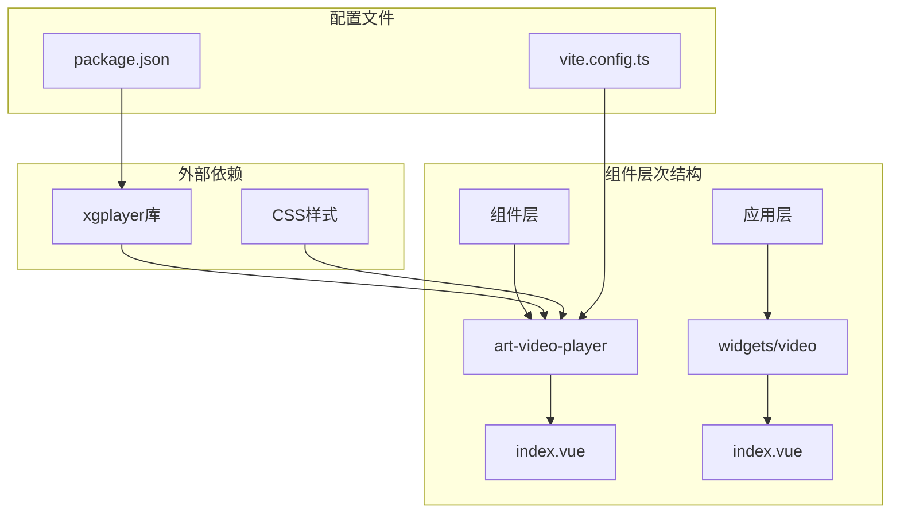
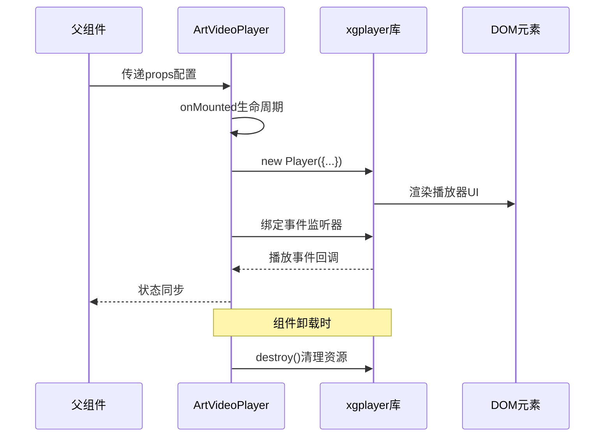
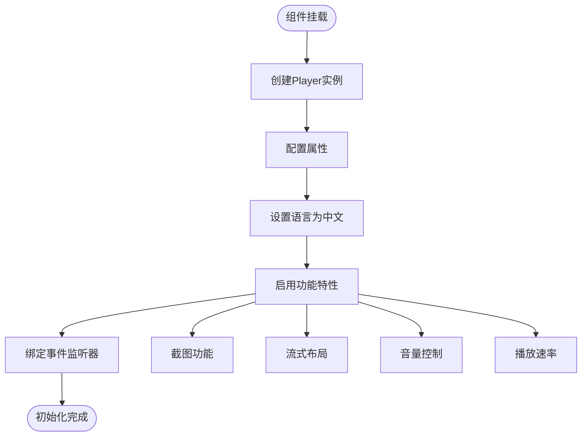
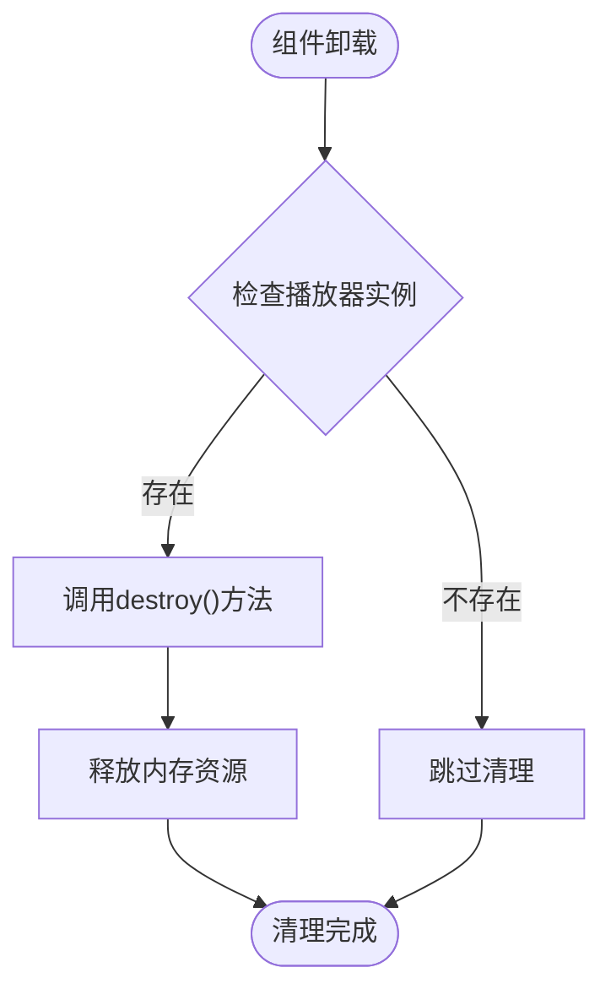
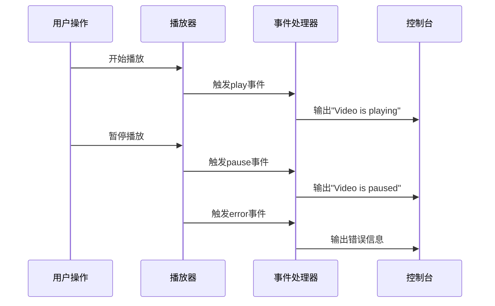
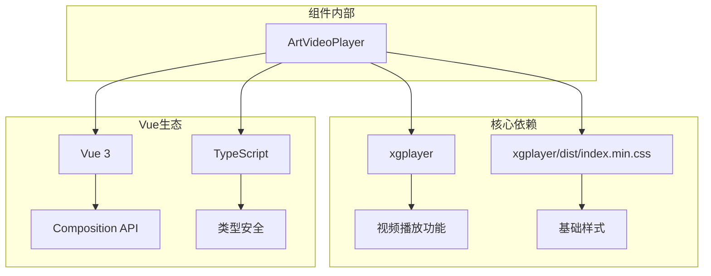

# 视频播放器组件

<cite>
**本文档中引用的文件**
- [index.vue](file://src/components/core/media/art-video-player/index.vue)
- [video/index.vue](file://src/views/widgets/video/index.vue)
</cite>

## 目录
1. [简介](#简介)
2. [项目结构](#项目结构)
3. [核心组件](#核心组件)
4. [架构概览](#架构概览)
5. [详细组件分析](#详细组件分析)
6. [依赖关系分析](#依赖关系分析)
7. [性能考虑](#性能考虑)
8. [故障排除指南](#故障排除指南)
9. [结论](#结论)

## 简介

Art Design Pro中的art-video-player是一个基于xgplayer库封装的高性能视频播放器组件。该组件提供了完整的视频播放功能，支持多种配置选项和样式定制，同时具备良好的可访问性和移动端兼容性。组件采用Vue 3 Composition API开发，遵循现代前端开发最佳实践。

## 项目结构

视频播放器组件位于项目的媒体核心目录中，具有清晰的组织结构：



**图表来源**
- [index.vue](file://src/components/core/media/art-video-player/index.vue#L1-L112)
- [video/index.vue](file://src/views/widgets/video/index.vue#L1-L33)

**章节来源**
- [index.vue](file://src/components/core/media/art-video-player/index.vue#L1-L112)

## 核心组件

### 组件属性配置

视频播放器组件提供了丰富的配置属性，支持灵活的功能定制：

| 属性名 | 类型 | 默认值 | 描述 |
|--------|------|--------|------|
| playerId | string | '' | 播放器容器ID，用于定位DOM元素 |
| videoUrl | string | '' | 视频源地址，支持HTTP/HTTPS协议 |
| posterUrl | string | '' | 视频封面图URL，在播放前显示 |
| autoplay | boolean | false | 是否自动播放，受浏览器自动播放策略限制 |
| volume | number | 1 | 音量控制(0-1)，0为静音，1为最大音量 |
| playbackRates | number[] | - | 可选的播放速率数组，默认支持标准速率 |
| loop | boolean | false | 是否循环播放，视频结束时重新开始 |
| muted | boolean | false | 是否静音播放，通常与自动播放配合使用 |
| commonStyle | VideoPlayerStyle | - | 样式定制接口，支持主题化配置 |

### 样式定制接口

组件提供了完整的样式定制能力，支持以下样式属性：

| 样式属性 | 类型 | 默认值 | 描述 |
|----------|------|--------|------|
| progressColor | string | rgba(255, 255, 255, 0.3) | 进度条背景色，支持透明度 |
| playedColor | string | #00AEED | 已播放部分的颜色标识 |
| cachedColor | string | rgba(255, 255, 255, 0.6) | 缓存进度条的颜色 |
| sliderBtnStyle | Record<string, string> | - | 滑块按钮的内联样式配置 |
| volumeColor | string | #00AEED | 音量控制条的颜色 |

**章节来源**
- [index.vue](file://src/components/core/media/art-video-player/index.vue#L12-L30)
- [index.vue](file://src/components/core/media/art-video-player/index.vue#L48-L67)

## 架构概览

视频播放器组件采用了现代化的Vue 3架构设计，结合xgplayer库的强大功能：



**图表来源**
- [index.vue](file://src/components/core/media/art-video-player/index.vue#L69-L110)

## 详细组件分析

### 播放器实例生命周期管理

组件实现了完整的生命周期管理机制，确保资源的正确分配和释放：

#### 初始化阶段（onMounted）



**图表来源**
- [index.vue](file://src/components/core/media/art-video-player/index.vue#L71-L86)

#### 清理阶段（onBeforeUnmount）

组件在卸载前会执行资源清理操作，防止内存泄漏：



**图表来源**
- [index.vue](file://src/components/core/media/art-video-player/index.vue#L105-L109)

### 事件监听机制

组件内置了完整的事件监听系统，支持多种播放状态的实时监控：

#### 核心事件类型

| 事件名称 | 触发时机 | 处理逻辑 |
|----------|----------|----------|
| play | 视频开始播放 | 控制台输出播放状态日志 |
| pause | 视频暂停播放 | 控制台输出暂停状态日志 |
| error | 播放器发生错误 | 输出错误信息到控制台 |

#### 事件处理流程



**图表来源**
- [index.vue](file://src/components/core/media/art-video-player/index.vue#L89-L102)

### 主题化定制机制

组件通过props合并defaultStyle实现了灵活的主题化定制：

```mermaid
classDiagram
class VideoPlayerStyle {
+string progressColor
+string playedColor
+string cachedColor
+Record~string,string~ sliderBtnStyle
+string volumeColor
}
class DefaultStyle {
+progressColor : "rgba(255, 255, 255, 0.3)"
+playedColor : "#00AEED"
+cachedColor : "rgba(255, 255, 255, 0.6)"
+sliderBtnStyle : {...}
+volumeColor : "#00AEED"
}
class PropsStyle {
+VideoPlayerStyle commonStyle
}
VideoPlayerStyle <|-- DefaultStyle
VideoPlayerStyle <|-- PropsStyle
DefaultStyle --> PropsStyle : 合并覆盖
```

**图表来源**
- [index.vue](file://src/components/core/media/art-video-player/index.vue#L48-L67)
- [index.vue](file://src/components/core/media/art-video-player/index.vue#L83-L86)

**章节来源**
- [index.vue](file://src/components/core/media/art-video-player/index.vue#L69-L110)

## 依赖关系分析

### 外部依赖

视频播放器组件依赖于以下关键包：



**图表来源**
- [index.vue](file://src/components/core/media/art-video-player/index.vue#L6-L8)

### 内部集成

组件与项目其他部分的集成关系：

| 集成点 | 作用 | 实现方式 |
|--------|------|----------|
| 应用示例 | 功能演示 | 在widgets/video页面中展示 |
| 样式系统 | 主题适配 | 支持CSS变量和主题切换 |
| 响应式设计 | 移动端适配 | 流式布局和触摸优化 |

**章节来源**
- [index.vue](file://src/components/core/media/art-video-player/index.vue#L1-L112)
- [video/index.vue](file://src/views/widgets/video/index.vue#L1-L33)

## 性能考虑

### 资源加载优化

1. **懒加载策略**：播放器实例仅在组件挂载时创建
2. **内存管理**：组件卸载时自动清理播放器实例
3. **样式分离**：CSS样式独立加载，减少打包体积

### 播放器配置优化

- **流式布局**：启用fluid属性实现自适应容器大小
- **截图功能**：可选的screenShot功能，按需启用
- **语言本地化**：预设中文界面语言，提升用户体验

### 性能监控建议

- 监控播放器实例的创建和销毁频率
- 关注内存使用情况，及时发现潜在泄漏
- 测试不同网络环境下的播放性能

## 故障排除指南

### 常见问题及解决方案

#### 视频加载失败

**症状**：视频无法正常加载或播放
**可能原因**：
- 视频源URL无效或不可访问
- 跨域资源共享(CORS)限制
- 网络连接问题

**解决方案**：
1. 验证videoUrl的有效性
2. 检查服务器CORS配置
3. 使用同域或支持CORS的视频源

#### 自动播放策略限制

**症状**：设置了autoplay但视频未自动播放
**可能原因**：
- 浏览器自动播放策略限制
- 未设置muted属性
- 用户交互前尝试自动播放

**解决方案**：
1. 设置muted=true配合autoplay
2. 等待用户交互后再触发播放
3. 提供明确的播放按钮

#### 跨域问题

**症状**：视频播放出现跨域错误
**可能原因**：
- 视频资源与页面不在同一域名
- 服务器未正确配置CORS头

**解决方案**：
1. 将视频资源部署到同域
2. 配置服务器CORS头
3. 使用代理服务器转发请求

#### 移动端兼容性

**症状**：移动端播放体验不佳
**可能原因**：
- 触摸事件处理不当
- 屏幕适配问题
- 移动端浏览器兼容性

**解决方案**：
1. 确保流式布局正常工作
2. 测试主流移动浏览器
3. 优化触摸交互体验

### 调试技巧

1. **控制台日志**：利用内置的事件监听器查看播放状态
2. **网络面板**：检查视频资源加载状态
3. **开发者工具**：使用浏览器调试功能分析问题

**章节来源**
- [index.vue](file://src/components/core/media/art-video-player/index.vue#L90-L102)

## 结论

Art Design Pro的art-video-player组件是一个功能完整、设计精良的视频播放解决方案。它基于成熟的xgplayer库构建，提供了丰富的配置选项和灵活的样式定制能力。组件的生命周期管理、事件处理机制和错误处理策略都体现了专业的开发水准。

### 主要优势

1. **技术先进**：采用Vue 3 Composition API和TypeScript
2. **功能丰富**：支持多种播放配置和样式定制
3. **性能优化**：完善的资源管理和内存控制
4. **易于使用**：简洁的API设计和清晰的文档
5. **可维护性**：模块化设计和良好的代码结构

### 最佳实践建议

1. **合理配置**：根据实际需求选择合适的播放器功能
2. **性能监控**：定期检查播放器的性能表现
3. **用户体验**：注重移动端和无障碍访问支持
4. **错误处理**：实现完善的错误捕获和用户提示机制

该组件为Art Design Pro项目提供了可靠的视频播放能力，是现代Web应用中视频功能实现的优秀范例。