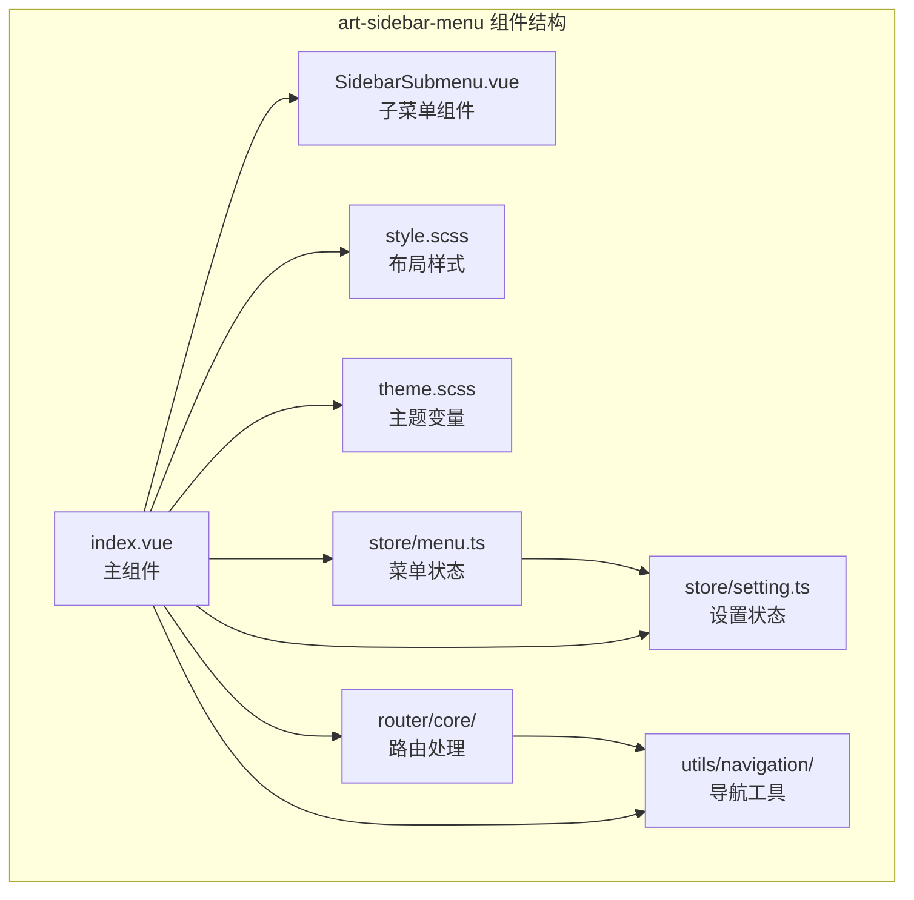
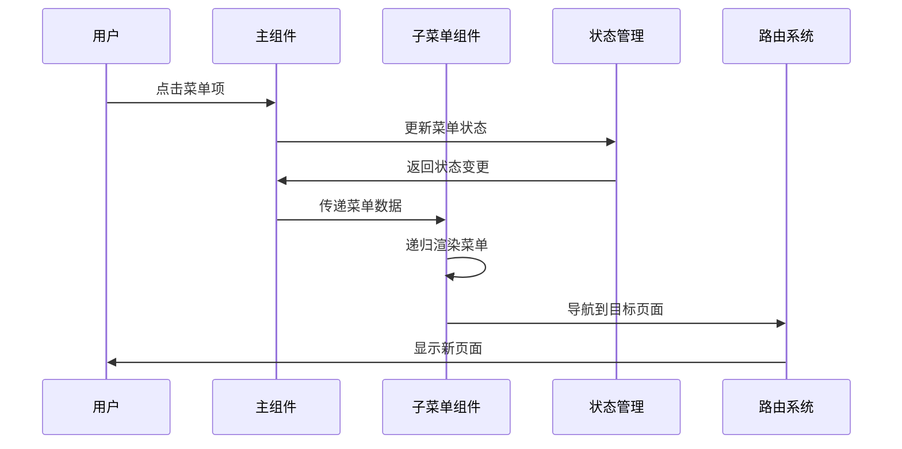
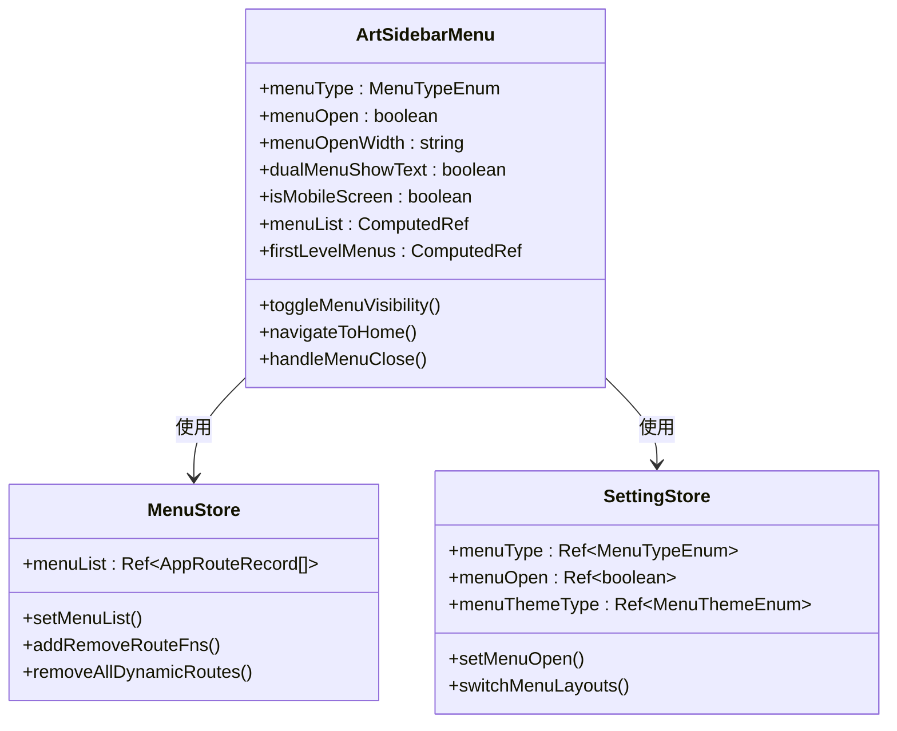
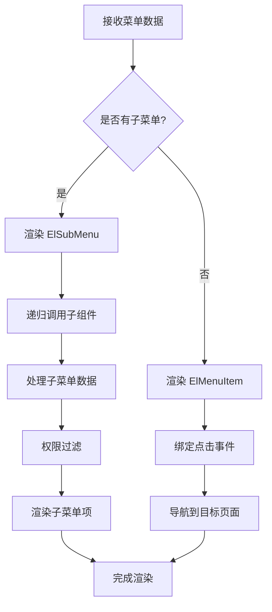
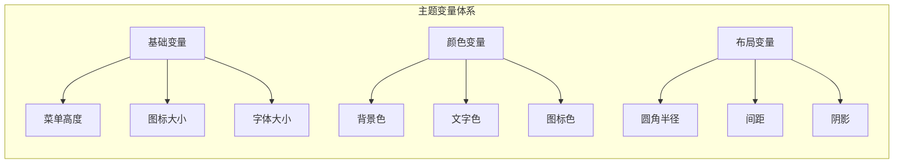
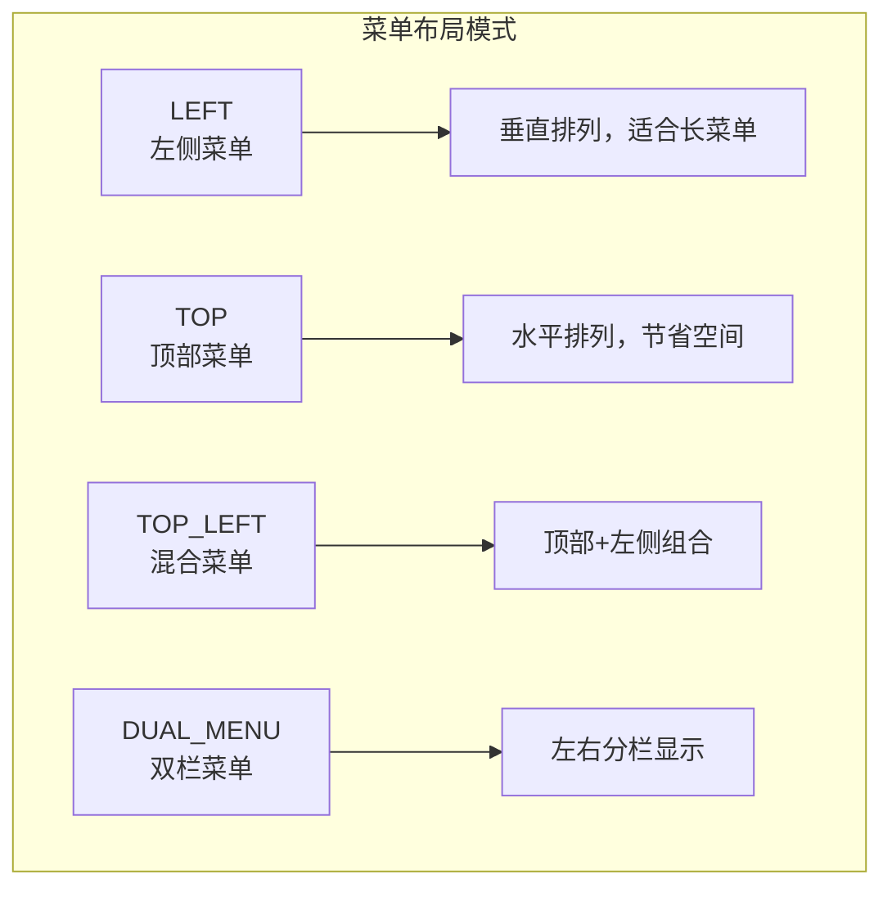
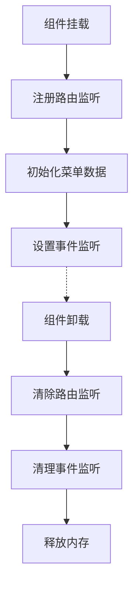

# 侧边栏菜单

<cite>
**本文档引用的文件**
- [index.vue](file://src/components/core/layouts/art-menus/art-sidebar-menu/index.vue)
- [SidebarSubmenu.vue](file://src/components/core/layouts/art-menus/art-sidebar-menu/widget/SidebarSubmenu.vue)
- [style.scss](file://src/components/core/layouts/art-menus/art-sidebar-menu/style.scss)
- [theme.scss](file://src/components/core/layouts/art-menus/art-sidebar-menu/theme.scss)
- [menu.ts](file://src/store/modules/menu.ts)
- [setting.ts](file://src/store/modules/setting.ts)
- [appEnum.ts](file://src/enums/appEnum.ts)
- [jump.ts](file://src/utils/navigation/jump.ts)
- [RouteTransformer.ts](file://src/router/core/RouteTransformer.ts)
- [MenuProcessor.ts](file://src/router/core/MenuProcessor.ts)
</cite>

## 目录
1. [简介](#简介)
2. [项目结构](#项目结构)
3. [核心组件](#核心组件)
4. [架构概览](#架构概览)
5. [详细组件分析](#详细组件分析)
6. [状态管理](#状态管理)
7. [主题系统](#主题系统)
8. [配置选项](#配置选项)
9. [性能优化](#性能优化)
10. [故障排除指南](#故障排除指南)
11. [总结](#总结)

## 简介

art-sidebar-menu是一个功能强大的Vue 3侧边栏菜单组件，支持多级菜单渲染、多种布局模式和丰富的主题定制能力。该组件采用模块化设计，提供了完整的菜单状态管理、动态路由处理和响应式布局支持。

### 主要特性

- **多级菜单渲染**：支持无限层级的嵌套菜单结构
- **多种布局模式**：左侧菜单、顶部菜单、混合菜单、双栏菜单
- **主题系统**：内置设计、亮色、暗色三种菜单主题
- **响应式设计**：适配移动端和桌面端的不同显示需求
- **动态路由**：支持动态菜单加载和权限过滤
- **性能优化**：针对大量菜单项的渲染优化

## 项目结构

**图表来源**
- [index.vue](file://src/components/core/layouts/art-menus/art-sidebar-menu/index.vue#L1-L356)
- [SidebarSubmenu.vue](file://src/components/core/layouts/art-menus/art-sidebar-menu/widget/SidebarSubmenu.vue#L1-L189)

**章节来源**
- [index.vue](file://src/components/core/layouts/art-menus/art-sidebar-menu/index.vue#L1-L50)
- [SidebarSubmenu.vue](file://src/components/core/layouts/art-menus/art-sidebar-menu/widget/SidebarSubmenu.vue#L1-L50)

## 核心组件

### 主组件 (index.vue)

主组件负责整体布局管理和状态协调，包含以下核心功能：

- **菜单类型判断**：支持LEFT、TOP、TOP_LEFT、DUAL_MENU四种布局模式
- **响应式控制**：根据屏幕尺寸自动调整菜单显示状态
- **主题管理**：集成多种菜单主题和系统主题
- **移动端适配**：提供移动端模态框和手势支持

### 子菜单组件 (SidebarSubmenu.vue)

子菜单组件实现了递归渲染逻辑，支持：

- **递归渲染**：自动处理多级嵌套菜单
- **权限过滤**：根据用户权限动态显示菜单项
- **图标显示**：支持SVG图标和徽章显示
- **交互控制**：提供点击事件和关闭回调

**章节来源**
- [index.vue](file://src/components/core/layouts/art-menus/art-sidebar-menu/index.vue#L132-L356)
- [SidebarSubmenu.vue](file://src/components/core/layouts/art-menus/art-sidebar-menu/widget/SidebarSubmenu.vue#L59-L189)

## 架构概览

**图表来源**
- [index.vue](file://src/components/core/layouts/art-menus/art-sidebar-menu/index.vue#L260-L295)
- [SidebarSubmenu.vue](file://src/components/core/layouts/art-menus/art-sidebar-menu/widget/SidebarSubmenu.vue#L112-L123)

## 详细组件分析

### 主组件架构分析

主组件采用了组合式API设计，通过计算属性和响应式引用实现状态管理：

**图表来源**
- [index.vue](file://src/components/core/layouts/art-menus/art-sidebar-menu/index.vue#L153-L160)
- [menu.ts](file://src/store/modules/menu.ts#L41-L108)
- [setting.ts](file://src/store/modules/setting.ts#L47-L442)

### 子菜单组件递归渲染逻辑

子菜单组件实现了优雅的递归渲染机制：

**图表来源**
- [SidebarSubmenu.vue](file://src/components/core/layouts/art-menus/art-sidebar-menu/widget/SidebarSubmenu.vue#L2-L56)

**章节来源**
- [index.vue](file://src/components/core/layouts/art-menus/art-sidebar-menu/index.vue#L132-L210)
- [SidebarSubmenu.vue](file://src/components/core/layouts/art-menus/art-sidebar-menu/widget/SidebarSubmenu.vue#L59-L130)

## 状态管理

### 菜单状态管理

菜单状态管理通过Pinia store实现，主要包含以下功能：

| 状态属性 | 类型 | 描述 | 默认值 |
|---------|------|------|--------|
| menuList | AppRouteRecord[] | 菜单路由记录数组 | [] |
| homePath | string | 首页路径 | HOME_PAGE_PATH |
| menuWidth | string | 菜单宽度 | '' |
| removeRouteFns | Function[] | 路由移除函数数组 | [] |

### 设置状态管理

设置状态管理涵盖了菜单布局、主题、界面显示等配置：

| 配置类别 | 属性 | 类型 | 功能描述 |
|---------|------|------|----------|
| 菜单布局 | menuType | MenuTypeEnum | 控制菜单显示模式 |
| 菜单外观 | menuOpen | boolean | 控制菜单展开状态 |
| 菜单主题 | menuThemeType | MenuThemeEnum | 设置菜单主题样式 |
| 响应式 | menuOpenWidth | string | 菜单展开宽度 |
| 特殊模式 | dualMenuShowText | boolean | 双栏菜单文本显示 |

**章节来源**
- [menu.ts](file://src/store/modules/menu.ts#L41-L108)
- [setting.ts](file://src/store/modules/setting.ts#L47-L442)

## 主题系统

### 主题变量定义

主题系统通过SCSS变量和混入实现灵活的主题定制：

**图表来源**
- [theme.scss](file://src/components/core/layouts/art-menus/art-sidebar-menu/theme.scss#L4-L12)

### 主题切换机制

组件支持三种菜单主题的动态切换：

| 主题类型 | 配色方案 | 适用场景 | 特点 |
|---------|----------|----------|------|
| DESIGN | 白色背景、灰色图标 | 日间工作环境 | 现代简约风格 |
| DARK | 深色背景、浅色文字 | 夜间或暗光环境 | 保护视力 |
| LIGHT | 浅色背景、深色文字 | 传统办公环境 | 经典易读 |

**章节来源**
- [theme.scss](file://src/components/core/layouts/art-menus/art-sidebar-menu/theme.scss#L1-L259)
- [appEnum.ts](file://src/enums/appEnum.ts#L46-L53)

## 配置选项

### 布局模式配置

组件支持四种不同的菜单布局模式：

**图表来源**
- [appEnum.ts](file://src/enums/appEnum.ts#L20-L28)

### 响应式配置

| 断点 | 行为 | 说明 |
|------|------|------|
| ≤ 800px | 移动端模式 | 菜单折叠，显示模态框 |
| ≤ 640px | 极小屏幕 | 隐藏部分元素，优化显示 |
| > 800px | 桌面端模式 | 正常展开显示 |

### 功能开关配置

| 功能 | 默认状态 | 配置方法 | 作用 |
|------|----------|----------|------|
| 唯一展开 | 否 | uniqueOpened | 只能同时展开一个菜单组 |
| 双栏文本显示 | 是 | dualMenuShowText | 控制双栏菜单是否显示文本 |
| 菜单按钮 | 是 | showMenuButton | 显示/隐藏菜单切换按钮 |
| 自动关闭 | 否 | autoClose | 点击外部自动关闭菜单 |

**章节来源**
- [appEnum.ts](file://src/enums/appEnum.ts#L1-L82)
- [setting.ts](file://src/store/modules/setting.ts#L380-L442)

## 性能优化

### 渲染优化策略

1. **虚拟滚动**：对于大量菜单项，可以考虑实现虚拟滚动
2. **懒加载**：子菜单组件采用懒加载机制
3. **缓存机制**：菜单数据通过store进行缓存
4. **防抖处理**：窗口尺寸变化采用防抖处理

### 内存管理

**图表来源**
- [menu.ts](file://src/store/modules/menu.ts#L82-L96)

### 大量菜单处理

对于包含大量菜单项的应用，建议采用以下优化策略：

- **分层加载**：只加载当前可见的菜单层级
- **搜索过滤**：提供菜单搜索功能
- **分组显示**：将相关菜单进行分组
- **异步加载**：按需加载子菜单数据

**章节来源**
- [SidebarSubmenu.vue](file://src/components/core/layouts/art-menus/art-sidebar-menu/widget/SidebarSubmenu.vue#L131-L152)

## 故障排除指南

### 常见问题及解决方案

| 问题类型 | 症状 | 可能原因 | 解决方案 |
|---------|------|----------|----------|
| 菜单不显示 | 空白区域 | 菜单数据为空 | 检查路由配置和权限设置 |
| 样式异常 | 布局错乱 | CSS变量未正确设置 | 检查主题配置和SCSS编译 |
| 响应式失效 | 移动端显示异常 | 媒体查询未生效 | 检查CSS优先级和浏览器兼容性 |
| 性能问题 | 页面卡顿 | 菜单项过多 | 实施虚拟滚动或分层加载 |

### 调试技巧

1. **开发者工具**：使用Vue DevTools检查组件状态
2. **控制台日志**：在关键位置添加调试输出
3. **网络监控**：检查菜单数据加载情况
4. **性能分析**：使用浏览器性能工具分析渲染时间

**章节来源**
- [index.vue](file://src/components/core/layouts/art-menus/art-sidebar-menu/index.vue#L306-L334)
- [SidebarSubmenu.vue](file://src/components/core/layouts/art-menus/art-sidebar-menu/widget/SidebarSubmenu.vue#L178-L188)

## 总结

art-sidebar-menu组件是一个功能完备、设计精良的Vue 3菜单解决方案。它不仅提供了丰富的配置选项和主题定制能力，还具备良好的性能表现和用户体验。

### 核心优势

- **模块化设计**：清晰的组件分离和职责划分
- **状态管理**：完善的Pinia状态管理方案
- **主题系统**：灵活的主题切换和定制能力
- **响应式支持**：全面的移动端适配
- **性能优化**：针对大数据量的优化策略

### 最佳实践

1. **合理配置菜单层级**：避免过深的嵌套结构
2. **优化菜单数据**：及时清理无用的菜单项
3. **主题一致性**：保持菜单主题与系统主题协调
4. **性能监控**：定期检查菜单渲染性能

通过本文档的详细介绍，开发者可以全面掌握art-sidebar-menu组件的使用方法，并能够根据具体需求进行定制和扩展。