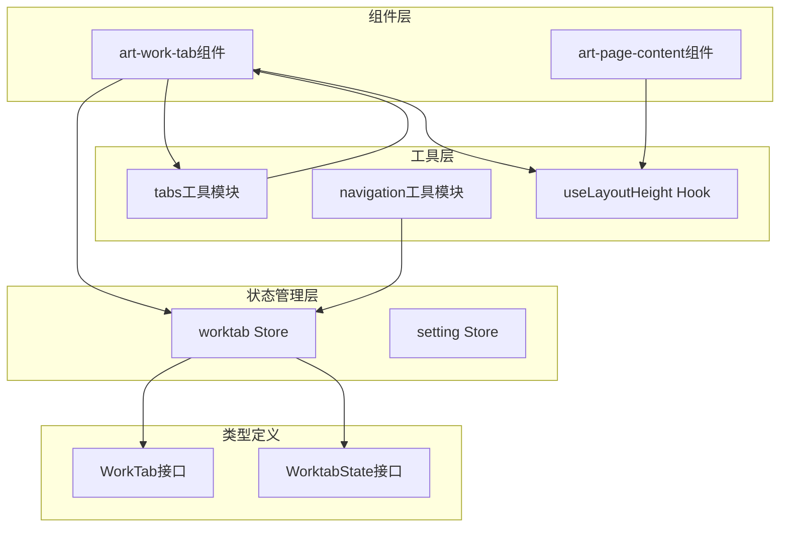
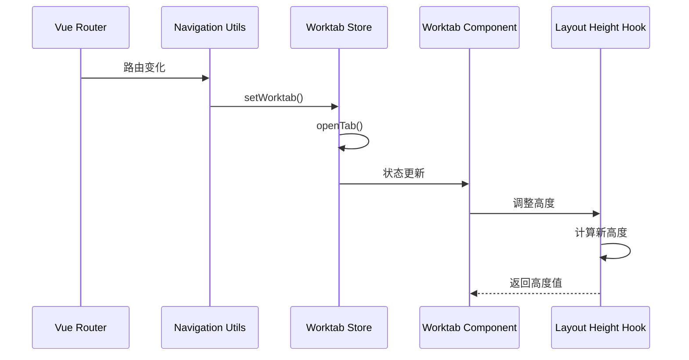
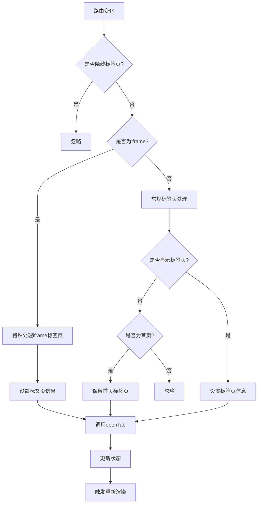
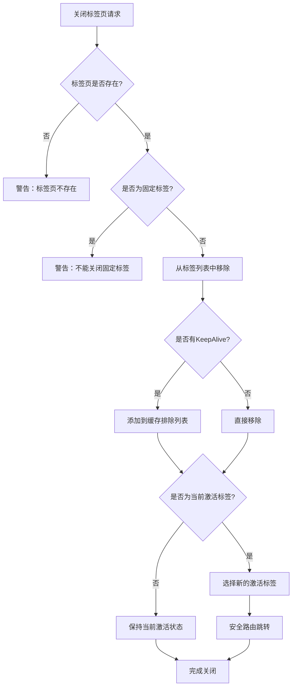
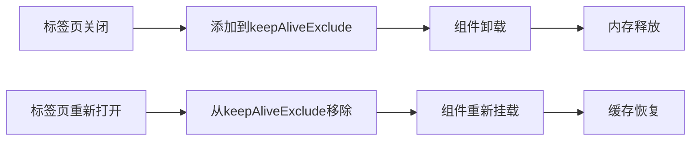
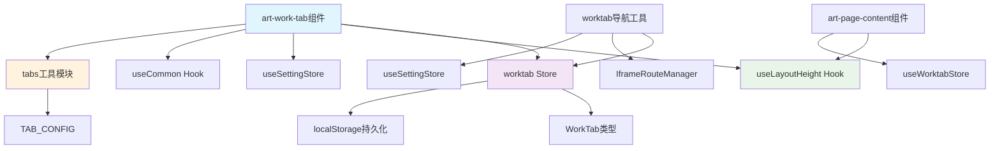

# 工作标签

<cite>
**本文档中引用的文件**
- [src/components/core/layouts/art-work-tab/index.vue](file://src/components/core/layouts/art-work-tab/index.vue)
- [src/store/modules/worktab.ts](file://src/store/modules/worktab.ts)
- [src/utils/ui/tabs.ts](file://src/utils/ui/tabs.ts)
- [src/hooks/core/useLayoutHeight.ts](file://src/hooks/core/useLayoutHeight.ts)
- [src/utils/navigation/worktab.ts](file://src/utils/navigation/worktab.ts)
- [src/types/store/index.ts](file://src/types/store/index.ts)
- [src/components/core/layouts/art-page-content/index.vue](file://src/components/core/layouts/art-page-content/index.vue)
</cite>

## 目录
1. [简介](#简介)
2. [项目结构](#项目结构)
3. [核心组件](#核心组件)
4. [架构概览](#架构概览)
5. [详细组件分析](#详细组件分析)
6. [依赖关系分析](#依赖关系分析)
7. [性能考虑](#性能考虑)
8. [故障排除指南](#故障排除指南)
9. [结论](#结论)

## 简介

art-work-tab组件是一个功能强大的多标签页管理系统，提供了完整的标签页生命周期管理、状态持久化和用户交互功能。该组件与Vue Router深度集成，支持标签页的自动创建、关闭、固定和批量管理，并提供了多种标签页样式和高度配置选项。

### 主要特性

- **智能标签页复用**：基于路由名称的标签页复用机制
- **标签页固定功能**：保护重要标签页不被意外关闭
- **批量关闭操作**：支持左侧、右侧、其他和全部标签页关闭
- **KeepAlive缓存管理**：智能的页面缓存排除机制
- **路由验证**：动态路由有效性检查和自动清理
- **状态持久化**：基于localStorage的标签页状态保存
- **多种标签页样式**：默认、卡片和谷歌风格三种样式
- **响应式布局**：自动调整页面内容区域高度

## 项目结构

art-work-tab组件采用模块化的架构设计，主要包含以下核心模块：



**图表来源**
- [src/components/core/layouts/art-work-tab/index.vue](file://src/components/core/layouts/art-work-tab/index.vue#L1-L50)
- [src/store/modules/worktab.ts](file://src/store/modules/worktab.ts#L47-L568)

**章节来源**
- [src/components/core/layouts/art-work-tab/index.vue](file://src/components/core/layouts/art-work-tab/index.vue#L1-L469)
- [src/store/modules/worktab.ts](file://src/store/modules/worktab.ts#L1-L569)

## 核心组件

### art-work-tab组件

art-work-tab组件是整个标签页系统的核心UI组件，负责标签页的渲染和用户交互。

#### 主要功能

- **标签页渲染**：动态渲染标签页列表，支持固定标签和普通标签
- **用户交互**：点击切换、右键菜单、拖拽排序等功能
- **样式适配**：支持三种不同的标签页样式
- **滚动控制**：自动处理标签页过多时的滚动行为

#### 核心属性和方法

组件暴露了多个计算属性和方法来管理标签页状态：

- `list`: 当前打开的标签页列表
- `activeTab`: 当前激活的标签页路径
- `activeTabIndex`: 当前激活标签页的索引
- `clickTab()`: 切换到指定标签页
- `closeWorktab()`: 关闭指定类型的标签页
- `showMenu()`: 显示右键菜单

**章节来源**
- [src/components/core/layouts/art-work-tab/index.vue](file://src/components/core/layouts/art-work-tab/index.vue#L144-L147)
- [src/components/core/layouts/art-work-tab/index.vue](file://src/components/core/layouts/art-work-tab/index.vue#L372-L441)

### worktab状态管理模块

worktab状态管理模块基于Pinia构建，提供了完整的标签页状态管理功能。

#### 核心状态

- `current`: 当前激活的标签页信息
- `opened`: 所有打开的标签页列表
- `keepAliveExclude`: KeepAlive缓存排除列表

#### 主要方法

- `openTab()`: 打开或激活标签页
- `removeTab()`: 关闭指定标签页
- `removeLeft()/removeRight()/removeOthers()/removeAll()`: 批量关闭标签页
- `toggleFixedTab()`: 切换标签页固定状态
- `validateWorktabs()`: 验证标签页路由有效性

**章节来源**
- [src/store/modules/worktab.ts](file://src/store/modules/worktab.ts#L47-L568)

## 架构概览

art-work-tab组件采用了分层架构设计，确保了良好的可维护性和扩展性：



**图表来源**
- [src/utils/navigation/worktab.ts](file://src/utils/navigation/worktab.ts#L35-L67)
- [src/store/modules/worktab.ts](file://src/store/modules/worktab.ts#L114-L163)

## 详细组件分析

### 标签页样式配置

art-work-tab组件支持三种不同的标签页样式，每种样式都有独特的高度和间距配置：

#### 默认样式 (tab-default)
- **openTop**: 106px - 标签页显示时内容区域距离顶部的距离
- **closeTop**: 60px - 标签页隐藏时内容区域距离顶部的距离  
- **openHeight**: 121px - 标签页显示时的总高度
- **closeHeight**: 75px - 标签页隐藏时的总高度

#### 卡片样式 (tab-card)
- **openTop**: 122px - 标签页显示时内容区域距离顶部的距离
- **closeTop**: 78px - 标签页隐藏时内容区域距离顶部的距离
- **openHeight**: 139px - 标签页显示时的总高度
- **closeHeight**: 95px - 标签页隐藏时的总高度

#### 谷歌风格 (tab-google)
- **openTop**: 122px - 标签页显示时内容区域距离顶部的距离
- **closeTop**: 78px - 标签页隐藏时内容区域距离顶部的距离
- **openHeight**: 139px - 标签页显示时的总高度
- **closeHeight**: 95px - 标签页隐藏时的总高度

**章节来源**
- [src/utils/ui/tabs.ts](file://src/utils/ui/tabs.ts#L36-L54)

### useLayoutHeight组合式函数

useLayoutHeight Hook负责根据标签栏的显示状态动态调整页面内容区域高度：

#### 核心功能

- **动态高度计算**：根据头部元素高度自动计算内容区域高度
- **响应式监听**：自动监听元素尺寸变化并更新高度
- **CSS变量同步**：自动更新CSS变量，方便全局使用
- **灵活配置**：支持自定义间距、CSS变量名等

#### 配置选项

```typescript
interface LayoutHeightOptions {
  extraSpacing?: number        // 额外的间距（默认 15px）
  updateCssVar?: boolean      // 是否自动更新 CSS 变量（默认 true）
  cssVarName?: string         // CSS 变量名称（默认 '--art-full-height'）
}
```

**章节来源**
- [src/hooks/core/useLayoutHeight.ts](file://src/hooks/core/useLayoutHeight.ts#L25-L32)

### 标签页生命周期管理

#### 标签页打开流程



**图表来源**
- [src/utils/navigation/worktab.ts](file://src/utils/navigation/worktab.ts#L35-L67)

#### 标签页关闭流程



**图表来源**
- [src/store/modules/worktab.ts](file://src/store/modules/worktab.ts#L181-L222)

### 标签页右键菜单系统

art-work-tab组件提供了丰富的右键菜单功能：

#### 菜单项配置

| 功能 | 键值 | 描述 | 禁用条件 |
|------|------|------|----------|
| 刷新 | refresh | 刷新当前标签页 | 非当前标签页 |
| 固定/取消固定 | fixed | 切换标签页固定状态 | 无 |
| 关闭左侧 | left | 关闭左侧所有可关闭标签页 | 已在最左侧或左侧全为固定 |
| 关闭右侧 | right | 关闭右侧所有可关闭标签页 | 已在最右侧或右侧全为固定 |
| 关闭其他 | other | 关闭除当前标签页外的所有标签页 | 只有一个标签页或其余全为固定 |
| 关闭全部 | all | 关闭所有可关闭标签页 | 无固定标签且只有一个标签 |

**章节来源**
- [src/components/core/layouts/art-work-tab/index.vue](file://src/components/core/layouts/art-work-tab/index.vue#L182-L219)

### 性能优化策略

#### 标签页缓存管理

worktab状态管理模块实现了智能的KeepAlive缓存排除机制：



#### 动态路由验证

为了防止无效路由导致的错误，系统实现了动态路由验证机制：

- **路由名称验证**：优先使用路由名称判断有效性
- **路径解析验证**：使用router.resolve匹配参数化路径
- **自动清理**：发现无效标签页时自动清理
- **状态恢复**：验证当前激活标签的有效性并自动恢复

**章节来源**
- [src/store/modules/worktab.ts](file://src/store/modules/worktab.ts#L433-L476)

## 依赖关系分析

art-work-tab组件的依赖关系体现了清晰的分层架构：



**图表来源**
- [src/components/core/layouts/art-work-tab/index.vue](file://src/components/core/layouts/art-work-tab/index.vue#L87-L98)
- [src/store/modules/worktab.ts](file://src/store/modules/worktab.ts#L40-L46)

**章节来源**
- [src/components/core/layouts/art-work-tab/index.vue](file://src/components/core/layouts/art-work-tab/index.vue#L87-L123)
- [src/store/modules/worktab.ts](file://src/store/modules/worktab.ts#L40-L46)

## 性能考虑

### 内存管理

art-work-tab组件通过以下策略优化内存使用：

1. **智能缓存排除**：标签页关闭时自动添加到KeepAlive排除列表
2. **状态压缩**：只存储必要的标签页信息，避免冗余数据
3. **延迟加载**：非活跃标签页的内容按需加载
4. **自动清理**：定期清理无效的标签页状态

### 渲染优化

1. **虚拟滚动**：大量标签页时使用虚拟滚动技术
2. **防抖处理**：路由变化时使用防抖减少不必要的重新渲染
3. **条件渲染**：根据配置动态决定是否渲染标签栏
4. **CSS优化**：使用CSS变量减少重复计算

### 网络优化

1. **懒加载**：标签页内容按需加载
2. **缓存策略**：合理利用浏览器缓存
3. **预加载**：对可能访问的标签页进行预加载

## 故障排除指南

### 常见问题及解决方案

#### 标签页状态丢失

**问题描述**：刷新页面后标签页状态消失

**解决方案**：
1. 检查localStorage是否可用
2. 确认持久化配置正确
3. 验证序列化/反序列化过程

#### 标签页滚动异常

**问题描述**：标签页过多时滚动行为异常

**解决方案**：
1. 检查scrollRef和tabsRef的DOM引用
2. 验证滚动状态计算逻辑
3. 确认CSS样式冲突

#### 高度计算错误

**问题描述**：页面内容区域高度计算不准确

**解决方案**：
1. 检查useLayoutHeight配置
2. 验证头部元素高度获取
3. 确认CSS变量更新时机

**章节来源**
- [src/store/modules/worktab.ts](file://src/store/modules/worktab.ts#L562-L567)
- [src/hooks/core/useLayoutHeight.ts](file://src/hooks/core/useLayoutHeight.ts#L46-L49)

## 结论

art-work-tab组件是一个功能完整、架构清晰的多标签页管理系统。它通过模块化的设计、智能的状态管理和丰富的用户交互功能，为用户提供了优秀的多标签页体验。

### 主要优势

1. **功能完整**：涵盖了标签页管理的所有核心功能
2. **架构清晰**：分层设计便于维护和扩展
3. **性能优化**：智能缓存和内存管理策略
4. **用户体验**：丰富的交互功能和美观的界面设计
5. **可配置性强**：支持多种样式和配置选项

### 扩展建议

1. **拖拽排序**：可以添加标签页拖拽排序功能
2. **快捷键支持**：增加键盘快捷键操作
3. **标签页搜索**：提供标签页快速搜索功能
4. **多窗口支持**：支持跨窗口标签页共享
5. **移动端优化**：增强移动端的标签页体验

通过持续的优化和功能扩展，art-work-tab组件将继续为用户提供更加优秀的多标签页管理体验。