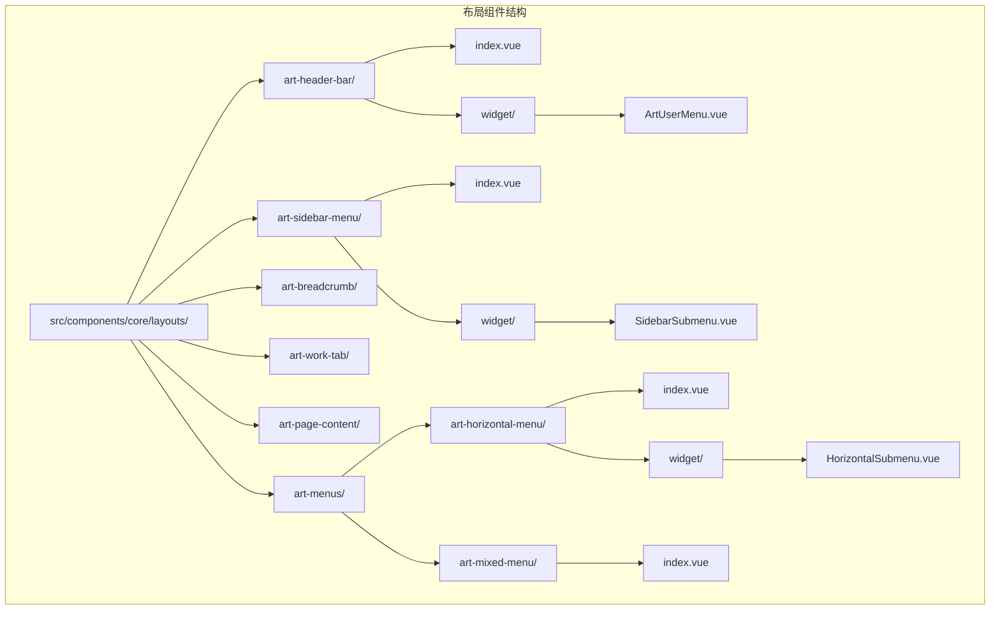
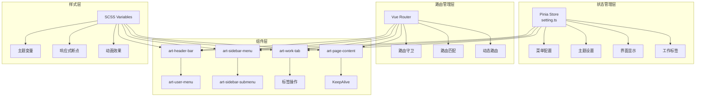
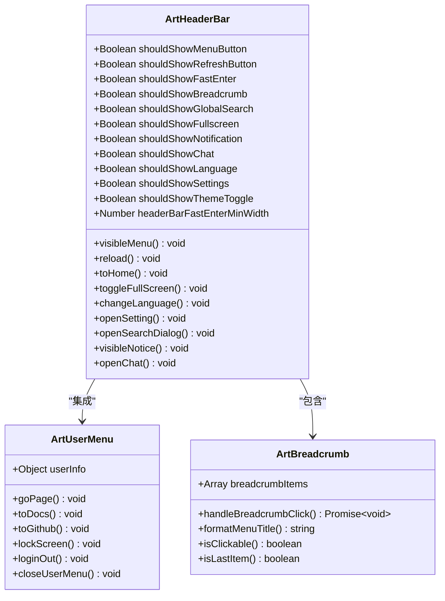
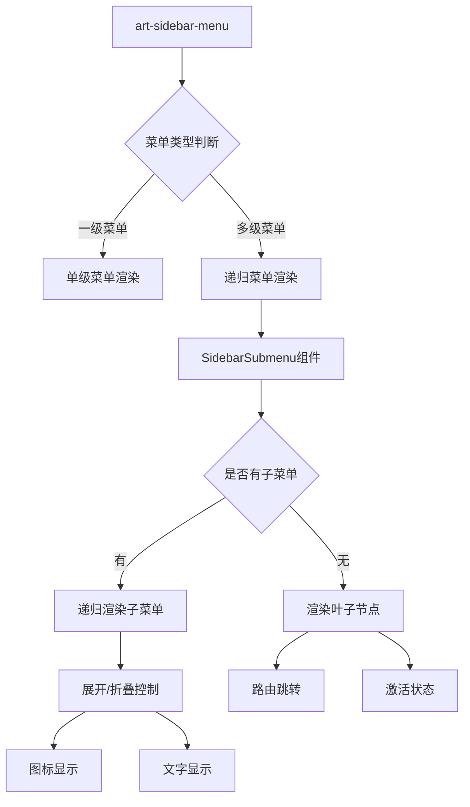
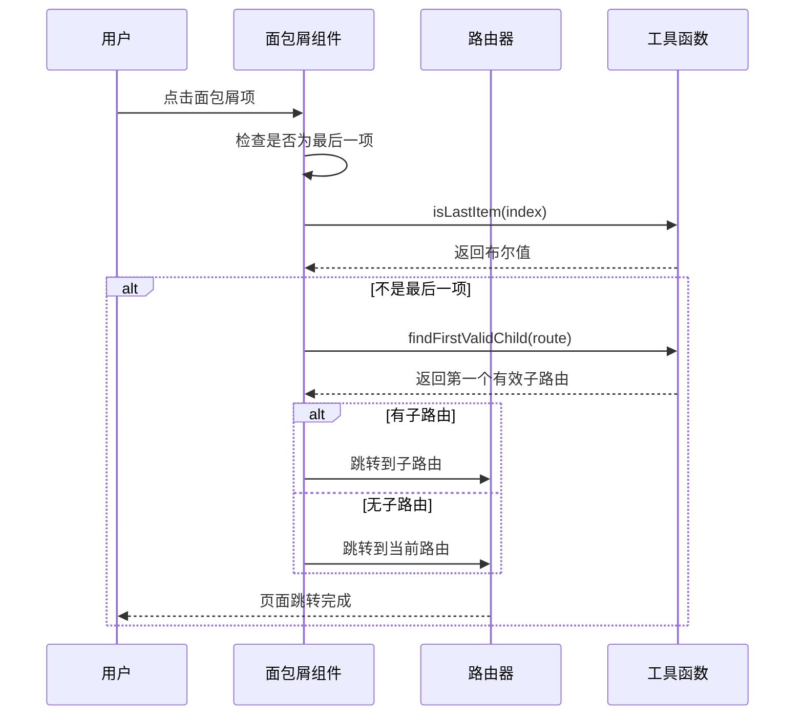
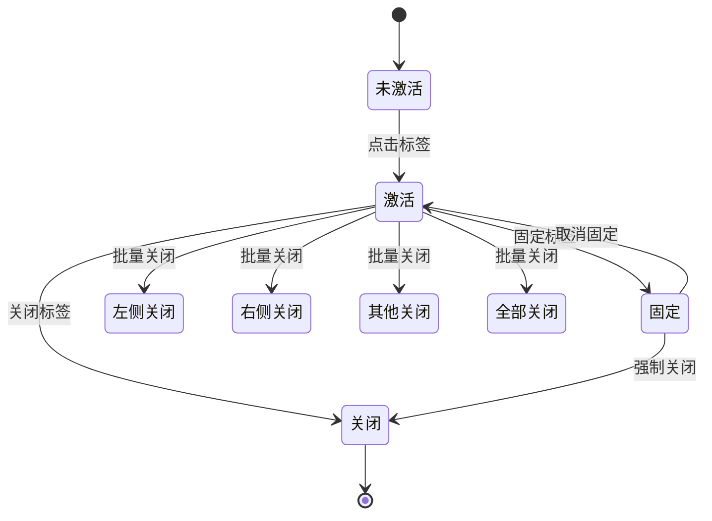
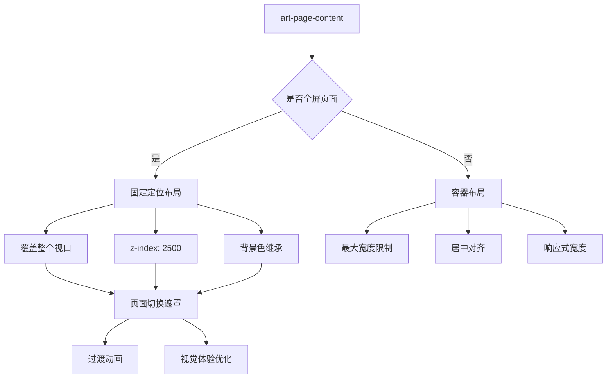
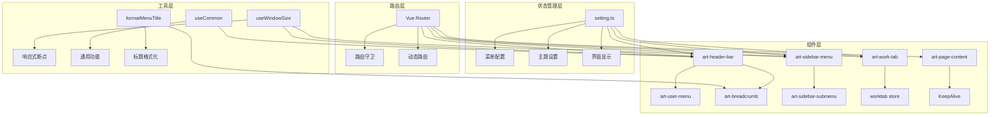

# 布局组件

<cite>
**本文档中引用的文件**
- [art-header-bar/index.vue](file://src/components/core/layouts/art-header-bar/index.vue)
- [art-header-bar/widget/ArtUserMenu.vue](file://src/components/core/layouts/art-header-bar/widget/ArtUserMenu.vue)
- [art-sidebar-menu/index.vue](file://src/components/core/layouts/art-sidebar-menu/index.vue)
- [art-sidebar-menu/widget/SidebarSubmenu.vue](file://src/components/core/layouts/art-sidebar-menu/widget/SidebarSubmenu.vue)
- [art-breadcrumb/index.vue](file://src/components/core/layouts/art-breadcrumb/index.vue)
- [art-work-tab/index.vue](file://src/components/core/layouts/art-work-tab/index.vue)
- [art-page-content/index.vue](file://src/components/core/layouts/art-page-content/index.vue)
- [art-horizontal-menu/index.vue](file://src/components/core/layouts/art-menus/art-horizontal-menu/index.vue)
- [art-mixed-menu/index.vue](file://src/components/core/layouts/art-menus/art-mixed-menu/index.vue)
- [setting.ts](file://src/store/modules/setting.ts)
- [worktab.ts](file://src/store/modules/worktab.ts)
- [app.scss](file://src/assets/styles/core/app.scss)
- [setting.ts](file://src/config/setting.ts)
- [appEnum.ts](file://src/enums/appEnum.ts)
</cite>

## 目录
1. [简介](#简介)
2. [项目结构](#项目结构)
3. [核心布局组件](#核心布局组件)
4. [架构概览](#架构概览)
5. [详细组件分析](#详细组件分析)
6. [依赖关系分析](#依赖关系分析)
7. [性能考虑](#性能考虑)
8. [故障排除指南](#故障排除指南)
9. [结论](#结论)

## 简介

Art Design Pro 是一个基于 Vue 3 和 Element Plus 的现代化企业级前端框架，其布局系统采用模块化设计理念，提供了灵活且可扩展的界面布局方案。该布局系统包含六个核心组件：页眉栏（art-header-bar）、侧边栏菜单（art-sidebar-menu）、面包屑导航（art-breadcrumb）、工作标签页（art-work-tab）、页面内容区（art-page-content）和菜单系统（art-horizontal-menu、art-mixed-menu）。

布局系统的设计遵循响应式原则，支持多种菜单布局模式（左侧、顶部、混合、双栏），提供丰富的主题定制选项，并实现了智能的标签页管理和路由导航功能。整个系统采用 Pinia 状态管理，确保组件间的数据一致性，同时通过组合式 API 提供灵活的功能扩展能力。

## 项目结构

Art Design Pro 布局组件采用清晰的目录结构组织，所有布局相关组件都位于 `src/components/core/layouts/` 目录下：

**图表来源**
- [art-header-bar/index.vue](file://src/components/core/layouts/art-header-bar/index.vue#L1-L50)
- [art-sidebar-menu/index.vue](file://src/components/core/layouts/art-sidebar-menu/index.vue#L1-L50)
- [art-menus/art-horizontal-menu/index.vue](file://src/components/core/layouts/art-menus/art-horizontal-menu/index.vue#L1-L30)

**章节来源**
- [art-header-bar/index.vue](file://src/components/core/layouts/art-header-bar/index.vue#L1-L100)
- [art-sidebar-menu/index.vue](file://src/components/core/layouts/art-sidebar-menu/index.vue#L1-L100)

## 核心布局组件

Art Design Pro 布局系统由六个核心组件构成，每个组件都有明确的职责和功能边界：

### 组件功能矩阵

| 组件名称 | 主要职责 | 核心功能 | 交互特点 |
|---------|---------|---------|---------|
| art-header-bar | 顶部导航栏 | 用户菜单、搜索、通知、设置 | 集成式设计，高度可配置 |
| art-sidebar-menu | 侧边栏菜单 | 导航菜单、主题切换、折叠控制 | 多级菜单支持，响应式布局 |
| art-breadcrumb | 面包屑导航 | 路由导航、层级指示 | 路由感知，可点击跳转 |
| art-work-tab | 工作标签页 | 多标签管理、标签操作 | 拖拽支持，右键菜单 |
| art-page-content | 页面内容区 | 内容渲染、动画过渡 | KeepAlive 缓存，全屏支持 |
| art-horizontal-menu | 水平菜单 | 顶部导航、菜单切换 | 下拉菜单，响应式适配 |
| art-mixed-menu | 混合菜单 | 混合布局、滚动导航 | 水平滚动，智能定位 |

**章节来源**
- [art-header-bar/index.vue](file://src/components/core/layouts/art-header-bar/index.vue#L1-L200)
- [art-sidebar-menu/index.vue](file://src/components/core/layouts/art-sidebar-menu/index.vue#L1-L200)
- [art-breadcrumb/index.vue](file://src/components/core/layouts/art-breadcrumb/index.vue#L1-L100)
- [art-work-tab/index.vue](file://src/components/core/layouts/art-work-tab/index.vue#L1-L200)
- [art-page-content/index.vue](file://src/components/core/layouts/art-page-content/index.vue#L1-L100)

## 架构概览

Art Design Pro 布局系统采用分层架构设计，通过状态管理、路由系统和组件通信实现整体协调：

**图表来源**
- [setting.ts](file://src/store/modules/setting.ts#L1-L100)
- [worktab.ts](file://src/store/modules/worktab.ts#L1-L100)
- [art-header-bar/index.vue](file://src/components/core/layouts/art-header-bar/index.vue#L170-L200)

## 详细组件分析

### art-header-bar 页眉栏组件

art-header-bar 是布局系统的核心头部组件，提供统一的顶部导航界面，集成了用户菜单、搜索、通知、设置等功能模块。

#### 模块化结构设计

**图表来源**
- [art-header-bar/index.vue](file://src/components/core/layouts/art-header-bar/index.vue#L170-L350)
- [art-header-bar/widget/ArtUserMenu.vue](file://src/components/core/layouts/art-header-bar/widget/ArtUserMenu.vue#L60-L120)

#### 用户菜单集成机制

用户菜单（ArtUserMenu）作为页眉栏的重要组成部分，提供了完整的用户交互功能：

- **头像显示**：支持自定义头像图片和用户信息展示
- **功能菜单**：包含个人中心、文档链接、GitHub链接、锁屏功能和退出登录
- **国际化支持**：菜单文本支持多语言切换
- **事件处理**：提供完整的生命周期管理和事件回调机制

#### 响应式设计特性

页眉栏组件实现了完善的响应式设计：

- **断点适配**：支持 xs（<768px）、sm（≥768px）、md（≥992px）、lg（≥1200px）、xl（≥1920px）五个断点
- **功能隐藏**：根据屏幕尺寸智能隐藏次要功能按钮
- **布局调整**：动态调整组件间距和图标大小

**章节来源**
- [art-header-bar/index.vue](file://src/components/core/layouts/art-header-bar/index.vue#L1-L486)
- [art-header-bar/widget/ArtUserMenu.vue](file://src/components/core/layouts/art-header-bar/widget/ArtUserMenu.vue#L1-L168)

### art-sidebar-menu 侧边栏菜单组件

art-sidebar-menu 提供了灵活的侧边栏导航功能，支持多种菜单布局模式和主题样式。

#### 多级菜单渲染架构

**图表来源**
- [art-sidebar-menu/index.vue](file://src/components/core/layouts/art-sidebar-menu/index.vue#L1-L100)
- [art-sidebar-menu/widget/SidebarSubmenu.vue](file://src/components/core/layouts/art-sidebar-menu/widget/SidebarSubmenu.vue#L1-L100)

#### 主题支持机制

侧边栏菜单支持三种主题模式：

- **设计主题**：基于系统主色调的自定义主题
- **亮色主题**：明亮的菜单样式
- **暗色主题**：深色系菜单样式

主题切换通过 CSS 变量系统实现，支持实时动态切换而不影响页面性能。

#### 折叠展开控制

菜单组件提供了完整的折叠展开控制功能：

- **宽度控制**：支持自定义展开宽度（默认230px）
- **动画效果**：平滑的宽度变化动画
- **状态持久化**：折叠状态保存到本地存储
- **响应式适配**：移动端自动折叠

**章节来源**
- [art-sidebar-menu/index.vue](file://src/components/core/layouts/art-sidebar-menu/index.vue#L1-L400)
- [art-sidebar-menu/widget/SidebarSubmenu.vue](file://src/components/core/layouts/art-sidebar-menu/widget/SidebarSubmenu.vue#L1-L200)

### art-breadcrumb 面包屑导航组件

art-breadcrumb 实现了智能的路由导航功能，能够根据当前路由自动生成对应的导航路径。

#### 路由感知导航功能

**图表来源**
- [art-breadcrumb/index.vue](file://src/components/core/layouts/art-breadcrumb/index.vue#L115-L140)

#### 导航规则处理

面包屑组件实现了复杂的导航规则处理：

- **首页处理**：自动识别并处理首页路由
- **一级菜单**：只显示当前页面标题
- **多级菜单**：生成完整的层级导航路径
- **IFrame 页面**：特殊处理嵌套页面的导航
- **包裹容器**：过滤掉容器路由，只显示实际内容

#### 性能优化策略

为了确保良好的用户体验，面包屑组件采用了多项性能优化：

- **计算属性缓存**：使用 computed 替代 watch，减少不必要的重新计算
- **懒加载处理**：只在需要时才解析路由信息
- **事件委托**：使用事件委托减少事件监听器数量

**章节来源**
- [art-breadcrumb/index.vue](file://src/components/core/layouts/art-breadcrumb/index.vue#L1-L143)

### art-work-tab 工作标签页组件

art-work-tab 提供了强大的多标签页管理功能，支持标签的打开、关闭、固定和批量操作。

#### 标签页管理机制

**图表来源**
- [art-work-tab/index.vue](file://src/components/core/layouts/art-work-tab/index.vue#L370-L450)
- [worktab.ts](file://src/store/modules/worktab.ts#L110-L200)

#### 标签页操作功能

工作标签页支持丰富的操作功能：

- **基本操作**：打开、关闭、刷新标签
- **固定功能**：固定重要标签页不被意外关闭
- **批量操作**：关闭左侧、右侧、其他或全部标签
- **拖拽排序**：支持标签页的拖拽重新排序
- **右键菜单**：提供上下文相关的操作选项

#### 滚动交互优化

标签页组件实现了智能的滚动交互：

- **自动定位**：新打开的标签自动滚动到可视区域
- **触控支持**：支持鼠标滚轮和触摸手势滚动
- **边界检测**：智能检测滚动边界，提供视觉反馈
- **性能优化**：使用 requestAnimationFrame 优化滚动性能

**章节来源**
- [art-work-tab/index.vue](file://src/components/core/layouts/art-work-tab/index.vue#L1-L585)
- [worktab.ts](file://src/store/modules/worktab.ts#L1-L300)

### art-page-content 页面内容区组件

art-page-content 是布局系统的内容承载组件，负责页面内容的渲染和动画过渡。

#### 自适应布局策略

**图表来源**
- [art-page-content/index.vue](file://src/components/core/layouts/art-page-content/index.vue#L75-L110)

#### KeepAlive 缓存机制

页面内容组件集成了 KeepAlive 缓存功能：

- **智能缓存**：只缓存需要保持状态的页面组件
- **排除管理**：动态管理缓存排除列表
- **内存优化**：定期清理不需要的缓存组件
- **状态恢复**：页面切换时自动恢复之前的状态

#### 动画过渡系统

组件提供了完整的页面过渡动画支持：

- **内置动画**：支持 slide-left、fade、zoom 等多种动画效果
- **自定义动画**：支持用户自定义过渡动画
- **性能优化**：使用 CSS transitions 减少 JavaScript 开销
- **全屏过渡**：特殊处理全屏页面切换的过渡效果

**章节来源**
- [art-page-content/index.vue](file://src/components/core/layouts/art-page-content/index.vue#L1-L137)

### 菜单系统组件

Art Design Pro 提供了两种专门的菜单组件：水平菜单（art-horizontal-menu）和混合菜单（art-mixed-menu）。

#### 水平菜单功能特性

水平菜单专为顶部导航设计：

- **响应式布局**：支持移动端折叠和展开
- **下拉菜单**：支持多级下拉菜单
- **图标显示**：支持菜单图标和文字组合
- **激活状态**：自动高亮当前页面对应的菜单项

#### 混合菜单创新设计

混合菜单提供了独特的水平滚动导航体验：

- **智能滚动**：自动定位到当前激活的菜单项
- **滚动按钮**：左右箭头按钮辅助导航
- **触摸支持**：支持触摸滑动操作
- **性能优化**：使用节流函数优化滚动性能

**章节来源**
- [art-horizontal-menu/index.vue](file://src/components/core/layouts/art-menus/art-horizontal-menu/index.vue#L1-L111)
- [art-mixed-menu/index.vue](file://src/components/core/layouts/art-menus/art-mixed-menu/index.vue#L1-L280)

## 依赖关系分析

Art Design Pro 布局系统的组件间存在复杂的依赖关系，形成了一个有机的整体：

**图表来源**
- [setting.ts](file://src/store/modules/setting.ts#L1-L50)
- [art-header-bar/index.vue](file://src/components/core/layouts/art-header-bar/index.vue#L170-L200)
- [art-work-tab/index.vue](file://src/components/core/layouts/art-work-tab/index.vue#L85-L120)

### 状态管理集成

布局系统通过 Pinia 状态管理实现组件间的数据共享：

- **菜单状态**：统一管理菜单展开/折叠状态
- **主题状态**：集中控制主题切换和样式配置
- **工作标签**：维护标签页的打开状态和操作历史
- **用户偏好**：保存用户的个性化设置

### 路由系统集成

组件与 Vue Router 紧密集成，实现路由感知功能：

- **路由监听**：监听路由变化自动更新激活状态
- **权限控制**：根据路由权限动态显示/隐藏菜单项
- **面包屑生成**：根据路由层级自动生成导航路径
- **标签页管理**：根据路由自动打开/关闭标签页

**章节来源**
- [setting.ts](file://src/store/modules/setting.ts#L1-L451)
- [worktab.ts](file://src/store/modules/worktab.ts#L1-L569)

## 性能考虑

Art Design Pro 布局系统在设计时充分考虑了性能优化，采用了多种策略确保流畅的用户体验：

### 渲染性能优化

- **虚拟滚动**：对于大量菜单项的场景，使用虚拟滚动技术
- **懒加载**：非关键组件采用懒加载方式
- **防抖节流**：滚动事件和窗口大小变化使用防抖处理
- **计算属性缓存**：大量使用 computed 属性缓存计算结果

### 内存管理优化

- **组件卸载**：及时清理事件监听器和定时器
- **缓存策略**：合理使用 KeepAlive 缓存，避免内存泄漏
- **垃圾回收**：主动释放不再使用的资源引用

### 网络性能优化

- **代码分割**：按需加载非核心功能模块
- **资源预加载**：预加载常用的图标和字体资源
- **CDN 加速**：支持外部资源的 CDN 加载

## 故障排除指南

### 常见布局问题及解决方案

#### 菜单显示异常

**问题描述**：侧边栏菜单无法正常显示或折叠

**解决方案**：
1. 检查菜单配置是否正确
2. 验证 CSS 样式是否加载
3. 确认路由配置是否完整
4. 检查本地存储中的菜单状态

#### 标签页功能失效

**问题描述**：工作标签页无法正常打开或关闭

**解决方案**：
1. 检查 worktab store 的状态
2. 验证路由是否可访问
3. 确认 KeepAlive 配置
4. 检查标签页标题格式化函数

#### 响应式布局错乱

**问题描述**：在不同设备上布局显示异常

**解决方案**：
1. 检查断点配置是否正确
2. 验证 CSS 媒体查询
3. 确认视口设置
4. 检查 Flexbox 布局属性

### 自定义扩展指南

#### 添加新的菜单布局模式

1. 在 `appEnum.ts` 中添加新的菜单类型枚举
2. 在 `setting.ts` 中添加默认配置
3. 在布局组件中处理新的布局逻辑
4. 更新设置面板的相关配置

#### 自定义主题样式

1. 在 `app.scss` 中定义新的 CSS 变量
2. 更新主题切换逻辑
3. 添加相应的暗色模式支持
4. 测试各组件的主题适配

#### 扩展标签页功能

1. 在 `worktab.ts` 中添加新的操作方法
2. 更新标签页组件的事件处理
3. 添加新的右键菜单选项
4. 实现相应的业务逻辑

**章节来源**
- [art-header-bar/index.vue](file://src/components/core/layouts/art-header-bar/index.vue#L230-L250)
- [art-work-tab/index.vue](file://src/components/core/layouts/art-work-tab/index.vue#L370-L400)

## 结论

Art Design Pro 布局组件系统展现了现代前端框架的最佳实践，通过模块化设计、状态管理和响应式架构，为开发者提供了一个功能完善、性能优异的布局解决方案。

### 系统优势

- **模块化设计**：每个组件职责明确，便于维护和扩展
- **状态管理**：统一的状态管理确保数据一致性
- **响应式支持**：完整的响应式设计覆盖各种设备
- **性能优化**：多层次的性能优化策略保证流畅体验
- **可扩展性**：良好的架构设计支持功能扩展

### 技术特色

- **组合式 API**：充分利用 Vue 3 的组合式 API 特性
- **TypeScript 支持**：完整的类型定义确保开发安全
- **CSS 变量系统**：灵活的主题定制能力
- **动画系统**：流畅的过渡动画提升用户体验

### 应用价值

Art Design Pro 布局组件系统不仅是一个技术实现，更是现代前端开发理念的体现。它为企业级应用提供了标准化的界面解决方案，降低了开发成本，提高了开发效率，为构建高质量的用户界面奠定了坚实的基础。

通过深入理解和掌握这套布局系统，开发者可以更好地利用其强大功能，快速构建出符合现代设计规范的企业级应用界面。