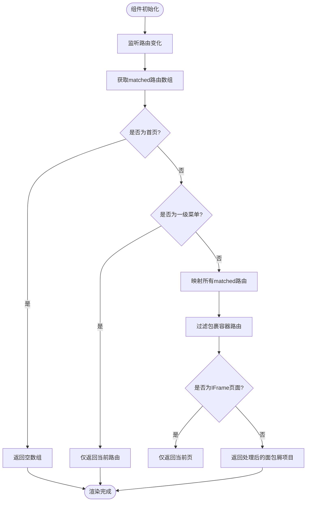
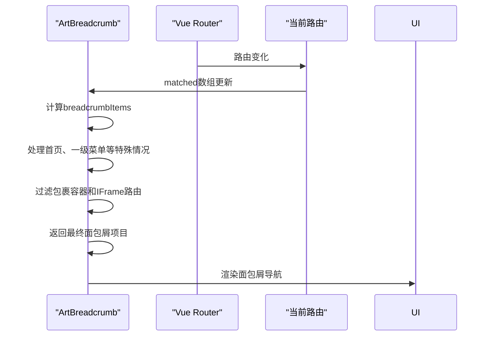
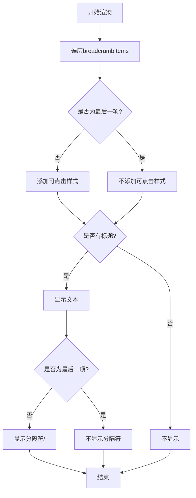
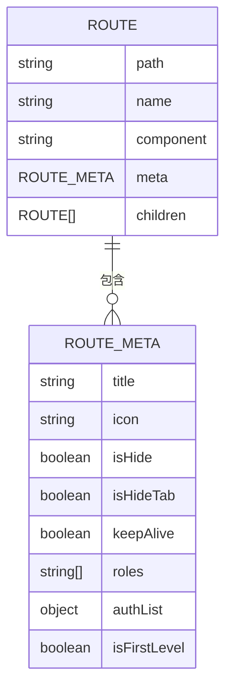
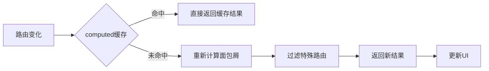
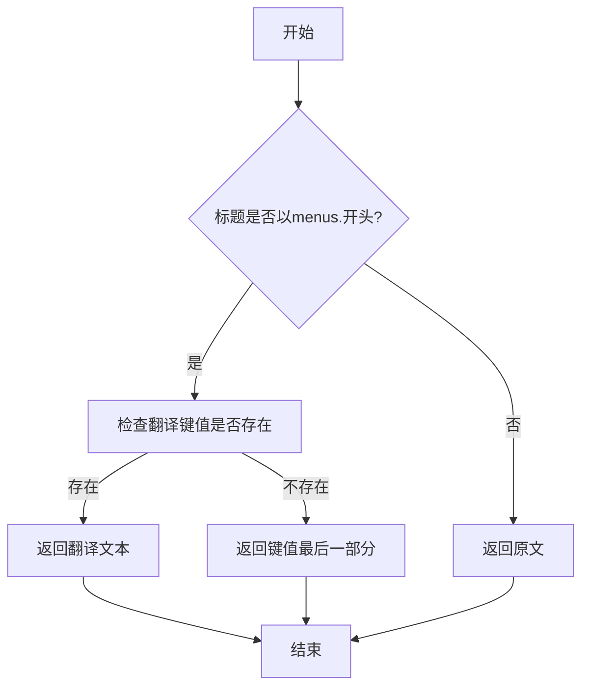

# 面包屑导航

<cite>
**本文档引用文件**  
- [art-breadcrumb/index.vue](file://src/components/core/layouts/art-breadcrumb/index.vue)
- [router/index.ts](file://src/router/index.ts)
- [types/router/index.ts](file://src/types/router/index.ts)
- [utils/router.ts](file://src/utils/router.ts)
- [system.ts](file://src/router/modules/system.ts)
- [examples.ts](file://src/router/modules/examples.ts)
- [dashboard.ts](file://src/router/modules/dashboard.ts)
- [art-header-bar/index.vue](file://src/components/core/layouts/art-header-bar/index.vue)
- [useHeaderBar.ts](file://src/hooks/core/useHeaderBar.ts)
- [useSettingsConfig.ts](file://src/components/core/layouts/art-settings-panel/composables/useSettingsConfig.ts)
- [zh.json](file://src/locales/langs/zh.json)
- [en.json](file://src/locales/langs/en.json)
</cite>

## 目录
1. [简介](#简介)
2. [核心功能解析](#核心功能解析)
3. [路由感知与动态生成机制](#路由感知与动态生成机制)
4. [渲染逻辑与UI处理](#渲染逻辑与ui处理)
5. [路由配置与meta字段自定义](#路由配置与meta字段自定义)
6. [实际使用示例](#实际使用示例)
7. [性能优化措施](#性能优化措施)
8. [自定义样式与国际化支持](#自定义样式与国际化支持)
9. [总结](#总结)

## 简介
`art-breadcrumb` 是一个基于 Vue Router 的智能面包屑导航组件，能够自动感知当前路由变化并动态生成层级导航路径。该组件通过监听路由的 `matched` 属性，解析路由元信息（meta）来构建导航层级，支持点击跳转、路径分隔符显示、国际化文本等特性。组件集成在顶部栏中，可通过系统设置开启或关闭，为用户提供清晰的页面位置指引。

**Section sources**
- [art-breadcrumb/index.vue](file://src/components/core/layouts/art-breadcrumb/index.vue)
- [art-header-bar/index.vue](file://src/components/core/layouts/art-header-bar/index.vue)

## 核心功能解析
`art-breadcrumb` 组件的核心功能是根据当前路由自动生成面包屑路径，并支持用户点击返回上级页面。组件通过 Vue 的 `computed` 属性监听路由变化，避免使用 `watch` 带来的性能开销。面包屑项目基于当前路由的 `matched` 数组生成，每个项目包含路径和元信息（meta），用于显示标题和控制行为。

组件支持多种特殊场景处理：
- 首页不显示面包屑
- 一级菜单仅显示当前页
- 过滤包裹容器路由（如 `/outside`）
- IFrame 页面的特殊处理



**Diagram sources**
- [art-breadcrumb/index.vue](file://src/components/core/layouts/art-breadcrumb/index.vue)

**Section sources**
- [art-breadcrumb/index.vue](file://src/components/core/layouts/art-breadcrumb/index.vue)

## 路由感知与动态生成机制
`art-breadcrumb` 组件通过 Vue Router 的 `useRoute()` 和 `useRouter()` Composition API 实现路由感知。组件使用 `computed` 属性 `breadcrumbItems` 来动态生成面包屑项目，该属性依赖于当前路由的 `matched` 数组。

当路由发生变化时，`matched` 数组会自动更新，触发 `breadcrumbItems` 重新计算。组件通过遍历 `matched` 数组，提取每个路由的 `path` 和 `meta` 信息，构建面包屑项目。对于一级菜单（`isFirstLevel: true`），组件仅显示当前页面，避免冗余层级。



**Diagram sources**
- [art-breadcrumb/index.vue](file://src/components/core/layouts/art-breadcrumb/index.vue)
- [router/index.ts](file://src/router/index.ts)

**Section sources**
- [art-breadcrumb/index.vue](file://src/components/core/layouts/art-breadcrumb/index.vue)

## 渲染逻辑与UI处理
`art-breadcrumb` 组件的渲染逻辑基于 Vue 的模板语法，使用 `<ul>` 和 `<li>` 元素构建导航结构。每个面包屑项目包含一个可点击的 `<div>` 和一个分隔符 `<div>`。组件通过 CSS 类控制样式，支持悬停效果和响应式布局。

关键UI处理逻辑包括：
- **路径分隔符**：在非最后一项且有标题时显示 `/` 分隔符
- **文本显示**：使用 `formatMenuTitle` 函数格式化标题，支持国际化
- **可点击链接**：除最后一项和 `/outside` 路由外，其他项目均可点击
- **文本截断**：使用 `text-ellipsis` 实现长文本截断
- **响应式隐藏**：在小屏幕（max-lg）下隐藏面包屑



**Diagram sources**
- [art-breadcrumb/index.vue](file://src/components/core/layouts/art-breadcrumb/index.vue)

**Section sources**
- [art-breadcrumb/index.vue](file://src/components/core/layouts/art-breadcrumb/index.vue)

## 路由配置与meta字段自定义
`art-breadcrumb` 组件依赖路由的 `meta` 字段来生成面包屑。`meta` 接口定义在 `types/router/index.ts` 中，包含 `title`、`icon`、`isHide` 等字段。其中 `title` 字段用于显示面包屑文本，支持国际化键值（如 `menus.system.user`）。

通过 `meta.isHide` 字段可以隐藏特定层级的面包屑。例如，在 `system.ts` 路由配置中，`user-center` 路由设置了 `isHide: true`，因此不会出现在面包屑中。



**Diagram sources**
- [types/router/index.ts](file://src/types/router/index.ts)
- [system.ts](file://src/router/modules/system.ts)

**Section sources**
- [types/router/index.ts](file://src/types/router/index.ts)
- [system.ts](file://src/router/modules/system.ts)

## 实际使用示例
以下是不同路由嵌套深度下的面包屑表现行为示例：

### 示例1：系统管理模块（三级嵌套）
```typescript
// 路由配置
{
  path: '/system',
  meta: { title: 'menus.system.title' },
  children: [
    {
      path: 'user',
      meta: { title: 'menus.system.user' },
      children: [
        {
          path: 'detail',
          meta: { title: '用户详情' }
        }
      ]
    }
  ]
}
```
当访问 `/system/user/detail` 时，面包屑显示为：  
`系统管理 / 用户管理 / 用户详情`

### 示例2：嵌套路由（四级嵌套）
```typescript
// 路由配置
{
  path: '/system',
  meta: { title: 'menus.system.title' },
  children: [
    {
      path: 'nested',
      meta: { title: 'menus.system.nested' },
      children: [
        {
          path: 'menu3',
          meta: { title: 'menus.system.menu3' },
          children: [
            {
              path: 'menu3-2',
              meta: { title: 'menus.system.menu32' },
              children: [
                {
                  path: 'menu3-2-1',
                  meta: { title: 'menus.system.menu321' }
                }
              ]
            }
          ]
        }
      ]
    }
  ]
}
```
当访问 `/system/nested/menu3/menu3-2/menu3-2-1` 时，面包屑显示为：  
`系统管理 / 嵌套路由 / 菜单3 / 菜单3-2 / 菜单3-2-1`

### 示例3：一级菜单
```typescript
// 路由配置
{
  path: '/dashboard',
  meta: { title: 'menus.dashboard.title', isFirstLevel: true },
  children: [
    {
      path: 'console',
      meta: { title: 'menus.dashboard.console' }
    }
  ]
}
```
当访问 `/dashboard/console` 时，面包屑仅显示：  
`控制台`

**Section sources**
- [system.ts](file://src/router/modules/system.ts)
- [dashboard.ts](file://src/router/modules/dashboard.ts)
- [examples.ts](file://src/router/modules/examples.ts)

## 性能优化措施
`art-breadcrumb` 组件采用了多项性能优化措施：

1. **使用 computed 替代 watch**：通过 `computed` 属性自动响应路由变化，避免手动监听带来的性能开销
2. **防抖处理**：虽然代码中未显式实现防抖，但 `computed` 本身的缓存机制已提供类似效果
3. **路由表缓存**：在点击处理函数中，通过 `router.getRoutes()` 获取路由表并缓存查找结果
4. **最小化重渲染**：仅在路由变化时重新计算面包屑项目，避免不必要的组件更新

组件还通过以下方式优化用户体验：
- 使用 `setTimeout` 延迟设置页面标题，避免阻塞主线程
- 通过 `te()` 方法检查翻译键值是否存在，避免控制台警告
- 对长文本进行截断处理，防止布局溢出



**Diagram sources**
- [art-breadcrumb/index.vue](file://src/components/core/layouts/art-breadcrumb/index.vue)
- [utils/router.ts](file://src/utils/router.ts)

**Section sources**
- [art-breadcrumb/index.vue](file://src/components/core/layouts/art-breadcrumb/index.vue)
- [utils/router.ts](file://src/utils/router.ts)

## 自定义样式与国际化支持
`art-breadcrumb` 组件支持通过 CSS 变量和类名进行样式自定义。组件使用 Tailwind CSS 和 SCSS 混合编写样式，支持暗色模式切换。

### 国际化实现方法
组件通过 `formatMenuTitle` 工具函数实现国际化支持。该函数检查标题是否以 `menus.` 开头，若是则作为 i18n 键值进行翻译，否则直接返回原文。

```typescript
// utils/router.ts
export const formatMenuTitle = (title: string): string => {
  if (title) {
    if (title.startsWith('menus.')) {
      if (i18n.global.te(title)) {
        return $t(title)
      } else {
        return title.split('.').pop() || title
      }
    }
    return title
  }
  return ''
}
```

### 样式自定义
用户可以通过覆盖以下 CSS 类来自定义样式：
- `.art-breadcrumb`: 根容器
- `.breadcrumb-item`: 面包屑项目
- `.breadcrumb-link`: 可点击链接
- `.breadcrumb-separator`: 分隔符

组件还支持通过系统设置面板全局控制面包屑的显示与隐藏。



**Diagram sources**
- [utils/router.ts](file://src/utils/router.ts)
- [zh.json](file://src/locales/langs/zh.json)
- [en.json](file://src/locales/langs/en.json)

**Section sources**
- [utils/router.ts](file://src/utils/router.ts)
- [zh.json](file://src/locales/langs/zh.json)
- [en.json](file://src/locales/langs/en.json)

## 总结
`art-breadcrumb` 组件是一个功能完善、性能优良的面包屑导航解决方案。它通过智能解析路由元信息，自动生成层级导航路径，支持复杂的路由嵌套场景。组件采用 `computed` 实现响应式更新，避免了性能瓶颈，并通过多种特殊场景处理确保用户体验的一致性。

组件的国际化支持通过 `formatMenuTitle` 函数实现，能够自动识别翻译键值并返回对应语言的文本。样式方面，组件采用现代 CSS 技术，支持暗色模式和响应式布局。

通过系统设置面板，用户可以全局控制面包屑的显示状态，体现了良好的可配置性。整体设计遵循了高内聚、低耦合的原则，便于维护和扩展。

**Section sources**
- [art-breadcrumb/index.vue](file://src/components/core/layouts/art-breadcrumb/index.vue)
- [useSettingsConfig.ts](file://src/components/core/layouts/art-settings-panel/composables/useSettingsConfig.ts)
- [useHeaderBar.ts](file://src/hooks/core/useHeaderBar.ts)