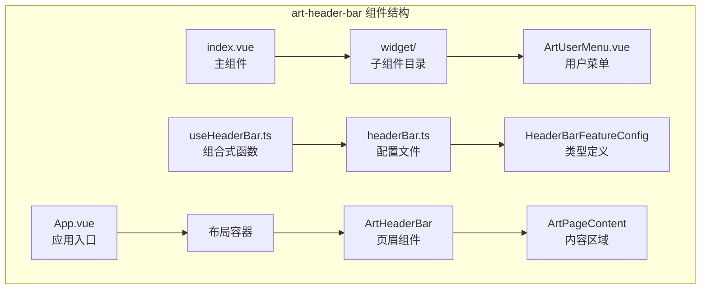
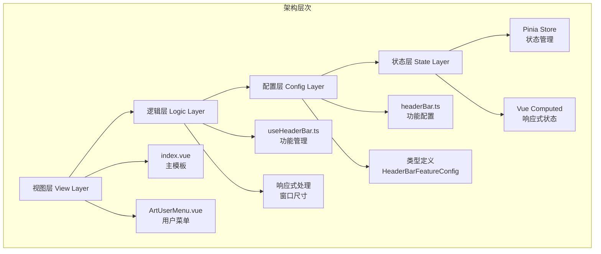
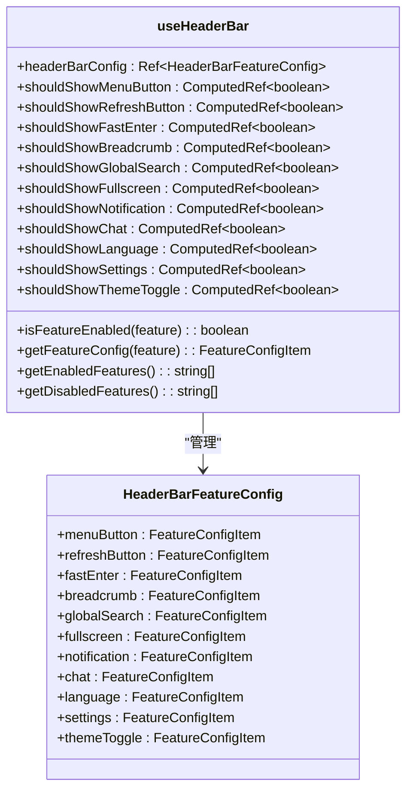
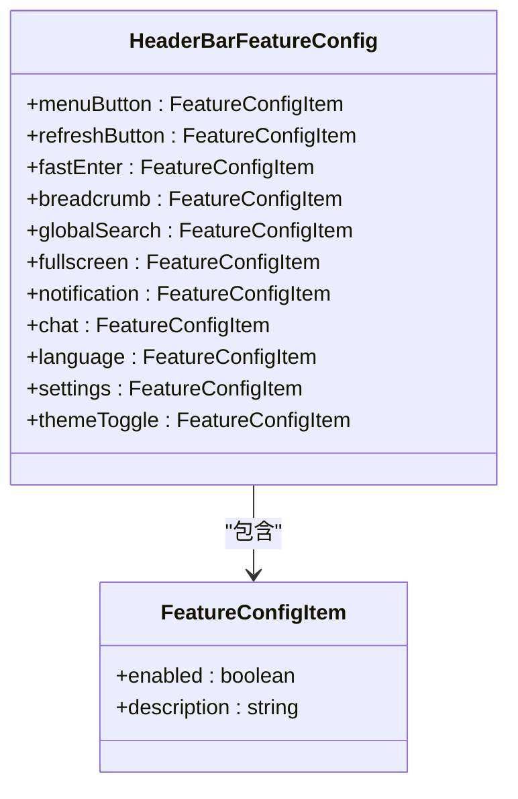
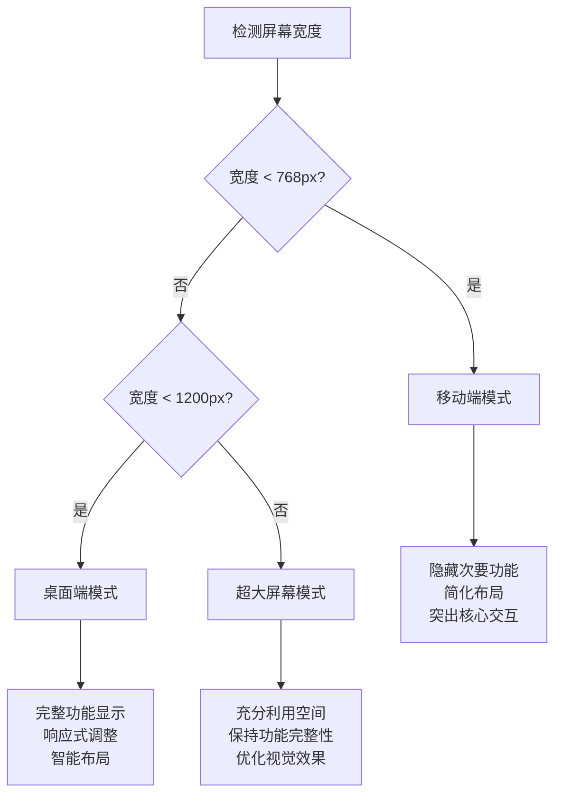
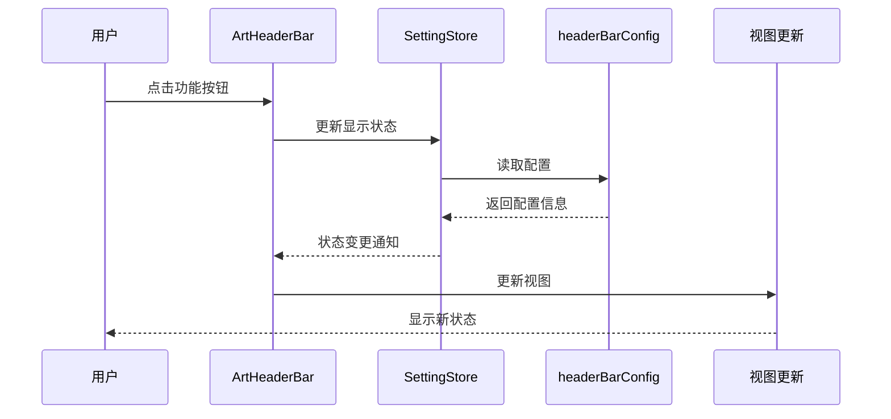
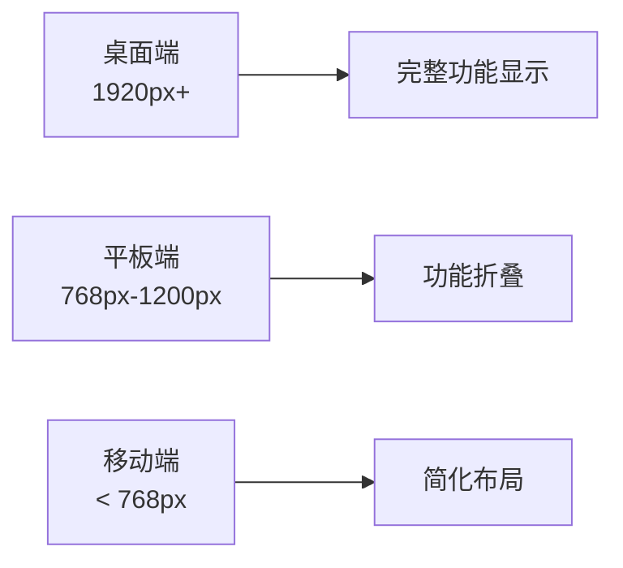

# art-header-bar 页眉组件详细文档

<cite>
**本文档中引用的文件**
- [src/components/layouts/art-header-bar/index.vue](file://src/components/layouts/art-header-bar/index.vue)
- [src/components/layouts/art-header-bar/widget/ArtUserMenu.vue](file://src/components/layouts/art-header-bar/widget/ArtUserMenu.vue)
- [src/hooks/core/useHeaderBar.ts](file://src/hooks/core/useHeaderBar.ts)
- [src/config/modules/headerBar.ts](file://src/config/modules/headerBar.ts)
- [src/types/config/index.ts](file://src/types/config/index.ts)
- [src/components/core/layouts/art-page-content/index.vue](file://src/components/core/layouts/art-page-content/index.vue)
- [src/views/index/index.vue](file://src/views/index/index.vue)
- [src/App.vue](file://src/App.vue)
</cite>

## 目录
1. [简介](#简介)
2. [项目结构](#项目结构)
3. [核心组件](#核心组件)
4. [架构概览](#架构概览)
5. [详细组件分析](#详细组件分析)
6. [配置系统](#配置系统)
7. [响应式设计](#响应式设计)
8. [状态管理](#状态管理)
9. [使用示例](#使用示例)
10. [故障排除](#故障排除)
11. [总结](#总结)

## 简介

art-header-bar 是 Art Design Pro 框架中的核心页眉组件，提供了现代化的企业级仪表板界面所需的顶部导航功能。该组件采用模块化设计，支持灵活的功能配置，具备完善的响应式适配能力，并与系统的其他布局组件紧密协作。

### 主要特性

- **模块化架构**：支持独立的功能模块，可按需启用或禁用
- **响应式设计**：完美适配桌面、平板和移动设备
- **灵活配置**：通过配置文件自定义功能显示状态
- **状态管理**：统一的状态管理机制，支持动态更新
- **国际化支持**：内置多语言切换功能
- **主题适配**：支持明暗主题切换

## 项目结构

art-header-bar 组件在项目中的组织结构如下：



**图表来源**
- [src/components/layouts/art-header-bar/index.vue](file://src/components/layouts/art-header-bar/index.vue#L1-L50)
- [src/components/layouts/art-header-bar/widget/ArtUserMenu.vue](file://src/components/layouts/art-header-bar/widget/ArtUserMenu.vue#L1-L30)

**章节来源**
- [src/components/layouts/art-header-bar/index.vue](file://src/components/layouts/art-header-bar/index.vue#L1-L100)
- [src/views/index/index.vue](file://src/views/index/index.vue#L1-L20)

## 核心组件

### 主组件 index.vue

主组件是整个页眉功能的核心控制器，负责协调各个功能模块的显示和交互。

#### 布局结构

组件采用 Flexbox 布局，分为左右两个主要区域：

1. **左侧区域**：包含系统标识、菜单按钮、快速入口等
2. **右侧区域**：包含搜索、通知、用户菜单等功能按钮

#### 响应式行为

- **桌面端**：完整显示所有功能模块
- **平板端**：根据屏幕宽度动态调整显示优先级
- **移动端**：隐藏次要功能，突出核心交互

### ArtUserMenu.vue 用户菜单

用户菜单组件提供用户个人信息管理和操作功能。

#### 功能特性

- **用户信息展示**：显示用户名、邮箱等基本信息
- **操作菜单**：提供个人中心、文档链接、锁屏、退出登录等功能
- **悬停效果**：优雅的交互动画和视觉反馈

**章节来源**
- [src/components/layouts/art-header-bar/index.vue](file://src/components/layouts/art-header-bar/index.vue#L170-L200)
- [src/components/layouts/art-header-bar/widget/ArtUserMenu.vue](file://src/components/layouts/art-header-bar/widget/ArtUserMenu.vue#L1-L50)

## 架构概览

art-header-bar 采用分层架构设计，确保组件的可维护性和扩展性：



**图表来源**
- [src/hooks/core/useHeaderBar.ts](file://src/hooks/core/useHeaderBar.ts#L28-L50)
- [src/config/modules/headerBar.ts](file://src/config/modules/headerBar.ts#L16-L64)

## 详细组件分析

### useHeaderBar 组合式函数

useHeaderBar 是页眉功能的核心管理器，提供统一的功能开关控制和状态管理。

#### 核心功能



**图表来源**
- [src/hooks/core/useHeaderBar.ts](file://src/hooks/core/useHeaderBar.ts#L28-L202)
- [src/types/config/index.ts](file://src/types/config/index.ts#L188-L212)

#### 功能检查机制

组件提供了多种功能检查方法：

1. **基础检查**：`isFeatureEnabled()` 检查功能是否在配置中启用
2. **状态检查**：`shouldShow*` 计算属性结合 store 状态进行最终判断
3. **配置获取**：`getFeatureConfig()` 获取详细配置信息

### 配置系统详解

#### headerBar.ts 配置文件

配置文件定义了所有可用的功能模块及其初始状态：

| 功能模块 | 默认状态 | 描述 |
|---------|---------|------|
| menuButton | enabled: true | 左侧菜单展开/收起按钮 |
| refreshButton | enabled: true | 页面刷新按钮 |
| fastEnter | enabled: true | 快速入口功能 |
| breadcrumb | enabled: true | 面包屑导航 |
| globalSearch | enabled: true | 全局搜索功能 |
| fullscreen | enabled: true | 全屏切换功能 |
| notification | enabled: true | 通知中心 |
| chat | enabled: true | 实时聊天功能 |
| language | enabled: true | 多语言切换 |
| settings | enabled: true | 系统设置面板 |
| themeToggle | enabled: true | 明暗主题切换 |

#### 类型定义系统



**图表来源**
- [src/types/config/index.ts](file://src/types/config/index.ts#L181-L212)

**章节来源**
- [src/hooks/core/useHeaderBar.ts](file://src/hooks/core/useHeaderBar.ts#L1-L202)
- [src/config/modules/headerBar.ts](file://src/config/modules/headerBar.ts#L1-L64)

## 响应式设计

### 断点系统

art-header-bar 采用基于 Element Plus 的栅格系统，支持以下断点：

| 断点 | 屏幕宽度 | 显示策略 |
|------|---------|---------|
| xs | < 768px | 移动端优化，隐藏次要功能 |
| sm | ≥ 768px | 平板模式，部分功能折叠 |
| md | ≥ 992px | 中等屏幕，平衡显示 |
| lg | ≥ 1200px | 桌面端完整显示 |
| xl | ≥ 1920px | 超大屏幕，充分利用空间 |

### 移动端适配策略



**图表来源**
- [src/components/layouts/art-header-bar/index.vue](file://src/components/layouts/art-header-bar/index.vue#L474-L485)

### 动画效果

组件内置多种交互动画：

- **悬停动画**：按钮悬停时的微妙动画效果
- **切换动画**：主题切换时的平滑过渡
- **弹出动画**：用户菜单和通知面板的显示动画

**章节来源**
- [src/components/layouts/art-header-bar/index.vue](file://src/components/layouts/art-header-bar/index.vue#L474-L486)

## 状态管理

### Pinia Store 集成

art-header-bar 与 Pinia 状态管理系统深度集成：



**图表来源**
- [src/hooks/core/useHeaderBar.ts](file://src/hooks/core/useHeaderBar.ts#L29-L37)

### 响应式状态

组件使用 Vue 3 的响应式系统，确保状态变更时自动更新视图：

- **computed 属性**：用于派生状态的计算属性
- **ref/reactive**：用于存储可变状态
- **watch 监听**：监听状态变化执行副作用

**章节来源**
- [src/hooks/core/useHeaderBar.ts](file://src/hooks/core/useHeaderBar.ts#L56-L116)

## 使用示例

### 基础集成

在应用中集成 art-header-bar 组件的标准方式：

```typescript
// 在布局文件中引入
import ArtHeaderBar from '@/components/layouts/art-header-bar/index.vue'

export default defineComponent({
  components: {
    ArtHeaderBar
  }
})
```

### 自定义配置

通过修改 headerBar.ts 文件来自定义功能显示：

```typescript
// 禁用通知功能
export const headerBarConfig = {
  notification: {
    enabled: false,
    description: '通知中心，显示系统通知和消息'
  }
  // ... 其他配置
}
```

### 响应式布局

组件自动适配不同屏幕尺寸，无需额外配置：



**图表来源**
- [src/components/layouts/art-header-bar/index.vue](file://src/components/layouts/art-header-bar/index.vue#L474-L485)

**章节来源**
- [src/views/index/index.vue](file://src/views/index/index.vue#L1-L29)
- [src/components/layouts/art-header-bar/index.vue](file://src/components/layouts/art-header-bar/index.vue#L170-L200)

## 故障排除

### 常见问题及解决方案

#### 1. 高度计算异常

**问题描述**：页眉高度不正确，导致内容区域被遮挡

**解决方案**：
- 检查 `useLayoutHeight` hook 的配置
- 确认 CSS 变量 `--art-full-height` 正确更新
- 验证 `containerMinHeight` 计算逻辑

#### 2. 元素重叠问题

**问题描述**：功能按钮或菜单出现重叠现象

**解决方案**：
- 检查 CSS z-index 层级设置
- 验证响应式断点配置
- 确认 Flexbox 布局参数正确

#### 3. 功能模块不显示

**问题描述**：配置了启用的功能模块未显示

**解决方案**：
- 检查 `headerBarConfig` 中的 enabled 状态
- 验证对应的 store 状态（如 showMenuButton）
- 确认计算属性 `shouldShow*` 的逻辑

#### 4. 响应式行为异常

**问题描述**：组件在不同设备上表现不一致

**解决方案**：
- 检查 `useWindowSize` hook 的监听
- 验证断点配置和媒体查询
- 确认 CSS 媒体查询规则

### 调试技巧

1. **使用 Vue DevTools**：监控组件状态和响应式变化
2. **检查控制台日志**：查看可能的错误信息
3. **网络面板**：确认资源加载正常
4. **性能分析**：使用浏览器性能工具分析渲染性能

**章节来源**
- [src/hooks/core/useLayoutHeight.ts](file://src/hooks/core/useLayoutHeight.ts#L1-L116)
- [src/components/layouts/art-header-bar/index.vue](file://src/components/layouts/art-header-bar/index.vue#L230-L240)

## 总结

art-header-bar 组件是 Art Design Pro 框架中的核心布局组件，具有以下优势：

### 技术特点

- **模块化设计**：功能解耦，便于维护和扩展
- **响应式架构**：完美适配各种设备和屏幕尺寸
- **状态管理**：统一的状态管理机制，确保数据一致性
- **配置驱动**：通过配置文件灵活控制功能显示

### 设计理念

- **用户体验优先**：注重交互流畅性和视觉美感
- **开发效率**：提供丰富的配置选项和扩展能力
- **性能优化**：合理的渲染策略和资源管理

### 应用价值

art-header-bar 组件不仅是一个功能组件，更是整个框架设计理念的体现。它展示了如何通过合理的架构设计、灵活的配置系统和完善的响应式支持，构建出既美观又实用的企业级界面组件。

通过深入理解这个组件的设计思路和实现细节，开发者可以更好地掌握现代前端框架的最佳实践，并将其应用到自己的项目中。