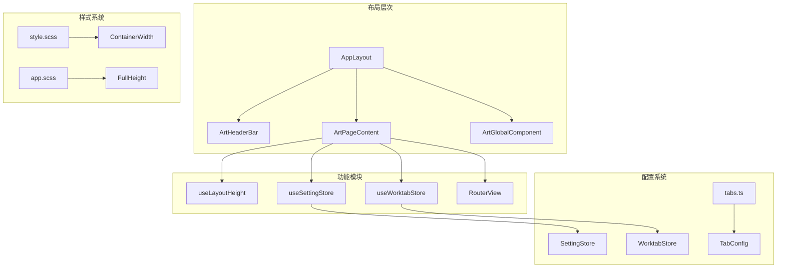
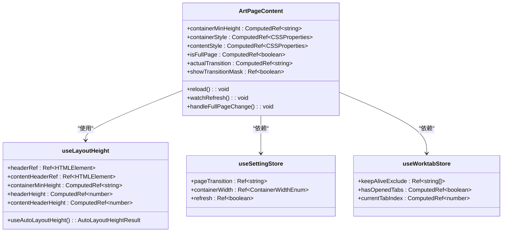
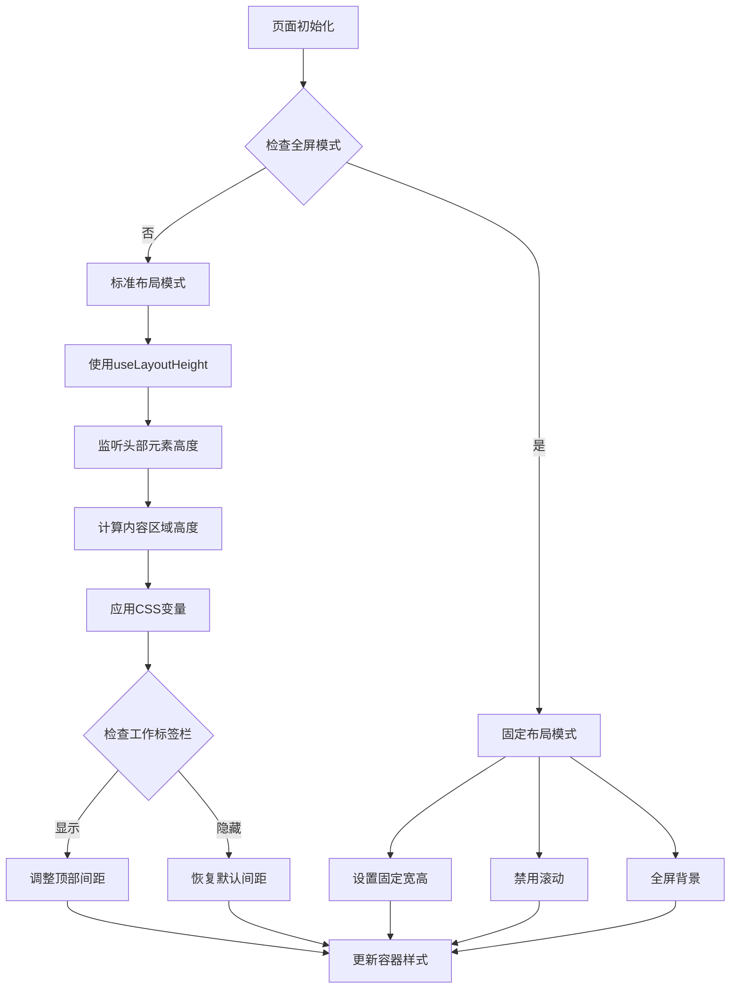
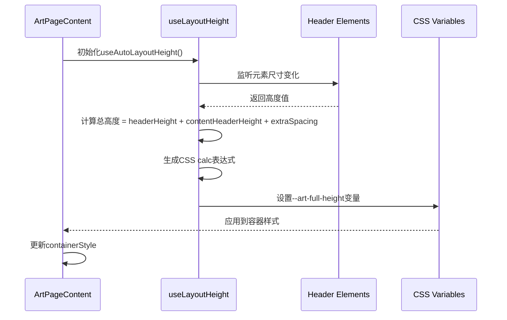
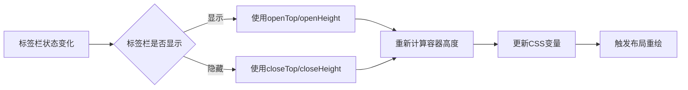
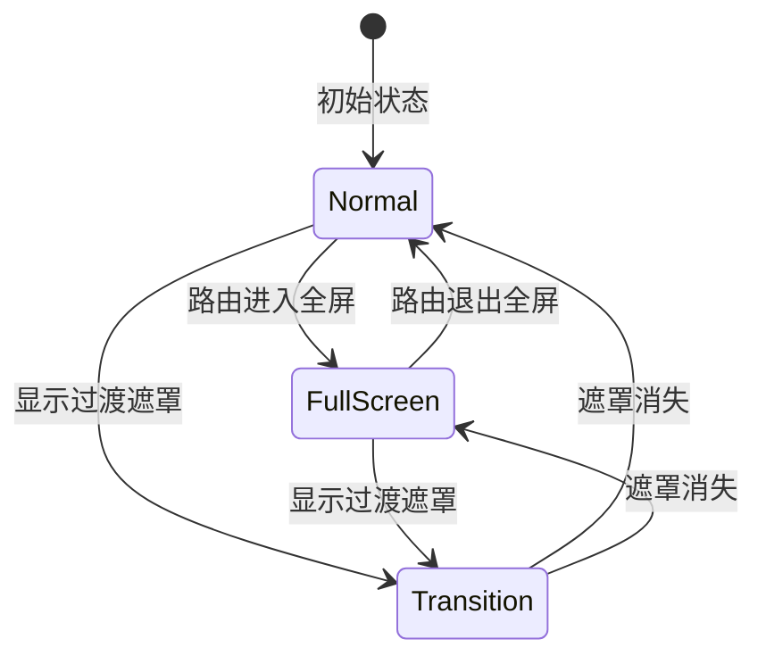
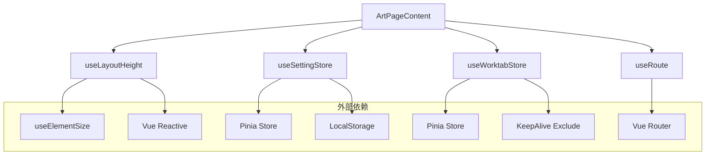
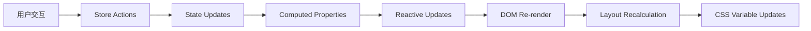

# 页面内容区

<cite>
**本文档中引用的文件**
- [index.vue](file://src/components/core/layouts/art-page-content/index.vue)
- [useLayoutHeight.ts](file://src/hooks/core/useLayoutHeight.ts)
- [tabs.ts](file://src/utils/ui/tabs.ts)
- [setting.ts](file://src/store/modules/setting.ts)
- [worktab.ts](file://src/store/modules/worktab.ts)
- [index.vue](file://src/views/index/index.vue)
- [style.scss](file://src/views/index/style.scss)
- [app.scss](file://src/assets/styles/core/app.scss)
</cite>

## 目录
1. [简介](#简介)
2. [项目结构](#项目结构)
3. [核心组件](#核心组件)
4. [架构概览](#架构概览)
5. [详细组件分析](#详细组件分析)
6. [依赖关系分析](#依赖关系分析)
7. [性能考虑](#性能考虑)
8. [故障排除指南](#故障排除指南)
9. [结论](#结论)

## 简介

art-page-content组件是Art Design Pro框架中的核心布局组件，负责管理页面内容区域的自适应布局策略和高度计算机制。该组件通过巧妙地利用useLayoutHeight组合式函数，能够根据页眉、面包屑和其他头部元素的高度动态计算可用内容区域，确保页面布局的精确性和响应式适配能力。

组件的主要特点包括：
- **智能高度计算**：基于useLayoutHeight钩子实现动态内容区域高度计算
- **响应式设计**：支持多种屏幕尺寸的布局适配
- **工作标签栏集成**：与工作标签栏显示/隐藏状态无缝协作
- **性能优化**：采用防抖和requestAnimationFrame技术避免布局抖动
- **灵活配置**：支持多种布局模式和样式定制

## 项目结构

art-page-content组件在项目中的组织结构体现了清晰的分层架构：



**图表来源**
- [index.vue](file://src/views/index/index.vue#L1-L30)
- [index.vue](file://src/components/core/layouts/art-page-content/index.vue#L1-L137)

**章节来源**
- [index.vue](file://src/views/index/index.vue#L1-L30)
- [index.vue](file://src/components/core/layouts/art-page-content/index.vue#L1-L137)

## 核心组件

### ArtPageContent组件架构

ArtPageContent组件采用了现代化的Vue 3 Composition API设计，通过多个核心功能模块实现复杂的布局管理：



**图表来源**
- [index.vue](file://src/components/core/layouts/art-page-content/index.vue#L50-L137)
- [useLayoutHeight.ts](file://src/hooks/core/useLayoutHeight.ts#L34-L149)

**章节来源**
- [index.vue](file://src/components/core/layouts/art-page-content/index.vue#L50-L137)
- [useLayoutHeight.ts](file://src/hooks/core/useLayoutHeight.ts#L34-L149)

## 架构概览

### 自适应布局策略

art-page-content组件实现了多层次的自适应布局策略，确保在不同设备和配置下都能提供最佳的用户体验：



**图表来源**
- [index.vue](file://src/components/core/layouts/art-page-content/index.vue#L97-L118)
- [useLayoutHeight.ts](file://src/hooks/core/useLayoutHeight.ts#L46-L61)

### 高度计算机制

组件的高度计算遵循严格的数学公式，确保内容区域的精确填充：



**图表来源**
- [useLayoutHeight.ts](file://src/hooks/core/useLayoutHeight.ts#L46-L61)
- [index.vue](file://src/components/core/layouts/art-page-content/index.vue#L97-L118)

**章节来源**
- [useLayoutHeight.ts](file://src/hooks/core/useLayoutHeight.ts#L46-L61)
- [index.vue](file://src/components/core/layouts/art-page-content/index.vue#L97-L118)

## 详细组件分析

### useLayoutHeight组合式函数

useLayoutHeight是组件高度计算的核心，提供了两种使用模式：

#### 标准模式
```typescript
// 使用元素引用的方式
const { containerMinHeight, headerRef, contentHeaderRef } = useAutoLayoutHeight()
```

#### 自动查找模式
```typescript
// 通过ID自动查找元素
const { containerMinHeight } = useAutoLayoutHeight(['app-header', 'app-content-header'])
```

该函数的关键特性包括：

1. **响应式监听**：使用VueUse的`useElementSize`监听元素尺寸变化
2. **CSS变量同步**：通过`requestAnimationFrame`确保样式更新的时机正确
3. **灵活配置**：支持自定义额外间距和CSS变量名称
4. **性能优化**：使用计算属性避免不必要的重新计算

**章节来源**
- [useLayoutHeight.ts](file://src/hooks/core/useLayoutHeight.ts#L34-L149)

### 工作标签栏集成

组件与工作标签栏系统的深度集成体现在以下几个方面：

#### 标签栏高度配置
tabs.ts模块提供了三种标签栏样式的高度配置：

| 样式类型 | openTop | closeTop | openHeight | closeHeight |
|---------|---------|----------|------------|-------------|
| tab-default | 106px | 60px | 121px | 75px |
| tab-card | 122px | 78px | 139px | 95px |
| tab-google | 122px | 78px | 139px | 95px |

#### 高度调整逻辑


**图表来源**
- [tabs.ts](file://src/utils/ui/tabs.ts#L36-L55)

**章节来源**
- [tabs.ts](file://src/utils/ui/tabs.ts#L36-L61)

### 响应式设计实现

组件的响应式设计通过多层次的媒体查询和动态样式计算实现：

#### 屏幕尺寸适配表

| 屏幕宽度 | 布局模式 | 容器宽度 | 内边距 | 特殊处理 |
|---------|---------|----------|--------|----------|
| > 1180px | 标准 | 100% - 40px | 20px | 正常布局 |
| ≤ 1180px | 标准 | 100% - 40px | 20px | 视口高度适配 |
| ≤ 800px | 移动端 | 100% | 20px | 侧边栏固定 |
| ≤ 640px | 小屏 | 100% - 30px | 15px | 减少内边距 |

#### 过渡动画系统
组件实现了智能的页面切换过渡效果：



**图表来源**
- [index.vue](file://src/components/core/layouts/art-page-content/index.vue#L82-L95)

**章节来源**
- [index.vue](file://src/components/core/layouts/art-page-content/index.vue#L82-L95)
- [style.scss](file://src/views/index/style.scss#L49-L93)

### 性能优化策略

#### 防抖和节流技术
组件采用了多种性能优化技术：

1. **requestAnimationFrame**：确保DOM操作在正确的时机执行
2. **计算属性缓存**：Vue的响应式系统自动处理重复计算
3. **条件渲染**：根据状态动态决定组件渲染
4. **KeepAlive集成**：智能的页面缓存管理

#### 内存管理
```typescript
// 组件卸载时的清理
onUnmounted(() => {
  // 清理定时器和事件监听器
})
```

**章节来源**
- [useLayoutHeight.ts](file://src/hooks/core/useLayoutHeight.ts#L54-L61)
- [index.vue](file://src/components/core/layouts/art-page-content/index.vue#L120-L135)

## 依赖关系分析

### 组件间依赖关系



**图表来源**
- [index.vue](file://src/components/core/layouts/art-page-content/index.vue#L52-L62)

### 数据流分析

组件的数据流向体现了单向数据流的设计原则：



**图表来源**
- [setting.ts](file://src/store/modules/setting.ts#L47-L200)
- [worktab.ts](file://src/store/modules/worktab.ts#L56-L200)

**章节来源**
- [index.vue](file://src/components/core/layouts/art/page-content/index.vue#L52-L62)
- [setting.ts](file://src/store/modules/setting.ts#L47-L200)
- [worktab.ts](file://src/store/modules/worktab.ts#L56-L200)

## 性能考虑

### 布局抖动避免策略

1. **批量DOM操作**：使用`requestAnimationFrame`确保DOM更新的时机正确
2. **防抖处理**：对于频繁的高度变化，实施适当的防抖机制
3. **CSS变量缓存**：避免重复的CSS变量设置操作

### 渲染性能优化

1. **条件渲染**：根据状态动态决定组件渲染
2. **KeepAlive**：智能的页面缓存减少重复渲染
3. **虚拟滚动**：对于大量数据的列表采用虚拟滚动技术

### 内存泄漏防护

1. **事件监听器清理**：组件卸载时自动清理事件监听器
2. **定时器管理**：及时清理不需要的定时器
3. **引用清理**：避免循环引用导致的内存泄漏

## 故障排除指南

### 常见布局问题及解决方案

#### 问题1：内容区域高度不正确
**症状**：页面底部出现空白或内容被截断
**原因**：头部元素高度计算错误
**解决方案**：
```typescript
// 检查useAutoLayoutHeight的元素ID是否正确
const { containerMinHeight } = useAutoLayoutHeight(['correct-header-id', 'correct-content-header-id'])
```

#### 问题2：工作标签栏高度异常
**症状**：标签栏显示时内容区域被挤压
**原因**：标签栏配置不匹配
**解决方案**：
```typescript
// 检查tabs.ts中的配置是否与实际标签栏样式一致
import { getTabConfig } from '@/utils/ui/tabs'
const config = getTabConfig('tab-card') // 确认使用正确的样式
```

#### 问题3：响应式布局失效
**症状**：移动端布局混乱
**原因**：媒体查询未生效或容器宽度设置错误
**解决方案**：
```scss
// 检查容器宽度配置
.layout-content {
  width: calc(100% - #{containerPadding});
  margin: auto;
}
```

### 调试工具和技巧

1. **Vue DevTools**：监控组件状态和响应式数据
2. **浏览器开发者工具**：检查CSS变量和布局计算
3. **控制台日志**：添加必要的调试信息
4. **性能面板**：监控渲染性能指标

**章节来源**
- [useLayoutHeight.ts](file://src/hooks/core/useLayoutHeight.ts#L118-L134)
- [tabs.ts](file://src/utils/ui/tabs.ts#L58-L61)

## 结论

art-page-content组件代表了现代前端框架中布局管理的最佳实践。通过巧妙地结合Vue 3的Composition API、响应式编程范式和性能优化技术，该组件实现了高度的灵活性和可维护性。

### 主要优势

1. **智能自适应**：基于useLayoutHeight的动态高度计算确保了布局的精确性
2. **无缝集成**：与工作标签栏和设置系统的深度集成提供了完整的用户体验
3. **性能优化**：多层次的性能优化策略确保了良好的用户体验
4. **易于扩展**：清晰的架构设计使得功能扩展变得简单直观

### 最佳实践建议

1. **合理使用CSS变量**：充分利用--art-full-height变量进行样式定制
2. **注意响应式断点**：根据实际需求调整媒体查询断点
3. **性能监控**：定期检查布局性能，及时发现潜在问题
4. **文档维护**：保持组件文档的及时更新，便于团队协作

该组件不仅解决了复杂的布局问题，更为整个框架的可扩展性和可维护性奠定了坚实的基础。通过深入理解其设计原理和实现细节，开发者可以更好地利用这一强大工具构建高质量的Web应用程序。