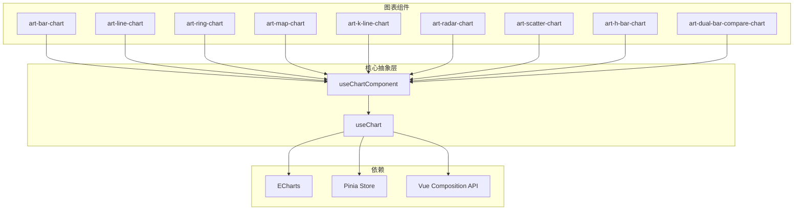
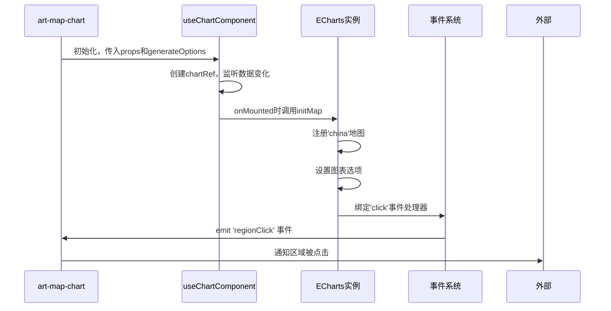
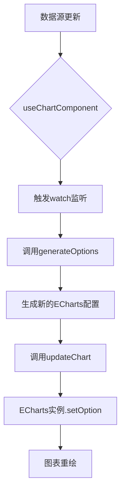
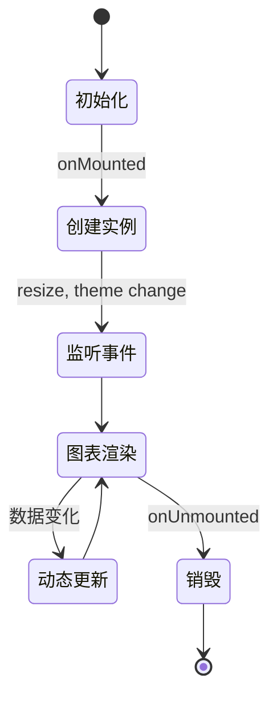
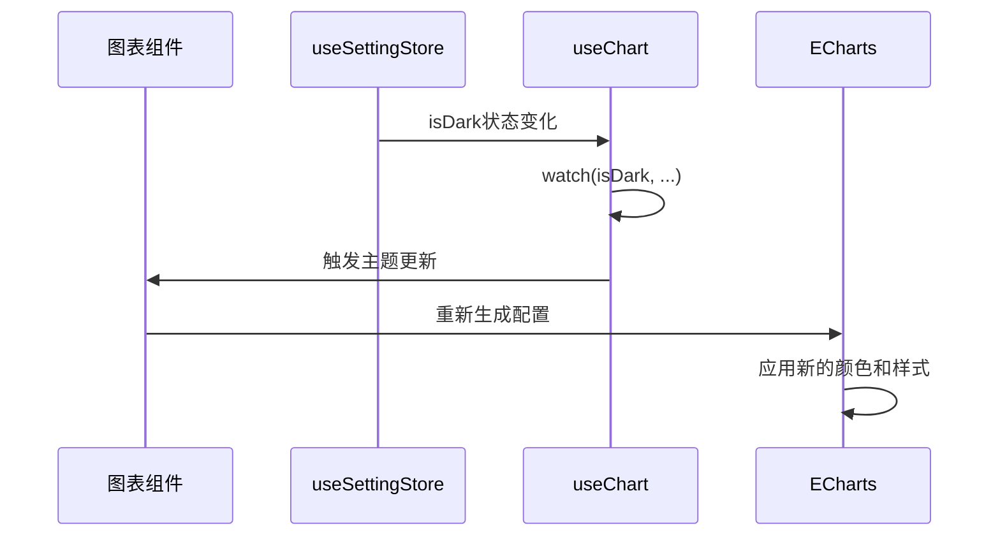

# 图表组件

<cite>
**本文档引用文件**  
- [art-bar-chart/index.vue](file://src/components/core/charts/art-bar-chart/index.vue)
- [art-line-chart/index.vue](file://src/components/core/charts/art-line-chart/index.vue)
- [art-ring-chart/index.vue](file://src/components/core/charts/art-ring-chart/index.vue)
- [art-map-chart/index.vue](file://src/components/core/charts/art-map-chart/index.vue)
- [art-k-line-chart/index.vue](file://src/components/core/charts/art-k-line-chart/index.vue)
- [art-radar-chart/index.vue](file://src/components/core/charts/art-radar-chart/index.vue)
- [art-scatter-chart/index.vue](file://src/components/core/charts/art-scatter-chart/index.vue)
- [art-h-bar-chart/index.vue](file://src/components/core/charts/art-h-bar-chart/index.vue)
- [art-dual-bar-compare-chart/index.vue](file://src/components/core/charts/art-dual-bar-compare-chart/index.vue)
- [useChart.ts](file://src/hooks/core/useChart.ts)
- [chart.ts](file://src/types/component/chart.ts)
- [echarts.ts](file://src/plugins/echarts.ts)
</cite>

## 目录
1. [简介](#简介)
2. [核心架构与设计](#核心架构与设计)
3. [基础图表组件](#基础图表组件)
4. [高级图表组件](#高级图表组件)
5. [配置属性详解](#配置属性详解)
6. [数据绑定与动态更新](#数据绑定与动态更新)
7. [事件交互机制](#事件交互机制)
8. [ECharts实例生命周期管理](#echarts实例生命周期管理)
9. [主题继承与暗黑模式适配](#主题继承与暗黑模式适配)
10. [响应式重绘原理](#响应式重绘原理)
11. [性能优化策略](#性能优化策略)
12. [错误处理与常见问题](#错误处理与常见问题)
13. [可访问性增强](#可访问性增强)
14. [完整示例](#完整示例)

## 简介

Art Design Pro 提供了一套基于 ECharts 封装的可视化图表组件，旨在简化复杂数据可视化开发流程。该组件库包含九类核心图表：柱状图（art-bar-chart）、折线图（art-line-chart）、环形图（art-ring-chart）、地图（art-map-chart）、K线图（art-k-line-chart）、雷达图（art-radar-chart）、散点图（art-scatter-chart）、水平柱状图（art-h-bar-chart）和双向堆叠柱状图（art-dual-bar-compare-chart）。这些组件通过统一的抽象层 `useChartComponent` 进行管理，实现了配置标准化、生命周期自动化、主题响应式和性能优化。组件支持灵活的数据绑定、丰富的交互事件、动态更新和动画效果，同时深度集成系统主题，支持暗黑模式切换。本文档将深入解析这些组件的技术实现、配置选项和最佳实践。

## 核心架构与设计

Art Design Pro 的图表组件采用分层架构设计，核心是 `useChart` 和 `useChartComponent` 两个组合式函数，它们为所有图表提供了统一的生命周期管理和配置能力。



**图表来源**  
- [useChart.ts](file://src/hooks/core/useChart.ts#L52-L746)

**组件来源**  
- [art-bar-chart/index.vue](file://src/components/core/charts/art-bar-chart/index.vue#L7)
- [art-line-chart/index.vue](file://src/components/core/charts/art-line-chart/index.vue#L15)

`useChart` 是底层核心，负责处理 ECharts 实例的初始化、更新、销毁、响应式调整和主题切换。`useChartComponent` 是更高层次的抽象，它基于 `useChart` 构建，为组件开发提供了标准化的接口，包括配置生成、空状态处理和数据监听。

## 基础图表组件

### 柱状图 (art-bar-chart)

`art-bar-chart` 组件用于展示分类数据的比较。它支持单组数据和多组数据（堆叠或分组）的渲染。

**组件来源**  
- [art-bar-chart/index.vue](file://src/components/core/charts/art-bar-chart/index.vue#L14-L37)

### 折线图 (art-line-chart)

`art-line-chart` 组件用于展示数据随时间或其他维度的变化趋势。它支持多条折线、区域填充、平滑曲线和数据点符号。

**组件来源**  
- [art-line-chart/index.vue](file://src/components/core/charts/art-line-chart/index.vue#L20-L46)

### 环形图 (art-ring-chart)

`art-ring-chart` 组件用于展示数据的比例关系。它支持自定义内外半径、中心文本和标签显示。

**组件来源**  
- [art-ring-chart/index.vue](file://src/components/core/charts/art-ring-chart/index.vue#L19-L37)

## 高级图表组件

### 地图图表 (art-map-chart)

`art-map-chart` 组件用于地理数据的可视化。它集成了中国地图的 GeoJSON 数据，支持区域点击事件、散点标记和主题适配。



**图表来源**  
- [art-map-chart/index.vue](file://src/components/core/charts/art-map-chart/index.vue#L20-L292)

### K线图 (art-k-line-chart)

`art-k-line-chart` 组件专为金融数据设计，用于展示股票或加密货币的开盘价、收盘价、最高价和最低价。

**组件来源**  
- [art-k-line-chart/index.vue](file://src/components/core/charts/art-k-line-chart/index.vue#L18-L30)

### 雷达图 (art-radar-chart)

`art-radar-chart` 组件用于展示多维数据的比较，常用于能力评估或性能分析。

**组件来源**  
- [art-radar-chart/index.vue](file://src/components/core/charts/art-radar-chart/index.vue#L18-L33)

## 配置属性详解

所有图表组件都遵循统一的属性命名规范，主要分为基础配置、数据配置、样式配置和交互配置。

### 基础配置 (BaseChartProps)

| 属性 | 类型 | 默认值 | 描述 |
| :--- | :--- | :--- | :--- |
| `height` | `string` | `useChartOps().chartHeight` | 图表容器高度 |
| `loading` | `boolean` | `false` | 是否显示加载状态 |
| `isEmpty` | `boolean` | `false` | 是否为空数据状态 |
| `colors` | `string[]` | `useChartOps().colors` | 图表颜色数组 |

**属性来源**  
- [chart.ts](file://src/types/component/chart.ts#L72-L80)

### 数据配置

不同图表的数据配置各不相同，但都通过 `data` 属性接收。

- **柱状图/折线图**: `data` 可以是 `number[]` (单组数据) 或 `BarDataItem[]`/`LineDataItem[]` (多组数据)。
- **环形图**: `data` 是 `PieDataItem[]`，包含 `value` 和 `name`。
- **K线图**: `data` 是 `KLineDataItem[]`，包含 `time`, `open`, `close`, `high`, `low`。

**数据来源**  
- [chart.ts](file://src/types/component/chart.ts#L103-L225)

### 交互配置 (InteractionProps)

| 属性 | 类型 | 默认值 | 描述 |
| :--- | :--- | :--- | :--- |
| `showTooltip` | `boolean` | `true` | 是否显示提示框 |
| `showLegend` | `boolean` | `false` | 是否显示图例 |
| `legendPosition` | `'bottom' \| 'top' \| 'left' \| 'right'` | `'bottom'` | 图例位置 |

**交互来源**  
- [chart.ts](file://src/types/component/chart.ts#L93-L100)

## 数据绑定与动态更新

图表组件通过 `watchSources` 选项监听数据变化，实现动态更新。



在 `art-line-chart` 中，`watchSources` 定义了需要监听的数据：
```typescript
watchSources: [() => props.data, () => props.xAxisData, () => props.colors]
```
当这些响应式数据发生变化时，`useChartComponent` 会自动重新生成配置并更新图表。

**数据绑定来源**  
- [art-line-chart/index.vue](file://src/components/core/charts/art-line-chart/index.vue#L344-L345)
- [useChart.ts](file://src/hooks/core/useChart.ts#L691-L696)

## 事件交互机制

图表组件支持点击、高亮等交互事件。

### 点击事件

`art-map-chart` 组件通过 ECharts 的 `on` 方法监听点击事件：
```typescript
chartInstance.value.on('click', handleMapClick)
```
当用户点击地图区域时，会触发 `handleMapClick` 函数，并通过 `emit` 派发 `regionClick` 事件。

**事件来源**  
- [art-map-chart/index.vue](file://src/components/core/charts/art-map-chart/index.vue#L212)

### 高亮交互

ECharts 内置了高亮功能。当鼠标悬停在图表元素上时，`emphasis` 配置会生效，例如在 `art-bar-chart` 中：
```typescript
emphasis: {
  focus: 'series' as const,
  lineStyle: {
    width: (config.lineWidth ?? props.lineWidth) + 1
  }
}
```

## ECharts实例生命周期管理

`useChart` 组件负责管理 ECharts 实例的完整生命周期。



关键生命周期钩子：
- **onMounted**: 初始化图表，设置监听器。
- **onUnmounted**: 调用 `destroyChart`，清理实例和事件监听器。
- **onBeforeUnmount**: 移除自定义事件监听。

**生命周期来源**  
- [useChart.ts](file://src/hooks/core/useChart.ts#L591-L601)

## 主题继承与暗黑模式适配

图表组件通过 `useSettingStore` 获取系统主题状态，并自动适配样式。



在 `useChart` 中，通过 `watch(isDark, ...)` 监听主题变化，并重新设置图表选项。

**主题来源**  
- [useChart.ts](file://src/hooks/core/useChart.ts#L169-L184)

## 响应式重绘原理

图表组件通过多种机制实现响应式重绘：

1.  **窗口大小变化**: 监听 `window.resize` 事件，使用防抖处理。
2.  **菜单状态变化**: 监听 `menuOpen` 和 `menuType`，调整图表尺寸。
3.  **IntersectionObserver**: 延迟加载，当图表进入视口时才初始化。

**响应式来源**  
- [useChart.ts](file://src/hooks/core/useChart.ts#L124-L132)

## 性能优化策略

### 大数据量降采样

虽然当前代码未直接实现降采样，但 `useChartComponent` 的 `watch` 配置使用了 `deep: true`，对于大数据量，建议在数据传入组件前进行预处理和降采样。

### 样式缓存

`useChart` 内部实现了样式缓存，避免重复计算：
```typescript
const styleCache = {
  axisLine: null,
  splitLine: null,
  axisLabel: null
}
```
当主题未变化时，直接返回缓存的样式对象。

**性能来源**  
- [useChart.ts](file://src/hooks/core/useChart.ts#L201-L213)

## 错误处理与常见问题

### 错误处理机制

- **初始化失败**: 使用 `try-catch` 包裹 `echarts.init` 和 `setOption`。
- **空状态处理**: 通过 `checkEmpty` 函数判断，并显示“暂无数据”提示。
- **资源清理**: 在 `onUnmounted` 中确保实例被正确销毁。

### 常见渲染问题解决方案

1.  **图表不显示**: 检查 `chartRef` 是否正确绑定，容器是否有固定高度。
2.  **主题不更新**: 确保 `autoTheme` 选项未被禁用。
3.  **动画卡顿**: 关闭不必要的动画，或对大数据进行降采样。

**错误处理来源**  
- [useChart.ts](file://src/hooks/core/useChart.ts#L529-L531)

## 可访问性增强

- **语义化标签**: 使用 `aria-label` 等属性增强可访问性。
- **键盘导航**: ECharts 本身支持一定程度的键盘导航。
- **颜色对比度**: 在暗黑模式下，使用高对比度的颜色方案。

## 完整示例

### 基础配置

```vue
<art-bar-chart :data="[120, 200, 150]" :xAxisData="['A', 'B', 'C']" />
```

### 高级定制 - 地图集成

```vue
<art-map-chart :mapData="geoData" showScatter @regionClick="handleRegionClick" />
```

### 金融数据渲染 - K线图

```vue
<art-k-line-chart :data="kLineData" showDataZoom />
```

### 多维指标展示 - 雷达图

```vue
<art-radar-chart :indicator="indicators" :data="radarData" showLegend />
```