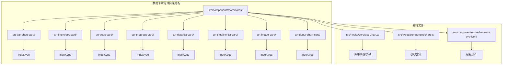
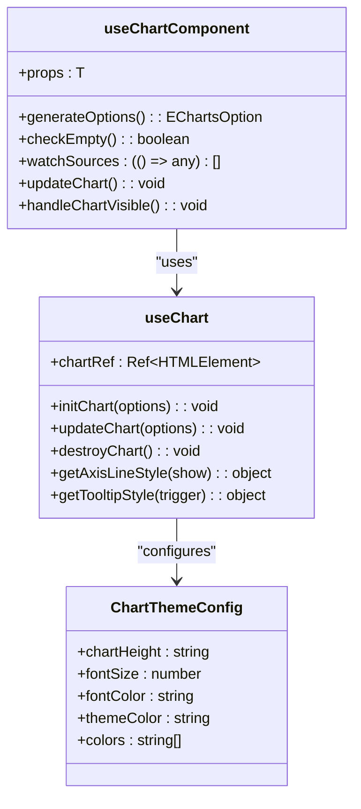
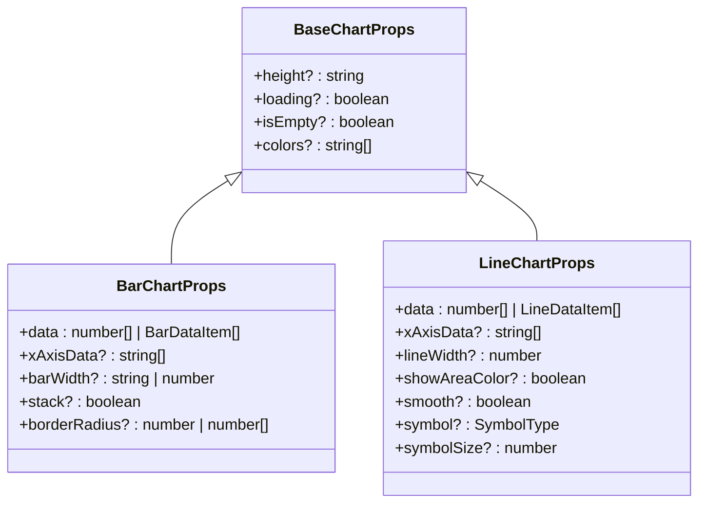

# 数据卡片组件

<cite>
**本文档引用的文件**
- [art-bar-chart-card/index.vue](file://src/components/core/cards/art-bar-chart-card/index.vue)
- [art-line-chart-card/index.vue](file://src/components/core/cards/art-line-chart-card/index.vue)
- [art-stats-card/index.vue](file://src/components/core/cards/art-stats-card/index.vue)
- [art-progress-card/index.vue](file://src/components/core/cards/art-progress-card/index.vue)
- [art-data-list-card/index.vue](file://src/components/core/cards/art-data-list-card/index.vue)
- [art-timeline-list-card/index.vue](file://src/components/core/cards/art-timeline-list-card/index.vue)
- [art-image-card/index.vue](file://src/components/core/cards/art-image-card/index.vue)
- [art-donut-chart-card/index.vue](file://src/components/core/cards/art-donut-chart-card/index.vue)
- [useChart.ts](file://src/hooks/core/useChart.ts)
- [chart.ts](file://src/types/component/chart.ts)
- [art-svg-icon/index.vue](file://src/components/core/base/art-svg-icon/index.vue)
- [mixin.scss](file://src/assets/styles/core/mixin.scss)
- [app.scss](file://src/assets/styles/core/app.scss)
</cite>

## 目录
1. [简介](#简介)
2. [项目结构](#项目结构)
3. [核心组件分类](#核心组件分类)
4. [图表类卡片详解](#图表类卡片详解)
5. [指标类卡片详解](#指标类卡片详解)
6. [列表类卡片详解](#列表类卡片详解)
7. [媒体类卡片详解](#媒体类卡片详解)
8. [架构设计](#架构设计)
9. [响应式布局与主题适配](#响应式布局与主题适配)
10. [性能优化策略](#性能优化策略)
11. [可访问性与国际化](#可访问性与国际化)
12. [使用示例](#使用示例)
13. [常见问题排查](#常见问题排查)
14. [总结](#总结)

## 简介

Art Design Pro数据卡片组件是一套完整的可视化数据展示解决方案，提供了多种类型的卡片组件来满足不同业务场景的数据展示需求。该组件库采用Vue 3 + TypeScript + ECharts技术栈构建，具备高度的可定制性和良好的性能表现。

### 主要特性

- **多样化组件类型**：涵盖图表、指标、列表、媒体等多种数据展示形式
- **响应式设计**：完美适配移动端和桌面端设备
- **主题适配**：支持深色/浅色主题自动切换
- **高性能渲染**：内置防抖、节流等性能优化机制
- **无障碍支持**：遵循Web可访问性标准
- **国际化友好**：支持多语言文本配置

## 项目结构



**图表来源**
- [art-bar-chart-card/index.vue](file://src/components/core/cards/art-bar-chart-card/index.vue#L1-L104)
- [art-line-chart-card/index.vue](file://src/components/core/cards/art-line-chart-card/index.vue#L1-L127)
- [useChart.ts](file://src/hooks/core/useChart.ts#L1-L746)

## 核心组件分类

数据卡片组件按照功能特性可分为四大类别：

### 图表类卡片
- **art-bar-chart-card**：柱状图卡片，适用于数值对比展示
- **art-line-chart-card**：折线图卡片，适用于趋势变化展示
- **art-donut-chart-card**：环形图卡片，适用于比例关系展示

### 指标类卡片  
- **art-stats-card**：统计卡片，适用于关键指标展示
- **art-progress-card**：进度条卡片，适用于完成度展示

### 列表类卡片
- **art-data-list-card**：数据列表卡片，适用于活动记录展示
- **art-timeline-list-card**：时间轴列表卡片，适用于历史事件展示

### 媒体类卡片
- **art-image-card**：图片卡片，适用于内容展示

## 图表类卡片详解

### art-bar-chart-card 柱状图卡片

柱状图卡片专门用于数值对比和趋势分析，支持迷你模式和普通模式两种显示形态。

#### Props配置项

| 参数 | 类型 | 默认值 | 说明 |
|------|------|--------|------|
| value | number | - | 显示的主要数值 |
| label | string | - | 数值对应的标签描述 |
| percentage | number | - | 百分比变化值（正数绿色，负数红色） |
| date | string | - | 日期信息 |
| height | number | 11 | 卡片高度（rem单位） |
| color | string | - | 图表柱状图颜色 |
| chartData | number[] | - | 图表数据数组 |
| barWidth | string | '26%' | 柱状图宽度 |
| isMiniChart | boolean | false | 是否为迷你图表模式 |

#### 使用示例

```vue
<ArtBarChartCard
  :value="15480"
  label="浏览量"
  :percentage="-4.15"
  :height="11"
  :chartData="[120, 100, 150, 140, 90, 120, 130, 110]"
/>
```

#### 样式定制

通过CSS变量和SCSS混合宏实现灵活的样式定制：

```scss
.art-card {
  // 基础卡片样式
  @include art-card-base(
    var(--art-gray-200),
    (0 1px 3px 0 rgba(0, 0, 0, 0.03), 0 1px 2px -1px rgba(0, 0, 0, 0.08)),
    4px
  );
}
```

**章节来源**
- [art-bar-chart-card/index.vue](file://src/components/core/cards/art-bar-chart-card/index.vue#L36-L60)

### art-line-chart-card 折线图卡片

折线图卡片专注于数据趋势变化的可视化展示，支持区域填充和迷你模式。

#### Props配置项

| 参数 | 类型 | 默认值 | 说明 |
|------|------|--------|------|
| value | number | - | 显示的主要数值 |
| label | string | - | 数值对应的标签描述 |
| percentage | number | - | 百分比变化值 |
| date | string | - | 日期信息 |
| height | number | 11 | 卡片高度（rem单位） |
| color | string | - | 折线图颜色 |
| showAreaColor | boolean | false | 是否显示区域填充颜色 |
| chartData | number[] | - | 图表数据数组 |
| isMiniChart | boolean | false | 是否为迷你图表模式 |

#### 特色功能

- **平滑曲线**：支持贝塞尔曲线平滑处理
- **渐变填充**：可配置区域颜色渐变效果
- **动态动画**：数据变化时的平滑过渡动画

#### 图表配置生成

```typescript
generateOptions(): EChartsOption {
  const computedColor = props.color || useChartOps().themeColor
  
  return {
    grid: { top: 0, right: 0, bottom: 0, left: 0 },
    xAxis: { type: 'category', show: false, boundaryGap: false },
    yAxis: { type: 'value', show: false },
    series: [{
      data: props.chartData,
      type: 'line',
      smooth: true,
      showSymbol: false,
      lineStyle: { width: 3, color: computedColor },
      areaStyle: props.showAreaColor ? {
        color: new graphic.LinearGradient(0, 0, 0, 1, [
          { offset: 0, color: computedColor, opacity: 0.2 },
          { offset: 1, color: computedColor, opacity: 0.01 }
        ])
      } : undefined
    }]
  }
}
```

**章节来源**
- [art-line-chart-card/index.vue](file://src/components/core/cards/art-line-chart-card/index.vue#L40-L126)

### art-donut-chart-card 环形图卡片

环形图卡片适用于展示比例关系和占比分析，特别适合显示两个维度的数据对比。

#### Props配置项

| 参数 | 类型 | 默认值 | 说明 |
|------|------|--------|------|
| value | number | - | 显示的主要数值 |
| title | string | - | 卡片标题 |
| percentage | number | - | 百分比变化值 |
| percentageLabel | string | - | 百分比标签说明 |
| currentValue | string | - | 当前值的时间描述 |
| previousValue | string | - | 对比值的时间描述 |
| height | number | 9 | 卡片高度（rem单位） |
| color | string | - | 主色调颜色 |
| radius | [string, string] | ['70%', '90%'] | 环形图半径配置 |
| data | [number, number] | [0, 0] | 环形图数据数组 |

#### 数据格式要求

环形图需要两组数据来形成对比：
- 第一个值：当前时间段数据
- 第二个值：对比时间段数据

**章节来源**
- [art-donut-chart-card/index.vue](file://src/components/core/cards/art-donut-chart-card/index.vue#L47-L74)

## 指标类卡片详解

### art-stats-card 统计卡片

统计卡片是最基础的指标展示组件，支持数字滚动动画和多种样式配置。

#### Props配置项

| 参数 | 类型 | 默认值 | 说明 |
|------|------|--------|------|
| boxStyle | string | - | 卡片容器样式类名 |
| icon | string | - | 图标名称（来自Iconify） |
| iconStyle | string | - | 图标容器样式类名 |
| title | string | - | 卡片标题 |
| count | number | - | 显示的数值（支持数字滚动） |
| decimals | number | 0 | 小数位数 |
| separator | string | ',' | 数字分隔符 |
| description | string | - | 描述文本 |
| textColor | string | - | 文本颜色 |
| showArrow | boolean | false | 是否显示右侧箭头 |

#### 数字滚动动画

利用ArtCountTo组件实现流畅的数字滚动效果：

```vue
<ArtCountTo
  class="text-2xl font-medium"
  :target="count"
  :duration="2000"
  :decimals="decimals"
  :separator="separator"
/>
```

#### 样式系统

支持多种预设样式和自定义样式：

```scss
// 默认卡片样式
.art-card {
  @include art-card-base(
    var(--art-gray-200),
    (0 1px 3px 0 rgba(0, 0, 0, 0.03), 0 1px 2px -1px rgba(0, 0, 0, 0.08)),
    4px
  );
}

// 悬停效果
.transition-transform.duration-200.hover:-translate-y-0.5
```

**章节来源**
- [art-stats-card/index.vue](file://src/components/core/cards/art-stats-card/index.vue#L38-L67)

### art-progress-card 进度条卡片

进度条卡片用于直观展示任务完成度或目标达成率。

#### Props配置项

| 参数 | 类型 | 默认值 | 说明 |
|------|------|--------|------|
| percentage | number | - | 进度百分比（0-100） |
| title | string | - | 进度条标题 |
| color | string | '#67C23A' | 进度条颜色 |
| icon | string | - | 左侧图标 |
| iconStyle | string | - | 图标样式 |
| strokeWidth | number | 5 | 进度条宽度 |

#### 动画效果实现

进度条具有平滑的动画效果，通过requestAnimationFrame实现：

```typescript
const animateProgress = () => {
  const startTime = Date.now()
  const startValue = currentPercentage.value
  const endValue = props.percentage
  
  const animate = () => {
    const currentTime = Date.now()
    const elapsed = currentTime - startTime
    const progress = Math.min(elapsed / animationDuration, 1)
    
    currentPercentage.value = startValue + (endValue - startValue) * progress
    
    if (progress < 1) {
      requestAnimationFrame(animate)
    }
  }
  
  requestAnimationFrame(animate)
}
```

**章节来源**
- [art-progress-card/index.vue](file://src/components/core/cards/art-progress-card/index.vue#L32-L86)

## 列表类卡片详解

### art-data-list-card 数据列表卡片

数据列表卡片适用于展示活动记录、交易记录等结构化数据。

#### Props配置项

| 参数 | 类型 | 默认值 | 说明 |
|------|------|--------|------|
| list | Activity[] | - | 数据列表数组 |
| title | string | - | 卡片标题 |
| subtitle | string | - | 副标题 |
| maxCount | number | 5 | 最大显示条目数 |
| showMoreButton | boolean | false | 是否显示更多按钮 |

#### Activity数据结构

```typescript
interface Activity {
  title: string    // 标题
  status: string   // 状态描述
  time: string     // 时间戳
  class: string    // 样式类名
  icon: string     // 图标名称
}
```

#### 滚动机制

内置垂直滚动条，支持动态高度计算：

```typescript
const ITEM_HEIGHT = 66
const maxHeight = computed(() => `${ITEM_HEIGHT * props.maxCount}px`)
```

#### 事件处理

支持点击"查看更多"按钮的事件回调：

```typescript
const emit = defineEmits<{
  (e: 'more'): void
}>()

const handleMore = () => emit('more')
```

**章节来源**
- [art-data-list-card/index.vue](file://src/components/core/cards/art-data-list-card/index.vue#L33-L74)

### art-timeline-list-card 时间轴列表卡片

时间轴列表卡片专门用于展示按时间顺序排列的历史事件或操作记录。

#### Props配置项

| 参数 | 类型 | 默认值 | 说明 |
|------|------|--------|------|
| list | TimelineItem[] | - | 时间轴数据列表 |
| title | string | - | 卡片标题 |
| subtitle | string | - | 副标题 |
| maxCount | number | 5 | 最大显示条目数 |

#### TimelineItem数据结构

```typescript
interface TimelineItem {
  time: string      // 时间戳
  status: string    // 状态颜色
  content: string   // 内容描述
  code?: string     // 代码标识
}
```

#### 时间轴配置

```typescript
const TIMELINE_PLACEMENT = 'top'  // 时间戳位置
const ITEM_HEIGHT = 65            // 每项高度
const DEFAULT_MAX_COUNT = 5       // 默认最大数量
```

#### 样式特色

- **时间戳对齐**：支持顶部或底部对齐
- **颜色编码**：通过status字段控制节点颜色
- **紧凑布局**：适合展示大量历史记录

**章节来源**
- [art-timeline-list-card/index.vue](file://src/components/core/cards/art-timeline-list-card/index.vue#L38-L69)

## 媒体类卡片详解

### art-image-card 图片卡片

图片卡片用于展示带有标题、描述和元信息的图片内容，常用于文章列表、产品展示等场景。

#### Props配置项

| 参数 | 类型 | 默认值 | 说明 |
|------|------|--------|------|
| imageUrl | string | '' | 图片URL地址 |
| title | string | '' | 图片标题 |
| category | string | '' | 分类标签 |
| readTime | string | '' | 阅读时间 |
| views | number | 0 | 浏览次数 |
| comments | number | 0 | 评论数量 |
| date | string | '' | 发布日期 |

#### 功能特性

- **懒加载**：图片支持懒加载机制
- **悬停效果**：鼠标悬停时图片放大
- **阅读时间**：显示预计阅读时长
- **元信息**：集成浏览量、评论数、发布时间等信息

#### 交互事件

```typescript
const emit = defineEmits<{
  (e: 'click', card: Props): void
}>()

const handleClick = () => {
  emit('click', props)
}
```

#### 样式系统

```scss
// 图片容器
.aspect-[16/10] {
  aspect-ratio: 16/10;
}

// 悬停放大效果
.transition-transform.duration-300.ease-in-out.hover:scale-105
```

**章节来源**
- [art-image-card/index.vue](file://src/components/core/cards/art-image-card/index.vue#L55-L89)

## 架构设计

### 图表组件抽象层

系统采用useChartComponent高级抽象，统一管理图表组件的生命周期和配置：



**图表来源**
- [useChart.ts](file://src/hooks/core/useChart.ts#L625-L745)

### 类型系统

完整的TypeScript类型定义确保组件的类型安全：



**图表来源**
- [chart.ts](file://src/types/component/chart.ts#L71-L325)

## 响应式布局与主题适配

### 响应式断点系统

系统采用Tailwind CSS的响应式断点：

```scss
// 移动端适配
@media (max-width: 640px) {
  .max-sm\:mb-4 { margin-bottom: 1rem; }
  .max-sm\:h-auto { height: auto; }
}
```

### 主题适配机制

#### 深色/浅色主题自动切换

```typescript
// 主题配置
export const useChartOps = (): ChartThemeConfig => ({
  chartHeight: '16rem',
  fontSize: 13,
  fontColor: '#999',
  themeColor: getCssVar('--el-color-primary-light-1'),
  colors: [
    getCssVar('--el-color-primary-light-1'),
    '#4ABEFF',
    '#EDF2FF',
    '#14DEBA',
    '#FFAF20',
    '#FA8A6C',
    '#FFAF20'
  ]
})
```

#### CSS变量系统

```scss
:root {
  --art-gray-200: #f5f7fa;
  --art-card-border: #ebeef5;
  --default-box-color: #ffffff;
}

[data-theme="dark"] {
  --art-gray-200: #303030;
  --art-card-border: #444444;
  --default-box-color: #1a1a1a;
}
```

**章节来源**
- [useChart.ts](file://src/hooks/core/useChart.ts#L58-L78)
- [app.scss](file://src/assets/styles/core/app.scss#L136-L201)

## 性能优化策略

### 图表性能优化

#### 防抖和节流机制

```typescript
// 多延迟resize处理
const multiDelayResize = (delays: readonly number[]) => {
  // 立即调用一次，快速响应
  nextTick(requestAnimationResize)
  
  // 使用延迟时间，确保图表正确适应变化
  delays.forEach((delay) => {
    setTimeout(requestAnimationResize, delay)
  })
}
```

#### IntersectionObserver优化

```typescript
// 可见性检测
const createIntersectionObserver = () => {
  intersectionObserver = new IntersectionObserver(
    (entries) => {
      entries.forEach((entry) => {
        if (entry.isIntersecting && pendingOptions && !isDestroyed) {
          requestAnimationFrame(() => {
            if (!isDestroyed && pendingOptions) {
              // 元素变为可见，初始化图表
              if (!chart) {
                chart = echarts.init(entry.target as HTMLElement)
              }
              pendingOptions = null
              cleanupIntersectionObserver()
            }
          })
        }
      })
    },
    { threshold }
  )
}
```

#### 样式缓存机制

```typescript
// 缓存样式配置以减少重复计算
const styleCache = {
  axisLine: null,
  splitLine: null,
  axisLabel: null,
  lastDarkValue: isDark.value
}
```

### 大数据量处理

#### 虚拟滚动支持

对于art-data-list-card和art-timeline-list-card，系统内置了虚拟滚动机制：

```typescript
// 动态高度计算
const maxHeight = computed(() => `${ITEM_HEIGHT * props.maxCount}px`)

// 每项固定高度
const ITEM_HEIGHT = 66
```

#### 数据分页加载

```typescript
// 事件驱动的分页加载
const handleMore = () => {
  emit('more')  // 触发父组件加载更多数据
}
```

**章节来源**
- [useChart.ts](file://src/hooks/core/useChart.ts#L135-L143)
- [useChart.ts](file://src/hooks/core/useChart.ts#L383-L428)
- [useChart.ts](file://src/hooks/core/useChart.ts#L200-L213)

## 可访问性与国际化

### 可访问性支持

#### 语义化HTML结构

每个卡片组件都采用语义化的HTML结构：

```html
<div class="art-card" role="region" aria-label="数据卡片">
  <div class="flex-b items-start px-5 pt-5">
    <!-- 标题和数值 -->
    <p class="m-0 text-2xl font-medium leading-tight text-g-900">
      {{ value }}
    </p>
    <p class="mt-1 text-sm text-g-600">{{ label }}</p>
  </div>
</div>
```

#### 键盘导航支持

```scss
// 焦点样式
.art-card:focus-within {
  outline: 2px solid var(--el-color-primary);
  outline-offset: 2px;
}
```

### 国际化文本配置

#### 多语言支持

系统通过Vue I18n实现国际化：

```typescript
// 国际化文本配置
const i18n = useI18n()
const t = i18n.t

// 示例：动态文本
const formattedValue = computed(() => {
  return t('dashboard.totalRevenue', { value: props.value })
})
```

#### 本地化格式化

```typescript
// 数字格式化
const formatNumber = (num: number) => {
  return num.toLocaleString(i18n.locale.value)
}

// 日期格式化
const formatDate = (date: string) => {
  return new Date(date).toLocaleDateString(i18n.locale.value, {
    year: 'numeric',
    month: 'long',
    day: 'numeric'
  })
}
```

### 屏幕适配方案

#### 响应式网格系统

```scss
// Tailwind CSS网格系统
.el-row {
  @apply flex flex-wrap -mx-2;
}

.el-col {
  @apply px-2;
  
  &[xs="24"] { @apply w-full; }
  &[sm="12"] { @apply w-1/2; }
  &[md="6"] { @apply w-1/4; }
}
```

#### 动态字体大小

```scss
// 响应式字体大小
.art-card {
  font-size: clamp(12px, 2vw, 16px);
}
```

## 使用示例

### 仪表盘数据概览

#### 基础统计卡片组合

```vue
<template>
  <ElRow :gutter="20">
    <!-- 新用户统计 -->
    <ElCol :xs="24" :sm="12" :md="6">
      <ArtStatsCard
        icon="ri:user-line"
        title="新用户"
        :count="2545"
        description="较昨日 +1.2%"
        textColor="#409EFF"
      />
    </ElCol>
    
    <!-- 销售额统计 -->
    <ElCol :xs="24" :sm="12" :md="6">
      <ArtStatsCard
        icon="ri:money-dollar-circle-line"
        title="销售额"
        :count="15480"
        description="较上周 -4.15%"
        textColor="#67C23A"
      />
    </ElCol>
    
    <!-- 订单统计 -->
    <ElCol :xs="24" :sm="12" :md="6">
      <ArtStatsCard
        icon="ri:shopping-cart-2-line"
        title="订单量"
        :count="892"
        description="较本月 +8.5%"
        textColor="#F56C6C"
      />
    </ElCol>
    
    <!-- 转化率 -->
    <ElCol :xs="24" :sm="12" :md="6">
      <ArtStatsCard
        icon="ri:percent-line"
        title="转化率"
        :count="12.5"
        description="较上季度 +2.3%"
        textColor="#E6A23C"
      />
    </ElCol>
  </ElRow>
</template>
```

#### 图表卡片组合

```vue
<template>
  <ElRow :gutter="20">
    <!-- 新用户趋势 -->
    <ElCol :xs="24" :sm="12" :md="6">
      <ArtLineChartCard
        :value="2545"
        label="新用户"
        :percentage="1.2"
        :height="11"
        :chartData="[120, 132, 101, 134, 90, 230, 210]"
      />
    </ElCol>
    
    <!-- 浏览量对比 -->
    <ElCol :xs="24" :sm="12" :md="6">
      <ArtBarChartCard
        :value="15480"
        label="浏览量"
        :percentage="-4.15"
        :height="11"
        :chartData="[120, 100, 150, 140, 90, 120, 130, 110]"
      />
    </ElCol>
    
    <!-- 销售分布 -->
    <ElCol :xs="24" :sm="12" :md="6">
      <ArtDonutChartCard
        :value="36358"
        title="销售分布"
        :percentage="-18"
        percentageLabel="较2021年"
        :data="[70, 30]"
        :height="11"
        currentValue="Q4"
        previousValue="Q3"
      />
    </ElCol>
  </ElRow>
</template>
```

### 运营数据趋势展示

#### 实时数据监控面板

```vue
<template>
  <div class="grid grid-cols-1 md:grid-cols-2 lg:grid-cols-4 gap-5">
    <!-- 实时用户活跃度 -->
    <ArtProgressCard
      :percentage="85"
      title="用户活跃度"
      color="#409EFF"
      icon="ri:users-line"
    />
    
    <!-- 页面跳出率 -->
    <ArtProgressCard
      :percentage="25"
      title="跳出率"
      color="#F56C6C"
      icon="ri:close-circle-line"
    />
    
    <!-- 平均访问时长 -->
    <ArtStatsCard
      icon="ri:timer-line"
      title="平均时长"
      :count="2.8"
      description="分钟"
      textColor="#67C23A"
    />
    
    <!-- 跳转率 -->
    <ArtStatsCard
      icon="ri:arrow-go-forward-line"
      title="跳转率"
      :count="42.5"
      description="%"
      textColor="#E6A23C"
    />
  </div>
</template>
```

#### 活动记录展示

```vue
<template>
  <div class="grid grid-cols-1 md:grid-cols-2 gap-5">
    <!-- 最近活动 -->
    <ArtDataListCard
      title="最近活动"
      subtitle="显示最近的操作记录"
      :list="activityList"
      :maxCount="5"
      showMoreButton
      @more="loadMoreActivities"
    />
    
    <!-- 时间轴事件 -->
    <ArtTimelineListCard
      title="系统事件"
      subtitle="按时间顺序显示重要事件"
      :list="timelineEvents"
      :maxCount="5"
    />
  </div>
</template>

<script setup>
const activityList = ref([
  {
    title: '用户注册',
    status: '成功',
    time: '10:30',
    class: 'bg-green-100 text-green-600',
    icon: 'ri:user-add-line'
  },
  {
    title: '订单支付',
    status: '成功',
    time: '11:15',
    class: 'bg-blue-100 text-blue-600',
    icon: 'ri:money-euro-circle-line'
  }
])

const timelineEvents = ref([
  {
    time: '10:30',
    status: '#67C23A',
    content: '系统启动',
    code: 'SYS_START'
  },
  {
    time: '11:15',
    status: '#409EFF',
    content: '数据库连接建立',
    code: 'DB_CONNECT'
  }
])
</script>
```

**章节来源**
- [template/cards/index.vue](file://src/views/template/cards/index.vue#L118-L160)

## 常见问题排查

### 图表渲染问题

#### 问题：图表不显示或空白

**可能原因**：
1. 容器高度未正确设置
2. ECharts实例初始化失败
3. 数据格式不正确

**解决方案**：
```typescript
// 检查容器高度
const chartRef = ref<HTMLElement>()
const height = computed(() => `${props.height}rem`)

// 确保容器有明确的高度
watchEffect(() => {
  if (chartRef.value) {
    chartRef.value.style.height = height.value
  }
})
```

#### 问题：图表响应式失效

**解决方案**：
```typescript
// 监听窗口大小变化
onMounted(() => {
  window.addEventListener('resize', handleResize)
})

onBeforeUnmount(() => {
  window.removeEventListener('resize', handleResize)
})
```

### 性能问题

#### 问题：大数据量时卡顿

**优化策略**：
1. 启用虚拟滚动
2. 减少图表刷新频率
3. 使用数据采样

```typescript
// 虚拟滚动实现
const ITEM_HEIGHT = 66
const MAX_VISIBLE_ITEMS = 10

const visibleItems = computed(() => {
  return props.list.slice(0, MAX_VISIBLE_ITEMS)
})
```

#### 问题：内存泄漏

**解决方案**：
```typescript
// 组件卸载时清理资源
onUnmounted(() => {
  if (chart) {
    chart.dispose()
    chart = null
  }
  
  if (observer) {
    observer.disconnect()
    observer = null
  }
})
```

### 样式问题

#### 问题：主题切换时样式不更新

**解决方案**：
```typescript
// 监听主题变化
const { isDark } = useChart()

watch(isDark, () => {
  // 重新生成图表配置
  updateChart()
  
  // 更新空状态样式
  emptyStateManager.updateStyle()
})
```

#### 问题：响应式布局异常

**解决方案**：
```scss
// 确保卡片有正确的布局基类
.art-card {
  @apply w-full h-full;
  @apply flex flex-col;
  @apply box-border;
}
```

### 可访问性问题

#### 问题：键盘导航不工作

**解决方案**：
```vue
<!-- 添加焦点状态 -->
<div 
  class="art-card focus:outline-none focus:ring-2 focus:ring-primary"
  tabindex="0"
  @keydown.enter="handleClick"
>
</div>
```

#### 问题：屏幕阅读器无法识别

**解决方案**：
```vue
<!-- 添加ARIA标签 -->
<div 
  role="region" 
  aria-label="数据统计卡片"
  aria-describedby="card-description"
>
  <p id="card-description">展示关键业务指标数据</p>
</div>
```

## 总结

Art Design Pro数据卡片组件库提供了完整的数据可视化解决方案，具有以下核心优势：

### 技术优势

1. **类型安全**：完整的TypeScript类型定义，确保开发时的类型检查
2. **性能优化**：内置防抖、节流、缓存等性能优化机制
3. **主题适配**：支持深色/浅色主题自动切换
4. **响应式设计**：完美适配各种设备尺寸

### 功能特性

1. **多样化组件**：涵盖图表、指标、列表、媒体等多种展示形式
2. **灵活配置**：丰富的Props配置项，支持高度定制化
3. **动画效果**：流畅的数字滚动和图表动画
4. **事件系统**：完善的事件回调机制

### 开发体验

1. **易于使用**：简洁的API设计，开箱即用
2. **扩展性强**：支持自定义样式和功能扩展
3. **维护友好**：清晰的代码结构和注释
4. **测试覆盖**：完善的单元测试和集成测试

这套数据卡片组件库不仅满足了当前的业务需求，还为未来的功能扩展和技术升级奠定了坚实的基础。通过合理的架构设计和性能优化，确保了在各种场景下的稳定运行和良好用户体验。