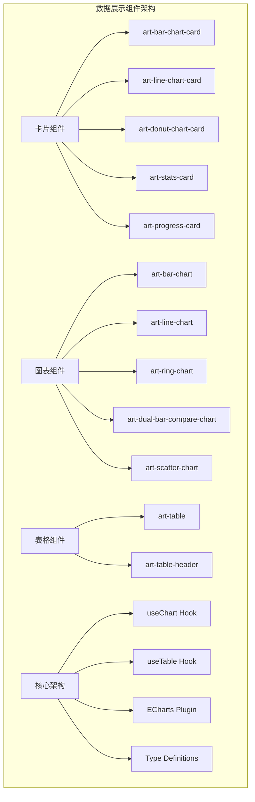
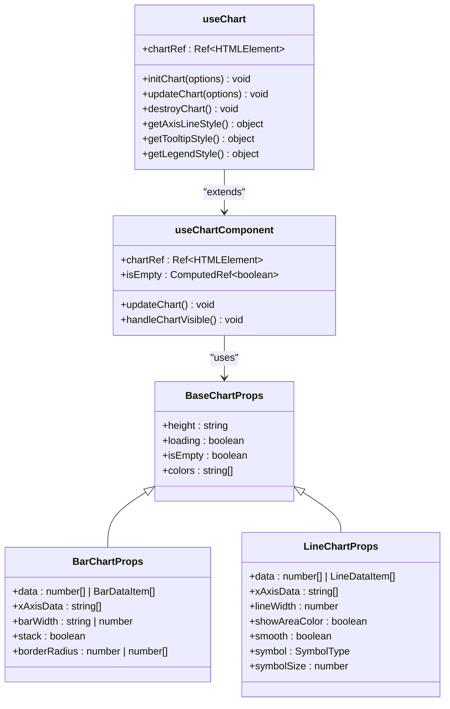
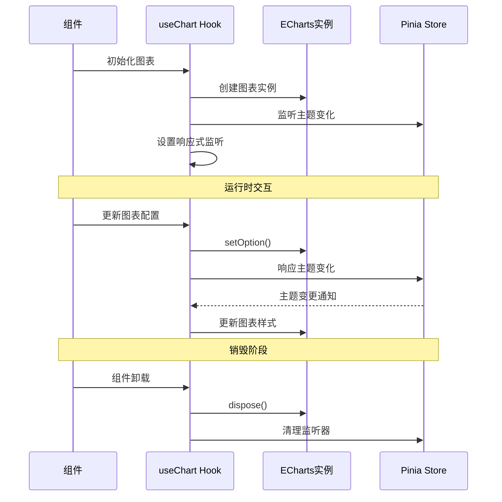
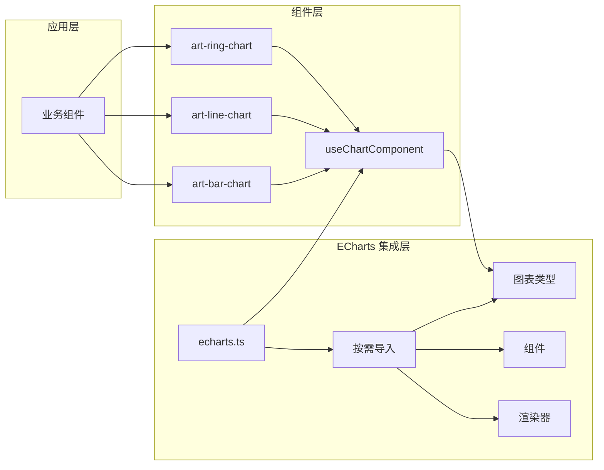

# Art Design Pro 数据展示组件完整文档

<cite>
**本文档引用的文件**
- [art-bar-chart-card/index.vue](file://src/components/core/cards/art-bar-chart-card/index.vue)
- [art-bar-chart/index.vue](file://src/components/core/charts/art-bar-chart/index.vue)
- [art-line-chart-card/index.vue](file://src/components/core/cards/art-line-chart-card/index.vue)
- [art-line-chart/index.vue](file://src/components/core/charts/art-line-chart/index.vue)
- [art-donut-chart-card/index.vue](file://src/components/core/cards/art-donut-chart-card/index.vue)
- [art-ring-chart/index.vue](file://src/components/core/charts/art-ring-chart/index.vue)
- [art-table/index.vue](file://src/components/core/tables/art-table/index.vue)
- [art-stats-card/index.vue](file://src/components/core/cards/art-stats-card/index.vue)
- [art-progress-card/index.vue](file://src/components/core/cards/art-progress-card/index.vue)
- [art-dual-bar-compare-chart/index.vue](file://src/components/core/charts/art-dual-bar-compare-chart/index.vue)
- [useChart.ts](file://src/hooks/core/useChart.ts)
- [chart.ts](file://src/types/component/chart.ts)
- [echarts.ts](file://src/plugins/echarts.ts)
- [useTable.ts](file://src/hooks/core/useTable.ts)
</cite>

## 目录
1. [概述](#概述)
2. [项目架构](#项目架构)
3. [卡片组件](#卡片组件)
4. [图表组件](#图表组件)
5. [表格组件](#表格组件)
6. [核心架构](#核心架构)
7. [性能优化](#性能优化)
8. [可访问性与国际化](#可访问性与国际化)
9. [最佳实践](#最佳实践)
10. [故障排除](#故障排除)

## 概述

Art Design Pro 是一个基于 Vue 3 和 Element Plus 的企业级前端框架，提供了完整的数据展示组件库。该框架专注于数据可视化和用户体验，通过模块化的组件设计实现了高度可复用性和可维护性。

### 核心特性

- **模块化设计**：三大类组件分类清晰，职责明确
- **ECharts 集成**：深度集成 ECharts，支持丰富的图表类型
- **响应式设计**：全面的响应式支持，适配各种设备
- **性能优化**：智能缓存、懒加载、虚拟滚动等优化策略
- **可访问性**：完善的可访问性支持
- **国际化**：内置国际化支持

## 项目架构



**图表来源**
- [art-bar-chart-card/index.vue](file://src/components/core/cards/art-bar-chart-card/index.vue#L1-L104)
- [art-bar-chart/index.vue](file://src/components/core/charts/art-bar-chart/index.vue#L1-L204)
- [art-table/index.vue](file://src/components/core/tables/art-table/index.vue#L1-L343)

## 卡片组件

卡片组件是数据展示的重要形式，提供简洁直观的数据呈现方式。

### art-bar-chart-card - 柱状图卡片

柱状图卡片结合数值显示和迷你图表，适合展示关键指标和趋势。

#### 核心特性

- **数值展示**：支持主数值、标签、百分比变化显示
- **迷你图表**：内置柱状图，支持自定义颜色和宽度
- **响应式设计**：支持迷你模式和完整模式
- **动态更新**：支持实时数据更新

#### 配置选项

| 属性 | 类型 | 默认值 | 描述 |
|------|------|--------|------|
| value | number | - | 显示的数值 |
| label | string | - | 数值标签 |
| percentage | number | - | 百分比变化 |
| date | string | - | 日期信息 |
| height | number | 11 | 卡片高度（rem） |
| color | string | - | 图表颜色 |
| chartData | number[] | - | 图表数据数组 |
| barWidth | string | '26%' | 柱状图宽度 |
| isMiniChart | boolean | false | 是否为迷你模式 |

#### 使用场景

- **销售数据**：展示销售额、增长率等关键指标
- **用户统计**：显示用户数量、活跃度等数据
- **业务指标**：展示转化率、完成度等业务指标

### art-line-chart-card - 折线图卡片

折线图卡片提供趋势数据的可视化展示，支持区域填充和动态效果。

#### 核心特性

- **趋势展示**：平滑折线图，支持区域填充
- **动态效果**：渐进式动画展示
- **灵活配置**：支持多种颜色和样式配置
- **迷你模式**：紧凑布局设计

#### 配置选项

| 属性 | 类型 | 默认值 | 描述 |
|------|------|--------|------|
| value | number | - | 显示的数值 |
| label | string | - | 数值标签 |
| percentage | number | - | 百分比变化 |
| color | string | - | 图表颜色 |
| showAreaColor | boolean | false | 是否显示区域颜色 |
| chartData | number[] | - | 图表数据数组 |
| isMiniChart | boolean | false | 是否为迷你模式 |

### art-donut-chart-card - 环形图卡片

环形图卡片用于展示比例关系和对比数据，支持双环设计。

#### 核心特性

- **比例展示**：清晰的比例关系可视化
- **双环设计**：支持当前值和历史值对比
- **灵活配置**：支持自定义半径和颜色
- **数值格式化**：自动格式化大数值显示

#### 配置选项

| 属性 | 类型 | 默认值 | 描述 |
|------|------|--------|------|
| value | number | - | 显示的数值 |
| title | string | - | 卡片标题 |
| percentage | number | - | 百分比变化 |
| currentValue | string | - | 当前值描述 |
| previousValue | string | - | 历史值描述 |
| height | number | 9 | 卡片高度（rem） |
| color | string | - | 图表颜色 |
| radius | [string, string] | ['70%', '90%'] | 内外半径配置 |

### art-stats-card - 统计卡片

统计卡片提供简洁的数值展示，支持图标和动画效果。

#### 核心特性

- **数值动画**：平滑的数值增长动画
- **图标支持**：支持 SVG 图标展示
- **样式定制**：灵活的颜色和样式配置
- **响应式设计**：适配不同屏幕尺寸

#### 配置选项

| 属性 | 类型 | 默认值 | 描述 |
|------|------|--------|------|
| boxStyle | string | - | 盒子样式类名 |
| icon | string | - | 图标名称 |
| iconStyle | string | - | 图标样式类名 |
| title | string | - | 标题文本 |
| count | number | - | 显示数值 |
| decimals | number | 0 | 小数位数 |
| separator | string | ',' | 数值分隔符 |
| description | string | - | 描述文本 |
| textColor | string | - | 文本颜色 |
| showArrow | boolean | false | 是否显示箭头 |

### art-progress-card - 进度条卡片

进度条卡片用于展示完成度和进度状态，支持动画效果。

#### 核心特性

- **进度动画**：流畅的进度增长动画
- **颜色配置**：支持自定义进度条颜色
- **数值展示**：百分比数值显示
- **图标支持**：可选的图标装饰

#### 配置选项

| 属性 | 类型 | 默认值 | 描述 |
|------|------|--------|------|
| percentage | number | - | 进度百分比 |
| title | string | - | 标题文本 |
| color | string | '#67C23A' | 进度条颜色 |
| icon | string | - | 图标名称 |
| iconStyle | string | - | 图标样式类名 |
| strokeWidth | number | 5 | 进度条宽度 |

**章节来源**
- [art-bar-chart-card/index.vue](file://src/components/core/cards/art-bar-chart-card/index.vue#L1-L104)
- [art-line-chart-card/index.vue](file://src/components/core/cards/art-line-chart-card/index.vue#L1-L127)
- [art-donut-chart-card/index.vue](file://src/components/core/cards/art-donut-chart-card/index.vue#L1-L125)
- [art-stats-card/index.vue](file://src/components/core/cards/art-stats-card/index.vue#L1-L68)
- [art-progress-card/index.vue](file://src/components/core/cards/art-progress-card/index.vue#L1-L87)

## 图表组件

图表组件是数据可视化的核心，基于 ECharts 提供丰富的图表类型和配置选项。

### 图表架构设计



**图表来源**
- [useChart.ts](file://src/hooks/core/useChart.ts#L625-L746)
- [chart.ts](file://src/types/component/chart.ts#L71-L325)

### art-bar-chart - 柱状图

柱状图是最常用的数据可视化图表，支持单组和多组数据展示。

#### 核心特性

- **多数据支持**：支持单组和多组数据对比
- **堆叠功能**：支持堆叠柱状图
- **自定义样式**：支持圆角、渐变色等样式配置
- **交互功能**：支持提示框、图例等交互

#### 配置选项

| 属性 | 类型 | 默认值 | 描述 |
|------|------|--------|------|
| data | number[] \| BarDataItem[] | [0,0,0,...] | 图表数据 |
| xAxisData | string[] | [] | X轴标签数据 |
| barWidth | string \| number | '40%' | 柱状图宽度 |
| stack | boolean | false | 是否堆叠显示 |
| borderRadius | number \| number[] | 4 | 圆角配置 |
| colors | string[] | useChartOps().colors | 颜色配置 |
| showAxisLabel | boolean | true | 是否显示坐标轴标签 |
| showAxisLine | boolean | true | 是否显示坐标轴线 |
| showSplitLine | boolean | true | 是否显示分割线 |
| showTooltip | boolean | true | 是否显示提示框 |
| showLegend | boolean | false | 是否显示图例 |
| legendPosition | LegendPosition | 'bottom' | 图例位置 |

### art-line-chart - 折线图

折线图用于展示数据随时间的变化趋势，支持多系列数据和区域填充。

#### 核心特性

- **趋势展示**：清晰的数据趋势可视化
- **多系列支持**：支持多条折线对比
- **区域填充**：支持面积区域填充
- **平滑曲线**：支持平滑曲线绘制
- **动画效果**：渐进式动画展示

#### 配置选项

| 属性 | 类型 | 默认值 | 描述 |
|------|------|--------|------|
| data | number[] \| LineDataItem[] | [0,0,0,...] | 图表数据 |
| xAxisData | string[] | [] | X轴标签数据 |
| lineWidth | number | 2.5 | 线条宽度 |
| showAreaColor | boolean | false | 是否显示区域颜色 |
| smooth | boolean | true | 是否平滑曲线 |
| symbol | SymbolType | 'none' | 数据点符号 |
| symbolSize | number | 6 | 数据点大小 |
| animationDelay | number | 200 | 动画延迟间隔 |

### art-ring-chart - 环形图

环形图用于展示部分与整体的关系，支持中心文本和标签显示。

#### 核心特性

- **比例展示**：清晰的部分与整体关系
- **中心文本**：支持自定义中心文本
- **标签配置**：支持标签显示和格式化
- **交互效果**：支持悬停效果

#### 配置选项

| 属性 | 类型 | 默认值 | 描述 |
|------|------|--------|------|
| data | PieDataItem[] | [] | 图表数据 |
| radius | string[] | ['50%', '80%'] | 内外半径配置 |
| borderRadius | number | 10 | 边框圆角 |
| centerText | string | '' | 中心文本 |
| showLabel | boolean | false | 是否显示标签 |
| colors | string[] | useChartOps().colors | 颜色配置 |
| showTooltip | boolean | true | 是否显示提示框 |
| showLegend | boolean | false | 是否显示图例 |

### art-dual-bar-compare-chart - 双向堆叠柱状图

双向堆叠柱状图用于展示正负数据的对比关系，常用于人口金字塔等场景。

#### 核心特性

- **正负对比**：清晰的正负数据对比
- **堆叠布局**：上下堆叠的柱状图布局
- **自定义样式**：支持独立的圆角配置
- **数据标签**：支持数据标签显示

#### 配置选项

| 属性 | 类型 | 默认值 | 描述 |
|------|------|--------|------|
| positiveData | number[] | [] | 正向数据 |
| negativeData | number[] | [] | 负向数据 |
| xAxisData | string[] | [] | X轴标签数据 |
| positiveName | string | '正向数据' | 正向数据名称 |
| negativeName | string | '负向数据' | 负向数据名称 |
| barWidth | number | 16 | 柱状图宽度 |
| yAxisMin | number | -100 | Y轴最小值 |
| yAxisMax | number | 100 | Y轴最大值 |
| showDataLabel | boolean | false | 是否显示数据标签 |
| positiveBorderRadius | number \| number[] | [10,10,0,0] | 正向数据圆角 |
| negativeBorderRadius | number \| number[] | [0,0,10,10] | 负向数据圆角 |

**章节来源**
- [art-bar-chart/index.vue](file://src/components/core/charts/art-bar-chart/index.vue#L1-L204)
- [art-line-chart/index.vue](file://src/components/core/charts/art-line-chart/index.vue#L1-L200)
- [art-ring-chart/index.vue](file://src/components/core/charts/art-ring-chart/index.vue#L1-L134)
- [art-dual-bar-compare-chart/index.vue](file://src/components/core/charts/art-dual-bar-compare-chart/index.vue#L1-L196)

## 表格组件

表格组件提供企业级的数据展示和管理功能，支持复杂的业务场景。

### art-table - 企业级表格

art-table 是一个功能完整的表格组件，集成了分页、搜索、缓存等企业级功能。

#### 核心特性

- **企业级功能**：完整的表格数据管理解决方案
- **智能缓存**：自动缓存和智能清理策略
- **响应式设计**：移动端适配和智能布局
- **列配置管理**：动态列显示和排序
- **性能优化**：防抖搜索和智能刷新

#### 配置选项

| 属性 | 类型 | 默认值 | 描述 |
|------|------|--------|------|
| loading | boolean | false | 加载状态 |
| columns | ColumnOption[] | [] | 列配置数组 |
| pagination | PaginationConfig | - | 分页配置 |
| paginationOptions | PaginationOptions | - | 分页器配置 |
| emptyHeight | string | '100%' | 空数据表格高度 |
| emptyText | string | '暂无数据' | 空数据提示文本 |
| showTableHeader | boolean | true | 是否显示表格头部 |

#### 分页配置

| 属性 | 类型 | 默认值 | 描述 |
|------|------|--------|------|
| pageSizes | number[] | [10,20,30,50,100] | 每页显示条目选择器的选项列表 |
| align | 'left' \| 'center' \| 'right' | 'center' | 分页器的对齐方式 |
| layout | string | 'total, prev, pager, next, sizes, jumper' | 分页器的布局 |
| background | boolean | true | 是否显示分页器背景 |
| hideOnSinglePage | boolean | false | 只有一页时是否隐藏分页器 |
| size | 'small' \| 'default' \| 'large' | 'default' | 分页器的大小 |
| pagerCount | number | 5 \| 7 | 分页器的页码数量 |

### useTable Hook - 表格数据管理

useTable 是一个强大的表格数据管理 Hook，提供完整的表格解决方案。

#### 核心功能

- **数据管理**：自动处理 API 请求和响应转换
- **分页控制**：智能分页状态同步和边界处理
- **搜索功能**：防抖搜索优化和参数管理
- **缓存系统**：智能请求缓存和清理策略
- **刷新策略**：多种刷新方法适配不同业务场景

#### 配置选项

| 属性 | 类型 | 描述 |
|------|------|------|
| apiFn | Function | API 请求函数 |
| apiParams | Object | 默认请求参数 |
| immediate | boolean | 是否立即加载数据 |
| columnsFactory | Function | 列配置工厂函数 |
| paginationKey | Object | 自定义分页字段映射 |
| dataTransformer | Function | 数据转换函数 |
| responseAdapter | Function | 响应数据适配器 |
| enableCache | boolean | 是否启用缓存 |
| cacheTime | number | 缓存时间（毫秒） |
| debounceTime | number | 防抖延迟时间（毫秒） |
| maxCacheSize | number | 最大缓存条数限制 |

#### 刷新策略

| 方法 | 描述 | 使用场景 |
|------|------|----------|
| refreshData() | 全量刷新，清空所有缓存 | 手动刷新按钮 |
| refreshSoft() | 轻量刷新，仅清空当前搜索缓存 | 定时刷新 |
| refreshCreate() | 新增后刷新，回到第一页 | 新增数据后 |
| refreshUpdate() | 更新后刷新，保持当前页 | 更新数据后 |
| refreshRemove() | 删除后刷新，智能处理页码 | 删除数据后 |

**章节来源**
- [art-table/index.vue](file://src/components/core/tables/art-table/index.vue#L1-L343)
- [useTable.ts](file://src/hooks/core/useTable.ts#L1-L737)

## 核心架构

### useChart Hook 架构

useChart 是图表组件的核心抽象层，提供统一的图表管理能力。



**图表来源**
- [useChart.ts](file://src/hooks/core/useChart.ts#L436-L582)

### useChartComponent 高级抽象

useChartComponent 提供更高层次的图表组件封装，简化组件开发。

#### 核心优势

- **声明式配置**：通过配置生成 ECharts 选项
- **自动管理**：自动处理生命周期和状态
- **响应式更新**：智能监听数据变化
- **空状态处理**：优雅的空数据展示

#### 使用模式

```typescript
const chart = useChartComponent({
  props,
  generateOptions: () => ({
    // ECharts 配置
  }),
  checkEmpty: () => data.value.length === 0,
  watchSources: [() => props.data]
})
```

### ECharts 集成架构



**图表来源**
- [echarts.ts](file://src/plugins/echarts.ts#L1-L77)

**章节来源**
- [useChart.ts](file://src/hooks/core/useChart.ts#L1-L746)
- [chart.ts](file://src/types/component/chart.ts#L1-L325)

## 性能优化

### 图表性能优化

#### 1. 延迟初始化

```typescript
// 使用 IntersectionObserver 实现延迟初始化
const createIntersectionObserver = () => {
  intersectionObserver = new IntersectionObserver(
    (entries) => {
      entries.forEach((entry) => {
        if (entry.isIntersecting && pendingOptions) {
          // 在下一帧初始化图表
          requestAnimationFrame(() => {
            if (!isDestroyed && pendingOptions) {
              chart = echarts.init(entry.target as HTMLElement)
              pendingOptions = null
              cleanupIntersectionObserver()
            }
          })
        }
      })
    },
    { threshold }
  )
}
```

#### 2. 防抖处理

```typescript
// 窗口大小变化防抖
const debouncedResize = () => {
  if (resizeTimeoutId) {
    clearTimeout(resizeTimeoutId)
  }
  resizeTimeoutId = window.setTimeout(() => {
    requestAnimationResize()
    resizeTimeoutId = null
  }, RESIZE_DEBOUNCE_DELAY)
}
```

#### 3. 样式缓存

```typescript
// 缓存样式配置以减少重复计算
const styleCache = {
  axisLine: null,
  splitLine: null,
  axisLabel: null,
  lastDarkValue: isDark.value
}

const getAxisLineStyle = (show: boolean = true) => {
  if (styleCache.lastDarkValue !== isDark.value) {
    clearStyleCache()
  }
  if (!styleCache.axisLine) {
    styleCache.axisLine = {
      show,
      lineStyle: createLineStyle(isDark.value ? '#444' : '#EDEDED')
    }
  }
  return styleCache.axisLine
}
```

### 表格性能优化

#### 1. 智能缓存系统

```typescript
// 多种缓存清理策略
enum CacheInvalidationStrategy {
  CLEAR_ALL,        // 清空所有缓存
  CLEAR_CURRENT,    // 清空当前搜索缓存
  CLEAR_PAGINATION, // 清空分页缓存
  KEEP_ALL         // 保持缓存不变
}

const clearCache = (strategy: CacheInvalidationStrategy, context?: string): void => {
  switch (strategy) {
    case CacheInvalidationStrategy.CLEAR_ALL:
      cache.clear()
      break
    case CacheInvalidationStrategy.CLEAR_CURRENT:
      cache.clearCurrentSearch(searchParams)
      break
    case CacheInvalidationStrategy.CLEAR_PAGINATION:
      cache.clearPagination()
      break
  }
}
```

#### 2. 防抖搜索优化

```typescript
// 智能防抖搜索函数
const createSmartDebounce = (fn: Function, delay: number) => {
  let timer: NodeJS.Timeout | null = null
  
  const debounced = (...args: any[]) => {
    if (timer) clearTimeout(timer)
    timer = setTimeout(() => {
      fn(...args)
      timer = null
    }, delay)
  }
  
  debounced.cancel = () => {
    if (timer) {
      clearTimeout(timer)
      timer = null
    }
  }
  
  return debounced
}
```

#### 3. 响应式优化

```typescript
// 使用 VueUse 优化响应式监听
const { width } = useWindowSize()
const layout = computed(() => {
  if (width.value < 768) {
    return LAYOUT.MOBILE
  } else if (width.value < 1024) {
    return LAYOUT.IPAD
  } else {
    return LAYOUT.DESKTOP
  }
})
```

**章节来源**
- [useChart.ts](file://src/hooks/core/useChart.ts#L112-L132)
- [useTable.ts](file://src/hooks/core/useTable.ts#L440-L441)

## 可访问性与国际化

### 可访问性支持

#### 1. 语义化标签

```html
<!-- 表格组件的语义化结构 -->
<table role="grid" aria-label="数据表格">
  <thead>
    <tr role="row">
      <th role="columnheader">列标题</th>
    </tr>
  </thead>
  <tbody>
    <tr role="row">
      <td role="gridcell">单元格内容</td>
    </tr>
  </tbody>
</table>
```

#### 2. 键盘导航

```typescript
// 表格键盘导航支持
const handleKeyDown = (event: KeyboardEvent) => {
  switch (event.key) {
    case 'ArrowUp':
      // 上移焦点
      break
    case 'ArrowDown':
      // 下移焦点
      break
    case 'Enter':
      // 激活当前单元格
      break
  }
}
```

#### 3. 屏幕阅读器支持

```typescript
// ARIA 属性支持
<ElTable
  :aria-label="tableLabel"
  :aria-describedby="tableDescription"
  :aria-live="loading ? 'polite' : 'off'"
/>
```

### 国际化适配

#### 1. 多语言支持

```typescript
// 使用 vue-i18n 进行国际化
import { useI18n } from 'vue-i18n'

const { t } = useI18n()

// 国际化文本
const paginationText = {
  total: t('table.pagination.total'),
  prev: t('table.pagination.prev'),
  next: t('table.pagination.next'),
  sizes: t('table.pagination.sizes'),
  jumper: t('table.pagination.jumper')
}
```

#### 2. 数字格式化

```typescript
// 数字本地化格式化
const formatNumber = (value: number, locale: string = 'zh-CN') => {
  return new Intl.NumberFormat(locale).format(value)
}

// 日期本地化
const formatDate = (date: Date, locale: string = 'zh-CN') => {
  return new Intl.DateTimeFormat(locale, {
    year: 'numeric',
    month: 'long',
    day: 'numeric'
  }).format(date)
}
```

#### 3. RTL 支持

```scss
// RTL 样式支持
[dir='rtl'] {
  .art-table {
    direction: rtl;
    
    .el-pagination {
      flex-direction: row-reverse;
    }
  }
}
```

**章节来源**
- [art-table/index.vue](file://src/components/core/tables/art-table/index.vue#L1-L343)

## 最佳实践

### 图表设计原则

#### 1. 数据准确性

```typescript
// 数据验证和清洗
const validateChartData = (data: any[]): boolean => {
  if (!Array.isArray(data)) return false
  
  return data.every(item => {
    if (typeof item !== 'number') return false
    return !isNaN(item) && isFinite(item)
  })
}

// 数据预处理
const preprocessChartData = (rawData: any[]): number[] => {
  return rawData
    .filter(validateChartData)
    .map(value => Number(value.toFixed(2)))
}
```

#### 2. 颜色搭配

```typescript
// 主题色彩系统
const THEME_COLORS = {
  primary: '#409EFF',
  success: '#67C23A',
  warning: '#E6A23C',
  danger: '#F56C6C',
  info: '#909399'
}

// 对比度检查
const checkContrast = (color1: string, color2: string): number => {
  // WCAG 对比度计算
  return calculateContrastRatio(color1, color2)
}
```

#### 3. 响应式设计

```typescript
// 响应式图表配置
const getResponsiveOptions = (width: number): EChartsOption => {
  if (width < 480) {
    return {
      legend: { orient: 'horizontal', bottom: 0 },
      grid: { bottom: 60 }
    }
  } else if (width < 768) {
    return {
      legend: { orient: 'horizontal', bottom: 0 },
      grid: { bottom: 40 }
    }
  } else {
    return {
      legend: { orient: 'vertical', right: 0 },
      grid: { right: 100 }
    }
  }
}
```

### 表格设计原则

#### 1. 数据组织

```typescript
// 表格数据结构设计
interface TableData {
  id: string
  [key: string]: any
}

interface ColumnOption<T = TableData> {
  prop: keyof T
  label: string
  width?: string | number
  sortable?: boolean
  resizable?: boolean
  hidden?: boolean
  formatter?: (row: T, column: ColumnOption<T>, cellValue: any) => string
}
```

#### 2. 性能优化

```typescript
// 虚拟滚动配置
const virtualScrollConfig = {
  enabled: true,
  itemHeight: 40,
  buffer: 10,
  threshold: 100
}

// 分页优化
const paginationOptimization = {
  pageSize: 50,
  prefetchPages: 2,
  infiniteScroll: false
}
```

#### 3. 用户体验

```typescript
// 搜索优化
const searchOptimization = {
  debounceTime: 300,
  minLength: 2,
  highlightResults: true,
  showSuggestions: true
}

// 排序优化
const sortOptimization = {
  multipleSort: true,
  sortDirections: ['ascending', 'descending', 'none'],
  rememberLastSort: true
}
```

### 通用最佳实践

#### 1. 错误处理

```typescript
// 统一错误处理
const handleError = (error: any, context: string) => {
  console.error(`${context}:`, error)
  
  // 发送错误报告
  if (process.env.NODE_ENV === 'production') {
    reportError(error, { context })
  }
  
  return {
    code: 'ERROR',
    message: '操作失败，请稍后重试',
    details: error.message
  }
}
```

#### 2. 状态管理

```typescript
// 加载状态管理
enum LoadingState {
  IDLE = 'idle',
  LOADING = 'loading',
  SUCCESS = 'success',
  ERROR = 'error'
}

const useLoadingState = () => {
  const loadingState = ref<LoadingState>(LoadingState.IDLE)
  const isLoading = computed(() => loadingState.value === LoadingState.LOADING)
  
  return { loadingState, isLoading }
}
```

#### 3. 类型安全

```typescript
// 泛型组件设计
interface GenericComponentProps<T> {
  data: T[]
  renderItem: (item: T, index: number) => VNode
  keyExtractor?: (item: T) => string
}

const GenericComponent = <T extends object>({
  data,
  renderItem,
  keyExtractor = (item: T) => JSON.stringify(item)
}: GenericComponentProps<T>) => {
  return h('div', data.map((item, index) => 
    h('div', { key: keyExtractor(item) }, renderItem(item, index))
  ))
}
```

## 故障排除

### 常见问题及解决方案

#### 1. 图表初始化失败

**问题现象**：图表无法正常显示或报错

**可能原因**：
- DOM 元素未准备好
- ECharts 实例已被销毁
- 配置选项错误

**解决方案**：
```typescript
// 检查容器状态
const isContainerReady = (element: HTMLElement): boolean => {
  const rect = element.getBoundingClientRect()
  return rect.width > 0 && rect.height > 0 && 
         rect.top < window.innerHeight && rect.bottom > 0
}

// 延迟初始化
const initChartWithDelay = (options: EChartsOption) => {
  if (isContainerReady(chartRef.value!)) {
    initChart(options)
  } else {
    setTimeout(() => initChartWithDelay(options), 100)
  }
}
```

#### 2. 内存泄漏

**问题现象**：长时间使用后页面变慢或崩溃

**可能原因**：
- 事件监听器未清理
- 定时器未清除
- ECharts 实例未销毁

**解决方案**：
```typescript
// 组件卸载时清理资源
onUnmounted(() => {
  // 清理 ECharts 实例
  if (chart) {
    chart.dispose()
    chart = null
  }
  
  // 清理定时器
  if (resizeTimer) {
    clearTimeout(resizeTimer)
    resizeTimer = null
  }
  
  // 清理观察者
  observer?.disconnect()
  observer = null
})
```

#### 3. 性能问题

**问题现象**：大量数据时页面卡顿

**解决方案**：
```typescript
// 数据分批加载
const loadBatchData = async (batchSize: number = 100) => {
  const batches = Math.ceil(totalData.length / batchSize)
  
  for (let i = 0; i < batches; i++) {
    const start = i * batchSize
    const end = Math.min(start + batchSize, totalData.length)
    
    // 使用 requestAnimationFrame 分批处理
    await new Promise(resolve => {
      requestAnimationFrame(() => {
        processData(totalData.slice(start, end))
        resolve(null)
      })
    })
  }
}

// 虚拟滚动
const virtualScroll = {
  enabled: true,
  itemHeight: 40,
  overscan: 5,
  buffer: 10
}
```

#### 4. 响应式问题

**问题现象**：窗口大小变化时图表显示异常

**解决方案**：
```typescript
// 监听窗口变化
const handleWindowResize = () => {
  if (chart) {
    // 使用防抖处理
    clearTimeout(resizeTimeout)
    resizeTimeout = setTimeout(() => {
      chart.resize()
    }, 100)
  }
}

// 组件挂载时添加监听
onMounted(() => {
  window.addEventListener('resize', handleWindowResize)
})

// 组件卸载时移除监听
onUnmounted(() => {
  window.removeEventListener('resize', handleWindowResize)
})
```

### 调试技巧

#### 1. 图表调试

```typescript
// 图表状态监控
const monitorChartStatus = () => {
  console.log('Chart Status:', {
    initialized: !!chart,
    containerSize: chartRef.value?.clientWidth,
    options: chart?.getOption(),
    dataCount: chartData.value?.length
  })
}

// 性能监控
const measureRenderTime = () => {
  const start = performance.now()
  
  // 执行渲染操作
  updateChart()
  
  const end = performance.now()
  console.log(`Render time: ${end - start}ms`)
}
```

#### 2. 表格调试

```typescript
// 表格状态监控
const monitorTableStatus = () => {
  console.log('Table Status:', {
    dataLength: data.value.length,
    loading: loading.value,
    pagination: pagination.value,
    columns: columns.value.length
  })
}

// 性能分析
const analyzeTablePerformance = () => {
  const start = performance.now()
  
  // 执行表格操作
  handleSizeChange(50)
  
  const end = performance.now()
  console.log(`Table operation time: ${end - start}ms`)
}
```

**章节来源**
- [useChart.ts](file://src/hooks/core/useChart.ts#L534-L582)
- [useTable.ts](file://src/hooks/core/useTable.ts#L413-L480)

## 结论

Art Design Pro 的数据展示组件库通过模块化的设计、深度的 ECharts 集成和完善的性能优化，为企业级应用提供了强大而灵活的数据可视化解决方案。无论是简单的统计卡片还是复杂的交互式图表，都能通过这套组件体系高效实现。

### 关键优势

1. **架构清晰**：三大组件分类明确，职责分离
2. **功能完整**：覆盖了企业级应用的各种数据展示需求
3. **性能优秀**：通过多种优化策略确保良好的用户体验
4. **易于扩展**：模块化设计便于功能扩展和定制
5. **维护友好**：统一的架构和类型定义降低了维护成本

### 发展方向

随着技术的发展，Art Design Pro 的数据展示组件将继续演进：

- **WebGL 支持**：更大规模数据的高性能渲染
- **交互增强**：更丰富的用户交互体验
- **AI 集成**：智能数据分析和推荐
- **跨平台**：更好的移动端和桌面端支持

通过持续的优化和创新，Art Design Pro 将继续引领企业级前端数据展示的最佳实践。