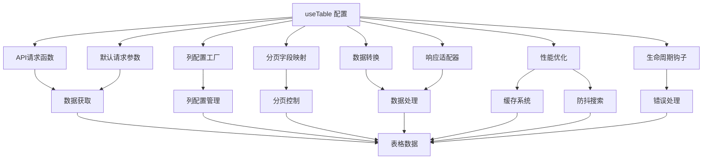
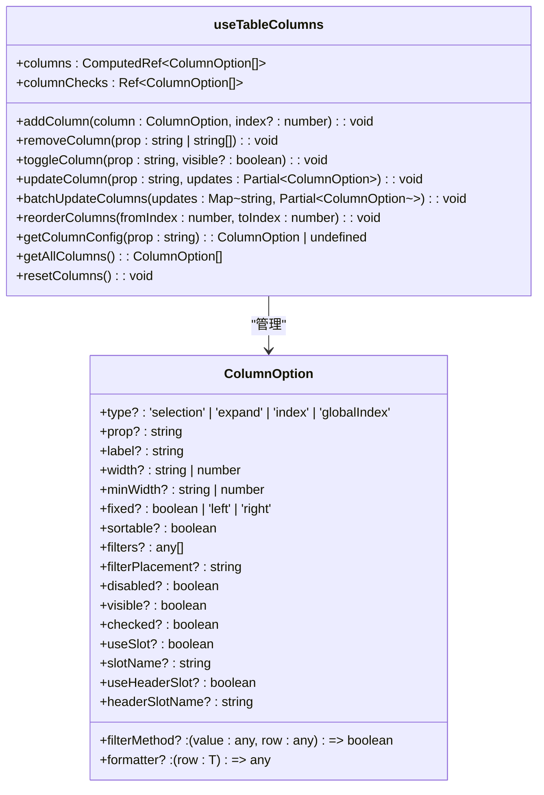
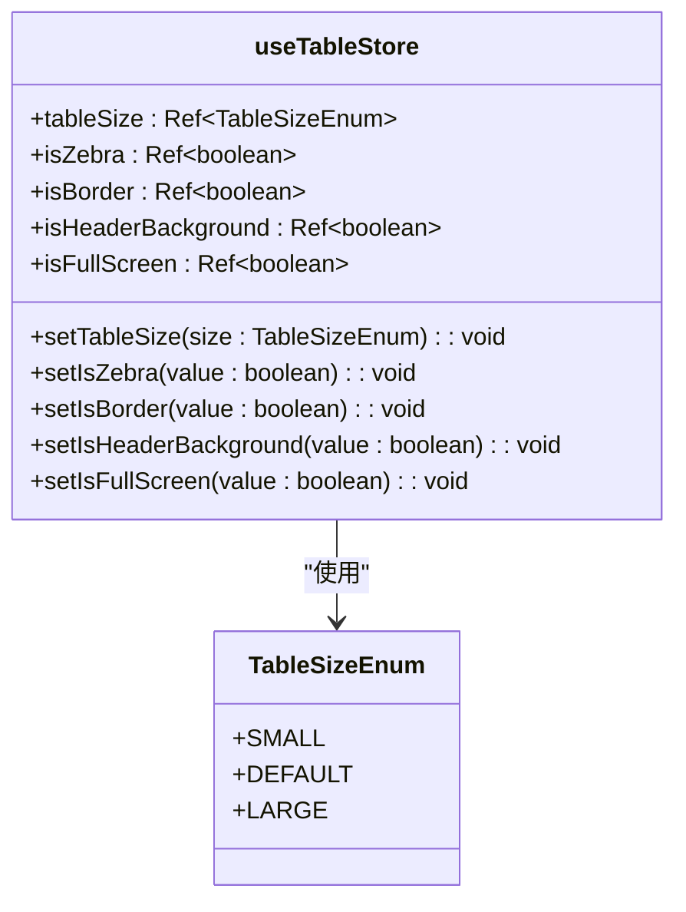
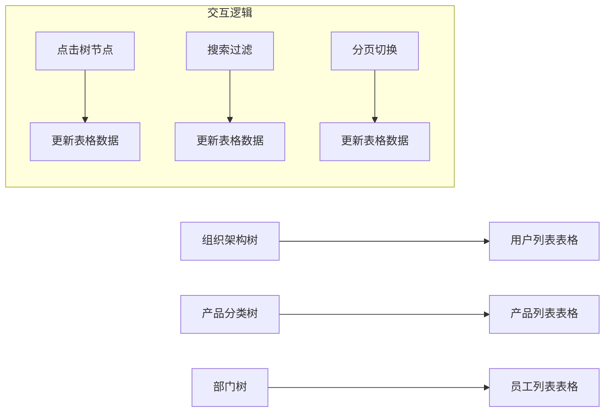
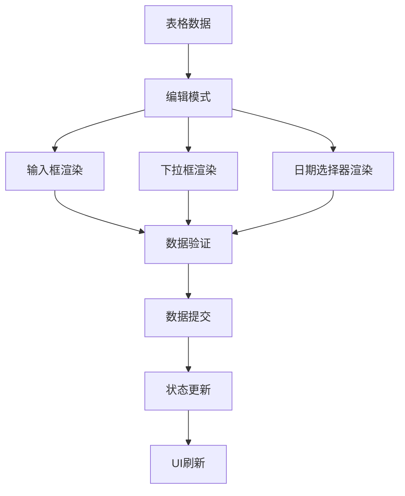
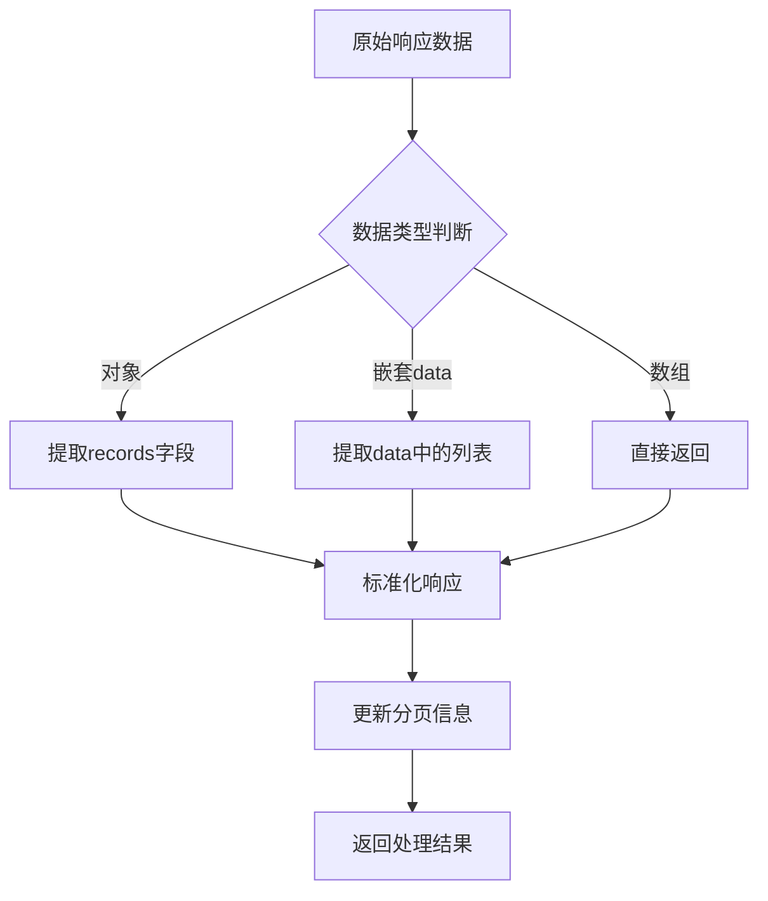
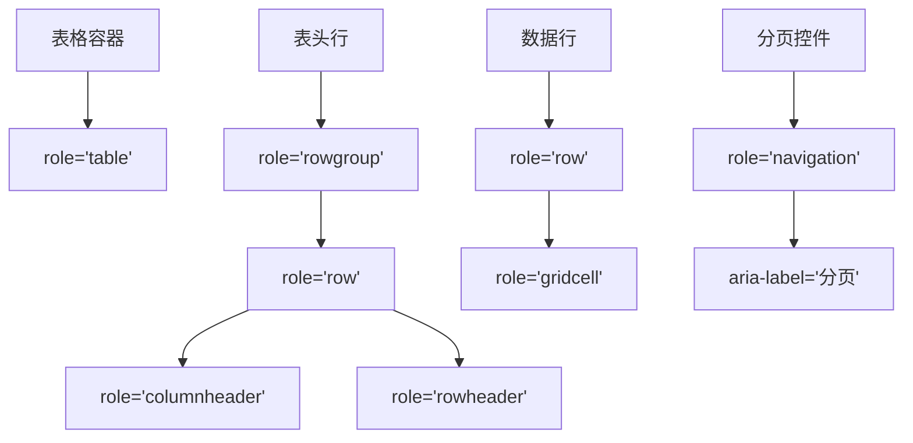
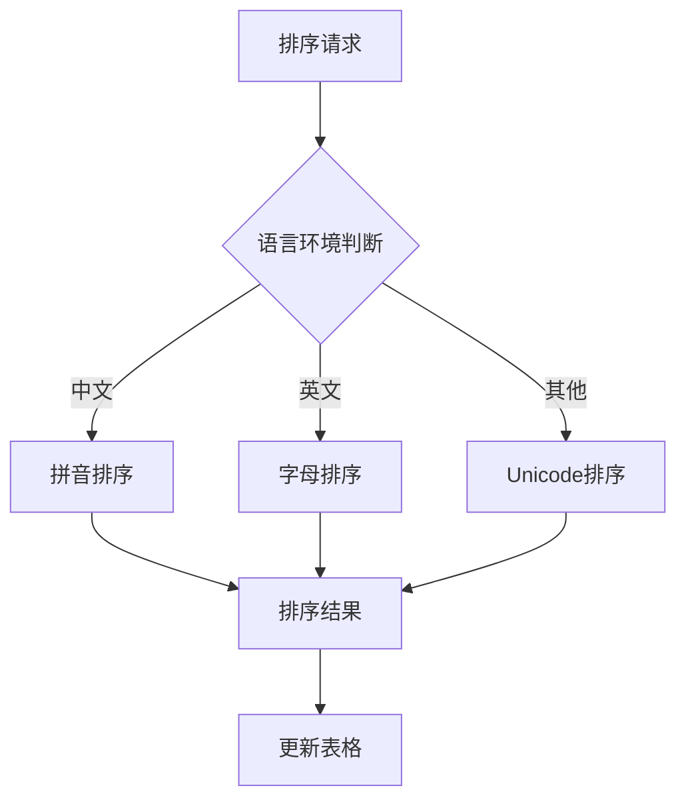
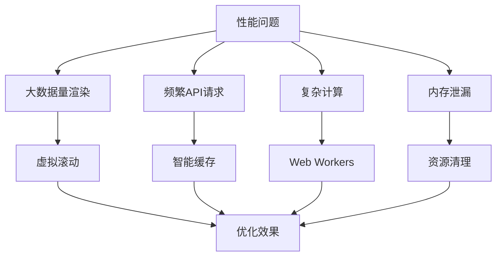

# 表格组件

<cite>
**本文档引用的文件**
- [useTable.ts](file://src/hooks/core/useTable.ts)
- [useTableColumns.ts](file://src/hooks/core/useTableColumns.ts)
- [table.ts](file://src/store/modules/table.ts)
- [tableUtils.ts](file://src/utils/table/tableUtils.ts)
- [tableCache.ts](file://src/utils/table/tableCache.ts)
- [index.ts](file://src/types/component/index.ts)
- [art-table-header/index.vue](file://src/components/core/tables/art-table-header/index.vue)
- [basic.vue](file://src/views/examples/tables/basic.vue)
- [tree.vue](file://src/views/examples/tables/tree.vue)
</cite>

## 目录
1. [引言](#引言)
2. [核心功能解析](#核心功能解析)
3. [组合式函数集成](#组合式函数集成)
4. [状态管理机制](#状态管理机制)
5. [高级用法示例](#高级用法示例)
6. [性能优化策略](#性能优化策略)
7. [可访问性与国际化](#可访问性与国际化)
8. [常见问题与优化方案](#常见问题与优化方案)

## 引言

Art Design Pro的表格组件是一套功能完整的表格解决方案，专为复杂的企业级后台管理系统设计。该组件不仅提供了基础的表格展示功能，还集成了数据管理、分页控制、搜索过滤、缓存机制等高级特性。通过useTable和useTableColumns等组合式函数，开发者可以轻松实现复杂的表格交互逻辑，同时保持代码的简洁性和可维护性。本技术文档将深入解析表格组件的核心功能、实现原理和最佳实践。

## 核心功能解析

Art Design Pro表格组件提供了一套完整的表格解决方案，涵盖了列配置、数据绑定、排序、分页、筛选、行选择和自定义单元格渲染等核心功能。通过art-table组件，开发者可以轻松构建功能丰富的数据展示界面。

**Section sources**
- [useTable.ts](file://src/hooks/core/useTable.ts#L1-L737)
- [useTableColumns.ts](file://src/hooks/core/useTableColumns.ts#L1-L257)
- [index.ts](file://src/types/component/index.ts#L48-L89)

## 组合式函数集成

### useTable函数

useTable是表格数据管理的核心组合式函数，提供了一套完整的表格数据管理解决方案。该函数封装了表格开发中的所有常见需求，让开发者可以专注于业务逻辑的实现。



**Diagram sources**
- [useTable.ts](file://src/hooks/core/useTable.ts#L19-L737)

### useTableColumns函数

useTableColumns提供了动态的表格列配置管理能力，支持运行时灵活控制列的显示、隐藏、排序等操作。该函数通常与useTable配合使用，为表格提供完整的列管理功能。



**Diagram sources**
- [useTableColumns.ts](file://src/hooks/core/useTableColumns.ts#L35-L257)
- [index.ts](file://src/types/component/index.ts#L48-L89)

**Section sources**
- [useTableColumns.ts](file://src/hooks/core/useTableColumns.ts#L1-L257)
- [index.ts](file://src/types/component/index.ts#L48-L89)

## 状态管理机制

表格组件的状态管理通过Pinia store实现，提供了表格显示配置的集中管理。useTableStore模块负责管理表格的尺寸、斑马纹、边框、表头背景和全屏模式等状态。



**Diagram sources**
- [table.ts](file://src/store/modules/table.ts#L28-L98)
- [formEnum.ts](file://src/enums/formEnum.ts)

**Section sources**
- [table.ts](file://src/store/modules/table.ts#L1-L98)

## 高级用法示例

### 树形数据展示

通过结合ElTree和art-table组件，可以实现左树右表的复杂数据展示界面。树形组件用于分类导航，表格组件用于展示详细数据。



**Diagram sources**
- [tree.vue](file://src/views/examples/tables/tree.vue#L1-L238)

### 可编辑表格

通过自定义单元格渲染和插槽机制，可以实现可编辑表格功能。结合表单验证和数据提交机制，可以构建完整的数据编辑界面。



**Diagram sources**
- [basic.vue](file://src/views/examples/tables/basic.vue#L1-L64)
- [useTable.ts](file://src/hooks/core/useTable.ts#L279-L411)

**Section sources**
- [tree.vue](file://src/views/examples/tables/tree.vue#L1-L238)
- [basic.vue](file://src/views/examples/tables/basic.vue#L1-L64)

## 性能优化策略

### 缓存系统

表格组件内置了智能缓存系统，通过TableCache类实现。该系统基于参数的智能缓存键生成，采用LRU（最近最少使用）缓存淘汰策略，并支持缓存过期时间管理和大小限制。

```mermaid
classDiagram
class TableCache {
-cache : Map~string, CacheItem<T>~
-cacheTime : number
-maxSize : number
-enableLog : boolean
+set(params : unknown, data : T[], response : ApiResponse<T>) : void
+get(params : unknown) : CacheItem<T> | null
+clearByTags(tags : string[]) : number
+clearCurrentSearch(params : unknown) : number
+clearPagination() : number
+clear() : void
+getStats() : { total : number; size : string; hitRate : string }
+cleanupExpired() : number
}
class CacheItem {
+data : T[]
+response : ApiResponse<T>
+timestamp : number
+params : string
+tags : Set~string~
+accessCount : number
+lastAccessTime : number
}
TableCache --> CacheItem : "包含"
```

**Diagram sources**
- [tableCache.ts](file://src/utils/table/tableCache.ts#L74-L267)

### 数据处理优化

通过响应适配器和数据提取函数，表格组件能够处理多种后端接口响应格式，实现数据的标准化处理。



**Diagram sources**
- [tableUtils.ts](file://src/utils/table/tableUtils.ts#L114-L169)

**Section sources**
- [tableCache.ts](file://src/utils/table/tableCache.ts#L1-L267)
- [tableUtils.ts](file://src/utils/table/tableUtils.ts#L1-L298)

## 可访问性与国际化

### ARIA标签支持

表格组件遵循WAI-ARIA最佳实践，为表格元素添加适当的ARIA标签，确保屏幕阅读器用户能够正确理解表格结构和内容。



**Diagram sources**
- [art-table-header/index.vue](file://src/components/core/tables/art-table-header/index.vue#L1-L27)

### 国际化排序规则

通过集成国际化支持，表格组件能够根据用户语言环境应用相应的排序规则，确保数据排序符合本地化需求。



**Diagram sources**
- [useTableColumns.ts](file://src/hooks/core/useTableColumns.ts#L42-L46)
- [useTable.ts](file://src/hooks/core/useTable.ts#L20-L23)

**Section sources**
- [art-table-header/index.vue](file://src/components/core/tables/art-table-header/index.vue#L1-L27)

## 常见问题与优化方案

### 常见性能瓶颈

1. **大数据量渲染卡顿**：当表格数据量过大时，会导致页面渲染卡顿。
2. **频繁请求后端接口**：不合理的缓存策略会导致频繁请求后端接口。
3. **复杂计算阻塞主线程**：在表格渲染过程中执行复杂计算会阻塞UI线程。
4. **内存泄漏**：未正确清理的定时器和事件监听器会导致内存泄漏。

### 优化方案

1. **虚拟滚动**：对于大数据量表格，采用虚拟滚动技术，只渲染可视区域的数据。
2. **智能缓存**：合理配置缓存策略，减少重复的API请求。
3. **Web Workers**：将复杂计算移至Web Workers中执行，避免阻塞主线程。
4. **资源清理**：在组件卸载时，及时清理定时器、事件监听器和订阅。



**Diagram sources**
- [useTable.ts](file://src/hooks/core/useTable.ts#L184-L185)
- [tableCache.ts](file://src/utils/table/tableCache.ts#L80-L85)

**Section sources**
- [useTable.ts](file://src/hooks/core/useTable.ts#L1-L737)
- [tableCache.ts](file://src/utils/table/tableCache.ts#L1-L267)