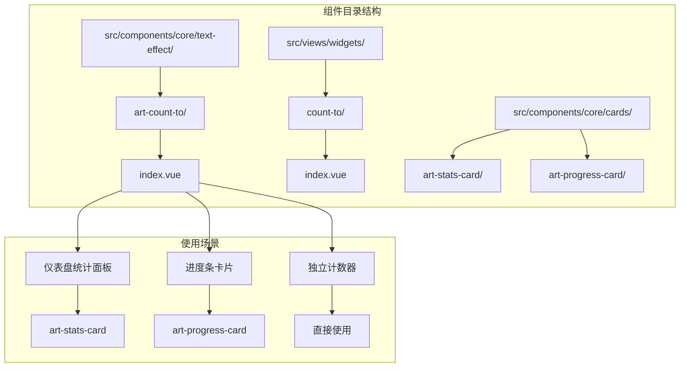
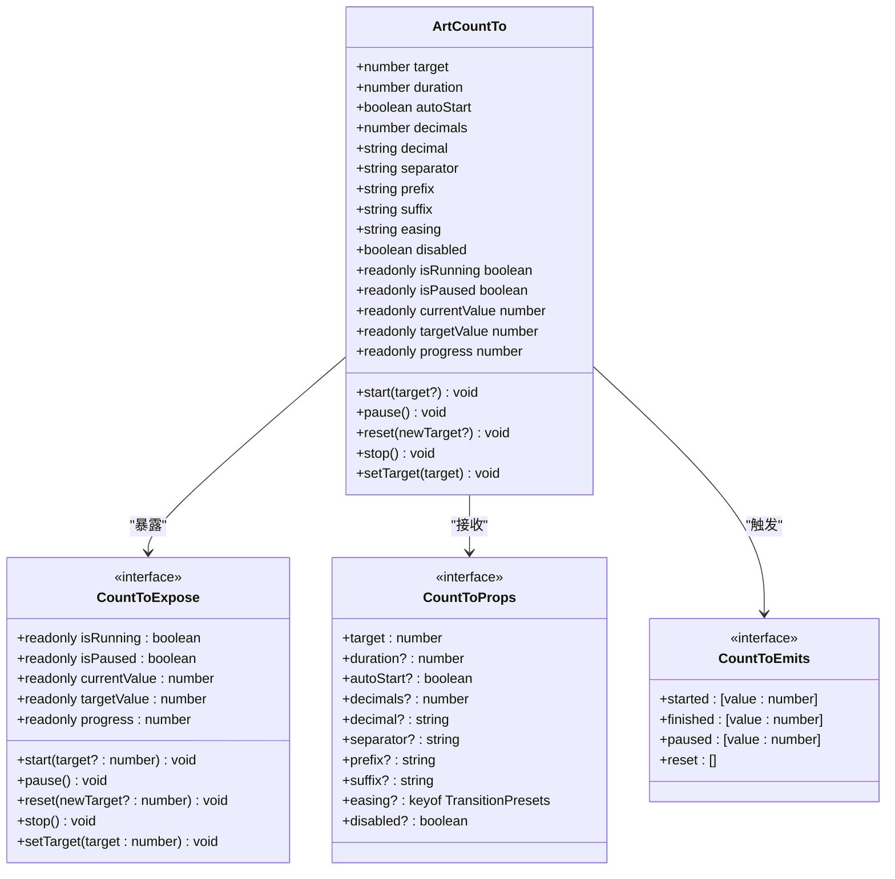
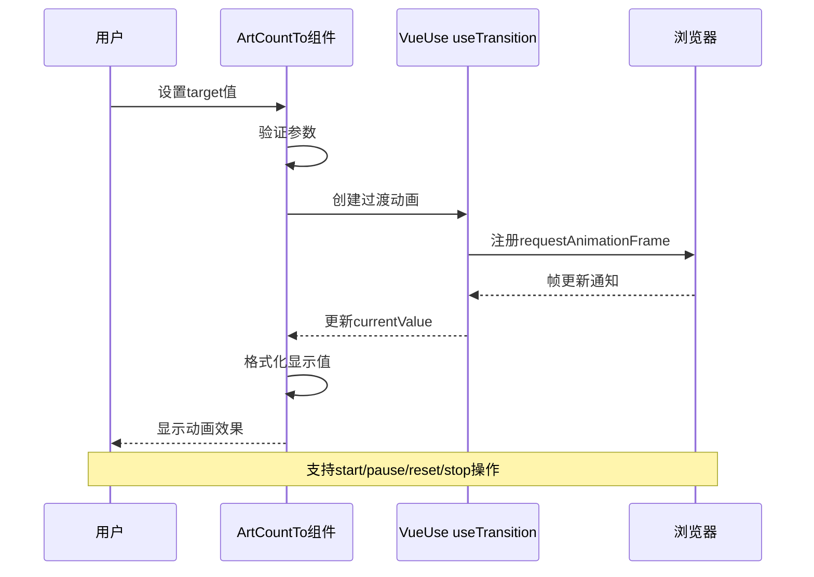
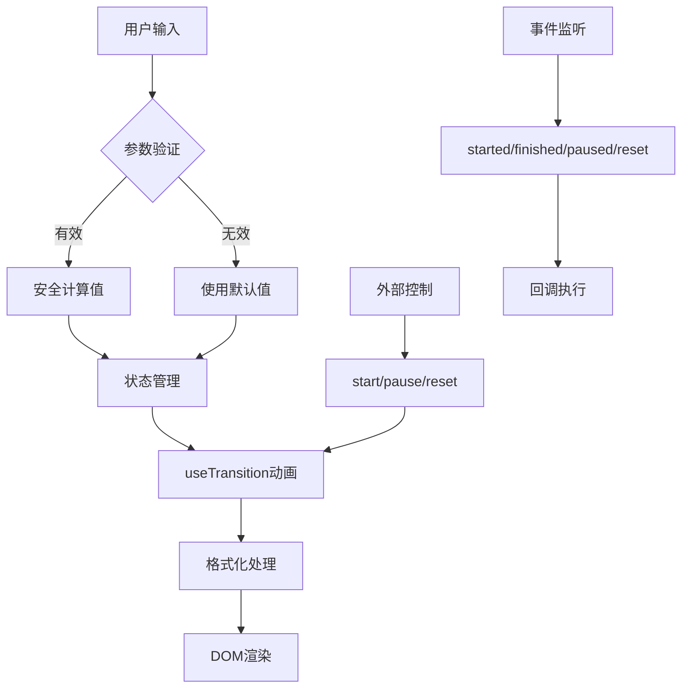
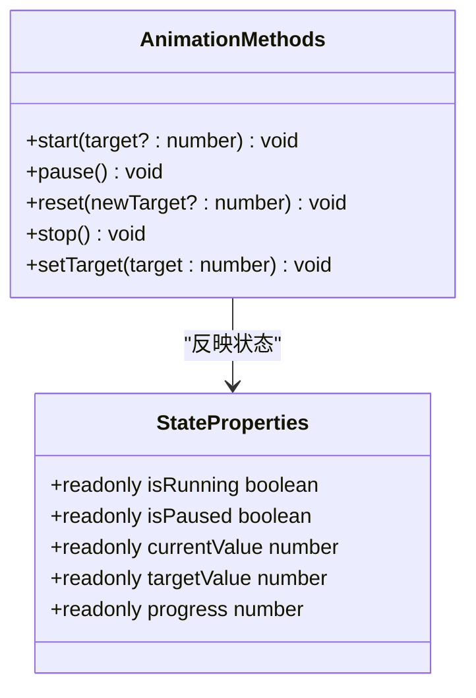
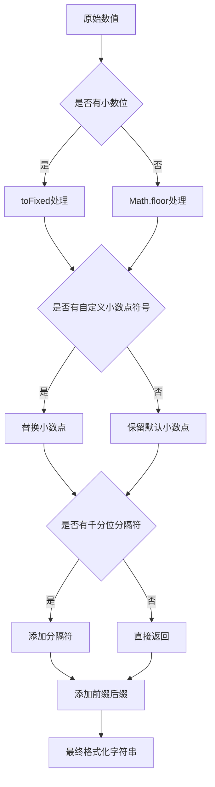
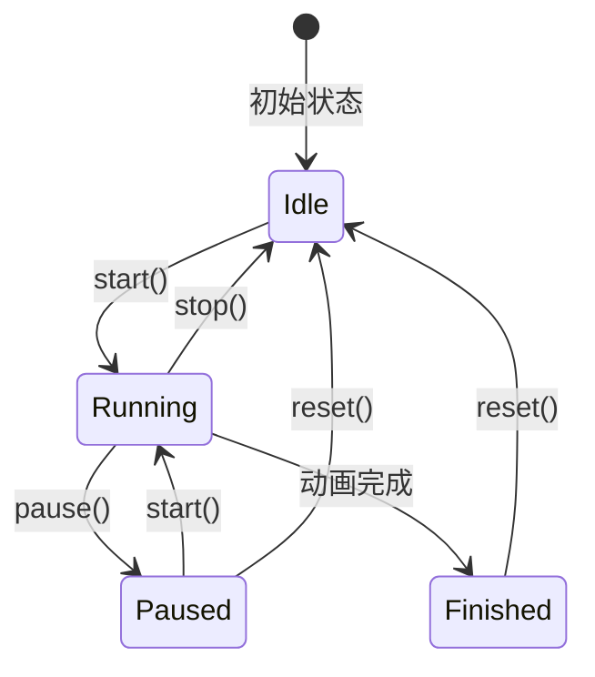
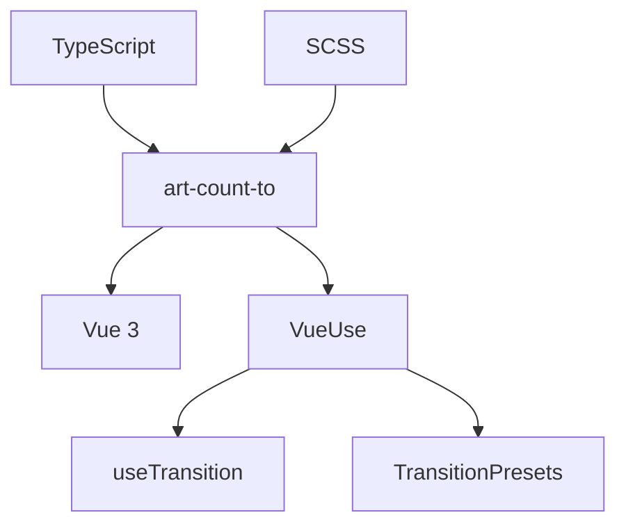

# 数字滚动动画组件 (art-count-to)

<cite>
**本文档中引用的文件**
- [src/components/core/text-effect/art-count-to/index.vue](file://src/components/core/text-effect/art-count-to/index.vue)
- [src/views/widgets/count-to/index.vue](file://src/views/widgets/count-to/index.vue)
- [src/components/core/cards/art-stats-card/index.vue](file://src/components/core/cards/art-stats-card/index.vue)
- [src/components/core/cards/art-progress-card/index.vue](file://src/components/core/cards/art-progress-card/index.vue)
- [src/views/dashboard/console/modules/card-list.vue](file://src/views/dashboard/console/modules/card-list.vue)
</cite>

## 目录
1. [简介](#简介)
2. [项目结构](#项目结构)
3. [核心组件](#核心组件)
4. [架构概览](#架构概览)
5. [详细组件分析](#详细组件分析)
6. [依赖关系分析](#依赖关系分析)
7. [性能考虑](#性能考虑)
8. [故障排除指南](#故障排除指南)
9. [结论](#结论)

## 简介

art-count-to 是一个基于 VueUse `useTransition` 的高性能数字滚动动画组件，专为数据可视化仪表盘和统计面板设计。该组件提供了流畅的数字动画效果，支持多种缓动函数、精确的数值格式化以及完整的动画控制功能。

### 主要特性

- **高性能动画**：基于 VueUse `useTransition` 实现，利用浏览器原生动画性能
- **丰富的配置选项**：支持前缀、后缀、小数位数、千分位分隔符等格式化选项
- **完整的动画控制**：提供开始、暂停、重置、停止等动画控制方法
- **事件回调系统**：支持动画生命周期事件监听
- **响应式设计**：自动适应组件尺寸变化
- **无障碍支持**：内置可访问性优化

## 项目结构



**图表来源**
- [src/components/core/text-effect/art-count-to/index.vue](file://src/components/core/text-effect/art-count-to/index.vue#L1-L311)
- [src/views/widgets/count-to/index.vue](file://src/views/widgets/count-to/index.vue#L1-L176)

**章节来源**
- [src/components/core/text-effect/art-count-to/index.vue](file://src/components/core/text-effect/art-count-to/index.vue#L1-L50)
- [src/views/widgets/count-to/index.vue](file://src/views/widgets/count-to/index.vue#L1-L30)

## 核心组件

### 组件架构设计

art-count-to 组件采用基于 Vue 3 Composition API 的现代架构设计，充分利用 VueUse 提供的工具函数来实现高性能动画效果。



**图表来源**
- [src/components/core/text-effect/art-count-to/index.vue](file://src/components/core/text-effect/art-count-to/index.vue#L16-L56)

### 核心常量定义

组件定义了一系列重要的常量来确保动画质量和性能：

| 常量名称 | 默认值 | 说明 |
|---------|--------|------|
| `EPSILON` | `Number.EPSILON` | 数值精度阈值，用于判断数值是否相等 |
| `MIN_DURATION` | `100` | 最小动画持续时间（毫秒） |
| `MAX_DURATION` | `60000` | 最大动画持续时间（毫秒） |
| `MAX_DECIMALS` | `10` | 最大小数位数限制 |
| `DEFAULT_EASING` | `'easeOutExpo'` | 默认缓动函数 |
| `DEFAULT_DURATION` | `2000` | 默认动画持续时间 |

**章节来源**
- [src/components/core/text-effect/art-count-to/index.vue](file://src/components/core/text-effect/art-count-to/index.vue#L60-L66)

## 架构概览

### 动画引擎架构



**图表来源**
- [src/components/core/text-effect/art-count-to/index.vue](file://src/components/core/text-effect/art-count-to/index.vue#L143-L156)

### 数据流架构



**图表来源**
- [src/components/core/text-effect/art-count-to/index.vue](file://src/components/core/text-effect/art-count-to/index.vue#L119-L156)

**章节来源**
- [src/components/core/text-effect/art-count-to/index.vue](file://src/components/core/text-effect/art-count-to/index.vue#L119-L168)

## 详细组件分析

### 属性配置详解

#### 基础属性

| 属性名 | 类型 | 默认值 | 说明 |
|--------|------|--------|------|
| `target` | `number` | `0` | 目标数值，动画结束时显示的值 |
| `duration` | `number` | `2000` | 动画持续时间（毫秒），范围100-60000 |
| `autoStart` | `boolean` | `true` | 是否自动开始动画 |
| `disabled` | `boolean` | `false` | 是否禁用动画 |

#### 格式化属性

| 属性名 | 类型 | 默认值 | 说明 |
|--------|------|--------|------|
| `decimals` | `number` | `0` | 小数位数，范围0-10 |
| `decimal` | `string` | `'.'` | 小数点符号 |
| `separator` | `string` | `''` | 千分位分隔符 |
| `prefix` | `string` | `''` | 前缀文本 |
| `suffix` | `string` | `''` | 后缀文本 |

#### 缓动属性

| 属性名 | 类型 | 默认值 | 说明 |
|--------|------|--------|------|
| `easing` | `keyof TransitionPresets` | `'easeOutExpo'` | 缓动函数类型 |

支持的缓动函数包括：
- `linear` - 线性缓动
- `easeOutCubic` - 三次方缓出
- `easeOutExpo` - 指数缓出（默认）
- `easeOutSine` - 正弦缓出
- `easeInOutCubic` - 三次方缓入缓出
- `easeInQuad` - 二次方缓入

### 方法调用详解

#### 公共方法



**图表来源**
- [src/components/core/text-effect/art-count-to/index.vue](file://src/components/core/text-effect/art-count-to/index.vue#L46-L56)

#### 方法行为说明

1. **`start(target?: number)`**
   - 开始或重新开始动画
   - 如果未指定目标值，则使用当前目标值
   - 支持从暂停状态恢复

2. **`pause()`**
   - 暂停当前动画
   - 保存当前数值到暂停状态
   - 触发 `paused` 事件

3. **`reset(newTarget?: number)`**
   - 重置动画到初始状态
   - 可选指定新目标值
   - 触发 `reset` 事件

4. **`stop()`**
   - 停止并重置动画
   - 清除所有状态
   - 触发 `paused` 事件

5. **`setTarget(target: number)`**
   - 设置新的目标值
   - 根据配置决定是否自动开始动画

**章节来源**
- [src/components/core/text-effect/art-count-to/index.vue](file://src/components/core/text-effect/art-count-to/index.vue#L182-L253)

### 事件回调系统

#### 事件类型定义

| 事件名 | 参数 | 触发时机 |
|--------|------|----------|
| `started` | `(value: number)` | 动画开始时 |
| `finished` | `(value: number)` | 动画完成时 |
| `paused` | `(value: number)` | 动画暂停时 |
| `reset` | `()` | 动画重置时 |

#### 事件使用示例

```typescript
// 基础事件监听
const countToRef = ref()

// 监听动画开始
const handleStarted = (value: number) => {
  console.log('动画开始，目标值:', value)
}

// 监听动画完成
const handleFinished = (value: number) => {
  console.log('动画完成，最终值:', value)
}
```

**章节来源**
- [src/components/core/text-effect/art-count-to/index.vue](file://src/components/core/text-effect/art-count-to/index.vue#L39-L44)

### 数值格式化算法

#### 格式化流程



**图表来源**
- [src/components/core/text-effect/art-count-to/index.vue](file://src/components/core/text-effect/art-count-to/index.vue#L95-L116)

#### 格式化函数实现

格式化函数 `formatNumber` 支持以下功能：

1. **小数位处理**：根据 `decimals` 参数控制小数位数
2. **小数点替换**：支持自定义小数点符号
3. **千分位分隔**：支持自定义分隔符
4. **前后缀添加**：自动添加前缀和后缀

**章节来源**
- [src/components/core/text-effect/art-count-to/index.vue](file://src/components/core/text-effect/art-count-to/index.vue#L95-L116)

### 性能优化机制

#### requestAnimationFrame 使用

组件内部使用 VueUse 的 `useTransition` 来实现高效的动画渲染：

```typescript
// 使用 VueUse useTransition 实现动画
const transitionValue = useTransition(currentValue, {
  duration: safeDuration,
  transition: computed(() => TransitionPresets[safeEasing.value]),
  onStarted: () => { /* 动画开始处理 */ },
  onFinished: () => { /* 动画完成处理 */ }
})
```

#### 内存泄漏防范

1. **组件卸载清理**
   - 在 `onUnmounted` 生命周期中停止动画
   - 清理所有定时器和订阅

2. **状态管理优化**
   - 使用 `shallowRef` 减少不必要的响应式开销
   - 避免在动画过程中创建大量临时对象

3. **事件监听器管理**
   - 自动清理组件销毁时的事件监听器

**章节来源**
- [src/components/core/text-effect/art-count-to/index.vue](file://src/components/core/text-effect/art-count-to/index.vue#L277-L282)

### 动画暂停/恢复逻辑

#### 暂停状态管理



**图表来源**
- [src/components/core/text-effect/art-count-to/index.vue](file://src/components/core/text-effect/art-count-to/index.vue#L136-L141)

#### 暂停恢复机制

当动画被暂停时，组件会：
1. 保存当前动画进度到 `pausedValue`
2. 设置 `isPaused` 状态为 `true`
3. 在恢复时从保存的状态继续动画

**章节来源**
- [src/components/core/text-effect/art-count-to/index.vue](file://src/components/core/text-effect/art-count-to/index.vue#L142-L156)

## 依赖关系分析

### 外部依赖



**图表来源**
- [src/components/core/text-effect/art-count-to/index.vue](file://src/components/core/text-effect/art-count-to/index.vue#L12-L13)

### 内部依赖

组件与其他组件的集成关系：

| 依赖组件 | 使用场景 | 说明 |
|----------|----------|------|
| `art-stats-card` | 统计卡片 | 在统计面板中作为数值显示组件 |
| `art-progress-card` | 进度卡片 | 在进度条中显示百分比数值 |
| `card-list` | 仪表盘 | 在数据卡片中显示各类统计数值 |

**章节来源**
- [src/components/core/cards/art-stats-card/index.vue](file://src/components/core/cards/art-stats-card/index.vue#L14-L21)
- [src/components/core/cards/art-progress-card/index.vue](file://src/components/core/cards/art-progress-card/index.vue#L9-L15)

## 性能考虑

### 动画性能优化

1. **硬件加速**：利用 CSS transforms 和 opacity 实现硬件加速
2. **requestAnimationFrame**：使用浏览器原生动画帧调度
3. **响应式优化**：使用 `shallowRef` 减少不必要的响应式更新
4. **批量更新**：通过 `nextTick` 批量处理 DOM 更新

### 内存管理

1. **及时清理**：组件卸载时自动清理动画资源
2. **弱引用**：避免循环引用导致的内存泄漏
3. **对象池**：对于频繁创建的对象使用对象池模式

### 渲染性能

1. **虚拟化**：对于大量数据的场景，考虑使用虚拟滚动
2. **懒加载**：动画组件可以配合懒加载策略
3. **节流防抖**：对于频繁的数值更新，使用防抖技术

## 故障排除指南

### 常见问题及解决方案

#### 动画不生效

**问题描述**：设置目标值后动画没有启动

**可能原因**：
1. `disabled` 属性被设置为 `true`
2. `target` 值与当前值相同
3. 组件未正确初始化

**解决方案**：
```typescript
// 检查组件状态
console.log(countToRef.value?.isRunning) // 应为 false
console.log(countToRef.value?.currentValue) // 应为初始值
console.log(countToRef.value?.targetValue) // 应为目标值
```

#### 数值格式化错误

**问题描述**：显示的数值格式不符合预期

**可能原因**：
1. `decimals` 参数超出范围
2. `separator` 参数格式错误
3. `decimal` 参数包含特殊字符

**解决方案**：
```typescript
// 验证参数范围
const safeDecimals = Math.max(0, Math.min(10, props.decimals))
const safeSeparator = props.separator || ''
const safeDecimal = props.decimal || '.'
```

#### 性能问题

**问题描述**：大量组件同时运行时出现性能下降

**解决方案**：
1. 使用 `disabled` 属性禁用不需要的动画
2. 合理设置 `duration` 参数
3. 考虑使用虚拟滚动技术

**章节来源**
- [src/components/core/text-effect/art-count-to/index.vue](file://src/components/core/text-effect/art-count-to/index.vue#L171-L175)

## 结论

art-count-to 数字滚动动画组件是一个功能完善、性能优异的数据可视化组件。它通过以下特点为开发者提供了优秀的开发体验：

### 核心优势

1. **高性能动画**：基于 VueUse 和浏览器原生动画API，确保流畅的动画效果
2. **丰富的配置**：提供全面的数值格式化和动画控制选项
3. **完善的事件系统**：支持完整的动画生命周期事件监听
4. **良好的集成性**：易于与其他组件和框架集成
5. **可访问性支持**：内置无障碍优化，支持屏幕阅读器

### 最佳实践建议

1. **合理使用缓动函数**：根据业务场景选择合适的缓动效果
2. **控制动画频率**：避免短时间内大量动画同时进行
3. **优化数值精度**：根据需求设置合适的 `decimals` 参数
4. **监控性能表现**：在大量数据场景下注意性能优化

### 扩展方向

1. **更多缓动函数**：可以集成更多的缓动算法
2. **自定义动画**：支持用户自定义动画曲线
3. **多语言支持**：增强国际化能力
4. **主题定制**：提供更多样式定制选项

通过深入理解组件的设计理念和实现原理，开发者可以更好地利用 art-count-to 组件构建出色的数字可视化应用。