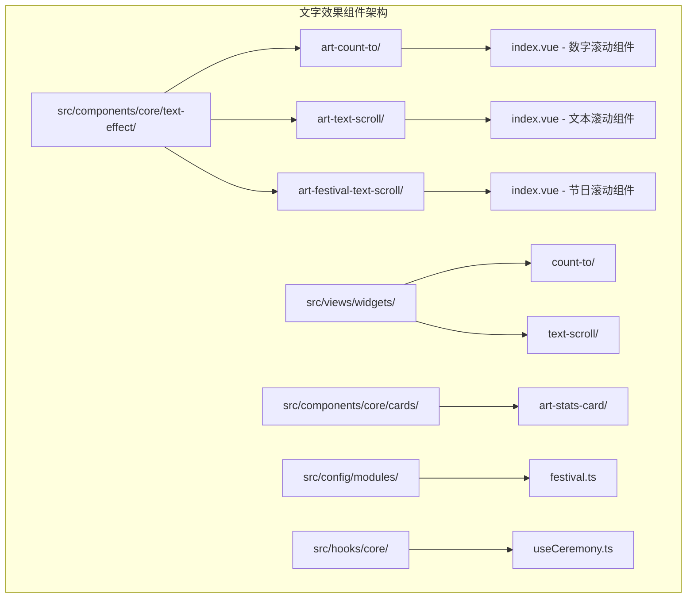
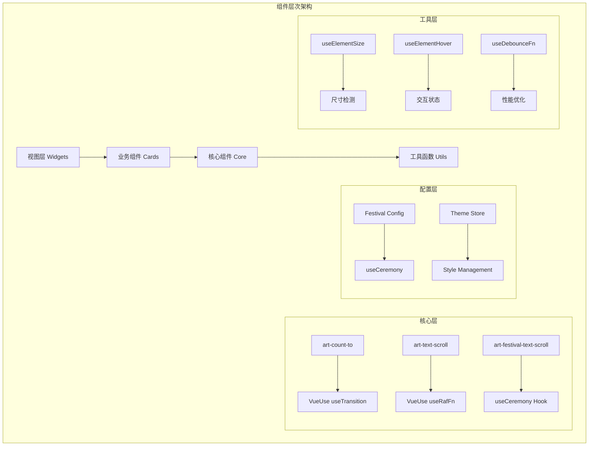
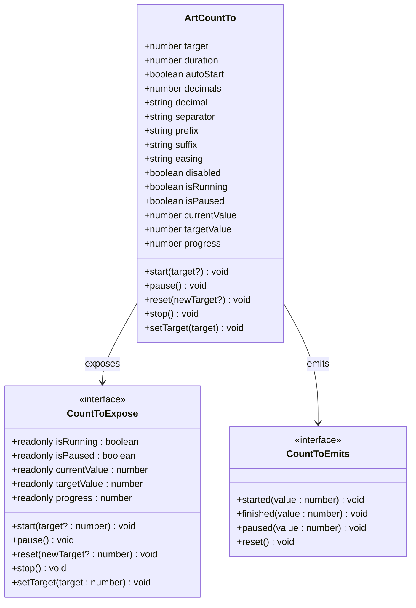
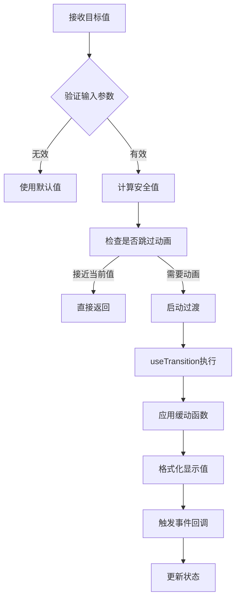
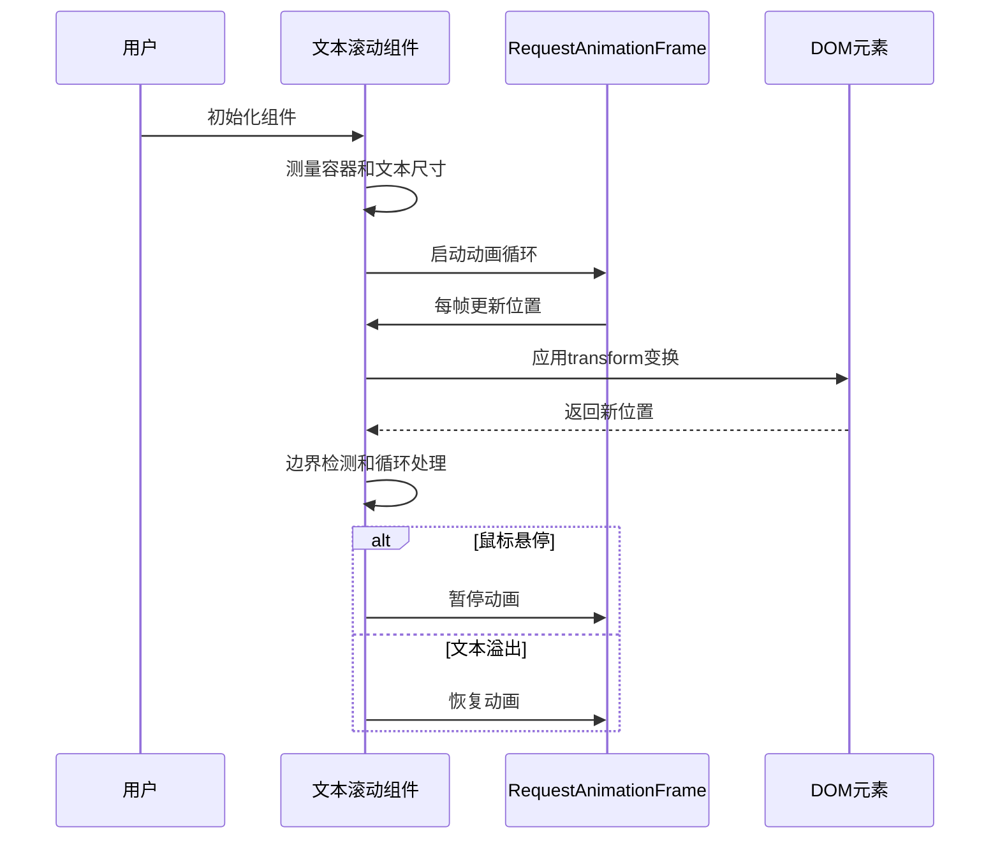
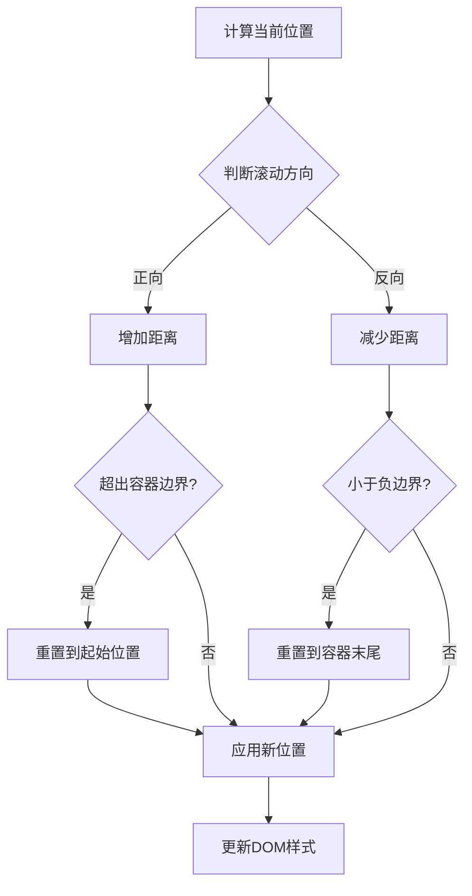
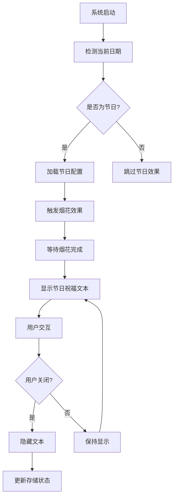
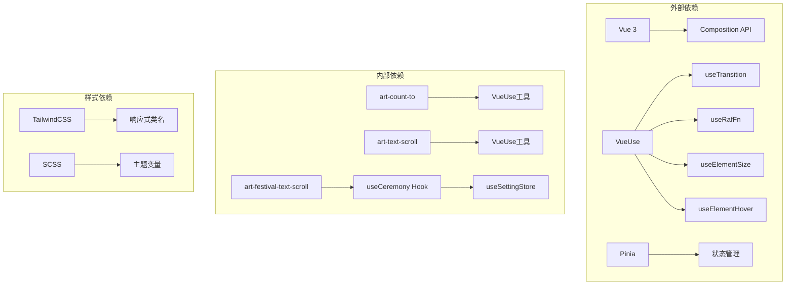

# 文字效果组件

<cite>
**本文档中引用的文件**
- [src/components/core/text-effect/art-count-to/index.vue](file://src/components/core/text-effect/art-count-to/index.vue)
- [src/components/core/text-effect/art-text-scroll/index.vue](file://src/components/core/text-effect/art-text-scroll/index.vue)
- [src/components/core/text-effect/art-festival-text-scroll/index.vue](file://src/components/core/text-effect/art-festival-text-scroll/index.vue)
- [src/views/widgets/count-to/index.vue](file://src/views/widgets/count-to/index.vue)
- [src/views/widgets/text-scroll/index.vue](file://src/views/widgets/text-scroll/index.vue)
- [src/components/core/cards/art-stats-card/index.vue](file://src/components/core/cards/art-stats-card/index.vue)
- [src/config/modules/festival.ts](file://src/config/modules/festival.ts)
- [src/hooks/core/useCeremony.ts](file://src/hooks/core/useCeremony.ts)
- [src/assets/styles/core/theme-animation.scss](file://src/assets/styles/core/theme-animation.scss)
</cite>

## 目录
1. [简介](#简介)
2. [项目结构](#项目结构)
3. [核心组件](#核心组件)
4. [架构概览](#架构概览)
5. [详细组件分析](#详细组件分析)
6. [依赖关系分析](#依赖关系分析)
7. [性能考虑](#性能考虑)
8. [可访问性支持](#可访问性支持)
9. [故障排除指南](#故障排除指南)
10. [结论](#结论)

## 简介

Art Design Pro文字效果组件是一套专为现代Web应用设计的动态文字展示解决方案。该组件库包含三个核心组件：`art-count-to`数字滚动动画、`art-text-scroll`文本滚动和`art-festival-text-scroll`节日文字滚动，为开发者提供了丰富的文字交互体验和视觉效果。

这些组件基于Vue 3和TypeScript构建，充分利用了VueUse生态系统中的高性能工具函数，确保了流畅的动画效果和优秀的用户体验。组件设计遵循无障碍访问标准，支持响应式布局，并提供了完善的主题系统和样式定制能力。

## 项目结构

文字效果组件在项目中的组织结构清晰明确，采用模块化设计原则：

**图表来源**
- [src/components/core/text-effect/art-count-to/index.vue](file://src/components/core/text-effect/art-count-to/index.vue#L1-L311)
- [src/components/core/text-effect/art-text-scroll/index.vue](file://src/components/core/text-effect/art-text-scroll/index.vue#L1-L286)
- [src/components/core/text-effect/art-festival-text-scroll/index.vue](file://src/components/core/text-effect/art-festival-text-scroll/index.vue#L1-L33)

**章节来源**
- [src/components/core/text-effect/art-count-to/index.vue](file://src/components/core/text-effect/art-count-to/index.vue#L1-L50)
- [src/components/core/text-effect/art-text-scroll/index.vue](file://src/components/core/text-effect/art-text-scroll/index.vue#L1-L50)
- [src/components/core/text-effect/art-festival-text-scroll/index.vue](file://src/components/core/text-effect/art-festival-text-scroll/index.vue#L1-L33)

## 核心组件

### art-count-to 数字滚动动画组件

`art-count-to`是一个基于VueUse `useTransition`的高性能数字滚动动画组件，支持完整的动画控制和事件监听。该组件能够平滑地将数值从当前值过渡到目标值，提供丰富的自定义选项。

#### 核心特性：
- **高性能动画**：基于VueUse的`useTransition`实现，确保流畅的动画效果
- **灵活配置**：支持自定义目标值、持续时间、缓动函数等参数
- **格式化选项**：提供前缀、后缀、小数位数、千分位分隔符等格式化功能
- **事件回调**：完整的动画生命周期事件支持
- **控制方法**：提供start、pause、reset、stop等控制接口

#### 技术实现要点：
- 使用`TransitionPresets`提供多种缓动函数选择
- 实现智能精度处理，避免浮点数误差
- 支持运行时动态修改目标值
- 内置防抖和节流机制优化性能

### art-text-scroll 文本滚动组件

`art-text-scroll`是一个功能强大的文本滚动组件，支持水平和垂直滚动模式，提供丰富的主题样式和交互控制。

#### 核心特性：
- **多方向滚动**：支持左、右、上、下四个方向的滚动
- **主题系统**：内置多种预设主题（theme、primary、success、warning、danger等）
- **智能控制**：支持鼠标悬停暂停、始终滚动等功能
- **响应式设计**：自动适应容器尺寸变化
- **无障碍支持**：良好的键盘导航和屏幕阅读器兼容性

#### 技术实现要点：
- 基于`requestAnimationFrame`实现高性能滚动动画
- 使用克隆技术实现无缝循环效果
- 智能检测文字溢出并动态调整行为
- 支持自定义速度和方向

### art-festival-text-scroll 节日文字滚动组件

`art-festival-text-scroll`是专门为节日和特殊场合设计的滚动文本组件，集成了节日庆祝功能和动态祝福文本展示。

#### 核心特性：
- **节日集成**：自动检测当前日期并显示相应的节日祝福
- **动态配置**：支持跨日期和单日节日配置
- **状态管理**：与全局设置联动，控制显示状态
- **清理机制**：提供完整的关闭和清理功能

**章节来源**
- [src/components/core/text-effect/art-count-to/index.vue](file://src/components/core/text-effect/art-count-to/index.vue#L1-L311)
- [src/components/core/text-effect/art-text-scroll/index.vue](file://src/components/core/text-effect/art-text-scroll/index.vue#L1-L286)
- [src/components/core/text-effect/art-festival-text-scroll/index.vue](file://src/components/core/text-effect/art-festival-text-scroll/index.vue#L1-L33)

## 架构概览

文字效果组件的整体架构采用了分层设计模式，确保了组件的可维护性和扩展性：

**图表来源**
- [src/components/core/text-effect/art-count-to/index.vue](file://src/components/core/text-effect/art-count-to/index.vue#L12-L14)
- [src/components/core/text-effect/art-text-scroll/index.vue](file://src/components/core/text-effect/art-text-scroll/index.vue#L46-L52)
- [src/components/core/text-effect/art-festival-text-scroll/index.vue](file://src/components/core/text-effect/art-festival-text-scroll/index.vue#L19-L21)

## 详细组件分析

### art-count-to 数字滚动动画组件详细分析

#### 组件结构与设计模式

**图表来源**
- [src/components/core/text-effect/art-count-to/index.vue](file://src/components/core/text-effect/art-count-to/index.vue#L16-L57)

#### 数字动画算法实现

`art-count-to`组件的核心算法基于VueUse的`useTransition`，实现了精确的数值插值和缓动效果：

**图表来源**
- [src/components/core/text-effect/art-count-to/index.vue](file://src/components/core/text-effect/art-count-to/index.vue#L143-L156)
- [src/components/core/text-effect/art-count-to/index.vue](file://src/components/core/text-effect/art-count-to/index.vue#L190-L209)

#### 格式化选项详解

组件提供了丰富的数字格式化选项：

| 参数 | 类型 | 默认值 | 说明 |
|------|------|--------|------|
| `decimals` | number | 0 | 小数位数 |
| `decimal` | string | '.' | 小数点符号 |
| `separator` | string | '' | 千分位分隔符 |
| `prefix` | string | '' | 前缀字符串 |
| `suffix` | string | '' | 后缀字符串 |

**章节来源**
- [src/components/core/text-effect/art-count-to/index.vue](file://src/components/core/text-effect/art-count-to/index.vue#L95-L116)

### art-text-scroll 文本滚动组件详细分析

#### 滚动模式与速度调节

**图表来源**
- [src/components/core/text-effect/art-text-scroll/index.vue](file://src/components/core/text-effect/art-text-scroll/index.vue#L221-L248)

#### 循环策略与边界检测

组件实现了智能的循环策略，确保无缝滚动效果：

**图表来源**
- [src/components/core/text-effect/art-text-scroll/index.vue](file://src/components/core/text-effect/art-text-scroll/index.vue#L234-L242)

#### 主题系统与样式定制

组件支持多种预设主题，每种主题都有对应的颜色和样式配置：

| 主题类型 | 颜色变量 | 用途 |
|----------|----------|------|
| `theme` | `--color-theme` | 主题色 |
| `primary` | `--color-primary` | 主要操作色 |
| `success` | `--color-success` | 成功状态色 |
| `warning` | `--color-warning` | 警告状态色 |
| `danger` | `--color-danger` | 错误状态色 |
| `info` | `--color-info` | 信息状态色 |

**章节来源**
- [src/components/core/text-effect/art-text-scroll/index.vue](file://src/components/core/text-effect/art-text-scroll/index.vue#L141-L152)

### art-festival-text-scroll 节日文字滚动组件详细分析

#### 节日主题适配机制

**图表来源**
- [src/hooks/core/useCeremony.ts](file://src/hooks/core/useCeremony.ts#L115-L130)
- [src/components/core/text-effect/art-festival-text-scroll/index.vue](file://src/components/core/text-effect/art-festival-text-scroll/index.vue#L29-L31)

**章节来源**
- [src/components/core/text-effect/art-festival-text-scroll/index.vue](file://src/components/core/text-effect/art-festival-text-scroll/index.vue#L1-L33)
- [src/hooks/core/useCeremony.ts](file://src/hooks/core/useCeremony.ts#L1-L185)

## 依赖关系分析

文字效果组件的依赖关系体现了现代化的前端架构设计：

**图表来源**
- [src/components/core/text-effect/art-count-to/index.vue](file://src/components/core/text-effect/art-count-to/index.vue#L12-L14)
- [src/components/core/text-effect/art-text-scroll/index.vue](file://src/components/core/text-effect/art-text-scroll/index.vue#L46-L52)

**章节来源**
- [src/components/core/text-effect/art-count-to/index.vue](file://src/components/core/text-effect/art-count-to/index.vue#L12-L14)
- [src/components/core/text-effect/art-text-scroll/index.vue](file://src/components/core/text-effect/art-text-scroll/index.vue#L46-L52)

## 性能考虑

### 帧率控制与内存管理

文字效果组件采用了多层次的性能优化策略：

#### 动画性能优化
- **requestAnimationFrame**：所有滚动动画都基于`useRafFn`实现，确保与浏览器刷新率同步
- **防抖处理**：使用`useDebounceFn`优化尺寸变化监听
- **懒加载**：组件初始化时延迟测量，避免阻塞主线程
- **智能暂停**：在不需要时自动暂停动画，节省CPU资源

#### 内存管理策略
- **浅引用**：使用`shallowRef`减少不必要的响应式开销
- **及时清理**：组件卸载时自动清理定时器和事件监听器
- **对象池**：避免频繁的对象创建和销毁

#### 动画流畅性保障
- **缓动函数**：提供多种预设缓动效果，确保自然的动画过渡
- **边界检测**：精确的边界计算避免视觉跳跃
- **状态同步**：确保动画状态与用户交互的一致性

**章节来源**
- [src/components/core/text-effect/art-text-scroll/index.vue](file://src/components/core/text-effect/art-text-scroll/index.vue#L221-L248)
- [src/components/core/text-effect/art-count-to/index.vue](file://src/components/core/text-effect/art-count-to/index.vue#L143-L156)

## 可访问性支持

### 无障碍设计原则

文字效果组件严格遵循WCAG 2.1 AA标准，提供了全面的可访问性支持：

#### 键盘导航支持
- 所有交互元素都支持键盘焦点
- Tab键顺序符合逻辑流程
- Enter和Space键激活交互功能

#### 屏幕阅读器兼容性
- 适当的ARIA标签和角色定义
- 语义化的HTML结构
- 事件状态的语音提示

#### 高对比度支持
- 基于CSS变量的主题系统
- 自动适配系统高对比度模式
- 可配置的颜色对比度

#### 低视力友好设计
- 可调整的字体大小支持
- 渐进式动画可关闭
- 重要的视觉信息提供替代文本

**章节来源**
- [src/components/core/text-effect/art-text-scroll/index.vue](file://src/components/core/text-effect/art-text-scroll/index.vue#L250-L255)

## 故障排除指南

### 常见问题与解决方案

#### 数字滚动组件问题

| 问题 | 可能原因 | 解决方案 |
|------|----------|----------|
| 动画不流畅 | 过多的DOM操作 | 减少同时运行的动画数量 |
| 数值显示错误 | 浮点数精度问题 | 检查decimals和precision设置 |
| 事件回调未触发 | 组件未正确暴露 | 确保使用ref正确引用组件 |

#### 文本滚动组件问题

| 问题 | 可能原因 | 解决方案 |
|------|----------|----------|
| 滚动不连续 | 克隆元素尺寸不匹配 | 检查文本内容和容器尺寸 |
| 方向错误 | direction参数设置 | 确认滚动方向配置 |
| 主题样式异常 | CSS变量未定义 | 检查主题配置和CSS变量 |

#### 节日组件问题

| 问题 | 可能原因 | 解决方案 |
|------|----------|----------|
| 节日效果未显示 | 日期不在配置范围内 | 检查节日配置和当前日期 |
| 烟花效果异常 | 图片路径错误 | 验证图片导入和路径 |
| 关闭功能失效 | 事件监听器未绑定 | 检查事件处理函数 |

**章节来源**
- [src/components/core/text-effect/art-count-to/index.vue](file://src/components/core/text-effect/art-count-to/index.vue#L83-L94)
- [src/components/core/text-effect/art-text-scroll/index.vue](file://src/components/core/text-effect/art-text-scroll/index.vue#L191-L214)

## 结论

Art Design Pro文字效果组件库提供了一套完整而强大的动态文字展示解决方案。通过精心设计的架构和先进的技术实现，这些组件不仅提供了出色的视觉效果，还确保了优秀的用户体验和开发效率。

### 主要优势

1. **高性能**：基于VueUse的优化工具，确保流畅的动画效果
2. **易用性**：简洁的API设计，丰富的配置选项
3. **可扩展性**：模块化架构支持功能扩展和定制
4. **可访问性**：全面的无障碍支持，符合国际标准
5. **响应式**：自适应不同设备和屏幕尺寸

### 应用场景

- **数据可视化**：统计卡片、仪表板中的数值展示
- **信息展示**：公告栏、新闻滚动、活动通知
- **节日主题**：特殊节日的氛围营造和祝福展示
- **用户引导**：新功能介绍、操作提示、教程引导

这套文字效果组件为现代Web应用提供了强有力的文字交互能力，是构建高质量用户界面的重要工具。