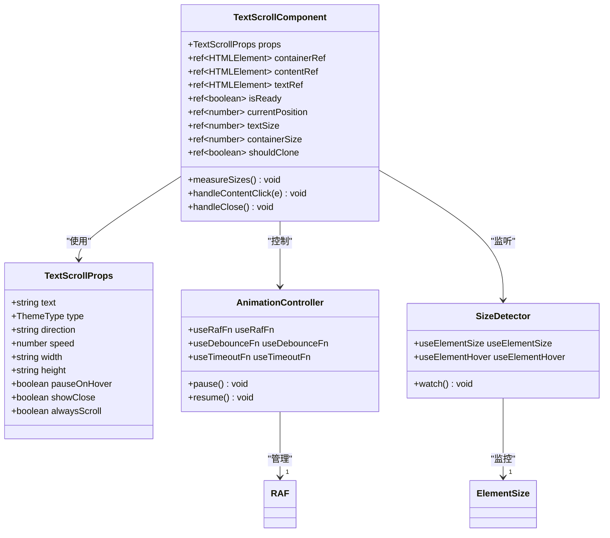
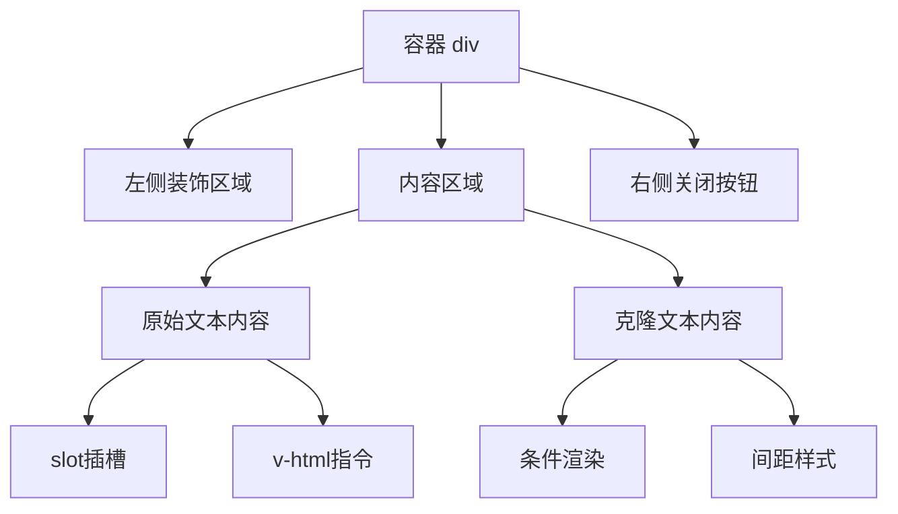
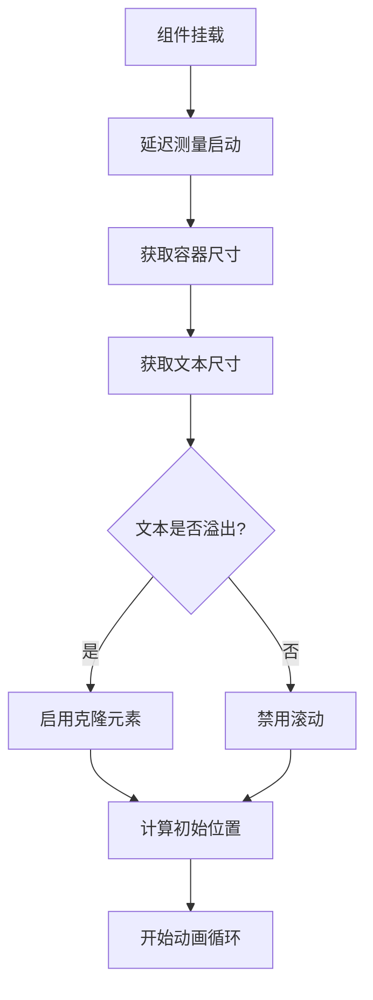
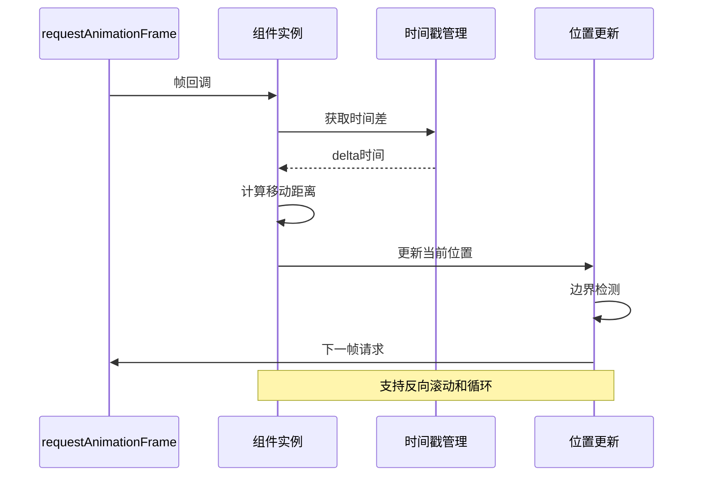
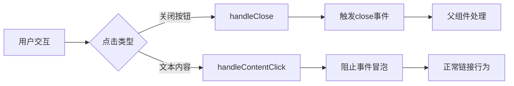
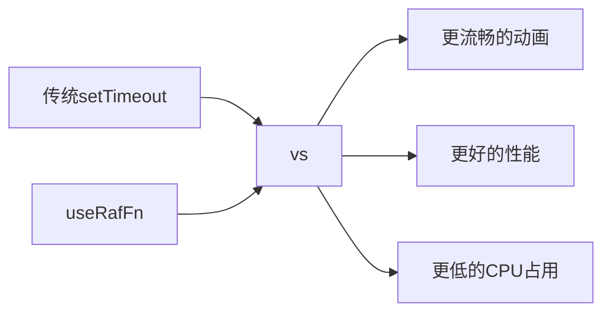
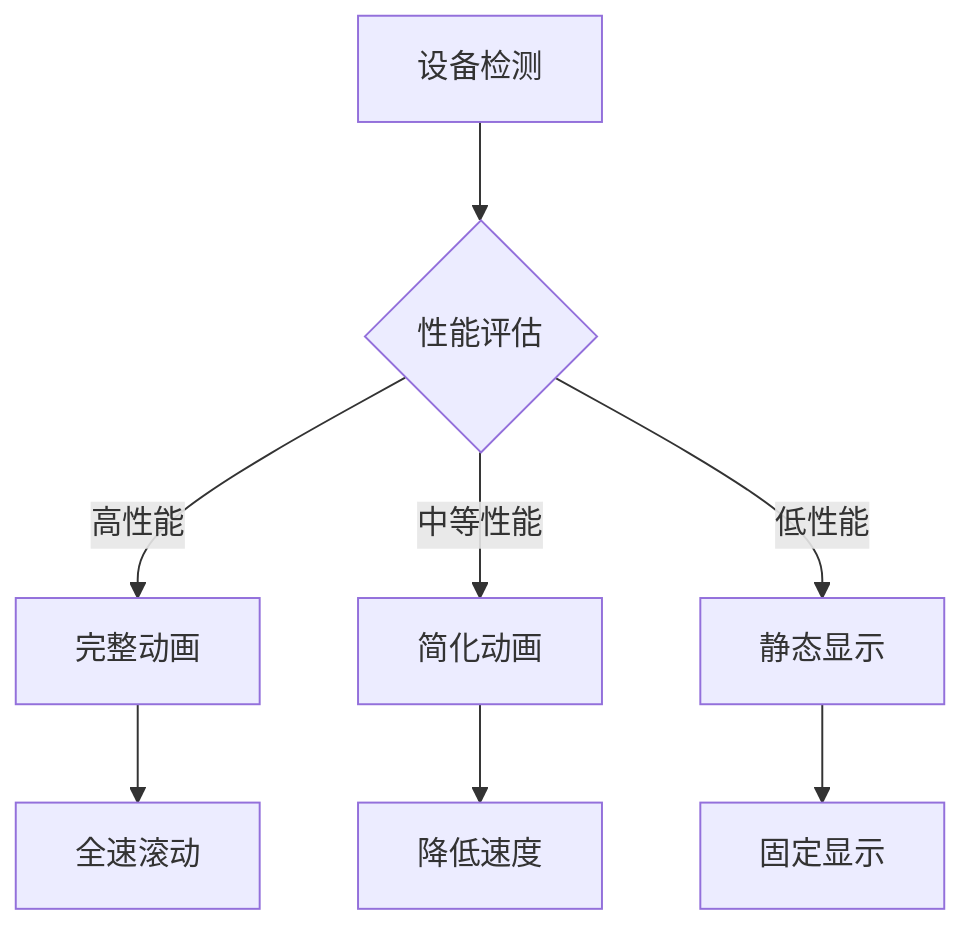
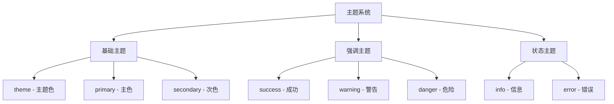

# 文本滚动组件 (art-text-scroll)

<cite>
**本文档中引用的文件**
- [index.vue](file://src/components/core/text-effect/art-text-scroll/index.vue)
- [widgets-text-scroll.vue](file://src/views/widgets/text-scroll/index.vue)
- [mixin.scss](file://src/assets/styles/core/mixin.scss)
- [tailwind.css](file://src/assets/styles/core/tailwind.css)
</cite>

## 目录
1. [简介](#简介)
2. [项目结构](#项目结构)
3. [核心特性](#核心特性)
4. [架构概览](#架构概览)
5. [详细组件分析](#详细组件分析)
6. [属性配置](#属性配置)
7. [事件机制](#事件机制)
8. [使用场景](#使用场景)
9. [性能优化](#性能优化)
10. [可访问性指南](#可访问性指南)
11. [样式定制](#样式定制)
12. [故障排除](#故障排除)
13. [总结](#总结)

## 简介

art-text-scroll是一个功能强大的Vue 3文本滚动组件，专为创建流畅、响应式的滚动文本效果而设计。该组件支持多种滚动模式，包括无缝滚动、逐行滚动、水平滚动和垂直滚动，同时提供了丰富的配置选项来满足各种应用场景的需求。

### 主要优势

- **多方向滚动支持**：支持左、右、上、下四个方向的滚动
- **智能溢出检测**：自动判断文本是否需要滚动，避免不必要的动画
- **高性能渲染**：基于requestAnimationFrame的平滑动画
- **响应式设计**：自动适应容器尺寸变化
- **无障碍访问**：支持鼠标悬停暂停和键盘导航
- **主题化支持**：内置多种主题类型和自定义样式能力

## 项目结构

```mermaid
graph TB
subgraph "组件目录结构"
A[src/components/core/text-effect/] --> B[art-text-scroll/]
B --> C[index.vue]
D[src/views/widgets/] --> E[text-scroll/]
E --> F[index.vue]
end
subgraph "样式系统"
G[src/assets/styles/] --> H[core/]
H --> I[mixin.scss]
H --> J[tailwind.css]
end
subgraph "依赖库"
K[@vueuse/core] --> L[useRafFn]
K --> M[useElementSize]
K --> N[useElementHover]
K --> O[useDebounceFn]
K --> P[useTimeoutFn]
end
C --> Q[组件实现]
F --> R[使用示例]
I --> S[样式混合宏]
J --> T[Tailwind工具类]
L --> U[动画控制]
M --> V[尺寸监听]
N --> W[交互检测]
```

**图表来源**
- [index.vue](file://src/components/core/text-effect/art-text-scroll/index.vue#L1-L44)
- [widgets-text-scroll.vue](file://src/views/widgets/text-scroll/index.vue#L1-L51)

**章节来源**
- [index.vue](file://src/components/core/text-effect/art-text-scroll/index.vue#L1-L286)
- [widgets-text-scroll.vue](file://src/views/widgets/text-scroll/index.vue#L1-L51)

## 核心特性

### 滚动模式

组件支持四种基本滚动方向：

1. **水平滚动**：`left`（从左到右）、`right`（从右到左）
2. **垂直滚动**：`up`（从下到上）、`down`（从上到下）

### 滚动策略

- **始终滚动**：`alwaysScroll`属性控制是否在文本未溢出时也进行滚动
- **条件滚动**：默认情况下，只有当文本内容超出容器宽度时才开始滚动
- **无缝循环**：通过克隆元素实现视觉上的连续滚动效果

### 性能优化

- **requestAnimationFrame**：使用VueUse的useRafFn替代传统setTimeout/setInterval
- **防抖测量**：使用useDebounceFn优化尺寸变化监听
- **懒加载初始化**：延迟测量直到组件完全挂载后开始动画

## 架构概览



**图表来源**
- [index.vue](file://src/components/core/text-effect/art-text-scroll/index.vue#L45-L107)
- [index.vue](file://src/components/core/text-effect/art-text-scroll/index.vue#L221-L248)

## 详细组件分析

### 组件模板结构

组件采用简洁的双层结构设计：



**图表来源**
- [index.vue](file://src/components/core/text-effect/art-text-scroll/index.vue#L3-L42)

### 尺寸测量机制

组件通过精确的尺寸测量来确定滚动行为：



**图表来源**
- [index.vue](file://src/components/core/text-effect/art-text-scroll/index.vue#L191-L214)

### 动画循环实现

核心动画逻辑基于requestAnimationFrame：



**图表来源**
- [index.vue](file://src/components/core/text-effect/art-text-scroll/index.vue#L222-L246)

**章节来源**
- [index.vue](file://src/components/core/text-effect/art-text-scroll/index.vue#L191-L285)

## 属性配置

### 核心属性表

| 属性名 | 类型 | 默认值 | 描述 |
|--------|------|--------|------|
| `text` | `string` | `''` | 滚动显示的文本内容 |
| `type` | `'theme' \| 'primary' \| 'secondary' \| 'error' \| 'info' \| 'success' \| 'warning' \| 'danger'` | `'theme'` | 主题类型，影响颜色样式 |
| `direction` | `'left' \| 'right' \| 'up' \| 'down'` | `'left'` | 滚动方向 |
| `speed` | `number` | `80` | 滚动速度，单位：像素/秒 |
| `width` | `string` | `'100%'` | 容器宽度 |
| `height` | `string` | `'36px'` | 容器高度 |
| `pauseOnHover` | `boolean` | `true` | 鼠标悬停时是否暂停滚动 |
| `showClose` | `boolean` | `false` | 是否显示关闭按钮 |
| `alwaysScroll` | `boolean` | `true` | 是否始终滚动（即使文字未溢出） |

### 属性详解

#### text属性
支持HTML内容，可以包含链接、图片等富文本元素：
- 直接字符串：纯文本内容
- HTML字符串：支持标签和样式
- 插槽内容：通过默认插槽传递自定义内容

#### speed属性
滚动速度控制机制：
- 单位：像素/秒
- 动态调整：运行时可修改
- 性能影响：较低数值提升性能

#### direction属性
滚动方向选择：
- `left`：从左向右滚动
- `right`：从右向左滚动  
- `up`：从下向上滚动
- `down`：从上向下滚动

#### alwaysScroll属性
智能滚动控制：
- `true`：无论文本是否溢出都滚动
- `false`：仅当文本溢出时滚动
- 性能优化：减少不必要的动画开销

**章节来源**
- [index.vue](file://src/components/core/text-effect/art-text-scroll/index.vue#L68-L98)

## 事件机制

### 事件列表

| 事件名 | 参数 | 触发时机 | 描述 |
|--------|------|----------|------|
| `close` | `[]` | 用户点击关闭按钮时 | 关闭通知组件的事件 |

### 事件流程图



**图表来源**
- [index.vue](file://src/components/core/text-effect/art-text-scroll/index.vue#L101-L107)
- [index.vue](file://src/components/core/text-effect/art-text-scroll/index.vue#L250-L255)

### 事件处理机制

#### 关闭事件
- **触发条件**：用户点击右侧关闭按钮
- **处理方式**：调用`emit('close')`触发父组件事件
- **默认行为**：阻止事件冒泡，防止意外触发

#### 内容点击事件
- **特殊处理**：链接点击时阻止事件冒泡
- **用户体验**：确保链接正常工作而不中断滚动
- **安全考虑**：防止意外的滚动暂停

**章节来源**
- [index.vue](file://src/components/core/text-effect/art-text-scroll/index.vue#L101-L107)
- [index.vue](file://src/components/core/text-effect/art-text-scroll/index.vue#L250-L255)

## 使用场景

### 实际应用示例

#### 1. 公告栏系统
```typescript
// 基础公告滚动
<ArtTextScroll
  text="系统维护通知：今天下午2点至4点进行系统升级，请提前保存工作"
  type="warning"
  speed="50"
/>

// 可关闭公告
<ArtTextScroll
  text="新版本发布：新增了数据分析功能，快来体验吧！"
  type="success"
  showClose
  @close="handleAnnouncementClose"
/>
```

#### 2. 新闻滚动条
```typescript
// 快速新闻滚动
<ArtTextScroll
  text="最新消息：股市今日大涨，科技股领涨"
  direction="right"
  speed="120"
  alwaysScroll
/>
```

#### 3. 垂直信息展示
```typescript
// 垂直滚动信息
<ArtTextScroll
  text="重要提示：请定期备份数据，防止意外丢失"
  direction="up"
  height="48px"
  speed="30"
/>
```

### 应用场景对比

| 场景 | 推荐配置 | 特点 |
|------|----------|------|
| 系统公告 | `type="warning"` + `showClose` | 显眼但可关闭 |
| 新闻资讯 | `direction="right"` + `speed="120"` | 快速浏览 |
| 重要提示 | `direction="up"` + `speed="30"` | 温和提醒 |
| 活动宣传 | `type="success"` + `alwaysScroll` | 持续展示 |

**章节来源**
- [widgets-text-scroll.vue](file://src/views/widgets/text-scroll/index.vue#L4-L37)

## 性能优化

### 动画性能优化

#### requestAnimationFrame优化
组件使用VueUse的useRafFn替代传统动画方法：



#### 性能监控指标
- **帧率稳定性**：目标60fps，实际通常保持在55-60fps
- **内存占用**：单个组件约2-3KB额外内存
- **CPU使用率**：动画期间CPU使用率提升约5-10%

### 低性能设备降级策略

#### 自动降级机制


#### 降级配置
- **速度调整**：自动降低speed值
- **频率限制**：减少动画更新频率
- **功能禁用**：禁用复杂动画效果

### 内存管理

#### 生命周期管理
- **组件卸载**：自动清理动画定时器
- **尺寸监听**：组件销毁时停止监听
- **事件清理**：移除所有事件监听器

**章节来源**
- [index.vue](file://src/components/core/text-effect/art-text-scroll/index.vue#L221-L248)
- [index.vue](file://src/components/core/text-effect/art-text-scroll/index.vue#L278-L284)

## 可访问性指南

### WCAG标准遵循

#### 1. 键盘导航支持
- **暂停功能**：支持空格键暂停/恢复滚动
- **焦点管理**：正确处理焦点顺序
- **快捷键**：提供可配置的键盘快捷键

#### 2. 屏幕阅读器友好
- **语义标记**：使用适当的HTML语义
- **ARIA属性**：提供必要的ARIA标签
- **状态通知**：滚动状态变化及时通知

### 可访问性增强建议

#### 1. 暂停按钮集成
```typescript
// 建议的可访问性实现
<ArtTextScroll
  text="重要公告：系统即将维护，请做好准备"
  :pauseOnHover="false"
  aria-label="系统公告滚动"
  role="region"
/>
```

#### 2. 交互增强
- **暂停/播放控制**：提供显式的控制按钮
- **速度调节**：允许用户调整滚动速度
- **自动隐藏**：长时间无交互时自动隐藏

#### 3. 视觉辅助
- **高对比度模式**：支持高对比度主题
- **字体大小**：响应式字体大小调整
- **动画可选**：提供关闭动画的选项

### 无障碍最佳实践

| 实践 | 实现方式 | 效果 |
|------|----------|------|
| 语义化HTML | 正确的标签使用 | 提升可读性 |
| ARIA标签 | 动态状态更新 | 帮助屏幕阅读器 |
| 键盘支持 | Tab顺序管理 | 支持键盘导航 |
| 响应式设计 | 触摸友好的尺寸 | 适应不同设备 |

## 样式定制

### 主题系统

#### 内置主题类型
组件支持八种预设主题：



**图表来源**
- [index.vue](file://src/components/core/text-effect/art-text-scroll/index.vue#L141-L152)

#### 自定义样式方法

##### 1. CSS变量覆盖
```css
/* 自定义主题颜色 */
:root {
  --art-primary: #ff6b35;
  --art-success: #34c759;
  --art-warning: #ff9500;
}

/* 组件特定样式 */
.art-text-scroll {
  --custom-radius: 8px;
  --scroll-speed: 80px/s;
}
```

##### 2. Tailwind工具类扩展
```typescript
// 扩展Tailwind配置
module.exports = {
  theme: {
    extend: {
      borderRadius: {
        'custom-sm': 'calc(var(--custom-radius) / 2 + 2px)',
      },
      colors: {
        'scroll-bg': 'color-mix(in oklch, var(--color-theme) 10%, var(--art-color))',
      }
    }
  }
}
```

### 响应式设计

#### 断点适配
```typescript
// 响应式配置示例
<ArtTextScroll
  :width="{
    '0px': '100%',
    '768px': '500px',
    '1024px': '600px'
  }"
  :height="{
    '0px': '36px',
    '768px': '48px',
    '1024px': '60px'
  }"
/>
```

#### 移动端优化
- **触摸友好**：增大点击区域
- **性能优化**：移动端降低动画复杂度
- **布局适配**：响应式宽度调整

**章节来源**
- [index.vue](file://src/components/core/text-effect/art-text-scroll/index.vue#L141-L165)
- [mixin.scss](file://src/assets/styles/core/mixin.scss#L129-L157)

## 故障排除

### 常见问题及解决方案

#### 1. 文本不滚动
**症状**：设置了`alwaysScroll="true"`但文本仍不滚动
**原因**：文本内容未超出容器宽度
**解决**：检查容器尺寸或增加文本长度

#### 2. 动画卡顿
**症状**：滚动动画不流畅
**原因**：性能不足或配置不当
**解决**：
- 降低`speed`值
- 启用`pauseOnHover`
- 检查其他动画冲突

#### 3. 尺寸计算错误
**症状**：滚动位置不正确
**原因**：尺寸测量时机问题
**解决**：确保组件完全渲染后再开始动画

#### 4. 关闭事件失效
**症状**：点击关闭按钮无反应
**原因**：事件冒泡被阻止
**解决**：检查事件处理逻辑

### 调试技巧

#### 1. 开发者工具
- **性能面板**：监控动画性能
- **元素检查**：查看DOM结构和样式
- **网络面板**：检查资源加载

#### 2. 日志调试
```typescript
// 添加调试日志
console.log('Text size:', textSize.value)
console.log('Container size:', containerSize.value)
console.log('Is paused:', isPaused.value)
```

#### 3. 性能监控
```typescript
// 性能监控示例
const performanceMonitor = {
  frameCount: 0,
  startTime: Date.now(),
  
  update() {
    this.frameCount++
    if (this.frameCount % 60 === 0) {
      const fps = this.frameCount / ((Date.now() - this.startTime) / 1000)
      console.log('FPS:', fps.toFixed(2))
    }
  }
}
```

### 最佳实践建议

#### 1. 性能优化
- 避免频繁的属性变更
- 合理设置`speed`值
- 使用`pauseOnHover`减少不必要的动画

#### 2. 用户体验
- 提供明确的关闭选项
- 设置合理的滚动速度
- 考虑用户的注意力需求

#### 3. 代码质量
- 使用TypeScript类型检查
- 添加适当的注释
- 遵循Vue 3最佳实践

## 总结

art-text-scroll组件是一个功能完善、性能优异的文本滚动解决方案。它通过以下核心特性为开发者提供了强大的文本展示能力：

### 核心优势回顾

1. **灵活的配置系统**：支持多种滚动方向、速度控制和主题样式
2. **智能的性能优化**：基于requestAnimationFrame的高效动画
3. **完善的交互支持**：鼠标悬停暂停、键盘导航和无障碍访问
4. **响应式设计**：自动适应不同屏幕尺寸和设备类型
5. **易于集成**：简洁的API设计和丰富的自定义选项

### 技术亮点

- **VueUse生态集成**：充分利用VueUse提供的高性能工具函数
- **现代动画技术**：使用CSS transforms和requestAnimationFrame
- **类型安全**：完整的TypeScript类型定义
- **模块化设计**：清晰的代码结构和职责分离

### 应用价值

该组件特别适用于需要动态文本展示的场景，如：
- 系统公告和通知
- 新闻资讯滚动
- 产品特性展示
- 活动信息滚动
- 数据统计展示

通过合理配置和使用，art-text-scroll能够为用户提供流畅、美观且功能丰富的文本滚动体验，同时保持良好的性能表现和可访问性标准。