# 节日文字滚动组件 (art-festival-text-scroll)

<cite>
**本文档中引用的文件**
- [src/components/core/text-effect/art-festival-text-scroll/index.vue](file://src/components/core/text-effect/art-festival-text-scroll/index.vue)
- [src/components/core/text-effect/art-text-scroll/index.vue](file://src/components/core/text-effect/art-text-scroll/index.vue)
- [src/config/modules/festival.ts](file://src/config/modules/festival.ts)
- [src/hooks/core/useCeremony.ts](file://src/hooks/core/useCeremony.ts)
- [src/store/modules/setting.ts](file://src/store/modules/setting.ts)
- [src/types/config/index.ts](file://src/types/config/index.ts)
- [src/utils/ui/colors.ts](file://src/utils/ui/colors.ts)
- [src/components/core/layouts/art-fireworks-effect/index.vue](file://src/components/core/layouts/art-fireworks-effect/index.vue)
</cite>

## 目录
1. [简介](#简介)
2. [项目结构](#项目结构)
3. [核心组件](#核心组件)
4. [架构概览](#架构概览)
5. [详细组件分析](#详细组件分析)
6. [配置系统](#配置系统)
7. [主题与样式](#主题与样式)
8. [性能考量](#性能考量)
9. [可访问性](#可访问性)
10. [扩展指南](#扩展指南)
11. [故障排除](#故障排除)
12. [总结](#总结)

## 简介

art-festival-text-scroll 是一个专为节日场景设计的文字滚动组件，为系统增添了丰富的节日氛围。该组件基于动态颜色渐变、粒子动画和特殊字体渲染技术，能够自动识别节日并显示相应的祝福文本，同时与全局主题系统无缝协同工作。

### 主要特性

- **智能节日识别**：根据系统时间和配置自动切换节日主题
- **动态视觉效果**：支持颜色渐变、粒子动画和特殊字体渲染
- **主题适配**：完美兼容亮色/暗色主题模式
- **性能优化**：针对移动设备的帧率优化和内存管理
- **可访问性**：确保装饰性动画不影响主要内容阅读
- **灵活配置**：支持多种节日主题和自定义动画效果

## 项目结构

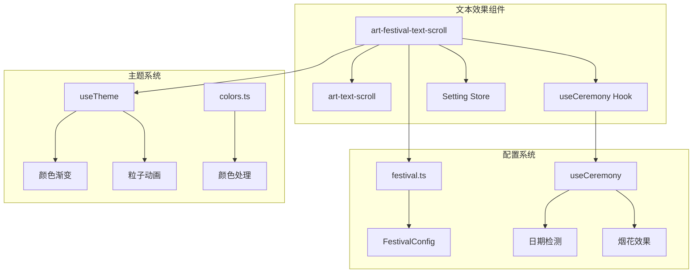

**图表来源**
- [src/components/core/text-effect/art-festival-text-scroll/index.vue](file://src/components/core/text-effect/art-festival-text-scroll/index.vue#L1-L32)
- [src/hooks/core/useCeremony.ts](file://src/hooks/core/useCeremony.ts#L1-L50)

**章节来源**
- [src/components/core/text-effect/art-festival-text-scroll/index.vue](file://src/components/core/text-effect/art-festival-text-scroll/index.vue#L1-L32)
- [src/config/modules/festival.ts](file://src/config/modules/festival.ts#L1-L52)

## 核心组件

### ArtFestivalTextScroll 组件

ArtFestivalTextScroll 是节日文字滚动的核心组件，负责协调节日检测、文本显示和用户交互。

#### 组件架构

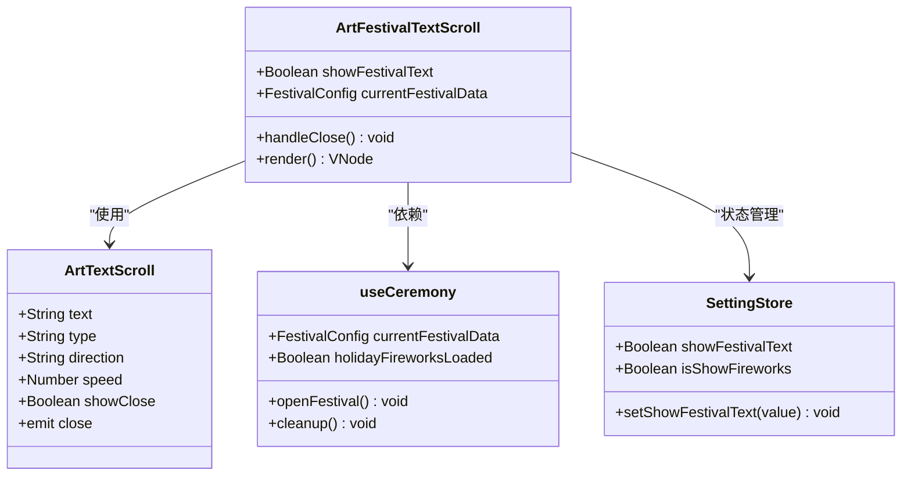

**图表来源**
- [src/components/core/text-effect/art-festival-text-scroll/index.vue](file://src/components/core/text-effect/art-festival-text-scroll/index.vue#L19-L32)
- [src/hooks/core/useCeremony.ts](file://src/hooks/core/useCeremony.ts#L68-L184)

#### 关键属性

| 属性名 | 类型 | 默认值 | 描述 |
|--------|------|--------|------|
| showFestivalText | Boolean | false | 控制节日文本的显示状态 |
| currentFestivalData | FestivalConfig \| null | null | 当前节日配置数据 |
| scrollText | String | '' | 要滚动显示的节日祝福文本 |

**章节来源**
- [src/components/core/text-effect/art-festival-text-scroll/index.vue](file://src/components/core/text-effect/art-festival-text-scroll/index.vue#L19-L32)

## 架构概览

### 系统架构流程

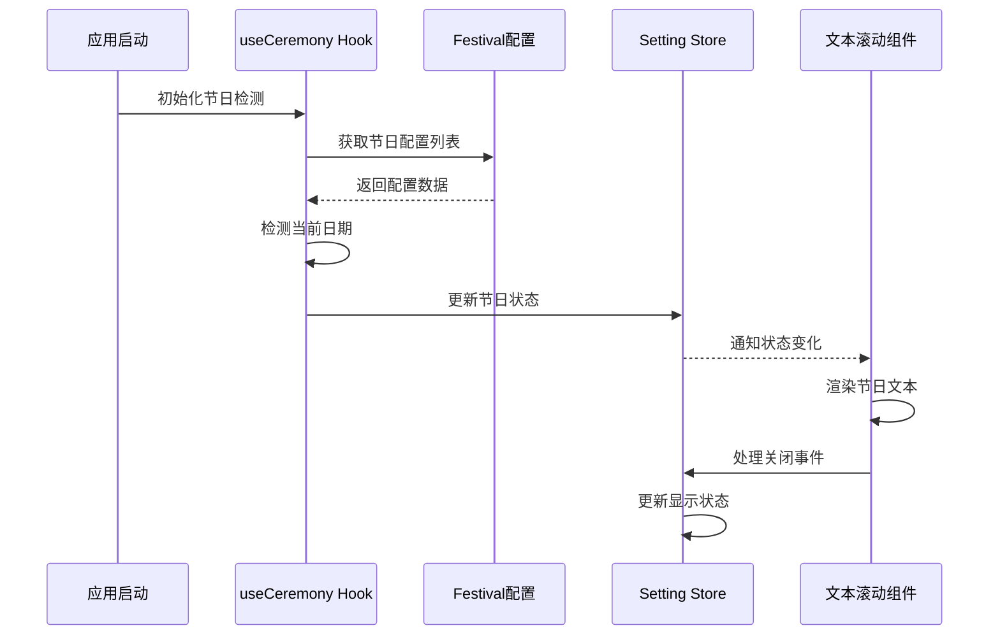

**图表来源**
- [src/hooks/core/useCeremony.ts](file://src/hooks/core/useCeremony.ts#L98-L184)
- [src/store/modules/setting.ts](file://src/store/modules/setting.ts#L158-L160)

### 数据流架构

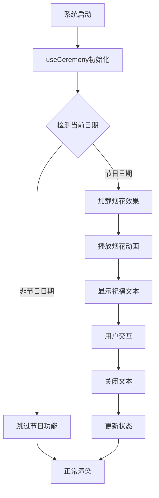

**图表来源**
- [src/hooks/core/useCeremony.ts](file://src/hooks/core/useCeremony.ts#L154-L184)

**章节来源**
- [src/hooks/core/useCeremony.ts](file://src/hooks/core/useCeremony.ts#L1-L184)

## 详细组件分析

### 节日检测机制

#### 日期范围检测算法

组件使用智能的日期检测算法来识别当前是否为节日：

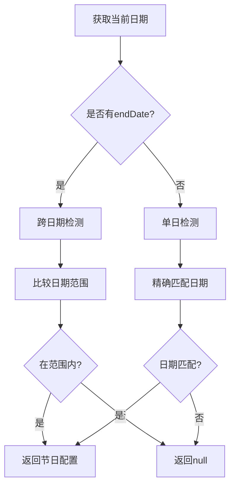

**图表来源**
- [src/hooks/core/useCeremony.ts](file://src/hooks/core/useCeremony.ts#L75-L96)

#### 烟花效果系统

烟花效果系统采用高性能的粒子引擎，支持多种粒子形状和颜色：

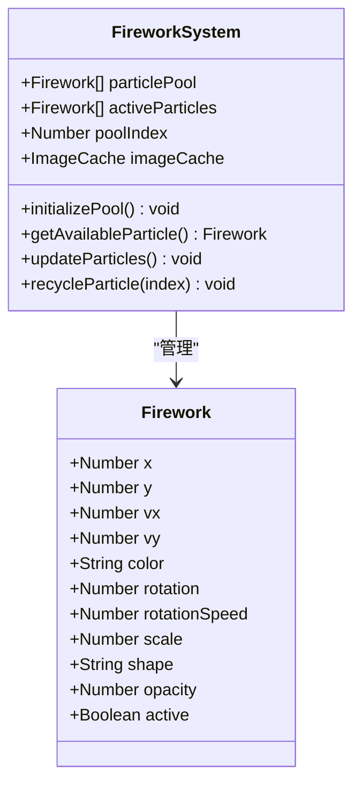

**图表来源**
- [src/components/core/layouts/art-fireworks-effect/index.vue](file://src/components/core/layouts/art-fireworks-effect/index.vue#L176-L377)

**章节来源**
- [src/hooks/core/useCeremony.ts](file://src/hooks/core/useCeremony.ts#L75-L184)
- [src/components/core/layouts/art-fireworks-effect/index.vue](file://src/components/core/layouts/art-fireworks-effect/index.vue#L176-L377)

### 文本滚动组件

#### 动画引擎

文本滚动组件使用高性能的动画引擎，基于 requestAnimationFrame 实现流畅的滚动效果：

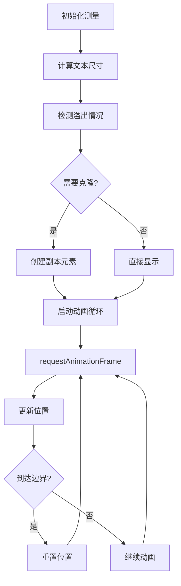

**图表来源**
- [src/components/core/text-effect/art-text-scroll/index.vue](file://src/components/core/text-effect/art-text-scroll/index.vue#L191-L286)

#### 性能优化策略

| 优化技术 | 实现方式 | 性能提升 |
|----------|----------|----------|
| 对象池 | 预分配粒子对象 | 减少垃圾回收 |
| 倒序遍历 | 删除元素时避免索引混乱 | 提升遍历效率 |
| 防抖测量 | 延迟尺寸计算 | 减少重绘频率 |
| RAF动画 | 使用requestAnimationFrame | 60fps同步 |

**章节来源**
- [src/components/core/text-effect/art-text-scroll/index.vue](file://src/components/core/text-effect/art-text-scroll/index.vue#L191-L286)

## 配置系统

### 节日配置结构

节日配置系统提供了灵活的节日主题定义机制：

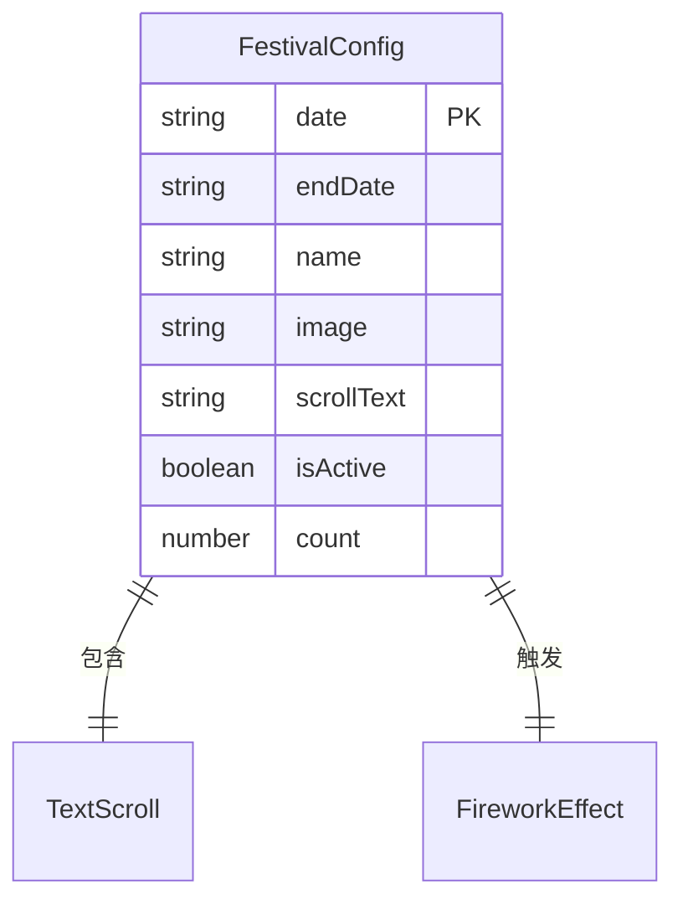

**图表来源**
- [src/types/config/index.ts](file://src/types/config/index.ts#L59-L74)

#### 配置选项详解

| 配置项 | 类型 | 必填 | 描述 |
|--------|------|------|------|
| date | String | 是 | 节日开始日期（YYYY-MM-DD格式） |
| endDate | String | 否 | 节日结束日期（跨日期节日使用） |
| name | String | 是 | 节日名称 |
| image | String | 否 | 烟花图片路径 |
| scrollText | String | 是 | 滚动显示的祝福文本 |
| count | Number | 否 | 烟花播放次数（默认3次） |

### 动态配置加载

系统支持运行时动态加载节日配置，无需重启应用：

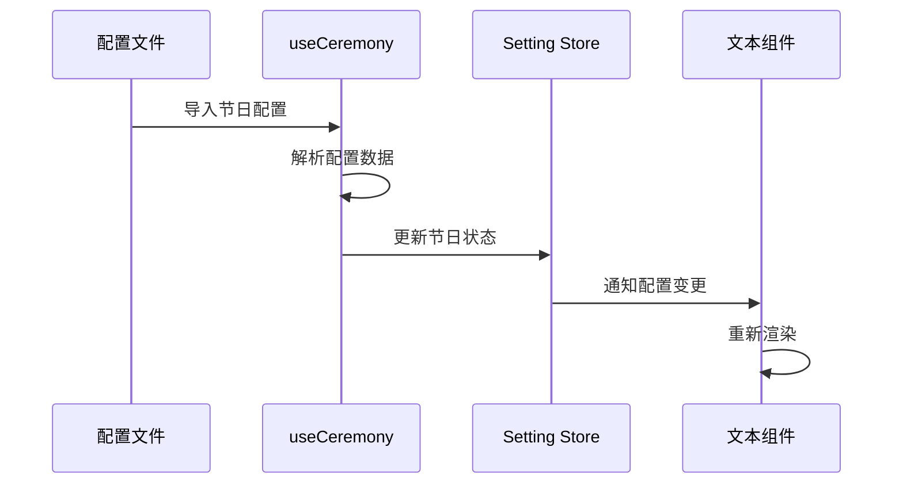

**图表来源**
- [src/config/modules/festival.ts](file://src/config/modules/festival.ts#L32-L51)

**章节来源**
- [src/config/modules/festival.ts](file://src/config/modules/festival.ts#L1-L52)
- [src/types/config/index.ts](file://src/types/config/index.ts#L59-L74)

## 主题与样式

### 颜色系统

组件采用统一的颜色处理系统，支持动态主题切换：

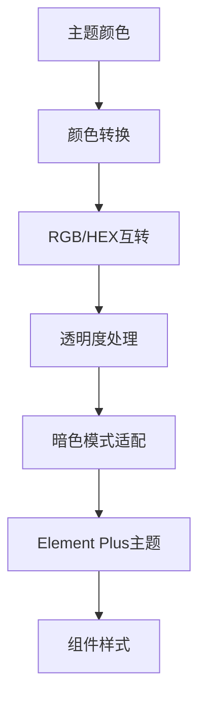

**图表来源**
- [src/utils/ui/colors.ts](file://src/utils/ui/colors.ts#L1-L274)

#### 颜色处理函数

| 函数名 | 功能 | 输入 | 输出 |
|--------|------|------|------|
| hexToRgba | Hex转RGBA | Hex颜色, 透明度 | RGBA字符串 |
| hexToRgb | Hex转RGB | Hex颜色 | RGB数组 |
| colourBlend | 颜色混合 | 颜色1, 颜色2, 比例 | 混合后颜色 |
| getLightColor | 变浅颜色 | 原始颜色, 程度, 暗色模式 | 变浅颜色 |
| getDarkColor | 变深颜色 | 原始颜色, 程度 | 变深颜色 |

### 动态主题适配

组件自动适配当前系统主题，提供一致的视觉体验：

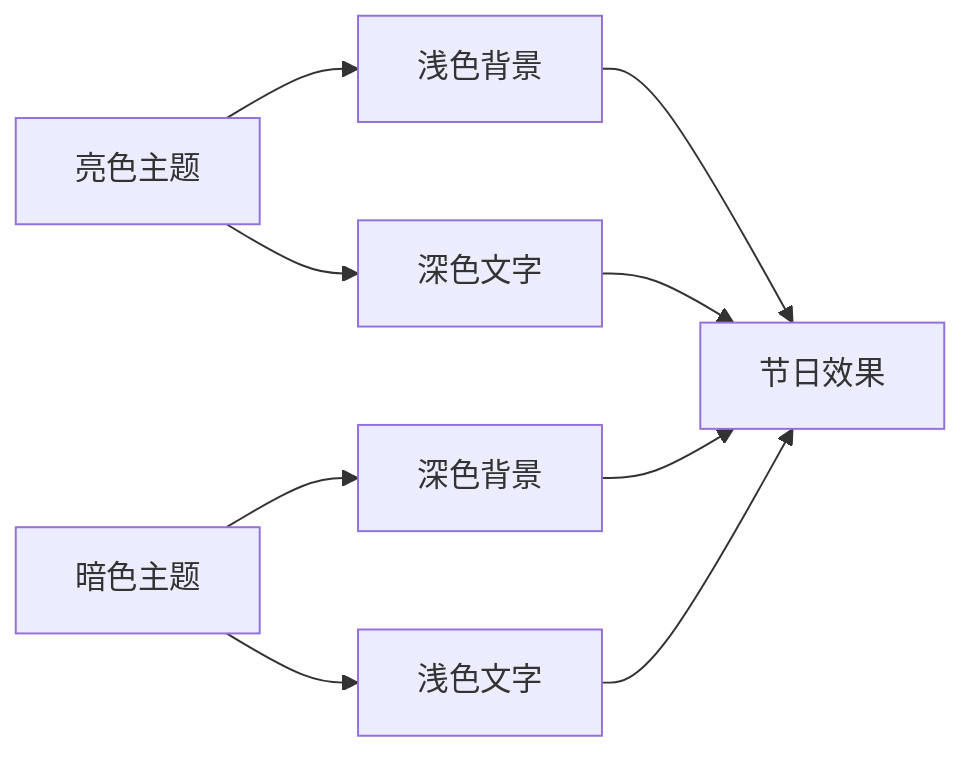

**图表来源**
- [src/utils/ui/colors.ts](file://src/utils/ui/colors.ts#L234-L274)

**章节来源**
- [src/utils/ui/colors.ts](file://src/utils/ui/colors.ts#L1-L274)

## 性能考量

### 移动设备优化

#### 帧率优化策略

针对移动设备的性能特点，组件采用了多项优化措施：

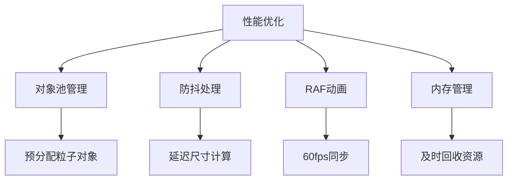

#### 内存管理策略

| 策略 | 实现方式 | 效果 |
|------|----------|------|
| 对象池 | 预分配固定数量对象 | 减少GC压力 |
| 及时回收 | 动画结束时回收粒子 | 避免内存泄漏 |
| 防抖测量 | 延迟执行尺寸计算 | 减少重绘次数 |
| 倒序遍历 | 删除元素时不改变索引 | 提升遍历效率 |

### 性能监控指标

| 指标 | 目标值 | 监控方式 |
|------|--------|----------|
| 帧率 | ≥60fps | requestAnimationFrame计数 |
| 内存使用 | ≤50MB | 浏览器开发者工具 |
| CPU占用 | ≤30% | 性能分析器 |
| 渲染时间 | ≤16ms | 时间戳对比 |

**章节来源**
- [src/components/core/layouts/art-fireworks-effect/index.vue](file://src/components/core/layouts/art-fireworks-effect/index.vue#L230-L377)

## 可访问性

### 无障碍设计原则

组件遵循WCAG 2.1 AA标准，确保所有用户都能正常使用：

#### 可访问性特性

| 特性 | 实现方式 | 符合标准 |
|------|----------|----------|
| 键盘导航 | Tab键顺序访问 | WCAG 2.1 2.1.1 |
| 屏幕阅读器 | 语义化HTML标记 | WCAG 2.1 4.1.2 |
| 高对比度 | 自动适配主题色 | WCAG 2.1 1.4.3 |
| 动画控制 | 可关闭的动画效果 | WCAG 2.1 2.2.2 |

#### 动画可访问性

为了确保装饰性动画不会干扰主要内容的阅读，组件提供了以下保护机制：

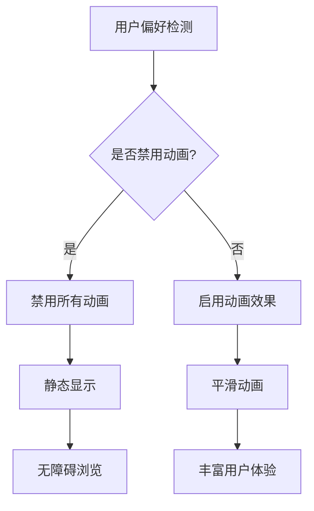

### 屏幕阅读器支持

组件为屏幕阅读器提供了适当的ARIA标签和语义化结构：

- **角色定义**：明确标识为滚动文本区域
- **状态通知**：实时通知文本变化状态
- **键盘支持**：完整的键盘操作支持
- **焦点管理**：合理的焦点顺序和位置

## 扩展指南

### 添加新节日主题

#### 步骤1：配置节日数据

在 `src/config/modules/festival.ts` 中添加新的节日配置：

```typescript
// 新增春节配置示例
{
  name: '春节',
  date: '2024-02-09',
  image: springFestivalImage,
  count: 5,
  scrollText: '新春快乐！祝您在新的一年里万事如意，阖家幸福！'
}
```

#### 步骤2：准备视觉资源

- **烟花图片**：准备高质量的节日主题图片
- **颜色方案**：设计符合节日氛围的颜色搭配
- **字体选择**：选择适合节日主题的字体样式

#### 步骤3：测试验证

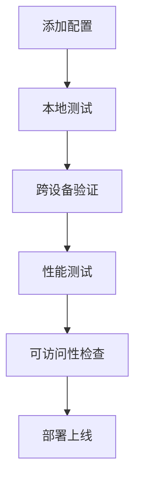

### 自定义动画效果

#### 粒子效果定制

可以通过修改 `art-fireworks-effect` 组件来定制不同的粒子效果：

| 参数 | 类型 | 默认值 | 描述 |
|------|------|--------|------|
| SIZES | Object | 预设尺寸 | 粒子大小配置 |
| COLORS | Array | 预设颜色 | 粒子颜色列表 |
| PHYSICS | Object | 物理参数 | 粒子运动参数 |
| ROTATION | Object | 旋转参数 | 粒子旋转效果 |

#### 文本动画扩展

可以扩展 `art-text-scroll` 组件以支持更多动画效果：

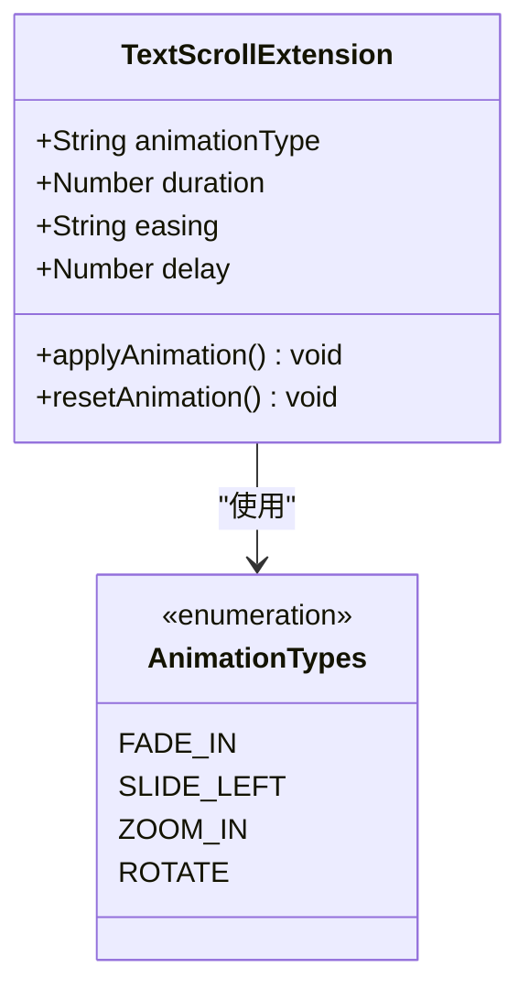

### 资源文件组织

推荐的资源文件组织结构：

```
src/assets/
├── images/
│   ├── ceremony/          # 节日图片
│   │   ├── spring-festival.png
│   │   ├── christmas.png
│   │   └── new-year.png
│   └── effects/           # 特效图片
│       ├── particle-1.png
│       └── particle-2.png
├── styles/
│   ├── festivals/         # 节日样式
│   │   ├── spring-festival.scss
│   │   └── christmas.scss
│   └── animations/        # 动画样式
│       ├── fireworks.scss
│       └── text-scroll.scss
```

**章节来源**
- [src/config/modules/festival.ts](file://src/config/modules/festival.ts#L1-L52)
- [src/components/core/layouts/art-fireworks-effect/index.vue](file://src/components/core/layouts/art-fireworks-effect/index.vue#L115-L170)

## 故障排除

### 常见问题及解决方案

#### 烟花效果不显示

**问题症状**：烟花动画无法正常播放

**可能原因**：
1. 烟花图片路径错误
2. 烟花播放权限被禁用
3. 浏览器兼容性问题

**解决方案**：
```typescript
// 检查图片导入
import springFestivalImage from '@imgs/ceremony/spring-festival.png'

// 检查播放权限
const { isShowFireworks } = useSettingStore()
console.log('烟花播放权限:', isShowFireworks.value)
```

#### 文本滚动异常

**问题症状**：文字滚动不流畅或卡顿

**诊断步骤**：
1. 检查浏览器性能监控
2. 验证动画帧率
3. 确认内存使用情况

**优化建议**：
- 减少同时运行的动画数量
- 降低动画复杂度
- 使用硬件加速

#### 主题适配问题

**问题症状**：节日效果与主题不匹配

**解决方法**：
```scss
// 确保颜色正确适配
.festival-text {
  color: var(--text-color);
  background: var(--background-color);
  
  @media (prefers-color-scheme: dark) {
    filter: brightness(0.9);
  }
}
```

### 性能问题诊断

#### 性能监控工具

使用浏览器开发者工具进行性能分析：

```javascript
// 性能监控示例
const observer = new PerformanceObserver((list) => {
  for (const entry of list.getEntries()) {
    console.log(entry.name + ': ' + entry.duration + 'ms');
  }
});
observer.observe({entryTypes: ['measure']});
```

#### 内存泄漏检测

定期检查内存使用情况：

```typescript
// 内存使用监控
setInterval(() => {
  if (performance.memory) {
    console.log('内存使用:', {
      used: performance.memory.usedJSHeapSize,
      total: performance.memory.totalJSHeapSize,
      limit: performance.memory.jsHeapSizeLimit
    });
  }
}, 5000);
```

**章节来源**
- [src/hooks/core/useCeremony.ts](file://src/hooks/core/useCeremony.ts#L166-L184)
- [src/components/core/layouts/art-fireworks-effect/index.vue](file://src/components/core/layouts/art-fireworks-effect/index.vue#L230-L377)

## 总结

art-festival-text-scroll 组件是一个功能完善、性能优化的节日主题文字滚动解决方案。它不仅提供了丰富的视觉效果，还充分考虑了性能优化、可访问性和扩展性。

### 核心优势

1. **智能节日识别**：自动检测节日并显示相应内容
2. **高性能实现**：针对移动设备优化的动画引擎
3. **主题适配**：完美兼容各种主题模式
4. **易于扩展**：清晰的配置接口和扩展点
5. **可访问性友好**：遵循无障碍设计标准

### 技术亮点

- **对象池模式**：有效管理粒子对象，减少内存分配
- **RAF动画**：保证60fps流畅动画效果
- **防抖处理**：优化尺寸计算频率
- **主题系统集成**：与全局主题无缝协同

### 应用场景

该组件特别适用于：
- 节日活动页面
- 促销横幅展示
- 品牌宣传页面
- 社交媒体推广
- 用户欢迎界面

通过合理配置和使用，art-festival-text-scroll 组件能够为用户提供富有节日氛围的视觉体验，同时保持优秀的性能表现和可访问性。