# Excel导入 (art-excel-import) 组件文档

<cite>
**本文档引用的文件**
- [index.vue](file://src/components/core/forms/art-excel-import/index.vue)
- [art-excel-export/index.vue](file://src/components/core/forms/art-excel-export/index.vue)
- [widgets/excel/index.vue](file://src/views/widgets/excel/index.vue)
- [package.json](file://package.json)
- [api.d.ts](file://src/types/api/api.d.ts)
- [validator.ts](file://src/utils/form/validator.ts)
- [error.ts](file://src/utils/http/error.ts)
</cite>

## 目录
1. [简介](#简介)
2. [项目结构](#项目结构)
3. [核心组件](#核心组件)
4. [架构概览](#架构概览)
5. [详细组件分析](#详细组件分析)
6. [Excel格式支持](#excel格式支持)
7. [数据映射与转换](#数据映射与转换)
8. [错误处理机制](#错误处理机制)
9. [性能优化策略](#性能优化策略)
10. [API对接示例](#api对接示例)
11. [故障排除指南](#故障排除指南)
12. [扩展开发指南](#扩展开发指南)
13. [总结](#总结)

## 简介

art-excel-import 是一个基于 Vue 3 和 Element Plus 的专业 Excel 文件导入组件，提供了完整的 Excel 文件解析、数据校验、错误处理和批量导入功能。该组件支持 `.xlsx` 和 `.xls` 格式的文件导入，具备强大的数据映射能力、灵活的格式转换机制和完善的错误处理体系。

### 主要特性

- **多格式支持**：完全支持 `.xlsx` 和 `.xls` Excel 文件格式
- **智能解析**：基于 xlsx 库的高性能文件解析引擎
- **数据映射**：灵活的字段映射和格式转换机制
- **错误处理**：完善的异常捕获和用户友好的错误提示
- **性能优化**：内存优化和异步处理支持
- **API集成**：与后端服务无缝对接的能力

## 项目结构

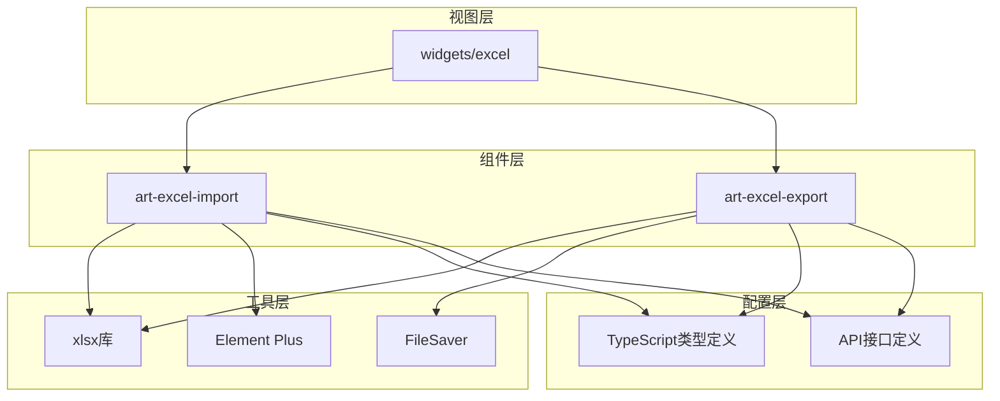

**图表来源**
- [index.vue](file://src/components/core/forms/art-excel-import/index.vue#L1-L63)
- [art-excel-export/index.vue](file://src/components/core/forms/art-excel-export/index.vue#L1-L390)

**章节来源**
- [index.vue](file://src/components/core/forms/art-excel-import/index.vue#L1-L63)
- [art-excel-export/index.vue](file://src/components/core/forms/art-excel-export/index.vue#L1-L390)

## 核心组件

### ArtExcelImport 组件

ArtExcelImport 是 Excel 导入的核心组件，提供了简洁而强大的文件导入功能。

#### 主要功能
- **文件选择**：基于 Element Plus Upload 组件的文件选择界面
- **格式验证**：自动验证文件格式和大小限制
- **异步解析**：使用 FileReader API 进行异步文件读取
- **事件驱动**：提供导入成功和失败的事件回调

#### 技术特点
- 基于 `xlsx` 库进行文件解析
- 使用 `FileReader` API 实现异步文件读取
- 支持 `.xlsx` 和 `.xls` 两种格式
- 内置错误处理和用户反馈机制

**章节来源**
- [index.vue](file://src/components/core/forms/art-excel-import/index.vue#L1-L63)

### ArtExcelExport 组件

ArtExcelExport 组件提供了完整的 Excel 导出功能，支持复杂的数据格式化和样式配置。

#### 核心特性
- **数据预处理**：智能的数据格式化和类型转换
- **列宽计算**：自动和手动列宽配置
- **进度跟踪**：详细的导出进度反馈
- **错误监控**：全面的错误捕获和报告机制

**章节来源**
- [art-excel-export/index.vue](file://src/components/core/forms/art-excel-export/index.vue#L1-L390)

## 架构概览

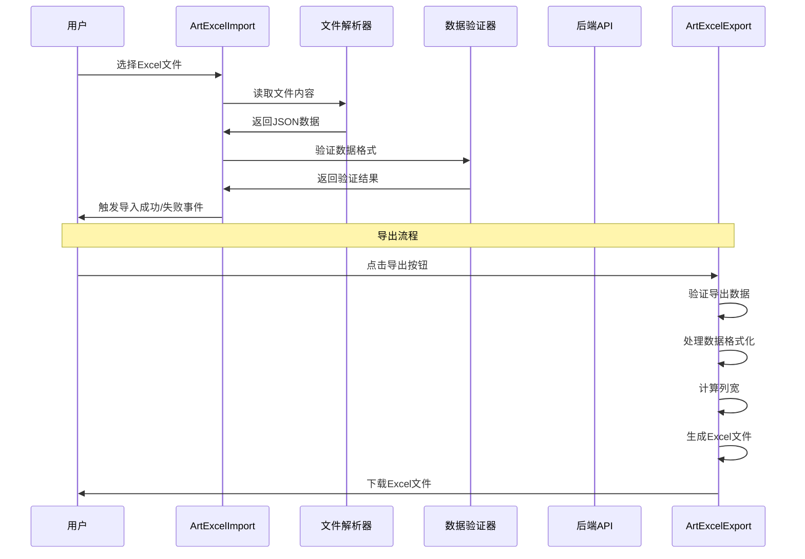

**图表来源**
- [index.vue](file://src/components/core/forms/art-excel-import/index.vue#L53-L61)
- [art-excel-export/index.vue](file://src/components/core/forms/art-excel-export/index.vue#L318-L366)

## 详细组件分析

### ArtExcelImport 组件深度分析

#### 文件解析流程

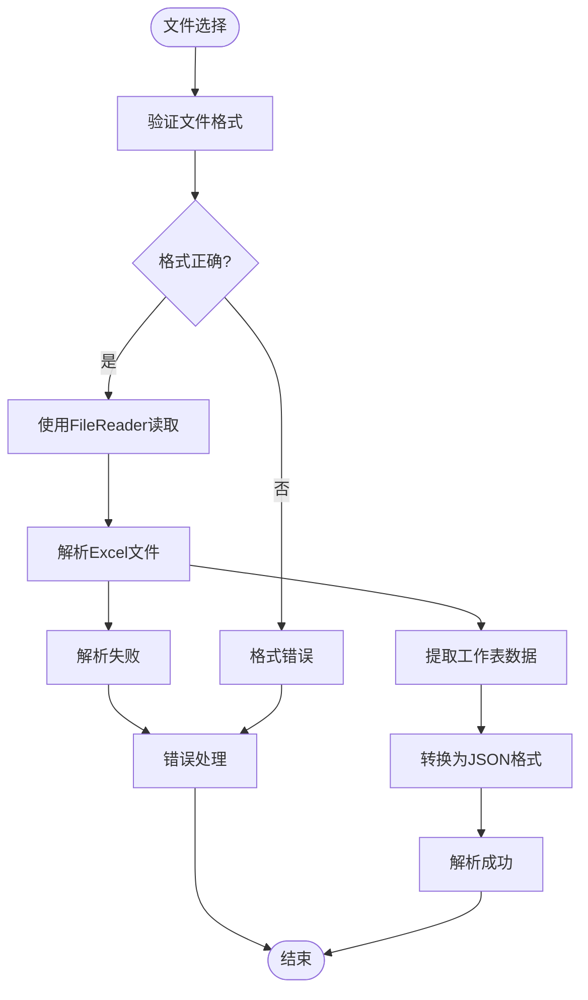

**图表来源**
- [index.vue](file://src/components/core/forms/art-excel-import/index.vue#L24-L43)

#### 核心解析逻辑

组件使用 `xlsx` 库的 `XLSX.read()` 方法进行文件解析，支持以下关键步骤：

1. **文件读取**：使用 `FileReader` API 将文件转换为 ArrayBuffer
2. **工作簿解析**：提取第一个工作表作为数据源
3. **数据转换**：使用 `XLSX.utils.sheet_to_json()` 转换为 JSON 格式
4. **类型安全**：返回类型为 `Array<Record<string, unknown>>`

#### 事件系统设计

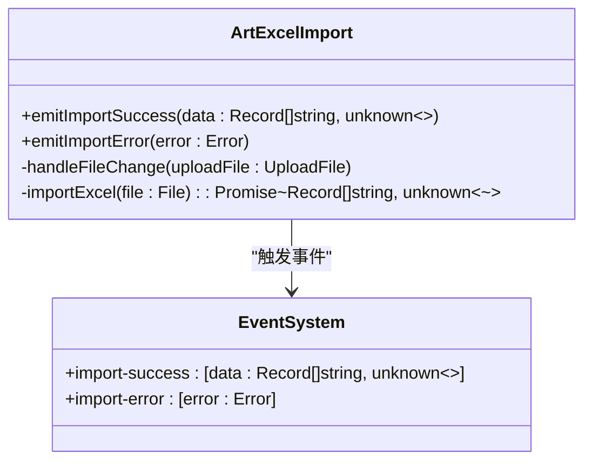

**图表来源**
- [index.vue](file://src/components/core/forms/art-excel-import/index.vue#L47-L50)

**章节来源**
- [index.vue](file://src/components/core/forms/art-excel-import/index.vue#L1-L63)

### ArtExcelExport 组件深度分析

#### 导出流程架构

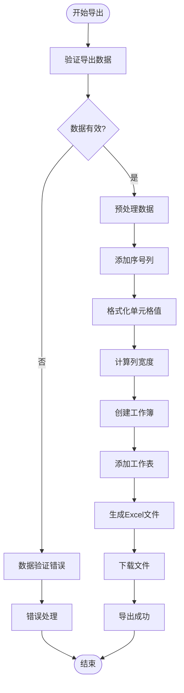

**图表来源**
- [art-excel-export/index.vue](file://src/components/core/forms/art-excel-export/index.vue#L240-L315)

#### 数据处理管道

组件实现了完整的数据处理管道，包括：

1. **数据验证**：检查数据类型和数量限制
2. **格式化处理**：将各种数据类型转换为字符串
3. **列配置应用**：应用自定义列标题和格式化函数
4. **列宽计算**：智能计算列宽度以适应内容

#### 错误处理机制

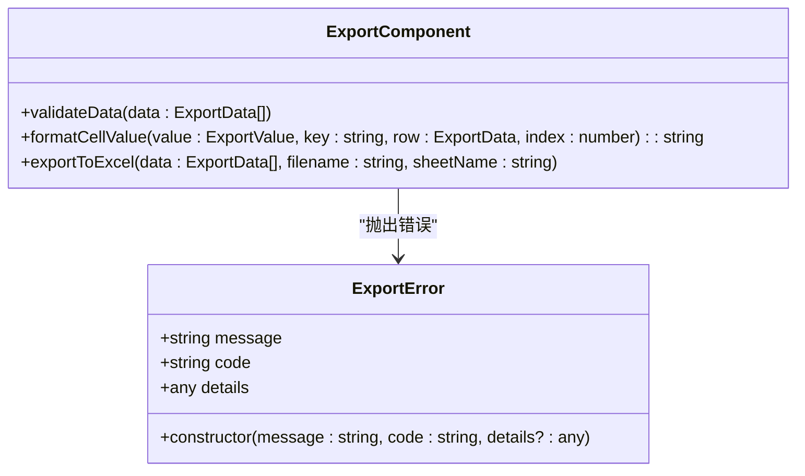

**图表来源**
- [art-excel-export/index.vue](file://src/components/core/forms/art-excel-export/index.vue#L119-L127)

**章节来源**
- [art-excel-export/index.vue](file://src/components/core/forms/art-excel-export/index.vue#L1-L390)

## Excel格式支持

### 支持的文件格式

| 格式 | 扩展名 | 版本支持 | 特性 |
|------|--------|----------|------|
| Excel 2007+ | `.xlsx` | 完全支持 | 压缩格式，支持大量数据 |
| Excel 97-2003 | `.xls` | 完全支持 | 传统格式，兼容性好 |

### 文件大小限制

虽然组件本身不限制文件大小，但实际使用中需要注意以下限制：

- **浏览器内存限制**：大型文件可能导致浏览器崩溃
- **网络传输限制**：建议单次导入不超过 10MB
- **服务器处理能力**：后端服务应设置合理的文件大小限制

### 内存优化策略

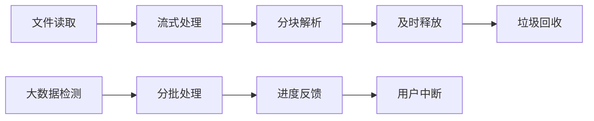

**图表来源**
- [art-excel-export/index.vue](file://src/components/core/forms/art-excel-export/index.vue#L216-L236)

**章节来源**
- [index.vue](file://src/components/core/forms/art-excel-import/index.vue#L6-L7)
- [art-excel-export/index.vue](file://src/components/core/forms/art-excel-export/index.vue#L95-L96)

## 数据映射与转换

### 字段映射机制

组件提供了灵活的字段映射配置，支持以下映射方式：

#### 基础映射配置

```typescript
// 表头映射配置
const headers = {
  name: '姓名',
  age: '年龄', 
  city: '城市'
}

// 列配置映射
const columnConfig = {
  name: {
    title: '姓名',
    width: 20,
    formatter: (value: unknown) => (value ? String(value) : '未知')
  },
  age: {
    title: '年龄',
    width: 10,
    formatter: (value: unknown) => (value ? `${value}岁` : '0岁')
  }
}
```

#### 数据类型转换

| 输入类型 | 输出格式 | 转换规则 |
|----------|----------|----------|
| `null/undefined` | 空字符串 | 直接转换为空字符串 |
| `Date` | 本地日期字符串 | 使用 `toLocaleDateString('zh-CN')` |
| `boolean` | 中文字符串 | `true` -> "是", `false` -> "否" |
| `number` | 字符串 | 使用 `String()` 转换 |
| `其他类型` | 字符串 | 直接转换为字符串 |

### 日期格式转换

组件内置了完整的日期格式化功能：

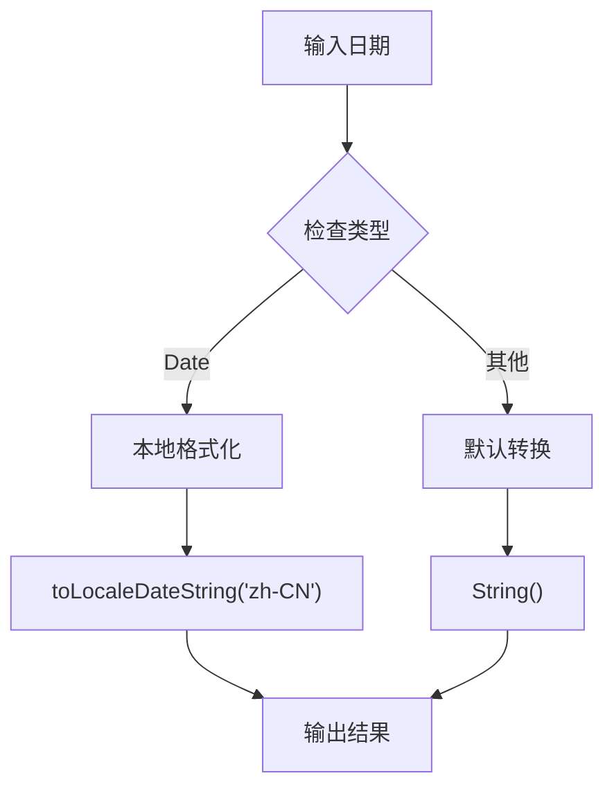

**图表来源**
- [art-excel-export/index.vue](file://src/components/core/forms/art-excel-export/index.vue#L171-L173)

### 数字格式化

对于数字类型的处理，组件提供了多种格式化选项：

- **基础数字**：直接转换为字符串
- **带单位数字**：如年龄显示为 "25岁"
- **货币格式**：可扩展支持货币格式化
- **百分比格式**：支持百分比显示

**章节来源**
- [widgets/excel/index.vue](file://src/views/widgets/excel/index.vue#L68-L94)
- [art-excel-export/index.vue](file://src/components/core/forms/art-excel-export/index.vue#L154-L180)

## 错误处理机制

### 错误分类体系

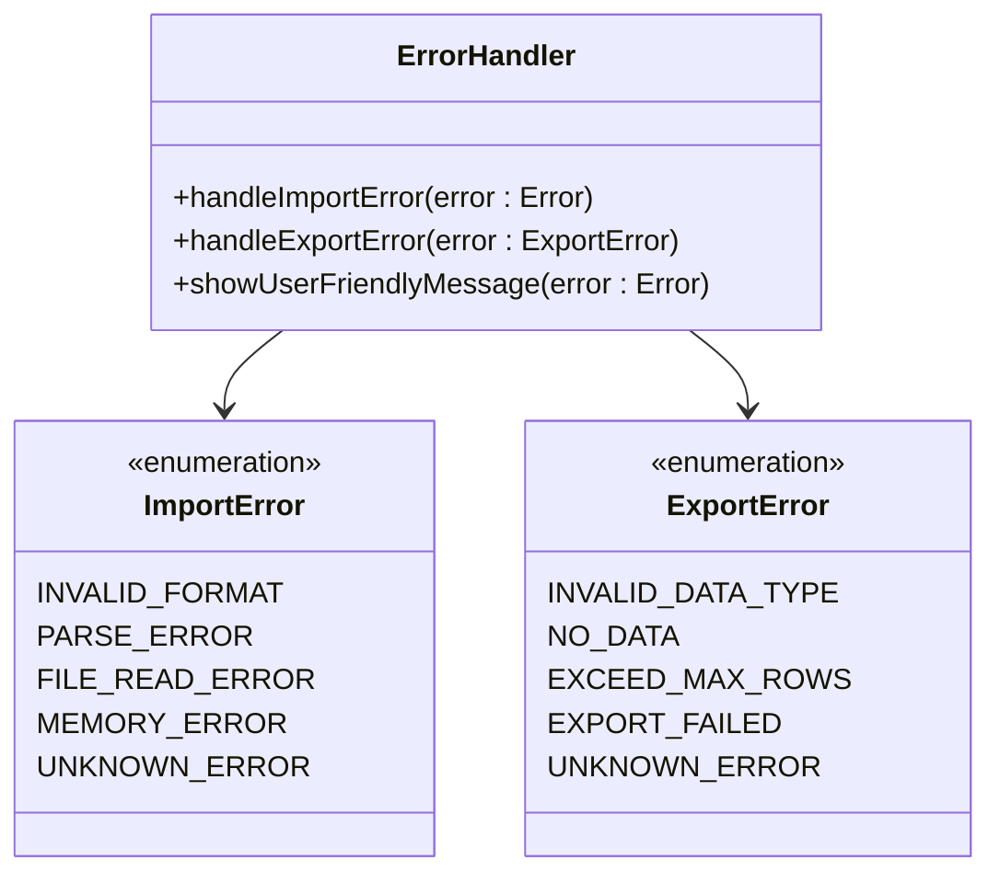

**图表来源**
- [art-excel-export/index.vue](file://src/components/core/forms/art-excel-export/index.vue#L119-L127)

### 常见错误及解决方案

#### 导入错误

| 错误类型 | 原因 | 解决方案 |
|----------|------|----------|
| 文件格式错误 | 不支持的文件扩展名 | 确保使用 .xlsx 或 .xls 格式 |
| 文件损坏 | Excel文件损坏或不完整 | 重新生成或修复Excel文件 |
| 内存不足 | 文件过大导致内存溢出 | 分批导入或增加系统内存 |
| 编码错误 | 文件编码不兼容 | 确保使用 UTF-8 编码 |

#### 导出错误

| 错误类型 | 原因 | 解决方案 |
|----------|------|----------|
| 数据类型错误 | 导出数据不是数组 | 检查数据源是否为数组格式 |
| 数据为空 | 没有可导出的数据 | 确保数据数组中有元素 |
| 行数超限 | 数据行数超过最大限制 | 减少数据量或调整 maxRows 参数 |
| 文件生成失败 | 内存不足或浏览器限制 | 优化数据结构或分批导出 |

### 用户友好错误提示

组件提供了多层次的错误提示机制：

1. **控制台日志**：详细的错误堆栈信息
2. **用户消息**：友好的错误提示信息
3. **视觉反馈**：错误状态的视觉指示
4. **恢复建议**：提供可能的解决方案

**章节来源**
- [art-excel-export/index.vue](file://src/components/core/forms/art-excel-export/index.vue#L136-L150)
- [widgets/excel/index.vue](file://src/views/widgets/excel/index.vue#L111-L118)

## 性能优化策略

### 内存管理优化

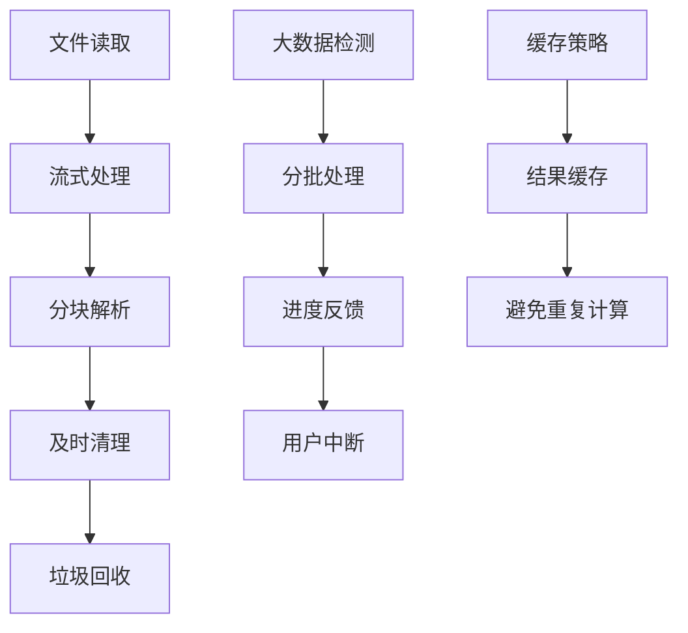

### 大数据量处理策略

#### 分块上传机制

对于大数据量的导入场景，建议采用分块上传策略：

1. **文件分割**：将大文件分割为多个小文件
2. **并发处理**：使用 Web Workers 进行并发处理
3. **进度跟踪**：实时显示处理进度
4. **断点续传**：支持中断后的继续处理

#### Web Worker 异步处理

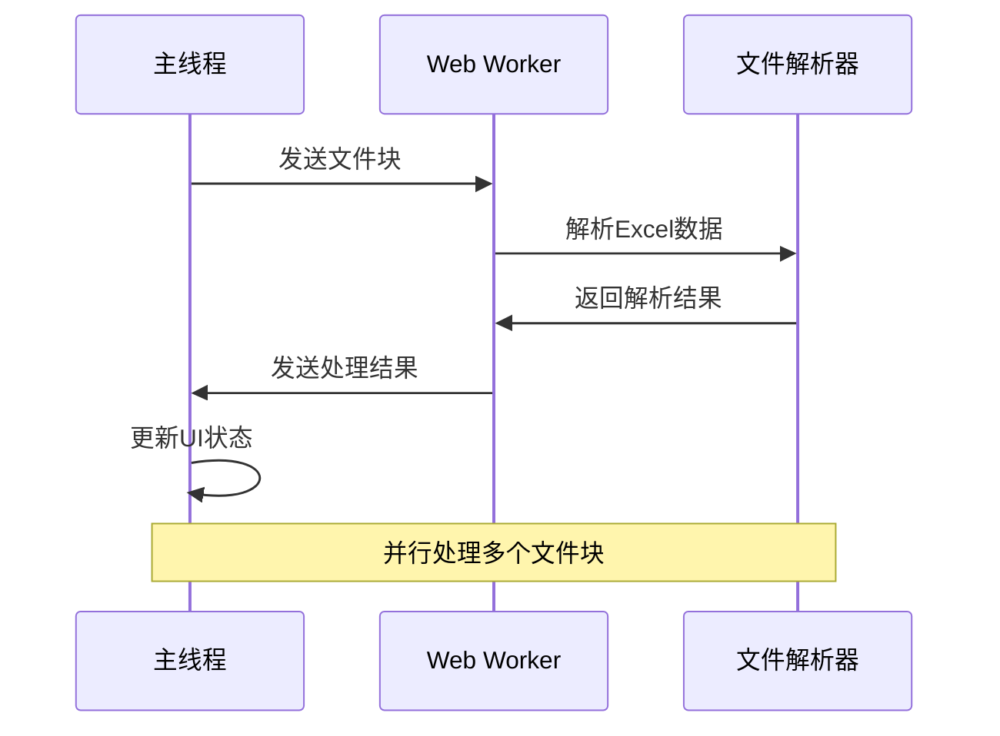

### 性能监控指标

| 指标 | 目标值 | 监控方法 |
|------|--------|----------|
| 文件读取时间 | < 2秒 | 使用 performance.now() |
| 数据解析时间 | < 5秒 | 监控解析过程 |
| 内存使用量 | < 500MB | 浏览器内存监控 |
| 用户等待时间 | < 10秒 | 交互式进度反馈 |

**章节来源**
- [art-excel-export/index.vue](file://src/components/core/forms/art-excel-export/index.vue#L216-L236)

## API对接示例

### 基础使用示例

```vue
<template>
  <div class="excel-container">
    <!-- 导入组件 -->
    <ArtExcelImport 
      @import-success="handleImportSuccess"
      @import-error="handleImportError"
    >
      <template #default>
        <el-button type="primary">导入 Excel</el-button>
      </template>
    </ArtExcelImport>
    
    <!-- 导出组件 -->
    <ArtExcelExport
      :data="tableData"
      filename="用户数据"
      sheetName="用户列表"
      :headers="headers"
      :columns="columnConfig"
      @export-success="handleExportSuccess"
      @export-error="handleExportError"
      @export-progress="handleProgress"
    >
      <el-button type="success">导出 Excel</el-button>
    </ArtExcelExport>
  </div>
</template>
```

### 后端API集成

#### 批量导入API示例

```typescript
// 导入成功后的API调用
const handleImportSuccess = async (data: Array<Record<string, unknown>>) => {
  try {
    // 数据预处理
    const processedData = data.map(item => ({
      name: String(item['姓名'] || ''),
      age: Number(item['年龄']) || 0,
      city: String(item['城市'] || '')
    }))
    
    // 调用批量导入API
    const response = await axios.post('/api/batch-import', {
      dataType: 'users',
      data: processedData,
      batchSize: 1000
    })
    
    // 处理API响应
    if (response.data.success) {
      ElMessage.success(`成功导入 ${response.data.count} 条数据`)
    } else {
      ElMessage.error(`部分导入失败: ${response.data.message}`)
    }
  } catch (error) {
    ElMessage.error('导入过程中出现错误')
    console.error('导入API错误:', error)
  }
}
```

#### 分块上传实现

```typescript
// 分块上传处理
const handleChunkUpload = async (chunks: File[]) => {
  const totalChunks = chunks.length
  let processedChunks = 0
  
  for (let i = 0; i < chunks.length; i++) {
    try {
      // 单个块处理
      const chunkData = await processExcelChunk(chunks[i])
      
      // 上传到服务器
      await uploadChunkToServer(chunkData, i, totalChunks)
      
      // 更新进度
      processedChunks++
      emit('upload-progress', Math.floor((processedChunks / totalChunks) * 100))
    } catch (error) {
      console.error(`块 ${i} 处理失败:`, error)
      throw new Error(`块 ${i} 处理失败`)
    }
  }
}
```

### 进度反馈机制


**图表来源**
- [art-excel-export/index.vue](file://src/components/core/forms/art-excel-export/index.vue#L246-L306)

**章节来源**
- [widgets/excel/index.vue](file://src/views/widgets/excel/index.vue#L1-L151)

## 故障排除指南

### 常见问题及解决方案

#### 编码错误

**问题描述**：Excel文件中的中文字符显示为乱码

**解决方案**：
1. 确保Excel文件保存为 UTF-8 编码
2. 检查浏览器的语言设置
3. 使用正确的字符集读取文件

#### 格式不兼容

**问题描述**：某些Excel格式无法正常解析

**解决方案**：
1. 将Excel文件另存为 `.xlsx` 格式
2. 检查文件是否损坏
3. 使用官方Excel软件打开并修复文件

#### 数据丢失

**问题描述**：导入后部分数据丢失或格式错误

**排查步骤**：
1. 检查Excel文件的表头格式
2. 验证数据类型匹配
3. 确认映射配置正确

#### 内存溢出

**问题描述**：处理大文件时浏览器崩溃

**解决方案**：
1. 减少单次导入的数据量
2. 使用分批处理策略
3. 增加系统可用内存

### 调试工具和技巧

#### 开发者工具使用

```javascript
// 启用详细日志
window.EXCEL_DEBUG = true

// 监控内存使用
console.time('Excel Processing')
// 执行Excel操作
console.timeEnd('Excel Processing')

// 检查内存使用
if (performance.memory) {
  console.log('内存使用:', performance.memory.usedJSHeapSize)
}
```

#### 错误诊断流程

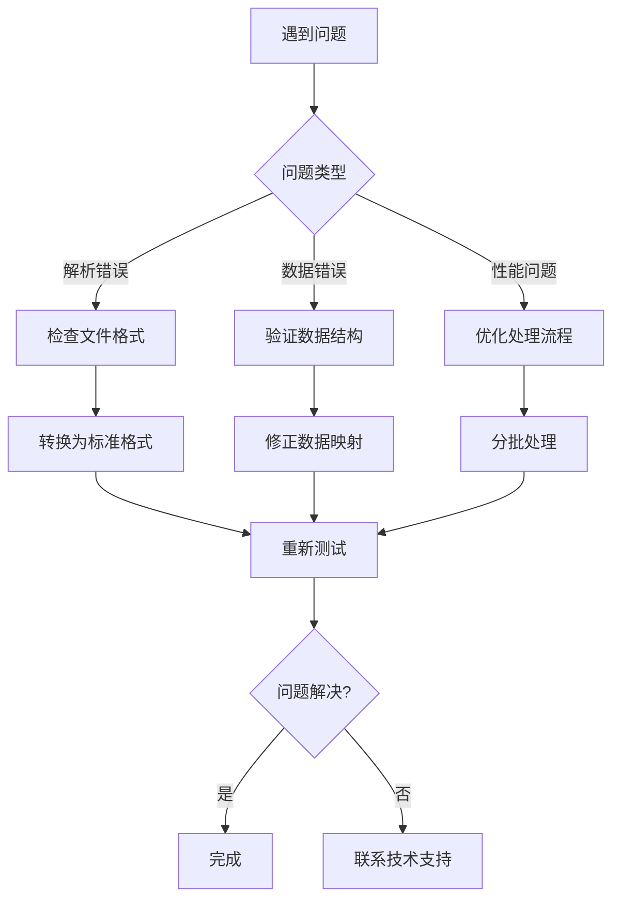

**章节来源**
- [art-excel-export/index.vue](file://src/components/core/forms/art-excel-export/index.vue#L136-L150)

## 扩展开发指南

### 自定义数据验证规则

#### 验证器接口定义

```typescript
interface ValidationRule {
  field: string
  validator: (value: unknown, rowData: Record<string, unknown>) => boolean
  errorMessage: string
  severity: 'error' | 'warning' | 'info'
}

// 自定义验证规则示例
const customValidationRules: ValidationRule[] = [
  {
    field: 'email',
    validator: (value) => /^[^\s@]+@[^\s@]+\.[^\s@]+$/.test(String(value)),
    errorMessage: '邮箱格式不正确',
    severity: 'error'
  },
  {
    field: 'age',
    validator: (value) => Number(value) >= 0 && Number(value) <= 120,
    errorMessage: '年龄范围应在0-120之间',
    severity: 'warning'
  }
]
```

#### 验证流程集成

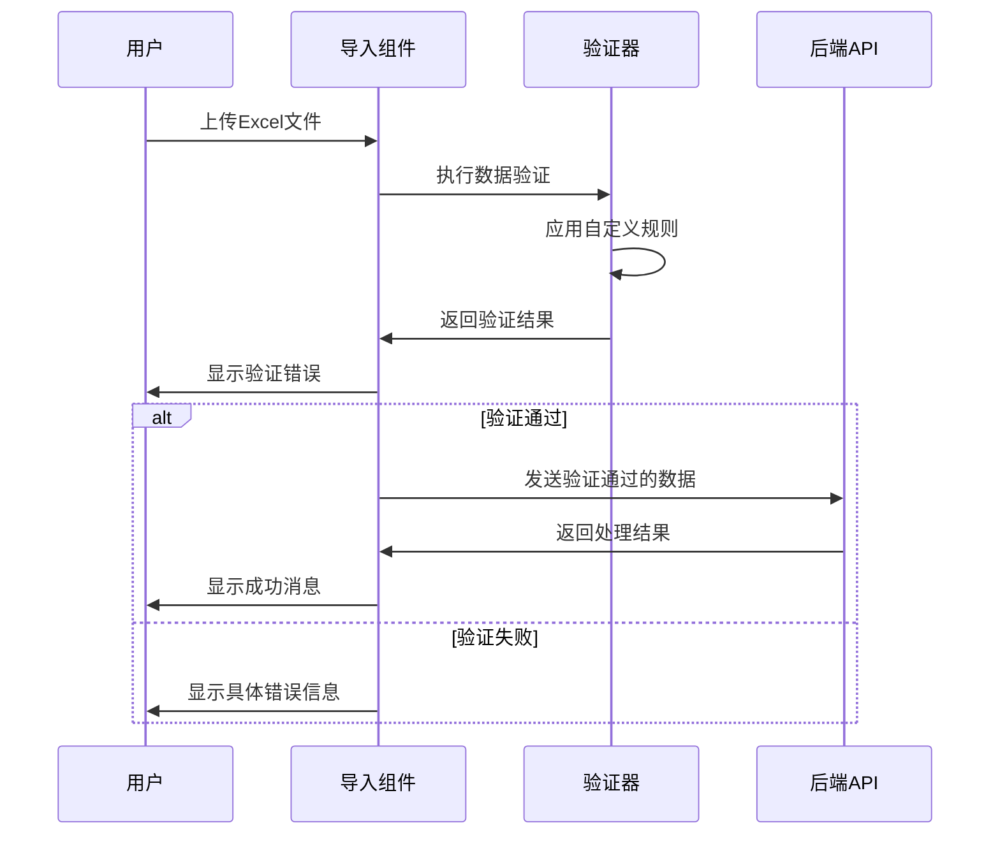

### 扩展组件功能

#### 自定义格式化器

```typescript
// 自定义列格式化器
const customFormatters = {
  currency: (value: unknown, row: Record<string, unknown>, index: number) => {
    const amount = Number(value)
    return isNaN(amount) ? '' : `¥${amount.toFixed(2)}`
  },
  
  percentage: (value: unknown, row: Record<string, unknown>, index: number) => {
    const percent = Number(value)
    return isNaN(percent) ? '' : `${(percent * 100).toFixed(2)}%`
  },
  
  status: (value: unknown, row: Record<string, unknown>, index: number) => {
    const statusMap = {
      0: '未激活',
      1: '已激活',
      2: '已冻结'
    }
    return statusMap[value as keyof typeof statusMap] || '未知状态'
  }
}
```

#### 插件化架构设计

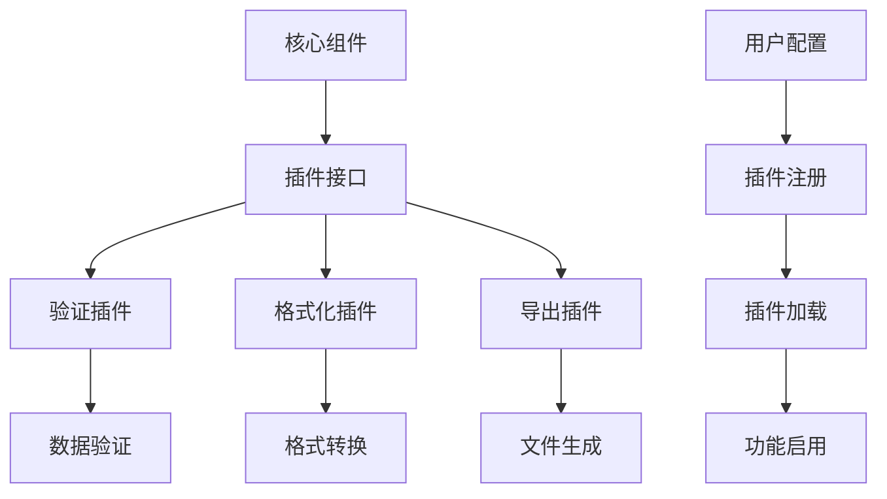

### 性能监控扩展

#### 实时性能监控

```typescript
// 性能监控插件
class PerformanceMonitor {
  private metrics: Map<string, number[]> = new Map()
  
  startMeasure(name: string): void {
    this.metrics.set(`${name}_start`, performance.now())
  }
  
  endMeasure(name: string): void {
    const startTime = this.metrics.get(`${name}_start`)
    if (startTime) {
      const duration = performance.now() - startTime
      const durations = this.metrics.get(name) || []
      durations.push(duration)
      this.metrics.set(name, durations)
      
      // 记录到控制台
      console.log(`${name}: ${duration.toFixed(2)}ms`)
    }
  }
  
  getAverage(name: string): number {
    const durations = this.metrics.get(name) || []
    return durations.reduce((sum, val) => sum + val, 0) / durations.length
  }
}
```

**章节来源**
- [art-excel-export/index.vue](file://src/components/core/forms/art-excel-export/index.vue#L154-L180)

## 总结

art-excel-import 组件是一个功能完善、性能优异的 Excel 文件处理解决方案。它不仅提供了基本的导入导出功能，还具备了以下核心优势：

### 技术优势

1. **技术栈先进**：基于 Vue 3 和现代 JavaScript 特性
2. **类型安全**：完整的 TypeScript 类型定义
3. **性能优化**：智能的内存管理和异步处理
4. **错误处理**：完善的异常捕获和用户反馈

### 功能完整性

1. **多格式支持**：兼容 `.xlsx` 和 `.xls` 格式
2. **灵活映射**：支持复杂的字段映射和格式转换
3. **大数据处理**：具备处理大规模数据的能力
4. **API集成**：无缝对接后端服务

### 扩展性设计

1. **插件架构**：支持自定义验证规则和格式化器
2. **配置灵活**：丰富的配置选项满足不同需求
3. **监控完善**：内置性能监控和错误追踪

### 应用价值

该组件适用于各种需要 Excel 文件处理的业务场景，包括但不限于：

- 数据导入导出功能
- 报表生成系统
- 数据迁移工具
- 批量数据处理平台

通过合理使用本组件的各项功能，开发者可以快速构建高质量的 Excel 处理应用，提升用户体验和开发效率。