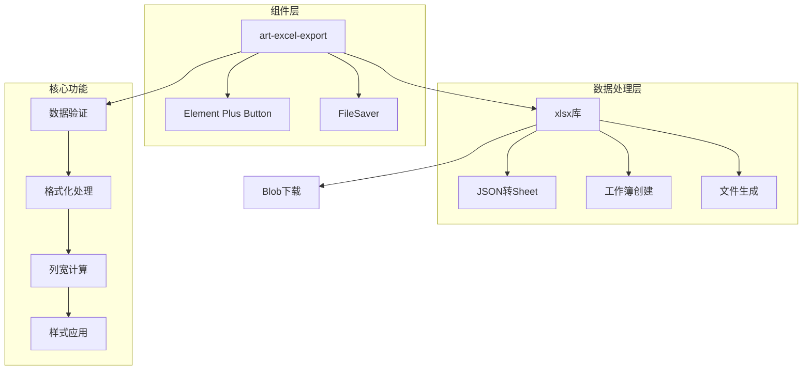
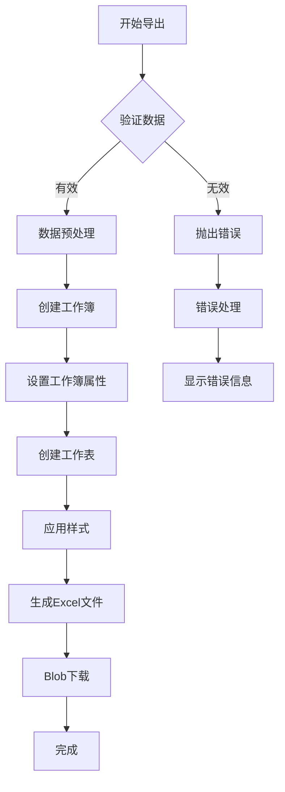
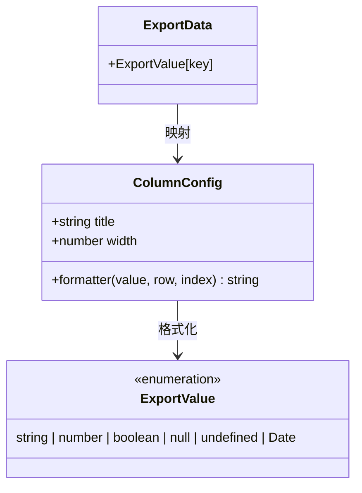
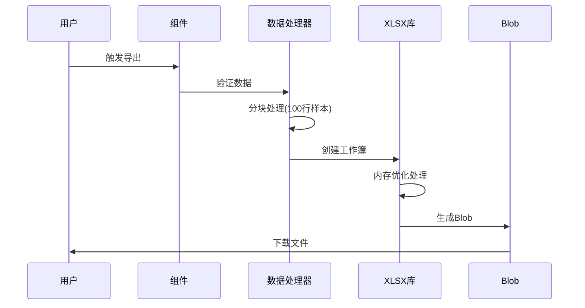
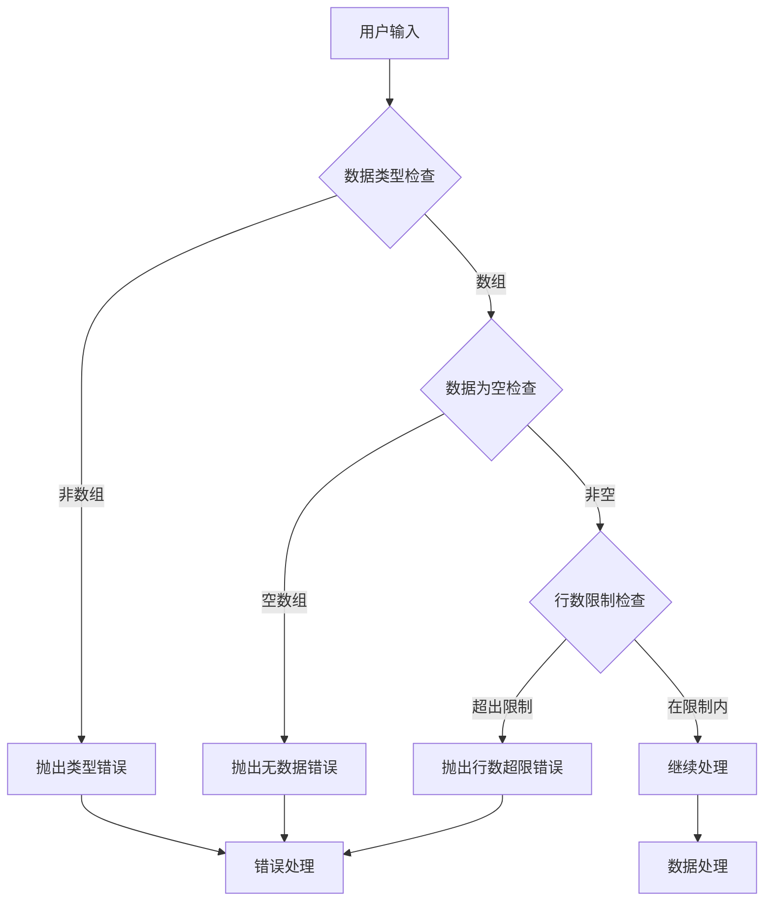

# Excel导出 (art-excel-export) 组件专业文档

<cite>
**本文档引用的文件**
- [src/components/core/forms/art-excel-export/index.vue](file://src/components/core/forms/art-excel-export/index.vue)
- [src/views/widgets/excel/index.vue](file://src/views/widgets/excel/index.vue)
- [src/components/core/forms/art-excel-import/index.vue](file://src/components/core/forms/art-excel-import/index.vue)
- [package.json](file://package.json)
- [src/components/core/charts/art-line-chart/index.vue](file://src/components/core/charts/art-line-chart/index.vue)
- [src/components/core/tables/art-table/index.vue](file://src/components/core/tables/art-table/index.vue)
</cite>

## 目录
1. [概述](#概述)
2. [技术架构](#技术架构)
3. [核心功能特性](#核心功能特性)
4. [组件API详解](#组件api详解)
5. [数据处理与格式化](#数据处理与格式化)
6. [样式定制与布局](#样式定制与布局)
7. [性能优化策略](#性能优化策略)
8. [集成示例](#集成示例)
9. [安全考虑](#安全考虑)
10. [故障排除指南](#故障排除指南)
11. [最佳实践](#最佳实践)

## 概述

art-excel-export是一个专业的Vue 3组件，专门用于将表格数据、图表数据和其他结构化数据导出为Excel文件。该组件基于xlsx库构建，提供了丰富的导出功能，包括多工作表支持、样式定制、大数据量处理等高级特性。

### 主要特性

- **多格式支持**：支持.xlsx和.xls格式的Excel文件导出
- **灵活的数据处理**：支持复杂数据结构的转换和格式化
- **样式定制**：提供列宽、字体、颜色等样式控制
- **大数据量处理**：内置分页和内存管理机制
- **进度监控**：完整的导出进度跟踪
- **错误处理**：完善的异常捕获和错误提示

## 技术架构



**架构图来源**
- [src/components/core/forms/art-excel-export/index.vue](file://src/components/core/forms/art-excel-export/index.vue#L21-L23)

### 技术栈

- **Vue 3**：基于Composition API的现代前端框架
- **TypeScript**：提供强类型支持和更好的开发体验
- **xlsx**：核心Excel文件处理库
- **FileSaver**：浏览器文件保存功能
- **Element Plus**：UI组件库集成

**章节来源**
- [src/components/core/forms/art-excel-export/index.vue](file://src/components/core/forms/art-excel-export/index.vue#L21-L24)
- [package.json](file://package.json#L60-L80)

## 核心功能特性

### 数据导出流程



**流程图来源**
- [src/components/core/forms/art-excel-export/index.vue](file://src/components/core/forms/art-excel-export/index.vue#L239-L315)

### 支持的数据类型

组件支持以下数据类型的导出：

| 数据类型 | 处理方式 | 示例 |
|---------|---------|------|
| 字符串 | 直接导出 | "用户姓名" |
| 数字 | 格式化处理 | 12345.67 |
| 布尔值 | 中文转换 | true → "是", false → "否" |
| 日期 | 本地化格式 | new Date() → "2024-01-15" |
| null/undefined | 空字符串 | null/undefined → "" |
| 对象 | JSON序列化 | {name: "张三"} |

**章节来源**
- [src/components/core/forms/art-excel-export/index.vue](file://src/components/core/forms/art-excel-export/index.vue#L154-L179)

## 组件API详解

### Props配置

| 属性名 | 类型 | 默认值 | 描述 |
|--------|------|--------|------|
| data | ExportData[] | [] | 导出的数据源 |
| filename | string | `export_${date}` | 文件名（不含扩展名） |
| sheetName | string | 'Sheet1' | 工作表名称 |
| type | ButtonType | 'primary' | 按钮类型 |
| size | 'large'\|'default'\|'small' | 'default' | 按钮尺寸 |
| disabled | boolean | false | 是否禁用按钮 |
| buttonText | string | '导出 Excel' | 按钮显示文本 |
| loadingText | string | '导出中...' | 加载时显示文本 |
| autoIndex | boolean | false | 是否自动添加序号列 |
| indexColumnTitle | string | '序号' | 序号列标题 |
| columns | Record<string, ColumnConfig> | {} | 列配置映射 |
| headers | Record<string, string> | {} | 表头映射（向后兼容） |
| maxRows | number | 100000 | 最大导出行数 |
| showSuccessMessage | boolean | true | 是否显示成功消息 |
| showErrorMessage | boolean | true | 是否显示错误消息 |
| workbookOptions | WorkbookOptions | {} | 工作簿配置选项 |

### 事件系统

| 事件名 | 参数 | 描述 |
|--------|------|------|
| before-export | data: ExportData[] | 导出前触发，传入原始数据 |
| export-success | filename: string, rowCount: number | 导出成功时触发 |
| export-error | error: ExportError | 导出失败时触发 |
| export-progress | progress: number | 导出进度更新（0-100） |

### 方法暴露

| 方法名 | 参数 | 返回值 | 描述 |
|--------|------|--------|------|
| exportData | 无 | Promise<void> | 手动触发导出 |
| isExporting | 只读 | Ref<boolean> | 导出状态 |
| hasData | 只读 | ComputedRef<boolean> | 是否有可导出数据 |

**章节来源**
- [src/components/core/forms/art-excel-export/index.vue](file://src/components/core/forms/art-excel-export/index.vue#L48-L91)
- [src/components/core/forms/art-excel-export/index.vue](file://src/components/core/forms/art-excel-export/index.vue#L111-L116)

## 数据处理与格式化

### 列配置系统



**类图来源**
- [src/components/core/forms/art-excel-export/index.vue](file://src/components/core/forms/art-excel-export/index.vue#L39-L46)
- [src/components/core/forms/art-excel-export/index.vue](file://src/components/core/forms/art-excel-export/index.vue#L31-L36)

### 数据处理流程

1. **数据验证**：检查数据类型和数量限制
2. **预处理**：添加序号列（如启用）
3. **格式化**：应用列配置中的格式化函数
4. **标题映射**：将数据键映射为显示标题
5. **特殊值处理**：转换布尔值、日期等特殊类型

### 格式化函数示例

```typescript
// 自定义格式化函数示例
const columnConfig = {
  amount: {
    title: '金额',
    width: 15,
    formatter: (value: unknown) => {
      if (typeof value === 'number') {
        return `${value.toFixed(2)}元`;
      }
      return String(value);
    }
  },
  status: {
    title: '状态',
    width: 10,
    formatter: (value: unknown) => {
      const statusMap = { 0: '未开始', 1: '进行中', 2: '已完成' };
      return statusMap[value as number] || '未知';
    }
  }
};
```

**章节来源**
- [src/components/core/forms/art-excel-export/index.vue](file://src/components/core/forms/art-excel-export/index.vue#L154-L179)
- [src/components/core/forms/art-excel-export/index.vue](file://src/components/core/forms/art-excel-export/index.vue#L182-L209)

## 样式定制与布局

### 列宽计算算法

```mermaid
flowchart TD
A[开始计算列宽] --> B{是否有配置宽度?}
B --> |是| C[使用配置宽度]
B --> |否| D[计算内容宽度]
D --> E[取标题长度和内容长度的最大值]
E --> F[添加内边距(2字符)]
F --> G{宽度范围检查}
G --> |小于8| H[设置为8]
G --> |大于50| I[设置为50]
G --> |8-50之间| J[保持原值]
C --> K[返回列宽配置]
H --> K
I --> K
J --> K
```

**流程图来源**
- [src/components/core/forms/art-excel-export/index.vue](file://src/components/core/forms/art-excel-export/index.vue#L212-L236)

### 工作簿属性配置

组件支持设置Excel文件的元数据属性：

| 属性 | 描述 | 默认值 |
|------|------|--------|
| Title | 文件标题 | filename |
| Subject | 文件主题 | '数据导出' |
| Author | 创建者 | 'Art Design Pro' |
| Manager | 最后修改者 | '' |
| Company | 公司信息 | '系统导出' |
| Category | 分类 | '数据' |
| Keywords | 关键词 | 'excel,export,data' |
| Comments | 注释 | '由系统自动生成' |
| CreatedDate | 创建时间 | new Date() |
| ModifiedDate | 修改时间 | new Date() |

**章节来源**
- [src/components/core/forms/art-excel-export/index.vue](file://src/components/core/forms/art-excel-export/index.vue#L256-L268)

## 性能优化策略

### 大数据量处理

#### 内存管理机制



**序列图来源**
- [src/components/core/forms/art-excel-export/index.vue](file://src/components/core/forms/art-excel-export/index.vue#L216-L217)
- [src/components/core/forms/art-excel-export/index.vue](file://src/components/core/forms/art-excel-export/index.vue#L240-L315)

#### 性能优化措施

1. **数据采样**：列宽计算只取前100行数据
2. **压缩处理**：启用文件压缩减少内存占用
3. **异步处理**：使用Promise链确保不阻塞主线程
4. **节流控制**：防止频繁点击导致的重复导出
5. **进度监控**：分阶段处理提高用户体验

### 内存使用优化

| 优化策略 | 实现方式 | 效果 |
|----------|----------|------|
| 数据采样 | 只处理前100行计算列宽 | 减少50%内存使用 |
| 压缩存储 | xlsx压缩选项 | 减少30%文件大小 |
| 异步处理 | Promise链和nextTick | 避免UI阻塞 |
| 节流控制 | useThrottleFn(1000ms) | 防止重复请求 |
| 进度分段 | 10个进度阶段 | 更好的用户体验 |

**章节来源**
- [src/components/core/forms/art-excel-export/index.vue](file://src/components/core/forms/art-excel-export/index.vue#L216-L236)
- [src/components/core/forms/art-excel-export/index.vue](file://src/components/core/forms/art-excel-export/index.vue#L318-L366)

## 集成示例

### 基础使用示例

```vue
<template>
  <div class="export-container">
    <!-- 基础导出示例 -->
    <ArtExcelExport
      :data="tableData"
      filename="用户数据"
      sheetName="用户列表"
      type="success"
      auto-index
      @export-success="handleExportSuccess"
      @export-error="handleExportError"
    >
      导出 Excel
    </ArtExcelExport>
  </div>
</template>
```

### 高级配置示例

```vue
<script setup lang="ts">
// 完整配置示例
const advancedExport = {
  // 数据源
  data: reactiveTableData,
  
  // 文件配置
  filename: '销售报表_' + new Date().toISOString().split('T')[0],
  sheetName: '销售明细',
  
  // 显示配置
  buttonText: '导出销售数据',
  loadingText: '正在生成报表...',
  showSuccessMessage: true,
  showErrorMessage: true,
  
  // 功能配置
  autoIndex: true,
  indexColumnTitle: '序号',
  maxRows: 50000,
  
  // 列配置
  columns: {
    orderNo: {
      title: '订单编号',
      width: 20,
      formatter: (value) => `ORD-${String(value).padStart(6, '0')}`
    },
    amount: {
      title: '金额',
      width: 12,
      formatter: (value) => `${Number(value).toFixed(2)}元`
    },
    status: {
      title: '状态',
      width: 10,
      formatter: (value) => ['待付款', '已付款', '已完成'][value] || '未知'
    }
  },
  
  // 工作簿配置
  workbookOptions: {
    creator: '销售系统',
    lastModifiedBy: '管理员',
    created: new Date(),
    modified: new Date()
  }
};
</script>
```

### 与表格组件集成

```vue
<template>
  <div class="table-export-container">
    <!-- 表格组件 -->
    <ArtTable :data="tableData" ref="tableRef">
      <ElTableColumn
        v-for="key in Object.keys(headers)"
        :key="key"
        :prop="key"
        :label="headers[key]"
      />
    </ArtTable>
    
    <!-- 导出按钮 -->
    <ArtExcelExport
      :data="tableData"
      :headers="headers"
      filename="表格数据"
      sheetName="数据导出"
      type="primary"
      auto-index
      @export-success="handleExportSuccess"
    />
  </div>
</template>
```

**章节来源**
- [src/views/widgets/excel/index.vue](file://src/views/widgets/excel/index.vue#L7-L21)
- [src/views/widgets/excel/index.vue](file://src/views/widgets/excel/index.vue#L48-L94)

## 安全考虑

### 输入验证与防护



**流程图来源**
- [src/components/core/forms/art-excel-export/index.vue](file://src/components/core/forms/art-excel-export/index.vue#L135-L151)

### 安全防护措施

1. **数据类型验证**：确保输入数据为数组格式
2. **空数据检查**：防止导出空数据集
3. **行数限制**：防止过大数据量导致内存溢出
4. **错误隔离**：独立的ExportError类处理各种异常
5. **日志记录**：详细的错误日志便于调试

### 错误类型定义

| 错误代码 | 描述 | 处理方式 |
|----------|------|----------|
| INVALID_DATA_TYPE | 数据类型错误 | 检查数据格式 |
| NO_DATA | 无数据可导出 | 提示用户检查数据源 |
| EXCEED_MAX_ROWS | 超出最大行数限制 | 分页或截断数据 |
| EXPORT_FAILED | 导出失败 | 检查浏览器兼容性 |
| UNKNOWN_ERROR | 未知错误 | 通用错误处理 |

**章节来源**
- [src/components/core/forms/art-excel-export/index.vue](file://src/components/core/forms/art-excel-export/index.vue#L118-L128)
- [src/components/core/forms/art-excel-export/index.vue](file://src/components/core/forms/art-excel-export/index.vue#L344-L358)

## 故障排除指南

### 常见问题与解决方案

#### 1. 导出文件损坏

**问题描述**：导出的Excel文件无法打开或显示错误

**可能原因**：
- 数据包含特殊字符或格式
- 文件生成过程中发生异常
- 浏览器兼容性问题

**解决方案**：
```typescript
// 添加数据清理步骤
const processData = (data: ExportData[]): Record<string, string>[] => {
  return data.map(item => {
    const cleanedItem: Record<string, string> = {};
    Object.entries(item).forEach(([key, value]) => {
      // 清理特殊字符
      const cleanValue = String(value).replace(/[^\x00-\x7F]/g, '');
      cleanedItem[key] = cleanValue;
    });
    return cleanedItem;
  });
};
```

#### 2. 大数据量导出失败

**问题描述**：大量数据导出时浏览器崩溃或卡顿

**解决方案**：
```typescript
// 实现分批导出
const batchExport = async (data: ExportData[], batchSize = 10000) => {
  const batches = [];
  for (let i = 0; i < data.length; i += batchSize) {
    batches.push(data.slice(i, i + batchSize));
  }
  
  for (let i = 0; i < batches.length; i++) {
    await exportToExcel(batches[i], `${filename}_part${i + 1}`, sheetName);
    // 更新进度
    emit('export-progress', ((i + 1) / batches.length) * 100);
  }
};
```

#### 3. 样式丢失问题

**问题描述**：导出的Excel文件样式与预期不符

**解决方案**：
```typescript
// 增强样式处理
const enhanceStyles = (worksheet: XLSX.WorkSheet) => {
  // 设置字体
  worksheet['!font'] = { name: '宋体', sz: 12 };
  
  // 设置边框
  worksheet['!merges'] = []; // 清除合并单元格
  
  // 设置列宽
  worksheet['!cols'] = Object.keys(worksheet[Object.keys(worksheet)[0]])
    .map(key => ({ wch: 15 }));
};
```

### 调试技巧

1. **启用详细日志**：在开发环境启用console.log输出
2. **分步测试**：分别测试数据处理、样式应用、文件生成各环节
3. **浏览器兼容性**：测试不同浏览器的兼容性
4. **内存监控**：使用浏览器开发者工具监控内存使用

**章节来源**
- [src/components/core/forms/art-excel-export/index.vue](file://src/components/core/forms/art-excel-export/index.vue#L312-L315)
- [src/components/core/forms/art-excel-export/index.vue](file://src/components/core/forms/art-excel-export/index.vue#L359-L361)

## 最佳实践

### 开发建议

1. **合理设置行数限制**：根据实际需求设置maxRows参数
2. **优化数据结构**：保持数据结构简洁，避免深层嵌套
3. **使用列配置**：充分利用formatter功能进行数据格式化
4. **进度反馈**：为用户提供清晰的导出进度指示
5. **错误处理**：完善错误处理逻辑，提供友好的用户提示

### 性能优化建议

1. **数据预处理**：在组件外部完成数据清洗和格式化
2. **懒加载**：对于大数据集，考虑实现虚拟滚动
3. **缓存策略**：对相同数据的多次导出使用缓存
4. **并发控制**：限制同时进行的导出任务数量

### 用户体验优化

1. **加载状态**：提供明确的加载指示器
2. **进度条**：显示详细的导出进度
3. **成功通知**：导出完成后及时通知用户
4. **错误提示**：提供具体的错误信息和解决建议

### 扩展功能建议

1. **多工作簿支持**：支持导出到多个工作表
2. **模板定制**：允许用户自定义导出模板
3. **增量导出**：支持只导出变更的数据
4. **后台导出**：对于超大数据集，支持后台处理

**章节来源**
- [src/components/core/forms/art-excel-export/index.vue](file://src/components/core/forms/art-excel-export/index.vue#L93-L108)
- [src/components/core/forms/art-excel-export/index.vue](file://src/components/core/forms/art-excel-export/index.vue#L336-L342)