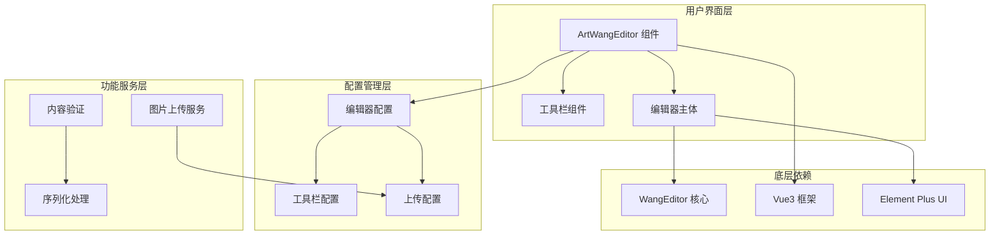
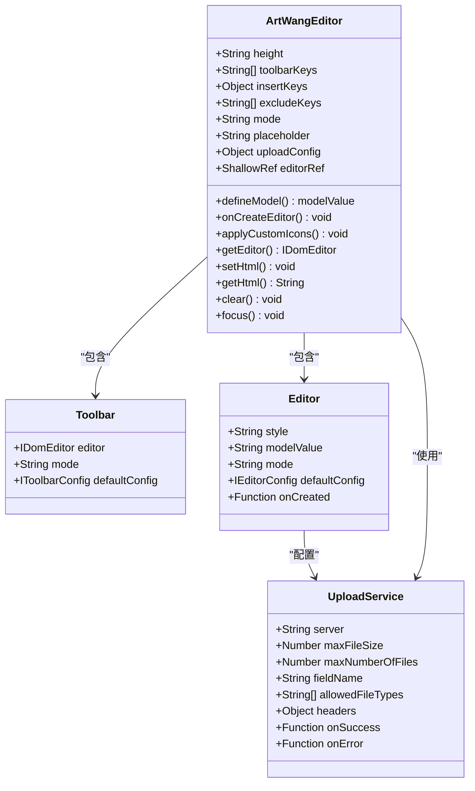
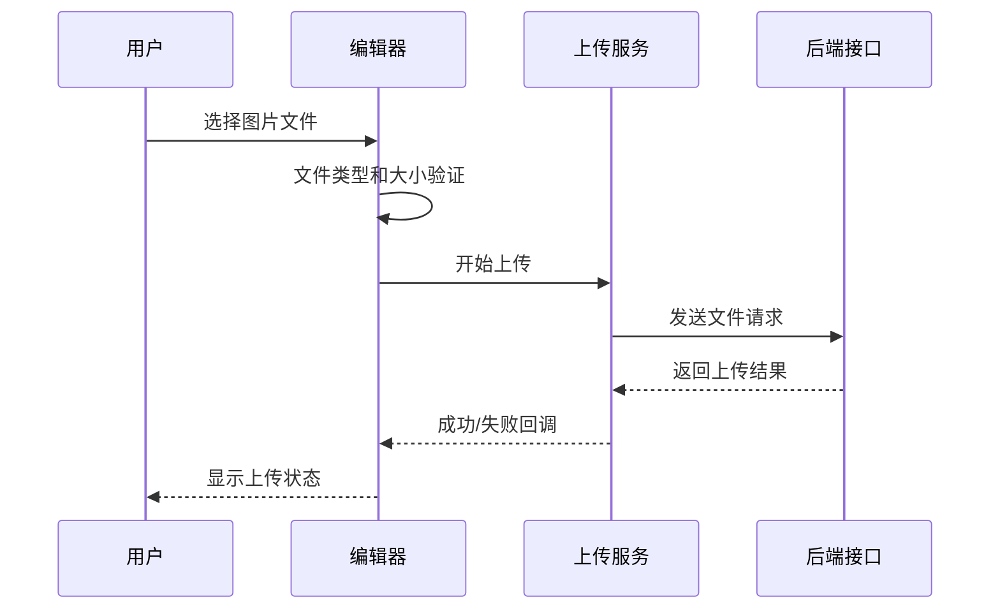
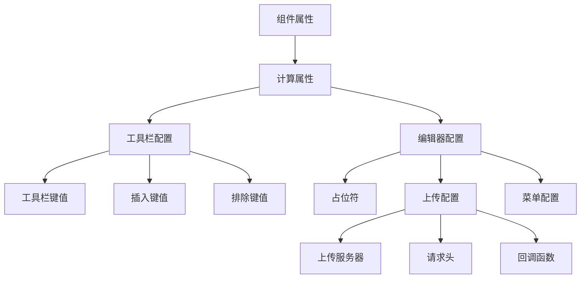
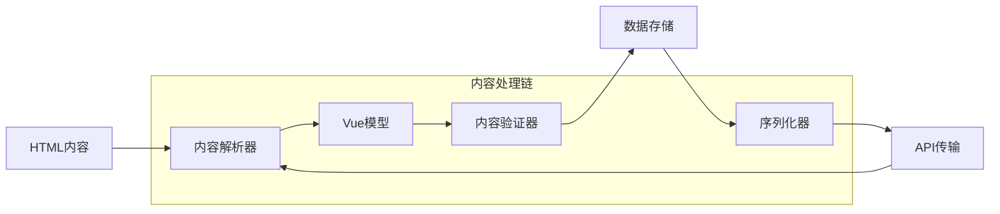
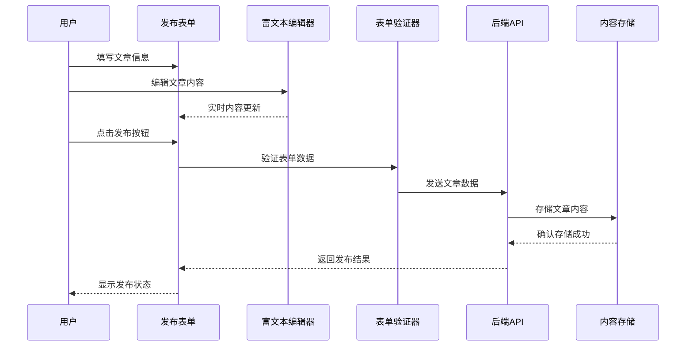
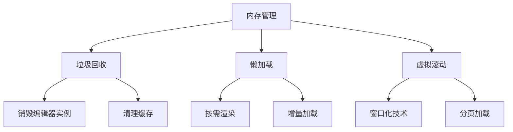

# 富文本编辑器 (art-wang-editor) 深度技术文档

<cite>
**本文档引用的文件**
- [src/components/core/forms/art-wang-editor/index.vue](file://src/components/core/forms/art-wang-editor/index.vue)
- [src/components/core/forms/art-wang-editor/style.scss](file://src/components/core/forms/art-wang-editor/style.scss)
- [src/views/widgets/wang-editor/index.vue](file://src/views/widgets/wang-editor/index.vue)
- [src/components/business/comment-widget/index.vue](file://src/components/business/comment-widget/index.vue)
- [src/views/article/publish/index.vue](file://src/views/article/publish/index.vue)
- [src/views/article/comment/index.vue](file://src/views/article/comment/index.vue)
- [src/utils/form/validator.ts](file://src/utils/form/validator.ts)
- [src/utils/form/index.ts](file://src/utils/form/index.ts)
</cite>

## 目录
1. [项目概述](#项目概述)
2. [架构设计](#架构设计)
3. [核心组件分析](#核心组件分析)
4. [功能特性详解](#功能特性详解)
5. [配置系统](#配置系统)
6. [事件系统](#事件系统)
7. [内容序列化与反序列化](#内容序列化与反序列化)
8. [集成方案](#集成方案)
9. [性能优化](#性能优化)
10. [扩展开发](#扩展开发)
11. [最佳实践](#最佳实践)
12. [故障排除](#故障排除)

## 项目概述

art-wang-editor是基于WangEditor的Vue3富文本编辑器封装组件，专为Art Design Pro设计的一体化富文本解决方案。该编辑器不仅继承了WangEditor的强大功能，还针对企业级应用场景进行了深度定制和优化。

### 核心特性

- **完整的WangEditor功能集**：支持文本格式化、图片上传、表格插入、代码高亮等
- **灵活的配置系统**：提供工具栏自定义、功能排除、模式切换等高级配置
- **企业级集成能力**：内置图片上传服务集成、表单验证、内容安全过滤
- **响应式设计**：完美适配桌面端和移动端设备
- **主题化定制**：支持深色模式、自定义主题色彩、图标系统

## 架构设计

### 整体架构图



**架构图来源**
- [src/components/core/forms/art-wang-editor/index.vue](file://src/components/core/forms/art-wang-editor/index.vue#L1-L220)

### 组件层次结构



**类图来源**
- [src/components/core/forms/art-wang-editor/index.vue](file://src/components/core/forms/art-wang-editor/index.vue#L30-L50)

## 核心组件分析

### ArtWangEditor 主组件

主组件是整个富文本编辑器的核心入口，负责协调各个子组件的工作流程。

#### 属性配置

| 属性名 | 类型 | 默认值 | 说明 |
|--------|------|--------|------|
| height | string | '500px' | 编辑器高度 |
| toolbarKeys | string[] | undefined | 自定义工具栏按钮列表 |
| insertKeys | Object | undefined | 在指定位置插入新工具 |
| excludeKeys | string[] | ['fontFamily'] | 排除的工具栏项 |
| mode | 'default' \| 'simple' | 'default' | 编辑器模式 |
| placeholder | string | '请输入内容...' | 占位符文本 |
| uploadConfig | Object | {} | 图片上传配置 |

#### 方法暴露

组件通过 `defineExpose` 暴露以下核心方法：

- `getEditor()` - 获取编辑器实例
- `setHtml(html)` - 设置编辑器内容
- `getHtml()` - 获取编辑器HTML内容
- `clear()` - 清空编辑器内容
- `focus()` - 聚焦编辑器

**章节来源**
- [src/components/core/forms/art-wang-editor/index.vue](file://src/components/core/forms/art-wang-editor/index.vue#L30-L50)
- [src/components/core/forms/art-wang-editor/index.vue](file://src/components/core/forms/art-wang-editor/index.vue#L190-L202)

### 工具栏配置系统

工具栏配置采用声明式设计，支持三种主要配置方式：

#### 1. 完全自定义工具栏
```typescript
// 示例：只显示基础编辑功能
const simpleToolbarKeys = [
  'bold', 'italic', 'underline', '|',
  'bulletedList', 'numberedList', '|',
  'insertLink', 'insertImage', '|',
  'undo', 'redo'
]
```

#### 2. 工具栏排除机制
通过 `excludeKeys` 属性排除不需要的功能按钮。

#### 3. 动态插入工具
使用 `insertKeys` 在特定位置插入新的工具按钮。

**章节来源**
- [src/views/widgets/wang-editor/index.vue](file://src/views/widgets/wang-editor/index.vue#L226-L239)
- [src/components/core/forms/art-wang-editor/index.vue](file://src/components/core/forms/art-wang-editor/index.vue#L86-L105)

### 样式主题系统

编辑器采用SCSS模块化样式设计，支持主题化定制：

#### 主题变量系统
- `$box-radius`: 统一的圆角半径
- `--art-gray-*`: 灰度色彩系统
- `--w-e-*`: WangEditor原生样式变量

#### 响应式适配
- 移动端优化：触摸友好的按钮尺寸
- 桌面端优化：完整的工具栏布局
- 深色模式支持：自动适配系统主题

**章节来源**
- [src/components/core/forms/art-wang-editor/style.scss](file://src/components/core/forms/art-wang-editor/style.scss#L1-L211)

## 功能特性详解

### 文本格式化功能

#### 支持的文本样式
- **基础样式**：加粗、斜体、下划线、删除线
- **字体控制**：字号、字体颜色、背景色
- **对齐方式**：左对齐、居中、右对齐、两端对齐
- **文本修饰**：上标、下标、强调标记

#### 列表功能
- **无序列表**：支持多种符号样式
- **有序列表**：数字、字母、罗马数字等格式
- **任务列表**：可勾选的待办事项

#### 引用和代码块
- **引用格式**：支持多级引用嵌套
- **代码高亮**：内置语法高亮支持
- **代码块样式**：美观的代码展示界面

### 图片上传与管理

#### 上传配置参数

| 参数名 | 类型 | 默认值 | 说明 |
|--------|------|--------|------|
| maxFileSize | number | 3MB | 最大文件大小限制 |
| maxNumberOfFiles | number | 10 | 最大上传文件数量 |
| fieldName | string | 'file' | 上传字段名 |
| allowedFileTypes | string[] | ['image/*'] | 允许的文件类型 |

#### 上传流程



**序列图来源**
- [src/components/core/forms/art-wang-editor/index.vue](file://src/components/core/forms/art-wang-editor/index.vue#L110-L127)

### 表格插入功能

#### 表格特性
- **动态行列操作**：支持实时添加行和列
- **单元格样式**：合并单元格、设置边框
- **内容编辑**：支持在单元格内进行富文本编辑
- **响应式表格**：移动端友好显示

### 代码编辑功能

#### 语法高亮支持
- **语言识别**：自动识别常见编程语言
- **主题切换**：支持多种代码主题
- **行号显示**：可选的行号显示功能

**章节来源**
- [src/views/widgets/wang-editor/index.vue](file://src/views/widgets/wang-editor/index.vue#L242-L291)

## 配置系统

### 编辑器配置架构



**流程图来源**
- [src/components/core/forms/art-wang-editor/index.vue](file://src/components/core/forms/art-wang-editor/index.vue#L86-L129)

### 高级配置选项

#### 模式配置
- **default模式**：完整功能模式，包含所有编辑功能
- **simple模式**：简化模式，只保留基础编辑功能

#### 自定义上传服务
通过 `uploadConfig` 属性可以完全自定义图片上传行为：

```typescript
const uploadConfig = {
  maxFileSize: 5 * 1024 * 1024, // 5MB
  maxNumberOfFiles: 5,
  server: '/api/custom/upload',
  fieldName: 'image'
}
```

#### 工具栏自定义

```typescript
// 自定义工具栏配置示例
const toolbarConfig = {
  toolbarKeys: ['bold', 'italic', 'underline'],
  insertKeys: { index: 2, keys: ['customButton'] },
  excludeKeys: ['fontFamily', 'fontSize']
}
```

**章节来源**
- [src/components/core/forms/art-wang-editor/index.vue](file://src/components/core/forms/art-wang-editor/index.vue#L52-L105)

## 事件系统

### 编辑器生命周期事件

#### 创建事件
- `onCreated`：编辑器实例创建完成时触发
- 触发时机：编辑器DOM元素挂载完成后

#### 状态变化事件
- `fullScreen`：全屏模式切换事件
- `change`：内容变化事件
- `focus`：编辑器获得焦点事件
- `blur`：编辑器失去焦点事件

### 自定义事件处理

编辑器提供了丰富的事件钩子，允许开发者监听各种编辑器状态变化：

```typescript
// 事件监听示例
const onCreateEditor = (editor) => {
  editorRef.value = editor
  
  // 监听全屏事件
  editor.on('fullScreen', () => {
    console.log('编辑器进入全屏模式')
  })
  
  // 监听内容变化
  editor.on('change', () => {
    console.log('内容发生变化')
  })
}
```

**章节来源**
- [src/components/core/forms/art-wang-editor/index.vue](file://src/components/core/forms/art-wang-editor/index.vue#L131-L142)

## 内容序列化与反序列化

### 数据流转架构



### 内容验证机制

#### 基础验证规则
- **非空验证**：确保内容不为空
- **长度验证**：限制最大字符数
- **格式验证**：检查HTML结构完整性

#### 高级验证功能
- **内容安全过滤**：防止XSS攻击
- **敏感词检测**：自动识别和替换敏感词汇
- **格式标准化**：统一内容格式

### 序列化优化

#### 性能优化策略
- **增量更新**：只传输变化的部分
- **压缩算法**：使用高效的压缩算法
- **缓存机制**：智能缓存常用内容

**章节来源**
- [src/views/article/publish/index.vue](file://src/views/article/publish/index.vue#L192-L216)

## 集成方案

### 文章发布系统集成

#### 完整集成流程



**序列图来源**
- [src/views/article/publish/index.vue](file://src/views/article/publish/index.vue#L228-L284)

#### 关键集成点

##### 1. 表单验证集成
```typescript
// 文章发布验证逻辑
const validateArticle = (): boolean => {
  if (!articleName.value.trim()) {
    ElMessage.error('请输入文章标题')
    return false
  }
  
  if (!editorHtml.value || editorHtml.value === EMPTY_EDITOR_CONTENT) {
    ElMessage.error('请输入文章内容')
    return false
  }
  
  return true
}
```

##### 2. 内容清理优化
```typescript
// 清理代码块中的多余空格
const cleanCodeContent = (content: string): string => {
  return content.replace(/(\s*)<\/code>/g, '</code>')
}
```

**章节来源**
- [src/views/article/publish/index.vue](file://src/views/article/publish/index.vue#L192-L223)

### 评论系统集成

#### 评论编辑器配置
评论系统使用简化版的富文本编辑器，专注于基础功能：

```typescript
// 评论编辑器配置
const commentEditorConfig = {
  toolbarKeys: [
    'bold', 'italic', 'underline', '|',
    'bulletedList', 'numberedList', '|',
    'insertLink', 'insertImage', '|',
    'undo', 'redo'
  ],
  height: '150px',
  placeholder: '写下你的评论...'
}
```

#### 评论数据处理
- **内容过滤**：自动过滤HTML标签，只保留纯文本
- **长度限制**：限制评论字数
- **格式化显示**：统一评论内容的显示格式

**章节来源**
- [src/components/business/comment-widget/index.vue](file://src/components/business/comment-widget/index.vue#L1-L112)

### 消息通知系统

#### 实时内容同步
- **WebSocket集成**：实时推送内容更新
- **冲突解决**：处理并发编辑冲突
- **版本控制**：支持内容版本管理

#### 通知机制
- **编辑提醒**：通知其他用户内容已更新
- **审核通知**：内容审核状态变更通知
- **发布通知**：文章发布成功的通知

## 性能优化

### 大型文档处理优化

#### 内存管理策略



#### 优化技术实现

##### 1. 编辑器实例管理
```typescript
// 生命周期优化
onBeforeUnmount(() => {
  const editor = editorRef.value
  if (editor) {
    editor.destroy() // 销毁编辑器实例
  }
})
```

##### 2. 内容分块处理
- **内容分页**：大型文档分块加载
- **延迟渲染**：可视区域外的内容延迟渲染
- **增量更新**：只更新变化的部分

##### 3. 图片资源优化
- **懒加载**：图片内容懒加载
- **压缩处理**：自动压缩上传的图片
- **CDN加速**：图片资源CDN分发

### 移动端适配策略

#### 响应式设计原则
- **弹性布局**：使用CSS Flexbox实现弹性布局
- **触摸优化**：增大触摸目标区域
- **手势支持**：支持常见的触摸手势

#### 性能优化措施
- **减少DOM操作**：批量处理DOM更新
- **事件节流**：限制高频事件的触发频率
- **内存监控**：实时监控内存使用情况

**章节来源**
- [src/components/core/forms/art-wang-editor/index.vue](file://src/components/core/forms/art-wang-editor/index.vue#L209-L214)

## 扩展开发

### 自定义插件开发

#### 插件开发框架

```typescript
// 自定义插件示例架构
interface CustomPlugin {
  name: string
  init: (editor: IDomEditor) => void
  destroy: () => void
  getConfig: () => PluginConfig
}

// 插件注册机制
const registerPlugin = (plugin: CustomPlugin) => {
  plugin.init(editorRef.value)
}
```

#### 常见扩展功能

##### 1. 自定义工具栏按钮
```typescript
// 自定义按钮实现
const createCustomButton = () => {
  return {
    name: 'customButton',
    tag: 'button',
    title: '自定义功能',
    iconSvg: '<svg>...</svg>',
    execute: () => {
      // 自定义功能逻辑
    }
  }
}
```

##### 2. 内容处理器
```typescript
// 内容转换器
const contentProcessor = {
  transform: (content: string) => {
    // 自定义内容转换逻辑
    return processedContent
  },
  
  validate: (content: string) => {
    // 内容验证逻辑
    return isValid
  }
}
```

### 主题扩展开发

#### 主题变量系统
```scss
// 自定义主题变量
:root {
  --custom-primary-color: #409EFF;
  --custom-secondary-color: #67C23A;
  --custom-background-color: #F5F7FA;
  --custom-text-color: #303133;
}
```

#### 图标系统扩展
- **SVG图标**：支持自定义SVG图标
- **字体图标**：集成字体图标库
- **动态图标**：根据状态动态切换图标

**章节来源**
- [src/components/core/forms/art-wang-editor/style.scss](file://src/components/core/forms/art-wang-editor/style.scss#L59-L71)

## 最佳实践

### 开发规范

#### 组件使用规范
```typescript
// 推荐的组件使用方式
<template>
  <ArtWangEditor
    v-model="content"
    :height="'400px'"
    :toolbar-keys="['bold', 'italic', 'underline']"
    placeholder="请输入内容..."
  />
</template>
```

#### 配置最佳实践
- **合理使用工具栏配置**：避免过度复杂的工具栏
- **适当的上传限制**：根据业务需求设置合理的上传限制
- **及时清理资源**：在组件卸载时清理编辑器实例

### 安全考虑

#### 内容安全防护
- **XSS防护**：自动过滤危险的HTML标签
- **文件安全**：严格验证上传文件的安全性
- **输入验证**：多重验证确保数据安全性

#### 权限控制
- **功能权限**：根据用户角色控制可用功能
- **内容权限**：控制内容的查看和编辑权限
- **上传权限**：限制上传功能的使用范围

### 测试策略

#### 单元测试
```typescript
// 编辑器功能测试
describe('ArtWangEditor', () => {
  it('should initialize correctly', () => {
    // 测试编辑器初始化
  })
  
  it('should handle content changes', () => {
    // 测试内容变化处理
  })
})
```

#### 集成测试
- **跨浏览器测试**：确保在不同浏览器中正常工作
- **移动端测试**：验证移动端适配效果
- **性能测试**：测试大型文档处理性能

## 故障排除

### 常见问题及解决方案

#### 编辑器初始化问题

**问题**：编辑器无法正常初始化
**原因**：可能由于CSS加载顺序或依赖缺失
**解决方案**：
1. 确保正确引入WangEditor CSS文件
2. 检查Vue3版本兼容性
3. 验证组件注册顺序

#### 图片上传失败

**问题**：图片上传功能异常
**原因**：可能是网络问题或服务器配置错误
**解决方案**：
```typescript
// 上传配置调试
const debugUploadConfig = {
  server: process.env.VITE_API_URL + '/api/upload',
  headers: {
    Authorization: localStorage.getItem('token')
  },
  onSuccess: (result) => {
    console.log('上传成功:', result)
  },
  onError: (err) => {
    console.error('上传失败:', err)
  }
}
```

#### 内存泄漏问题

**问题**：长时间使用后出现内存占用过高
**解决方案**：
1. 在组件卸载时调用 `editor.destroy()`
2. 定期清理未使用的编辑器实例
3. 监控内存使用情况

### 性能诊断

#### 性能监控指标
- **初始化时间**：编辑器从创建到可用的时间
- **内容渲染时间**：大量内容渲染所需时间
- **内存占用**：编辑器运行时的内存使用情况
- **响应时间**：用户操作的响应延迟

#### 优化建议
- **减少DOM节点**：优化编辑器的DOM结构
- **异步处理**：将耗时操作放到Web Worker中
- **缓存策略**：合理使用缓存减少重复计算

**章节来源**
- [src/components/core/forms/art-wang-editor/index.vue](file://src/components/core/forms/art-wang-editor/index.vue#L144-L188)

## 结论

art-wang-editor作为Art Design Pro生态系统中的重要组成部分，不仅提供了强大的富文本编辑功能，更重要的是它展现了企业级应用中富文本编辑器的最佳实践。通过深度定制和优化，该编辑器在保持WangEditor原有优势的同时，针对具体业务场景进行了针对性的改进。

### 核心价值

1. **开箱即用**：完善的配置系统和默认配置，降低使用门槛
2. **高度可定制**：灵活的配置选项和扩展机制满足不同需求
3. **企业级特性**：内置的安全机制、性能优化和集成能力
4. **开发友好**：清晰的API设计和完善的文档支持

### 发展方向

随着Web技术的不断发展，art-wang-editor将继续在以下方面进行优化和扩展：

- **AI辅助编辑**：集成AI写作助手功能
- **协作编辑**：支持多人实时协作编辑
- **云端同步**：提供云端内容同步能力
- **多平台支持**：扩展到更多平台和设备

通过持续的技术创新和用户体验优化，art-wang-editor将为企业级应用提供更加优秀的富文本编辑解决方案。