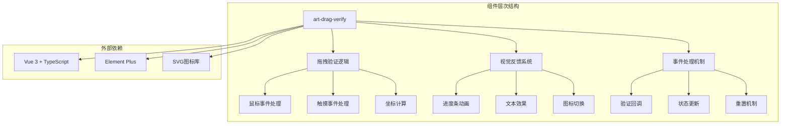
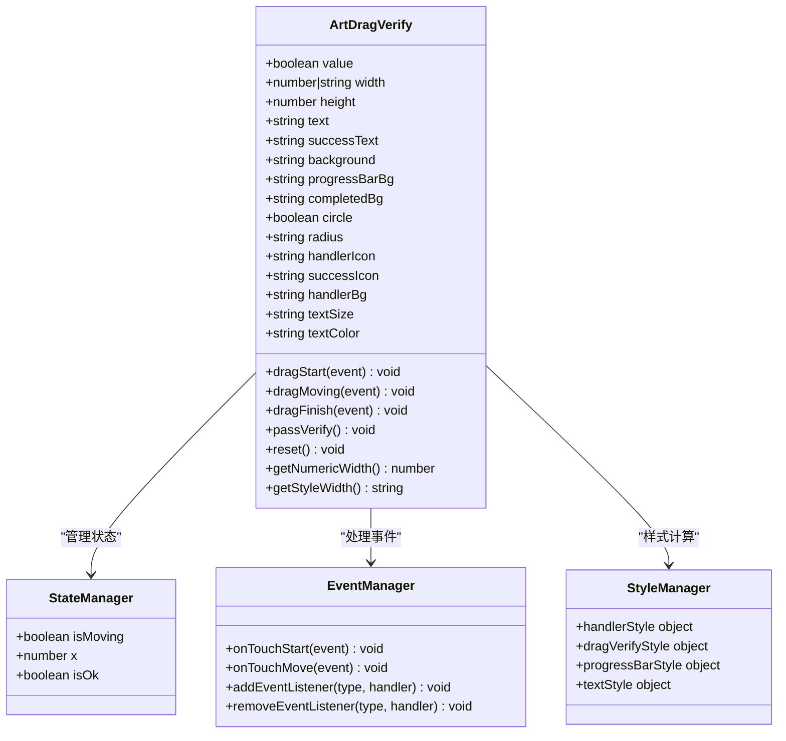
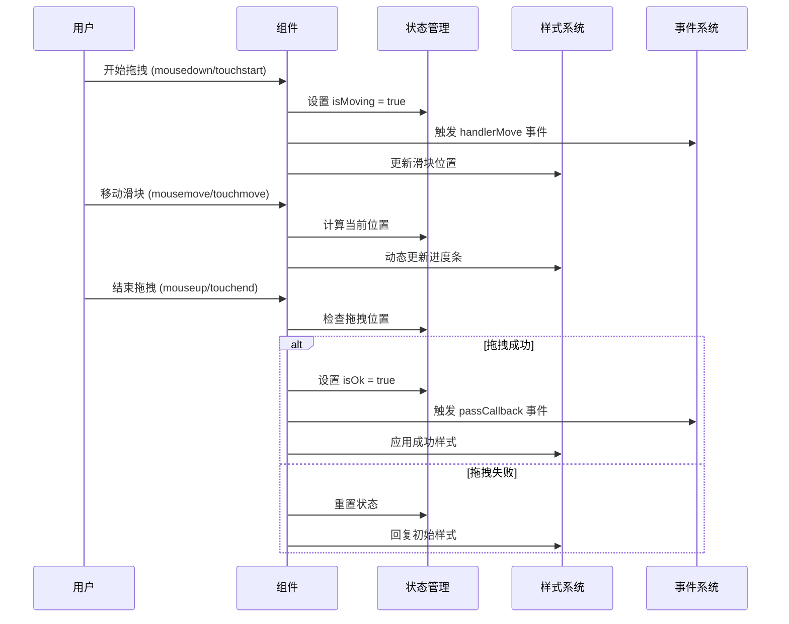
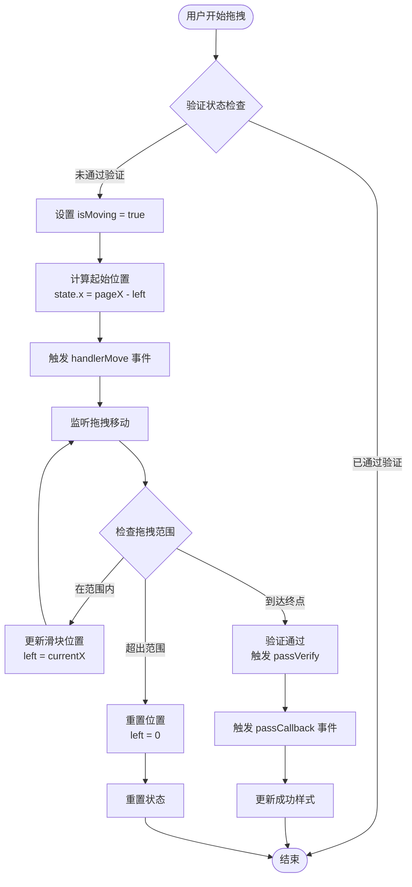
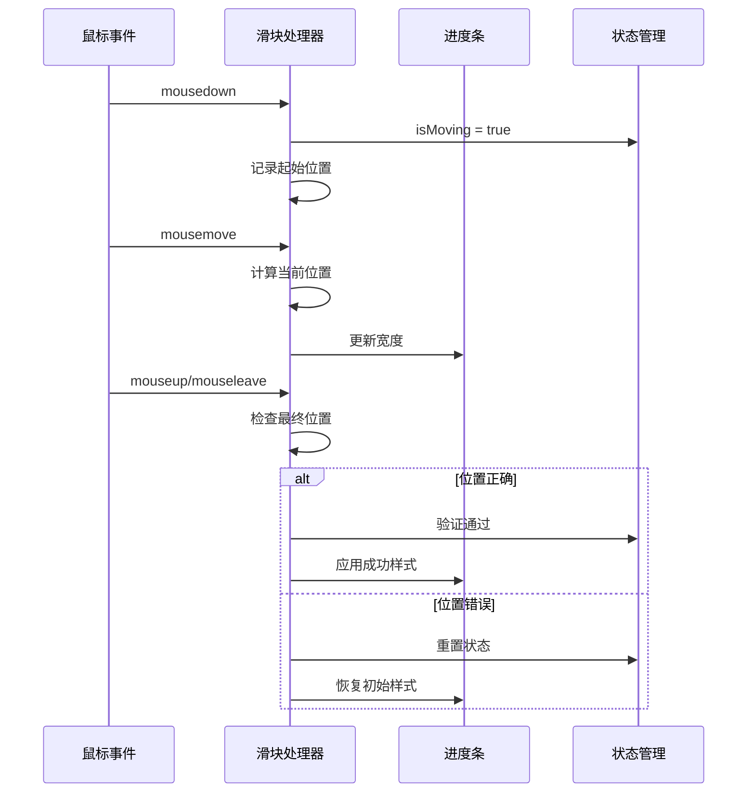
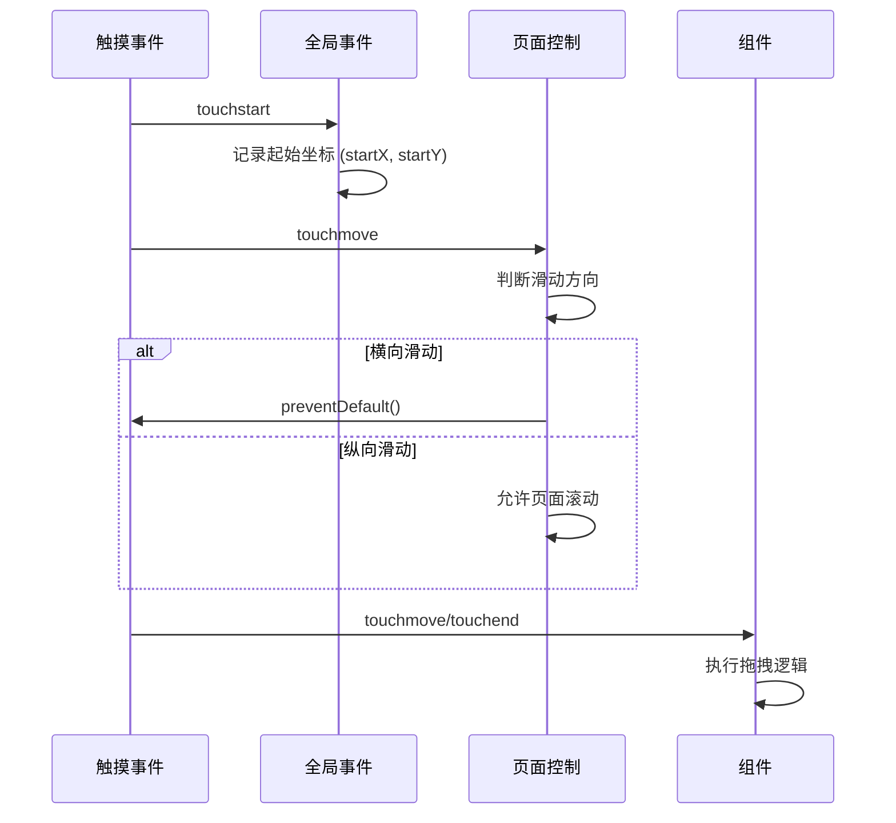
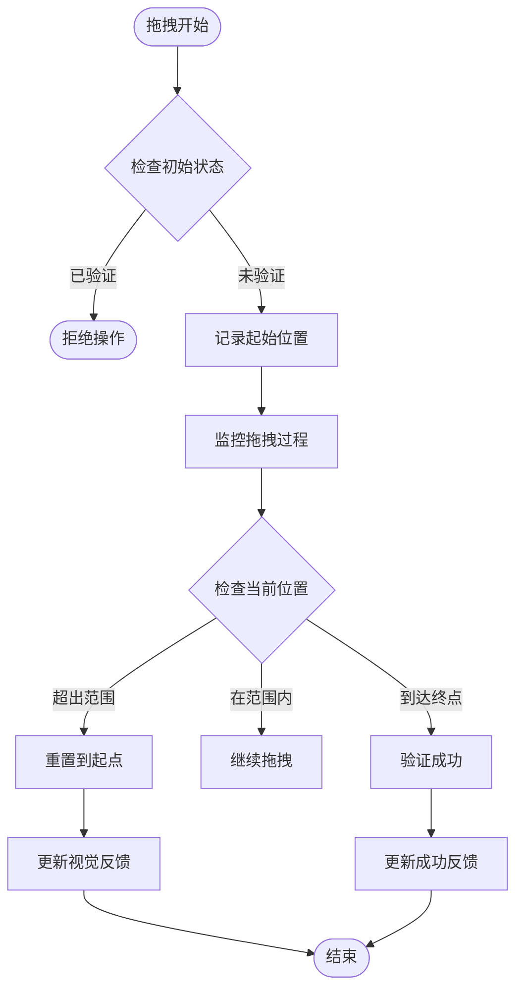
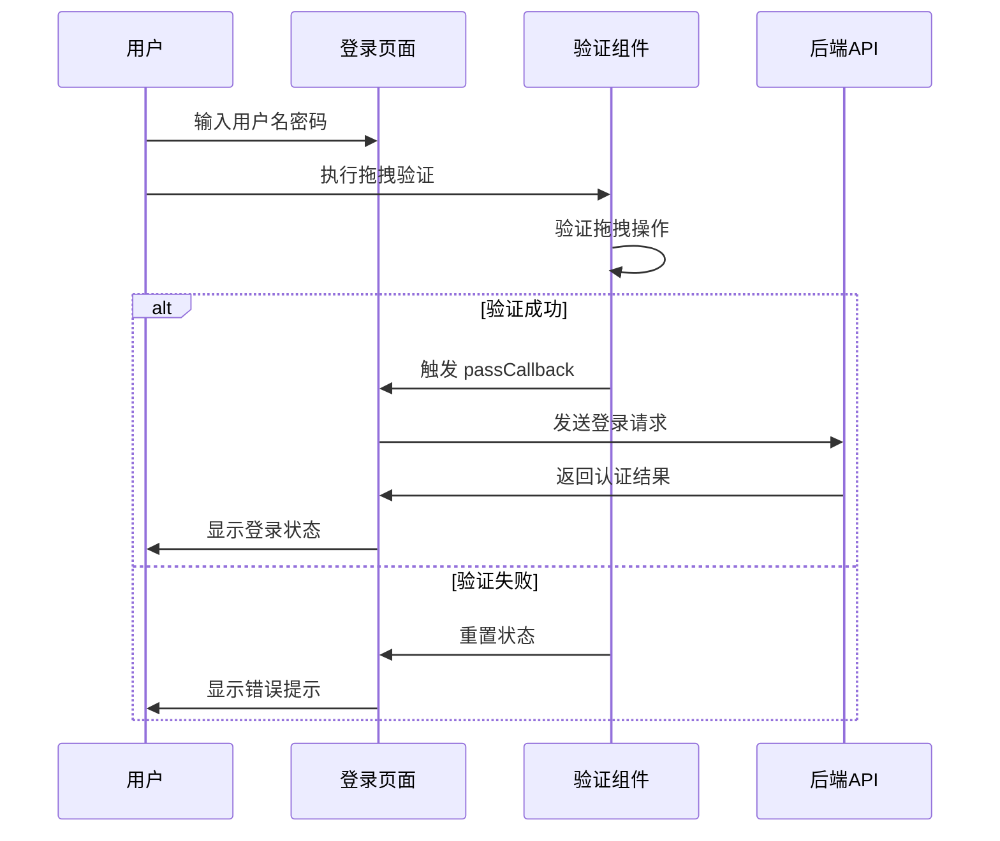
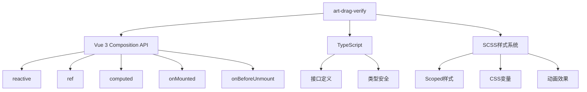

# 拖拽验证 (art-drag-verify) 技术文档

<cite>
**本文档中引用的文件**
- [index.vue](file://src/components/core/forms/art-drag-verify/index.vue)
- [login/index.vue](file://src/views/auth/login/index.vue)
- [auth.ts](file://src/api/auth.ts)
- [en.json](file://src/locales/langs/en.json)
- [zh.json](file://src/locales/langs/zh.json)
</cite>

## 目录
1. [简介](#简介)
2. [项目结构](#项目结构)
3. [核心组件](#核心组件)
4. [架构概览](#架构概览)
5. [详细组件分析](#详细组件分析)
6. [依赖关系分析](#依赖关系分析)
7. [性能考虑](#性能考虑)
8. [故障排除指南](#故障排除指南)
9. [结论](#结论)

## 简介

art-drag-verify是一个基于Vue 3和TypeScript开发的拖拽验证组件，专为提升Web应用的安全性和用户体验而设计。该组件采用直观的拖拽交互方式，结合视觉反馈和动画效果，为用户提供流畅的验证体验，同时具备基本的安全防护能力。

### 核心特性

- **直观的拖拽交互**：支持鼠标和触摸设备的拖拽操作
- **丰富的视觉反馈**：动态进度条、成功/失败状态指示
- **多种自定义选项**：灵活的样式配置和主题适配
- **移动端兼容**：完整的触摸事件支持和页面滑动控制
- **事件驱动架构**：完善的回调机制和状态管理

## 项目结构

art-drag-verify组件位于项目的表单组件目录中，与其他UI组件协同工作，形成统一的设计系统。



**图表来源**
- [index.vue](file://src/components/core/forms/art-drag-verify/index.vue#L1-L431)

**章节来源**
- [index.vue](file://src/components/core/forms/art-drag-verify/index.vue#L1-L50)

## 核心组件

### 组件架构设计

art-drag-verify采用模块化架构，将功能划分为独立的处理单元：



**图表来源**
- [index.vue](file://src/components/core/forms/art-drag-verify/index.vue#L49-L100)
- [index.vue](file://src/components/core/forms/art-drag-verify/index.vue#L102-L118)

### 核心数据结构

组件使用响应式状态管理系统，确保UI与业务逻辑的同步：

| 属性名称 | 类型 | 默认值 | 描述 |
|---------|------|--------|------|
| value | boolean | false | 验证状态标志 |
| width | number/string | '100%' | 组件宽度 |
| height | number | 40 | 组件高度 |
| text | string | '按住滑块拖动' | 默认提示文本 |
| successText | string | 'success' | 成功提示文本 |
| background | string | '#eee' | 背景颜色 |
| progressBarBg | string | '#1385FF' | 进度条背景色 |
| completedBg | string | '#57D187' | 完成状态背景色 |
| circle | boolean | false | 是否圆角 |
| radius | string | 'calc(var(--custom-radius) / 3 + 2px)' | 圆角半径 |
| handlerIcon | string | 'solar:double-alt-arrow-right-linear' | 滑块图标 |
| successIcon | string | 'ri:check-fill' | 成功图标 |
| handlerBg | string | '#fff' | 滑块背景色 |
| textSize | string | '13px' | 文本大小 |
| textColor | string | '#333' | 文本颜色 |

**章节来源**
- [index.vue](file://src/components/core/forms/art-drag-verify/index.vue#L49-L100)

## 架构概览

### 整体架构设计

art-drag-verify采用事件驱动的架构模式，通过清晰的职责分离实现松耦合的设计：



**图表来源**
- [index.vue](file://src/components/core/forms/art-drag-verify/index.vue#L235-L295)

### 事件处理流程

组件实现了完整的事件处理链路，支持鼠标和触摸两种输入方式：



**图表来源**
- [index.vue](file://src/components/core/forms/art-drag-verify/index.vue#L235-L295)

**章节来源**
- [index.vue](file://src/components/core/forms/art-drag-verify/index.vue#L231-L295)

## 详细组件分析

### 拖拽交互逻辑

#### 鼠标事件处理

组件支持标准的鼠标拖拽操作，提供了流畅的桌面端体验：



**图表来源**
- [index.vue](file://src/components/core/forms/art-drag-verify/index.vue#L235-L295)

#### 触摸事件处理

为了支持移动端设备，组件实现了完整的触摸事件处理机制：



**图表来源**
- [index.vue](file://src/components/core/forms/art-drag-verify/index.vue#L128-L149)

### 视觉反馈系统

#### 进度条动画效果

组件使用CSS动画实现平滑的进度条效果：

| 动画名称 | 持续时间 | 缓动函数 | 应用场景 |
|---------|----------|----------|----------|
| slidetounlock | 2s | cubic-bezier(0, 0.2, 1, 1) | 默认状态动画 |
| slidetounlock2 | 2s | cubic-bezier(0, 0.2, 1, 1) | 成功状态动画 |

#### 文本渐变效果

提示文本采用CSS渐变和动画实现动态效果：

```scss
.dv_text {
  background: linear-gradient(
    to right,
    var(--textColor) 0%,
    var(--textColor) 40%,
    #fff 50%,
    var(--textColor) 60%,
    var(--textColor) 100%
  );
  -webkit-background-clip: text;
  background-clip: text;
  animation: slidetounlock 2s cubic-bezier(0, 0.2, 1, 1) infinite;
  -webkit-text-fill-color: transparent;
}
```

#### 图标系统

组件使用SVG图标库提供丰富的视觉元素：

| 状态 | 图标类型 | 默认值 | 自定义选项 |
|------|----------|--------|------------|
| 初始状态 | 滑块图标 | solar:double-alt-arrow-right-linear | handlerIcon |
| 成功状态 | 对勾图标 | ri:check-fill | successIcon |

**章节来源**
- [index.vue](file://src/components/core/forms/art-drag-verify/index.vue#L336-L431)

### 安全验证机制

虽然art-drag-verify主要提供用户体验优化，但也包含了一些基础的安全防护措施：

#### 基础验证逻辑



**图表来源**
- [index.vue](file://src/components/core/forms/art-drag-verify/index.vue#L256-L295)

#### 抗自动化攻击特性

虽然当前版本主要关注用户体验，但以下设计原则有助于增强安全性：

1. **位置验证**：只有到达终点才视为验证成功
2. **状态管理**：严格的验证状态控制
3. **事件隔离**：独立的事件处理避免干扰

### API文档

#### 组件属性 (Props)

| 属性名 | 类型 | 默认值 | 必需 | 描述 |
|--------|------|--------|------|------|
| value | boolean | false | 是 | 验证状态，双向绑定 |
| width | number/string | '100%' | 否 | 组件宽度 |
| height | number | 40 | 否 | 组件高度 |
| text | string | '按住滑块拖动' | 否 | 默认提示文本 |
| successText | string | 'success' | 否 | 成功提示文本 |
| background | string | '#eee' | 否 | 背景颜色 |
| progressBarBg | string | '#1385FF' | 否 | 进度条背景色 |
| completedBg | string | '#57D187' | 否 | 完成状态背景色 |
| circle | boolean | false | 否 | 是否圆角 |
| radius | string | 'calc(var(--custom-radius) / 3 + 2px)' | 否 | 圆角半径 |
| handlerIcon | string | 'solar:double-alt-arrow-right-linear' | 否 | 滑块图标 |
| successIcon | string | 'ri:check-fill' | 否 | 成功图标 |
| handlerBg | string | '#fff' | 否 | 滑块背景色 |
| textSize | string | '13px' | 否 | 文本大小 |
| textColor | string | '#333' | 否 | 文本颜色 |

#### 事件 (Events)

| 事件名 | 参数 | 描述 |
|--------|------|------|
| handlerMove | - | 滑块移动时触发 |
| update:value | boolean | 验证状态变化时触发 |
| passCallback | - | 验证成功时触发 |

#### 方法 (Methods)

| 方法名 | 参数 | 返回值 | 描述 |
|--------|------|--------|------|
| reset | - | void | 重置验证状态 |

#### 插槽 (Slots)

| 插槽名 | 描述 |
|--------|------|
| textBefore | 提示文本前的内容 |
| textAfter | 提示文本后的扩展内容 |

**章节来源**
- [index.vue](file://src/components/core/forms/art-drag-verify/index.vue#L49-L47)

### 在登录场景中的集成

#### 实际应用场景

在登录页面中，art-drag-verify作为重要的安全验证环节：



**图表来源**
- [login/index.vue](file://src/views/auth/login/index.vue#L203-L255)

#### 集成配置示例

```typescript
// 登录页面中的组件配置
<ArtDragVerify
  ref="dragVerify"
  v-model:value="isPassing"
  :text="$t('login.sliderText')"
  textColor="var(--art-gray-700)"
  :successText="$t('login.sliderSuccessText')"
  :progressBarBg="getCssVar('--el-color-primary')"
  :background="isDark ? '#26272F' : '#F1F1F4'"
  handlerBg="var(--default-box-color)"
/>
```

**章节来源**
- [login/index.vue](file://src/views/auth/login/index.vue#L57-L66)

## 依赖关系分析

### 内部依赖

art-drag-verify组件具有清晰的内部依赖结构：



**图表来源**
- [index.vue](file://src/components/core/forms/art-drag-verify/index.vue#L43-L44)

### 外部依赖

组件依赖于以下外部库和资源：

| 依赖项 | 版本要求 | 用途 | 可选性 |
|--------|----------|------|--------|
| Vue 3 | ^3.0.0 | 核心框架 | 必需 |
| TypeScript | ^4.0.0 | 类型系统 | 必需 |
| Element Plus | ^2.0.0 | UI组件库 | 必需 |
| SVG图标库 | - | 图标渲染 | 必需 |

**章节来源**
- [index.vue](file://src/components/core/forms/art-drag-verify/index.vue#L1-L10)

## 性能考虑

### 渲染性能优化

1. **响应式状态管理**：使用Vue 3的组合式API实现高效的响应式更新
2. **事件节流**：合理使用事件监听器避免过度渲染
3. **CSS动画**：利用GPU加速的CSS变换实现流畅动画

### 内存管理

1. **事件清理**：组件卸载时自动移除事件监听器
2. **DOM引用管理**：及时清理不必要的DOM引用
3. **样式缓存**：预计算样式属性减少运行时开销

### 移动端优化

1. **被动事件监听**：对触摸事件使用被动模式
2. **触摸防抖**：智能判断滑动方向避免误触
3. **硬件加速**：利用transform属性获得更好的性能

## 故障排除指南

### 常见问题及解决方案

#### 拖拽不流畅

**问题描述**：拖拽过程中出现卡顿或延迟

**可能原因**：
- 事件监听器过多
- 样式计算复杂
- 浏览器性能问题

**解决方案**：
1. 检查是否有重复的事件监听器
2. 简化CSS选择器
3. 使用浏览器开发者工具分析性能瓶颈

#### 触摸事件失效

**问题描述**：在移动设备上无法正常拖拽

**可能原因**：
- 事件冒泡冲突
- 页面滚动干扰
- 触摸事件未正确绑定

**解决方案**：
1. 确保全局事件监听器正确绑定
2. 检查页面滚动控制逻辑
3. 验证触摸事件处理函数

#### 样式显示异常

**问题描述**：组件样式显示不正确

**可能原因**：
- CSS变量未正确设置
- 样式作用域冲突
- 主题切换问题

**解决方案**：
1. 检查CSS自定义属性设置
2. 验证scoped样式作用域
3. 确认主题变量正确传递

**章节来源**
- [index.vue](file://src/components/core/forms/art-drag-verify/index.vue#L174-L193)

## 结论

art-drag-verify拖拽验证组件是一个功能完整、设计精良的前端安全验证解决方案。它不仅提供了优秀的用户体验，还具备良好的可扩展性和维护性。

### 主要优势

1. **用户体验优秀**：直观的拖拽交互和流畅的动画效果
2. **技术架构先进**：基于Vue 3和TypeScript的现代前端技术栈
3. **跨平台兼容**：同时支持桌面和移动端设备
4. **高度可定制**：丰富的配置选项满足不同场景需求
5. **易于集成**：清晰的API设计便于快速部署

### 改进建议

1. **增强安全性**：可以考虑加入更多的安全验证机制
2. **性能优化**：进一步优化大型应用中的渲染性能
3. **国际化支持**：完善多语言环境下的本地化处理
4. **无障碍访问**：增加ARIA标签和键盘导航支持

art-drag-verify组件展现了现代前端开发的最佳实践，为构建安全、易用的Web应用提供了可靠的基础组件。