# 搜索栏 (art-search-bar) 组件专业文档

<cite>
**本文档中引用的文件**
- [index.vue](file://src/components/core/forms/art-search-bar/index.vue)
- [search-bar.vue](file://src/views/examples/forms/search-bar.vue)
- [user-search.vue](file://src/views/system/user/modules/user-search.vue)
- [role-search.vue](file://src/views/system/role/modules/role-search.vue)
- [tables/index.vue](file://src/views/examples/tables/index.vue)
- [global-search/index.vue](file://src/components/core/layouts/art-global-search/index.vue)
- [user.ts](file://src/store/modules/user.ts)
- [tableUtils.ts](file://src/utils/table/tableUtils.ts)
- [useTable.ts](file://src/hooks/core/useTable.ts)
</cite>

## 目录
1. [简介](#简介)
2. [项目结构](#项目结构)
3. [核心组件](#核心组件)
4. [架构概览](#架构概览)
5. [详细组件分析](#详细组件分析)
6. [依赖关系分析](#依赖关系分析)
7. [性能考虑](#性能考虑)
8. [故障排除指南](#故障排除指南)
9. [结论](#结论)

## 简介

art-search-bar 是一个功能强大的 Vue 3 搜索栏组件，基于 Element Plus 构建，提供了灵活的表单搜索功能。该组件支持多种输入类型、响应式设计、搜索历史管理和键盘导航等功能，广泛应用于内容管理系统、数据看板和各种需要搜索功能的场景。

### 主要特性

- **多样化输入组件支持**：支持 input、select、date、checkbox、radio 等多种输入类型
- **响应式设计**：适配不同屏幕尺寸，移动端体验优化
- **搜索历史管理**：内置本地存储和历史记录功能
- **键盘导航**：完整的无障碍访问支持
- **智能防抖**：优化搜索性能，减少不必要的 API 调用
- **国际化支持**：完整的多语言支持

## 项目结构

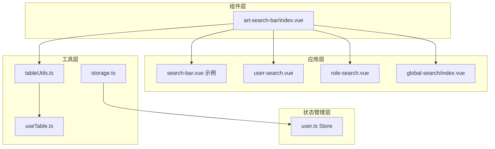

**图表来源**
- [index.vue](file://src/components/core/forms/art-search-bar/index.vue#L1-L50)
- [search-bar.vue](file://src/views/examples/forms/search-bar.vue#L1-L30)

**章节来源**
- [index.vue](file://src/components/core/forms/art-search-bar/index.vue#L1-L100)

## 核心组件

### 组件架构设计

art-search-bar 采用高度可配置的设计模式，通过 `SearchFormItem` 接口定义表单项配置，支持动态渲染和扩展。

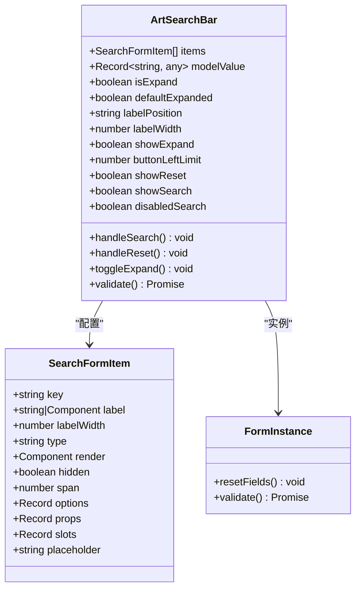

**图表来源**
- [index.vue](file://src/components/core/forms/art-search-bar/index.vue#L159-L182)
- [index.vue](file://src/components/core/forms/art-search-bar/index.vue#L104-L150)

**章节来源**
- [index.vue](file://src/components/core/forms/art-search-bar/index.vue#L159-L226)

## 架构概览

### 组件通信机制

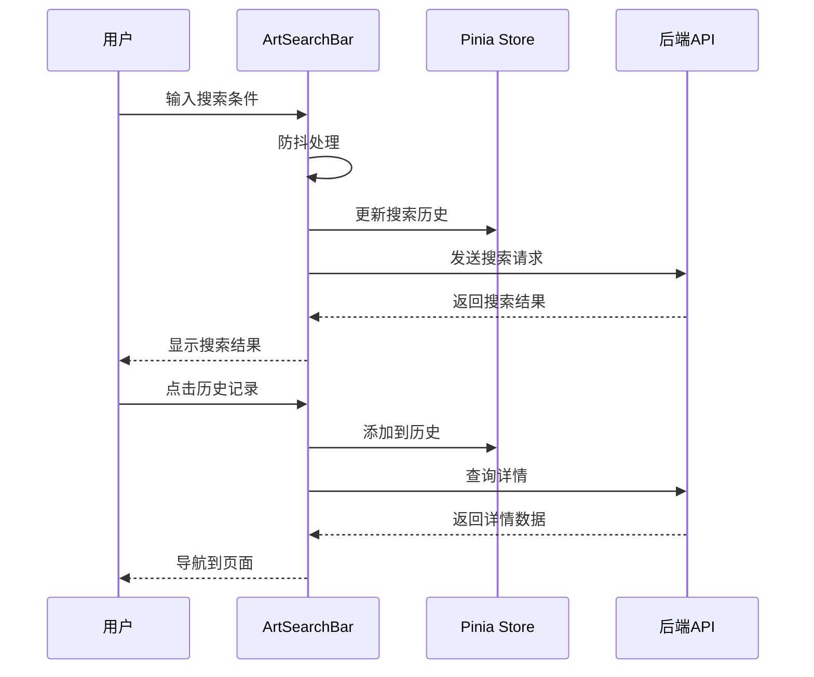

**图表来源**
- [global-search/index.vue](file://src/components/core/layouts/art-global-search/index.vue#L169-L176)
- [user.ts](file://src/store/modules/user.ts#L63-L64)

## 详细组件分析

### 搜索输入与快捷操作

#### 表单项配置系统

组件支持丰富的表单项类型，通过 `componentMap` 实现类型映射：

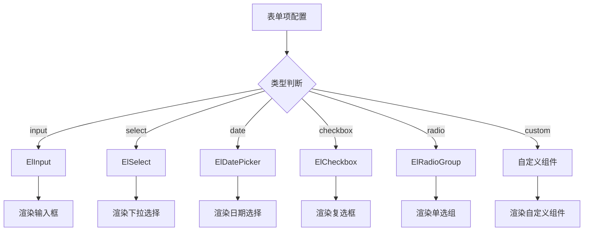

**图表来源**
- [index.vue](file://src/components/core/forms/art-search-bar/index.vue#L131-L149)

#### 快捷操作功能

组件提供搜索和重置两个核心操作按钮，支持自定义配置：

```mermaid
flowchart LR
A[搜索按钮] --> B[触发搜索事件]
C[重置按钮] --> D[重置表单字段]
C --> E[清空模型值]
C --> F[触发重置事件]
B --> G[emit('search')]
D --> H[formInstance.resetFields]
E --> I[Object.assign]
F --> J[emit('reset')]
```

**图表来源**
- [index.vue](file://src/components/core/forms/art-search-bar/index.vue#L330-L352)

**章节来源**
- [index.vue](file://src/components/core/forms/art-search-bar/index.vue#L330-L352)

### 历史记录管理

#### 搜索历史存储机制

组件集成了完整的搜索历史管理功能，支持本地存储和实时更新：

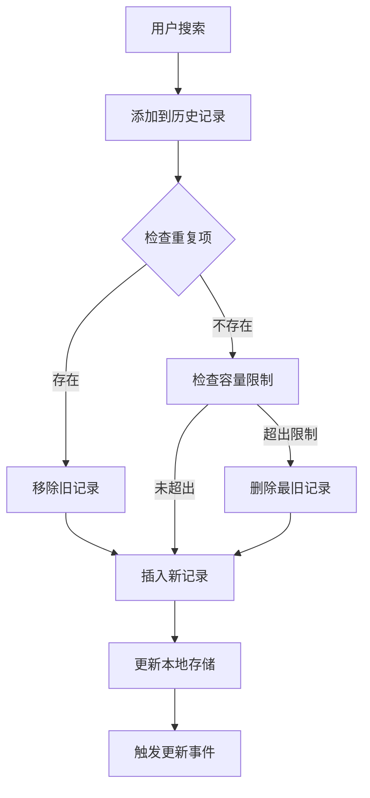

**图表来源**
- [global-search/index.vue](file://src/components/core/layouts/art-global-search/index.vue#L314-L329)
- [user.ts](file://src/store/modules/user.ts#L63-L64)

#### 历史记录数据结构

历史记录采用标准化的数据结构，便于维护和扩展：

| 字段 | 类型 | 描述 |
|------|------|------|
| path | string | 页面路径 |
| meta.title | string | 页面标题 |
| meta.icon | string | 页面图标 |
| meta.authList | string[] | 权限列表 |

**章节来源**
- [global-search/index.vue](file://src/components/core/layouts/art-global-search/index.vue#L314-L329)
- [user.ts](file://src/store/modules/user.ts#L63-L64)

### 搜索建议功能

#### 智能防抖搜索

组件实现了智能防抖机制，优化搜索性能：

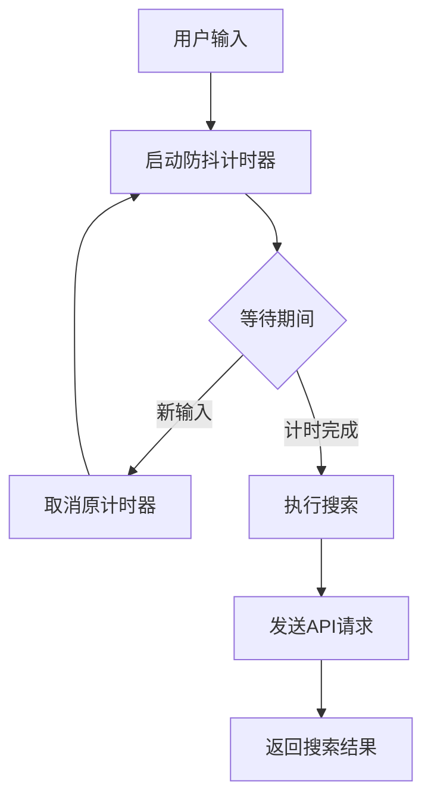

**图表来源**
- [tableUtils.ts](file://src/utils/table/tableUtils.ts#L202-L264)

#### 搜索结果展示

搜索结果采用卡片式布局，支持高亮显示和快捷操作：

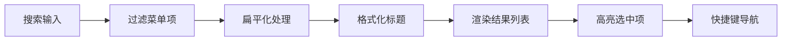

**图表来源**
- [global-search/index.vue](file://src/components/core/layouts/art-global-search/index.vue#L178-L189)

**章节来源**
- [tableUtils.ts](file://src/utils/table/tableUtils.ts#L202-L264)
- [global-search/index.vue](file://src/components/core/layouts/art-global-search/index.vue#L178-L189)

### 响应式设计

#### 断点适配策略

组件采用移动优先的设计理念，根据不同屏幕尺寸调整布局：

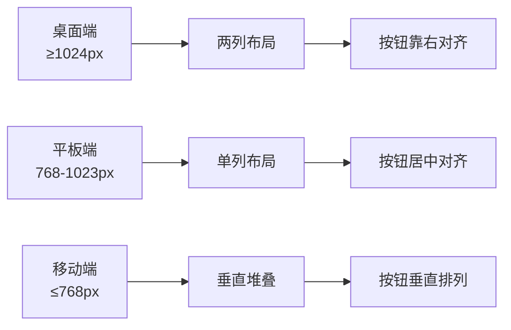

**图表来源**
- [index.vue](file://src/components/core/forms/art-search-bar/index.vue#L315-L321)

#### 展开收起功能

组件提供智能的展开收起功能，根据内容数量自动调整：

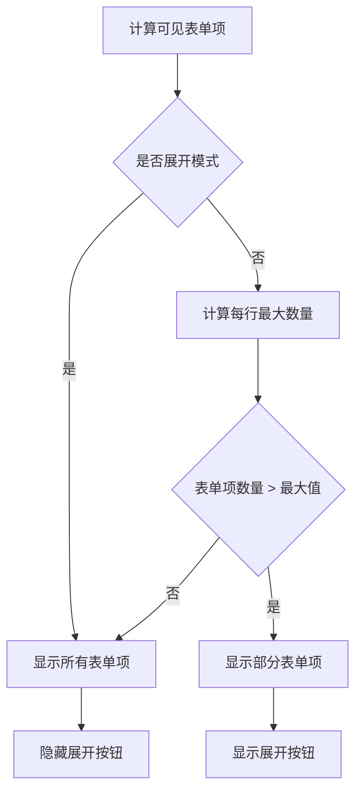

**图表来源**
- [index.vue](file://src/components/core/forms/art-search-bar/index.vue#L284-L302)

**章节来源**
- [index.vue](file://src/components/core/forms/art-search-bar/index.vue#L315-L321)
- [index.vue](file://src/components/core/forms/art-search-bar/index.vue#L284-L302)

### 键盘导航与无障碍访问

#### 键盘快捷键支持

组件支持完整的键盘导航，提升无障碍访问体验：

| 快捷键 | 功能 | 说明 |
|--------|------|------|
| Ctrl/Cmd+K | 打开搜索 | 全局快捷键 |
| Enter | 确认选择 | 在搜索结果中确认选中项 |
| Escape | 关闭对话框 | 退出搜索界面 |
| ↑/↓ | 上下导航 | 在搜索结果中切换高亮项 |
| Tab | 切换焦点 | 在表单项间切换 |

#### 无障碍设计实现

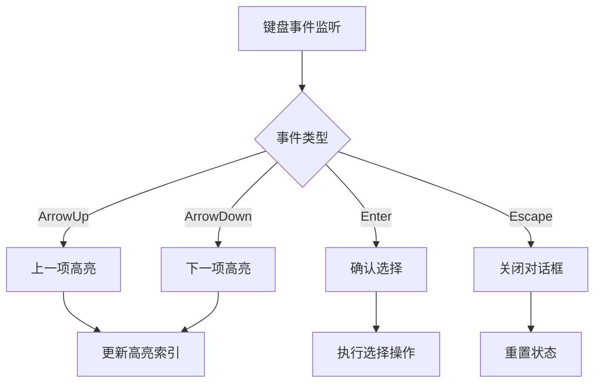

**图表来源**
- [global-search/index.vue](file://src/components/core/layouts/art-global-search/index.vue#L145-L160)

**章节来源**
- [global-search/index.vue](file://src/components/core/layouts/art-global-search/index.vue#L145-L160)

## 依赖关系分析

### 核心依赖关系

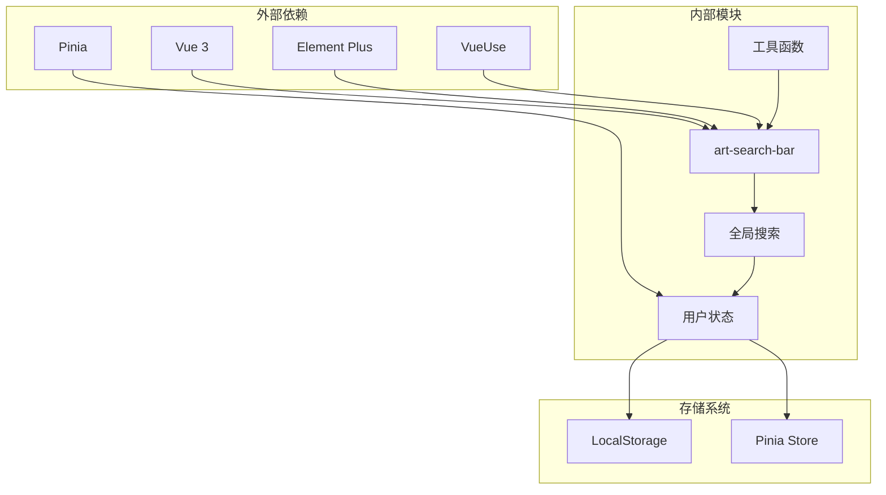

**图表来源**
- [index.vue](file://src/components/core/forms/art-search-bar/index.vue#L104-L126)
- [global-search/index.vue](file://src/components/core/layouts/art-global-search/index.vue#L97-L102)

### 组件间通信

组件通过多种方式实现通信：

1. **Props 传递**：父组件向子组件传递配置和数据
2. **事件发射**：子组件向父组件发送状态变化
3. **Pinia 状态管理**：跨组件共享搜索历史和用户状态
4. **本地存储**：持久化搜索历史和用户偏好

**章节来源**
- [index.vue](file://src/components/core/forms/art-search-bar/index.vue#L104-L126)
- [global-search/index.vue](file://src/components/core/layouts/art-global-search/index.vue#L97-L102)

## 性能考虑

### 搜索性能优化

#### 防抖机制实现

组件实现了智能防抖机制，避免频繁的 API 调用：

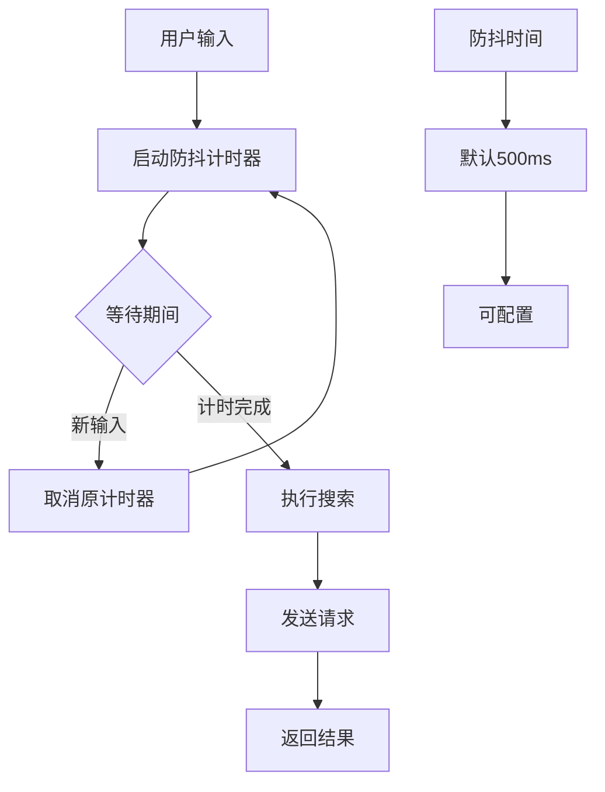

**图表来源**
- [tableUtils.ts](file://src/utils/table/tableUtils.ts#L202-L264)

#### 缓存策略

组件支持多种缓存策略，提升用户体验：

| 缓存策略 | 适用场景 | 描述 |
|----------|----------|------|
| CLEAR_CURRENT | 搜索时 | 清空当前搜索条件的缓存 |
| CLEAR_ALL | 重置时 | 清空所有缓存数据 |
| SMART_CACHE | 分页加载 | 智能缓存分页数据 |

**章节来源**
- [tableUtils.ts](file://src/utils/table/tableUtils.ts#L202-L264)
- [useTable.ts](file://src/hooks/core/useTable.ts#L428-L480)

### 内存管理

#### 组件卸载清理

组件在卸载时会清理相关资源：

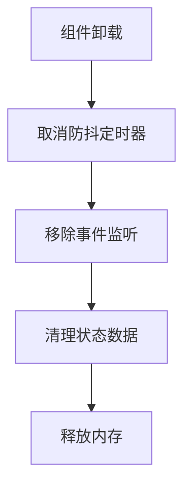

**图表来源**
- [global-search/index.vue](file://src/components/core/layouts/art-global-search/index.vue#L129-L132)

## 故障排除指南

### 常见问题及解决方案

#### 搜索建议不显示

**问题描述**：输入关键词后没有显示搜索建议

**可能原因**：
1. 搜索 API 配置错误
2. 防抖时间设置过短
3. 搜索结果为空

**解决方案**：
1. 检查 API 配置和网络连接
2. 调整防抖时间参数
3. 验证搜索逻辑和数据格式

#### 历史记录同步失败

**问题描述**：搜索历史无法正确保存或读取

**可能原因**：
1. LocalStorage 权限问题
2. 数据序列化失败
3. 存储空间不足

**解决方案**：
1. 检查浏览器存储权限
2. 验证数据结构的可序列化性
3. 清理过期的存储数据

#### 响应式布局异常

**问题描述**：在不同屏幕尺寸下布局错乱

**可能原因**：
1. 断点配置错误
2. 样式冲突
3. Flexbox 布局问题

**解决方案**：
1. 检查断点设置和媒体查询
2. 排查样式优先级冲突
3. 验证 Flexbox 属性配置

**章节来源**
- [global-search/index.vue](file://src/components/core/layouts/art-global-search/index.vue#L129-L132)
- [index.vue](file://src/components/core/forms/art-search-bar/index.vue#L315-L321)

### 调试技巧

#### 开发者工具使用

1. **Vue DevTools**：监控组件状态和事件
2. **Network Panel**：检查 API 请求和响应
3. **Application Panel**：查看 LocalStorage 和缓存
4. **Console**：查看错误日志和调试信息

#### 日志记录

组件提供了详细的日志记录功能，帮助开发者定位问题：

```typescript
// 搜索事件日志
console.log('搜索表单数据', formData.value)

// 重置事件日志  
console.log('重置表单')

// 防抖日志
console.log('防抖搜索执行')
```

## 结论

art-search-bar 组件是一个功能完备、设计精良的搜索解决方案，具有以下优势：

### 技术优势

1. **高度可配置**：支持多种输入类型和自定义组件
2. **性能优化**：智能防抖和缓存机制
3. **响应式设计**：适配各种设备和屏幕尺寸
4. **无障碍访问**：完整的键盘导航和快捷键支持
5. **状态管理**：集成 Pinia 实现状态持久化

### 应用场景

该组件适用于以下场景：
- 内容管理系统中的全文检索
- 数据看板中的条件筛选
- 用户管理系统的高级搜索
- 角色权限管理的查询功能

### 扩展建议

1. **搜索建议增强**：集成 AI 智能推荐算法
2. **搜索历史分析**：提供搜索行为统计功能
3. **多语言支持**：扩展更多语言包
4. **主题定制**：提供更多视觉风格选项

通过合理使用 art-search-bar 组件，开发者可以快速构建功能强大、用户体验优秀的搜索功能，提升应用的整体价值。