# 表单容器 (art-form)

<cite>
**本文档中引用的文件**
- [index.vue](file://src/components/core/forms/art-form/index.vue)
- [index.vue](file://src/views/examples/forms/index.vue)
- [responsive.ts](file://src/utils/form/responsive.ts)
- [validator.ts](file://src/utils/form/validator.ts)
- [formEnum.ts](file://src/enums/formEnum.ts)
- [index.ts](file://src/utils/form/index.ts)
- [user.ts](file://src/store/modules/user.ts)
- [index.ts](file://src/store/index.ts)
- [search-bar.vue](file://src/components/core/forms/art-search-bar/index.vue)
</cite>

## 目录
1. [简介](#简介)
2. [项目结构](#项目结构)
3. [核心组件](#核心组件)
4. [架构概览](#架构概览)
5. [详细组件分析](#详细组件分析)
6. [API接口文档](#api接口文档)
7. [业务场景集成](#业务场景集成)
8. [Vue3组合式API协同](#vue3组合式api协同)
9. [Pinia状态管理集成](#pinia状态管理集成)
10. [性能优化策略](#性能优化策略)
11. [常见问题解决方案](#常见问题解决方案)
12. [总结](#总结)

## 简介

Art Design Pro中的art-form组件是一个功能强大的表单容器，基于Element Plus构建，提供了灵活的表单配置、响应式布局、数据绑定和验证机制。该组件支持多种表单项类型，具备动态表单生成功能，并与Vue3组合式API和Pinia状态管理深度集成。

### 主要特性

- **灵活的表单配置**：支持多种表单项类型和自定义组件渲染
- **响应式布局**：智能的栅格系统和断点适配
- **数据绑定机制**：双向数据绑定和v-model支持
- **验证流程**：内置验证规则和异步验证支持
- **插槽系统**：丰富的插槽支持，满足复杂业务需求
- **状态管理集成**：与Pinia深度集成，支持状态持久化

## 项目结构

art-form组件在项目中的组织结构如下：

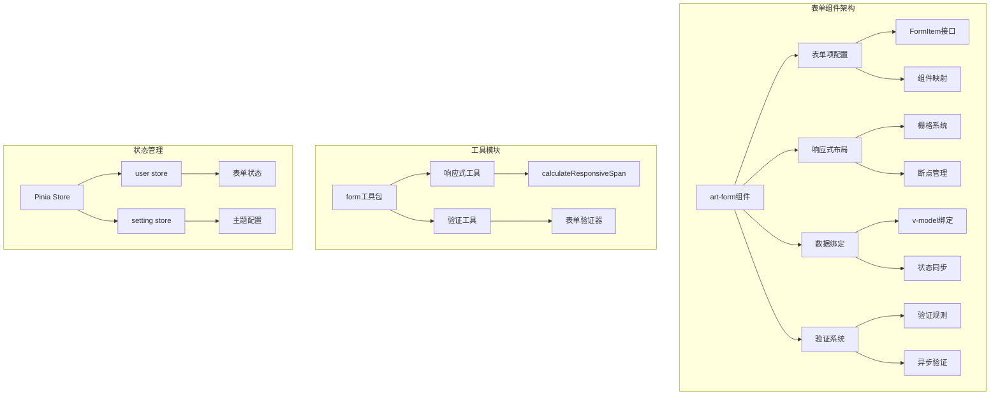

**图表来源**
- [index.vue](file://src/components/core/forms/art-form/index.vue#L1-L312)
- [index.ts](file://src/utils/form/index.ts#L1-L12)

**章节来源**
- [index.vue](file://src/components/core/forms/art-form/index.vue#L1-L50)

## 核心组件

### 表单容器组件

art-form组件是整个表单系统的中心，负责协调各个子组件和功能模块。

#### 主要功能模块

1. **表单项渲染引擎**：动态渲染各种类型的表单项
2. **响应式布局系统**：根据屏幕尺寸自动调整布局
3. **数据绑定管理**：处理双向数据绑定和状态同步
4. **事件处理机制**：管理表单提交、重置等事件
5. **插槽系统**：提供灵活的自定义渲染能力

#### 组件映射表

组件映射表定义了支持的所有表单项类型：

| 类型 | 组件 | 描述 |
|------|------|------|
| input | ElInput | 基础输入框 |
| inputtag | ElInputTag | 标签输入框 |
| number | ElInputNumber | 数字输入框 |
| select | ElSelect | 选择器 |
| switch | ElSwitch | 开关 |
| checkbox | ElCheckbox | 复选框 |
| checkboxgroup | ElCheckboxGroup | 复选框组 |
| radiogroup | ElRadioGroup | 单选框组 |
| date | ElDatePicker | 日期选择器 |
| daterange | ElDatePicker | 日期范围选择器 |
| datetime | ElDatePicker | 日期时间选择器 |
| rate | ElRate | 评分组件 |
| slider | ElSlider | 滑块组件 |
| cascader | ElCascader | 级联选择器 |
| treeselect | ElTreeSelect | 树形选择器 |

**章节来源**
- [index.vue](file://src/components/core/forms/art-form/index.vue#L124-L142)

## 架构概览

### 整体架构设计

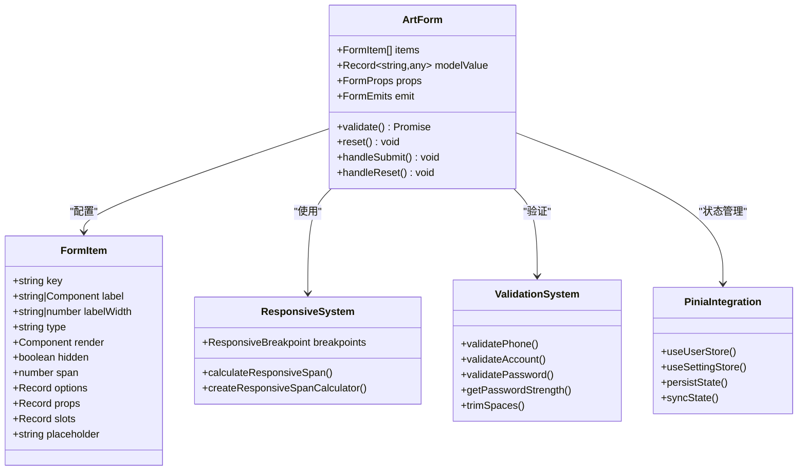

**图表来源**
- [index.vue](file://src/components/core/forms/art-form/index.vue#L152-L176)
- [responsive.ts](file://src/utils/form/responsive.ts#L37-L41)
- [validator.ts](file://src/utils/form/validator.ts#L1-L50)

### 数据流架构

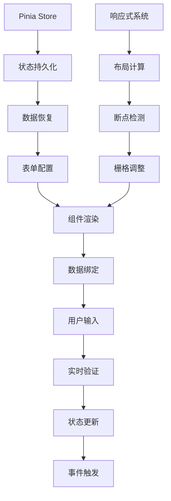

**图表来源**
- [index.vue](file://src/components/core/forms/art-form/index.vue#L261-L267)
- [responsive.ts](file://src/utils/form/responsive.ts#L63-L100)

**章节来源**
- [index.vue](file://src/components/core/forms/art-form/index.vue#L98-L311)

## 详细组件分析

### 表单项配置系统

#### FormItem接口详解

表单项配置系统是art-form的核心，提供了灵活的配置能力：

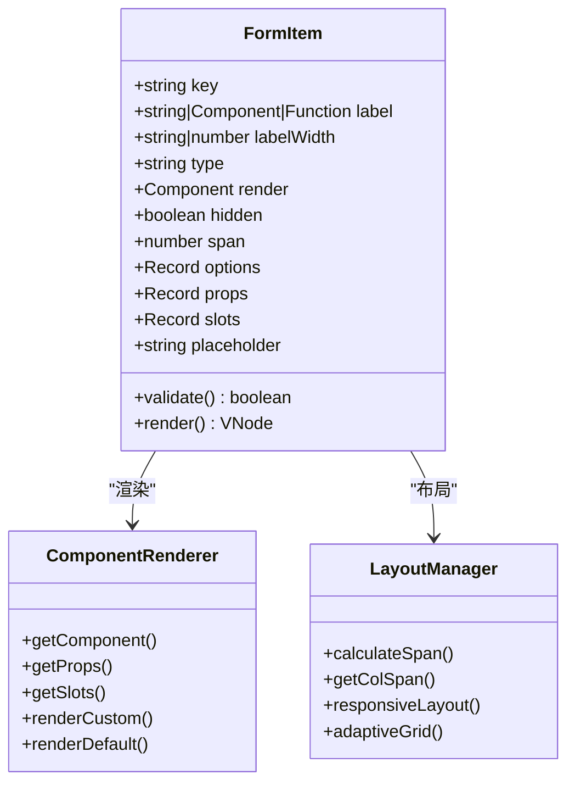

**图表来源**
- [index.vue](file://src/components/core/forms/art-form/index.vue#L152-L176)

#### 动态表单生成机制

动态表单生成是art-form的重要特性，支持根据配置动态创建表单：

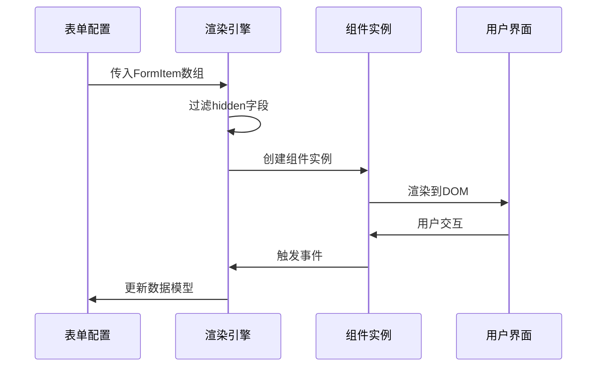

**图表来源**
- [index.vue](file://src/components/core/forms/art-form/index.vue#L264-L266)
- [index.vue](file://src/components/core/forms/art-form/index.vue#L242-L250)

**章节来源**
- [index.vue](file://src/components/core/forms/art-form/index.vue#L152-L176)

### 响应式布局系统

#### 断点管理系统

响应式布局系统基于Element Plus的栅格系统，实现了智能的断点适配：

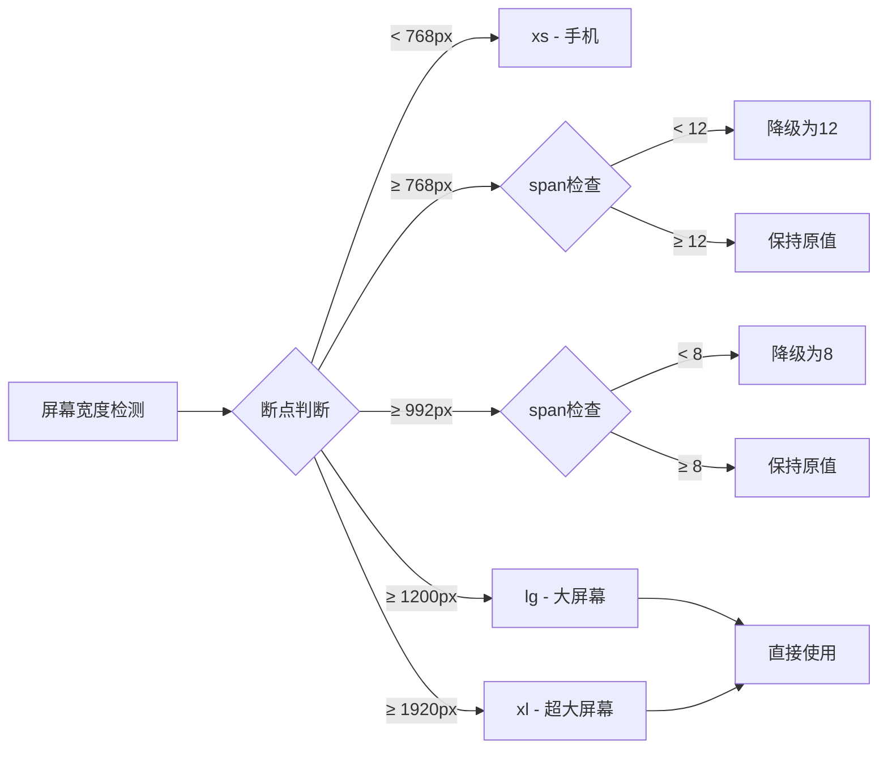

**图表来源**
- [responsive.ts](file://src/utils/form/responsive.ts#L55-L61)
- [responsive.ts](file://src/utils/form/responsive.ts#L63-L100)

#### 栅格系统配置

| 断点 | 最小宽度 | span阈值 | 降级值 | 说明 |
|------|----------|----------|--------|------|
| xs | < 768px | 12 | 24 | 手机端满宽显示 |
| sm | ≥ 768px | 12 | 12 | 平板端半宽显示 |
| md | ≥ 992px | 8 | 8 | 中等屏幕三分之一宽 |
| lg | ≥ 1200px | - | - | 直接使用设置值 |
| xl | ≥ 1920px | - | - | 直接使用设置值 |

**章节来源**
- [responsive.ts](file://src/utils/form/responsive.ts#L21-L61)

### 数据绑定机制

#### 双向数据绑定实现

art-form组件采用Vue3的v-model机制实现双向数据绑定：

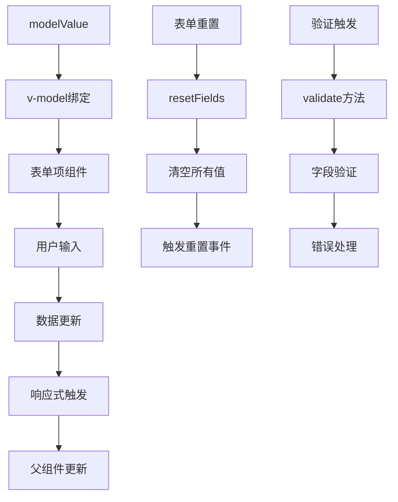

**图表来源**
- [index.vue](file://src/components/core/forms/art-form/index.vue#L283-L294)
- [index.vue](file://src/components/core/forms/art-form/index.vue#L303-L307)

#### 状态同步策略

状态同步确保表单数据与外部状态的一致性：

1. **实时同步**：用户输入时立即更新
2. **批量同步**：表单提交时批量更新
3. **延迟同步**：异步操作完成后的更新
4. **强制同步**：手动触发的状态同步

**章节来源**
- [index.vue](file://src/components/core/forms/art-form/index.vue#L219-L220)

### 验证系统

#### 验证规则体系

art-form组件集成了完整的表单验证系统：

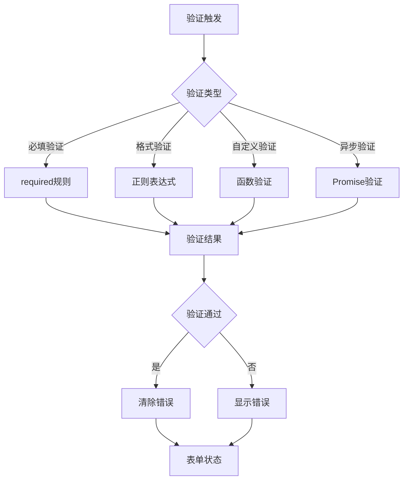

**图表来源**
- [validator.ts](file://src/utils/form/validator.ts#L59-L67)
- [validator.ts](file://src/utils/form/validator.ts#L89-L98)

#### 支持的验证规则

| 验证类型 | 规则描述 | 示例 |
|----------|----------|------|
| 手机号验证 | 中国大陆手机号格式 | 13812345678 |
| 固定电话验证 | 支持区号格式 | 010-12345678 |
| 用户账号验证 | 字母开头，5-20位 | username123 |
| 密码验证 | 包含字母和数字 | Pass123 |
| 强密码验证 | 大小写字母+数字+特殊字符 | Pass@123 |
| 身份证验证 | 18位身份证格式 | 11010519491231002X |
| 银行卡验证 | Luhn算法验证 | 6222021203000000000 |

**章节来源**
- [validator.ts](file://src/utils/form/validator.ts#L59-L200)

## API接口文档

### Props接口定义

#### FormProps配置

| 属性 | 类型 | 默认值 | 说明 |
|------|------|--------|------|
| items | FormItem[] | [] | 表单项配置数组 |
| span | number | 6 | 每列宽度（基于24格布局） |
| gutter | number | 12 | 表单控件间隙 |
| labelPosition | 'left'\|'right'\|'top' | 'right' | 标签位置 |
| labelWidth | string\|number | '70px' | 标签宽度 |
| buttonLeftLimit | number | 2 | 按钮靠左对齐限制 |
| showReset | boolean | true | 是否显示重置按钮 |
| showSubmit | boolean | true | 是否显示提交按钮 |
| disabledSubmit | boolean | false | 是否禁用提交按钮 |

#### FormItem配置

| 属性 | 类型 | 说明 |
|------|------|------|
| key | string | 表单项唯一标识 |
| label | string \| Component \| Function | 标签文本或自定义渲染 |
| labelWidth | string \| number | 标签宽度（覆盖全局设置） |
| type | keyof typeof componentMap \| string | 表单项类型 |
| render | Component \| Function | 自定义渲染函数 |
| hidden | boolean | 是否隐藏 |
| span | number | 列宽（基于24格系统） |
| options | Record<string, any> | 选项数据 |
| props | Record<string, any> | 传递给组件的属性 |
| slots | Record<string, Function> | 插槽配置 |
| placeholder | string | 占位符文本 |

### Events事件

#### FormEmits事件

| 事件名 | 参数 | 说明 |
|--------|------|------|
| reset | [] | 表单重置事件 |
| submit | [] | 表单提交事件 |

### Slots插槽

#### 默认插槽

| 插槽名 | 参数 | 说明 |
|--------|------|------|
| {item.key} | {item, modelValue} | 动态插槽，支持自定义渲染 |

#### 自定义插槽

```typescript
// 插槽使用示例
<ArtForm>
  <template #slots>
    <ElInput v-model="formData.customField" placeholder="自定义组件" />
  </template>
</ArtForm>
```

### Exposed暴露的API

| 方法 | 参数 | 返回值 | 说明 |
|------|------|--------|------|
| validate | ...args | Promise | 验证表单 |
| reset | - | void | 重置表单 |
| ref | - | FormInstance | 表单实例引用 |

**章节来源**
- [index.vue](file://src/components/core/forms/art-form/index.vue#L178-L209)
- [index.vue](file://src/components/core/forms/art-form/index.vue#L212-L215)
- [index.vue](file://src/components/core/forms/art-form/index.vue#L303-L307)

## 业务场景集成

### 用户信息编辑场景

在用户信息编辑场景中，art-form组件可以灵活配置各种输入类型：

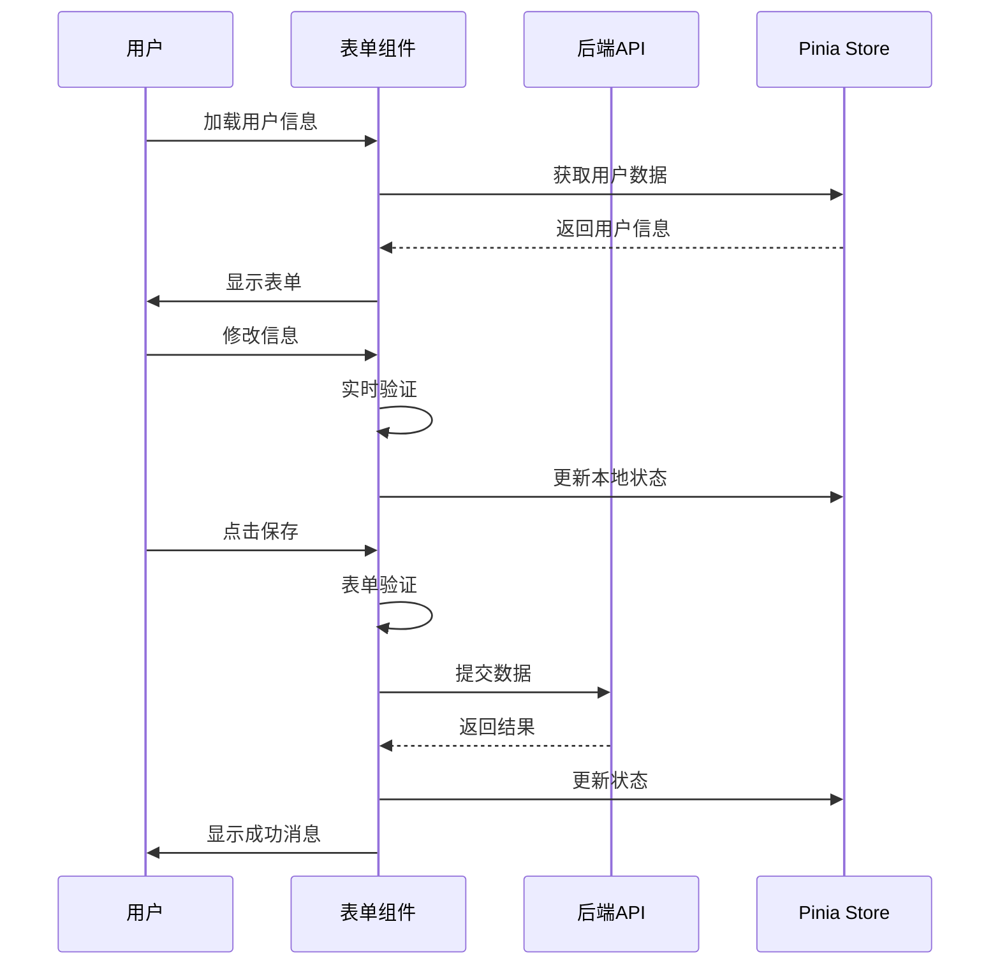

**图表来源**
- [index.vue](file://src/views/examples/forms/index.vue#L103-L121)
- [user.ts](file://src/store/modules/user.ts#L50-L200)

### 系统配置设置场景

系统配置场景需要处理复杂的配置项和验证规则：

| 配置项 | 类型 | 验证规则 | 说明 |
|--------|------|----------|------|
| 端口设置 | number | 1-65535 | 服务器端口配置 |
| 超时设置 | number | > 0 | 请求超时时间 |
| 日志级别 | select | 枚举值 | 日志输出级别 |
| 主题设置 | radio | 枚举值 | 界面主题选择 |
| 权限配置 | checkbox | 必填 | 功能权限开关 |

### 搜索表单场景

搜索表单场景展示了art-form在查询场景中的应用：

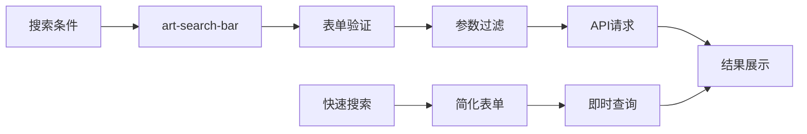

**图表来源**
- [search-bar.vue](file://src/components/core/forms/art-search-bar/index.vue#L1-L200)

**章节来源**
- [index.vue](file://src/views/examples/forms/index.vue#L1-L741)

## Vue3组合式API协同

### 响应式数据管理

art-form组件与Vue3组合式API深度集成，提供了灵活的响应式数据管理：

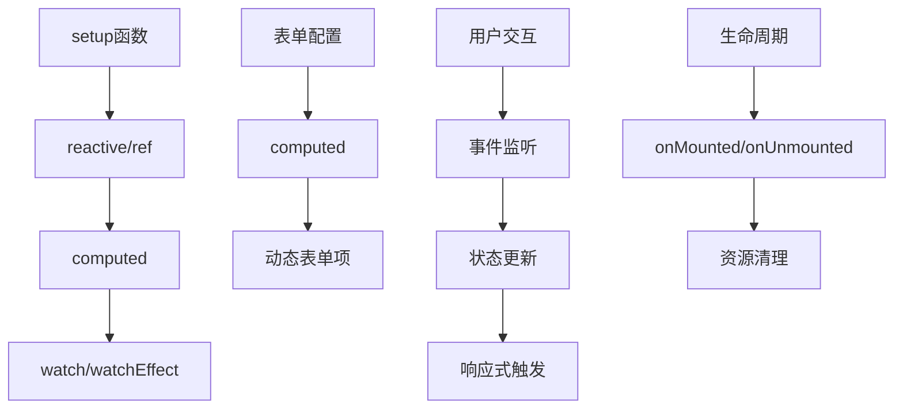

**图表来源**
- [index.vue](file://src/components/core/forms/art-form/index.vue#L264-L267)
- [index.vue](file://src/components/core/forms/art-form/index.vue#L309-L311)

### 组合式函数封装

为了更好地与Vue3组合式API协同，可以封装专门的组合式函数：

```typescript
// useForm组合式函数示例
export function useForm<T>() {
  const formRef = ref()
  const formData = ref<T>({} as T)
  
  const validate = () => formRef.value?.validate()
  const reset = () => formRef.value?.reset()
  
  return {
    formRef,
    formData,
    validate,
    reset
  }
}
```

### 生命周期管理

art-form组件在Vue3生命周期中的表现：

1. **onMounted**：初始化表单状态和事件监听
2. **onUpdated**：处理数据更新和重新渲染
3. **onUnmounted**：清理事件监听和定时器
4. **onActivated/onDeactivated**：处理keep-alive状态

**章节来源**
- [index.vue](file://src/components/core/forms/art-form/index.vue#L98-L311)

## Pinia状态管理集成

### 状态持久化策略

art-form组件与Pinia的集成采用了智能的状态持久化策略：

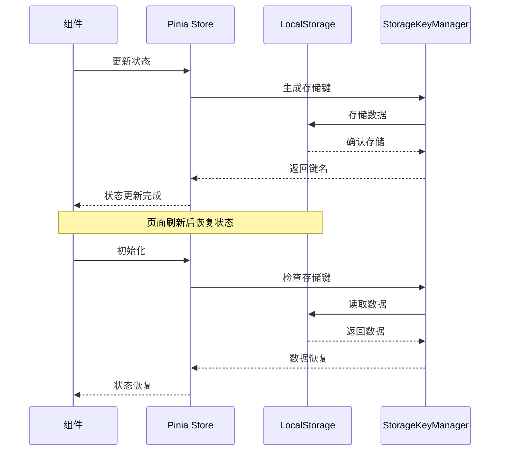

**图表来源**
- [index.ts](file://src/store/index.ts#L25-L52)
- [storage-key-manager.ts](file://src/utils/storage/storage-key-manager.ts#L38-L51)

### 状态管理模式

#### 用户状态管理

用户状态管理包含了表单相关的配置和偏好设置：

| 状态项 | 类型 | 说明 |
|--------|------|------|
| language | LanguageEnum | 语言设置 |
| isLogin | boolean | 登录状态 |
| info | UserInfo | 用户信息 |
| searchHistory | AppRouteRecord[] | 搜索历史 |
| accessToken | string | 访问令牌 |
| refreshToken | string | 刷新令牌 |

#### 设置状态管理

设置状态管理涵盖了表单的各种配置选项：

| 配置项 | 类型 | 默认值 | 说明 |
|--------|------|--------|------|
| labelPosition | 'left'\|'right'\|'top' | 'right' | 标签位置 |
| labelWidth | string\|number | '70px' | 标签宽度 |
| span | number | 6 | 列宽 |
| gutter | number | 12 | 间距 |
| showReset | boolean | true | 显示重置按钮 |
| showSubmit | boolean | true | 显示提交按钮 |

### 数据迁移机制

当应用版本升级时，art-form组件的状态管理具备自动数据迁移能力：

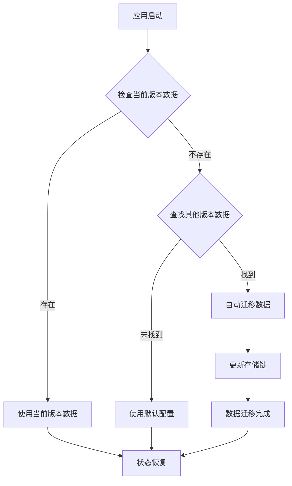

**图表来源**
- [storage-key-manager.ts](file://src/utils/storage/storage-key-manager.ts#L42-L51)

**章节来源**
- [user.ts](file://src/store/modules/user.ts#L50-L200)
- [index.ts](file://src/store/index.ts#L25-L52)

## 性能优化策略

### 大数据量渲染优化

对于包含大量表单项的复杂表单，art-form组件采用了多种性能优化策略：

#### 虚拟滚动技术

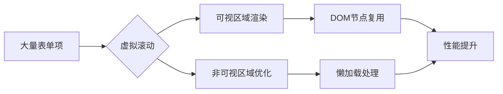

#### 组件懒加载

对于复杂的自定义组件，采用懒加载策略：

```typescript
// 懒加载组件示例
const LazyComponent = defineAsyncComponent(() => import('./LazyComponent.vue'))
```

#### 计算属性缓存

利用Vue3的计算属性缓存机制：

```typescript
const visibleFormItems = computed(() => {
  // 缓存计算结果，避免重复计算
  return props.items.filter(item => !item.hidden)
})
```

### 异步验证优化

#### 防抖处理

对于需要网络请求的异步验证，采用防抖处理：

```typescript
import { debounce } from 'lodash-es'

const validateAsync = debounce(async (value: string) => {
  // 异步验证逻辑
}, 300)
```

#### 验证状态管理

管理验证状态以避免重复验证：

```typescript
const validationState = ref(new Map())

const getValidationState = (key: string) => {
  return validationState.value.get(key)
}

const setValidationState = (key: string, state: boolean) => {
  validationState.value.set(key, state)
}
```

### 内存泄漏防护

#### 事件监听器清理

确保在组件销毁时清理事件监听器：

```typescript
onUnmounted(() => {
  // 清理事件监听器
  window.removeEventListener('resize', handleResize)
})
```

#### 引用清理

及时清理不再需要的引用：

```typescript
onUnmounted(() => {
  formRef.value = null
  formData.value = null
})
```

**章节来源**
- [index.vue](file://src/components/core/forms/art-form/index.vue#L145-L147)

## 常见问题解决方案

### 验证状态不同步问题

#### 问题描述

验证状态与表单数据状态不一致的问题。

#### 解决方案

1. **强制同步验证状态**：
```typescript
// 在数据更新后强制重新验证
watch(formData, () => {
  formRef.value?.validate()
}, { deep: true })
```

2. **使用验证钩子**：
```typescript
const { validate } = useForm()
validate().then(result => {
  // 处理验证结果
})
```

### 动态字段更新失效问题

#### 问题描述

动态添加或删除表单项后，表单无法正确响应。

#### 解决方案

1. **使用key强制更新**：
```vue
<ArtForm :key="formKey" :items="formItems" />
```

2. **重新计算visibleFormItems**：
```typescript
const formKey = ref(0)
const refreshForm = () => {
  formKey.value++
}
```

### 自定义组件渲染问题

#### 问题描述

自定义组件无法正确渲染或通信。

#### 解决方案

1. **正确的render函数**：
```typescript
render: () => h(CustomComponent, {
  modelValue: formData.value.customField,
  'onUpdate:modelValue': (val) => {
    formData.value.customField = val
  }
})
```

2. **插槽传递**：
```vue
<ArtForm>
  <template #customField>
    <CustomComponent v-model="formData.customField" />
  </template>
</ArtForm>
```

### 响应式布局问题

#### 问题描述

在不同屏幕尺寸下布局异常。

#### 解决方案

1. **检查断点配置**：
```typescript
// 确保断点配置正确
const breakpointConfig = {
  xs: { threshold: 12, fallback: 24 },
  sm: { threshold: 12, fallback: 12 },
  md: { threshold: 8, fallback: 8 }
}
```

2. **调试布局**：
```typescript
// 添加布局调试信息
console.log('Current span:', getColSpan(span, 'md'))
```

### 状态管理冲突问题

#### 问题描述

Pinia状态与组件本地状态冲突。

#### 解决方案

1. **明确状态来源**：
```typescript
// 区分本地状态和全局状态
const localFormData = ref({})
const globalFormData = useUserStore().userInfo
```

2. **状态同步策略**：
```typescript
// 定期同步状态
watch(localFormData, (newValue) => {
  useUserStore().updateUserInfo(newValue)
}, { deep: true })
```

**章节来源**
- [index.vue](file://src/components/core/forms/art-form/index.vue#L283-L294)
- [index.vue](file://src/components/core/forms/art-form/index.vue#L264-L267)

## 总结

Art Design Pro中的art-form组件是一个功能强大、设计精良的表单解决方案。它不仅提供了完整的表单功能，还与Vue3组合式API和Pinia状态管理深度集成，为开发者提供了灵活、高效的开发体验。

### 核心优势

1. **灵活性**：支持多种表单项类型和自定义渲染
2. **响应式**：智能的栅格系统和断点适配
3. **可扩展性**：丰富的插槽系统和事件机制
4. **性能优化**：针对大数据量和复杂场景的优化
5. **状态管理**：与Pinia的无缝集成

### 最佳实践建议

1. **合理使用配置**：根据业务需求选择合适的配置项
2. **性能监控**：关注大数据量场景下的性能表现
3. **状态管理**：遵循单一数据源原则
4. **错误处理**：完善的错误处理和用户体验
5. **测试覆盖**：确保各种场景下的功能稳定性

art-form组件为现代Web应用的表单开发提供了标准化、可扩展的解决方案，是Art Design Pro生态系统中的重要组成部分。